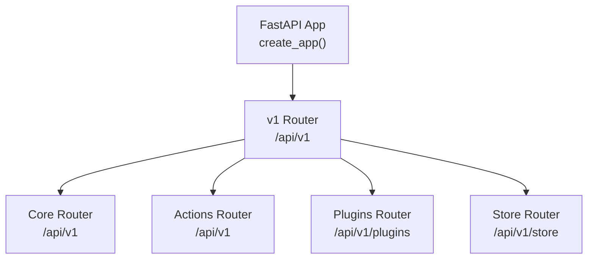
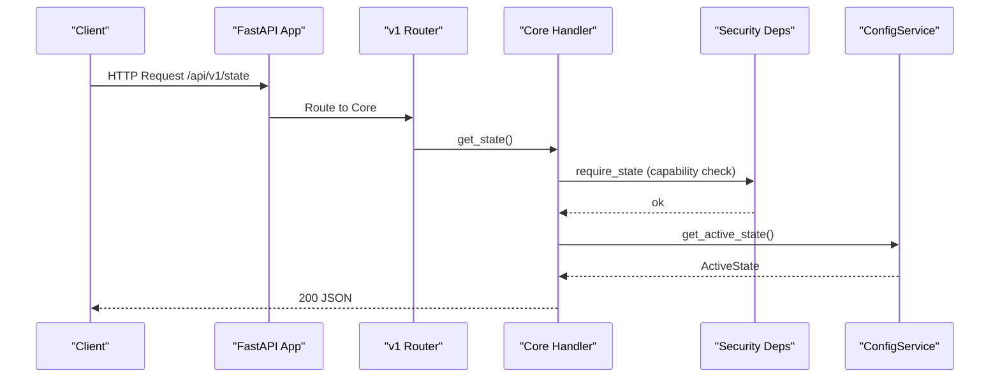
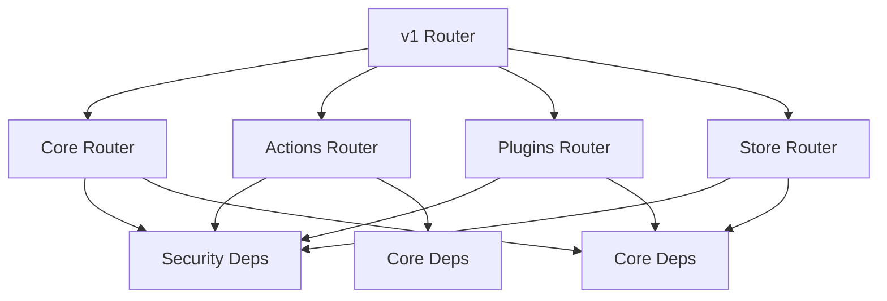

# API Reference

<cite>
**Referenced Files in This Document**
- [main.py](file://main.py)
- [app_factory.py](file://app_factory.py)
- [api/v1/__init__.py](file://api/v1/__init__.py)
- [api/v1/core.py](file://api/v1/core.py)
- [api/v1/actions.py](file://api/v1/actions.py)
- [api/v1/plugins.py](file://api/v1/plugins.py)
- [api/v1/store.py](file://api/v1/store.py)
- [core/security/deps.py](file://core/security/deps.py)
- [depends/v1/core_deps.py](file://depends/v1/core_deps.py)
- [core/contracts/models.py](file://core/contracts/models.py)
- [core/contracts/errors.py](file://core/contracts/errors.py)
- [config/settings.py](file://config/settings.py)
- [core/bus/quota.py](file://core/bus/quota.py)
</cite>

## Table of Contents
1. [Introduction](#introduction)
2. [Project Structure](#project-structure)
3. [Core Components](#core-components)
4. [Architecture Overview](#architecture-overview)
5. [Detailed Component Analysis](#detailed-component-analysis)
6. [Dependency Analysis](#dependency-analysis)
7. [Performance Considerations](#performance-considerations)
8. [Troubleshooting Guide](#troubleshooting-guide)
9. [Conclusion](#conclusion)
10. [Appendices](#appendices)

## Introduction
This document describes the Oko Dashboard REST API, focusing on the single API version currently implemented: v1. It covers endpoint groups (core, actions, plugins, store), their HTTP methods, URL patterns, request/response schemas, authentication and authorization requirements, error handling, rate limiting, pagination, and practical usage guidance. The API is built with FastAPI and organized under a single router mounted at /api/v1.

## Project Structure
The API is composed of a versioned router that aggregates four endpoint groups:
- Core: system state, configuration, widgets registry, events streaming
- Actions: action registry, validation, execution, history
- Plugins: plugin lifecycle, manifests, services, settings, registry
- Store: plugin store integration

**Diagram sources**
- [app_factory.py:87-124](file://app_factory.py#L87-L124)
- [api/v1/__init__.py:9-13](file://api/v1/__init__.py#L9-L13)

**Section sources**
- [main.py:17-21](file://main.py#L17-L21)
- [app_factory.py:87-124](file://app_factory.py#L87-L124)
- [api/v1/__init__.py:9-13](file://api/v1/__init__.py#L9-L13)

## Core Components
- API Versioning: Single version v1 exposed via /api/v1
- Authentication and Authorization:
  - X-Oko-Actor header is mandatory for all endpoints
  - Capability-based authorization enforced per endpoint via capability requirements
- Error Handling:
  - Standardized error envelope with code, message, details, timestamps
  - Validation errors mapped to a structured format
- Rate Limiting:
  - Implemented at storage bus level using token-bucket enforcement for plugins
  - Enforced for QPS, KV bytes, row bytes, and query limits

**Section sources**
- [core/security/deps.py:31-36](file://core/security/deps.py#L31-L36)
- [core/security/deps.py:16-28](file://core/security/deps.py#L16-L28)
- [core/contracts/errors.py:9-41](file://core/contracts/errors.py#L9-L41)
- [app_factory.py:63-84](file://app_factory.py#L63-L84)
- [core/bus/quota.py:17-63](file://core/bus/quota.py#L17-L63)

## Architecture Overview
The API is served by a FastAPI application that mounts the v1 router. Endpoint handlers depend on injected services from the application container. Security checks are performed via dependency providers that validate actor and capability headers. Some endpoints stream Server-Sent Events for real-time updates.

**Diagram sources**
- [api/v1/core.py:237-244](file://api/v1/core.py#L237-L244)
- [core/security/deps.py:40-41](file://core/security/deps.py#L40-L41)
- [depends/v1/core_deps.py:16-18](file://depends/v1/core_deps.py#L16-L18)

## Detailed Component Analysis

### API Versions and Base URL
- Version: v1
- Base URL: /api/v1
- Additional mount prefixes:
  - Plugins: /api/v1/plugins
  - Store: /api/v1/store

**Section sources**
- [api/v1/__init__.py:9-13](file://api/v1/__init__.py#L9-L13)

### Core Group (/api/v1)
Purpose: Provide system state, configuration, widget registry, and event streaming.

- GET /health
  - Description: Returns health status including role and timestamp
  - Authentication: Not guarded by capability requirement
  - Response: JSON object with keys ok, role, ts
  - Example: {"ok": true, "role": "backend", "ts": "2025-01-01T00:00:00Z"}

- GET /state
  - Description: Get current active configuration state
  - Authentication: Requires capability read.state
  - Response: ActiveState model (active_revision, state_seq, updated_at, updated_by, reason)
  - Example: See ActiveState schema

- GET /config
  - Description: Get active configuration revision
  - Authentication: Requires capability read.config
  - Response: Configuration payload (JSON object)

- POST /config/import
  - Description: Import new configuration
  - Authentication: Requires capability write.config.import
  - Request: ConfigImportRequest (format, payload, source)
  - Response: ConfigStateResponse (active_state, revision)
  - Example: See ConfigImportRequest and ConfigStateResponse

- POST /config/validate
  - Description: Validate configuration payload
  - Authentication: Requires capability write.config.import
  - Request: ConfigValidateRequest (format, payload)
  - Response: ConfigValidationResponse (valid, issues, config)

- POST /config/patch
  - Description: Patch active configuration
  - Authentication: Requires capability write.config.patch
  - Request: ConfigPatchRequest (patch, source)
  - Response: ConfigStateResponse

- POST /config/rollback
  - Description: Rollback to a previous revision
  - Authentication: Requires capability write.config.rollback
  - Request: ConfigRollbackRequest (revision, source)
  - Response: ConfigStateResponse

- GET /config/revisions
  - Description: List configuration revisions
  - Authentication: Requires capability read.config.revisions
  - Query: limit (integer, default 50, min 1, max 500)
  - Response: Array of ConfigRevision

- GET /widgets/registry
  - Description: List widget registry entries
  - Authentication: Requires capability read.registry.widgets
  - Response: Array of WidgetRegistryEntry

- GET /events/stream
  - Description: Stream server-sent events for system and health snapshots
  - Authentication: Requires capability read.events
  - Query: once (boolean, default false)
  - Response: text/event-stream with SSE envelopes
  - Notes: Uses keepalive and retry headers; disconnect handled gracefully

- GET /favicon
  - Description: Fetch and cache favicon for a given URL
  - Query: url (string, validated)
  - Response: 307 redirect to cached media URL or 404/413/5xx as appropriate

**Section sources**
- [api/v1/core.py:43-49](file://api/v1/core.py#L43-L49)
- [api/v1/core.py:237-244](file://api/v1/core.py#L237-L244)
- [api/v1/core.py:246-251](file://api/v1/core.py#L246-L251)
- [api/v1/core.py:254-261](file://api/v1/core.py#L254-L261)
- [api/v1/core.py:264-270](file://api/v1/core.py#L264-L270)
- [api/v1/core.py:273-280](file://api/v1/core.py#L273-L280)
- [api/v1/core.py:283-290](file://api/v1/core.py#L283-L290)
- [api/v1/core.py:293-300](file://api/v1/core.py#L293-L300)
- [api/v1/core.py:303-308](file://api/v1/core.py#L303-L308)
- [api/v1/core.py:311-373](file://api/v1/core.py#L311-L373)
- [api/v1/core.py:199-234](file://api/v1/core.py#L199-L234)

### Actions Group (/api/v1)
Purpose: Manage action registry, validation, execution, and history.

- GET /actions/registry
  - Description: List available actions
  - Authentication: Requires capability read.registry.actions
  - Response: Array of ActionRegistryEntry

- POST /actions/validate
  - Description: Validate an action envelope
  - Authentication: Requires capability exec.actions.validate
  - Request: ActionEnvelope
  - Response: ActionValidationResponse

- POST /actions/execute
  - Description: Execute an action
  - Authentication: Requires capability exec.actions.execute
  - Request: ActionEnvelope
  - Response: ActionExecutionResponse

- GET /actions/history
  - Description: Retrieve action execution history
  - Authentication: Requires capability read.actions.history
  - Query: limit (integer, default 50, min 1, max 500)
  - Response: Array of ActionStatus

**Section sources**
- [api/v1/actions.py:23-28](file://api/v1/actions.py#L23-L28)
- [api/v1/actions.py:31-38](file://api/v1/actions.py#L31-L38)
- [api/v1/actions.py:41-48](file://api/v1/actions.py#L41-L48)
- [api/v1/actions.py:51-57](file://api/v1/actions.py#L51-L57)

### Plugins Group (/api/v1/plugins)
Purpose: Manage plugins lifecycle, discover manifests/services/settings, and query registry.

- GET /plugins
  - Description: List plugins with optional state filter
  - Authentication: Requires capability read.plugins.list
  - Query: state (string, enum: discovered, loading, active, error, disabled)
  - Response: Object with plugins array and total count

- GET /plugins/{plugin_id}/manifest
  - Description: Resolve and return plugin page manifest
  - Authentication: Requires capability read.plugins.manifest
  - Path: plugin_id (string)
  - Response: Manifest payload with page manifest attached

- GET /plugins/{plugin_id}/services
  - Description: Retrieve plugin-provided services
  - Authentication: Requires capability read.plugins.services
  - Path: plugin_id (string)
  - Response: Object with plugin_id and service definitions

- GET /plugins/{plugin_id}/settings
  - Description: Retrieve plugin settings
  - Authentication: Requires capability read.plugins.services
  - Path: plugin_id (string)
  - Response: Object with plugin_id and settings

- PUT /plugins/{plugin_id}/settings
  - Description: Update plugin settings
  - Authentication: Requires capability write.config.patch
  - Path: plugin_id (string)
  - Request: JSON object (optional, defaults to empty object)
  - Response: Object with plugin_id and updated settings

- GET /plugins/registry
  - Description: Get registry of plugins with capabilities
  - Authentication: Requires capability read.registry.actions
  - Response: Object with plugins array and total count

- GET /plugins/{plugin_id}
  - Description: Get detailed information about a specific plugin
  - Authentication: Requires capability read.plugins.list
  - Path: plugin_id (string)
  - Response: Plugin details

- POST /plugins/{plugin_id}/load
  - Description: Load a plugin into memory
  - Authentication: Requires capability exec.actions.execute
  - Path: plugin_id (string)
  - Response: Object with status and loaded plugin info

- POST /plugins/{plugin_id}/unload
  - Description: Unload a plugin from memory
  - Authentication: Requires capability exec.actions.execute
  - Path: plugin_id (string)
  - Response: Object with status and plugin_id

- POST /plugins/{plugin_id}/reload
  - Description: Reload a plugin
  - Authentication: Requires capability exec.actions.execute
  - Path: plugin_id (string)
  - Response: Object with status and reloaded plugin info

- POST /plugins/{plugin_id}/enable
  - Description: Enable a disabled plugin
  - Authentication: Requires capability exec.actions.execute
  - Path: plugin_id (string)
  - Response: Object with status and enabled plugin info

- POST /plugins/{plugin_id}/disable
  - Description: Disable a plugin
  - Authentication: Requires capability exec.actions.execute
  - Path: plugin_id (string)
  - Response: Object with status and plugin_id

- DELETE /plugins/{plugin_id}
  - Description: Delete plugin from local directory
  - Authentication: Requires capability exec.actions.execute
  - Path: plugin_id (string)
  - Response: Object with status, plugin_id, and message

**Section sources**
- [api/v1/plugins.py:23-54](file://api/v1/plugins.py#L23-L54)
- [api/v1/plugins.py:57-80](file://api/v1/plugins.py#L57-L80)
- [api/v1/plugins.py:83-112](file://api/v1/plugins.py#L83-L112)
- [api/v1/plugins.py:115-143](file://api/v1/plugins.py#L115-L143)
- [api/v1/plugins.py:146-175](file://api/v1/plugins.py#L146-L175)
- [api/v1/plugins.py:178-212](file://api/v1/plugins.py#L178-L212)
- [api/v1/plugins.py:215-229](file://api/v1/plugins.py#L215-L229)
- [api/v1/plugins.py:232-251](file://api/v1/plugins.py#L232-L251)
- [api/v1/plugins.py:254-267](file://api/v1/plugins.py#L254-L267)
- [api/v1/plugins.py:270-287](file://api/v1/plugins.py#L270-L287)
- [api/v1/plugins.py:290-309](file://api/v1/plugins.py#L290-L309)
- [api/v1/plugins.py:312-325](file://api/v1/plugins.py#L312-L325)
- [api/v1/plugins.py:328-358](file://api/v1/plugins.py#L328-L358)

### Store Group (/api/v1/store)
Purpose: Integrate with the plugin store to list, fetch, and manage plugin installation.

- GET /store
  - Description: Get store availability and list available plugins
  - Authentication: Not guarded by capability requirement
  - Response: Object with available flag, plugins array, and total count

- GET /store/health
  - Description: Check store health
  - Authentication: Not guarded by capability requirement
  - Response: Object with available flag and status

- GET /store/{plugin_id}
  - Description: Get specific plugin manifest from store
  - Authentication: Not guarded by capability requirement
  - Path: plugin_id (string)
  - Response: Plugin manifest object

- POST /store/{plugin_id}/install
  - Description: Install plugin from store to local backend
  - Authentication: Not guarded by capability requirement
  - Path: plugin_id (string)
  - Response: Object with status, plugin info, and message

- POST /store/{plugin_id}/uninstall
  - Description: Uninstall plugin from local backend
  - Authentication: Not guarded by capability requirement
  - Path: plugin_id (string)
  - Response: Object with status, plugin_id, and message

**Section sources**
- [api/v1/store.py:11-36](file://api/v1/store.py#L11-L36)
- [api/v1/store.py:39-49](file://api/v1/store.py#L39-L49)
- [api/v1/store.py:52-62](file://api/v1/store.py#L52-L62)
- [api/v1/store.py:65-88](file://api/v1/store.py#L65-L88)
- [api/v1/store.py:91-110](file://api/v1/store.py#L91-L110)

### Authentication and Authorization
- Headers:
  - X-Oko-Actor: Required for all endpoints; identifies the requester
  - X-Oko-Capabilities: Required for capability checks; comma-separated list of granted capabilities
- Capabilities:
  - read.state, read.config, write.config.import, write.config.patch, write.config.rollback, read.config.revisions, read.events, read.registry.widgets, read.registry.actions, exec.actions.validate, exec.actions.execute, read.actions.history, read.plugins.list, read.plugins.manifest, read.plugins.services
- Behavior:
  - Missing actor header results in 401
  - Missing capability results in 403 with standardized error envelope

**Section sources**
- [core/security/deps.py:16-28](file://core/security/deps.py#L16-L28)
- [core/security/deps.py:31-36](file://core/security/deps.py#L31-L36)
- [core/security/deps.py:40-54](file://core/security/deps.py#L40-L54)

### Error Handling
- Standardized error envelope:
  - Fields: code, message, details, request_id, trace_id, retryable, ts
- HTTP status mapping:
  - ApiError exceptions are returned as JSON with status_code
  - RequestValidationError is mapped to 422 with details
- Examples:
  - Capability missing: 403 with code "capability_required"
  - Actor missing: 401 with code "actor_required"
  - Validation failures: 422 with details array

**Section sources**
- [core/contracts/errors.py:9-41](file://core/contracts/errors.py#L9-L41)
- [app_factory.py:63-84](file://app_factory.py#L63-L84)

### Rate Limiting
- Scope: Storage operations invoked by plugins
- Enforcement:
  - Token-bucket QPS limiter per plugin and message type
  - Limits enforced for KV bytes, row bytes, and query limits
- Effects:
  - Exceeding QPS raises StorageRateLimited
  - Violating KV/row size raises StorageLimitExceeded
  - Missing explicit limit for queries raises StorageQueryNotAllowed

**Section sources**
- [core/bus/quota.py:17-63](file://core/bus/quota.py#L17-L63)

### Pagination
- Applies to:
  - GET /config/revisions (limit parameter)
  - GET /actions/history (limit parameter)
- Defaults and bounds:
  - Default limit: 50
  - Min: 1, Max: 500

**Section sources**
- [api/v1/core.py:297](file://api/v1/core.py#L297)
- [api/v1/actions.py:55](file://api/v1/actions.py#L55)

### Request/Response Schemas
- Core:
  - ConfigImportRequest, ConfigValidateRequest, ConfigPatchRequest, ConfigRollbackRequest
  - ConfigStateResponse, ConfigValidationResponse, ConfigRevision
  - ActiveState, WidgetRegistryEntry
  - EventEnvelope
- Actions:
  - ActionEnvelope, ActionRegistryEntry, ActionValidationResponse, ActionExecutionResponse, ActionStatus
- Plugins:
  - Plugin discovery and lifecycle responses are returned as generic objects; see endpoint responses above
- Store:
  - Responses are returned as generic objects; see endpoint responses above

**Section sources**
- [core/contracts/models.py:10-134](file://core/contracts/models.py#L10-L134)

### Practical Usage Examples
- Retrieve active state:
  - Method: GET
  - URL: /api/v1/state
  - Headers: X-Oko-Actor: <actor>, X-Oko-Capabilities: read.state
  - Response: ActiveState JSON

- Validate configuration:
  - Method: POST
  - URL: /api/v1/config/validate
  - Headers: X-Oko-Actor: <actor>, X-Oko-Capabilities: write.config.import
  - Body: ConfigValidateRequest (format, payload)
  - Response: ConfigValidationResponse

- Execute an action:
  - Method: POST
  - URL: /api/v1/actions/execute
  - Headers: X-Oko-Actor: <actor>, X-Oko-Capabilities: exec.actions.execute
  - Body: ActionEnvelope
  - Response: ActionExecutionResponse

- Stream events:
  - Method: GET
  - URL: /api/v1/events/stream?once=false
  - Headers: X-Oko-Actor: <actor>, X-Oko-Capabilities: read.events
  - Response: text/event-stream

- List plugins with state filter:
  - Method: GET
  - URL: /api/v1/plugins?state=active
  - Headers: X-Oko-Actor: <actor>, X-Oko-Capabilities: read.plugins.list
  - Response: { "plugins": [...], "total": N }

- Install plugin from store:
  - Method: POST
  - URL: /api/v1/store/{plugin_id}/install
  - Headers: X-Oko-Actor: <actor>, X-Oko-Capabilities: exec.actions.execute
  - Response: Installation summary

**Section sources**
- [api/v1/core.py:237-244](file://api/v1/core.py#L237-L244)
- [api/v1/core.py:264-270](file://api/v1/core.py#L264-L270)
- [api/v1/actions.py:41-48](file://api/v1/actions.py#L41-L48)
- [api/v1/core.py:311-373](file://api/v1/core.py#L311-L373)
- [api/v1/plugins.py:23-54](file://api/v1/plugins.py#L23-L54)
- [api/v1/store.py:65-88](file://api/v1/store.py#L65-L88)

### Client Implementation Guidelines
- Authentication:
  - Always send X-Oko-Actor header
  - Include X-Oko-Capabilities matching required capabilities for the endpoint
- Error handling:
  - Parse standardized error envelopes on 4xx/5xx
  - Treat 422 as validation error with details
- Streaming:
  - For /events/stream, handle SSE frames and keepalive messages
- Retry:
  - Use exponential backoff for transient errors indicated as retryable
- Pagination:
  - Respect limit bounds and iterate with subsequent requests when needed

[No sources needed since this section provides general guidance]

## Dependency Analysis
The API relies on dependency injection to obtain services and enforces security via annotated dependencies.

**Diagram sources**
- [api/v1/__init__.py:9-13](file://api/v1/__init__.py#L9-L13)
- [core/security/deps.py:38-54](file://core/security/deps.py#L38-L54)
- [depends/v1/core_deps.py:13-39](file://depends/v1/core_deps.py#L13-L39)

**Section sources**
- [api/v1/core.py:37-38](file://api/v1/core.py#L37-L38)
- [api/v1/actions.py:17-18](file://api/v1/actions.py#L17-L18)
- [api/v1/plugins.py:16-17](file://api/v1/plugins.py#L16-L17)
- [api/v1/store.py:5-6](file://api/v1/store.py#L5-L6)

## Performance Considerations
- Event streaming:
  - Keepalive interval and retry configured via settings
  - Disconnections are handled gracefully
- Favicon proxy:
  - Caching reduces upstream requests; configurable TTL and size limits
- Health checks:
  - Window size and retention days influence historical metrics
- Rate limiting:
  - Token-bucket enforcement prevents overload; tune per-plugin limits accordingly

**Section sources**
- [config/settings.py:54-82](file://config/settings.py#L54-L82)
- [api/v1/core.py:199-234](file://api/v1/core.py#L199-L234)

## Troubleshooting Guide
- 401 Unauthorized:
  - Cause: Missing or empty X-Oko-Actor header
  - Fix: Provide a non-empty actor header
- 403 Forbidden:
  - Cause: Missing required capability in X-Oko-Capabilities
  - Fix: Add the required capability to the header
- 404 Not Found:
  - Plugins: Plugin ID not found or services/settings handler missing
  - Store: Plugin not available in store
  - Fix: Verify identifiers and handlers
- 413 Payload Too Large:
  - Cause: Favicon exceeds configured max bytes
  - Fix: Reduce payload or adjust favicon_max_bytes setting
- 422 Unprocessable Entity:
  - Cause: Request validation errors
  - Fix: Inspect details array for field-specific issues
- 5xx Errors:
  - Upstream connectivity or internal failures
  - Fix: Retry with backoff; check store availability and upstream health

**Section sources**
- [core/security/deps.py:31-36](file://core/security/deps.py#L31-L36)
- [core/security/deps.py:16-28](file://core/security/deps.py#L16-L28)
- [api/v1/plugins.py:63-68](file://api/v1/plugins.py#L63-L68)
- [api/v1/plugins.py:89-98](file://api/v1/plugins.py#L89-L98)
- [api/v1/plugins.py:121-130](file://api/v1/plugins.py#L121-L130)
- [api/v1/core.py:190-196](file://api/v1/core.py#L190-L196)
- [app_factory.py:69-84](file://app_factory.py#L69-L84)
- [api/v1/store.py:55-60](file://api/v1/store.py#L55-L60)

## Conclusion
The Oko Dashboard API provides a capability-driven, secure interface for managing configuration, actions, plugins, and store integrations. Authentication is header-based, with granular capability checks per endpoint. Standardized error handling and SSE streaming enhance reliability and real-time observability. Rate limiting safeguards storage operations, while configuration settings allow tuning of timeouts, caching, and health parameters.

## Appendices

### API Endpoints Summary
- Core: /api/v1/health, /api/v1/state, /api/v1/config, /api/v1/config/import, /api/v1/config/validate, /api/v1/config/patch, /api/v1/config/rollback, /api/v1/config/revisions, /api/v1/widgets/registry, /api/v1/events/stream, /api/v1/favicon
- Actions: /api/v1/actions/registry, /api/v1/actions/validate, /api/v1/actions/execute, /api/v1/actions/history
- Plugins: /api/v1/plugins, /api/v1/plugins/{plugin_id}/manifest, /api/v1/plugins/{plugin_id}/services, /api/v1/plugins/{plugin_id}/settings, /api/v1/plugins/registry, /api/v1/plugins/{plugin_id}, /api/v1/plugins/{plugin_id}/load, /api/v1/plugins/{plugin_id}/unload, /api/v1/plugins/{plugin_id}/reload, /api/v1/plugins/{plugin_id}/enable, /api/v1/plugins/{plugin_id}/disable, /api/v1/plugins/{plugin_id} (delete)
- Store: /api/v1/store, /api/v1/store/health, /api/v1/store/{plugin_id}, /api/v1/store/{plugin_id}/install, /api/v1/store/{plugin_id}/uninstall

**Section sources**
- [api/v1/core.py:43-373](file://api/v1/core.py#L43-L373)
- [api/v1/actions.py:23-57](file://api/v1/actions.py#L23-L57)
- [api/v1/plugins.py:23-358](file://api/v1/plugins.py#L23-L358)
- [api/v1/store.py:11-110](file://api/v1/store.py#L11-L110)