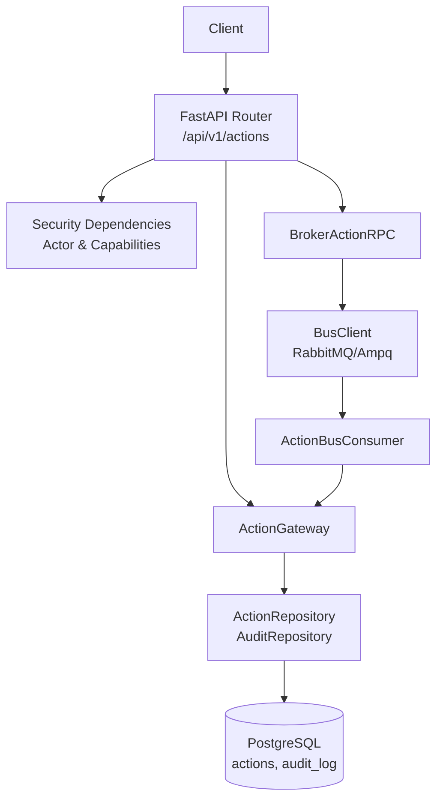
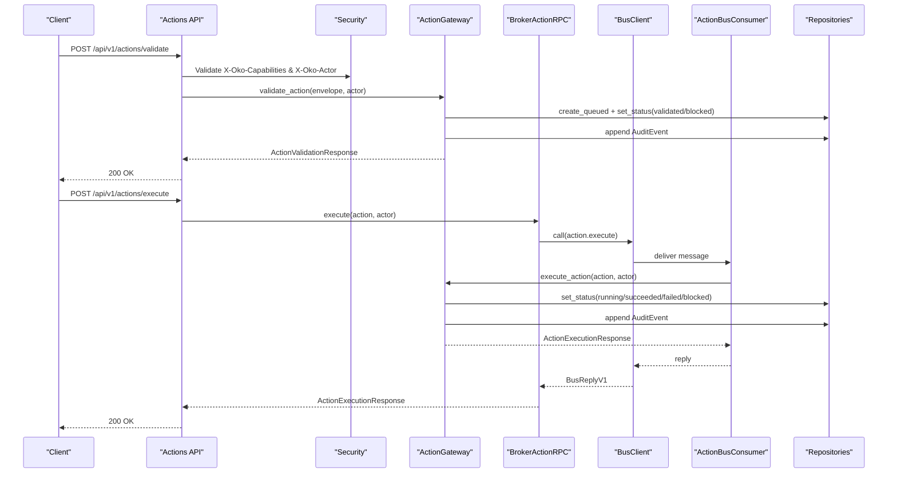
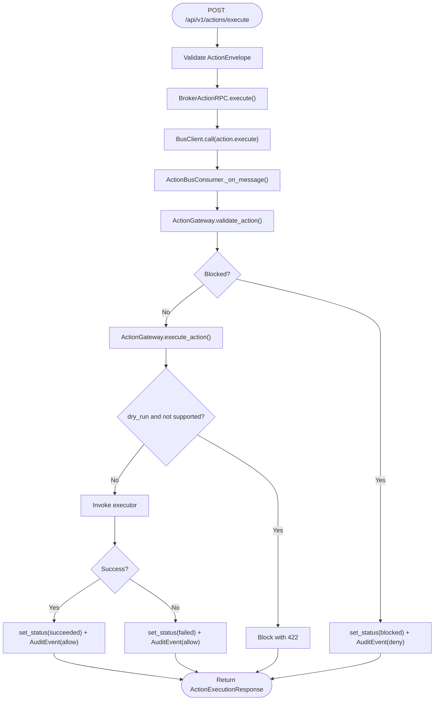
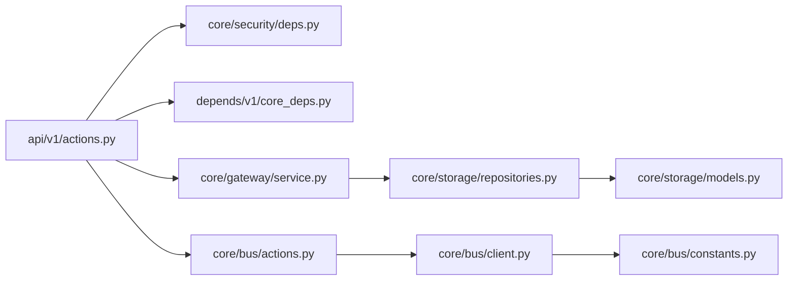

# Actions API

<cite>
**Referenced Files in This Document**
- [actions.py](file://api/v1/actions.py)
- [__init__.py](file://api/v1/__init__.py)
- [deps.py](file://core/security/deps.py)
- [models.py](file://core/contracts/models.py)
- [bus.py](file://core/contracts/bus.py)
- [actions.py](file://core/bus/actions.py)
- [client.py](file://core/bus/client.py)
- [constants.py](file://core/bus/constants.py)
- [service.py](file://core/gateway/service.py)
- [repositories.py](file://core/storage/repositories.py)
- [models.py](file://core/storage/models.py)
- [app_factory.py](file://app_factory.py)
- [main.py](file://main.py)
</cite>

## Table of Contents
1. [Introduction](#introduction)
2. [Project Structure](#project-structure)
3. [Core Components](#core-components)
4. [Architecture Overview](#architecture-overview)
5. [Detailed Component Analysis](#detailed-component-analysis)
6. [Dependency Analysis](#dependency-analysis)
7. [Performance Considerations](#performance-considerations)
8. [Troubleshooting Guide](#troubleshooting-guide)
9. [Conclusion](#conclusion)
10. [Appendices](#appendices)

## Introduction
This document provides comprehensive API documentation for the Actions API endpoints. It covers action registry discovery, validation, execution, and audit trail management. It explains HTTP endpoints, request/response schemas, authentication and authorization requirements, error handling, and operational mechanics such as validation, execution tracking, and audit logging. It also includes practical examples of action execution workflows and client implementation guidelines for triggering actions and monitoring execution status.

## Project Structure
The Actions API is exposed under the v1 API router and integrates with a gateway, RPC bus, and persistent storage for audit and history.

**Diagram sources**
- [__init__.py:9-13](file://api/v1/__init__.py#L9-L13)
- [actions.py:20-60](file://api/v1/actions.py#L20-L60)
- [deps.py:38-51](file://core/security/deps.py#L38-L51)
- [service.py:31-239](file://core/gateway/service.py#L31-L239)
- [actions.py:21-116](file://core/bus/actions.py#L21-L116)
- [client.py:34-290](file://core/bus/client.py#L34-L290)
- [repositories.py:195-304](file://core/storage/repositories.py#L195-L304)
- [models.py:38-87](file://core/storage/models.py#L38-L87)

**Section sources**
- [__init__.py:9-13](file://api/v1/__init__.py#L9-L13)
- [actions.py:20-60](file://api/v1/actions.py#L20-L60)
- [app_factory.py:122](file://app_factory.py#L122)

## Core Components
- Actions Router: Exposes endpoints for registry listing, validation, execution, and history.
- Security Dependencies: Enforce actor identification and capability checks.
- ActionGateway: Orchestrates validation, execution, audit logging, and event publishing.
- BrokerActionRPC: Bridges HTTP to the internal bus for asynchronous execution.
- ActionBusConsumer: Consumes action.execute messages and delegates to the gateway.
- Repositories: Persist action status and audit logs.
- BusClient: Manages AMQP/RabbitMQ connectivity and RPC semantics.

**Section sources**
- [actions.py:20-60](file://api/v1/actions.py#L20-L60)
- [deps.py:38-51](file://core/security/deps.py#L38-L51)
- [service.py:31-239](file://core/gateway/service.py#L31-L239)
- [actions.py:21-116](file://core/bus/actions.py#L21-L116)
- [repositories.py:195-304](file://core/storage/repositories.py#L195-L304)

## Architecture Overview
The Actions API follows a request-response pattern for validation and registry discovery, and an RPC-style pattern for execution. Execution is asynchronous: the API queues the action and returns immediately, while a consumer processes it and updates persistence and audit logs.

**Diagram sources**
- [actions.py:31-48](file://api/v1/actions.py#L31-L48)
- [actions.py:26-62](file://core/bus/actions.py#L26-L62)
- [service.py:74-232](file://core/gateway/service.py#L74-L232)
- [repositories.py:199-250](file://core/storage/repositories.py#L199-L250)
- [models.py:72-134](file://core/contracts/models.py#L72-L134)

## Detailed Component Analysis

### Endpoint Catalog

- GET /api/v1/actions/registry
  - Purpose: List available action types and their capabilities.
  - Authentication: Requires capability read.registry.actions.
  - Response: Array of ActionRegistryEntry.
  - Notes: Uses gateway.list_registry.

- POST /api/v1/actions/validate
  - Purpose: Validate an action envelope without executing it.
  - Authentication: Requires capability exec.actions.validate.
  - Request Body: ActionEnvelope.
  - Response: ActionValidationResponse.
  - Behavior: Creates a queued record, validates type/capability/actor, sets validated or blocked, and logs audit.

- POST /api/v1/actions/execute
  - Purpose: Submit an action for execution.
  - Authentication: Requires capability exec.actions.execute.
  - Request Body: ActionEnvelope.
  - Response: ActionExecutionResponse.
  - Behavior: Bridges to BrokerActionRPC which sends action.execute via bus; consumer executes via gateway.

- GET /api/v1/actions/history
  - Purpose: Retrieve recent action execution history.
  - Authentication: Requires capability read.actions.history.
  - Query Parameter: limit (default 50, min 1, max 500).
  - Response: Array of ActionStatus.

**Section sources**
- [actions.py:23-57](file://api/v1/actions.py#L23-L57)
- [deps.py:48-51](file://core/security/deps.py#L48-L51)

### Request and Response Schemas

- ActionEnvelope
  - Fields: id, type, requested_by, requested_at, capability, payload, dry_run, idempotency_key, trace_id.
  - Validation: type, requested_by, capability must be non-empty; requested_at defaults to UTC now; idempotency_key and trace_id optional.

- ActionRegistryEntry
  - Fields: type, capability, description, dry_run_supported.

- ActionValidationResponse
  - Fields: action_id, valid, status (validated or blocked).

- ActionExecutionResponse
  - Fields: action_id, status (queued, running, succeeded, failed, blocked), result (optional).

- ActionStatus
  - Fields: id, type, capability, requested_by, requested_at, status, dry_run, result, error.

- AuditEvent
  - Fields: id, ts, actor, action_id, capability, resource, decision (allow/deny), outcome (validated/executed/failed/blocked), reason, metadata.

**Section sources**
- [models.py:60-101](file://core/contracts/models.py#L60-L101)
- [models.py:84-94](file://core/contracts/models.py#L84-L94)
- [models.py:72-82](file://core/contracts/models.py#L72-L82)
- [models.py:123-134](file://core/contracts/models.py#L123-L134)

### Authentication and Authorization
- Headers:
  - X-Oko-Actor: Required for all action endpoints; identifies the requester.
  - X-Oko-Capabilities: Comma-separated list; determines access to endpoints.
- Capabilities:
  - read.registry.actions: GET /actions/registry
  - exec.actions.validate: POST /actions/validate
  - exec.actions.execute: POST /actions/execute
  - read.actions.history: GET /actions/history
- Behavior:
  - Missing or invalid actor raises 401.
  - Missing capability raises 403 with details.

**Section sources**
- [deps.py:16-36](file://core/security/deps.py#L16-L36)
- [deps.py:48-51](file://core/security/deps.py#L48-L51)

### Execution Flow and Tracking

**Diagram sources**
- [actions.py:41-48](file://api/v1/actions.py#L41-L48)
- [actions.py:26-62](file://core/bus/actions.py#L26-L62)
- [service.py:74-232](file://core/gateway/service.py#L74-L232)
- [repositories.py:224-250](file://core/storage/repositories.py#L224-L250)

### Audit Logging Mechanisms
- Validation: AuditEvent outcome validated; decision allow/deny based on whether the action was blocked.
- Execution: AuditEvent outcome executed/succeeded/failed/blocked; metadata includes dry_run flag.
- Persistence: AuditRepository persists events with canonical JSON metadata.

**Section sources**
- [service.py:95-120](file://core/gateway/service.py#L95-L120)
- [service.py:172-183](file://core/gateway/service.py#L172-L183)
- [service.py:196-206](file://core/gateway/service.py#L196-L206)
- [repositories.py:286-300](file://core/storage/repositories.py#L286-L300)

### Error Handling
- API-level errors: ApiError raised by gateway/consumer/rpc; mapped to JSON with status_code, code, message, details.
- RPC timeouts: BrokerActionRPC maps timeout to 504 with code action_rpc_timeout.
- Validation errors: FastAPI validation errors mapped to 422 with details.

**Section sources**
- [actions.py:38-62](file://core/bus/actions.py#L38-L62)
- [app_factory.py:63-84](file://app_factory.py#L63-L84)

### Practical Examples

- Example: Validate an action
  - Method: POST
  - URL: /api/v1/actions/validate
  - Headers: X-Oko-Actor, X-Oko-Capabilities: exec.actions.validate
  - Body: ActionEnvelope with type, capability, payload, requested_by
  - Response: ActionValidationResponse with status validated or blocked

- Example: Execute an action
  - Method: POST
  - URL: /api/v1/actions/execute
  - Headers: X-Oko-Actor, X-Oko-Capabilities: exec.actions.execute
  - Body: ActionEnvelope with type, capability, payload, requested_by, optional dry_run
  - Response: ActionExecutionResponse with status queued/running initially; later succeeded/failed/blocked

- Example: List registry
  - Method: GET
  - URL: /api/v1/actions/registry
  - Headers: X-Oko-Actor, X-Oko-Capabilities: read.registry.actions
  - Response: Array of ActionRegistryEntry

- Example: Get history
  - Method: GET
  - URL: /api/v1/actions/history?limit=50
  - Headers: X-Oko-Actor, X-Oko-Capabilities: read.actions.history
  - Response: Array of ActionStatus

**Section sources**
- [actions.py:23-57](file://api/v1/actions.py#L23-L57)

## Dependency Analysis

**Diagram sources**
- [actions.py:10-18](file://api/v1/actions.py#L10-L18)
- [deps.py:38-51](file://core/security/deps.py#L38-L51)
- [core_deps.py:24-33](file://depends/v1/core_deps.py#L24-L33)
- [service.py:31-44](file://core/gateway/service.py#L31-L44)
- [actions.py:21-31](file://core/bus/actions.py#L21-L31)
- [client.py:34-62](file://core/bus/client.py#L34-L62)
- [constants.py:3-18](file://core/bus/constants.py#L3-L18)
- [repositories.py:195-204](file://core/storage/repositories.py#L195-L204)
- [models.py:38-87](file://core/storage/models.py#L38-L87)

**Section sources**
- [actions.py:10-18](file://api/v1/actions.py#L10-L18)
- [core_deps.py:24-33](file://depends/v1/core_deps.py#L24-L33)
- [service.py:31-44](file://core/gateway/service.py#L31-L44)
- [client.py:34-62](file://core/bus/client.py#L34-L62)
- [constants.py:3-18](file://core/bus/constants.py#L3-L18)
- [repositories.py:195-204](file://core/storage/repositories.py#L195-L204)
- [models.py:38-87](file://core/storage/models.py#L38-L87)

## Performance Considerations
- Asynchronous execution: Execution returns quickly; consumers process actions asynchronously.
- RPC timeout: BrokerActionRPC enforces a short timeout; adjust settings if needed.
- History pagination: Limit parameter caps results to reduce load.
- Database indexing: Action and audit tables include indexes on frequently queried columns.

[No sources needed since this section provides general guidance]

## Troubleshooting Guide
- 401 Unauthorized: Missing or empty X-Oko-Actor header.
- 403 Forbidden: Missing required capability in X-Oko-Capabilities.
- 422 Unprocessable Entity: Validation errors in request body or capability mismatch.
- 503 Service Unavailable: Execute disabled globally.
- 504 Gateway Timeout: Action execution did not complete within RPC timeout.
- Action blocked: Check audit logs for reason; verify type/capability match and actor alignment.

**Section sources**
- [deps.py:16-36](file://core/security/deps.py#L16-L36)
- [service.py:131-148](file://core/gateway/service.py#L131-L148)
- [actions.py:38-62](file://core/bus/actions.py#L38-L62)

## Conclusion
The Actions API provides a robust, auditable, and scalable mechanism for validating and executing actions. It enforces strict authorization via capabilities and actors, tracks execution lifecycle, and persists audit trails. Clients should validate actions before execution, submit execution requests, and monitor history for outcomes.

[No sources needed since this section summarizes without analyzing specific files]

## Appendices

### Endpoint Reference

- GET /api/v1/actions/registry
  - Auth: read.registry.actions
  - Response: Array of ActionRegistryEntry

- POST /api/v1/actions/validate
  - Auth: exec.actions.validate
  - Request: ActionEnvelope
  - Response: ActionValidationResponse

- POST /api/v1/actions/execute
  - Auth: exec.actions.execute
  - Request: ActionEnvelope
  - Response: ActionExecutionResponse

- GET /api/v1/actions/history
  - Auth: read.actions.history
  - Query: limit (1..500)
  - Response: Array of ActionStatus

**Section sources**
- [actions.py:23-57](file://api/v1/actions.py#L23-L57)

### Client Implementation Guidelines
- Always include X-Oko-Actor and X-Oko-Capabilities headers.
- For idempotent actions, set idempotency_key in ActionEnvelope.
- For tracing, set trace_id in ActionEnvelope.
- Validate actions first to catch capability/type mismatches early.
- Poll history endpoint to track status transitions from queued/running to succeeded/failed/blocked.
- Handle 504 timeouts by retrying with exponential backoff and idempotency.

[No sources needed since this section provides general guidance]