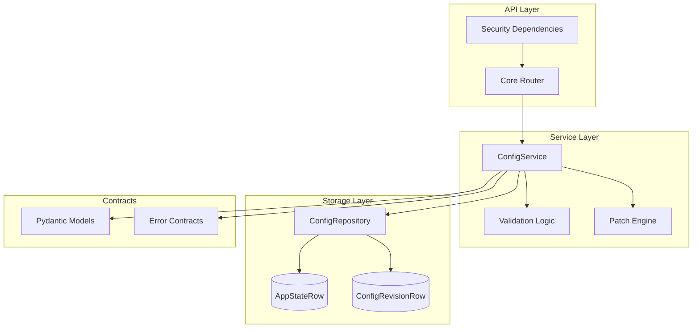
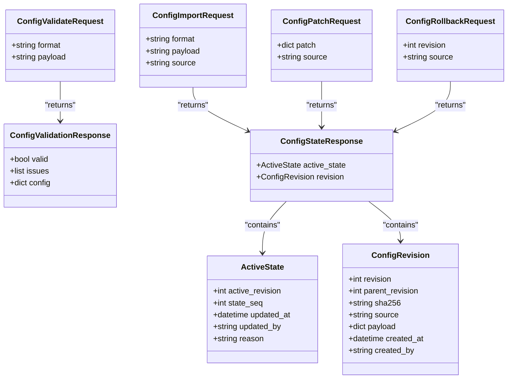
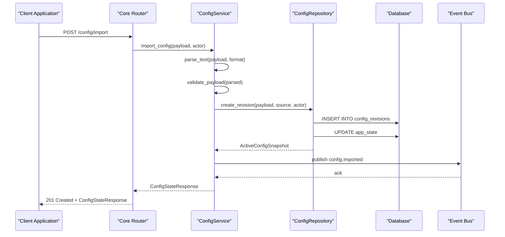
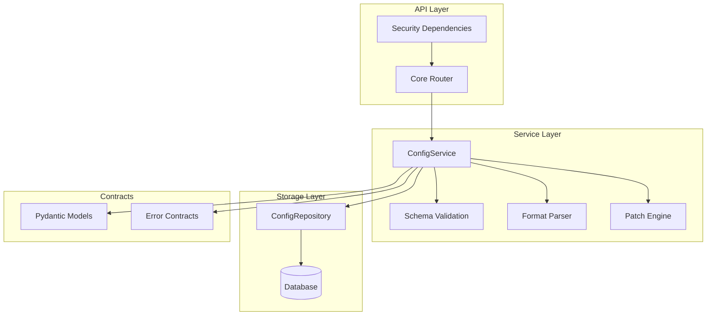
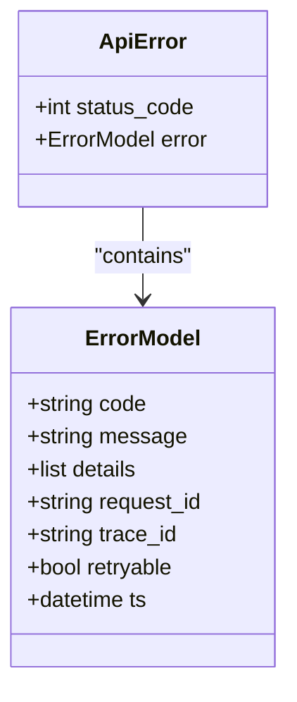
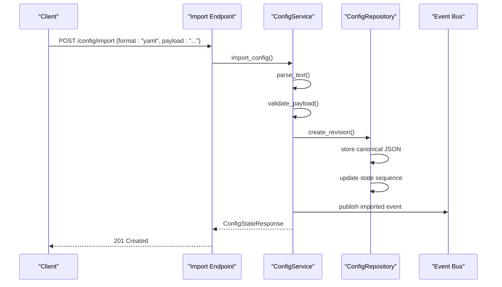
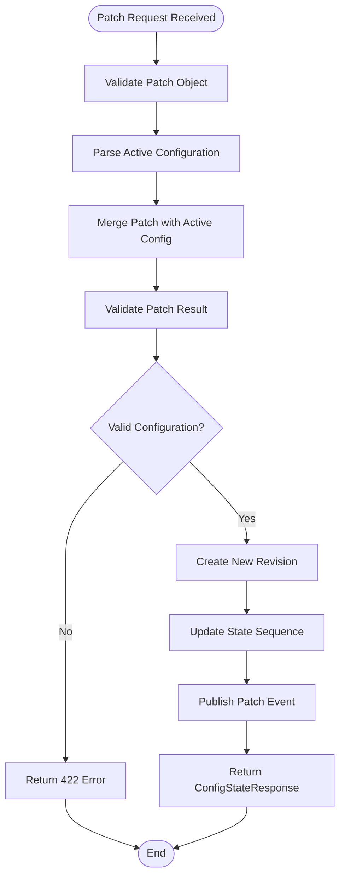

# Configuration Management

<cite>
**Referenced Files in This Document**
- [core.py](file://api/v1/core.py)
- [service.py](file://core/config/service.py)
- [models.py](file://core/contracts/models.py)
- [repositories.py](file://core/storage/repositories.py)
- [deps.py](file://core/security/deps.py)
- [errors.py](file://core/contracts/errors.py)
</cite>

## Table of Contents
1. [Introduction](#introduction)
2. [Project Structure](#project-structure)
3. [Core Components](#core-components)
4. [Architecture Overview](#architecture-overview)
5. [Detailed Component Analysis](#detailed-component-analysis)
6. [Dependency Analysis](#dependency-analysis)
7. [Performance Considerations](#performance-considerations)
8. [Troubleshooting Guide](#troubleshooting-guide)
9. [Conclusion](#conclusion)

## Introduction
This document provides comprehensive API documentation for the configuration management system. The system manages dashboard configuration through a series of REST endpoints that handle configuration retrieval, import, validation, patching, rolling back, and revision history. The configuration is stored as JSON documents with strict schema validation and maintains a complete revision history with cryptographic hashing for integrity verification.

## Project Structure
The configuration management system is organized across several key modules:

**Diagram sources**
- [core.py:40-377](file://api/v1/core.py#L40-L377)
- [service.py:23-207](file://core/config/service.py#L23-L207)
- [models.py:10-208](file://core/contracts/models.py#L10-L208)

**Section sources**
- [core.py:1-377](file://api/v1/core.py#L1-L377)
- [service.py:1-207](file://core/config/service.py#L1-L207)

## Core Components

### API Endpoints
The configuration management system exposes five primary endpoints:

1. **GET /config** - Retrieve active configuration revision
2. **POST /config/import** - Import new configuration
3. **POST /config/validate** - Validate configuration without persisting
4. **POST /config/patch** - Apply configuration changes
5. **POST /config/rollback** - Revert to previous revision
6. **GET /config/revisions** - List configuration history

### Request/Response Models
All endpoints use Pydantic models for strict validation and serialization:

**Diagram sources**
- [models.py:10-58](file://core/contracts/models.py#L10-L58)

**Section sources**
- [models.py:10-58](file://core/contracts/models.py#L10-L58)

## Architecture Overview

**Diagram sources**
- [core.py:254-261](file://api/v1/core.py#L254-L261)
- [service.py:72-81](file://core/config/service.py#L72-L81)
- [repositories.py:91-141](file://core/storage/repositories.py#L91-L141)

## Detailed Component Analysis

### GET /config - Retrieve Active Configuration

Retrieves the currently active configuration revision payload without metadata.

**Endpoint**: `GET /config`
**Response**: Configuration payload object
**Security Capability**: `read.config`
**Response Codes**: 200, 500

**Behavior**:
- Returns only the configuration payload (not the full ConfigStateResponse)
- Raises 500 if no active configuration exists
- No request body required

**Section sources**
- [core.py:246-251](file://api/v1/core.py#L246-L251)
- [service.py:62-66](file://core/config/service.py#L62-L66)

### POST /config/import - Import New Configuration

Imports a new configuration from YAML, JSON, or TOML format.

**Endpoint**: `POST /config/import`
**Request Body**: ConfigImportRequest
**Response**: ConfigStateResponse
**Security Capability**: `write.config.import`
**Response Codes**: 201, 422

**Request Schema**:
- `format`: "yaml" | "json" | "toml" (default: "yaml")
- `payload`: string (min length: 1)
- `source`: "bootstrap" | "import" | "api" (default: "import")

**Processing Steps**:
1. Parse payload based on format
2. Validate parsed content is a dictionary
3. Validate configuration schema (requires "version" and "app" fields)
4. Create new revision in database
5. Publish configuration imported event
6. Return full state response

**Validation Rules**:
- Format must be one of: "yaml", "json", "toml"
- Payload must be non-empty string
- Parsed content must be a dictionary object
- Configuration must contain "version" field
- Configuration must contain "app" object field

**Section sources**
- [core.py:254-261](file://api/v1/core.py#L254-L261)
- [service.py:72-81](file://core/config/service.py#L72-L81)
- [service.py:156-174](file://core/config/service.py#L156-L174)
- [service.py:182-186](file://core/config/service.py#L182-L186)

### POST /config/validate - Validate Configuration

Validates configuration without persisting changes.

**Endpoint**: `POST /config/validate`
**Request Body**: ConfigValidateRequest
**Response**: ConfigValidationResponse
**Security Capability**: `write.config.import`
**Response Codes**: 200, 422

**Request Schema**:
- `format`: "yaml" | "json" | "toml" (default: "yaml")
- `payload`: string (min length: 1)

**Response Schema**:
- `valid`: boolean indicating validation result
- `issues`: array of error objects with "code" and "message"
- `config`: validated configuration object (present when valid)

**Processing**:
- Parses payload according to format
- Validates configuration schema
- Returns validation result without database changes

**Section sources**
- [core.py:264-270](file://api/v1/core.py#L264-L270)
- [service.py:83-98](file://core/config/service.py#L83-L98)

### POST /config/patch - Apply Configuration Changes

Applies targeted changes to the active configuration.

**Endpoint**: `POST /config/patch`
**Request Body**: ConfigPatchRequest
**Response**: ConfigStateResponse
**Security Capability**: `write.config.patch`
**Response Codes**: 200, 422

**Request Schema**:
- `patch`: object containing changes
- `source`: "patch" | "api" (default: "patch")

**Patch Behavior**:
- Uses deep merge algorithm to apply changes
- Setting a value to null removes the key
- Nested objects are merged recursively
- Non-existent keys are added

**Validation Rules**:
- Patch must be a dictionary object
- Resulting configuration must pass schema validation

**Section sources**
- [core.py:273-280](file://api/v1/core.py#L273-L280)
- [service.py:100-111](file://core/config/service.py#L100-L111)
- [repositories.py:37-52](file://core/storage/repositories.py#L37-L52)

### POST /config/rollback - Revert to Previous Revision

Reverts the active configuration to a specific historical revision.

**Endpoint**: `POST /config/rollback`
**Request Body**: ConfigRollbackRequest
**Response**: ConfigStateResponse
**Security Capability**: `write.config.rollback`
**Response Codes**: 200, 404

**Request Schema**:
- `revision`: integer (minimum: 1)
- `source`: "rollback" | "api" (default: "rollback")

**Behavior**:
- Fetches target revision from database
- Creates new revision with target payload
- Updates active state sequence
- Publishes rollback event

**Error Handling**:
- 404 if revision does not exist
- 422 if patch operation fails during validation

**Section sources**
- [core.py:283-290](file://api/v1/core.py#L283-L290)
- [service.py:113-126](file://core/config/service.py#L113-L126)
- [repositories.py:158-167](file://core/storage/repositories.py#L158-L167)

### GET /config/revisions - List Configuration History

Retrieves configuration revision history.

**Endpoint**: `GET /config/revisions`
**Response**: Array of ConfigRevision objects
**Security Capability**: `read.config.revisions`
**Response Codes**: 200, 422

**Query Parameters**:
- `limit`: integer (default: 50, minimum: 1, maximum: 500)

**Response Schema**:
- `revision`: integer revision number
- `parent_revision`: integer or null
- `sha256`: 64-character hexadecimal hash
- `source`: "bootstrap" | "import" | "patch" | "rollback" | "api" | "system"
- `payload`: configuration object
- `created_at`: timestamp
- `created_by`: string or null

**Section sources**
- [core.py:293-300](file://api/v1/core.py#L293-L300)
- [service.py:68-70](file://core/config/service.py#L68-L70)
- [repositories.py:81-89](file://core/storage/repositories.py#L81-L89)

## Dependency Analysis

**Diagram sources**
- [core.py:13-38](file://api/v1/core.py#L13-L38)
- [service.py:10-20](file://core/config/service.py#L10-L20)
- [models.py:10-58](file://core/contracts/models.py#L10-L58)

### Security Capabilities Matrix

| Endpoint | Required Capability | Purpose |
|----------|-------------------|---------|
| GET /config | `read.config` | Read active configuration |
| POST /config/import | `write.config.import` | Import new configuration |
| POST /config/validate | `write.config.import` | Validate configuration |
| POST /config/patch | `write.config.patch` | Apply configuration changes |
| POST /config/rollback | `write.config.rollback` | Revert to previous revision |
| GET /config/revisions | `read.config.revisions` | List configuration history |

**Section sources**
- [deps.py:40-47](file://core/security/deps.py#L40-L47)

## Performance Considerations

### Configuration Storage Strategy
- **Canonical JSON Serialization**: Configuration payloads are serialized using canonical JSON format with sorted keys and minimal separators to ensure consistent hashing
- **SHA-256 Integrity**: Each configuration revision is hashed using SHA-256 for integrity verification
- **Parent-Child Relationships**: Maintains revision lineage for audit trails and rollback capabilities

### Query Optimization
- **Revision Listing**: Database queries are optimized with composite ordering (revision desc, id desc) for efficient pagination
- **Active State Caching**: Active configuration is fetched in a single transaction to minimize database round trips
- **Limit Controls**: Revision listing limits prevent excessive memory usage with configurable bounds (1-500 items)

### Event Publishing
- **Asynchronous Events**: Configuration changes trigger asynchronous event publishing to avoid blocking API responses
- **Event Deduplication**: State sequence numbers prevent duplicate event processing

## Troubleshooting Guide

### Common Error Scenarios

**Configuration Import Failures**:
- `422 Unprocessable Entity` with `format_invalid`: Unsupported format specified
- `422 Unprocessable Entity` with `parse_failed`: Malformed configuration content
- `422 Unprocessable Entity` with `config_schema_error`: Missing required fields ("version" or "app")
- `422 Unprocessable Entity` with `config_invalid_root`: Configuration root is not an object

**Patch Operation Issues**:
- `422 Unprocessable Entity` with `patch_invalid`: Patch payload is not a dictionary
- `422 Unprocessable Entity` with `config_invalid_root`: Patch results in non-object configuration

**Rollback Problems**:
- `404 Not Found` with `revision_not_found`: Target revision does not exist
- `500 Internal Server Error`: Active configuration not initialized

### Error Response Format

All error responses follow the standardized ErrorModel format:

**Diagram sources**
- [errors.py:9-16](file://core/contracts/errors.py#L9-L16)

**Section sources**
- [errors.py:9-44](file://core/contracts/errors.py#L9-L44)

### Practical Configuration Workflows

**Complete Configuration Import Workflow**:

**Patch Application Workflow**:

**Section sources**
- [service.py:100-111](file://core/config/service.py#L100-L111)
- [repositories.py:143-156](file://core/storage/repositories.py#L143-L156)

## Conclusion

The configuration management system provides a robust, secure, and auditable solution for managing dashboard configurations. Key strengths include:

- **Comprehensive Validation**: Strict schema validation ensures configuration integrity
- **Rich Audit Trail**: Complete revision history with cryptographic hashing
- **Flexible Operations**: Support for import, patch, and rollback operations
- **Security Controls**: Granular capability-based access control
- **Performance Optimization**: Efficient storage and query patterns

The system supports enterprise-grade configuration management with proper error handling, event-driven architecture, and comprehensive API coverage for all configuration lifecycle operations.