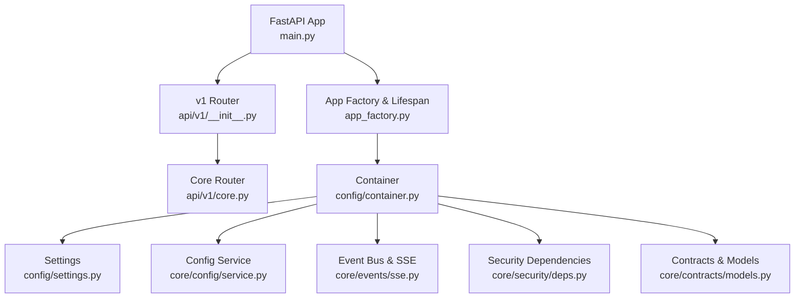
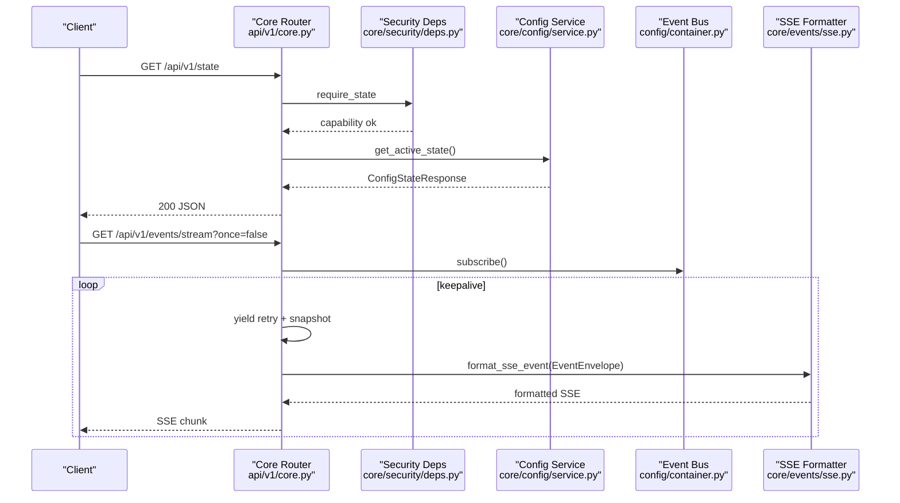
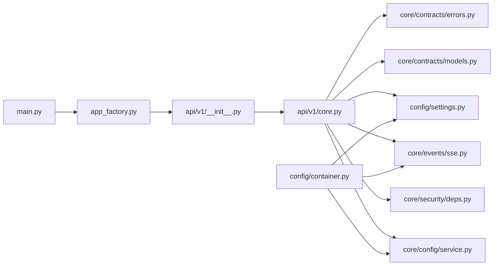

# Core API

<cite>
**Referenced Files in This Document**
- [main.py](file://main.py)
- [app_factory.py](file://app_factory.py)
- [config/container.py](file://config/container.py)
- [config/settings.py](file://config/settings.py)
- [api/v1/__init__.py](file://api/v1/__init__.py)
- [api/v1/core.py](file://api/v1/core.py)
- [core/events/sse.py](file://core/events/sse.py)
- [core/config/service.py](file://core/config/service.py)
- [core/security/deps.py](file://core/security/deps.py)
- [core/contracts/models.py](file://core/contracts/models.py)
- [core/contracts/errors.py](file://core/contracts/errors.py)
</cite>

## Table of Contents
1. [Introduction](#introduction)
2. [Project Structure](#project-structure)
3. [Core Components](#core-components)
4. [Architecture Overview](#architecture-overview)
5. [Detailed Component Analysis](#detailed-component-analysis)
6. [Dependency Analysis](#dependency-analysis)
7. [Performance Considerations](#performance-considerations)
8. [Troubleshooting Guide](#troubleshooting-guide)
9. [Conclusion](#conclusion)
10. [Appendices](#appendices)

## Introduction
This document provides comprehensive API documentation for the Core API endpoints exposed under the v1 API router. It covers:
- Health checks
- Favicon proxy
- State management
- Configuration management
- Widget registry
- Event streaming via Server-Sent Events (SSE)

For each endpoint, you will find HTTP methods, URL patterns, query parameters, request/response schemas, authentication requirements, and error handling. It also documents the event streaming protocol, including connection handling, message formats, retry mechanisms, keepalive patterns, and security considerations for the favicon proxy.

## Project Structure
The Core API endpoints are defined in the v1 router and mounted at /api/v1. The application lifecycle and dependency injection are handled by the container and app factory.

**Diagram sources**
- [main.py:17-21](file://main.py#L17-L21)
- [api/v1/__init__.py:9-13](file://api/v1/__init__.py#L9-L13)
- [app_factory.py:87-123](file://app_factory.py#L87-L123)
- [config/container.py:50-81](file://config/container.py#L50-L81)
- [config/settings.py:14-127](file://config/settings.py#L14-L127)
- [core/config/service.py:23-206](file://core/config/service.py#L23-L206)
- [core/events/sse.py:8-10](file://core/events/sse.py#L8-L10)
- [core/security/deps.py:16-54](file://core/security/deps.py#L16-L54)
- [core/contracts/models.py:10-207](file://core/contracts/models.py#L10-L207)

**Section sources**
- [main.py:17-21](file://main.py#L17-L21)
- [api/v1/__init__.py:9-13](file://api/v1/__init__.py#L9-L13)
- [app_factory.py:87-123](file://app_factory.py#L87-L123)
- [config/container.py:50-81](file://config/container.py#L50-L81)

## Core Components
- Health endpoint: Lightweight status check returning role and timestamp.
- Favicon proxy: Validates and caches favicons from origins, with TLS fallback and caching TTL.
- State and configuration endpoints: Retrieve active state and active revision; import, validate, patch, rollback configurations; list revisions; and fetch widget registry entries.
- Event streaming: Server-Sent Events stream with initial snapshot, periodic keepalive, and subscription to the event bus.

**Section sources**
- [api/v1/core.py:43-49](file://api/v1/core.py#L43-L49)
- [api/v1/core.py:199-234](file://api/v1/core.py#L199-L234)
- [api/v1/core.py:237-309](file://api/v1/core.py#L237-L309)
- [api/v1/core.py:311-373](file://api/v1/core.py#L311-L373)

## Architecture Overview
The Core API is part of the v1 router and relies on:
- Authentication via capability headers and actor header enforced by dependency injectors.
- Configuration service for state and config operations.
- Event bus for emitting and streaming events.
- SSE formatter for Server-Sent Events.

**Diagram sources**
- [api/v1/core.py:237-243](file://api/v1/core.py#L237-L243)
- [core/security/deps.py:40-47](file://core/security/deps.py#L40-L47)
- [core/config/service.py:56-60](file://core/config/service.py#L56-L60)
- [api/v1/core.py:311-373](file://api/v1/core.py#L311-L373)
- [core/events/sse.py:8-10](file://core/events/sse.py#L8-L10)

## Detailed Component Analysis

### Health Check: GET /api/v1/health
- Method: GET
- URL: /api/v1/health
- Query parameters: None
- Headers: None
- Authentication: Not required
- Response: JSON object with keys:
  - ok: boolean
  - role: string (runtime role)
  - ts: ISO 8601 timestamp
- Error handling: None (always returns 200)

Example request:
- curl -sS http://localhost:8000/api/v1/health

Example response:
- {"ok": true, "role": "backend", "ts": "2025-01-01T00:00:00Z"}

Notes:
- Intended for readiness/liveness checks.

**Section sources**
- [api/v1/core.py:43-49](file://api/v1/core.py#L43-L49)

### Favicon Proxy: GET /api/v1/favicon
- Method: GET
- URL: /api/v1/favicon?url=...
- Query parameters:
  - url: string, required, validated to be http/https with host, no credentials
- Headers: None
- Authentication: Not required
- Response: 307 redirect to cached or fetched favicon under /media
- Behavior:
  - Computes cache key from origin SHA-256
  - Uses configured TTL for cache freshness
  - Fetches from origin favicon.ico with accept image/* and UA okhttp-favicon-proxy/1.0
  - Supports TLS verification with optional insecure fallback
  - Enforces max bytes and writes to cache with extension derived from Content-Type
  - On 404, marks missing favicon with a marker file for TTL
- Error handling:
  - 400: Invalid URL scheme/host or presence of credentials
  - 404: Favicon not found (or cached marker present)
  - 413: Favicon too large
  - 502: Upstream connection or fetch error
  - 504: Upstream timeout

Security considerations:
- Origin validation restricts to http/https with host and disallows embedded credentials.
- TLS verification can be disabled with fallback when enabled.
- Cache TTL prevents stale images indefinitely.

Caching strategy:
- Cache key: SHA-256 of origin
- Cache directory: settings.media_dir/favicons
- Extension derived from Content-Type; only image types are accepted
- Freshness determined by configured TTL days

**Section sources**
- [api/v1/core.py:199-234](file://api/v1/core.py#L199-L234)
- [api/v1/core.py:52-58](file://api/v1/core.py#L52-L58)
- [api/v1/core.py:61-68](file://api/v1/core.py#L61-L68)
- [api/v1/core.py:71-90](file://api/v1/core.py#L71-L90)
- [api/v1/core.py:144-196](file://api/v1/core.py#L144-L196)
- [config/settings.py:75-82](file://config/settings.py#L75-L82)

### State Management: GET /api/v1/state
- Method: GET
- URL: /api/v1/state
- Query parameters: None
- Headers:
  - X-Oko-Capabilities: comma-separated list containing "read.state"
  - X-Oko-Actor: required string identifying requester
- Response: JSON representing active state (active_revision, state_seq, updated_at, updated_by, reason)
- Error handling:
  - 401: Missing or empty X-Oko-Actor
  - 403: Missing "read.state" capability
  - 500: Active state not initialized

Example request:
- curl -H "X-Oko-Capabilities: read.state" -H "X-Oko-Actor: frontend" http://localhost:8000/api/v1/state

Example response:
- {"active_state": {"active_revision": 1, "state_seq": 2, "updated_at": "...", "updated_by": null, "reason": null}, "revision": {...}}

**Section sources**
- [api/v1/core.py:237-243](file://api/v1/core.py#L237-L243)
- [core/security/deps.py:40-47](file://core/security/deps.py#L40-L47)
- [core/config/service.py:56-60](file://core/config/service.py#L56-L60)

### Configuration Management: GET /api/v1/config
- Method: GET
- URL: /api/v1/config
- Query parameters: None
- Headers:
  - X-Oko-Capabilities: must include "read.config"
  - X-Oko-Actor: required
- Response: JSON payload of active revision
- Error handling:
  - 401: Missing actor
  - 403: Missing "read.config"
  - 500: Active config not initialized

**Section sources**
- [api/v1/core.py:246-251](file://api/v1/core.py#L246-L251)
- [core/security/deps.py:41-42](file://core/security/deps.py#L41-L42)
- [core/config/service.py:62-66](file://core/config/service.py#L62-L66)

### Import Configuration: POST /api/v1/config/import
- Method: POST
- URL: /api/v1/config/import
- Query parameters: None
- Headers:
  - X-Oko-Capabilities: must include "write.config.import"
  - X-Oko-Actor: required
- Request body: ConfigImportRequest
  - format: "yaml" | "json" | "toml"
  - payload: string (non-empty)
  - source: "bootstrap" | "import" | "api"
- Response: ConfigStateResponse (active_state, revision)
- Error handling:
  - 400/422: Unsupported format or parse/validation failures
  - 500: Internal state missing

**Section sources**
- [api/v1/core.py:254-261](file://api/v1/core.py#L254-L261)
- [core/security/deps.py:42-43](file://core/security/deps.py#L42-L43)
- [core/config/service.py:72-81](file://core/config/service.py#L72-L81)

### Validate Configuration: POST /api/v1/config/validate
- Method: POST
- URL: /api/v1/config/validate
- Query parameters: None
- Headers:
  - X-Oko-Capabilities: must include "write.config.import"
  - X-Oko-Actor: optional
- Request body: ConfigValidateRequest
  - format: "yaml" | "json" | "toml"
  - payload: string (non-empty)
- Response: ConfigValidationResponse
  - valid: boolean
  - issues: list of {code, message}
  - config: parsed payload or null
- Error handling:
  - 422: Validation or parse errors mapped to issues

**Section sources**
- [api/v1/core.py:264-270](file://api/v1/core.py#L264-L270)
- [core/config/service.py:83-98](file://core/config/service.py#L83-L98)

### Patch Configuration: POST /api/v1/config/patch
- Method: POST
- URL: /api/v1/config/patch
- Query parameters: None
- Headers:
  - X-Oko-Capabilities: must include "write.config.patch"
  - X-Oko-Actor: required
- Request body: ConfigPatchRequest
  - patch: object
  - source: "patch" | "api"
- Response: ConfigStateResponse
- Error handling:
  - 400/422: Invalid patch payload
  - 500: Internal state missing

**Section sources**
- [api/v1/core.py:273-280](file://api/v1/core.py#L273-L280)
- [core/security/deps.py:43-44](file://core/security/deps.py#L43-L44)
- [core/config/service.py:100-111](file://core/config/service.py#L100-L111)

### Rollback Configuration: POST /api/v1/config/rollback
- Method: POST
- URL: /api/v1/config/rollback
- Query parameters: None
- Headers:
  - X-Oko-Capabilities: must include "write.config.rollback"
  - X-Oko-Actor: required
- Request body: ConfigRollbackRequest
  - revision: integer >= 1
  - source: "rollback" | "api"
- Response: ConfigStateResponse
- Error handling:
  - 404: Revision not found
  - 500: Internal state missing

**Section sources**
- [api/v1/core.py:283-290](file://api/v1/core.py#L283-L290)
- [core/security/deps.py:44-45](file://core/security/deps.py#L44-L45)
- [core/config/service.py:113-126](file://core/config/service.py#L113-L126)

### List Revisions: GET /api/v1/config/revisions
- Method: GET
- URL: /api/v1/config/revisions
- Query parameters:
  - limit: integer, default 50, min 1, max 500
- Headers:
  - X-Oko-Capabilities: must include "read.config.revisions"
  - X-Oko-Actor: required
- Response: Array of ConfigRevision
- Error handling:
  - 401: Missing actor
  - 403: Missing "read.config.revisions"

**Section sources**
- [api/v1/core.py:293-300](file://api/v1/core.py#L293-L300)
- [core/security/deps.py:46](file://core/security/deps.py#L46)
- [core/config/service.py:68-70](file://core/config/service.py#L68-L70)

### Widget Registry: GET /api/v1/widgets/registry
- Method: GET
- URL: /api/v1/widgets/registry
- Query parameters: None
- Headers:
  - X-Oko-Capabilities: must include "read.registry.widgets"
  - X-Oko-Actor: required
- Response: Array of WidgetRegistryEntry
- Error handling:
  - 401: Missing actor
  - 403: Missing "read.registry.widgets"

**Section sources**
- [api/v1/core.py:303-308](file://api/v1/core.py#L303-L308)
- [core/security/deps.py:47](file://core/security/deps.py#L47)
- [core/config/service.py:128-154](file://core/config/service.py#L128-L154)

### Event Streaming: GET /api/v1/events/stream
- Method: GET
- URL: /api/v1/events/stream
- Query parameters:
  - once: boolean, default false; if true, returns initial snapshot and closes
- Headers:
  - X-Oko-Capabilities: must include "read.events"
  - X-Oko-Actor: required
- Response: text/event-stream
- Initial snapshot:
  - core.state.snapshot: includes active_revision and state_seq
  - health.state.snapshot: includes health items snapshot
- Keepalive:
  - Periodic server-sent keepalive messages when no events arrive
- Retry:
  - Initial retry value sent as SSE retry directive
- Connection handling:
  - Subscribes to event bus; unsubscribes on disconnect or completion
  - Streaming headers include cache-control, connection, and x-accel-buffering
- Error handling:
  - 401: Missing actor
  - 403: Missing "read.events"
  - 500: Internal state missing

Client implementation guidelines:
- Use native EventSource or compatible library
- Parse SSE fields: id, event, data
- Respect retry directive and reconnect with exponential backoff
- Handle keepalive comments and ignore them as no-payload events
- Track last received revision to resume if needed

**Section sources**
- [api/v1/core.py:311-373](file://api/v1/core.py#L311-L373)
- [core/events/sse.py:8-10](file://core/events/sse.py#L8-L10)
- [core/security/deps.py:46-47](file://core/security/deps.py#L46-L47)
- [config/settings.py:54-55](file://config/settings.py#L54-L55)

## Dependency Analysis
Key dependencies and relationships:
- App factory creates the FastAPI app, mounts v1 router, and sets up middleware and exception handlers.
- Container holds all services (config, event bus, health repository, plugin service) and wires them into endpoints.
- Security dependencies enforce capability and actor headers.
- SSE formatter converts EventEnvelope to SSE chunks.
- Settings provide runtime configuration for timeouts, retries, and caching.

**Diagram sources**
- [main.py:17-21](file://main.py#L17-L21)
- [app_factory.py:87-123](file://app_factory.py#L87-L123)
- [api/v1/__init__.py:9-13](file://api/v1/__init__.py#L9-L13)
- [api/v1/core.py:25-38](file://api/v1/core.py#L25-L38)
- [core/security/deps.py:16-54](file://core/security/deps.py#L16-L54)
- [core/config/service.py:23-206](file://core/config/service.py#L23-L206)
- [core/events/sse.py:8-10](file://core/events/sse.py#L8-L10)
- [config/settings.py:14-127](file://config/settings.py#L14-L127)
- [core/contracts/models.py:10-207](file://core/contracts/models.py#L10-L207)
- [core/contracts/errors.py:9-43](file://core/contracts/errors.py#L9-L43)
- [config/container.py:50-81](file://config/container.py#L50-L81)

**Section sources**
- [main.py:17-21](file://main.py#L17-L21)
- [app_factory.py:87-123](file://app_factory.py#L87-L123)
- [config/container.py:50-81](file://config/container.py#L50-L81)

## Performance Considerations
- Event streaming:
  - Keepalive interval is configurable and bounded to prevent excessive churn.
  - Retry directive helps clients reconnect promptly.
  - Streaming headers disable buffering and transform to support real-time delivery.
- Favicon proxy:
  - Max bytes and cache TTL prevent memory and disk bloat.
  - TLS fallback reduces upstream failures when certificates are misconfigured.
- Configuration operations:
  - Validation is synchronous; import/patch/rollback are asynchronous with event emission.

[No sources needed since this section provides general guidance]

## Troubleshooting Guide
Common issues and resolutions:
- Health endpoint returns 500:
  - Verify runtime role and container initialization.
- Favicon proxy returns 400/404/502/504:
  - Check URL format and host presence; ensure no credentials; verify upstream availability and certificate validity.
  - Adjust OKO_FAVICON_* settings if needed.
- SSE stream stops:
  - Confirm client respects retry directive and handles keepalive.
  - Ensure "read.events" capability is present.
- Configuration endpoints return 403/401:
  - Provide X-Oko-Capabilities and X-Oko-Actor headers with required capabilities.

**Section sources**
- [api/v1/core.py:52-58](file://api/v1/core.py#L52-L58)
- [api/v1/core.py:144-196](file://api/v1/core.py#L144-L196)
- [api/v1/core.py:311-373](file://api/v1/core.py#L311-L373)
- [core/security/deps.py:16-54](file://core/security/deps.py#L16-L54)

## Conclusion
The Core API provides essential endpoints for health monitoring, favicon caching, state and configuration management, widget registry discovery, and real-time event streaming. Authentication is capability-driven via headers, and the SSE stream offers robust keepalive and retry semantics. The favicon proxy enforces strict origin validation and secure caching with configurable timeouts and sizes.

[No sources needed since this section summarizes without analyzing specific files]

## Appendices

### Authentication and Authorization
- Required headers:
  - X-Oko-Capabilities: comma-separated list of capabilities
  - X-Oko-Actor: identifies the requester
- Capabilities enforced per endpoint:
  - read.state, read.config, write.config.import, write.config.patch, write.config.rollback, read.config.revisions, read.events, read.registry.widgets

**Section sources**
- [core/security/deps.py:16-54](file://core/security/deps.py#L16-L54)

### SSE Message Format
- Fields:
  - id: event.revision
  - event: event.type
  - data: JSON-encoded EventEnvelope
- Keepalive: server-sent comment ":" with newline
- Retry: initial retry directive set to OKO_EVENTS_RETRY_MS

**Section sources**
- [core/events/sse.py:8-10](file://core/events/sse.py#L8-L10)
- [api/v1/core.py:320-373](file://api/v1/core.py#L320-L373)
- [config/settings.py:54-55](file://config/settings.py#L54-L55)

### Data Models Used by Endpoints
- ConfigStateResponse, ActiveState, ConfigRevision
- ConfigImportRequest, ConfigPatchRequest, ConfigRollbackRequest, ConfigValidateRequest
- ConfigValidationResponse
- WidgetRegistryEntry
- EventEnvelope

**Section sources**
- [core/contracts/models.py:10-207](file://core/contracts/models.py#L10-L207)