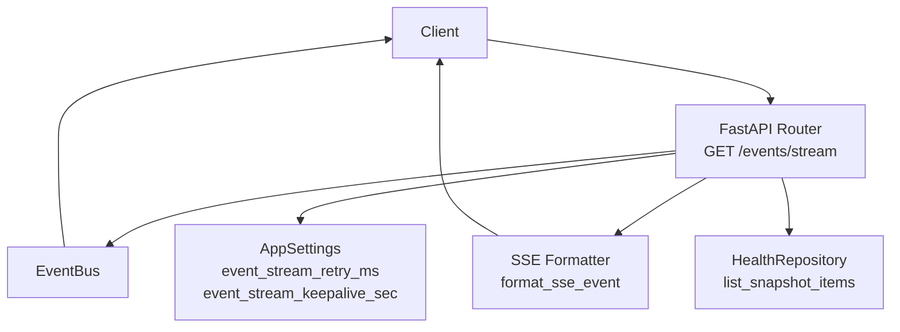
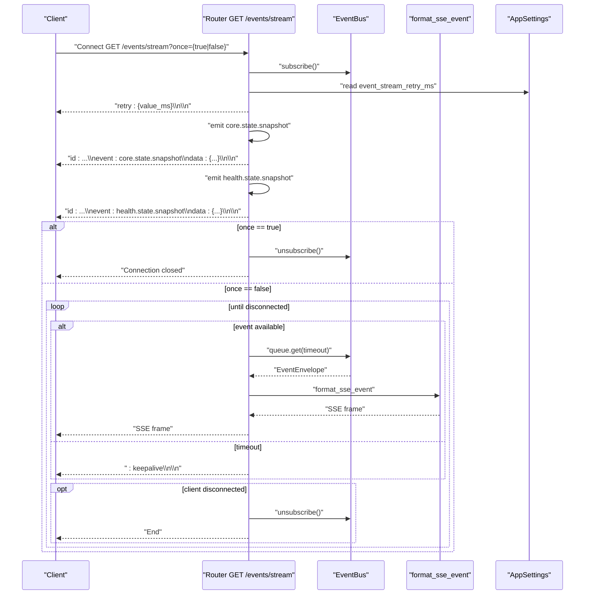
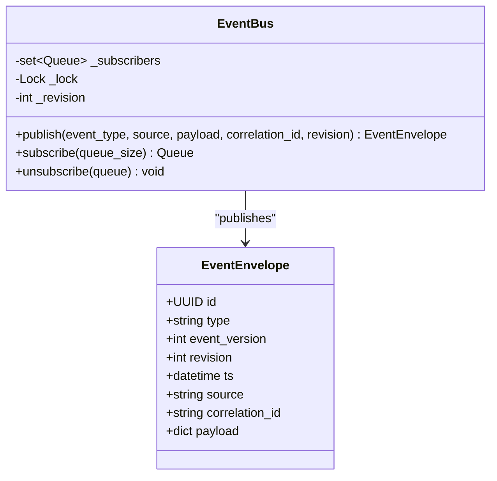
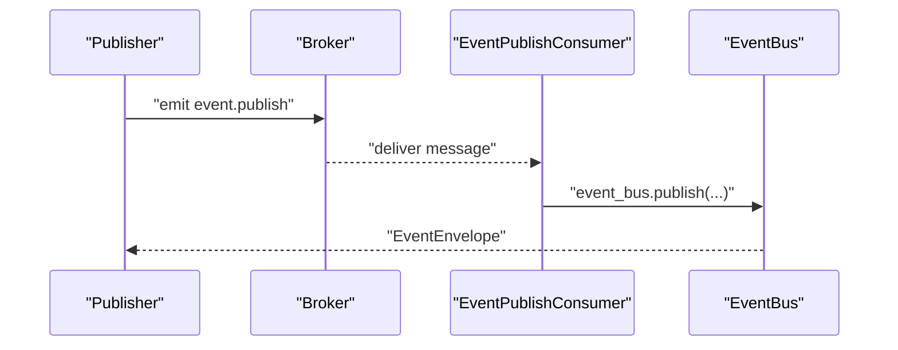
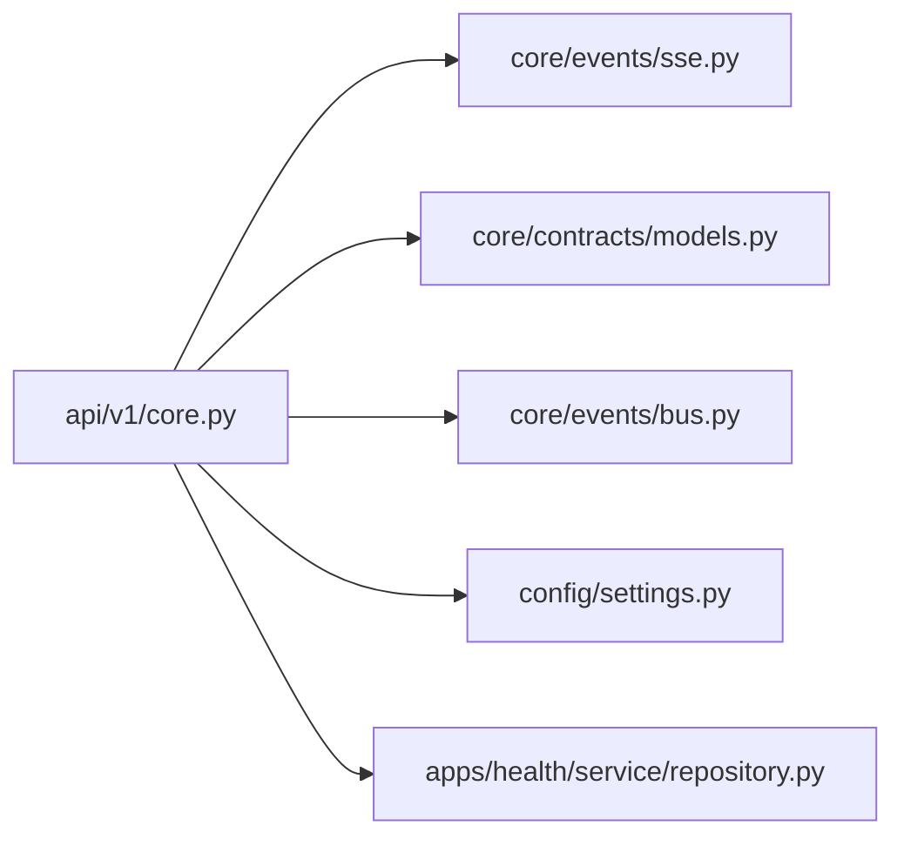

# Event Streaming

<cite>
**Referenced Files in This Document**
- [sse.py](file://core/events/sse.py)
- [core.py](file://api/v1/core.py)
- [models.py](file://core/contracts/models.py)
- [bus.py](file://core/events/bus.py)
- [broker.py](file://core/events/broker.py)
- [settings.py](file://config/settings.py)
- [repository.py](file://apps/health/service/repository.py)
- [main.py](file://main.py)
</cite>

## Table of Contents
1. [Introduction](#introduction)
2. [Project Structure](#project-structure)
3. [Core Components](#core-components)
4. [Architecture Overview](#architecture-overview)
5. [Detailed Component Analysis](#detailed-component-analysis)
6. [Dependency Analysis](#dependency-analysis)
7. [Performance Considerations](#performance-considerations)
8. [Troubleshooting Guide](#troubleshooting-guide)
9. [Conclusion](#conclusion)

## Introduction
This document describes the Server-Sent Events (SSE) endpoint for real-time event distribution. The endpoint is implemented as a GET handler at /events/stream and streams EventEnvelope instances to clients using the text/event-stream media type. It supports:
- Initial snapshot events for core state and health state
- Periodic keepalive messages
- Automatic client retry via server-sent retry directives
- Optional snapshot-only delivery controlled by the once query parameter
- Long-lived connection handling with disconnection detection

## Project Structure
The event streaming endpoint is part of the FastAPI router under api/v1/core.py. It integrates with:
- An in-memory event bus (EventBus) for publishing and subscribing to events
- A formatter (format_sse_event) that serializes EventEnvelope into SSE frames
- Application settings that configure retry intervals and keepalive periods
- Health repository snapshots for the health.state.snapshot event

**Diagram sources**
- [core.py:311-373](file://api/v1/core.py#L311-L373)
- [sse.py:8-10](file://core/events/sse.py#L8-L10)
- [bus.py:11-57](file://core/events/bus.py#L11-L57)
- [settings.py:54-55](file://config/settings.py#L54-L55)
- [repository.py:181-211](file://apps/health/service/repository.py#L181-L211)

**Section sources**
- [core.py:311-373](file://api/v1/core.py#L311-L373)
- [sse.py:8-10](file://core/events/sse.py#L8-L10)
- [bus.py:11-57](file://core/events/bus.py#L11-L57)
- [settings.py:54-55](file://config/settings.py#L54-L55)
- [repository.py:181-211](file://apps/health/service/repository.py#L181-L211)

## Core Components
- Endpoint: GET /events/stream
  - Returns a StreamingResponse with media type text/event-stream
  - Requires capability events
  - Supports optional query parameter once (boolean) to deliver snapshot-only and close
- SSE formatter: format_sse_event(EventEnvelope) -> str
  - Serializes an EventEnvelope to an SSE frame with id, event, and data fields
- EventBus: publish, subscribe, unsubscribe
  - Manages subscribers via asyncio.Queue
  - Enforces a revision counter and drops oldest items on overflow
- EventEnvelope: standardized event shape with id, type, event_version, revision, ts, source, correlation_id, payload
- Health snapshot: health.state.snapshot payload built from HealthRepository.list_snapshot_items()

Key behaviors:
- Initial snapshot: emits core.state.snapshot followed by health.state.snapshot
- Keepalive: sends a comment line ":" when no events arrive within keepalive interval
- Retry: sends a retry directive at connection start based on settings
- Disconnection: stops streaming when client disconnects

**Section sources**
- [core.py:311-373](file://api/v1/core.py#L311-L373)
- [sse.py:8-10](file://core/events/sse.py#L8-L10)
- [models.py:112-121](file://core/contracts/models.py#L112-L121)
- [bus.py:17-54](file://core/events/bus.py#L17-L54)
- [settings.py:54-55](file://config/settings.py#L54-L55)
- [repository.py:181-211](file://apps/health/service/repository.py#L181-L211)

## Architecture Overview
The SSE endpoint composes a streaming pipeline:
1. Subscribe to the in-memory event bus
2. Emit a retry directive
3. Emit initial snapshot events (core.state.snapshot, health.state.snapshot)
4. If once is false, enter the keepalive loop:
   - Wait for new events or keepalive tick
   - On timeout, emit a keepalive comment
   - On event arrival, serialize and send the SSE frame
5. On client disconnect or once mode, unsubscribe and terminate

**Diagram sources**
- [core.py:311-373](file://api/v1/core.py#L311-L373)
- [sse.py:8-10](file://core/events/sse.py#L8-L10)
- [bus.py:48-54](file://core/events/bus.py#L48-L54)
- [settings.py:54-55](file://config/settings.py#L54-L55)

## Detailed Component Analysis

### Endpoint: GET /events/stream
- Route: api/v1/core.py
- Method: GET
- Query parameters:
  - once: boolean, default false
- Security:
  - Requires capability events
- Response:
  - StreamingResponse with media type text/event-stream
  - Headers:
    - cache-control: no-cache, no-transform
    - connection: keep-alive
    - x-accel-buffering: no

Behavior:
- Subscribes to the event bus
- Emits a retry directive derived from settings
- Emits two initial snapshot events:
  - core.state.snapshot: includes active_revision and state_seq
  - health.state.snapshot: includes items array from health repository
- If once is false, enters the keepalive loop:
  - Waits for events with a timeout equal to settings.keepalive seconds
  - On timeout, emits a keepalive comment ": keepalive"
  - On event arrival, formats and sends the SSE frame
- On client disconnect or once mode, unsubscribes and closes

**Section sources**
- [core.py:311-373](file://api/v1/core.py#L311-L373)
- [settings.py:54-55](file://config/settings.py#L54-L55)

### SSE Formatting: format_sse_event
- Purpose: Convert EventEnvelope to an SSE frame
- Output format:
  - id: {revision}
  - event: {type}
  - data: {JSON payload}
  - trailing blank line
- Uses JSON serialization with compact separators and ensures ASCII-safe output

**Section sources**
- [sse.py:8-10](file://core/events/sse.py#L8-L10)
- [models.py:112-121](file://core/contracts/models.py#L112-L121)

### EventBus: publish/subscribe/unsubscribe
- Maintains a set of asyncio.Queue subscribers
- publish increments a revision counter and dispatches EventEnvelope to all queues
- On queue full, removes the oldest item before enqueueing the new one
- subscribe creates a bounded queue sized by queue_size (default 256)
- unsubscribe removes a queue from the subscriber set

**Diagram sources**
- [bus.py:11-57](file://core/events/bus.py#L11-L57)
- [models.py:112-121](file://core/contracts/models.py#L112-L121)

**Section sources**
- [bus.py:11-57](file://core/events/bus.py#L11-L57)
- [models.py:112-121](file://core/contracts/models.py#L112-L121)

### Event Publishing Pipeline (RabbitMQ bridge)
While the SSE endpoint reads from an in-memory EventBus, events originate from publishers that route through a broker publisher/consumer pair. This ensures distributed event publication is bridged into the local EventBus.

**Diagram sources**
- [broker.py:16-56](file://core/events/broker.py#L16-L56)
- [broker.py:59-91](file://core/events/broker.py#L59-L91)
- [bus.py:17-46](file://core/events/bus.py#L17-L46)

**Section sources**
- [broker.py:16-56](file://core/events/broker.py#L16-L56)
- [broker.py:59-91](file://core/events/broker.py#L59-L91)
- [bus.py:17-46](file://core/events/bus.py#L17-L46)

### Health Snapshot Payload
The health.state.snapshot event payload is constructed from HealthRepository.list_snapshot_items(), returning an array of items with fields:
- item_id: string identifier
- ok: boolean indicating online/degraded status
- status/level: one of online, degraded, down, unknown
- latency_ms: average latency rounded to integer if present
- success_rate: float in [0.0, 1.0]
- consecutive_failures: integer count
- error: present when status is down
- reason: present when status is down

**Section sources**
- [repository.py:181-211](file://apps/health/service/repository.py#L181-L211)

### Client Implementation Examples
Note: The following are conceptual examples to illustrate connection and handling patterns. They are not code from the repository.

- Basic connection and event processing
  - Connect to GET /events/stream
  - Parse SSE frames: id, event, data
  - Apply event-specific logic based on event field
  - Handle keepalive comments (empty lines after colon)
  - Reconnect automatically when connection closes

- Snapshot-only delivery
  - Append ?once=true to the URL
  - Expect two initial events (core.state.snapshot, health.state.snapshot)
  - Close after receiving the second snapshot

- Reconnection strategy
  - Respect the retry directive sent by the server
  - Exponential backoff with jitter
  - Track last received revision to resume if needed

- Processing event types
  - core.state.snapshot: update local active revision and state sequence
  - health.state.snapshot: update per-item status, latency, and success rate

[No sources needed since this section provides conceptual client guidance]

## Dependency Analysis
The SSE endpoint depends on:
- Router registration and capability checks
- Container-provided event bus, config service, and health repository
- Settings for retry and keepalive
- SSE formatter for serialization

**Diagram sources**
- [core.py:311-373](file://api/v1/core.py#L311-L373)
- [sse.py:8-10](file://core/events/sse.py#L8-L10)
- [models.py:112-121](file://core/contracts/models.py#L112-L121)
- [bus.py:11-57](file://core/events/bus.py#L11-L57)
- [settings.py:54-55](file://config/settings.py#L54-L55)
- [repository.py:181-211](file://apps/health/service/repository.py#L181-L211)

**Section sources**
- [core.py:311-373](file://api/v1/core.py#L311-L373)
- [sse.py:8-10](file://core/events/sse.py#L8-L10)
- [models.py:112-121](file://core/contracts/models.py#L112-L121)
- [bus.py:11-57](file://core/events/bus.py#L11-L57)
- [settings.py:54-55](file://config/settings.py#L54-L55)
- [repository.py:181-211](file://apps/health/service/repository.py#L181-L211)

## Performance Considerations
- Keepalive interval: configured by OKO_EVENTS_KEEPALIVE_SEC; defaults to 15 seconds and is bounded to at least 2 seconds
- Retry interval: configured by OKO_EVENTS_RETRY_MS; defaults to 2000 ms and is bounded to at least 100 ms
- Queue sizing: EventBus.subscribe defaults to a queue size of 256; overflow evicts the oldest item before enqueueing
- Long-lived connections: StreamingResponse sets headers to disable buffering and caching
- Health snapshot cost: health.state.snapshot aggregates from database; consider indexing and query efficiency for large datasets

Recommendations:
- Tune OKO_EVENTS_KEEPALIVE_SEC to balance responsiveness and bandwidth
- Use OKO_EVENTS_RETRY_MS aligned with client-side reconnect policies
- Monitor queue backpressure; adjust client consumption speed or increase queue size if needed
- For high-frequency event bursts, consider batching or throttling publishers

**Section sources**
- [settings.py:54-55](file://config/settings.py#L54-L55)
- [bus.py:48-54](file://core/events/bus.py#L48-L54)
- [core.py:365-373](file://api/v1/core.py#L365-L373)

## Troubleshooting Guide
Common issues and resolutions:
- Connection closes immediately
  - Verify once parameter usage; snapshot-only mode closes after initial events
  - Check client capability and authentication
- No events received after initial snapshot
  - Confirm publishers are emitting events to the broker and bridged to EventBus
  - Ensure health repository queries return data
- Frequent keepalive churn
  - Adjust OKO_EVENTS_KEEPALIVE_SEC to a higher value if appropriate
- Client reconnect storms
  - Honor server-sent retry directive
  - Implement exponential backoff with jitter on the client

Operational hooks:
- Application startup builds the container and registers routes; ensure the event bus and consumers are initialized before serving requests

**Section sources**
- [core.py:311-373](file://api/v1/core.py#L311-L373)
- [main.py:17-21](file://main.py#L17-L21)

## Conclusion
The /events/stream endpoint provides a robust SSE channel for real-time event distribution. It delivers initial snapshots, maintains long-lived connections with keepalive and retry semantics, and supports snapshot-only delivery. Clients should honor server-sent directives, implement resilient reconnection, and process event types according to their payload schemas.