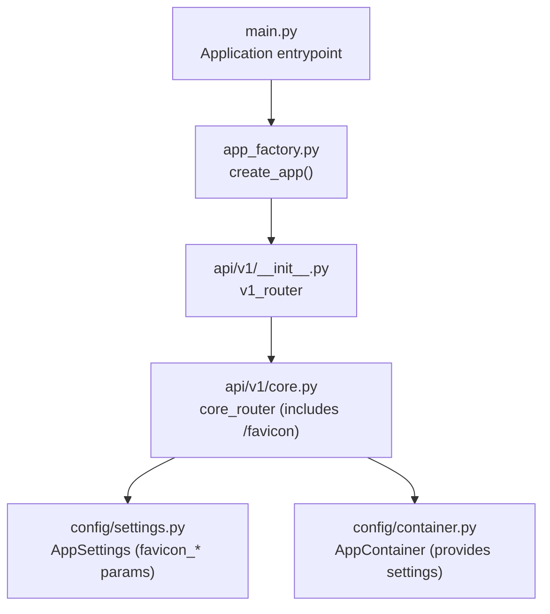
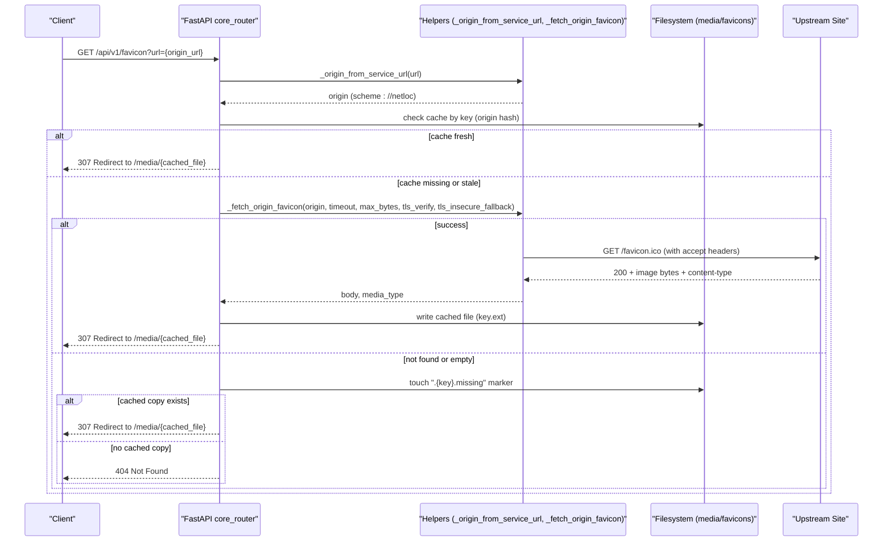
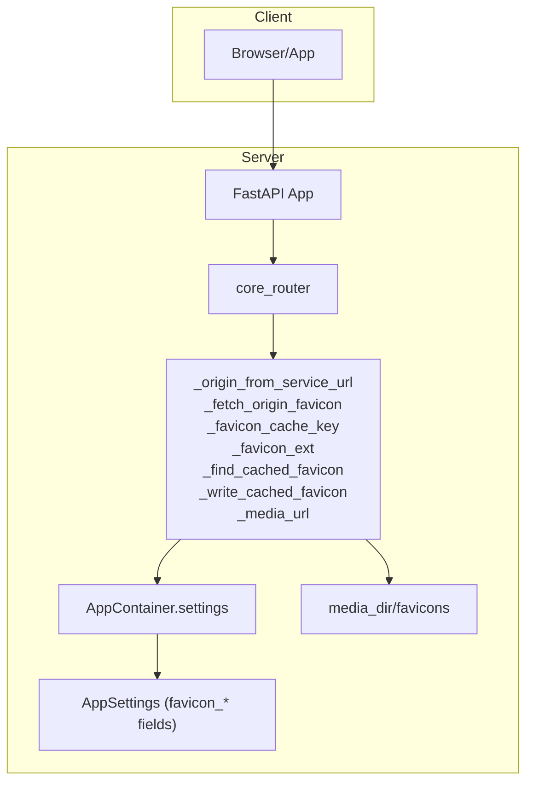
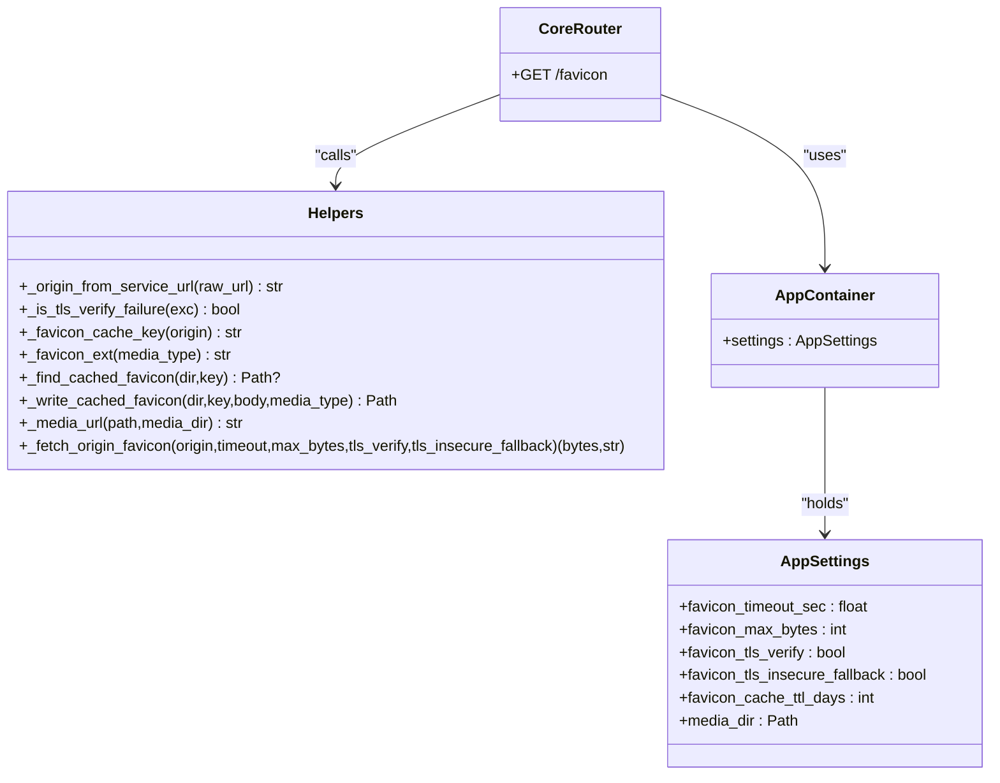
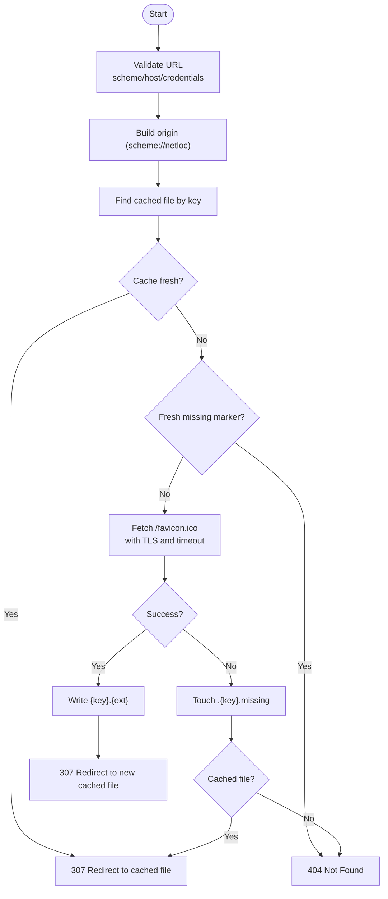
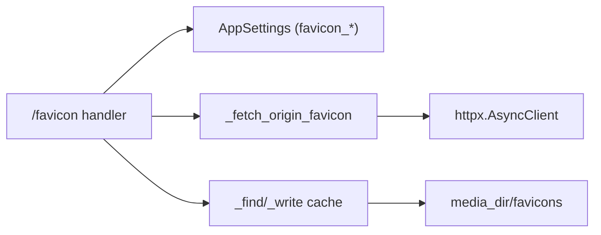

# Favicon Proxy

<cite>
**Referenced Files in This Document**
- [main.py](file://main.py)
- [app_factory.py](file://app_factory.py)
- [api/v1/__init__.py](file://api/v1/__init__.py)
- [api/v1/core.py](file://api/v1/core.py)
- [config/settings.py](file://config/settings.py)
- [config/container.py](file://config/container.py)
</cite>

## Table of Contents
1. [Introduction](#introduction)
2. [Project Structure](#project-structure)
3. [Core Components](#core-components)
4. [Architecture Overview](#architecture-overview)
5. [Detailed Component Analysis](#detailed-component-analysis)
6. [Dependency Analysis](#dependency-analysis)
7. [Performance Considerations](#performance-considerations)
8. [Troubleshooting Guide](#troubleshooting-guide)
9. [Conclusion](#conclusion)

## Introduction
This document describes the favicon proxy endpoint (/favicon) that fetches and serves favicons for arbitrary websites. It covers the GET method, URL validation, origin extraction, TLS verification options, timeouts, intelligent caching with TTL-based expiration, fallback mechanisms, error handling, and security considerations.

## Project Structure
The favicon proxy is implemented as part of the API v1 surface. The FastAPI application is created in the application factory and mounts the v1 routers. The core API router defines the /favicon endpoint and related helpers.

**Diagram sources**
- [main.py:17-21](file://main.py#L17-L21)
- [app_factory.py:122](file://app_factory.py#L122)
- [api/v1/__init__.py:9-13](file://api/v1/__init__.py#L9-L13)
- [api/v1/core.py:40](file://api/v1/core.py#L40)
- [config/settings.py:75-82](file://config/settings.py#L75-L82)
- [config/container.py:50-81](file://config/container.py#L50-L81)

**Section sources**
- [main.py:17-21](file://main.py#L17-L21)
- [app_factory.py:122](file://app_factory.py#L122)
- [api/v1/__init__.py:9-13](file://api/v1/__init__.py#L9-L13)
- [api/v1/core.py:40](file://api/v1/core.py#L40)

## Core Components
- Endpoint: GET /api/v1/favicon?url={url}
- Query parameter:
  - url: string, required, validated for length and allowed scheme/host
- Behavior:
  - Extracts origin from the provided URL
  - Validates URL scheme and absence of embedded credentials
  - Fetches favicon.ico from the origin with configurable TLS and timeout
  - Implements intelligent caching with TTL and missing-favicon markers
  - Returns a redirect to the cached asset under /media

Key behaviors and defaults:
- Timeout: OKO_FAVICON_TIMEOUT_SEC (seconds)
- Max size: OKO_FAVICON_MAX_BYTES (bytes)
- TLS verification: OKO_FAVICON_TLS_VERIFY (boolean)
- TLS insecure fallback: OKO_FAVICON_TLS_INSECURE_FALLBACK (boolean)
- Cache TTL: OKO_FAVICON_CACHE_TTL_DAYS (days)

**Section sources**
- [api/v1/core.py:199-234](file://api/v1/core.py#L199-L234)
- [config/settings.py:75-82](file://config/settings.py#L75-L82)

## Architecture Overview
High-level flow of the favicon proxy:

**Diagram sources**
- [api/v1/core.py:199-234](file://api/v1/core.py#L199-L234)
- [api/v1/core.py:144-196](file://api/v1/core.py#L144-L196)
- [api/v1/core.py:93-141](file://api/v1/core.py#L93-L141)

## Detailed Component Analysis

### Endpoint Definition and Validation
- Route: GET /api/v1/favicon
- Query parameter:
  - url: string, required, min_length=1, max_length=2048
- Origin extraction:
  - Only http/https schemes are accepted
  - Host must be present
  - Credentials (username/password) are rejected

Security validations:
- Rejects non-http/https URLs
- Rejects URLs containing credentials
- Enforces maximum URL length to prevent abuse

Operational behavior:
- Computes cache key from origin via SHA-256 and trims to 32 hex chars
- Ensures cache directory exists under media_dir/favicons

**Section sources**
- [api/v1/core.py:199-210](file://api/v1/core.py#L199-L210)
- [api/v1/core.py:52-58](file://api/v1/core.py#L52-L58)
- [api/v1/core.py:71-73](file://api/v1/core.py#L71-L73)

### Intelligent Caching Strategy
Caching primitives:
- Cache key: 32-character hex derived from SHA-256(origin)
- Cache directory: media_dir/favicons
- Cache freshness: TTL in days from settings
- File extension: derived from content-type; defaults to ico if not an image/*
- Missing favicon marker: .{key}.missing with TTL

Lookup and decisions:
- If a cached file exists and is fresh, return 307 redirect to /media/{file}
- If a fresh missing marker exists, return 404
- Otherwise, fetch upstream and update cache

Cache file naming and cleanup:
- Target: {key}.{ext}
- Temporary: .{key}.{ext}.tmp written then atomically renamed
- On write, removes other files with the same key prefix

**Section sources**
- [api/v1/core.py:105-117](file://api/v1/core.py#L105-L117)
- [api/v1/core.py:130-141](file://api/v1/core.py#L130-L141)
- [api/v1/core.py:76-90](file://api/v1/core.py#L76-L90)

### Favicon Fetching Logic
Fetch parameters:
- timeout_sec: from settings
- max_bytes: from settings
- tls_verify: from settings
- tls_insecure_fallback: from settings

TLS verification and fallback:
- Attempts with tls_verify first
- If enabled and a certificate verification failure is detected, retries with verify=False
- Detects SSL certificate verification failures across multiple error causes

HTTP behavior:
- Requests /favicon.ico from origin
- Uses accept: image/*,*/*;q=0.8 and a dedicated user agent
- Follows redirects
- Treats any 4xx/5xx status as “not found”
- Treats empty body as “not found”
- Enforces max_bytes limit
- Normalizes content-type; if not an image/*, defaults to image/x-icon

Error mapping:
- Connect errors (with TLS verification failure) -> 502
- Timeout exceptions -> 504
- Other HTTP errors -> 502
- Not found or empty body -> 404
- Body too large -> 413

**Section sources**
- [api/v1/core.py:144-196](file://api/v1/core.py#L144-L196)
- [api/v1/core.py:61-68](file://api/v1/core.py#L61-L68)
- [config/settings.py:75-82](file://config/settings.py#L75-L82)

### Response Handling and Redirects
- Successful cache hit: 307 redirect to /media/{cached_file}
- Fresh missing marker: 404 Not Found
- Fresh upstream fetch: writes cache and 307 redirects to new file
- On upstream 404/empty and no cache: marks missing and returns 404
- On upstream 404/empty but cached exists: 307 redirect to cached file

Media URL construction:
- Relative path computed from media_dir and cached file
- Returned as /media/{relative}

**Section sources**
- [api/v1/core.py:212-234](file://api/v1/core.py#L212-L234)
- [api/v1/core.py:125-127](file://api/v1/core.py#L125-L127)

### Security Considerations
- URL validation:
  - Only http/https schemes are allowed
  - Host must be present
  - Credentials are rejected
- Content type handling:
  - Non-image/* content types are coerced to image/x-icon
  - This avoids serving non-image content under an image extension
- TLS verification:
  - Optional strict verification
  - Optional fallback to insecure mode on TLS verification failures
- Size limits:
  - Enforced maximum favicon size prevents resource exhaustion
- Cache isolation:
  - Cache keyed by origin ensures separation across domains

**Section sources**
- [api/v1/core.py:52-58](file://api/v1/core.py#L52-L58)
- [api/v1/core.py:190-196](file://api/v1/core.py#L190-L196)
- [api/v1/core.py:61-68](file://api/v1/core.py#L61-L68)
- [config/settings.py:75-82](file://config/settings.py#L75-L82)

## Architecture Overview

**Diagram sources**
- [app_factory.py:122](file://app_factory.py#L122)
- [api/v1/core.py:40](file://api/v1/core.py#L40)
- [api/v1/core.py:52-196](file://api/v1/core.py#L52-L196)
- [config/container.py:50-81](file://config/container.py#L50-L81)
- [config/settings.py:75-82](file://config/settings.py#L75-L82)

## Detailed Component Analysis

### Class and Helper Relationships

**Diagram sources**
- [api/v1/core.py:40](file://api/v1/core.py#L40)
- [api/v1/core.py:52-196](file://api/v1/core.py#L52-L196)
- [config/container.py:50-81](file://config/container.py#L50-L81)
- [config/settings.py:75-82](file://config/settings.py#L75-L82)

### Fetch Flow (Algorithm)

**Diagram sources**
- [api/v1/core.py:199-234](file://api/v1/core.py#L199-L234)
- [api/v1/core.py:144-196](file://api/v1/core.py#L144-L196)
- [api/v1/core.py:93-141](file://api/v1/core.py#L93-L141)

## Dependency Analysis
- Endpoint depends on:
  - AppContainer.settings for runtime configuration
  - Helpers for URL parsing, TLS detection, caching, and fetching
- Configuration dependencies:
  - favicon_timeout_sec, favicon_max_bytes, favicon_tls_verify, favicon_tls_insecure_fallback, favicon_cache_ttl_days
  - media_dir for cache storage

**Diagram sources**
- [api/v1/core.py:199-234](file://api/v1/core.py#L199-L234)
- [api/v1/core.py:144-196](file://api/v1/core.py#L144-L196)
- [config/settings.py:75-82](file://config/settings.py#L75-L82)

**Section sources**
- [api/v1/core.py:199-234](file://api/v1/core.py#L199-L234)
- [config/settings.py:75-82](file://config/settings.py#L75-L82)

## Performance Considerations
- Caching reduces upstream requests and latency; tune favicon_cache_ttl_days to balance freshness vs. cost.
- Timeouts prevent slow upstreams from blocking clients; adjust favicon_timeout_sec accordingly.
- Size limits protect memory and disk usage; adjust favicon_max_bytes if needed.
- TLS fallback reduces connection failures at the cost of security; keep favicon_tls_verify enabled and rely on fallback only when necessary.

## Troubleshooting Guide
Common failure scenarios and responses:
- 400 Bad Request: Invalid URL (wrong scheme, missing host, credentials)
- 404 Not Found: Favicon not found upstream; if a previous fetch was 404 and cache is stale, the endpoint may still return 404 until cache refresh
- 413 Payload Too Large: Favicon exceeds configured max_bytes
- 502 Bad Gateway: Failed to connect or fetch from upstream (including TLS verification failures)
- 504 Gateway Timeout: Upstream took longer than favicon_timeout_sec

Operational tips:
- Verify upstream site serves /favicon.ico
- Check TLS configuration and network connectivity
- Inspect media_dir/favicons for cache files and .{key}.missing markers
- Review logs for detailed error messages

**Section sources**
- [api/v1/core.py:184-196](file://api/v1/core.py#L184-L196)
- [api/v1/core.py:170-179](file://api/v1/core.py#L170-L179)
- [api/v1/core.py:225-230](file://api/v1/core.py#L225-L230)

## Conclusion
The favicon proxy provides a robust, secure, and efficient way to serve favicons from arbitrary origins. It validates inputs, enforces safe defaults for TLS and sizes, caches intelligently with TTL and missing markers, and gracefully handles upstream failures. Administrators can tune performance and safety via environment-driven settings.