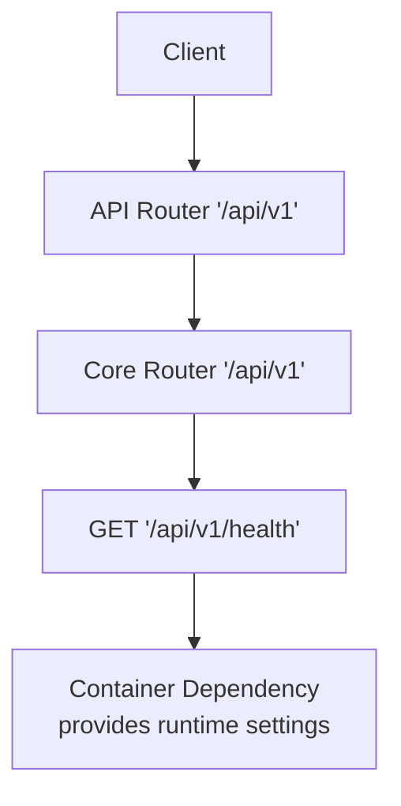
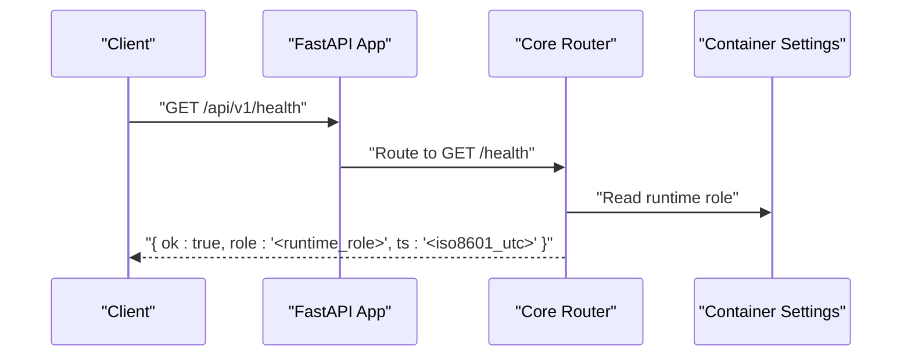
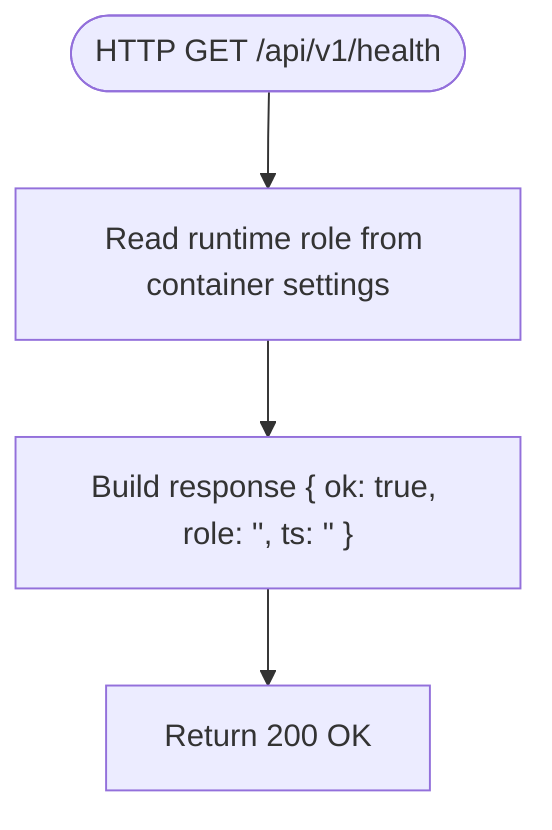
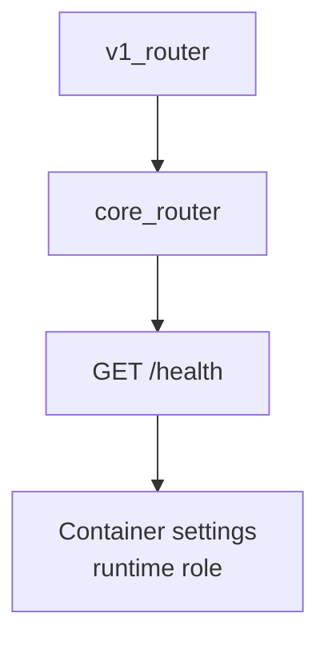

# Health Endpoint

<cite>
**Referenced Files in This Document**
- [core.py](file://api/v1/core.py)
- [__init__.py](file://api/v1/__init__.py)
- [__init__.py](file://api/__init__.py)
- [contracts.py](file://apps/health/model/contracts.py)
- [status.py](file://apps/health/service/status.py)
- [20260223_0002_health_mvp.py](file://alembic/versions/20260223_0002_health_mvp.py)
</cite>

## Table of Contents
1. [Introduction](#introduction)
2. [Project Structure](#project-structure)
3. [Core Components](#core-components)
4. [Architecture Overview](#architecture-overview)
5. [Detailed Component Analysis](#detailed-component-analysis)
6. [Dependency Analysis](#dependency-analysis)
7. [Performance Considerations](#performance-considerations)
8. [Troubleshooting Guide](#troubleshooting-guide)
9. [Conclusion](#conclusion)

## Introduction
This document provides detailed API documentation for the system health check endpoint exposed under GET /api/v1/health. It explains the response format, status codes, and error scenarios, and includes practical examples and integration patterns for monitoring systems. It also covers role-based access control and security considerations for exposing the health endpoint.

## Project Structure
The health endpoint is part of the core API router and is registered under the v1 API namespace. The endpoint is implemented in the core router and relies on the container dependency to access runtime configuration, including the runtime role.

**Diagram sources**
- [__init__.py:9-13](file://api/v1/__init__.py#L9-L13)
- [core.py:40-49](file://api/v1/core.py#L40-L49)

**Section sources**
- [__init__.py:9-13](file://api/v1/__init__.py#L9-L13)
- [core.py:40-49](file://api/v1/core.py#L40-L49)

## Core Components
- Endpoint path: GET /api/v1/health
- Purpose: Returns a lightweight health status indicating the system is operational, the runtime role, and a UTC timestamp.
- Response shape:
  - ok: boolean true when healthy
  - role: string representing the runtime role
  - ts: ISO 8601 UTC timestamp string

The endpoint is intentionally minimal and does not require authentication or authorization. It is designed for public consumption by load balancers, orchestrators, and monitoring systems.

**Section sources**
- [core.py:43-49](file://api/v1/core.py#L43-L49)

## Architecture Overview
The health endpoint is served by the FastAPI application via the v1 router. It reads the runtime role from the container settings and returns a simple JSON payload.

**Diagram sources**
- [core.py:43-49](file://api/v1/core.py#L43-L49)
- [__init__.py:9-13](file://api/v1/__init__.py#L9-L13)

## Detailed Component Analysis

### Endpoint Definition and Behavior
- Route: GET /api/v1/health
- Handler: get_health(container: ContainerDep) -> dict[str, object]
- Response keys:
  - ok: boolean true
  - role: string runtime role from container settings
  - ts: ISO 8601 UTC timestamp string

Behavioral notes:
- The endpoint returns a constant ok: true and a current UTC timestamp.
- The role field reflects the runtime role configured in the container settings.
- No authentication or authorization is enforced by the endpoint itself.

**Diagram sources**
- [core.py:43-49](file://api/v1/core.py#L43-L49)

**Section sources**
- [core.py:43-49](file://api/v1/core.py#L43-L49)

### Response Format and JSON Schema
- Content-Type: application/json
- Status Codes:
  - 200 OK: Successful response with health payload
- Response Body Fields:
  - ok: boolean, always true for this endpoint
  - role: string, runtime role value
  - ts: string, ISO 8601 UTC timestamp

Example response:
{
  "ok": true,
  "role": "primary",
  "ts": "2025-01-01T12:34:56.789Z"
}

Notes:
- The endpoint does not expose internal system state beyond the role and timestamp.
- The role value is derived from container settings and can be used to distinguish primary, secondary, or specialized roles.

**Section sources**
- [core.py:43-49](file://api/v1/core.py#L43-L49)

### Role-Based Access Control and Security Considerations
- Authentication: Not required by the endpoint.
- Authorization: Not required by the endpoint.
- Exposure: Intended for public access by monitoring systems and load balancers.
- Security recommendations:
  - Restrict network exposure at the platform level (firewalls, ingress rules).
  - Prefer private networks or VPN access for the health endpoint if sensitive environments require it.
  - Use transport security (TLS) to protect traffic.
  - Consider rate limiting at the ingress layer to prevent abuse.
  - Monitor repeated health checks to detect anomalies.

[No sources needed since this section provides general guidance]

### Integration Patterns for Monitoring Systems
Common usage patterns:
- Load balancer health probes: Poll GET /api/v1/health at regular intervals; expect 200 OK and ok: true.
- Kubernetes readiness/liveness probes: Configure the endpoint as a liveness probe to ensure restarts on failure; use readiness to gate traffic until the system stabilizes.
- Prometheus scraping: Scrape the endpoint for basic availability metrics; combine with application-specific metrics for comprehensive monitoring.
- Grafana dashboards: Visualize health trends and correlate with logs and events.

[No sources needed since this section provides general guidance]

## Dependency Analysis
The health endpoint depends on the container dependency to access runtime settings, specifically the runtime role. The v1 router aggregates core routes and exposes the health endpoint under the /api/v1 namespace.

**Diagram sources**
- [__init__.py:9-13](file://api/v1/__init__.py#L9-L13)
- [core.py:43-49](file://api/v1/core.py#L43-L49)

**Section sources**
- [__init__.py:9-13](file://api/v1/__init__.py#L9-L13)
- [core.py:43-49](file://api/v1/core.py#L43-L49)

## Performance Considerations
- The endpoint performs minimal work: reading a setting and formatting a timestamp.
- Response size is small, suitable for frequent polling.
- Keepalives and connection reuse are recommended for high-frequency checks to reduce overhead.

[No sources needed since this section provides general guidance]

## Troubleshooting Guide
- Symptom: 5xx responses from /api/v1/health
  - Cause: Application-level error not expected for this endpoint.
  - Action: Check application logs for startup failures or container misconfiguration.
- Symptom: Unexpected role value
  - Cause: Container settings not initialized or misconfigured.
  - Action: Verify container settings initialization and deployment configuration.
- Symptom: Network connectivity issues
  - Cause: Firewall or ingress restrictions.
  - Action: Confirm firewall rules and ingress policies allow access to the endpoint.

[No sources needed since this section provides general guidance]

## Conclusion
The GET /api/v1/health endpoint provides a simple, fast, and reliable way to assess system availability. Its minimal response and lack of authentication make it ideal for automated monitoring and load balancing. Apply platform-level controls and best practices to secure and optimize its exposure in production environments.