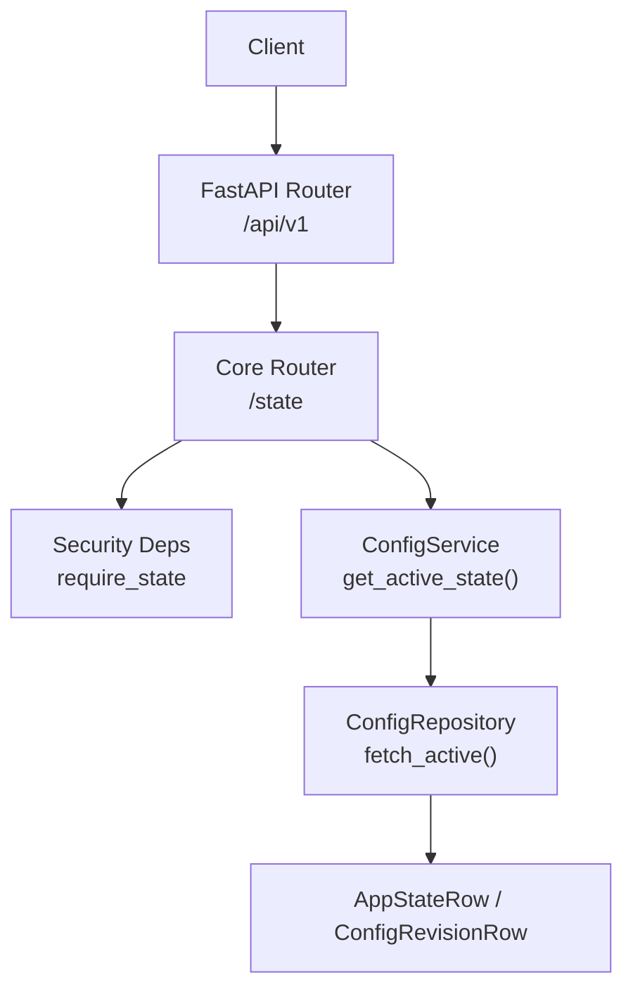
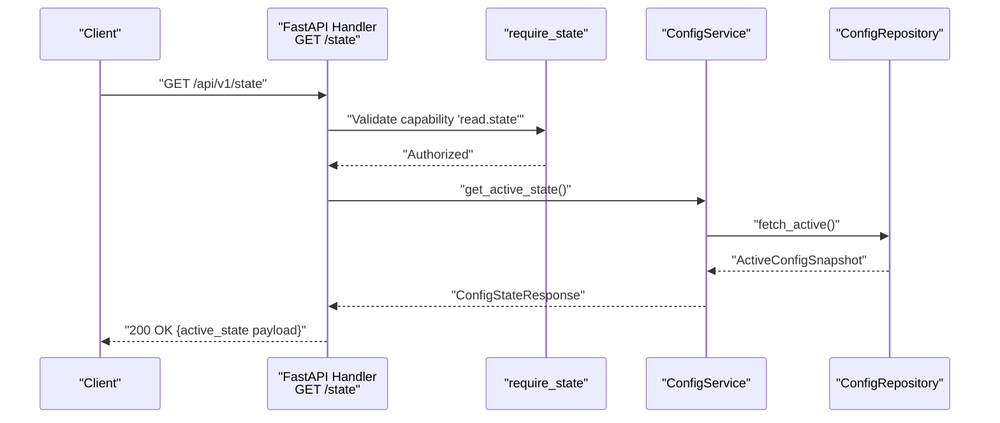
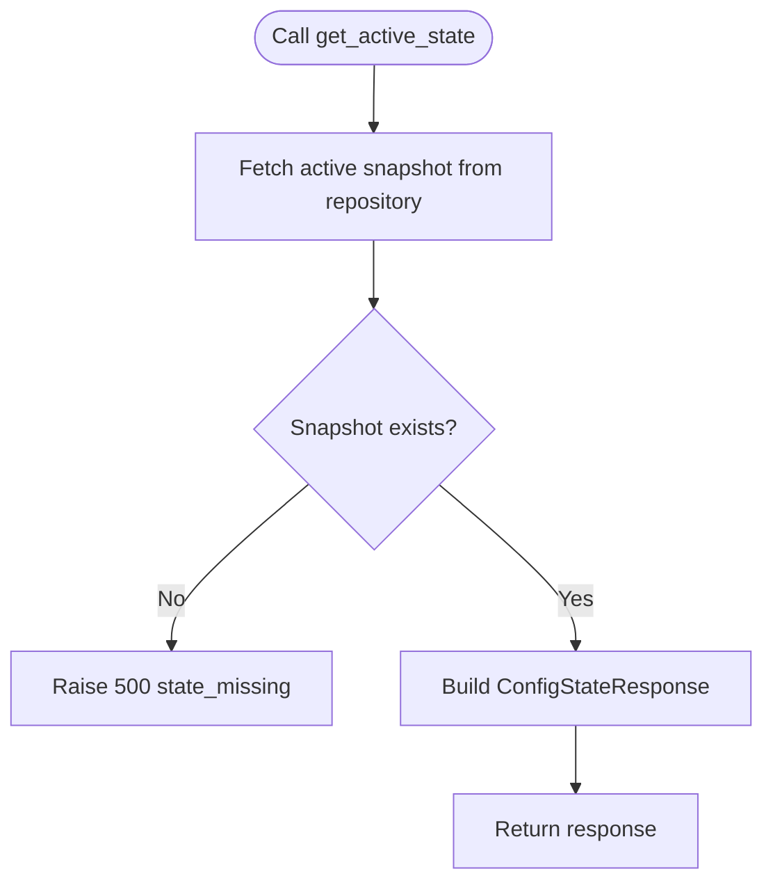
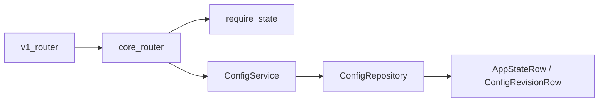

# State Management

<cite>
**Referenced Files in This Document**
- [api/v1/core.py](file://api/v1/core.py)
- [core/config/service.py](file://core/config/service.py)
- [core/security/deps.py](file://core/security/deps.py)
- [core/contracts/models.py](file://core/contracts/models.py)
- [core/storage/repositories.py](file://core/storage/repositories.py)
- [api/v1/__init__.py](file://api/v1/__init__.py)
- [main.py](file://main.py)
</cite>

## Table of Contents
1. [Introduction](#introduction)
2. [Project Structure](#project-structure)
3. [Core Components](#core-components)
4. [Architecture Overview](#architecture-overview)
5. [Detailed Component Analysis](#detailed-component-analysis)
6. [Dependency Analysis](#dependency-analysis)
7. [Performance Considerations](#performance-considerations)
8. [Troubleshooting Guide](#troubleshooting-guide)
9. [Conclusion](#conclusion)

## Introduction
This document provides detailed API documentation for the state management endpoint that retrieves the active system configuration state. It explains the GET /state endpoint, the response format, revision and sequence tracking, and integration patterns for state synchronization. It also covers the require_state capability requirement and the security implications of state access.

## Project Structure
The state retrieval endpoint is part of the core API module and integrates with the configuration service and security dependencies. The FastAPI router exposes the endpoint under the v1 API namespace.

**Diagram sources**
- [api/v1/core.py:237-243](file://api/v1/core.py#L237-L243)
- [core/security/deps.py:40](file://core/security/deps.py#L40)
- [core/config/service.py:56-60](file://core/config/service.py#L56-L60)
- [core/storage/repositories.py:59-72](file://core/storage/repositories.py#L59-L72)

**Section sources**
- [api/v1/__init__.py:9-13](file://api/v1/__init__.py#L9-L13)
- [main.py:17-21](file://main.py#L17-L21)

## Core Components
- Endpoint: GET /api/v1/state
- Purpose: Returns the active system state payload along with associated revision metadata.
- Response shape: A JSON object containing the active state and the current revision details.
- Security: Requires the read.state capability via the require_state dependency.

Key data models:
- ActiveState: Contains active_revision, state_seq, updated_at, updated_by, reason.
- ConfigRevision: Contains revision, parent_revision, sha256, source, payload, created_at, created_by.
- ConfigStateResponse: Wraps active_state and revision.

**Section sources**
- [api/v1/core.py:237-243](file://api/v1/core.py#L237-L243)
- [core/security/deps.py:40](file://core/security/deps.py#L40)
- [core/contracts/models.py:20-31](file://core/contracts/models.py#L20-L31)

## Architecture Overview
The GET /state endpoint orchestrates a simple flow: the handler invokes the configuration service to fetch the active state, which in turn queries the repository for the current active snapshot. The response is returned as a JSON object representing the active state.

**Diagram sources**
- [api/v1/core.py:237-243](file://api/v1/core.py#L237-L243)
- [core/security/deps.py:40](file://core/security/deps.py#L40)
- [core/config/service.py:56-60](file://core/config/service.py#L56-L60)
- [core/storage/repositories.py:59-72](file://core/storage/repositories.py#L59-L72)

## Detailed Component Analysis

### GET /state Endpoint
- Route: GET /api/v1/state
- Handler: get_state(config_service, _capability=require_state)
- Behavior:
  - Validates the caller possesses the read.state capability.
  - Calls config_service.get_active_state().
  - Returns the active_state portion of the response as a JSON object.

Response format:
- The response is a JSON object derived from the active_state model dump.
- ActiveState fields:
  - active_revision: integer revision number of the active configuration.
  - state_seq: monotonic sequence number for state updates.
  - updated_at: timestamp of the last state change.
  - updated_by: actor who applied the change.
  - reason: optional reason for the state change.

Integration note:
- The endpoint returns only the active_state payload, not the full ConfigStateResponse envelope. This simplifies client consumption for state snapshots.

**Section sources**
- [api/v1/core.py:237-243](file://api/v1/core.py#L237-L243)
- [core/contracts/models.py:20-26](file://core/contracts/models.py#L20-L26)

### ConfigService.get_active_state
- Fetches the current active snapshot from the repository.
- Raises an internal server error if the active state is missing.
- Converts the snapshot to a ConfigStateResponse and returns it.

**Diagram sources**
- [core/config/service.py:56-60](file://core/config/service.py#L56-L60)

**Section sources**
- [core/config/service.py:56-60](file://core/config/service.py#L56-L60)

### ConfigRepository.fetch_active
- Retrieves the active state row and the corresponding revision row.
- Builds an ActiveConfigSnapshot with ActiveState and ConfigRevision.
- Returns None if either row is missing.

**Section sources**
- [core/storage/repositories.py:59-72](file://core/storage/repositories.py#L59-L72)

### Security and Capability Requirement
- The endpoint enforces require_state, which checks the X-Oko-Capabilities header for the read.state capability.
- Unauthorized requests receive a 403 error with details indicating the required capability.

**Section sources**
- [core/security/deps.py:40](file://core/security/deps.py#L40)
- [core/security/deps.py:16-28](file://core/security/deps.py#L16-L28)

### Revision and Sequence Tracking
- active_revision: The current revision number stored as active.
- state_seq: Incremented each time the active state changes, enabling clients to detect updates without parsing payloads.
- updated_at, updated_by, reason: Metadata for auditing and operational insights.

These fields are part of the ActiveState model and are included in the response payload.

**Section sources**
- [core/contracts/models.py:20-26](file://core/contracts/models.py#L20-L26)

### Example State Snapshots
Note: The following examples describe the structure and semantics. They are conceptual and not taken from repository files.

- Minimal active state snapshot:
  - active_revision: 42
  - state_seq: 10
  - updated_at: "2025-01-20T12:34:56Z"
  - updated_by: "system"
  - reason: "config_patch"

- Full ConfigStateResponse (used by other endpoints):
  - active_state: { ... as above }
  - revision: {
      "revision": 42,
      "parent_revision": 41,
      "sha256": "a" * 64,
      "source": "patch",
      "payload": { /* configuration payload */ },
      "created_at": "2025-01-20T12:34:56Z",
      "created_by": "operator"
    }

Integration patterns:
- Polling: Clients poll GET /api/v1/state and compare state_seq to detect changes.
- SSE: Use the events stream endpoint to receive real-time notifications when state_seq increments.

**Section sources**
- [core/contracts/models.py:20-31](file://core/contracts/models.py#L20-L31)
- [api/v1/core.py:323-336](file://api/v1/core.py#L323-L336)

## Dependency Analysis
The state endpoint depends on:
- FastAPI router registration under /api/v1
- Security dependency require_state
- ConfigService.get_active_state
- ConfigRepository.fetch_active

**Diagram sources**
- [api/v1/__init__.py:9-13](file://api/v1/__init__.py#L9-L13)
- [api/v1/core.py:237-243](file://api/v1/core.py#L237-L243)
- [core/security/deps.py:40](file://core/security/deps.py#L40)
- [core/config/service.py:56-60](file://core/config/service.py#L56-L60)
- [core/storage/repositories.py:59-72](file://core/storage/repositories.py#L59-L72)

**Section sources**
- [api/v1/__init__.py:9-13](file://api/v1/__init__.py#L9-L13)
- [api/v1/core.py:237-243](file://api/v1/core.py#L237-L243)

## Performance Considerations
- The endpoint performs a single database read to fetch the active state and its associated revision.
- The response is a lightweight JSON object containing scalar fields and timestamps, minimizing payload size.
- For high-frequency polling, consider using the server-sent events stream to avoid repeated HTTP round-trips.

## Troubleshooting Guide
Common issues and resolutions:
- 403 Forbidden: Missing or insufficient capability. Ensure the X-Oko-Capabilities header includes read.state.
- 500 Internal Server Error: Active state is not initialized. Verify that a configuration import or bootstrap operation has occurred.
- 401 Unauthorized: Missing X-Oko-Actor header. Include the actor identifier for authenticated requests.

Operational checks:
- Confirm the v1 router is registered and reachable.
- Validate that the configuration service has a non-null active snapshot.

**Section sources**
- [core/security/deps.py:16-28](file://core/security/deps.py#L16-L28)
- [core/config/service.py:58-60](file://core/config/service.py#L58-L60)
- [main.py:17-21](file://main.py#L17-L21)

## Conclusion
The GET /api/v1/state endpoint provides a concise and efficient way to retrieve the active system state. It leverages capability-based security, returns a minimal JSON payload, and integrates seamlessly with the configuration service and repository layers. Clients can use state_seq for efficient synchronization and optionally subscribe to server-sent events for real-time updates.