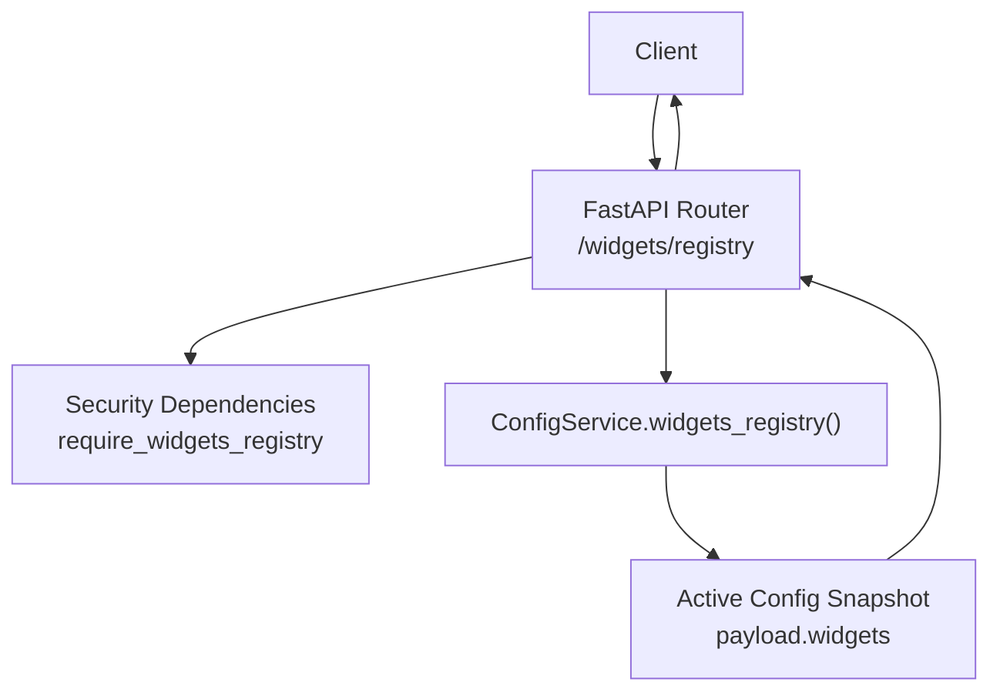
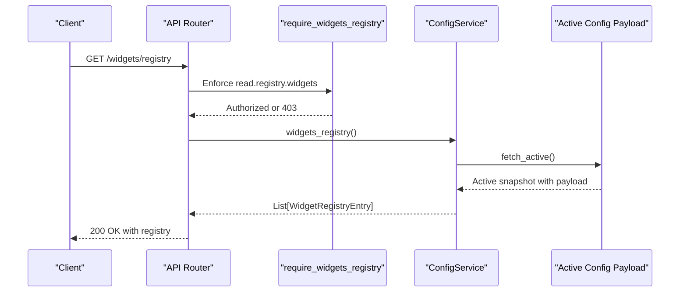
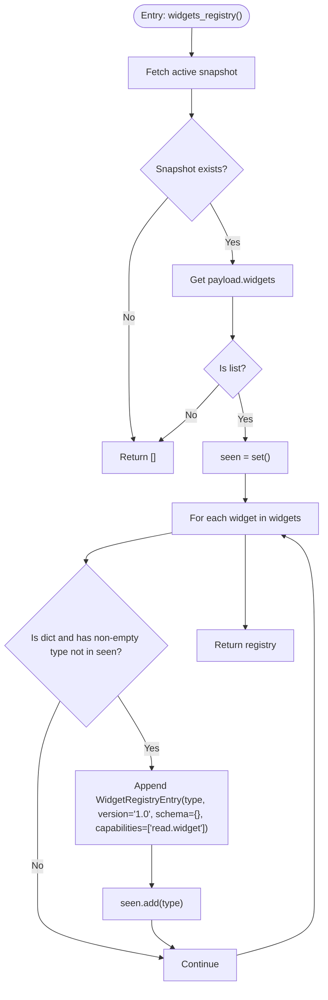
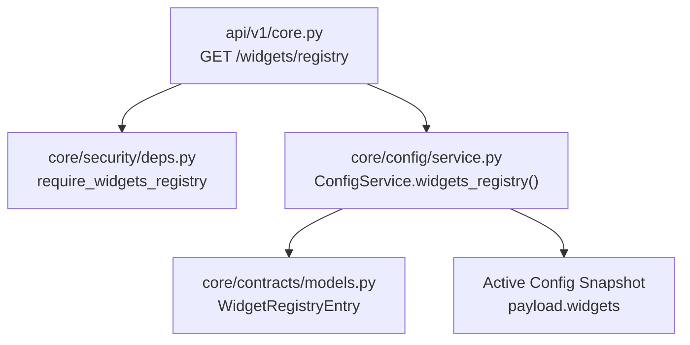

# Widget Registry

<cite>
**Referenced Files in This Document**
- [core.py](file://api/v1/core.py)
- [service.py](file://core/config/service.py)
- [models.py](file://core/contracts/models.py)
- [deps.py](file://core/security/deps.py)
- [page_manifest.yaml](file://plugins/autodiscover/page_manifest.yaml)
- [page_manifest.yaml](file://plugins/dns_trace/page_manifest.yaml)
- [page_manifest.yaml](file://plugins/internet_speed/page_manifest.yaml)
</cite>

## Table of Contents
1. [Introduction](#introduction)
2. [Project Structure](#project-structure)
3. [Core Components](#core-components)
4. [Architecture Overview](#architecture-overview)
5. [Detailed Component Analysis](#detailed-component-analysis)
6. [Dependency Analysis](#dependency-analysis)
7. [Performance Considerations](#performance-considerations)
8. [Troubleshooting Guide](#troubleshooting-guide)
9. [Conclusion](#conclusion)

## Introduction
This document provides comprehensive API documentation for the widget registry endpoint (/widgets/registry). It explains the GET method that returns the list of available widgets using the WidgetRegistryEntry schema, details the widget metadata structure, capabilities, and integration points with the broader system, and outlines client consumption patterns. It also addresses the require_widgets_registry capability requirement and security considerations for widget access.

## Project Structure
The widget registry endpoint is implemented as part of the core API routes and backed by the configuration service. The response schema is defined in the shared contracts module. Security enforcement is handled via capability-based dependencies.

**Diagram sources**
- [core.py:303-308](file://api/v1/core.py#L303-L308)
- [deps.py:47](file://core/security/deps.py#L47)
- [service.py:128-154](file://core/config/service.py#L128-L154)

**Section sources**
- [core.py:303-308](file://api/v1/core.py#L303-L308)
- [service.py:128-154](file://core/config/service.py#L128-L154)
- [models.py:103-109](file://core/contracts/models.py#L103-L109)
- [deps.py:47](file://core/security/deps.py#L47)

## Core Components
- Endpoint: GET /widgets/registry
- Response model: list[WidgetRegistryEntry]
- Security requirement: read.registry.widgets capability enforced via require_widgets_registry dependency
- Back-end logic: ConfigService.widgets_registry() reads the active configuration snapshot and extracts unique widget types

Key behaviors:
- Returns an empty list if no active configuration exists or if the widgets payload is missing/not a list
- Deduplicates widget entries by type
- Populates each entry with a fixed version and an empty JSON schema placeholder
- Assigns a default capability for reading widget data

**Section sources**
- [core.py:303-308](file://api/v1/core.py#L303-L308)
- [service.py:128-154](file://core/config/service.py#L128-L154)
- [models.py:103-109](file://core/contracts/models.py#L103-L109)
- [deps.py:47](file://core/security/deps.py#L47)

## Architecture Overview
The widget registry endpoint follows a layered architecture:
- API layer: FastAPI route handler with capability enforcement
- Service layer: Business logic for assembling the registry from active configuration
- Data layer: Access to the active configuration snapshot containing the widgets payload

**Diagram sources**
- [core.py:303-308](file://api/v1/core.py#L303-L308)
- [deps.py:47](file://core/security/deps.py#L47)
- [service.py:128-154](file://core/config/service.py#L128-L154)

## Detailed Component Analysis

### Endpoint Definition
- Method: GET
- Path: /widgets/registry
- Response model: list[WidgetRegistryEntry]
- Security: require_widgets_registry dependency enforces the read.registry.widgets capability

Behavioral notes:
- The handler delegates to ConfigService.widgets_registry()
- The service method returns an empty list if the active snapshot is unavailable or the payload lacks a valid widgets array

**Section sources**
- [core.py:303-308](file://api/v1/core.py#L303-L308)
- [deps.py:47](file://core/security/deps.py#L47)

### WidgetRegistryEntry Schema
WidgetRegistryEntry defines the structure of each registry entry:
- type: string identifying the widget type
- version: string representing the widget schema version
- schema: dict (JSON schema placeholder) serialized as "schema"
- capabilities: list of strings representing required capabilities for the widget

Notes:
- The current implementation sets version to a fixed value and schema to an empty dict
- The capabilities list includes a default capability for reading widget data

**Section sources**
- [models.py:103-109](file://core/contracts/models.py#L103-L109)

### Service Implementation Details
ConfigService.widgets_registry():
- Fetches the active configuration snapshot
- Extracts the widgets array from the payload
- Iterates through entries, filtering invalid or duplicate types
- Builds a list of WidgetRegistryEntry instances with deduplication by type

Processing logic highlights:
- Validates that the payload contains a list under the "widgets" key
- Skips entries that are not dictionaries or lack a non-empty type
- Ensures uniqueness of widget types using a set
- Constructs entries with fixed version and empty schema, plus a default capability

**Diagram sources**
- [service.py:128-154](file://core/config/service.py#L128-L154)

**Section sources**
- [service.py:128-154](file://core/config/service.py#L128-L154)

### Security and Capability Enforcement
- The endpoint requires the read.registry.widgets capability
- The dependency checks the X-Oko-Capabilities header and raises a 403 error if the capability is missing
- The X-Oko-Actor header is also required for actor identification

Client considerations:
- Include X-Oko-Capabilities: read.registry.widgets in requests
- Include X-Oko-Actor: <actor-name> to identify the requester

**Section sources**
- [deps.py:16-28](file://core/security/deps.py#L16-L28)
- [deps.py:47](file://core/security/deps.py#L47)

### Integration Points and Examples
While the registry endpoint returns a minimal schema, downstream plugins and dashboards integrate widgets through page manifests. These manifests define how widgets appear and behave on pages, including data sources and UI mappings.

Example integration patterns (conceptual):
- A plugin exposes a dashboard indicator with a widget type that appears in the registry
- The widget’s page manifest specifies data endpoints and UI mappings
- Clients consume the registry to discover available widget types and then fetch widget-specific data from plugin endpoints

Relevant manifest examples:
- Autodiscover plugin: Defines dashboard indicators and data sources
- DNS Trace plugin: Provides a stat_list widget with multiple tabs and mappings
- Internet Speed plugin: Includes a client probe script and structured data mappings

Note: The registry itself does not include these UI details; they are defined in plugin page manifests.

**Section sources**
- [page_manifest.yaml:21-75](file://plugins/autodiscover/page_manifest.yaml#L21-L75)
- [page_manifest.yaml:21-68](file://plugins/dns_trace/page_manifest.yaml#L21-L68)
- [page_manifest.yaml:21-261](file://plugins/internet_speed/page_manifest.yaml#L21-L261)

## Dependency Analysis
The endpoint has clear, focused dependencies:
- API layer depends on security dependencies for capability enforcement
- Service layer depends on the configuration repository to read active snapshots
- Contracts module defines the shared response schema

**Diagram sources**
- [core.py:303-308](file://api/v1/core.py#L303-L308)
- [deps.py:47](file://core/security/deps.py#L47)
- [service.py:128-154](file://core/config/service.py#L128-L154)
- [models.py:103-109](file://core/contracts/models.py#L103-L109)

**Section sources**
- [core.py:303-308](file://api/v1/core.py#L303-L308)
- [deps.py:47](file://core/security/deps.py#L47)
- [service.py:128-154](file://core/config/service.py#L128-L154)
- [models.py:103-109](file://core/contracts/models.py#L103-L109)

## Performance Considerations
- The registry endpoint performs a single read of the active configuration snapshot and iterates through a list of widgets
- Complexity is O(n) with respect to the number of widget entries in the payload
- Deduplication uses a set for O(1) average-time lookups, ensuring efficient uniqueness checks
- The response payload is small (strings and lists), minimizing serialization overhead

Recommendations:
- Keep the widgets payload concise and avoid unnecessary duplication
- Consider pagination if the number of widget entries grows very large (not currently implemented)

[No sources needed since this section provides general guidance]

## Troubleshooting Guide
Common issues and resolutions:
- 403 Forbidden: Missing or insufficient capabilities
  - Ensure the X-Oko-Capabilities header includes read.registry.widgets
  - Verify the X-Oko-Actor header is present and valid
- Empty response: No active configuration or missing widgets payload
  - Confirm that an active configuration exists and contains a widgets array
  - Validate that each widget entry is a dictionary with a non-empty type field
- Unexpected duplicates: Multiple entries with the same type
  - The service deduplicates by type; ensure unique types are used

**Section sources**
- [deps.py:16-28](file://core/security/deps.py#L16-L28)
- [service.py:128-154](file://core/config/service.py#L128-L154)

## Conclusion
The /widgets/registry endpoint provides a simple, capability-protected mechanism to enumerate available widget types derived from the active configuration. Its response schema is minimal but extensible, and integration with plugins occurs through page manifests that define widget behavior and data sources. Clients should include the required capabilities and actor headers and can use the returned widget types to drive downstream widget rendering and data fetching.