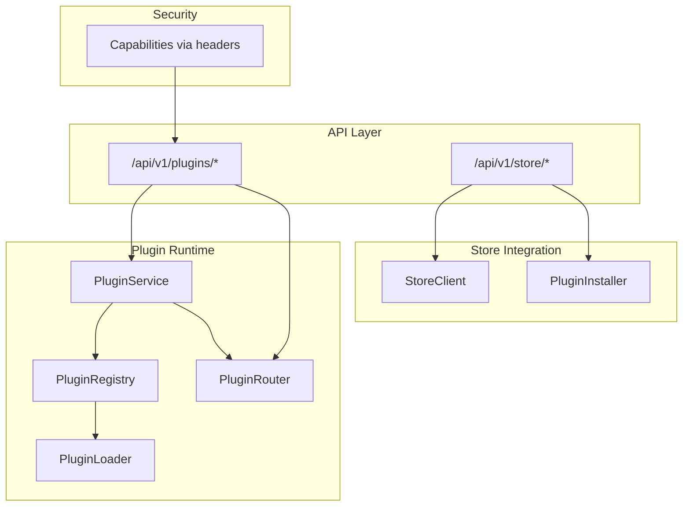
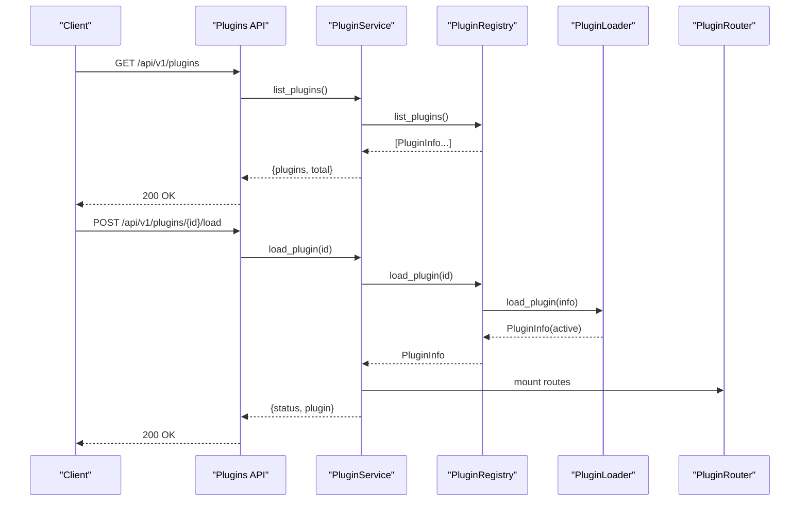
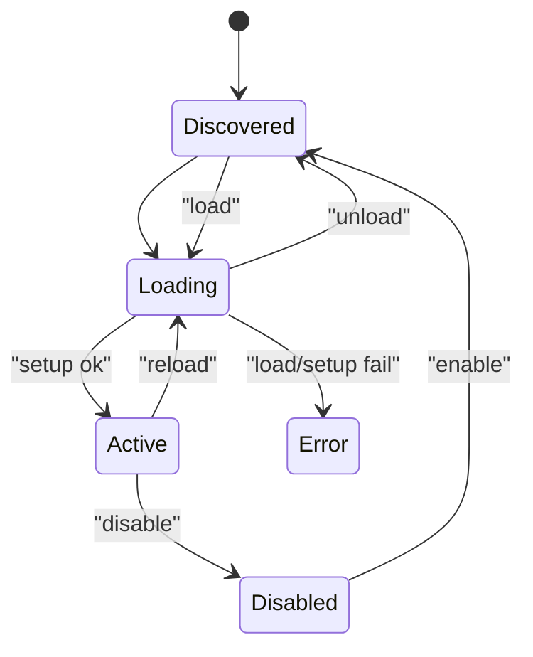
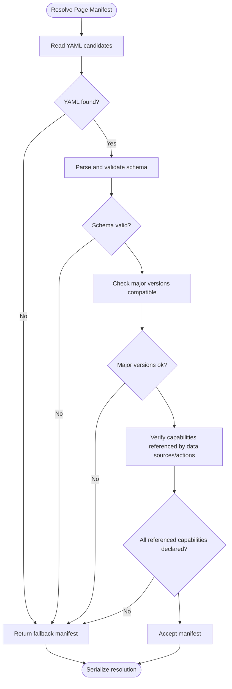
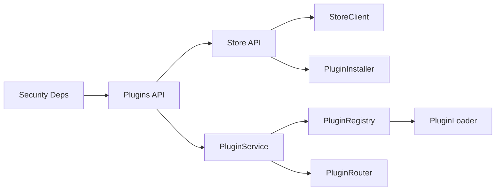

# Plugins API

<cite>
**Referenced Files in This Document**
- [plugins.py](file://api/v1/plugins.py)
- [store.py](file://api/v1/store.py)
- [service.py](file://core/plugins/service.py)
- [registry.py](file://core/plugins/registry.py)
- [router.py](file://core/plugins/router.py)
- [loader.py](file://core/plugins/loader.py)
- [page_manifest.py](file://core/plugins/page_manifest.py)
- [schemas.py](file://core/plugins/schemas.py)
- [deps.py](file://core/security/deps.py)
- [app_factory.py](file://app_factory.py)
- [main.py](file://main.py)
- [store.py](file://core/plugins/store.py)
- [manifest.py](file://plugins/autodiscover/manifest.py)
- [page_manifest.yaml](file://plugins/autodiscover/page_manifest.yaml)
</cite>

## Table of Contents
1. [Introduction](#introduction)
2. [Project Structure](#project-structure)
3. [Core Components](#core-components)
4. [Architecture Overview](#architecture-overview)
5. [Detailed Component Analysis](#detailed-component-analysis)
6. [Dependency Analysis](#dependency-analysis)
7. [Performance Considerations](#performance-considerations)
8. [Troubleshooting Guide](#troubleshooting-guide)
9. [Conclusion](#conclusion)
10. [Appendices](#appendices)

## Introduction
This document provides comprehensive API documentation for the Plugins subsystem. It covers plugin lifecycle management, discovery, loading/unloading, enabling/disabling, configuration retrieval and updates, marketplace integration, and capability-driven access control. It also documents plugin validation, dependency resolution, and security considerations including sandboxing and permissions.

## Project Structure
The Plugins API is implemented as part of the v1 API surface and integrates with a dynamic plugin router and registry. The store integration exposes endpoints to discover, install, and uninstall plugins from a remote marketplace.

**Diagram sources**
- [plugins.py:19-361](file://api/v1/plugins.py#L19-L361)
- [store.py:8-113](file://api/v1/store.py#L8-L113)
- [service.py:18-299](file://core/plugins/service.py#L18-L299)
- [registry.py:26-406](file://core/plugins/registry.py#L26-L406)
- [router.py:16-447](file://core/plugins/router.py#L16-L447)
- [loader.py:110-329](file://core/plugins/loader.py#L110-L329)
- [store.py:30-238](file://core/plugins/store.py#L30-L238)

**Section sources**
- [plugins.py:19-361](file://api/v1/plugins.py#L19-L361)
- [store.py:8-113](file://api/v1/store.py#L8-L113)
- [service.py:18-299](file://core/plugins/service.py#L18-L299)
- [registry.py:26-406](file://core/plugins/registry.py#L26-L406)
- [router.py:16-447](file://core/plugins/router.py#L16-L447)
- [loader.py:110-329](file://core/plugins/loader.py#L110-L329)
- [store.py:30-238](file://core/plugins/store.py#L30-L238)

## Core Components
- Plugin API Router: Defines endpoints for listing, loading, unloading, enabling, disabling, manifests, services, settings, and registry inspection.
- Store API Router: Provides endpoints to query the marketplace, health, fetch plugin manifests, and install/uninstall plugins locally.
- PluginService: Orchestrates registry, router, and runtime hooks; manages plugin lifecycle and filesystem fingerprinting.
- PluginRegistry: Discovers, loads, enables/disables, and unloads plugins; maintains in-memory state and metadata.
- PluginRouter: Mounts/unmounts plugin pages and APIs at runtime based on UI configuration.
- PluginLoader: Dynamically imports plugin modules and handles teardown.
- StoreClient and PluginInstaller: Integrate with a remote plugin store to sync, download, and install plugins locally.
- Security Dependencies: Enforce capability-based access control via HTTP headers.

**Section sources**
- [plugins.py:23-361](file://api/v1/plugins.py#L23-L361)
- [store.py:11-113](file://api/v1/store.py#L11-L113)
- [service.py:18-299](file://core/plugins/service.py#L18-L299)
- [registry.py:26-406](file://core/plugins/registry.py#L26-L406)
- [router.py:16-447](file://core/plugins/router.py#L16-L447)
- [loader.py:110-329](file://core/plugins/loader.py#L110-L329)
- [store.py:30-238](file://core/plugins/store.py#L30-L238)
- [deps.py:16-74](file://core/security/deps.py#L16-L74)

## Architecture Overview
The Plugins API is composed of two primary routers:
- /api/v1/plugins: Lifecycle and introspection endpoints for plugins.
- /api/v1/store: Marketplace integration for discovering and installing plugins.

The runtime integrates with a PluginService that coordinates a PluginRegistry and a PluginRouter. The registry uses a PluginLoader to dynamically import plugin modules. The router mounts plugin pages and APIs based on UI configuration. Store endpoints delegate to a StoreClient and PluginInstaller to manage local plugin directories.

**Diagram sources**
- [plugins.py:23-361](file://api/v1/plugins.py#L23-L361)
- [service.py:75-111](file://core/plugins/service.py#L75-L111)
- [registry.py:286-318](file://core/plugins/registry.py#L286-L318)
- [loader.py:119-171](file://core/plugins/loader.py#L119-L171)
- [router.py:118-155](file://core/plugins/router.py#L118-L155)

**Section sources**
- [app_factory.py:20-41](file://app_factory.py#L20-L41)
- [main.py:17-23](file://main.py#L17-L23)

## Detailed Component Analysis

### Plugins API Endpoints
All plugin endpoints are defined under /api/v1/plugins and protected by capability-based authentication.

- List plugins
  - Method: GET
  - URL: /api/v1/plugins
  - Query: state (optional) — filter by state among discovered, loading, active, error, disabled
  - Authentication: read.plugins.list
  - Response: { plugins: PluginInfo[], total: number }
  - Notes: If plugin service is unavailable, returns empty list.

- Get plugin by ID
  - Method: GET
  - URL: /api/v1/plugins/{plugin_id}
  - Authentication: read.plugins.list
  - Response: PluginInfo
  - Errors: 404 if plugin not found

- Get plugin manifest (page manifest)
  - Method: GET
  - URL: /api/v1/plugins/{plugin_id}/manifest
  - Authentication: read.plugins.manifest
  - Response: { plugin_id: string, manifest: object, negotiation: object }
  - Validation: Validates page manifest schema and enforces capability declarations; returns negotiated payload with acceptance and reasons.

- Get plugin services
  - Method: GET
  - URL: /api/v1/plugins/{plugin_id}/services
  - Authentication: read.plugins.services
  - Response: { plugin_id: string, ...plugin-provided keys }
  - Errors: 404 if plugin lacks handler or handler invalid

- Get plugin settings
  - Method: GET
  - URL: /api/v1/plugins/{plugin_id}/settings
  - Authentication: read.plugins.services
  - Response: { plugin_id: string, ...plugin-provided keys }
  - Errors: 404 if plugin lacks handler or handler invalid

- Update plugin settings
  - Method: PUT
  - URL: /api/v1/plugins/{plugin_id}/settings
  - Authentication: write.config.patch
  - Request body: arbitrary object (plugin-defined schema)
  - Response: { plugin_id: string, ...plugin-provided keys }
  - Errors: 404 if plugin lacks handler or handler invalid

- Get registry overview
  - Method: GET
  - URL: /api/v1/plugins/registry
  - Authentication: read.registry.actions
  - Response: { plugins: [{ id, name, version, capabilities, actions, events, ui_config }], total }

- Load plugin
  - Method: POST
  - URL: /api/v1/plugins/{plugin_id}/load
  - Authentication: exec.actions.execute
  - Response: { status: "loaded", plugin: PluginInfo }
  - Errors: 404 for unknown plugin, 500 for load failures

- Unload plugin
  - Method: POST
  - URL: /api/v1/plugins/{plugin_id}/unload
  - Authentication: exec.actions.execute
  - Response: { status: "unloaded", plugin_id }
  - Errors: 400 if unload fails

- Reload plugin
  - Method: POST
  - URL: /api/v1/plugins/{plugin_id}/reload
  - Authentication: exec.actions.execute
  - Response: { status: "reloaded", plugin: PluginInfo }
  - Errors: 500 for reload failures

- Enable plugin
  - Method: POST
  - URL: /api/v1/plugins/{plugin_id}/enable
  - Authentication: exec.actions.execute
  - Response: { status: "enabled", plugin: PluginInfo }
  - Errors: 404 for unknown plugin, 500 for enable failures

- Disable plugin
  - Method: POST
  - URL: /api/v1/plugins/{plugin_id}/disable
  - Authentication: exec.actions.execute
  - Response: { status: "disabled", plugin_id }
  - Errors: 400 if disable fails

- Delete plugin
  - Method: DELETE
  - URL: /api/v1/plugins/{plugin_id}
  - Authentication: exec.actions.execute
  - Response: { status: "deleted", plugin_id, message }
  - Errors: 503 if service/installer not configured, 404 if not found

**Section sources**
- [plugins.py:23-361](file://api/v1/plugins.py#L23-L361)
- [deps.py:40-54](file://core/security/deps.py#L40-L54)
- [page_manifest.py:219-323](file://core/plugins/page_manifest.py#L219-L323)

### Store API Endpoints
- Get store info and available plugins
  - Method: GET
  - URL: /api/v1/store
  - Authentication: Not enforced by endpoints (depends on container)
  - Response: { available: boolean, plugins: [...], total: number }

- Check store health
  - Method: GET
  - URL: /api/v1/store/health
  - Response: { available: boolean, status: string }

- Get store plugin manifest
  - Method: GET
  - URL: /api/v1/store/{plugin_id}
  - Response: manifest object
  - Errors: 404 if not found in store

- Install plugin from store
  - Method: POST
  - URL: /api/v1/store/{plugin_id}/install
  - Description: Downloads and installs plugin to local plugins directory
  - Response: { status: "installed", plugin: PluginInfo, message }
  - Errors: 503 if store/installer not configured, 500 on failure

- Uninstall plugin from backend
  - Method: POST
  - URL: /api/v1/store/{plugin_id}/uninstall
  - Description: Removes plugin from local plugins directory
  - Response: { status: "uninstalled", plugin_id, message }
  - Errors: 404 if not found

**Section sources**
- [store.py:11-113](file://api/v1/store.py#L11-L113)
- [store.py:44-230](file://core/plugins/store.py#L44-L230)

### Plugin Lifecycle Management
- Discovery: PluginScanner scans configured directories and registers packages with manifest or minimal metadata.
- Loading: PluginLoader dynamically imports plugin modules; on success, state transitions to ACTIVE.
- Initialization: If plugin module exports setup, it is invoked with supported kwargs.
- Enabling/Disabling: Enables discovery of disabled plugins; disables transition to DISABLED and unloads module.
- Reloading: Unload then load; mounts routes after load.
- Teardown: If plugin module exports teardown, it is called during unload.
- Runtime Hooks: PluginService schedules on_startup/on_shutdown hooks per plugin.

**Diagram sources**
- [schemas.py:9-16](file://core/plugins/schemas.py#L9-L16)
- [registry.py:286-384](file://core/plugins/registry.py#L286-L384)
- [service.py:135-201](file://core/plugins/service.py#L135-L201)

**Section sources**
- [registry.py:81-135](file://core/plugins/registry.py#L81-L135)
- [loader.py:119-217](file://core/plugins/loader.py#L119-L217)
- [service.py:188-201](file://core/plugins/service.py#L188-L201)

### Plugin Validation and Capability Management
- Page Manifest Validation: The system resolves and validates a page manifest from YAML, ensuring major version compatibility and capability declarations match declared capabilities.
- Capability Declaration Mismatch: If data sources or actions reference undeclared capabilities, the manifest is rejected and a fallback is returned.
- UI Sandbox: Frontend rendering and custom bundles support sandbox toggles.

**Diagram sources**
- [page_manifest.py:219-323](file://core/plugins/page_manifest.py#L219-L323)

**Section sources**
- [page_manifest.py:20-347](file://core/plugins/page_manifest.py#L20-L347)

### Security, Access Control, and Sandboxing
- Authentication: Each endpoint requires a capability header. Examples include read.plugins.list, read.plugins.manifest, read.plugins.services, write.config.patch, exec.actions.execute, and read.registry.actions.
- Actor Header: X-Oko-Actor is required for requests; missing or empty triggers unauthorized response.
- Sandbox: Page manifest supports a sandbox flag for frontend rendering and custom bundles.

**Section sources**
- [deps.py:10-74](file://core/security/deps.py#L10-L74)
- [page_manifest.py:142-149](file://core/plugins/page_manifest.py#L142-L149)

### Client Implementation Guidelines
- Discovery and Installation
  - Use /api/v1/store to discover available plugins and check health.
  - Install a plugin by calling /api/v1/store/{plugin_id}/install; this places the plugin in the backend’s plugin directory.
  - After installation, refresh runtime so the plugin becomes discoverable and can be loaded.
- Loading and Enabling
  - Load a plugin with /api/v1/plugins/{plugin_id}/load; if successful, routes are mounted automatically.
  - Enable a disabled plugin with /api/v1/plugins/{plugin_id}/enable.
- Configuration Management
  - Retrieve current settings via /api/v1/plugins/{plugin_id}/settings.
  - Update settings via PUT /api/v1/plugins/{plugin_id}/settings with plugin-defined schema.
- Registry and Manifests
  - Inspect registry via /api/v1/plugins/registry.
  - Fetch page manifest via /api/v1/plugins/{plugin_id}/manifest to render UI components and validate capabilities.
- Uninstallation
  - Disable and delete via /api/v1/plugins/{plugin_id} (ensure plugin is disabled first).
  - Uninstall from backend via /api/v1/store/{plugin_id}/uninstall.

**Section sources**
- [store.py:11-113](file://api/v1/store.py#L11-L113)
- [plugins.py:23-361](file://api/v1/plugins.py#L23-L361)
- [service.py:224-283](file://core/plugins/service.py#L224-L283)

## Dependency Analysis
The Plugins API depends on:
- PluginService for orchestration and runtime management.
- PluginRegistry for discovery and state transitions.
- PluginRouter for dynamic route mounting.
- StoreClient and PluginInstaller for marketplace integration.
- Security dependencies for capability enforcement.

**Diagram sources**
- [plugins.py:19-361](file://api/v1/plugins.py#L19-L361)
- [store.py:8-113](file://api/v1/store.py#L8-L113)
- [service.py:18-73](file://core/plugins/service.py#L18-L73)
- [registry.py:26-58](file://core/plugins/registry.py#L26-L58)
- [router.py:16-51](file://core/plugins/router.py#L16-L51)
- [loader.py:110-171](file://core/plugins/loader.py#L110-L171)
- [store.py:30-120](file://core/plugins/store.py#L30-L120)
- [deps.py:16-74](file://core/security/deps.py#L16-L74)

**Section sources**
- [app_factory.py:20-41](file://app_factory.py#L20-L41)
- [main.py:17-23](file://main.py#L17-L23)

## Performance Considerations
- Runtime Refresh Loop: PluginService periodically checks filesystem fingerprints and refreshes active plugins, emitting logs for added/removed/reloaded/failed changes.
- Async Hooks: Startup/shutdown hooks are scheduled asynchronously to avoid blocking the main thread.
- Route Mounting: Routes are mounted/unmounted efficiently based on plugin state and UI configuration.

**Section sources**
- [service.py:285-296](file://core/plugins/service.py#L285-L296)
- [service.py:135-201](file://core/plugins/service.py#L135-L201)
- [router.py:118-172](file://core/plugins/router.py#L118-L172)

## Troubleshooting Guide
- Capability Required
  - Symptom: 403 Forbidden with capability requirement.
  - Resolution: Ensure X-Oko-Capabilities header includes the required capability for the endpoint.
- Actor Required
  - Symptom: 401 Unauthorized due to missing X-Oko-Actor.
  - Resolution: Provide a non-empty X-Oko-Actor header.
- Plugin Not Found
  - Symptom: 404 when accessing plugin endpoints.
  - Resolution: Verify plugin exists in registry and is discoverable; ensure installation succeeded and runtime refreshed.
- Load/Enable/Reload Failures
  - Symptom: 500 errors on load/enable/reload.
  - Resolution: Check plugin module for errors; confirm manifest and UI config are valid; review logs for setup failures.
- Store Not Configured
  - Symptom: 503 on store endpoints.
  - Resolution: Configure store client and installer in the container; verify store URL and connectivity.
- Settings Handler Issues
  - Symptom: 404 or 500 when fetching/updating settings.
  - Resolution: Ensure plugin module exports get_settings/update_settings handlers returning dicts.

**Section sources**
- [deps.py:16-74](file://core/security/deps.py#L16-L74)
- [plugins.py:63-175](file://api/v1/plugins.py#L63-L175)
- [store.py:14-110](file://api/v1/store.py#L14-L110)
- [registry.py:306-318](file://core/plugins/registry.py#L306-L318)

## Conclusion
The Plugins API provides a robust, capability-guarded system for managing plugins across discovery, loading, enabling/disabling, configuration, and marketplace integration. Strong validation ensures manifests and capabilities align, while sandboxing and access controls protect the platform. Clients should follow the recommended lifecycle and use store endpoints to manage installations reliably.

## Appendices

### Endpoint Reference Summary
- Plugins
  - GET /api/v1/plugins
  - GET /api/v1/plugins/{plugin_id}
  - GET /api/v1/plugins/{plugin_id}/manifest
  - GET /api/v1/plugins/{plugin_id}/services
  - GET /api/v1/plugins/{plugin_id}/settings
  - PUT /api/v1/plugins/{plugin_id}/settings
  - GET /api/v1/plugins/registry
  - POST /api/v1/plugins/{plugin_id}/load
  - POST /api/v1/plugins/{plugin_id}/unload
  - POST /api/v1/plugins/{plugin_id}/reload
  - POST /api/v1/plugins/{plugin_id}/enable
  - POST /api/v1/plugins/{plugin_id}/disable
  - DELETE /api/v1/plugins/{plugin_id}
- Store
  - GET /api/v1/store
  - GET /api/v1/store/health
  - GET /api/v1/store/{plugin_id}
  - POST /api/v1/store/{plugin_id}/install
  - POST /api/v1/store/{plugin_id}/uninstall

### Example Plugin Manifest and Page Manifest
- Example plugin manifest constants and actions/events are defined in the autodiscover plugin.
- Example page manifest demonstrates capabilities, frontend sandbox, page components, data sources, and row actions.

**Section sources**
- [manifest.py:5-54](file://plugins/autodiscover/manifest.py#L5-L54)
- [page_manifest.yaml:1-93](file://plugins/autodiscover/page_manifest.yaml#L1-L93)