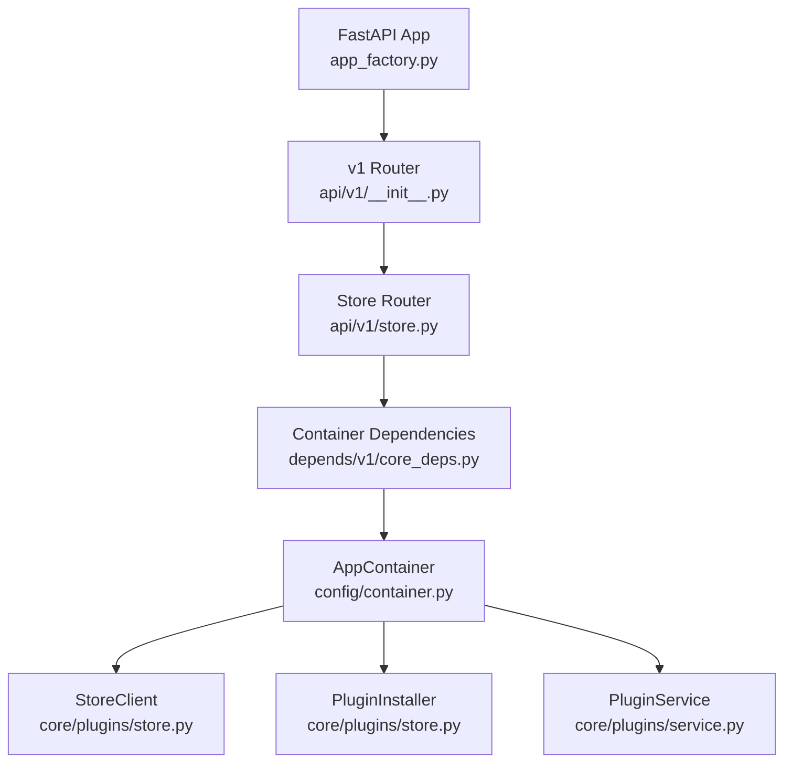
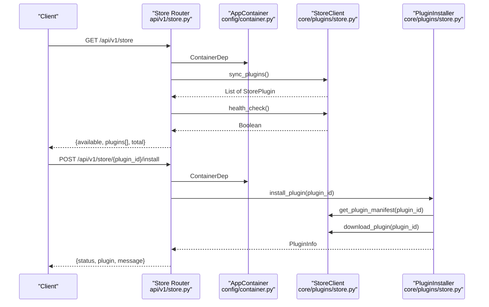
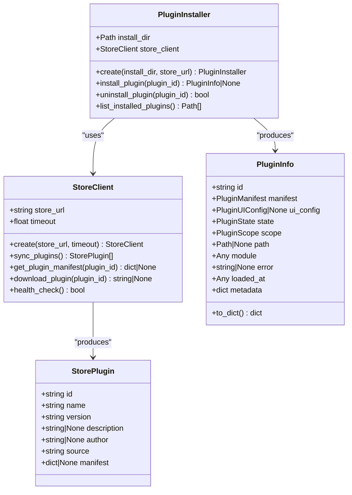
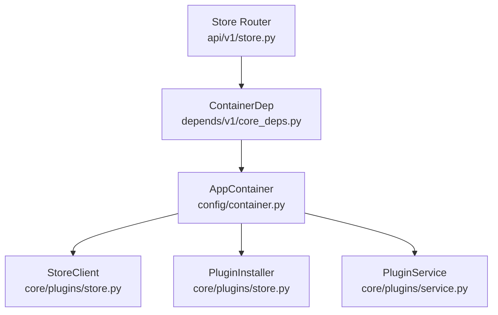

# Store API

<cite>
**Referenced Files in This Document**
- [store.py](file://api/v1/store.py)
- [__init__.py](file://api/v1/__init__.py)
- [app_factory.py](file://app_factory.py)
- [main.py](file://main.py)
- [store.py](file://core/plugins/store.py)
- [schemas.py](file://core/plugins/schemas.py)
- [service.py](file://core/plugins/service.py)
- [container.py](file://config/container.py)
- [settings.py](file://config/settings.py)
- [deps.py](file://core/security/deps.py)
</cite>

## Table of Contents
1. [Introduction](#introduction)
2. [Project Structure](#project-structure)
3. [Core Components](#core-components)
4. [Architecture Overview](#architecture-overview)
5. [Detailed Component Analysis](#detailed-component-analysis)
6. [Dependency Analysis](#dependency-analysis)
7. [Performance Considerations](#performance-considerations)
8. [Troubleshooting Guide](#troubleshooting-guide)
9. [Conclusion](#conclusion)

## Introduction
This document provides comprehensive API documentation for the Store API endpoints that power plugin marketplace access and local plugin installation within the backend. It covers all store-related endpoints, including retrieving store information, checking store health, fetching plugin manifests, installing plugins from the store, and uninstalling plugins locally. It also documents store client configuration, authentication requirements, error handling, rate limiting, API versioning, connectivity, and fallback mechanisms. Practical examples and client implementation guidelines are included to help developers integrate with the plugin marketplace effectively.

## Project Structure
The Store API is exposed under the `/api/v1` base path and registered via the v1 router. The store endpoints are implemented in a dedicated router and depend on a configured store client and installer initialized from application settings.

**Diagram sources**
- [app_factory.py:87-123](file://app_factory.py#L87-L123)
- [__init__.py:9-13](file://api/v1/__init__.py#L9-L13)
- [store.py:1-114](file://api/v1/store.py#L1-L114)
- [container.py:383-392](file://config/container.py#L383-L392)

**Section sources**
- [app_factory.py:87-123](file://app_factory.py#L87-L123)
- [__init__.py:9-13](file://api/v1/__init__.py#L9-L13)
- [main.py:17-21](file://main.py#L17-L21)

## Core Components
- Store Router: Exposes endpoints for store information retrieval, health checks, plugin manifest retrieval, installation, and uninstallation.
- Store Client: Synchronizes plugin listings, fetches plugin manifests, downloads plugin packages, and performs health checks against the remote store.
- Plugin Installer: Downloads plugin packages from the store and installs them into the local plugins directory, returning structured plugin information.
- App Container: Provides the store client and installer instances when the store URL is configured in settings.
- Plugin Service: Manages plugin lifecycle and routes; integrates with the store endpoints for installation and updates.

Key implementation references:
- Store endpoints: [store.py:11-114](file://api/v1/store.py#L11-L114)
- Store client and installer: [store.py:29-239](file://core/plugins/store.py#L29-L239)
- Plugin schemas: [schemas.py:25-122](file://core/plugins/schemas.py#L25-L122)
- Plugin service orchestration: [service.py:18-299](file://core/plugins/service.py#L18-L299)
- Container initialization: [container.py:383-392](file://config/container.py#L383-L392)
- Settings configuration: [settings.py:83-87](file://config/settings.py#L83-L87)

**Section sources**
- [store.py:11-114](file://api/v1/store.py#L11-L114)
- [store.py:29-239](file://core/plugins/store.py#L29-L239)
- [schemas.py:25-122](file://core/plugins/schemas.py#L25-L122)
- [service.py:18-299](file://core/plugins/service.py#L18-L299)
- [container.py:383-392](file://config/container.py#L383-L392)
- [settings.py:83-87](file://config/settings.py#L83-L87)

## Architecture Overview
The Store API is part of the `/api/v1` namespace and relies on dependency injection via a container. The store endpoints delegate to the store client and installer when available, otherwise return appropriate errors. The plugin service manages plugin lifecycle and integrates with the store for installation and updates.

**Diagram sources**
- [store.py:11-114](file://api/v1/store.py#L11-L114)
- [container.py:383-392](file://config/container.py#L383-L392)
- [store.py:29-239](file://core/plugins/store.py#L29-L239)

## Detailed Component Analysis

### Store Endpoints

#### GET /api/v1/store
- Purpose: Retrieve store availability, plugin list, and total count.
- Authentication: Not explicitly required by the endpoint.
- Request parameters: None.
- Response:
  - available: Boolean indicating store availability.
  - plugins: Array of plugin entries with keys: id, name, version, description, author, source, manifest.
  - total: Integer count of available plugins.
- Errors:
  - 503 Service Unavailable: If the plugin store client is not configured.
- Example request:
  - curl -sS http://localhost:8000/api/v1/store
- Example response:
  - {
      "available": true,
      "plugins": [
        {
          "id": "autodiscover",
          "name": "Autodiscover",
          "version": "1.0.0",
          "description": "Network discovery plugin",
          "author": "Oko Team",
          "source": "zip_upload",
          "manifest": { /* plugin manifest */ }
        }
      ],
      "total": 1
    }

**Section sources**
- [store.py:11-36](file://api/v1/store.py#L11-L36)

#### GET /api/v1/store/health
- Purpose: Check store availability.
- Authentication: Not explicitly required by the endpoint.
- Request parameters: None.
- Response:
  - available: Boolean indicating store availability.
  - status: String "healthy" or "unavailable".
- Errors:
  - 503 Service Unavailable: If the plugin store client is not configured.
- Example request:
  - curl -sS http://localhost:8000/api/v1/store/health
- Example response:
  - {
      "available": true,
      "status": "healthy"
    }

**Section sources**
- [store.py:39-49](file://api/v1/store.py#L39-L49)

#### GET /api/v1/store/{plugin_id}
- Purpose: Fetch a specific plugin manifest from the store.
- Authentication: Not explicitly required by the endpoint.
- Path parameters:
  - plugin_id: String identifier of the plugin.
- Response: Plugin manifest object returned by the store.
- Errors:
  - 503 Service Unavailable: If the plugin store client is not configured.
  - 404 Not Found: If the plugin is not found in the store.
- Example request:
  - curl -sS http://localhost:8000/api/v1/store/autodiscover
- Example response:
  - {
      "name": "Autodiscover",
      "version": "1.0.0",
      "description": "Network discovery plugin",
      "author": "Oko Team",
      "tags": ["network", "discovery"],
      "capabilities": ["dns", "trace"],
      "homepage": "https://example.com/plugins/autodiscover",
      "license": "MIT"
    }

**Section sources**
- [store.py:52-62](file://api/v1/store.py#L52-L62)

#### POST /api/v1/store/{plugin_id}/install
- Purpose: Install a plugin from the store to the local backend.
- Authentication: Not explicitly required by the endpoint.
- Path parameters:
  - plugin_id: String identifier of the plugin.
- Response:
  - status: String "installed".
  - plugin: Structured plugin information including id, name, version, description, author, homepage, license, tags, state, scope, path, error, ui_config, capabilities, metadata.
  - message: Human-readable success message.
- Errors:
  - 503 Service Unavailable: If the plugin store client or installer is not configured.
  - 500 Internal Server Error: If installation fails.
- Example request:
  - curl -sS -X POST http://localhost:8000/api/v1/store/autodiscover/install
- Example response:
  - {
      "status": "installed",
      "plugin": {
        "id": "autodiscover",
        "name": "Autodiscover",
        "version": "1.0.0",
        "description": "Network discovery plugin",
        "author": "Oko Team",
        "homepage": "https://example.com/plugins/autodiscover",
        "license": "MIT",
        "tags": ["network", "discovery"],
        "state": "discovered",
        "scope": "external",
        "path": "/base_dir/plugins/autodiscover",
        "error": null,
        "ui_config": {
          "has_page": false,
          "page_path": null,
          "page_title": null,
          "page_icon": null,
          "show_in_menu": true,
          "menu_group": null,
          "menu_order": 100,
          "provides_widgets": false,
          "api_prefix": null
        },
        "capabilities": ["dns", "trace"],
        "metadata": {}
      },
      "message": "Plugin Autodiscover installed successfully"
    }

**Section sources**
- [store.py:65-88](file://api/v1/store.py#L65-L88)

#### POST /api/v1/store/{plugin_id}/uninstall
- Purpose: Uninstall a plugin from the local backend.
- Authentication: Not explicitly required by the endpoint.
- Path parameters:
  - plugin_id: String identifier of the plugin.
- Response:
  - status: String "uninstalled".
  - plugin_id: String identifier of the removed plugin.
  - message: Human-readable success message.
- Errors:
  - 503 Service Unavailable: If the plugin installer is not configured.
  - 404 Not Found: If the plugin is not found locally.
- Example request:
  - curl -sS -X POST http://localhost:8000/api/v1/store/autodiscover/uninstall
- Example response:
  - {
      "status": "uninstalled",
      "plugin_id": "autodiscover",
      "message": "Plugin autodiscover uninstalled successfully"
    }

**Section sources**
- [store.py:91-110](file://api/v1/store.py#L91-L110)

### Store Client and Installer
- StoreClient:
  - sync_plugins(): Retrieves plugin list from the store.
  - get_plugin_manifest(plugin_id): Fetches plugin manifest.
  - download_plugin(plugin_id): Downloads plugin package and returns path.
  - health_check(): Checks store availability.
- PluginInstaller:
  - install_plugin(plugin_id): Installs plugin to local directory and returns PluginInfo.
  - uninstall_plugin(plugin_id): Removes plugin from local directory.
  - list_installed_plugins(): Lists installed plugin directories.

**Diagram sources**
- [store.py:29-239](file://core/plugins/store.py#L29-L239)
- [schemas.py:25-122](file://core/plugins/schemas.py#L25-L122)

**Section sources**
- [store.py:29-239](file://core/plugins/store.py#L29-L239)
- [schemas.py:25-122](file://core/plugins/schemas.py#L25-L122)

### Authentication and Authorization
- Endpoint-level authentication: Not enforced by the store endpoints themselves.
- Actor header requirement: Some core endpoints require an actor header; however, store endpoints do not enforce this by default.
- Capability-based access: Not enforced by store endpoints.
- Recommendation: For production environments, apply middleware or per-endpoint guards to require actor headers and capabilities as needed.

**Section sources**
- [deps.py:16-38](file://core/security/deps.py#L16-L38)
- [store.py:11-114](file://api/v1/store.py#L11-L114)

### Rate Limiting and API Versioning
- Rate limiting: Implemented in the storage subsystem for RPC operations; not directly applied to store endpoints.
- API versioning: Store endpoints are served under /api/v1. The application sets the API version to 1.0.0.

**Section sources**
- [app_factory.py:93-104](file://app_factory.py#L93-L104)

### Store Connectivity and Fallback Mechanisms
- Connectivity: Store endpoints rely on the configured store URL. If not configured, endpoints return 503.
- Health checks: The store client performs health checks against the store’s health endpoint.
- Fallbacks: On HTTP errors or unexpected exceptions during sync or manifest retrieval, the store client logs errors and returns empty or None results.

**Section sources**
- [container.py:383-392](file://config/container.py#L383-L392)
- [store.py:44-107](file://core/plugins/store.py#L44-L107)

### Client Implementation Guidelines
- Configure store URL:
  - Set the store URL in application settings so the container initializes the store client and installer.
- Use the store endpoints:
  - GET /api/v1/store to discover plugins and check availability.
  - GET /api/v1/store/health to verify connectivity.
  - GET /api/v1/store/{plugin_id} to retrieve manifests.
  - POST /api/v1/store/{plugin_id}/install to install plugins.
  - POST /api/v1/store/{plugin_id}/uninstall to remove plugins.
- Handle errors gracefully:
  - 503 when store is not configured.
  - 404 when plugin is missing.
  - 500 for installation failures.
- Security:
  - Apply actor and capability headers where required by your deployment policies.
- Reliability:
  - Retry transient failures and implement exponential backoff.
  - Monitor store health and degrade gracefully when unavailable.

**Section sources**
- [settings.py:83-87](file://config/settings.py#L83-L87)
- [store.py:11-114](file://api/v1/store.py#L11-L114)

## Dependency Analysis
The store endpoints depend on the container for the store client and installer. The container conditionally creates these components when the store URL is provided in settings.

**Diagram sources**
- [store.py:5-6](file://api/v1/store.py#L5-L6)
- [container.py:383-392](file://config/container.py#L383-L392)

**Section sources**
- [store.py:5-6](file://api/v1/store.py#L5-L6)
- [container.py:383-392](file://config/container.py#L383-L392)

## Performance Considerations
- Network timeouts: The store client uses an asynchronous HTTP client with a configurable timeout. Tune timeouts according to network conditions.
- Bulk operations: Use GET /api/v1/store to batch fetch plugin metadata and avoid repeated individual requests.
- Local caching: Cache plugin manifests locally after successful retrieval to reduce repeated network calls.
- Concurrency: Avoid concurrent installations; serialize install/uninstall operations to prevent filesystem conflicts.

## Troubleshooting Guide
Common issues and resolutions:
- Store not configured:
  - Symptom: 503 responses from store endpoints.
  - Resolution: Set the store URL in settings so the container initializes the store client and installer.
- Plugin not found:
  - Symptom: 404 responses when fetching manifests or installing.
  - Resolution: Verify the plugin ID exists in the store and retry.
- Installation failure:
  - Symptom: 500 responses during install.
  - Resolution: Check server logs for errors during download or extraction; ensure sufficient disk space and permissions.
- Uninstall failure:
  - Symptom: 404 responses during uninstall.
  - Resolution: Confirm the plugin directory exists locally; ensure the plugin is unloaded before uninstalling.

Operational references:
- Container initialization and store client creation: [container.py:383-392](file://config/container.py#L383-L392)
- Store endpoint error handling: [store.py:14-15](file://api/v1/store.py#L14-L15), [store.py:55-56](file://api/v1/store.py#L55-L56), [store.py:73-77](file://api/v1/store.py#L73-L77), [store.py:99-100](file://api/v1/store.py#L99-L100), [store.py:81-82](file://api/v1/store.py#L81-L82)

**Section sources**
- [container.py:383-392](file://config/container.py#L383-L392)
- [store.py:14-15](file://api/v1/store.py#L14-L15)
- [store.py:55-56](file://api/v1/store.py#L55-L56)
- [store.py:73-77](file://api/v1/store.py#L73-L77)
- [store.py:99-100](file://api/v1/store.py#L99-L100)
- [store.py:81-82](file://api/v1/store.py#L81-L82)

## Conclusion
The Store API provides a straightforward interface for discovering plugins, checking store health, retrieving manifests, and managing plugin installation and removal. By configuring the store URL, clients can integrate seamlessly with the plugin marketplace. Proper error handling, security headers, and operational monitoring ensure reliable integration. For production deployments, apply capability and actor headers where appropriate and consider implementing retries and caching strategies to improve resilience and performance.