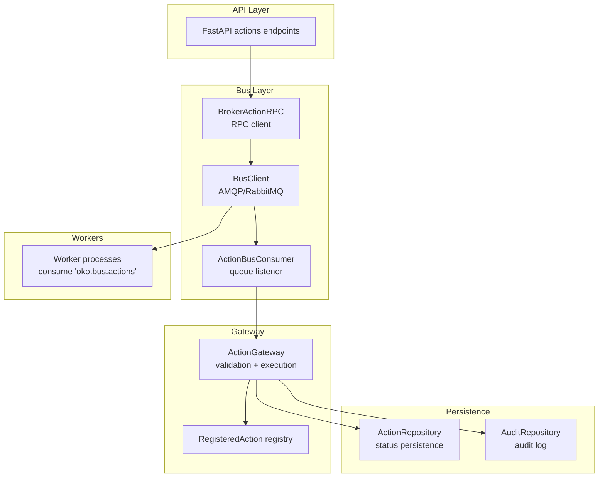
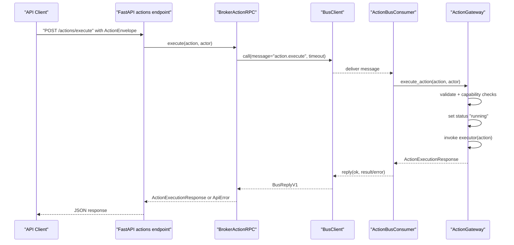
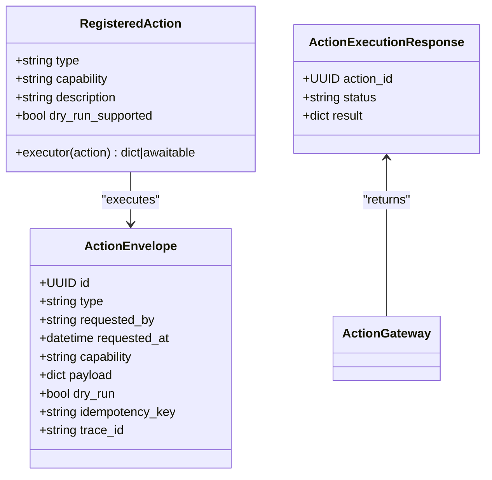
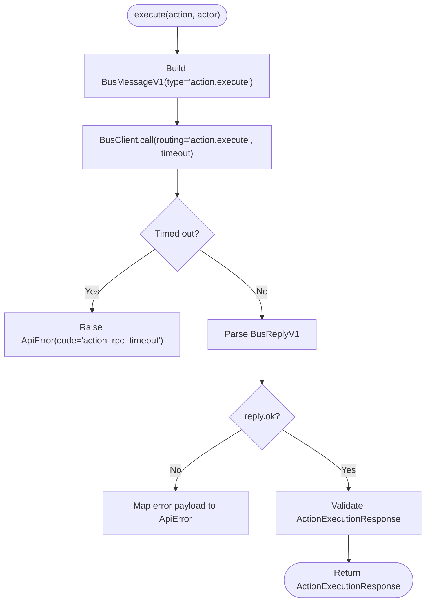
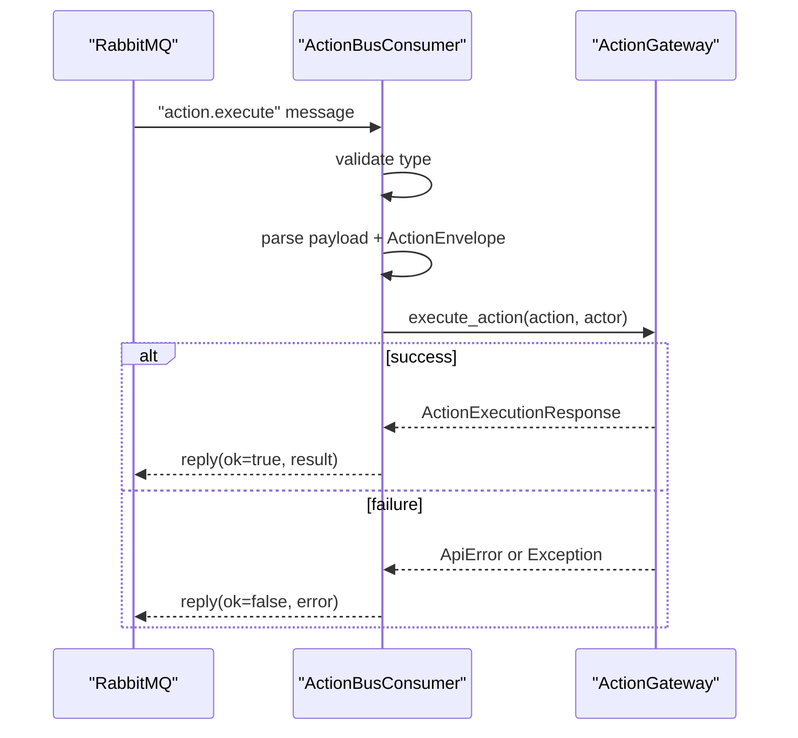
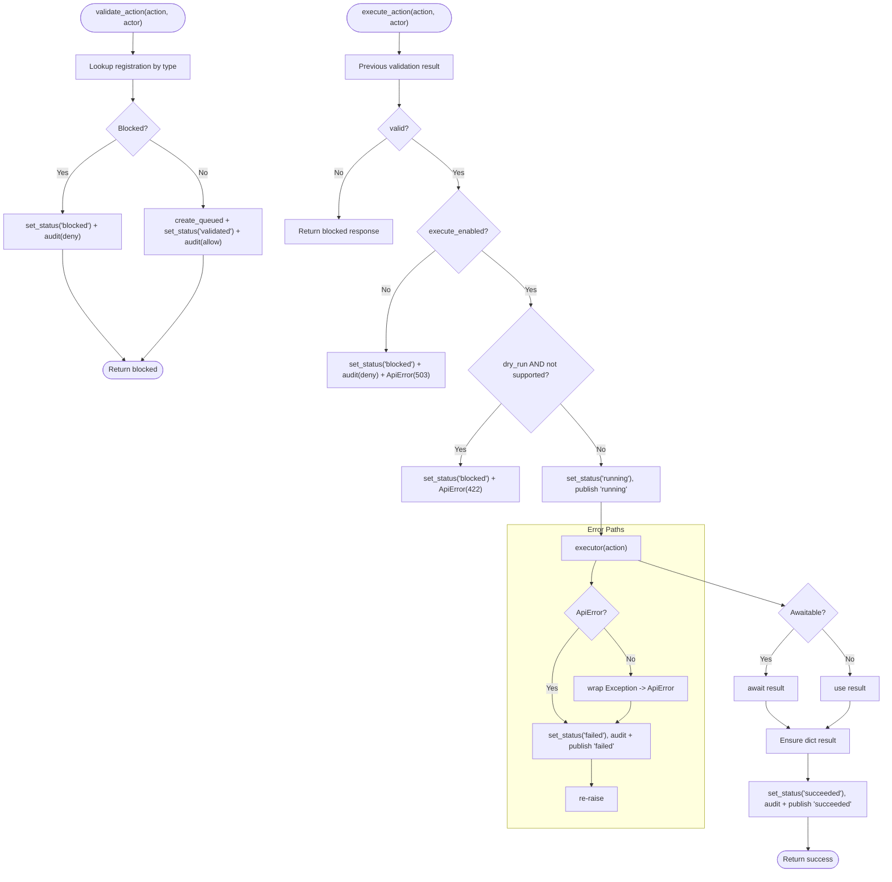
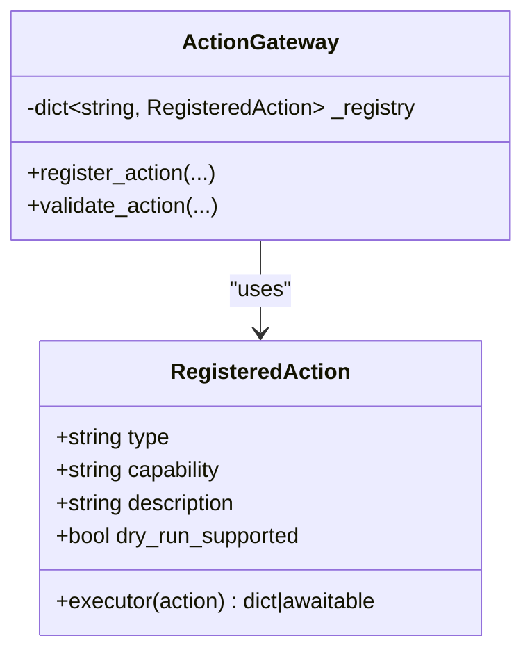
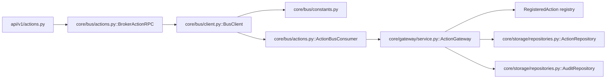

# Action Execution

<cite>
**Referenced Files in This Document**
- [actions.py](file://core/bus/actions.py)
- [client.py](file://core/bus/client.py)
- [constants.py](file://core/bus/constants.py)
- [models.py](file://core/contracts/models.py)
- [bus.py](file://core/contracts/bus.py)
- [service.py](file://core/gateway/service.py)
- [actions.py](file://api/v1/actions.py)
- [repositories.py](file://core/storage/repositories.py)
- [registry.py](file://features/system/registry.py)
</cite>

## Table of Contents
1. [Introduction](#introduction)
2. [Project Structure](#project-structure)
3. [Core Components](#core-components)
4. [Architecture Overview](#architecture-overview)
5. [Detailed Component Analysis](#detailed-component-analysis)
6. [Dependency Analysis](#dependency-analysis)
7. [Performance Considerations](#performance-considerations)
8. [Troubleshooting Guide](#troubleshooting-guide)
9. [Conclusion](#conclusion)
10. [Appendices](#appendices)

## Introduction
This document explains the action execution subsystem end-to-end. It covers the ActionEnvelope lifecycle from validation through completion, including the BrokerActionRPC client, ActionBusConsumer worker, and ActionGateway orchestrator. It documents the RegisteredAction pattern, action type registration, capability-based authorization, dry-run execution support, execution context handling, error propagation, timeouts, and resource management. Practical examples show how to register custom actions and implement both synchronous and asynchronous executors.

## Project Structure
The action execution pipeline spans several modules:
- Contracts define the ActionEnvelope, ActionExecutionResponse, and bus message types.
- The gateway validates and executes actions, manages audit and events, and maintains the action registry.
- The bus client provides RPC semantics over AMQP/RabbitMQ with memory-mode support.
- The bus consumer listens on the actions queue and delegates to the gateway.
- API endpoints expose validation, execution, registry listing, and history retrieval.
- Repositories persist action status and audit logs.
- Example actions are registered by the system feature module.

**Diagram sources**
- [actions.py:1-61](file://api/v1/actions.py#L1-61)
- [actions.py:21-116](file://core/bus/actions.py#L21-116)
- [client.py:34-290](file://core/bus/client.py#L34-290)
- [service.py:31-239](file://core/gateway/service.py#L31-239)
- [repositories.py:195-304](file://core/storage/repositories.py#L195-304)

**Section sources**
- [actions.py:1-61](file://api/v1/actions.py#L1-61)
- [actions.py:1-116](file://core/bus/actions.py#L1-116)
- [client.py:1-290](file://core/bus/client.py#L1-290)
- [service.py:1-239](file://core/gateway/service.py#L1-239)
- [repositories.py:1-304](file://core/storage/repositories.py#L1-304)

## Core Components
- ActionEnvelope: The action request DTO containing type, capability, payload, actor context, dry-run flag, idempotency, and tracing.
- ActionExecutionResponse: The response returned after execution completes.
- BrokerActionRPC: An RPC client that sends action.execute messages and awaits replies with timeouts.
- ActionBusConsumer: A durable queue consumer that validates incoming messages and invokes the gateway.
- ActionGateway: Central orchestrator that validates, authorizes, enforces dry-run policy, executes, updates status, emits events, and audits outcomes.
- RegisteredAction: The typed registration record holding executor and capability metadata.
- BusClient: Generic AMQP/RabbitMQ client with RPC call semantics, reply queues, and memory-mode mocking.
- ActionRepository and AuditRepository: Persistence for action status and audit events.

**Section sources**
- [models.py:60-94](file://core/contracts/models.py#L60-94)
- [bus.py:84-87](file://core/contracts/bus.py#L84-87)
- [actions.py:21-116](file://core/bus/actions.py#L21-116)
- [service.py:22-61](file://core/gateway/service.py#L22-61)
- [service.py:122-233](file://core/gateway/service.py#L122-233)
- [client.py:34-290](file://core/bus/client.py#L34-290)
- [repositories.py:195-304](file://core/storage/repositories.py#L195-304)

## Architecture Overview
The action execution flow is a request-response RPC over a message bus:
1. API receives an ActionEnvelope and calls BrokerActionRPC.execute.
2. BrokerActionRPC constructs a BusMessageV1 with type "action.execute" and calls BusClient.call with a timeout.
3. ActionBusConsumer receives the message, validates type and payload, and calls ActionGateway.execute_action.
4. ActionGateway performs capability checks, optional dry-run enforcement, transitions status to running, invokes the executor, and publishes success/failure events.
5. Results are returned via BusReplyV1 to BrokerActionRPC, which raises structured ApiError on failures.

**Diagram sources**
- [actions.py:41-48](file://api/v1/actions.py#L41-48)
- [actions.py:26-62](file://core/bus/actions.py#L26-62)
- [client.py:101-166](file://core/bus/client.py#L101-166)
- [actions.py:81-112](file://core/bus/actions.py#L81-112)
- [service.py:122-233](file://core/gateway/service.py#L122-233)

## Detailed Component Analysis

### ActionEnvelope and Execution Model
- ActionEnvelope fields include id, type, requested_by, requested_at, capability, payload, dry_run, idempotency_key, trace_id.
- ActionExecutionResponse carries action_id, status, and optional result.
- The RegisteredAction record binds action type to a capability and executor, plus dry-run support flag.

**Diagram sources**
- [models.py:60-94](file://core/contracts/models.py#L60-94)
- [service.py:22-29](file://core/gateway/service.py#L22-29)
- [service.py:122-189](file://core/gateway/service.py#L122-189)

**Section sources**
- [models.py:60-94](file://core/contracts/models.py#L60-94)
- [service.py:22-29](file://core/gateway/service.py#L22-29)

### BrokerActionRPC: RPC Client and Timeouts
- Constructs BusMessageV1 with type "action.execute".
- Calls BusClient.call with a timeout and converts BusRpcTimeoutError into ApiError with code "action_rpc_timeout".
- Parses BusReplyV1 into ActionExecutionResponse; maps error payloads into ApiError with status_code, code, message, and details.

**Diagram sources**
- [actions.py:26-62](file://core/bus/actions.py#L26-62)
- [client.py:101-166](file://core/bus/client.py#L101-166)
- [bus.py:84-87](file://core/contracts/bus.py#L84-87)

**Section sources**
- [actions.py:21-62](file://core/bus/actions.py#L21-62)
- [client.py:101-166](file://core/bus/client.py#L101-166)
- [bus.py:84-87](file://core/contracts/bus.py#L84-87)

### ActionBusConsumer: Message Validation and Dispatch
- Consumes from QUEUE_ACTIONS bound to ROUTING_ACTION_EXECUTE.
- Validates message type equals "action.execute"; replies with error otherwise.
- Deserializes ActionExecutePayload and ActionEnvelope, then calls ActionGateway.execute_action.
- Wraps exceptions into BusReplyV1 with error payloads and replies to the caller.

**Diagram sources**
- [actions.py:65-112](file://core/bus/actions.py#L65-112)
- [constants.py:7-18](file://core/bus/constants.py#L7-18)
- [bus.py:84-87](file://core/contracts/bus.py#L84-87)

**Section sources**
- [actions.py:65-112](file://core/bus/actions.py#L65-112)
- [constants.py:13-18](file://core/bus/constants.py#L13-18)

### ActionGateway: Validation, Authorization, Dry-Run, Execution, Events, Auditing
- Registration: register_action binds action_type to capability and executor; list_registry exposes metadata.
- Validation: validate_action checks unknown type, capability mismatch, and actor mismatch; persists queued and validated statuses; audits outcomes.
- Execution: execute_action enforces kill switch, dry-run support, sets running, publishes "core.action.running", invokes executor (sync or async), normalizes result to dict, sets succeeded, audits, and publishes "core.action.succeeded".
- Error propagation: catches ApiError, persists failed status, audits, publishes "core.action.failed", re-raises; catches generic Exception, converts to ApiError, persists, audits, and re-raises.

**Diagram sources**
- [service.py:74-121](file://core/gateway/service.py#L74-121)
- [service.py:122-233](file://core/gateway/service.py#L122-233)

**Section sources**
- [service.py:46-72](file://core/gateway/service.py#L46-72)
- [service.py:74-121](file://core/gateway/service.py#L74-121)
- [service.py:122-233](file://core/gateway/service.py#L122-233)

### RegisteredAction Pattern and Capability-Based Authorization
- RegisteredAction stores type, capability, description, dry_run_supported, and executor.
- Capability check compares envelope.capability against registration.capability during validation.
- API endpoints require capability scopes via security dependencies for validate, execute, registry, and history.

**Diagram sources**
- [service.py:22-61](file://core/gateway/service.py#L22-61)
- [service.py:74-121](file://core/gateway/service.py#L74-121)
- [actions.py:10-16](file://api/v1/actions.py#L10-16)

**Section sources**
- [service.py:22-61](file://core/gateway/service.py#L22-61)
- [service.py:74-121](file://core/gateway/service.py#L74-121)
- [actions.py:10-16](file://api/v1/actions.py#L10-16)

### Dry-Run Execution Support
- ActionEnvelope includes dry_run flag.
- ActionGateway enforces dry-run support per RegisteredAction; blocks execution if dry_run is true but executor does not support it.
- Audit metadata records whether the execution was dry-run.

**Section sources**
- [models.py:60-70](file://core/contracts/models.py#L60-70)
- [service.py:150-156](file://core/gateway/service.py#L150-156)
- [service.py:181-182](file://core/gateway/service.py#L181-182)

### Execution Context Handling and Idempotency
- ActionEnvelope supports idempotency_key and trace_id for correlating requests and tracing execution.
- ActionRepository persists these fields alongside action status.

**Section sources**
- [models.py:60-70](file://core/contracts/models.py#L60-70)
- [repositories.py:199-222](file://core/storage/repositories.py#L199-222)

### Error Propagation Mechanisms
- BrokerActionRPC maps RPC timeouts to ApiError with code "action_rpc_timeout".
- ActionBusConsumer wraps ApiError and generic Exceptions into BusReplyV1 error payloads.
- ActionGateway converts ApiError to persisted failed status and audit entries; re-raises to upstream; generic exceptions are converted to ApiError.

**Section sources**
- [actions.py:38-62](file://core/bus/actions.py#L38-62)
- [actions.py:106-112](file://core/bus/actions.py#L106-112)
- [service.py:190-233](file://core/gateway/service.py#L190-233)

### Asynchronous Execution Patterns
- Executors can be sync or async. ActionGateway detects awaitable results and awaits them.
- Executors should return a dict; if absent, a default {"ok": True} is used.

**Section sources**
- [service.py:165-170](file://core/gateway/service.py#L165-170)

### Practical Examples

#### Registering Custom Actions
- Define an executor function that accepts ActionEnvelope and returns a dict (or awaitable dict).
- Register the action via ActionGateway.register_action with:
  - action_type: unique string identifier
  - capability: capability string enforced during validation
  - description: human-readable description
  - executor: callable
  - dry_run_supported: enable/disable dry-run support

Example registration pattern is demonstrated in the system feature module.

**Section sources**
- [service.py:46-61](file://core/gateway/service.py#L46-61)
- [registry.py:25-40](file://features/system/registry.py#L25-40)

#### Implementing Synchronous and Asynchronous Executors
- Synchronous executor: return a dict.
- Asynchronous executor: return an awaitable resolving to a dict.
- ActionGateway handles both transparently.

**Section sources**
- [service.py:165-170](file://core/gateway/service.py#L165-170)
- [registry.py:10-22](file://features/system/registry.py#L10-22)

#### Using the API Endpoints
- GET /actions/registry lists registered actions.
- POST /actions/validate validates an ActionEnvelope against the registry and capability.
- POST /actions/execute submits an ActionEnvelope for execution via RPC.
- GET /actions/history retrieves recent action statuses.

**Section sources**
- [actions.py:23-28](file://api/v1/actions.py#L23-28)
- [actions.py:31-38](file://api/v1/actions.py#L31-38)
- [actions.py:41-48](file://api/v1/actions.py#L41-48)
- [actions.py:51-57](file://api/v1/actions.py#L51-57)

## Dependency Analysis
- API depends on BrokerActionRPC and ActionGateway.
- BrokerActionRPC depends on BusClient and constants for routing keys.
- ActionBusConsumer depends on BusClient and ActionGateway.
- ActionGateway depends on ActionRepository, AuditRepository, EventPublisher, and the registry of RegisteredAction.
- ActionRepository persists ActionStatus and ActionEnvelope fields.
- BusClient declares queues and bindings for actions and other buses.

**Diagram sources**
- [actions.py:1-61](file://api/v1/actions.py#L1-61)
- [actions.py:21-116](file://core/bus/actions.py#L21-116)
- [client.py:224-241](file://core/bus/client.py#L224-241)
- [constants.py:3-18](file://core/bus/constants.py#L3-18)
- [service.py:31-239](file://core/gateway/service.py#L31-239)
- [repositories.py:195-304](file://core/storage/repositories.py#L195-304)

**Section sources**
- [actions.py:1-61](file://api/v1/actions.py#L1-61)
- [actions.py:21-116](file://core/bus/actions.py#L21-116)
- [client.py:224-241](file://core/bus/client.py#L224-241)
- [constants.py:3-18](file://core/bus/constants.py#L3-18)
- [service.py:31-239](file://core/gateway/service.py#L31-239)
- [repositories.py:195-304](file://core/storage/repositories.py#L195-304)

## Performance Considerations
- RPC timeouts: BrokerActionRPC uses a default timeout; adjust according to expected executor duration. Timeouts raise ApiError with code "action_rpc_timeout".
- QoS and concurrency: BusClient sets prefetch_count; tune for throughput vs. fairness.
- Memory mode: BusClient supports memory:// mode for testing; replies are queued in-memory.
- Event volume: Publishing "core.action.running/succeeded/failed" events adds overhead; monitor event bus load.
- Storage writes: Status updates and audit entries are persisted; ensure database performance aligns with expected action rates.

[No sources needed since this section provides general guidance]

## Troubleshooting Guide
Common issues and resolutions:
- Action execution timeout: Verify BrokerActionRPC timeout and executor runtime; check worker availability on QUEUE_ACTIONS.
- Unknown action type: Ensure the action_type is registered via register_action.
- Capability mismatch: Envelope capability must match registration capability.
- Dry-run not supported: Set dry_run=False or mark dry_run_supported=True when registering.
- Execute disabled: The kill switch prevents execution; re-enable or remove the restriction.
- RPC reply not received: Confirm reply_to routing and that ActionBusConsumer replies with ok/error.

**Section sources**
- [actions.py:38-62](file://core/bus/actions.py#L38-62)
- [service.py:78-83](file://core/gateway/service.py#L78-83)
- [service.py:150-156](file://core/gateway/service.py#L150-156)
- [service.py:131-148](file://core/gateway/service.py#L131-148)

## Conclusion
The action execution subsystem provides a robust, capability-gated, and observable pipeline for asynchronous action processing. It supports both synchronous and asynchronous executors, dry-run execution, strict validation, and comprehensive auditing. The design leverages a message bus for decoupling, with clear separation between API, RPC client, worker consumer, and gateway orchestration.

## Appendices

### Execution Lifecycle Summary
- API receives ActionEnvelope.
- BrokerActionRPC sends "action.execute" RPC with timeout.
- ActionBusConsumer validates and forwards to ActionGateway.
- ActionGateway validates capability and actor, enforces dry-run, transitions status, invokes executor, and emits events.
- Results returned to API as ActionExecutionResponse or structured ApiError.

**Section sources**
- [actions.py:41-48](file://api/v1/actions.py#L41-48)
- [actions.py:26-62](file://core/bus/actions.py#L26-62)
- [service.py:122-233](file://core/gateway/service.py#L122-233)