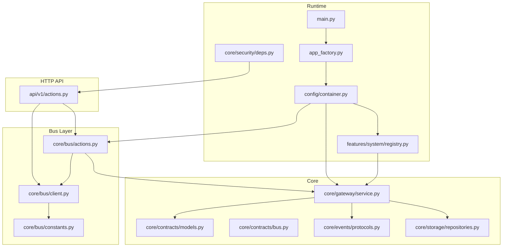
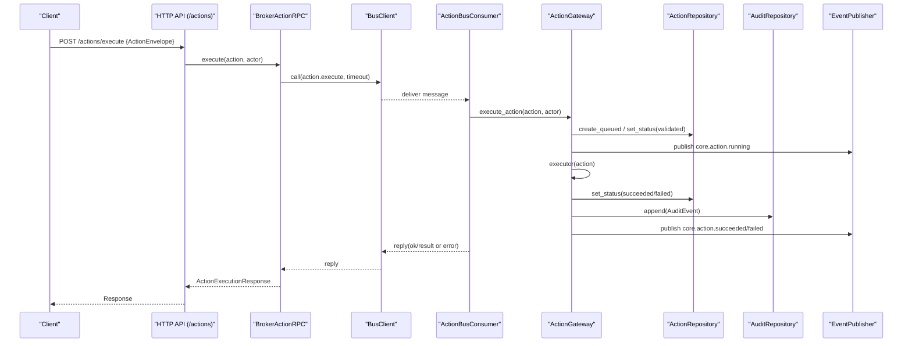
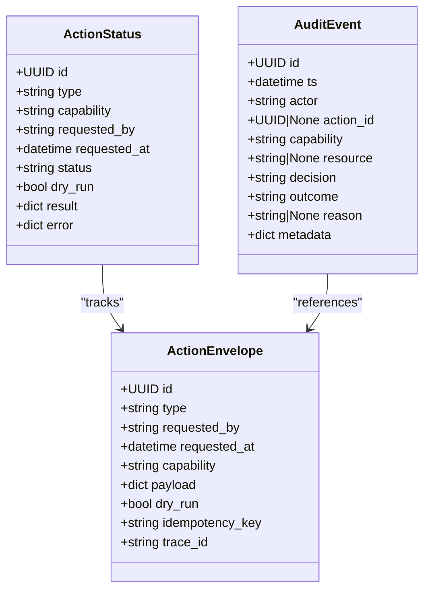
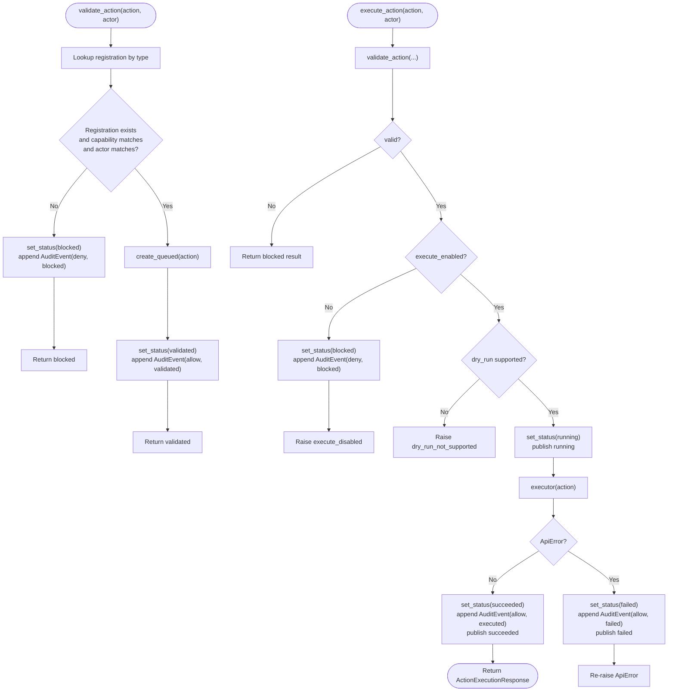
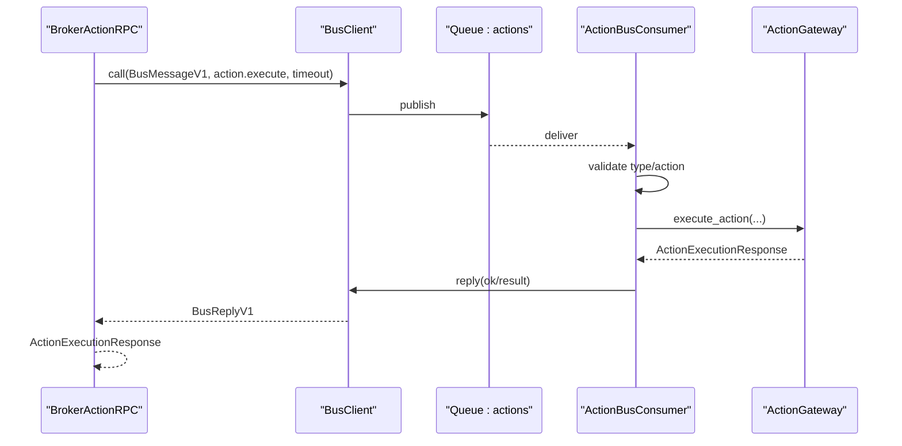
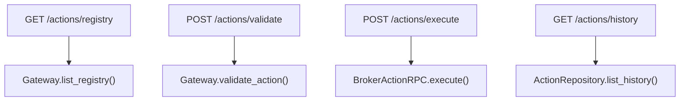
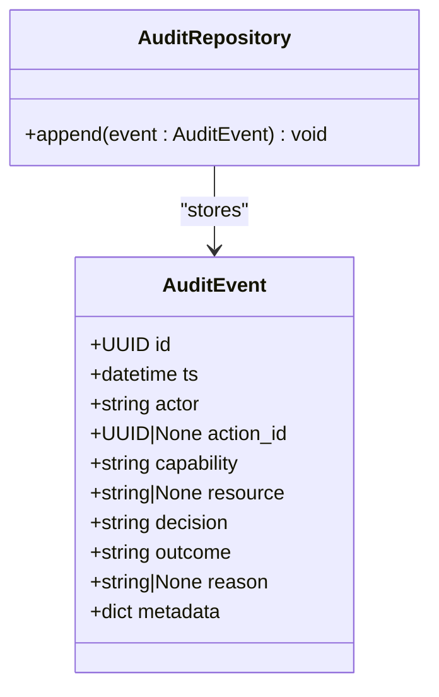
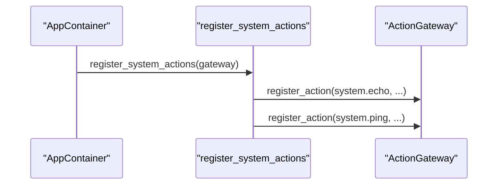
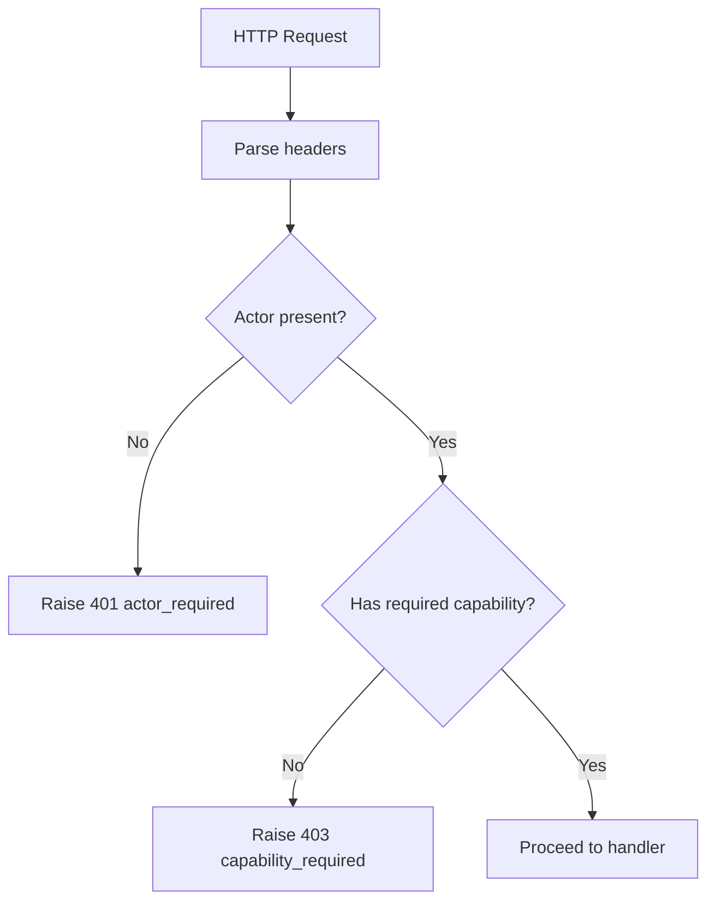
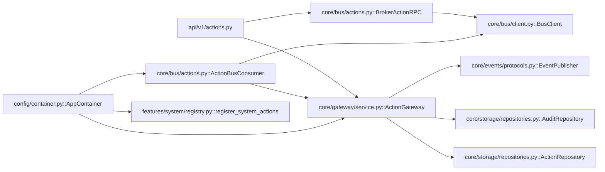

# Action Gateway

<cite>
**Referenced Files in This Document**
- [actions.py](file://core/bus/actions.py)
- [client.py](file://core/bus/client.py)
- [constants.py](file://core/bus/constants.py)
- [actions.py](file://api/v1/actions.py)
- [service.py](file://core/gateway/service.py)
- [models.py](file://core/contracts/models.py)
- [bus.py](file://core/contracts/bus.py)
- [repositories.py](file://core/storage/repositories.py)
- [protocols.py](file://core/events/protocols.py)
- [core_deps.py](file://depends/v1/core_deps.py)
- [container.py](file://config/container.py)
- [registry.py](file://features/system/registry.py)
- [deps.py](file://core/security/deps.py)
- [app_factory.py](file://app_factory.py)
- [main.py](file://main.py)
</cite>

## Table of Contents
1. [Introduction](#introduction)
2. [Project Structure](#project-structure)
3. [Core Components](#core-components)
4. [Architecture Overview](#architecture-overview)
5. [Detailed Component Analysis](#detailed-component-analysis)
6. [Dependency Analysis](#dependency-analysis)
7. [Performance Considerations](#performance-considerations)
8. [Troubleshooting Guide](#troubleshooting-guide)
9. [Conclusion](#conclusion)
10. [Appendices](#appendices)

## Introduction
This document explains the Action Gateway system: how actions are defined, validated, executed, audited, and tracked through the bus and event subsystems. It covers the action repository, audit trail implementation, and the bus integration that enables reliable, event-driven workflows. Practical examples show how to define custom actions, execute system operations, and maintain compliance via audit logs.

## Project Structure
The Action Gateway spans several layers:
- HTTP API surface for action registry, validation, execution, and history
- Bus client and RPC for inter-process communication
- Action gateway orchestrating validation, execution, auditing, and events
- Repositories for persistence of action status and audit logs
- Contracts defining envelopes, messages, and models
- Container wiring and lifecycle management
- Security dependencies enforcing capability-based access

**Diagram sources**
- [actions.py:1-61](file://api/v1/actions.py#L1-L61)
- [client.py:34-290](file://core/bus/client.py#L34-L290)
- [actions.py:21-116](file://core/bus/actions.py#L21-L116)
- [constants.py:1-47](file://core/bus/constants.py#L1-L47)
- [service.py:31-239](file://core/gateway/service.py#L31-L239)
- [models.py:60-134](file://core/contracts/models.py#L60-L134)
- [bus.py:30-95](file://core/contracts/bus.py#L30-L95)
- [repositories.py:195-304](file://core/storage/repositories.py#L195-L304)
- [protocols.py:8-21](file://core/events/protocols.py#L8-L21)
- [container.py:50-174](file://config/container.py#L50-L174)
- [deps.py:16-75](file://core/security/deps.py#L16-L75)
- [app_factory.py:30-133](file://app_factory.py#L30-L133)
- [main.py:11-24](file://main.py#L11-L24)
- [registry.py:25-43](file://features/system/registry.py#L25-L43)

**Section sources**
- [actions.py:1-61](file://api/v1/actions.py#L1-L61)
- [client.py:34-290](file://core/bus/client.py#L34-L290)
- [actions.py:21-116](file://core/bus/actions.py#L21-L116)
- [constants.py:1-47](file://core/bus/constants.py#L1-L47)
- [service.py:31-239](file://core/gateway/service.py#L31-L239)
- [models.py:60-134](file://core/contracts/models.py#L60-L134)
- [bus.py:30-95](file://core/contracts/bus.py#L30-L95)
- [repositories.py:195-304](file://core/storage/repositories.py#L195-L304)
- [protocols.py:8-21](file://core/events/protocols.py#L8-L21)
- [container.py:50-174](file://config/container.py#L50-L174)
- [deps.py:16-75](file://core/security/deps.py#L16-L75)
- [app_factory.py:30-133](file://app_factory.py#L30-L133)
- [main.py:11-24](file://main.py#L11-L24)
- [registry.py:25-43](file://features/system/registry.py#L25-L43)

## Core Components
- ActionEnvelope: Defines an action’s identity, capability, payload, and execution flags.
- ActionRegistryEntry: Public registry entry for action discovery.
- ActionValidationResponse and ActionExecutionResponse: Responses for validation and execution outcomes.
- AuditEvent: Captures decisions, outcomes, reasons, and metadata for compliance.
- ActionRepository: Persists action lifecycle and results.
- AuditRepository: Stores audit events for compliance and tracing.
- EventPublisher protocol: Enables publishing domain events during action lifecycle.
- ActionGateway: Orchestrates validation, execution, status updates, audit logging, and event publishing.
- BrokerActionRPC: RPC client to send action.execute messages to workers.
- ActionBusConsumer: Worker-side consumer that executes actions and replies.
- BusClient: Generic AMQP/RabbitMQ client with RPC and memory-mode support.
- Constants: Routing keys and queue names for the bus topology.

**Section sources**
- [models.py:60-134](file://core/contracts/models.py#L60-L134)
- [repositories.py:195-304](file://core/storage/repositories.py#L195-L304)
- [protocols.py:8-21](file://core/events/protocols.py#L8-L21)
- [service.py:31-239](file://core/gateway/service.py#L31-L239)
- [actions.py:21-116](file://core/bus/actions.py#L21-L116)
- [client.py:34-290](file://core/bus/client.py#L34-L290)
- [constants.py:1-47](file://core/bus/constants.py#L1-L47)

## Architecture Overview
The Action Gateway integrates HTTP APIs, a message bus, and persistent stores to provide a robust, auditable, and event-driven action execution pipeline.

**Diagram sources**
- [actions.py:41-48](file://api/v1/actions.py#L41-L48)
- [actions.py:26-62](file://core/bus/actions.py#L26-L62)
- [client.py:101-167](file://core/bus/client.py#L101-L167)
- [actions.py:81-112](file://core/bus/actions.py#L81-L112)
- [service.py:122-233](file://core/gateway/service.py#L122-L233)
- [repositories.py:199-250](file://core/storage/repositories.py#L199-L250)
- [models.py:123-134](file://core/contracts/models.py#L123-L134)
- [protocols.py:8-21](file://core/events/protocols.py#L8-L21)

## Detailed Component Analysis

### Action Envelope and Execution Models
- ActionEnvelope carries identity, capability, payload, and flags (dry-run, idempotency).
- ActionStatus persists lifecycle and results.
- AuditEvent captures decision, outcome, and metadata for compliance.

**Diagram sources**
- [models.py:60-82](file://core/contracts/models.py#L60-L82)
- [models.py:123-134](file://core/contracts/models.py#L123-L134)

**Section sources**
- [models.py:60-134](file://core/contracts/models.py#L60-L134)
- [repositories.py:199-250](file://core/storage/repositories.py#L199-L250)

### Action Gateway Orchestration
- Validation checks registry presence, capability match, and actor alignment; records queued and validated statuses and audits deny/blocked scenarios.
- Execution enforces kill switches, dry-run support, and invokes executors; normalizes results to dicts; publishes running/succeeded/failed events; audits outcomes.
- Error handling converts exceptions to structured ApiError and records failures.

**Diagram sources**
- [service.py:74-121](file://core/gateway/service.py#L74-L121)
- [service.py:122-233](file://core/gateway/service.py#L122-L233)

**Section sources**
- [service.py:74-233](file://core/gateway/service.py#L74-L233)

### Bus Integration and RPC
- BrokerActionRPC builds action.execute messages and performs RPC calls with timeouts; translates broker errors to ApiError.
- ActionBusConsumer binds to the actions queue, validates message types, delegates to ActionGateway, and replies with structured results or errors.
- BusClient manages AMQP connections, declares queues/routing, and supports memory-mode for testing.

**Diagram sources**
- [actions.py:26-62](file://core/bus/actions.py#L26-L62)
- [client.py:101-167](file://core/bus/client.py#L101-L167)
- [actions.py:81-112](file://core/bus/actions.py#L81-L112)
- [constants.py:13-18](file://core/bus/constants.py#L13-L18)

**Section sources**
- [actions.py:21-116](file://core/bus/actions.py#L21-L116)
- [client.py:34-290](file://core/bus/client.py#L34-L290)
- [constants.py:1-47](file://core/bus/constants.py#L1-L47)

### HTTP API Surface
- GET /actions/registry lists registered actions.
- POST /actions/validate validates an action envelope against the registry and actor.
- POST /actions/execute triggers RPC to workers and returns execution results.
- GET /actions/history retrieves recent action statuses.

**Diagram sources**
- [actions.py:23-57](file://api/v1/actions.py#L23-L57)
- [core_deps.py:24-39](file://depends/v1/core_deps.py#L24-L39)
- [service.py:63-72](file://core/gateway/service.py#L63-L72)
- [repositories.py:259-263](file://core/storage/repositories.py#L259-L263)

**Section sources**
- [actions.py:1-61](file://api/v1/actions.py#L1-L61)
- [core_deps.py:24-39](file://depends/v1/core_deps.py#L24-L39)

### Audit Trail Implementation
- AuditRepository persists AuditEvent entries with timestamps, actors, resources, decisions, outcomes, reasons, and metadata.
- ActionGateway appends audit events for validation outcomes and execution results, including dry-run metadata.

**Diagram sources**
- [repositories.py:282-301](file://core/storage/repositories.py#L282-L301)
- [models.py:123-134](file://core/contracts/models.py#L123-L134)

**Section sources**
- [repositories.py:282-301](file://core/storage/repositories.py#L282-L301)
- [models.py:123-134](file://core/contracts/models.py#L123-L134)

### System Action Management
- System actions are registered at startup via register_system_actions.
- Example actions include system.echo and system.ping with capability-based exec guards.

**Diagram sources**
- [container.py:313-327](file://config/container.py#L313-L327)
- [registry.py:25-43](file://features/system/registry.py#L25-L43)
- [service.py:46-61](file://core/gateway/service.py#L46-L61)

**Section sources**
- [container.py:313-327](file://config/container.py#L313-L327)
- [registry.py:25-43](file://features/system/registry.py#L25-L43)
- [service.py:46-61](file://core/gateway/service.py#L46-L61)

### Security and Access Control
- Headers X-Oko-Actor and X-Oko-Capabilities enforce actor identity and capability checks.
- Route dependencies require specific capabilities for registry, validation, execution, and history.

**Diagram sources**
- [deps.py:16-36](file://core/security/deps.py#L16-L36)
- [actions.py:24-48](file://api/v1/actions.py#L24-L48)

**Section sources**
- [deps.py:16-36](file://core/security/deps.py#L16-L36)
- [actions.py:24-48](file://api/v1/actions.py#L24-L48)

## Dependency Analysis
- ActionGateway depends on ActionRepository, AuditRepository, and EventPublisher.
- BrokerActionRPC depends on BusClient and ActionExecutePayload.
- ActionBusConsumer depends on BusClient and ActionGateway.
- HTTP API depends on Gateway and RPC client via dependency injection.
- Container wires all components and starts consumers based on runtime role.

**Diagram sources**
- [actions.py:1-61](file://api/v1/actions.py#L1-L61)
- [actions.py:21-116](file://core/bus/actions.py#L21-L116)
- [client.py:34-290](file://core/bus/client.py#L34-L290)
- [service.py:31-239](file://core/gateway/service.py#L31-L239)
- [repositories.py:195-304](file://core/storage/repositories.py#L195-L304)
- [protocols.py:8-21](file://core/events/protocols.py#L8-L21)
- [container.py:313-338](file://config/container.py#L313-L338)
- [registry.py:25-43](file://features/system/registry.py#L25-L43)

**Section sources**
- [container.py:313-338](file://config/container.py#L313-L338)
- [core_deps.py:24-39](file://depends/v1/core_deps.py#L24-L39)

## Performance Considerations
- RPC timeouts: BrokerActionRPC and BusClient enforce timeouts; tune settings to balance responsiveness and reliability.
- Prefetch and QoS: BusClient sets prefetch count to control concurrency.
- Memory mode: BusClient supports memory:// for local testing without external brokers.
- Event volume: Publishing core.action.* events adds overhead; ensure downstream consumers keep up.
- Audit writes: Persisting audit events adds I/O; consider batching or asynchronous sinks if needed.

[No sources needed since this section provides general guidance]

## Troubleshooting Guide
Common issues and resolutions:
- Action execution timeout: BrokerActionRPC raises a structured error when worker replies are slow; verify worker availability and queue bindings.
- Capability denied: API returns 403 when required capability is missing; ensure clients set X-Oko-Capabilities correctly.
- Actor mismatch: Validation fails when envelope actor differs from header; align X-Oko-Actor with ActionEnvelope.requested_by.
- Kill switch enabled: Execution blocked with 503 when execute_enabled is false; disable kill switch or adjust settings.
- Unsupported dry-run: Request returns 422 if action does not support dry-run; remove dry_run flag or choose a compatible action.
- Unknown action type: Validation denies unknown types; register the action via ActionGateway.register_action.
- Worker not consuming: Confirm runtime role and enable_local_consumers settings; verify queue bindings and routing keys.

**Section sources**
- [actions.py:38-62](file://core/bus/actions.py#L38-L62)
- [client.py:101-167](file://core/bus/client.py#L101-L167)
- [service.py:131-157](file://core/gateway/service.py#L131-L157)
- [deps.py:16-36](file://core/security/deps.py#L16-L36)
- [constants.py:13-18](file://core/bus/constants.py#L13-L18)

## Conclusion
The Action Gateway provides a secure, auditable, and event-driven framework for defining, validating, executing, and tracking actions. Its integration with the bus and repositories ensures reliable workflows, while capability-based access and strict validation help maintain compliance. System actions are easy to register, and custom actions can be added by implementing executors and registering them with the gateway.

[No sources needed since this section summarizes without analyzing specific files]

## Appendices

### Practical Examples

- Define a custom action:
  - Implement an executor function returning a dict or awaitable dict.
  - Register the action with ActionGateway.register_action specifying type, capability, description, and dry_run_support.
  - Reference: [service.py:46-61](file://core/gateway/service.py#L46-L61), [registry.py:25-43](file://features/system/registry.py#L25-L43)

- Execute a system operation:
  - Use HTTP POST /actions/execute with an ActionEnvelope and X-Oko-Actor/X-Oko-Capabilities.
  - Reference: [actions.py:41-48](file://api/v1/actions.py#L41-L48), [deps.py:31-36](file://core/security/deps.py#L31-L36)

- Maintain compliance via audit trails:
  - Review audit events appended for each action outcome.
  - Retrieve historical action statuses via GET /actions/history.
  - Reference: [repositories.py:282-301](file://core/storage/repositories.py#L282-L301), [repositories.py:259-263](file://core/storage/repositories.py#L259-L263)

- Relationship between actions, the bus, and event-driven workflows:
  - BrokerActionRPC sends action.execute messages; ActionBusConsumer executes and publishes core.action.* events.
  - Reference: [actions.py:26-62](file://core/bus/actions.py#L26-L62), [actions.py:81-112](file://core/bus/actions.py#L81-L112), [protocols.py:8-21](file://core/events/protocols.py#L8-L21)