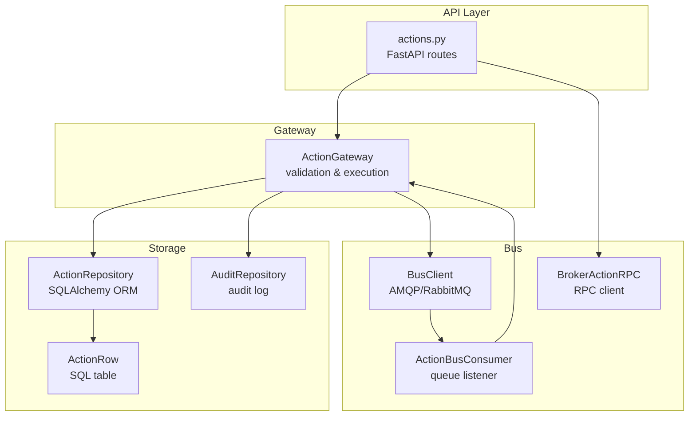
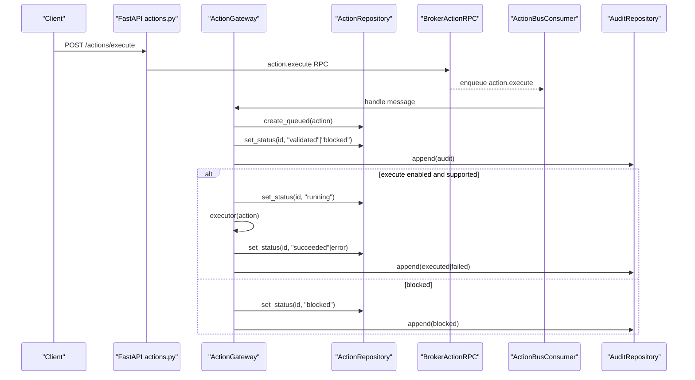
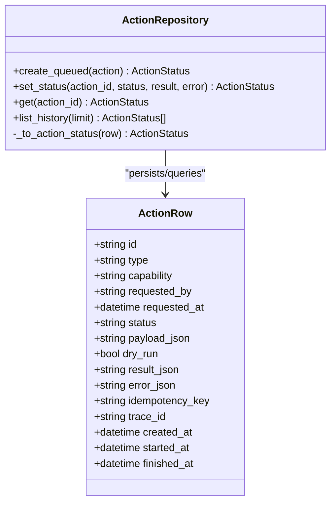
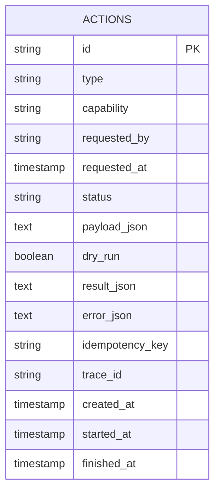
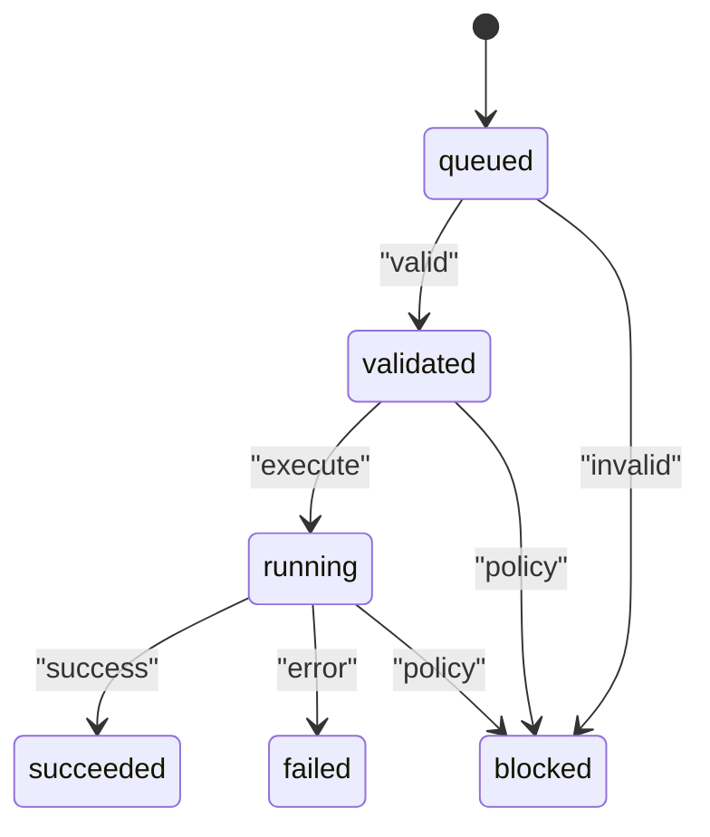
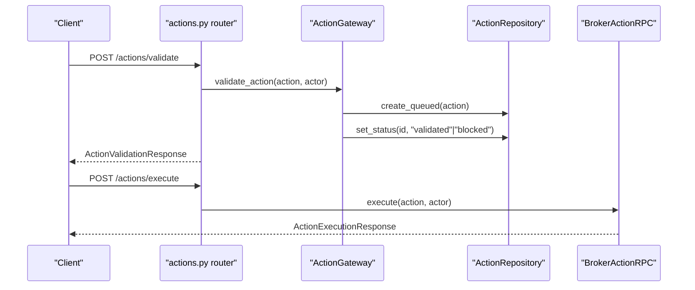
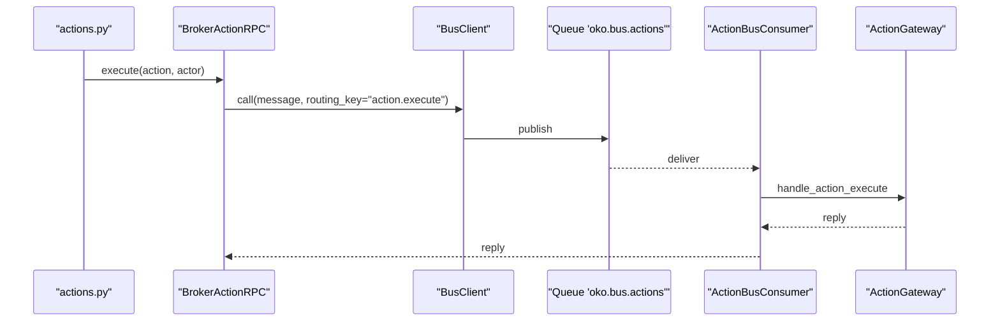
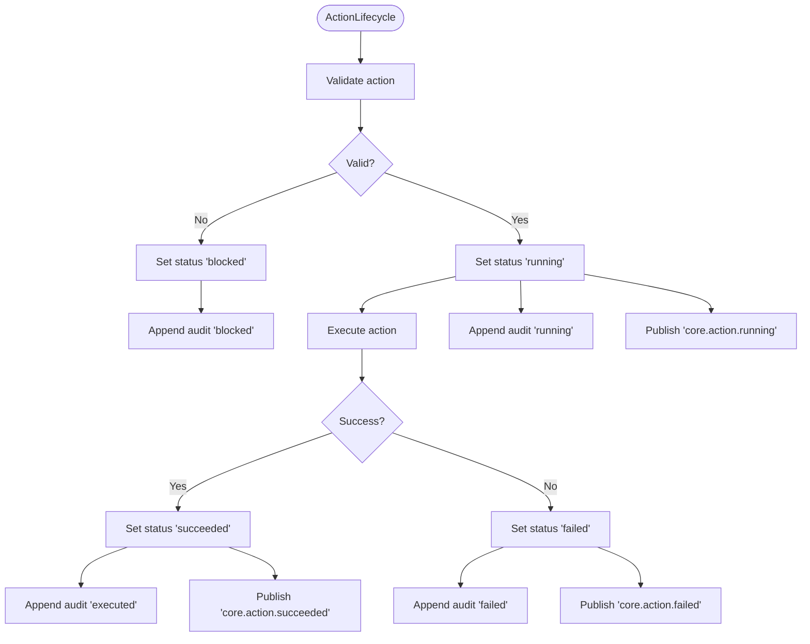
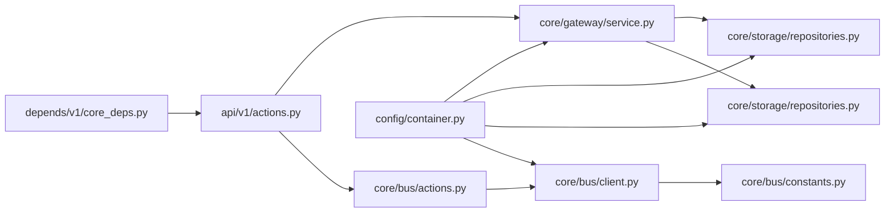

# Action Repository

<cite>
**Referenced Files in This Document**
- [repositories.py](file://core/storage/repositories.py)
- [models.py](file://core/storage/models.py)
- [service.py](file://core/gateway/service.py)
- [actions.py](file://api/v1/actions.py)
- [actions.py](file://core/bus/actions.py)
- [client.py](file://core/bus/client.py)
- [constants.py](file://core/bus/constants.py)
- [container.py](file://config/container.py)
- [core_deps.py](file://depends/v1/core_deps.py)
- [models.py](file://core/contracts/models.py)
</cite>

## Table of Contents
1. [Introduction](#introduction)
2. [Project Structure](#project-structure)
3. [Core Components](#core-components)
4. [Architecture Overview](#architecture-overview)
5. [Detailed Component Analysis](#detailed-component-analysis)
6. [Dependency Analysis](#dependency-analysis)
7. [Performance Considerations](#performance-considerations)
8. [Troubleshooting Guide](#troubleshooting-guide)
9. [Conclusion](#conclusion)

## Introduction
This document explains the action repository implementation and action lifecycle management in the backend. It covers the ActionRepository interface, action queuing, status tracking, persistence, queries, and historical data management. It also documents the relationship with the audit system, event publishing, and action bus integration, along with performance considerations, indexing strategies, and data consistency guarantees.

## Project Structure
The action lifecycle spans several modules:
- API endpoints expose action registry, validation, execution, and history retrieval.
- The ActionGateway orchestrates validation, execution, status updates, audit logging, and event publishing.
- The ActionRepository persists and retrieves action records.
- The bus integrates RPC-based action execution via BrokerActionRPC and ActionBusConsumer.
- The container wires repositories, gateway, bus, and consumers.

**Diagram sources**
- [actions.py:1-61](file://api/v1/actions.py#L1-L61)
- [service.py:31-239](file://core/gateway/service.py#L31-L239)
- [actions.py:21-116](file://core/bus/actions.py#L21-L116)
- [client.py:34-290](file://core/bus/client.py#L34-L290)
- [repositories.py:195-280](file://core/storage/repositories.py#L195-L280)
- [models.py:38-62](file://core/storage/models.py#L38-L62)

**Section sources**
- [actions.py:1-61](file://api/v1/actions.py#L1-L61)
- [service.py:31-239](file://core/gateway/service.py#L31-L239)
- [actions.py:21-116](file://core/bus/actions.py#L21-L116)
- [client.py:34-290](file://core/bus/client.py#L34-L290)
- [repositories.py:195-280](file://core/storage/repositories.py#L195-L280)
- [models.py:38-62](file://core/storage/models.py#L38-L62)

## Core Components
- ActionRepository: Provides create, status update, single lookup, and history listing for actions.
- ActionRow: SQLAlchemy ORM model backing the actions table with indexes for efficient queries.
- ActionGateway: Orchestrates validation, execution, status transitions, audit events, and event publishing.
- BrokerActionRPC: RPC client to publish action.execute messages to the bus.
- ActionBusConsumer: Listens to the actions queue and forwards messages to the gateway.
- AuditRepository: Persists audit logs alongside action lifecycle events.
- BusClient: AMQP client wiring queues, exchanges, and routing keys.

**Section sources**
- [repositories.py:195-280](file://core/storage/repositories.py#L195-L280)
- [models.py:38-62](file://core/storage/models.py#L38-L62)
- [service.py:31-239](file://core/gateway/service.py#L31-L239)
- [actions.py:21-116](file://core/bus/actions.py#L21-L116)
- [client.py:34-290](file://core/bus/client.py#L34-L290)
- [constants.py:1-47](file://core/bus/constants.py#L1-L47)

## Architecture Overview
The action lifecycle is initiated by an API call, validated and queued, then executed either synchronously via RPC or asynchronously via the bus. Status updates, results, and errors are persisted. Audit events and domain events are emitted throughout.

**Diagram sources**
- [actions.py:41-48](file://api/v1/actions.py#L41-L48)
- [actions.py:21-63](file://core/bus/actions.py#L21-L63)
- [service.py:74-232](file://core/gateway/service.py#L74-L232)
- [repositories.py:199-250](file://core/storage/repositories.py#L199-L250)
- [models.py:64-87](file://core/storage/models.py#L64-L87)

## Detailed Component Analysis

### ActionRepository
Responsibilities:
- Create queued actions with canonical JSON payload hashing and idempotency support.
- Set status with timestamps for running/success/failure/cancellation/blocked.
- Persist optional result/error payloads as canonical JSON.
- Retrieve single action status and list recent history.

Key behaviors:
- create_queued inserts a new ActionRow with status "queued" and returns the persisted ActionStatus.
- set_status updates status and timestamps, and stores result/error payloads.
- get retrieves a single action by ID.
- list_history returns the most recent actions ordered by creation time.

**Diagram sources**
- [repositories.py:195-280](file://core/storage/repositories.py#L195-L280)
- [models.py:38-62](file://core/storage/models.py#L38-L62)

**Section sources**
- [repositories.py:199-250](file://core/storage/repositories.py#L199-L250)
- [repositories.py:252-264](file://core/storage/repositories.py#L252-L264)
- [repositories.py:265-279](file://core/storage/repositories.py#L265-L279)
- [models.py:38-62](file://core/storage/models.py#L38-L62)

### Action Model and Indexing
The ActionRow defines the actions table with:
- Primary key: id (stringified UUID).
- Status transitions tracked via status field and timestamps.
- Canonical JSON fields for payload, result, and error.
- Idempotency and tracing fields.
- Indexes optimized for common queries:
  - created_at for history ordering.
  - type + status for filtering by type and status.
  - idempotency_key for deduplication.

**Diagram sources**
- [models.py:38-62](file://core/storage/models.py#L38-L62)

**Section sources**
- [models.py:38-62](file://core/storage/models.py#L38-L62)

### Action Lifecycle Orchestration (ActionGateway)
Responsibilities:
- Register actions and maintain a registry.
- Validate actions against capability/type/dry-run support and actor.
- Enforce kill switches and block unsupported configurations.
- Persist status transitions and audit events.
- Publish domain events for lifecycle stages.

State transitions:
- queued → validated or blocked (validation outcome).
- validated → running (execution begins).
- running → succeeded or failed (executor completion).
- Additional terminal states: cancelled, blocked.

**Diagram sources**
- [service.py:74-232](file://core/gateway/service.py#L74-L232)
- [models.py:72-82](file://core/contracts/models.py#L72-L82)

**Section sources**
- [service.py:74-232](file://core/gateway/service.py#L74-L232)
- [models.py:72-82](file://core/contracts/models.py#L72-L82)

### API Integration (actions.py)
Endpoints:
- GET /actions/registry: Lists registered actions.
- POST /actions/validate: Validates an action envelope and queues it.
- POST /actions/execute: Executes an action via RPC to the bus.
- GET /actions/history: Retrieves recent action history.

**Diagram sources**
- [actions.py:23-57](file://api/v1/actions.py#L23-L57)
- [service.py:74-121](file://core/gateway/service.py#L74-L121)
- [actions.py:26-63](file://core/bus/actions.py#L26-L63)

**Section sources**
- [actions.py:23-57](file://api/v1/actions.py#L23-L57)

### Bus Integration (BrokerActionRPC and ActionBusConsumer)
- BrokerActionRPC constructs action.execute messages and performs RPC calls to the bus with timeouts.
- ActionBusConsumer binds to the actions queue and delegates messages to the gateway.
- BusClient manages AMQP topology, including declaring queues and bindings for action.execute routing.

**Diagram sources**
- [actions.py:21-116](file://core/bus/actions.py#L21-L116)
- [client.py:34-290](file://core/bus/client.py#L34-L290)
- [constants.py:1-47](file://core/bus/constants.py#L1-L47)

**Section sources**
- [actions.py:21-116](file://core/bus/actions.py#L21-L116)
- [client.py:34-290](file://core/bus/client.py#L34-L290)
- [constants.py:1-47](file://core/bus/constants.py#L1-L47)

### Audit and Events
- AuditRepository persists AuditEvent entries for validation, execution, failure, and blocking decisions.
- ActionGateway publishes domain events for running, succeeded, and failed states.

**Diagram sources**
- [service.py:74-232](file://core/gateway/service.py#L74-L232)
- [repositories.py:282-301](file://core/storage/repositories.py#L282-L301)

**Section sources**
- [service.py:74-232](file://core/gateway/service.py#L74-L232)
- [repositories.py:282-301](file://core/storage/repositories.py#L282-L301)

## Dependency Analysis
- API routes depend on ActionGateway and BrokerActionRPC via dependency injection.
- ActionGateway depends on ActionRepository, AuditRepository, and EventPublisher.
- ActionRepository depends on SQLAlchemy ORM models and async sessions.
- Bus components depend on BusClient and constants for routing.
- Container builds and wires all components, including consumers and publishers.

**Diagram sources**
- [actions.py:1-61](file://api/v1/actions.py#L1-L61)
- [service.py:31-239](file://core/gateway/service.py#L31-L239)
- [repositories.py:195-304](file://core/storage/repositories.py#L195-L304)
- [actions.py:21-116](file://core/bus/actions.py#L21-L116)
- [client.py:34-290](file://core/bus/client.py#L34-L290)
- [constants.py:1-47](file://core/bus/constants.py#L1-L47)
- [container.py:252-427](file://config/container.py#L252-L427)
- [core_deps.py:28-33](file://depends/v1/core_deps.py#L28-L33)

**Section sources**
- [container.py:252-427](file://config/container.py#L252-L427)
- [core_deps.py:28-33](file://depends/v1/core_deps.py#L28-L33)

## Performance Considerations
- Canonical JSON normalization and SHA-256 hashing for payload deduplication and integrity.
- Indexes on actions table:
  - created_at for history pagination.
  - type + status for filtering by action type and current status.
  - idempotency_key for preventing duplicate processing.
- Timestamps for running/success/failure enable efficient lifecycle analytics.
- RPC timeouts and QoS prefetch tuning in BusClient help manage throughput and latency.
- Limit history queries via API to prevent heavy scans.

[No sources needed since this section provides general guidance]

## Troubleshooting Guide
Common issues and diagnostics:
- Action not found during status update: set_status raises KeyError if the action does not exist.
- Action disappeared after update: get returns None after set_status, indicating concurrency or cleanup.
- RPC timeout: BrokerActionRPC raises a specific timeout error when worker replies are slow.
- Validation failures: ActionGateway sets status "blocked" and appends audit entries with reasons.
- Execution failures: ActionGateway captures ApiError or generic exceptions, sets status "failed", and emits audit and domain events.

**Section sources**
- [repositories.py:234-250](file://core/storage/repositories.py#L234-L250)
- [actions.py:38-63](file://core/bus/actions.py#L38-L63)
- [service.py:190-232](file://core/gateway/service.py#L190-L232)

## Conclusion
The action repository and gateway provide a robust, auditable, and event-driven lifecycle for actions. Persistence uses canonical JSON and targeted indexes for efficient queries. The bus enables scalable asynchronous execution with RPC and event publishing. Together, these components ensure predictable state transitions, reliable historical tracking, and strong operational observability.