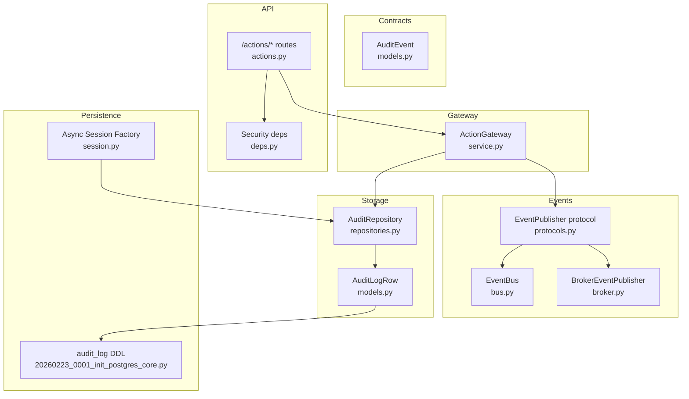
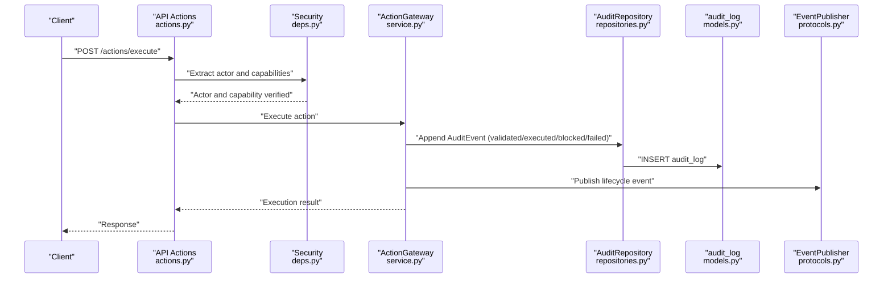
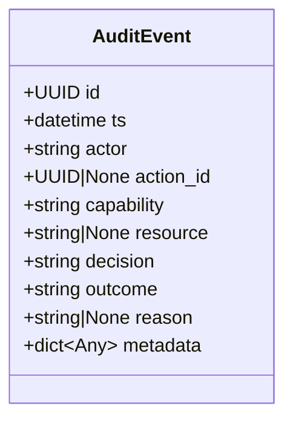
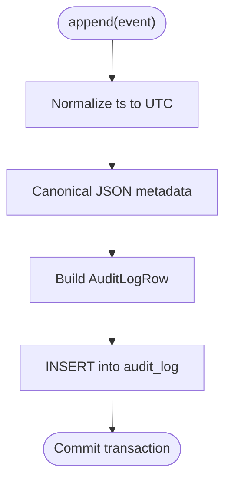
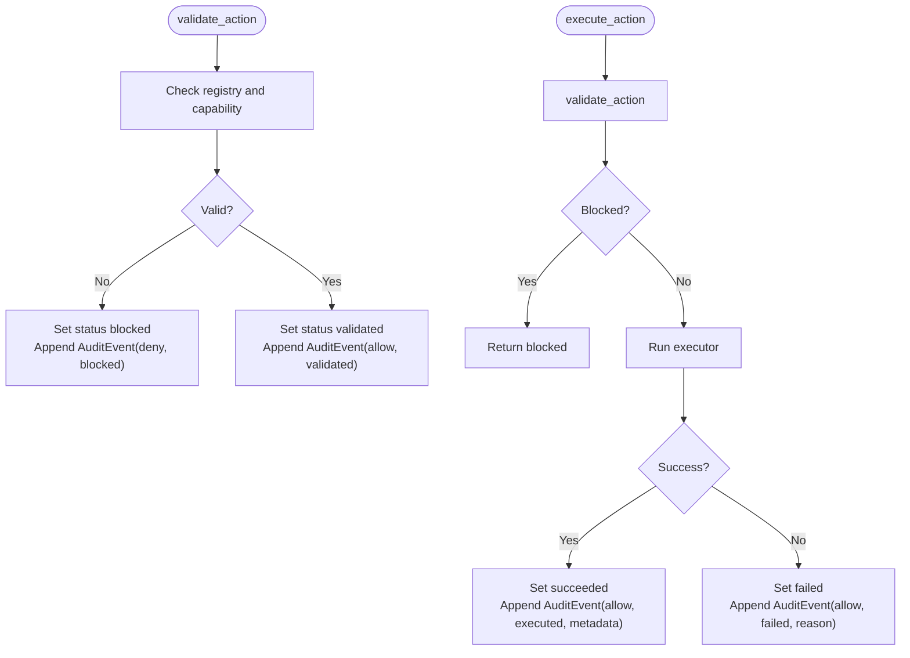
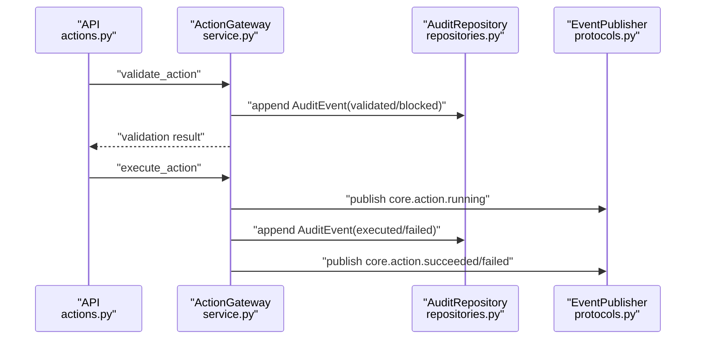
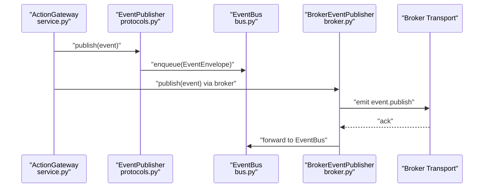
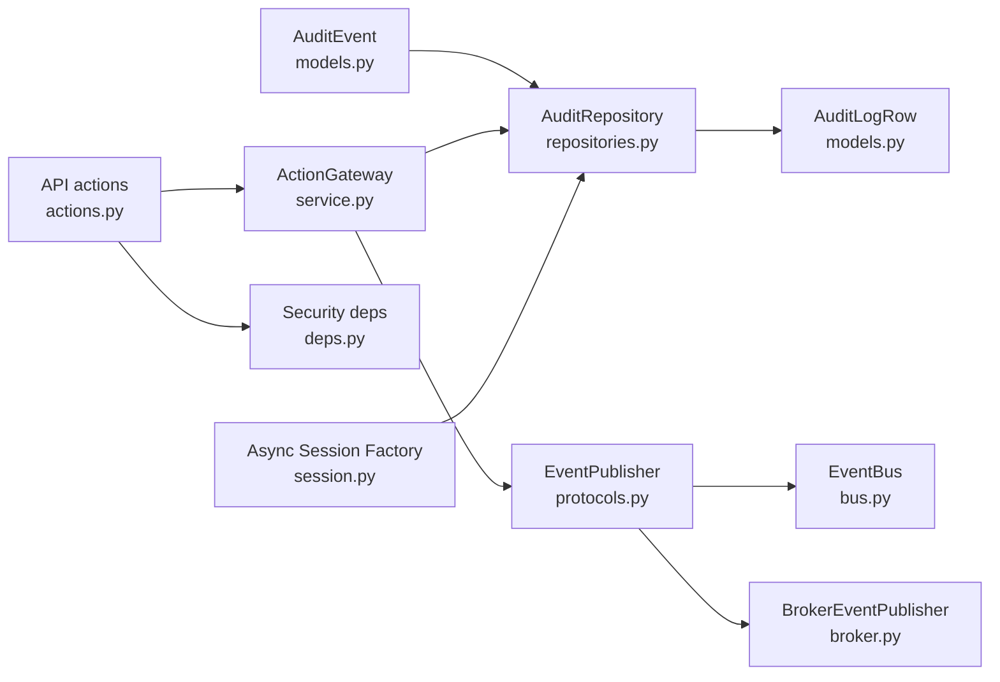

# Audit System

<cite>
**Referenced Files in This Document**
- [models.py](file://core/contracts/models.py)
- [models.py](file://core/storage/models.py)
- [repositories.py](file://core/storage/repositories.py)
- [service.py](file://core/gateway/service.py)
- [actions.py](file://api/v1/actions.py)
- [deps.py](file://core/security/deps.py)
- [broker.py](file://core/events/broker.py)
- [bus.py](file://core/events/bus.py)
- [protocols.py](file://core/events/protocols.py)
- [20260223_0001_init_postgres_core.py](file://alembic/versions/20260223_0001_init_postgres_core.py)
- [session.py](file://db/session.py)
</cite>

## Table of Contents
1. [Introduction](#introduction)
2. [Project Structure](#project-structure)
3. [Core Components](#core-components)
4. [Architecture Overview](#architecture-overview)
5. [Detailed Component Analysis](#detailed-component-analysis)
6. [Dependency Analysis](#dependency-analysis)
7. [Performance Considerations](#performance-considerations)
8. [Troubleshooting Guide](#troubleshooting-guide)
9. [Conclusion](#conclusion)
10. [Appendices](#appendices)

## Introduction
This document describes the audit logging system that records authorization decisions and outcomes for actions executed in the platform. It covers the AuditEvent model, audit trail generation, compliance tracking, integration with action execution, event publishing, and persistence via repositories. It also documents audit event types, metadata capture, decision logging patterns, filtering and querying capabilities, retention considerations, and security practices for tamper detection and regulatory compliance.

## Project Structure
The audit system spans several modules:
- Contracts define the AuditEvent model and related types.
- Storage models and repositories persist audit logs to the database.
- The ActionGateway orchestrates action validation and execution, emitting audit events and publishing lifecycle events.
- API endpoints expose action operations and integrate with security headers and capability checks.
- Event infrastructure publishes and consumes internal events.
- Alembic migrations define the audit_log table schema and indexes.
- Database session factory configures async SQLAlchemy sessions.

**Diagram sources**
- [models.py:123-134](file://core/contracts/models.py#L123-L134)
- [models.py:64-87](file://core/storage/models.py#L64-L87)
- [repositories.py:282-301](file://core/storage/repositories.py#L282-L301)
- [service.py:31-233](file://core/gateway/service.py#L31-L233)
- [actions.py:1-61](file://api/v1/actions.py#L1-L61)
- [deps.py:1-75](file://core/security/deps.py#L1-L75)
- [protocols.py:8-17](file://core/events/protocols.py#L8-L17)
- [bus.py:11-57](file://core/events/bus.py#L11-L57)
- [broker.py:16-94](file://core/events/broker.py#L16-L94)
- [20260223_0001_init_postgres_core.py:60-75](file://alembic/versions/20260223_0001_init_postgres_core.py#L60-L75)
- [session.py:13-20](file://db/session.py#L13-L20)

**Section sources**
- [models.py:123-134](file://core/contracts/models.py#L123-L134)
- [models.py:64-87](file://core/storage/models.py#L64-L87)
- [repositories.py:282-301](file://core/storage/repositories.py#L282-L301)
- [service.py:31-233](file://core/gateway/service.py#L31-L233)
- [actions.py:1-61](file://api/v1/actions.py#L1-L61)
- [deps.py:1-75](file://core/security/deps.py#L1-L75)
- [protocols.py:8-17](file://core/events/protocols.py#L8-L17)
- [bus.py:11-57](file://core/events/bus.py#L11-L57)
- [broker.py:16-94](file://core/events/broker.py#L16-L94)
- [20260223_0001_init_postgres_core.py:60-75](file://alembic/versions/20260223_0001_init_postgres_core.py#L60-L75)
- [session.py:13-20](file://db/session.py#L13-L20)

## Core Components
- AuditEvent model: Defines the shape of audit entries, including actor, action linkage, capability, resource, decision, outcome, reason, and metadata.
- AuditLogRow: SQLAlchemy ORM entity representing the audit_log table.
- AuditRepository: Persists AuditEvent instances to the database, canonicalizing metadata to a stable JSON form.
- ActionGateway: Central orchestration point for action lifecycle; emits audit events for validation, execution, and failure outcomes; publishes lifecycle events.
- Security and API: Enforces capability-based access and extracts the actor from request headers.
- Event system: Provides an in-memory event bus and a broker-backed publisher/consumer pair for distributed event delivery.
- Alembic migration: Creates the audit_log table with indexes on timestamps and actor for efficient querying.

**Section sources**
- [models.py:123-134](file://core/contracts/models.py#L123-L134)
- [models.py:64-87](file://core/storage/models.py#L64-L87)
- [repositories.py:282-301](file://core/storage/repositories.py#L282-L301)
- [service.py:74-233](file://core/gateway/service.py#L74-L233)
- [deps.py:16-38](file://core/security/deps.py#L16-L38)
- [actions.py:18-48](file://api/v1/actions.py#L18-L48)
- [broker.py:16-94](file://core/events/broker.py#L16-L94)
- [bus.py:11-57](file://core/events/bus.py#L11-L57)
- [20260223_0001_init_postgres_core.py:60-75](file://alembic/versions/20260223_0001_init_postgres_core.py#L60-L75)

## Architecture Overview
The audit system integrates tightly with action execution and event publishing:
- API requests are validated for actor and capabilities.
- ActionGateway validates and executes actions, updating action status and emitting audit events for each outcome.
- AuditRepository persists audit events to the audit_log table.
- EventPublisher is used to publish lifecycle events for monitoring and downstream consumers.

**Diagram sources**
- [actions.py:41-48](file://api/v1/actions.py#L41-L48)
- [deps.py:16-38](file://core/security/deps.py#L16-L38)
- [service.py:122-233](file://core/gateway/service.py#L122-L233)
- [repositories.py:286-300](file://core/storage/repositories.py#L286-L300)
- [models.py:64-87](file://core/storage/models.py#L64-L87)
- [protocols.py:8-17](file://core/events/protocols.py#L8-L17)

## Detailed Component Analysis

### AuditEvent Model
- Fields include identifiers, timestamps, actor, optional action linkage, capability, resource, decision, outcome, reason, and metadata.
- Decision and outcome are constrained to specific literal sets, ensuring consistent categorization.
- Metadata supports arbitrary JSON and is canonicalized before persistence.

**Diagram sources**
- [models.py:123-134](file://core/contracts/models.py#L123-L134)

**Section sources**
- [models.py:123-134](file://core/contracts/models.py#L123-L134)

### Audit Log Persistence
- AuditRepository.append converts AuditEvent to AuditLogRow and writes to the database within a transaction.
- Canonical JSON normalization ensures deterministic storage of metadata.
- Timestamps are normalized to UTC.

**Diagram sources**
- [repositories.py:286-300](file://core/storage/repositories.py#L286-L300)
- [models.py:64-87](file://core/storage/models.py#L64-L87)

**Section sources**
- [repositories.py:286-300](file://core/storage/repositories.py#L286-L300)
- [models.py:64-87](file://core/storage/models.py#L64-L87)

### Decision Logging Patterns
- Validation path: Records allow/deny and validated/blocked outcomes with reasons.
- Execution path: Records allow/executed outcomes; captures dry-run metadata; logs failures with reasons.
- Kill switch and unsupported dry-run scenarios trigger deny/blocked outcomes.

**Diagram sources**
- [service.py:74-233](file://core/gateway/service.py#L74-L233)

**Section sources**
- [service.py:74-233](file://core/gateway/service.py#L74-L233)

### Integration with Action Execution
- API routes enforce actor and capability checks.
- ActionGateway coordinates validation, execution, status updates, audit events, and lifecycle events.
- EventPublisher protocol enables pluggable event transport (in-memory bus or broker).

**Diagram sources**
- [actions.py:31-48](file://api/v1/actions.py#L31-L48)
- [service.py:74-233](file://core/gateway/service.py#L74-L233)
- [protocols.py:8-17](file://core/events/protocols.py#L8-L17)

**Section sources**
- [actions.py:31-48](file://api/v1/actions.py#L31-L48)
- [service.py:74-233](file://core/gateway/service.py#L74-L233)
- [protocols.py:8-17](file://core/events/protocols.py#L8-L17)

### Event Publishing Infrastructure
- EventBus provides an in-memory publish/subscribe mechanism with revisioning and queue management.
- BrokerEventPublisher serializes and forwards events to a broker using a dedicated routing key.
- EventPublishConsumer receives forwarded messages and dispatches them to the in-memory event bus.

**Diagram sources**
- [bus.py:17-51](file://core/events/bus.py#L17-L51)
- [broker.py:21-91](file://core/events/broker.py#L21-L91)
- [protocols.py:8-17](file://core/events/protocols.py#L8-L17)

**Section sources**
- [bus.py:17-51](file://core/events/bus.py#L17-L51)
- [broker.py:21-91](file://core/events/broker.py#L21-L91)
- [protocols.py:8-17](file://core/events/protocols.py#L8-L17)

### Audit Trail Generation and Compliance Tracking
- Each action lifecycle step produces an audit record with sufficient context for compliance.
- Decisions and outcomes are standardized for consistent reporting.
- Metadata can carry additional compliance-relevant attributes (e.g., dry-run flag).

**Section sources**
- [service.py:74-233](file://core/gateway/service.py#L74-L233)
- [models.py:123-134](file://core/contracts/models.py#L123-L134)

## Dependency Analysis
- AuditEvent is consumed by AuditRepository and ActionGateway.
- ActionGateway depends on AuditRepository and EventPublisher.
- API routes depend on security headers and ActionGateway.
- AuditRepository depends on SQLAlchemy ORM models and async sessions.
- EventPublisher is a protocol enabling multiple implementations.

**Diagram sources**
- [models.py:123-134](file://core/contracts/models.py#L123-L134)
- [repositories.py:282-301](file://core/storage/repositories.py#L282-L301)
- [models.py:64-87](file://core/storage/models.py#L64-L87)
- [service.py:31-44](file://core/gateway/service.py#L31-L44)
- [actions.py:18-48](file://api/v1/actions.py#L18-L48)
- [deps.py:16-38](file://core/security/deps.py#L16-L38)
- [protocols.py:8-17](file://core/events/protocols.py#L8-L17)
- [bus.py:11-57](file://core/events/bus.py#L11-L57)
- [broker.py:16-94](file://core/events/broker.py#L16-L94)
- [session.py:13-20](file://db/session.py#L13-L20)

**Section sources**
- [models.py:123-134](file://core/contracts/models.py#L123-L134)
- [repositories.py:282-301](file://core/storage/repositories.py#L282-L301)
- [models.py:64-87](file://core/storage/models.py#L64-L87)
- [service.py:31-44](file://core/gateway/service.py#L31-L44)
- [actions.py:18-48](file://api/v1/actions.py#L18-L48)
- [deps.py:16-38](file://core/security/deps.py#L16-L38)
- [protocols.py:8-17](file://core/events/protocols.py#L8-L17)
- [bus.py:11-57](file://core/events/bus.py#L11-L57)
- [broker.py:16-94](file://core/events/broker.py#L16-L94)
- [session.py:13-20](file://db/session.py#L13-L20)

## Performance Considerations
- Canonical JSON normalization reduces storage variance and improves indexing effectiveness.
- UTC normalization avoids timezone-related sorting inconsistencies.
- Asynchronous SQLAlchemy sessions minimize blocking during audit writes.
- Indexes on timestamp and actor enable efficient time-range and actor-scoped queries.
- Consider partitioning or retention policies for long-running systems to manage audit_log growth.

[No sources needed since this section provides general guidance]

## Troubleshooting Guide
- Audit records missing:
  - Verify AuditRepository.append is called in all code paths (validated, executed, failed, blocked).
  - Confirm asynchronous session commit occurs within transactions.
- Incorrect timestamps or timezones:
  - Ensure ts is normalized to UTC before persistence.
- Metadata anomalies:
  - Confirm metadata is canonicalized prior to insertion.
- Capability or actor errors:
  - Check API route decorators and security header extraction.
- Event delivery issues:
  - Validate EventPublisher implementation and broker connectivity.

**Section sources**
- [repositories.py:286-300](file://core/storage/repositories.py#L286-L300)
- [service.py:74-233](file://core/gateway/service.py#L74-L233)
- [deps.py:16-38](file://core/security/deps.py#L16-L38)
- [broker.py:66-91](file://core/events/broker.py#L66-L91)

## Conclusion
The audit system provides a robust, standards-aligned mechanism for capturing authorization decisions and outcomes across action lifecycles. Its design emphasizes consistency, compliance-friendly categorization, and extensibility through event publishing. Proper use of the AuditEvent model, AuditRepository, and ActionGateway ensures comprehensive audit trails suitable for compliance reporting and forensic analysis.

[No sources needed since this section summarizes without analyzing specific files]

## Appendices

### Audit Event Types and Outcomes
- Decision: allow or deny
- Outcome: validated, executed, failed, blocked
- Typical combinations:
  - allow + validated: pre-execution validation success
  - deny + blocked: pre-execution validation failure
  - allow + executed: successful execution
  - allow + failed: execution failure
  - deny + blocked: kill switch or unsupported dry-run

**Section sources**
- [models.py:123-134](file://core/contracts/models.py#L123-L134)
- [service.py:74-233](file://core/gateway/service.py#L74-L233)

### Metadata Capture Patterns
- Include action-specific attributes (e.g., dry-run) in metadata for richer audits.
- Keep metadata minimal and canonicalized to reduce storage overhead and improve queryability.

**Section sources**
- [service.py:172-182](file://core/gateway/service.py#L172-L182)
- [repositories.py:286-300](file://core/storage/repositories.py#L286-L300)

### Filtering and Querying Capabilities
- Database schema includes indexes on timestamp and actor for efficient filtering.
- Example filters:
  - By actor: filter by actor field.
  - By time range: filter by timestamp.
  - By decision/outcome: filter by decision and outcome fields.
- Consider adding additional indexes or materialized views for frequent report slices.

**Section sources**
- [20260223_0001_init_postgres_core.py:74-75](file://alembic/versions/20260223_0001_init_postgres_core.py#L74-L75)
- [models.py:84-87](file://core/storage/models.py#L84-L87)

### Retention Policies
- Define retention windows per regulatory requirements.
- Implement periodic cleanup jobs to remove expired audit records while preserving referential integrity for dependent analyses.

[No sources needed since this section provides general guidance]

### Examples

- Creating an audit event:
  - Construct an AuditEvent with actor, capability, resource, decision, outcome, reason, and metadata.
  - Persist via AuditRepository.append.

- Compliance reporting:
  - Filter audit_log by actor and time window.
  - Aggregate outcomes and decisions to produce compliance dashboards.

- Forensic analysis:
  - Trace an action’s lifecycle by action_id.
  - Correlate with event bus envelopes for end-to-end visibility.

**Section sources**
- [models.py:123-134](file://core/contracts/models.py#L123-L134)
- [repositories.py:286-300](file://core/storage/repositories.py#L286-L300)
- [service.py:74-233](file://core/gateway/service.py#L74-L233)

### Security Considerations and Tamper Detection
- Canonical JSON normalization and UTC timestamps improve integrity.
- Store audit_log in a secure, read-only or append-only environment where feasible.
- Consider cryptographic signatures or hashes for immutable audit logs in high-security contexts.
- Monitor and alert on unusual spikes in blocked or failed outcomes.

[No sources needed since this section provides general guidance]