# Application Architecture

<cite>
**Referenced Files in This Document**
- [main.py](file://main.py)
- [bootstrap.py](file://bootstrap.py)
- [app_factory.py](file://app_factory.py)
- [config/container.py](file://config/container.py)
- [config/settings.py](file://config/settings.py)
- [core/bus/client.py](file://core/bus/client.py)
- [core/events/broker.py](file://core/events/broker.py)
- [core/plugins/service.py](file://core/plugins/service.py)
- [core/plugins/router.py](file://core/plugins/router.py)
- [core/gateway/service.py](file://core/gateway/service.py)
- [core/storage/repositories.py](file://core/storage/repositories.py)
- [core/storage/rpc.py](file://core/storage/rpc.py)
- [apps/health/service/checkers.py](file://apps/health/service/checkers.py)
- [apps/health/worker/scheduler.py](file://apps/health/worker/scheduler.py)
- [api/v1/__init__.py](file://api/v1/__init__.py)
</cite>

## Table of Contents
1. [Introduction](#introduction)
2. [Project Structure](#project-structure)
3. [Core Components](#core-components)
4. [Architecture Overview](#architecture-overview)
5. [Detailed Component Analysis](#detailed-component-analysis)
6. [Dependency Analysis](#dependency-analysis)
7. [Performance Considerations](#performance-considerations)
8. [Troubleshooting Guide](#troubleshooting-guide)
9. [Conclusion](#conclusion)

## Introduction
This document describes the architecture of the Oko Dashboard backend application. It focuses on the layered architecture, dependency injection container pattern, service orchestration, application factory pattern, bootstrap process, and runtime initialization. It also documents the core architectural components (AppContainer, service dependencies, and component lifecycle), architectural patterns (event-driven architecture, plugin pattern, repository pattern), system boundaries, component interactions, integration patterns, scalability considerations, performance characteristics, and design trade-offs.

## Project Structure
The backend is organized around a layered architecture:
- Bootstrap and application factory: responsible for loading settings, building the dependency container, and constructing the FastAPI application with lifespan hooks.
- Configuration: settings and container builder that wires all services and infrastructure.
- Core services: messaging bus, event publishing/consuming, plugin system, storage RPC and repositories, action gateway, and health monitoring.
- Feature modules: health checks and scheduling.
- API surface: FastAPI routers exposing core, actions, plugins, and store endpoints.

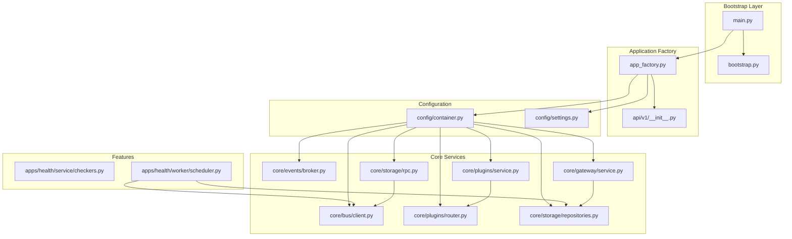

**Diagram sources**
- [main.py:1-24](file://main.py#L1-L24)
- [bootstrap.py:1-32](file://bootstrap.py#L1-L32)
- [app_factory.py:1-133](file://app_factory.py#L1-L133)
- [config/container.py:1-427](file://config/container.py#L1-L427)
- [config/settings.py:1-128](file://config/settings.py#L1-L128)
- [core/bus/client.py:1-290](file://core/bus/client.py#L1-L290)
- [core/events/broker.py:1-95](file://core/events/broker.py#L1-L95)
- [core/plugins/service.py:1-299](file://core/plugins/service.py#L1-L299)
- [core/plugins/router.py:1-448](file://core/plugins/router.py#L1-L448)
- [core/gateway/service.py:1-239](file://core/gateway/service.py#L1-L239)
- [core/storage/repositories.py:1-304](file://core/storage/repositories.py#L1-L304)
- [core/storage/rpc.py:1-500](file://core/storage/rpc.py#L1-L500)
- [apps/health/service/checkers.py:1-199](file://apps/health/service/checkers.py#L1-L199)
- [apps/health/worker/scheduler.py:1-201](file://apps/health/worker/scheduler.py#L1-L201)
- [api/v1/__init__.py:1-16](file://api/v1/__init__.py#L1-L16)

**Section sources**
- [main.py:1-24](file://main.py#L1-L24)
- [bootstrap.py:1-32](file://bootstrap.py#L1-L32)
- [app_factory.py:1-133](file://app_factory.py#L1-L133)
- [config/container.py:1-427](file://config/container.py#L1-L427)
- [config/settings.py:1-128](file://config/settings.py#L1-L128)
- [api/v1/__init__.py:1-16](file://api/v1/__init__.py#L1-L16)

## Core Components
- AppContainer: central dependency injection container that constructs and wires all services, repositories, consumers, and clients. It encapsulates lifecycle management via startup/shutdown routines.
- Settings: strongly typed configuration model controlling runtime role, broker connectivity, database URLs, health parameters, and plugin behavior.
- BusClient: AMQP-based messaging client supporting RPC, emits, consumes, and memory-mode dispatch for local testing.
- Event system: BrokerEventPublisher publishes events over the bus; EventPublishConsumer subscribes and forwards to an in-memory EventBus.
- Plugin system: PluginService orchestrates discovery, loading, enabling/disabling, and runtime hooks; PluginRouter mounts plugin pages and APIs dynamically.
- ActionGateway: validates and executes actions, records audit events, publishes lifecycle events, and integrates with repositories.
- Storage RPC: InProc and Bus-backed RPC clients for plugin storage operations; StorageRpcConsumer enforces capabilities and handles requests.
- Repositories: ConfigRepository, ActionRepository, AuditRepository implement the repository pattern for persistence.
- Health subsystem: HealthScheduler periodically emits health check requests; HealthChecker executes checks and returns results.

**Section sources**
- [config/container.py:50-174](file://config/container.py#L50-L174)
- [config/settings.py:14-128](file://config/settings.py#L14-L128)
- [core/bus/client.py:34-290](file://core/bus/client.py#L34-L290)
- [core/events/broker.py:16-95](file://core/events/broker.py#L16-L95)
- [core/plugins/service.py:18-299](file://core/plugins/service.py#L18-L299)
- [core/plugins/router.py:16-448](file://core/plugins/router.py#L16-L448)
- [core/gateway/service.py:31-239](file://core/gateway/service.py#L31-L239)
- [core/storage/rpc.py:65-500](file://core/storage/rpc.py#L65-L500)
- [core/storage/repositories.py:55-304](file://core/storage/repositories.py#L55-L304)
- [apps/health/worker/scheduler.py:19-201](file://apps/health/worker/scheduler.py#L19-L201)
- [apps/health/service/checkers.py:15-199](file://apps/health/service/checkers.py#L15-L199)

## Architecture Overview
The system follows a layered, event-driven architecture with a strong dependency injection container pattern. The application factory composes the FastAPI app, mounts routers, registers plugin routes, and manages container lifecycle via lifespan hooks. The container builds services and infrastructure based on settings, then starts/stops them according to runtime role and configuration.

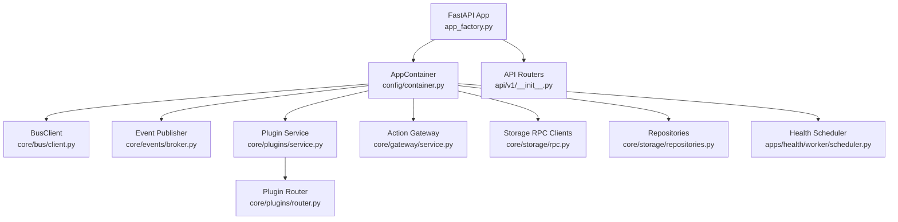

**Diagram sources**
- [app_factory.py:87-124](file://app_factory.py#L87-L124)
- [config/container.py:252-423](file://config/container.py#L252-L423)
- [core/bus/client.py:34-290](file://core/bus/client.py#L34-L290)
- [core/events/broker.py:16-95](file://core/events/broker.py#L16-L95)
- [core/plugins/service.py:18-299](file://core/plugins/service.py#L18-L299)
- [core/plugins/router.py:16-448](file://core/plugins/router.py#L16-L448)
- [core/gateway/service.py:31-239](file://core/gateway/service.py#L31-L239)
- [core/storage/rpc.py:65-500](file://core/storage/rpc.py#L65-L500)
- [core/storage/repositories.py:55-304](file://core/storage/repositories.py#L55-L304)
- [apps/health/worker/scheduler.py:19-201](file://apps/health/worker/scheduler.py#L19-L201)
- [api/v1/__init__.py:1-16](file://api/v1/__init__.py#L1-L16)

## Detailed Component Analysis

### Application Factory Pattern and Bootstrap Process
- Bootstrap loads runtime settings and builds the container factory.
- The application factory creates a FastAPI app with lifespan hooks that initialize logging, construct the container, register plugin routes, and manage startup/shutdown.
- The root endpoint serves the frontend index file if present; otherwise returns a 503.

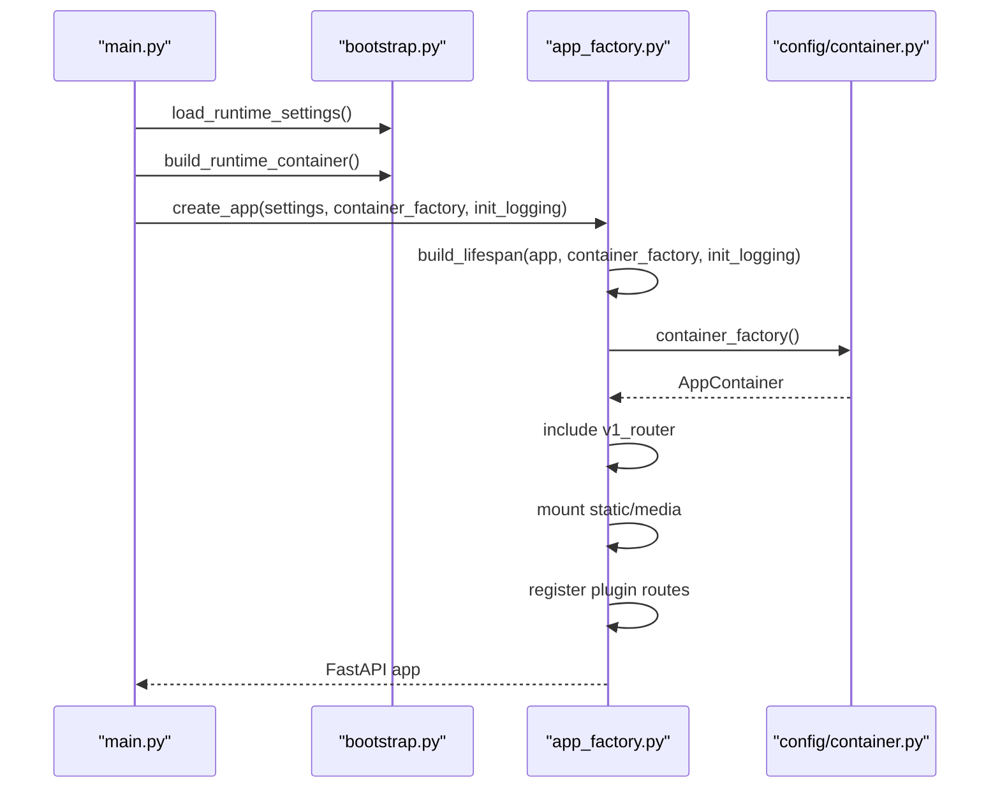

**Diagram sources**
- [main.py:7-21](file://main.py#L7-L21)
- [bootstrap.py:16-23](file://bootstrap.py#L16-L23)
- [app_factory.py:87-124](file://app_factory.py#L87-L124)
- [config/container.py:252-423](file://config/container.py#L252-L423)

**Section sources**
- [bootstrap.py:16-31](file://bootstrap.py#L16-L31)
- [app_factory.py:30-46](file://app_factory.py#L30-L46)
- [app_factory.py:87-124](file://app_factory.py#L87-L124)
- [main.py:7-21](file://main.py#L7-L21)

### Dependency Injection Container Pattern (AppContainer)
- AppContainer aggregates all services: database engine/session factory, repositories, event bus/publisher, action gateway, storage modes, RPC clients, bus consumers, health components, and plugin service/store.
- Startup routine connects to the broker, ensures schema compatibility, and starts consumers/services depending on runtime role and settings.
- Shutdown routine stops plugin watcher, plugin service, consumers, and disposes the database engine.

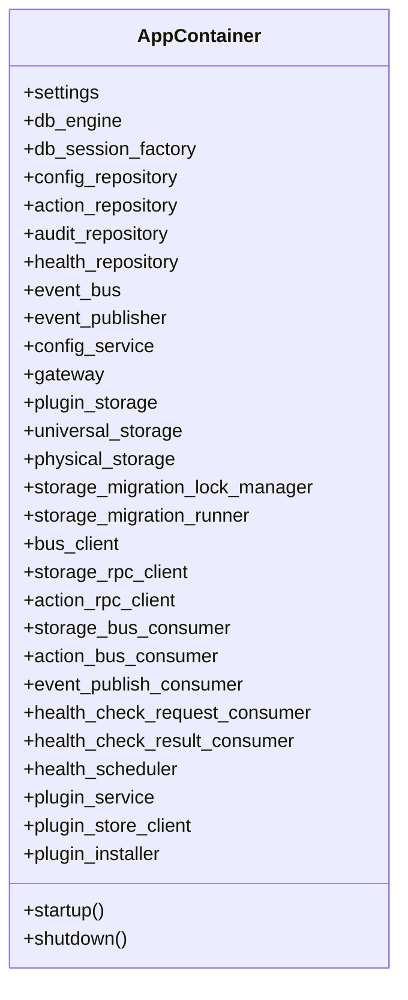

**Diagram sources**
- [config/container.py:50-174](file://config/container.py#L50-L174)

**Section sources**
- [config/container.py:50-174](file://config/container.py#L50-L174)
- [config/container.py:252-423](file://config/container.py#L252-L423)

### Event-Driven Architecture
- BrokerEventPublisher publishes event envelopes over the bus with routing keys.
- EventPublishConsumer subscribes to the events queue and forwards messages to the in-memory EventBus.
- Consumers are conditionally started based on runtime role and broker configuration.

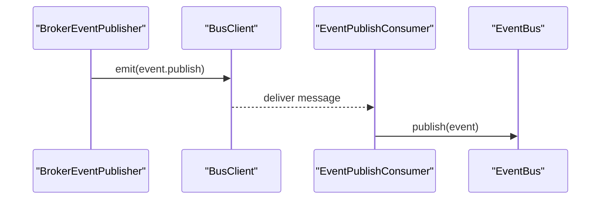

**Diagram sources**
- [core/events/broker.py:16-95](file://core/events/broker.py#L16-L95)
- [core/bus/client.py:77-100](file://core/bus/client.py#L77-L100)

**Section sources**
- [core/events/broker.py:16-95](file://core/events/broker.py#L16-L95)
- [core/bus/client.py:46-100](file://core/bus/client.py#L46-L100)

### Plugin Pattern
- PluginService discovers, loads, enables/disables, and unloads plugins; it invokes optional on_startup/on_shutdown hooks and maintains a runtime watch loop.
- PluginRouter mounts plugin pages and APIs dynamically based on plugin UI manifests and module-provided routers.

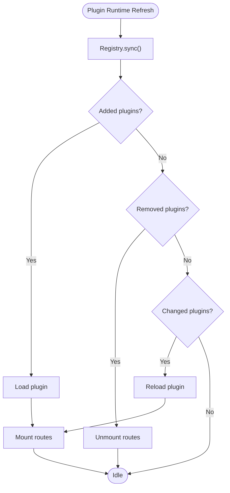

**Diagram sources**
- [core/plugins/service.py:231-283](file://core/plugins/service.py#L231-L283)
- [core/plugins/router.py:118-172](file://core/plugins/router.py#L118-L172)

**Section sources**
- [core/plugins/service.py:18-299](file://core/plugins/service.py#L18-L299)
- [core/plugins/router.py:16-448](file://core/plugins/router.py#L16-L448)

### Repository Pattern
- ConfigRepository, ActionRepository, and AuditRepository encapsulate persistence concerns with SQLAlchemy async sessions.
- They expose domain-focused methods for fetching, creating, updating, and listing entities.

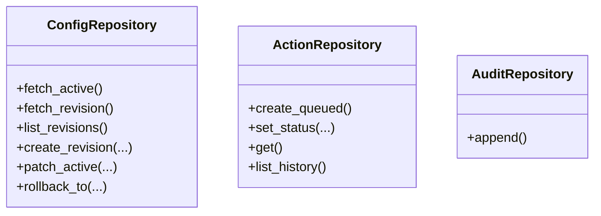

**Diagram sources**
- [core/storage/repositories.py:55-304](file://core/storage/repositories.py#L55-L304)

**Section sources**
- [core/storage/repositories.py:55-304](file://core/storage/repositories.py#L55-L304)

### Storage RPC and Bus Orchestration
- StorageRpcConsumer subscribes to a dedicated RPC queue, validates capabilities, and delegates to an in-process dispatcher.
- BusStorageRPC and InProcStorageRPC provide synchronous RPC-like interfaces for plugin storage operations.
- BusClient supports RPC with reply queues and memory-mode dispatch for tests.

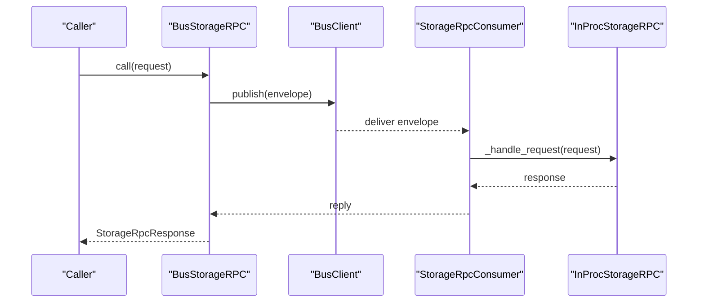

**Diagram sources**
- [core/storage/rpc.py:246-393](file://core/storage/rpc.py#L246-L393)
- [core/bus/client.py:101-167](file://core/bus/client.py#L101-L167)

**Section sources**
- [core/storage/rpc.py:65-500](file://core/storage/rpc.py#L65-L500)
- [core/bus/client.py:34-290](file://core/bus/client.py#L34-L290)

### Health Monitoring and Scheduling
- HealthScheduler periodically reads active configuration, syncs monitored services, and emits health check requests to the bus at configured intervals.
- HealthChecker executes HTTP/TCP/ICMP checks and returns structured results.
- HealthScheduler logs heartbeats and schedules.

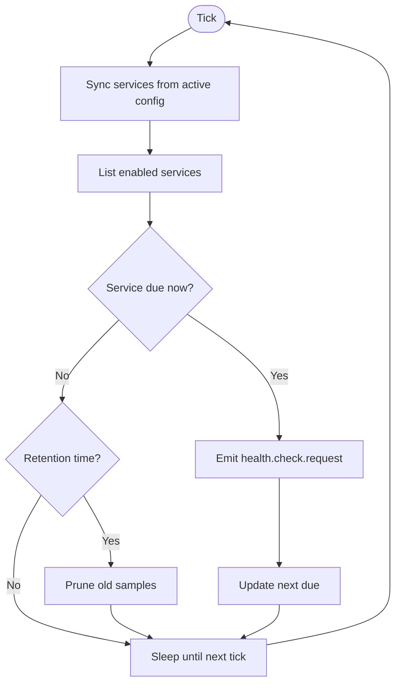

**Diagram sources**
- [apps/health/worker/scheduler.py:68-140](file://apps/health/worker/scheduler.py#L68-L140)
- [apps/health/service/checkers.py:20-199](file://apps/health/service/checkers.py#L20-L199)

**Section sources**
- [apps/health/worker/scheduler.py:19-201](file://apps/health/worker/scheduler.py#L19-L201)
- [apps/health/service/checkers.py:15-199](file://apps/health/service/checkers.py#L15-L199)

### Action Gateway Orchestration
- ActionGateway registers actions, validates envelopes against capability/type, persists statuses, audits decisions, and executes actions.
- It publishes lifecycle events and handles exceptions consistently.

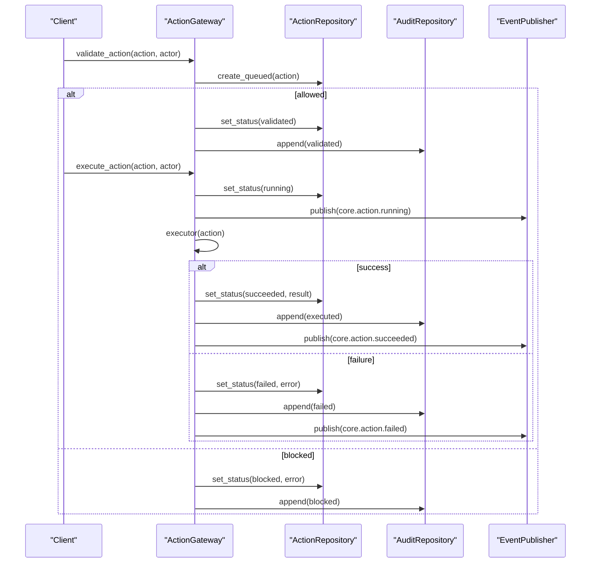

**Diagram sources**
- [core/gateway/service.py:74-233](file://core/gateway/service.py#L74-L233)

**Section sources**
- [core/gateway/service.py:31-239](file://core/gateway/service.py#L31-L239)

## Dependency Analysis
- Coupling: AppContainer centralizes construction and wiring, reducing cross-module coupling. Services depend on abstractions (repositories, buses, storages) rather than concrete implementations.
- Cohesion: Each module encapsulates a bounded responsibility (bus, events, plugins, storage, health, gateway).
- External dependencies: AMQP via aio-pika, FastAPI, SQLAlchemy async, Pydantic settings, httpx for HTTP checks, and asyncio for concurrency.

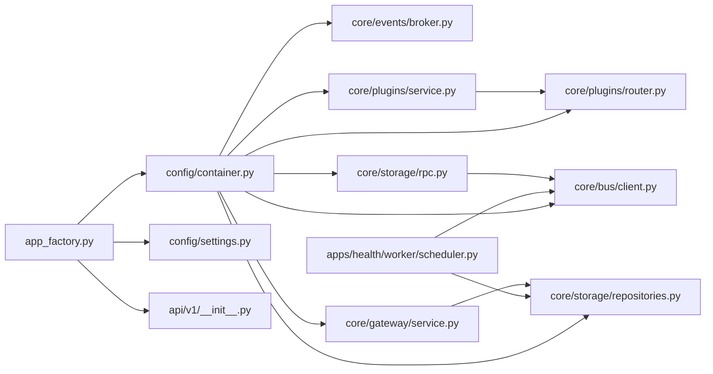

**Diagram sources**
- [app_factory.py:8-124](file://app_factory.py#L8-L124)
- [config/container.py:1-427](file://config/container.py#L1-L427)
- [core/plugins/service.py:18-299](file://core/plugins/service.py#L18-L299)
- [core/plugins/router.py:16-448](file://core/plugins/router.py#L16-L448)
- [core/gateway/service.py:31-239](file://core/gateway/service.py#L31-L239)
- [core/storage/rpc.py:65-500](file://core/storage/rpc.py#L65-L500)
- [apps/health/worker/scheduler.py:19-201](file://apps/health/worker/scheduler.py#L19-L201)

**Section sources**
- [config/container.py:1-427](file://config/container.py#L1-L427)
- [core/plugins/service.py:18-299](file://core/plugins/service.py#L18-L299)
- [core/plugins/router.py:16-448](file://core/plugins/router.py#L16-L448)
- [core/gateway/service.py:31-239](file://core/gateway/service.py#L31-L239)
- [core/storage/rpc.py:65-500](file://core/storage/rpc.py#L65-L500)
- [apps/health/worker/scheduler.py:19-201](file://apps/health/worker/scheduler.py#L19-L201)

## Performance Considerations
- Concurrency: Asynchronous I/O is used across bus, HTTP checks, and storage operations to maximize throughput under load.
- QoS and prefetch: BusClient sets QoS prefetch count to balance throughput and fairness.
- Memory vs. AMQP: Memory-mode bus supports local development and testing without external brokers.
- RPC timeouts: Storage RPC clients enforce timeouts to prevent stalls.
- Health scheduling: Scheduler batches emissions and prunes old samples to keep work proportional to enabled services.
- Plugin watcher: Poll-based runtime refresh avoids heavy filesystem watchers while keeping responsiveness.

[No sources needed since this section provides general guidance]

## Troubleshooting Guide
- Bus connectivity: Verify broker_url and prefetch settings; memory-mode can be used for local testing.
- Schema compatibility: ensure runtime schema compatibility is applied during startup.
- Plugin failures: Review plugin watch loop logs and registry sync summaries; hooks are invoked with exception logging.
- Action execution: Inspect audit events and action status transitions; blocked vs. failed outcomes indicate validation vs. execution issues.
- Storage RPC: Confirm capabilities per plugin and timeouts; check RPC queue subscriptions and replies.

**Section sources**
- [config/container.py:105-174](file://config/container.py#L105-L174)
- [core/plugins/service.py:285-296](file://core/plugins/service.py#L285-L296)
- [core/gateway/service.py:74-233](file://core/gateway/service.py#L74-L233)
- [core/storage/rpc.py:258-286](file://core/storage/rpc.py#L258-L286)

## Conclusion
The Oko Dashboard backend employs a clean layered architecture with a strong dependency injection container, robust event-driven messaging, dynamic plugin orchestration, and a repository-based persistence layer. The application factory and bootstrap process provide a predictable runtime initialization, while the container’s lifecycle ensures proper startup and shutdown of all subsystems. The system balances modularity, scalability, and maintainability through well-defined boundaries, asynchronous processing, and pragmatic trade-offs such as memory-mode bus for development and polling-based plugin watching.