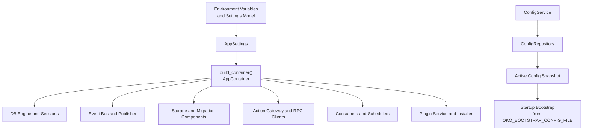
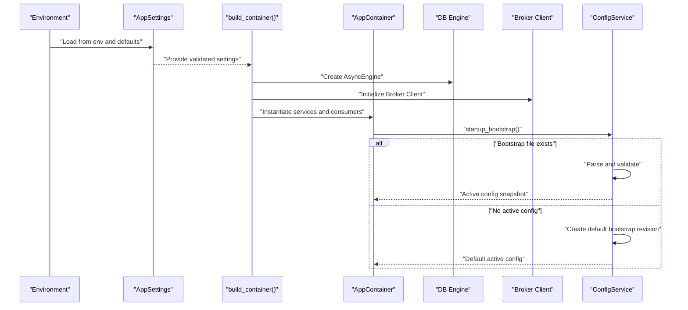
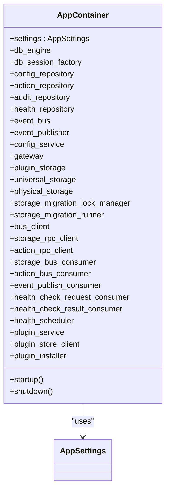
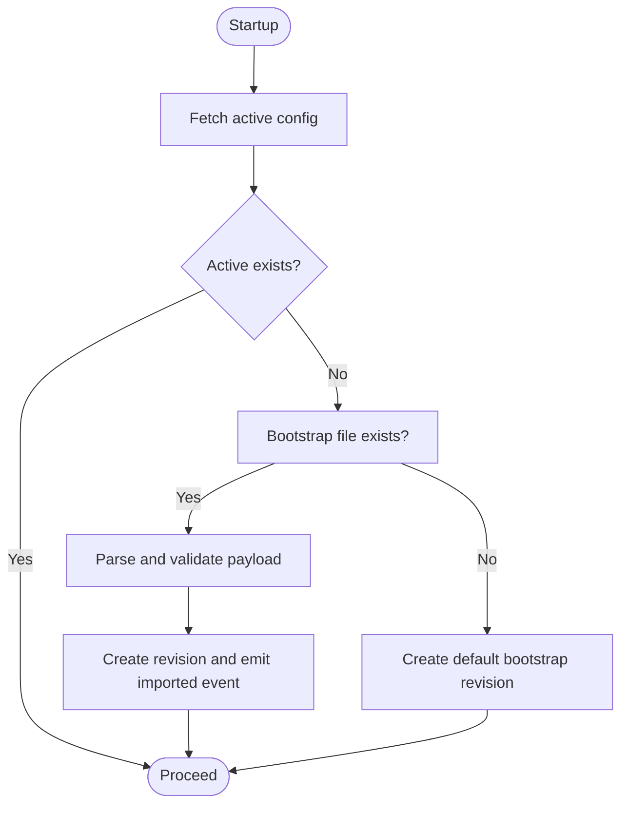
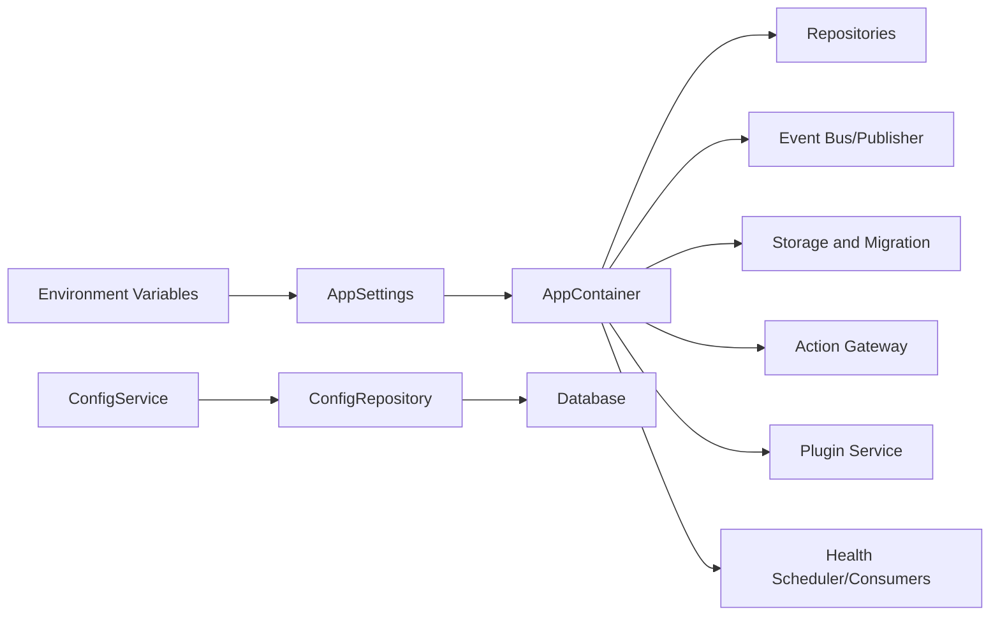

# Configuration and Settings

<cite>
**Referenced Files in This Document**
- [settings.py](file://config/settings.py)
- [container.py](file://config/container.py)
- [bootstrap.py](file://bootstrap.py)
- [app_factory.py](file://app_factory.py)
- [main.py](file://main.py)
- [logging_setup.py](file://core/logging_setup.py)
- [service.py](file://core/config/service.py)
- [models.py](file://core/contracts/models.py)
- [tables.yaml](file://contracts/storage/tables.yaml)
- [schemas.py](file://core/plugins/schemas.py)
- [page_manifest.yaml](file://plugins/autodiscover/page_manifest.yaml)
</cite>

## Table of Contents
1. [Introduction](#introduction)
2. [Project Structure](#project-structure)
3. [Core Components](#core-components)
4. [Architecture Overview](#architecture-overview)
5. [Detailed Component Analysis](#detailed-component-analysis)
6. [Dependency Analysis](#dependency-analysis)
7. [Performance Considerations](#performance-considerations)
8. [Troubleshooting Guide](#troubleshooting-guide)
9. [Conclusion](#conclusion)
10. [Appendices](#appendices)

## Introduction
This document explains how the Oko Dashboard backend discovers, validates, and applies configuration at runtime. It covers environment variables, configuration file formats, dependency injection via a container, and service registration. It also documents categories of application settings (database, message broker, plugin storage, health monitoring, events, RPC timeouts, favicon handling, and logging), plus validation rules, defaults, and override mechanisms. Practical deployment scenarios, environment-specific configurations, and production best practices are included.

## Project Structure
Configuration is centered around three pillars:
- Settings model and environment variable mapping
- A dependency injection container that wires services and consumers
- A configuration service that loads and validates the active configuration, optionally bootstrapping from a file

**Diagram sources**
- [settings.py:14-124](file://config/settings.py#L14-L124)
- [container.py:252-423](file://config/container.py#L252-L423)
- [service.py:23-54](file://core/config/service.py#L23-L54)

**Section sources**
- [settings.py:14-124](file://config/settings.py#L14-L124)
- [container.py:252-423](file://config/container.py#L252-L423)
- [bootstrap.py:16-23](file://bootstrap.py#L16-L23)
- [app_factory.py:87-123](file://app_factory.py#L87-L123)
- [main.py:7-21](file://main.py#L7-L21)

## Core Components
- AppSettings: Defines all runtime settings, including defaults, aliases, and validation constraints. It supports environment variable overrides and post-validation normalization.
- AppContainer: Builds and wires all services, repositories, RPC clients, consumers, schedulers, and plugin subsystems based on AppSettings.
- ConfigService: Manages configuration state, imports, validation, patching, rollback, and emits events on changes. It can bootstrap from a file during startup.
- Logging configuration: Centralized logging setup with environment-driven level and colorization.

**Section sources**
- [settings.py:14-124](file://config/settings.py#L14-L124)
- [container.py:50-174](file://config/container.py#L50-L174)
- [service.py:23-204](file://core/config/service.py#L23-L204)
- [logging_setup.py:141-185](file://core/logging_setup.py#L141-L185)

## Architecture Overview
The configuration pipeline starts from environment variables and files, constructs AppSettings, then builds AppContainer to initialize all services. The configuration service ensures a valid active configuration exists at startup, optionally importing from a bootstrap file.

**Diagram sources**
- [settings.py:121-124](file://config/settings.py#L121-L124)
- [container.py:252-423](file://config/container.py#L252-L423)
- [service.py:35-54](file://core/config/service.py#L35-L54)

## Detailed Component Analysis

### Environment Variables and Settings Model
AppSettings centralizes configuration discovery and validation. It defines:
- Paths and files (base_dir, static_dir, media_dir, index_file, OKO_BOOTSTRAP_CONFIG_FILE)
- Database and broker URLs
- Runtime role and consumer behavior toggles
- Prefetch count and event streaming parameters
- RPC timeouts for storage and actions
- Health monitoring windows, retention, intervals, timeouts, and thresholds
- Favicon behavior (timeout, size limits, TLS verification, cache TTL)
- Plugin store URL and watch poll interval
- Validation constraints and minimums enforced via a post-validator

Key behaviors:
- Aliases map environment variables to fields (for example, DATABASE_URL, BROKER_URL, OKO_BOOTSTRAP_CONFIG_FILE).
- Defaults are provided for most fields.
- Post-validation normalizes lower bounds and sane ranges.
- The loader supports overriding base_dir to locate resources.

**Section sources**
- [settings.py:14-124](file://config/settings.py#L14-L124)

### Dependency Injection Container Pattern
AppContainer encapsulates all runtime dependencies and orchestrates startup/shutdown:
- Creates AsyncEngine and session factory from database_url
- Initializes repositories, event bus, publisher, and RPC clients
- Wires storage modes (universal vs physical) and migration components
- Starts consumers and schedulers depending on runtime_role and broker type
- Optionally starts plugin watcher and plugin store installer when store_url is configured

Startup logic branches on runtime_role and whether local consumers are enabled or the broker is memory-based.

**Diagram sources**
- [container.py:50-174](file://config/container.py#L50-L174)
- [settings.py:14-124](file://config/settings.py#L14-L124)

**Section sources**
- [container.py:50-174](file://config/container.py#L50-L174)
- [container.py:252-423](file://config/container.py#L252-L423)

### Configuration Management and Bootstrapping
ConfigService manages configuration state:
- On startup, it checks for an active snapshot; if absent, it either imports from the bootstrap file or creates a default bootstrap revision
- Supports import, validate, patch, and rollback operations
- Validates payload structure and supported formats (yaml, json, toml)
- Emits events on import, patch, and rollback

**Diagram sources**
- [service.py:35-54](file://core/config/service.py#L35-L54)
- [service.py:72-81](file://core/config/service.py#L72-L81)
- [service.py:100-111](file://core/config/service.py#L100-L111)
- [service.py:113-126](file://core/config/service.py#L113-L126)

**Section sources**
- [service.py:23-204](file://core/config/service.py#L23-L204)
- [models.py:10-52](file://core/contracts/models.py#L10-L52)

### Logging Configuration
Logging is configured centrally with environment-driven controls:
- Level resolution from OKO_LOG_LEVEL
- Colorization controlled by OKO_LOG_COLOR with TTY detection fallback
- SQL noise filtered for SQLAlchemy loggers
- Logger name width computed dynamically for aligned output

**Section sources**
- [logging_setup.py:141-185](file://core/logging_setup.py#L141-L185)

### Application Settings Categories

#### Database Connections
- Field: database_url
- Default: a PostgreSQL connection string suitable for local development
- Overrides: DATABASE_URL environment variable
- Behavior: used to build an async engine and session factory

**Section sources**
- [settings.py:32-35](file://config/settings.py#L32-L35)
- [container.py:254-260](file://config/container.py#L254-L260)

#### Message Broker Configuration
- Fields: broker_url, broker_prefetch_count, runtime_role, enable_local_consumers
- Defaults: AMQP URL and prefetch count; role is backend by default
- Overrides: BROKER_URL, OKO_BROKER_PREFETCH_COUNT, OKO_RUNTIME_ROLE, OKO_ENABLE_LOCAL_CONSUMERS
- Behavior: determines whether consumers run locally or rely on remote broker; memory broker toggles local consumption

**Section sources**
- [settings.py:36-47](file://config/settings.py#L36-L47)
- [container.py:111-145](file://config/container.py#L111-L145)

#### Plugin Settings
- Fields: OKO_STORE_URL, OKO_PLUGIN_WATCH_POLL_SEC
- Behavior: enables plugin store client and installer when store URL is present; starts a periodic watcher loop in backend role

**Section sources**
- [settings.py:83-93](file://config/settings.py#L83-L93)
- [container.py:383-393](file://config/container.py#L383-L393)
- [container.py:82-94](file://config/container.py#L82-L94)

#### Storage and Plugin Storage Configuration
- Storage DDL is loaded from contracts/storage/tables.yaml
- Default plugin storage configs are derived from DDL specs with limits and table specs
- Capabilities are granted per plugin for storage operations

**Section sources**
- [container.py:176-221](file://config/container.py#L176-L221)
- [tables.yaml:1-85](file://contracts/storage/tables.yaml#L1-L85)

#### Health Monitoring Settings
- Fields: health_window_size, health_retention_days, health_icmp_enabled, health_scheduler_tick_sec, health_scheduler_heartbeat_sec, health_default_interval_sec, health_default_timeout_ms, health_default_latency_threshold_ms
- Overrides: OKO_HEALTH_* environment variables
- Behavior: used by HealthScheduler and related consumers

**Section sources**
- [settings.py:59-77](file://config/settings.py#L59-L77)
- [container.py:354-365](file://config/container.py#L354-L365)

#### Events and Streaming
- Fields: event_stream_keepalive_sec, event_stream_retry_ms
- Overrides: OKO_EVENTS_KEEPALIVE_SEC, OKO_EVENTS_RETRY_MS
- Behavior: controls SSE keepalive and retry timing

**Section sources**
- [settings.py:54-56](file://config/settings.py#L54-L56)
- [container.py:339-342](file://config/container.py#L339-L342)

#### RPC Timeouts
- Fields: storage_rpc_timeout_sec, action_rpc_timeout_sec
- Overrides: OKO_STORAGE_RPC_TIMEOUT_SEC, OKO_ACTION_RPC_TIMEOUT_SEC
- Behavior: applied to BrokerStorageRPC and BrokerActionRPC clients

**Section sources**
- [settings.py:57-58](file://config/settings.py#L57-L58)
- [container.py:299-306](file://config/container.py#L299-L306)

#### Favicon Handling
- Fields: favicon_timeout_sec, favicon_max_bytes, favicon_tls_verify, favicon_tls_insecure_fallback, favicon_cache_ttl_days
- Overrides: OKO_FAVICON_* environment variables
- Behavior: affects favicon fetching and caching policies

**Section sources**
- [settings.py:75-82](file://config/settings.py#L75-L82)
- [container.py:343-344](file://config/container.py#L343-L344)

#### Actions Execution
- Field: actions_execute_enabled
- Override: OKO_ACTIONS_EXECUTE_ENABLED
- Behavior: controls whether action execution is permitted via the ActionGateway

**Section sources**
- [settings.py:56](file://config/settings.py#L56)
- [container.py:313-318](file://config/container.py#L313-L318)

#### Logging Configuration
- Environment variables: OKO_LOG_LEVEL, OKO_LOG_COLOR
- Behavior: sets root and child loggers, ANSI colorization, and SQL noise filtering

**Section sources**
- [logging_setup.py:141-185](file://core/logging_setup.py#L141-L185)

### Configuration Validation, Defaults, and Overrides
- Validation: Pydantic Field constraints (min/max, enums, types) and model_validator enforce sane defaults and ranges
- Overrides: validation_alias maps environment variables to fields
- Normalization: model_validator enforces minimums after validation

**Section sources**
- [settings.py:95-118](file://config/settings.py#L95-L118)

### Deployment Scenarios and Environment-Specific Configurations
- Local development
  - Use default DATABASE_URL and BROKER_URL pointing to local services
  - Keep OKO_RUNTIME_ROLE=backend and OKO_ENABLE_LOCAL_CONSUMERS=true for local consumption
  - Set OKO_BOOTSTRAP_CONFIG_FILE to a YAML file for initial configuration
- Worker-only deployment
  - Set OKO_RUNTIME_ROLE=worker
  - Ensure broker_url points to a shared broker; local consumers are disabled
- Memory broker
  - Use a memory:// broker URL; local consumers are automatically enabled when role is backend
- Plugin store integration
  - Set OKO_STORE_URL to enable plugin store client and installer
  - Adjust OKO_PLUGIN_WATCH_POLL_SEC for watcher frequency
- Logging
  - Set OKO_LOG_LEVEL to control verbosity
  - Set OKO_LOG_COLOR to enable/disable colorization

**Section sources**
- [container.py:111-145](file://config/container.py#L111-L145)
- [settings.py:32-47](file://config/settings.py#L32-L47)
- [settings.py:83-93](file://config/settings.py#L83-L93)
- [logging_setup.py:148-166](file://core/logging_setup.py#L148-L166)

### Security-Related Settings
- TLS verification for favicon fetching is configurable via OKO_FAVICON_TLS_VERIFY and OKO_FAVICON_TLS_INSECURE_FALLBACK
- Database credentials are supplied via DATABASE_URL; avoid embedding secrets in code
- Broker credentials are supplied via BROKER_URL; ensure secure transport in production

**Section sources**
- [settings.py:77-81](file://config/settings.py#L77-L81)
- [settings.py:32-39](file://config/settings.py#L32-L39)

### Configuration File Formats and Examples
- Supported formats: YAML, JSON, TOML
- Validation requires a top-level object with required keys (for example, version and app)
- Example bootstrap file location: OKO_BOOTSTRAP_CONFIG_FILE path

**Section sources**
- [service.py:157-174](file://core/config/service.py#L157-L174)
- [models.py:10-18](file://core/contracts/models.py#L10-L18)
- [settings.py:28-31](file://config/settings.py#L28-L31)

### Plugin Manifests and UI Integration
- Plugin manifests define capabilities, UI pages, and widget registries
- UI configuration includes page routing, menu grouping, and permissions

**Section sources**
- [page_manifest.yaml:1-93](file://plugins/autodiscover/page_manifest.yaml#L1-L93)
- [schemas.py:25-77](file://core/plugins/schemas.py#L25-L77)

## Dependency Analysis
The configuration system exhibits a clean separation of concerns:
- Settings model decouples environment parsing from application logic
- Container composes services and enforces startup/shutdown ordering
- ConfigService encapsulates state and validation
- Logging is centralized and environment-driven

**Diagram sources**
- [settings.py:14-124](file://config/settings.py#L14-L124)
- [container.py:252-423](file://config/container.py#L252-L423)
- [service.py:23-54](file://core/config/service.py#L23-L54)

**Section sources**
- [settings.py:14-124](file://config/settings.py#L14-L124)
- [container.py:252-423](file://config/container.py#L252-L423)
- [service.py:23-54](file://core/config/service.py#L23-L54)

## Performance Considerations
- Tune broker_prefetch_count for throughput under load
- Adjust health_scheduler_tick_sec and heartbeat_sec to balance responsiveness and overhead
- Control RPC timeouts to prevent long-blocking operations
- Limit favicon cache TTL and size to reduce resource usage
- Use memory broker only for lightweight local setups; prefer durable brokers for production

## Troubleshooting Guide
- Configuration import fails
  - Verify format (yaml/json/toml) and payload structure
  - Check for missing required fields (for example, version and app)
- Startup hangs or consumers not running
  - Confirm OKO_RUNTIME_ROLE and OKO_ENABLE_LOCAL_CONSUMERS
  - For memory broker, ensure backend role is selected
- Plugin watcher not starting
  - Ensure OKO_PLUGIN_WATCH_POLL_SEC is within allowed range
  - Confirm plugin service is enabled and base_dir contains plugins
- Logging appears too noisy or not colored
  - Adjust OKO_LOG_LEVEL and OKO_LOG_COLOR
  - Ensure stdout is a TTY for colorization

**Section sources**
- [service.py:83-98](file://core/config/service.py#L83-L98)
- [container.py:111-145](file://config/container.py#L111-L145)
- [logging_setup.py:148-166](file://core/logging_setup.py#L148-L166)

## Conclusion
The Oko Dashboard backend uses a robust configuration system built on validated settings, a dependency injection container, and a dedicated configuration service. By leveraging environment variables, sensible defaults, and strict validation, it supports flexible deployment scenarios while maintaining operational safety and clarity.

## Appendices

### Environment Variables Reference
- DATABASE_URL: Database connection string
- BROKER_URL: Message broker connection string
- OKO_RUNTIME_ROLE: "backend" or "worker"
- OKO_ENABLE_LOCAL_CONSUMERS: Enable local consumers when backend and memory broker or explicit flag
- OKO_BROKER_PREFETCH_COUNT: Consumer prefetch limit
- OKO_EVENTS_KEEPALIVE_SEC: SSE keepalive seconds
- OKO_EVENTS_RETRY_MS: SSE retry milliseconds
- OKO_ACTIONS_EXECUTE_ENABLED: Allow action execution
- OKO_STORAGE_RPC_TIMEOUT_SEC: Storage RPC timeout
- OKO_ACTION_RPC_TIMEOUT_SEC: Action RPC timeout
- OKO_HEALTH_WINDOW_SIZE: Health rolling window size
- OKO_HEALTH_RETENTION_DAYS: Health retention days
- OKO_HEALTH_ICMP_ENABLED: Enable ICMP checks
- OKO_HEALTH_SCHEDULER_TICK_SEC: Scheduler tick seconds
- OKO_HEALTH_SCHEDULER_HEARTBEAT_SEC: Scheduler heartbeat seconds
- OKO_HEALTH_INTERVAL_SEC: Default health check interval
- OKO_HEALTH_TIMEOUT_MS: Default health check timeout
- OKO_HEALTH_LATENCY_THRESHOLD_MS: Default latency threshold
- OKO_FAVICON_TIMEOUT_SEC: Favicon fetch timeout
- OKO_FAVICON_MAX_BYTES: Max favicon bytes
- OKO_FAVICON_TLS_VERIFY: Verify TLS for favicon
- OKO_FAVICON_TLS_INSECURE_FALLBACK: TLS insecure fallback
- OKO_FAVICON_CACHE_TTL_DAYS: Favicon cache TTL
- OKO_STORE_URL: Plugin store URL
- OKO_PLUGIN_WATCH_POLL_SEC: Plugin watcher poll seconds
- OKO_BOOTSTRAP_CONFIG_FILE: Path to bootstrap YAML/TOML/JSON
- OKO_MEDIA_DIR: Media directory path
- OKO_LOG_LEVEL: Logging level
- OKO_LOG_COLOR: Enable/disable colorized logs

**Section sources**
- [settings.py:28-93](file://config/settings.py#L28-L93)
- [logging_setup.py:148-166](file://core/logging_setup.py#L148-L166)