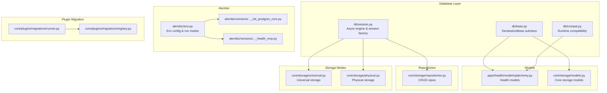
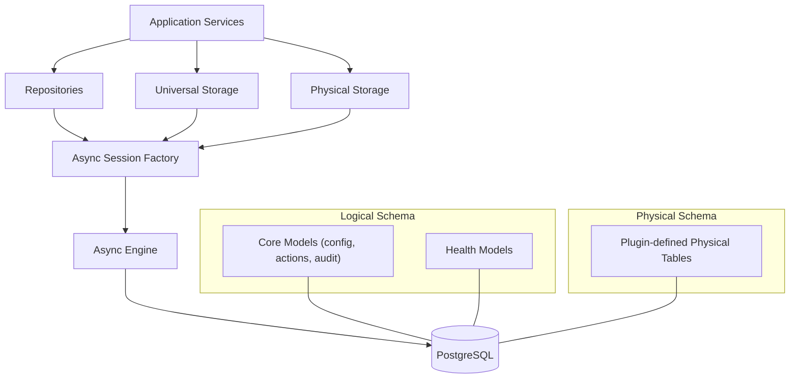
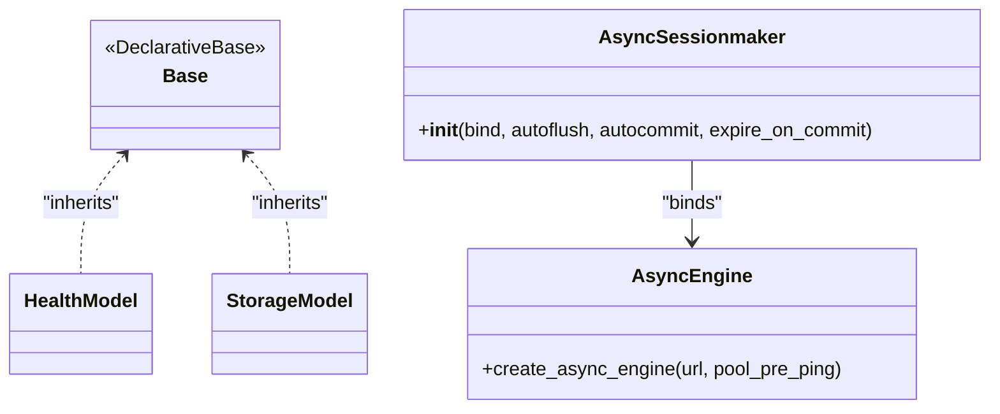
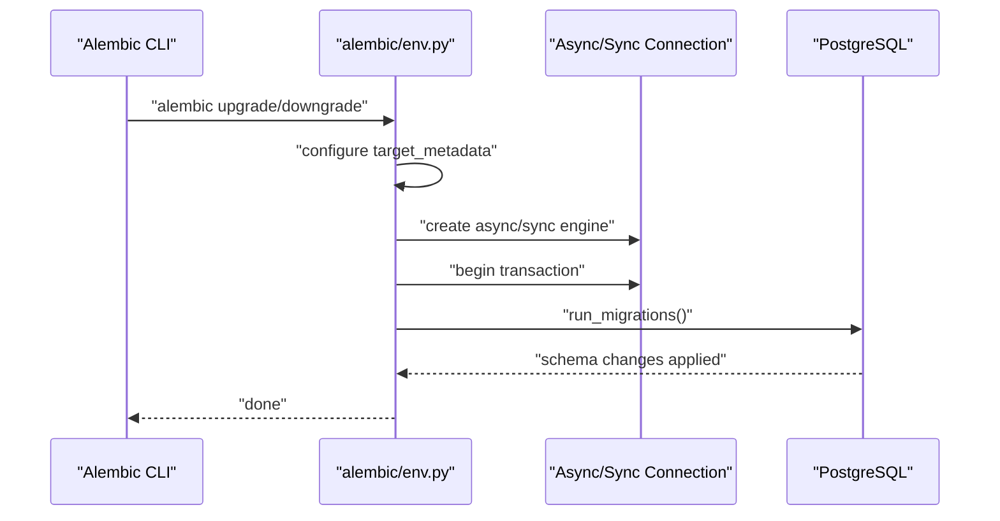
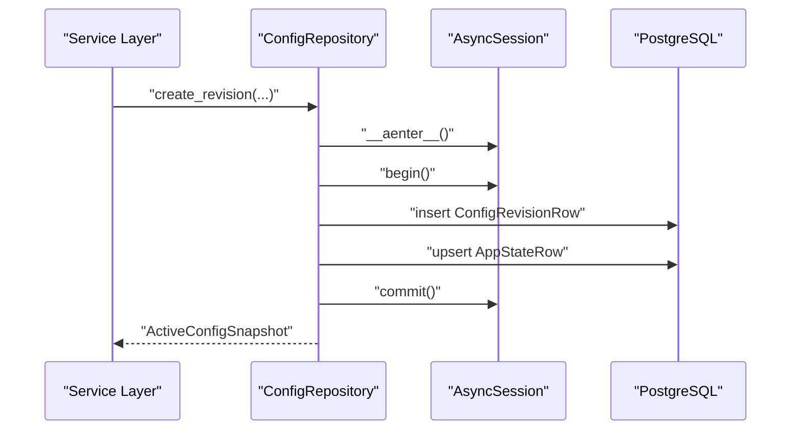
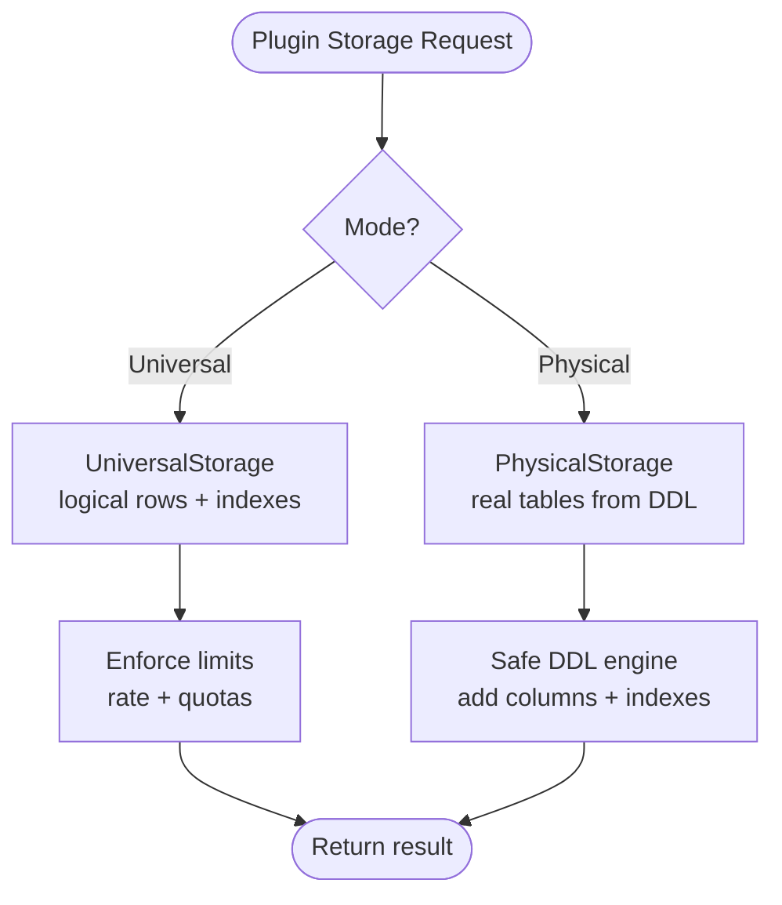
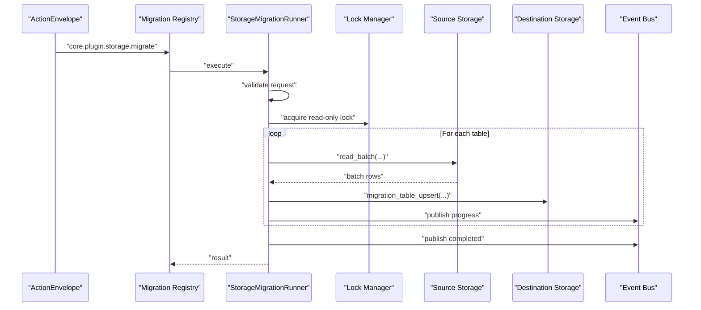
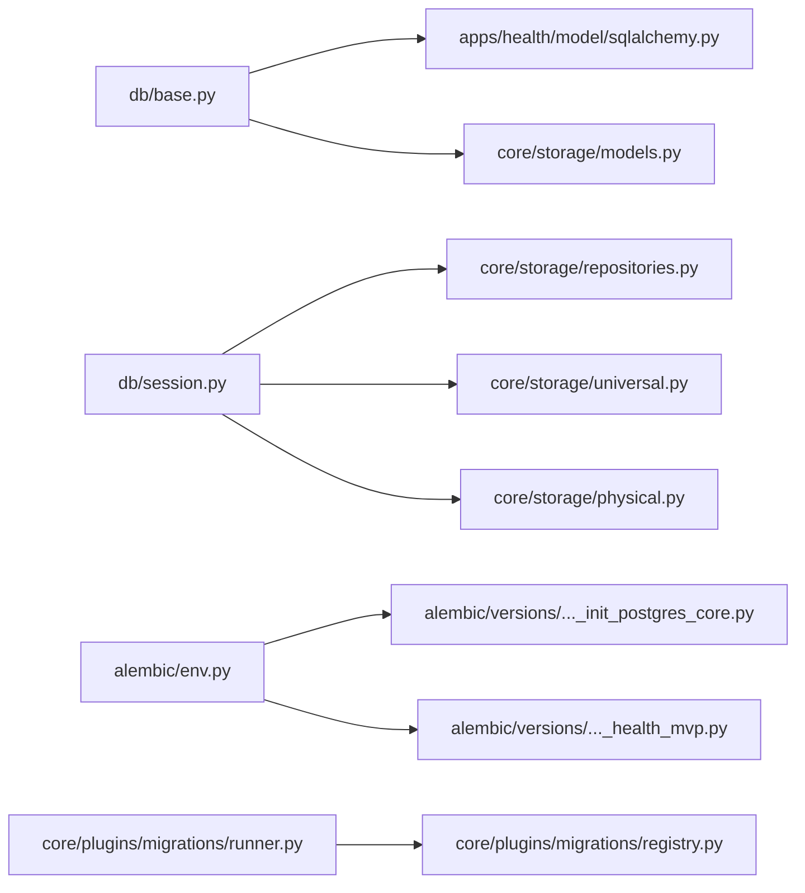

# Database Layer

<cite>
**Referenced Files in This Document**
- [db/base.py](file://db/base.py)
- [db/session.py](file://db/session.py)
- [db/compat.py](file://db/compat.py)
- [alembic/env.py](file://alembic/env.py)
- [alembic/versions/20260223_0001_init_postgres_core.py](file://alembic/versions/20260223_0001_init_postgres_core.py)
- [alembic/versions/20260223_0002_health_mvp.py](file://alembic/versions/20260223_0002_health_mvp.py)
- [apps/health/model/sqlalchemy.py](file://apps/health/model/sqlalchemy.py)
- [core/storage/models.py](file://core/storage/models.py)
- [core/storage/repositories.py](file://core/storage/repositories.py)
- [core/storage/physical.py](file://core/storage/physical.py)
- [core/storage/universal.py](file://core/storage/universal.py)
- [core/plugins/migrations/runner.py](file://core/plugins/migrations/runner.py)
- [core/plugins/migrations/registry.py](file://core/plugins/migrations/registry.py)
- [config/settings.py](file://config/settings.py)
- [bootstrap.py](file://bootstrap.py)
</cite>

## Table of Contents
1. [Introduction](#introduction)
2. [Project Structure](#project-structure)
3. [Core Components](#core-components)
4. [Architecture Overview](#architecture-overview)
5. [Detailed Component Analysis](#detailed-component-analysis)
6. [Dependency Analysis](#dependency-analysis)
7. [Performance Considerations](#performance-considerations)
8. [Troubleshooting Guide](#troubleshooting-guide)
9. [Conclusion](#conclusion)
10. [Appendices](#appendices)

## Introduction
This document explains the database layer and migration system of the backend. It covers SQLAlchemy base configuration, asynchronous session management, database models, Alembic migrations, schema evolution, compatibility management, connection handling, transactions, and performance optimization. Practical examples demonstrate working with models, creating migrations, and managing schema changes. Integrity measures such as constraints, indexing strategies, and data validation are documented alongside operational guidance.

## Project Structure
The database layer is organized around:
- A shared SQLAlchemy declarative base for ORM models
- Asynchronous engine and session factory builders
- Core and feature-specific models
- Alembic configuration and migration scripts
- Repositories implementing CRUD and transactional logic
- Two storage modes (universal and physical) with distinct schemas and constraints
- Migration runners for plugin-defined logical-to-physical schema transitions



**Diagram sources**
- [db/base.py:1-11](file://db/base.py#L1-L11)
- [db/session.py:1-24](file://db/session.py#L1-L24)
- [db/compat.py:1-28](file://db/compat.py#L1-L28)
- [apps/health/model/sqlalchemy.py:1-88](file://apps/health/model/sqlalchemy.py#L1-L88)
- [core/storage/models.py:1-149](file://core/storage/models.py#L1-L149)
- [alembic/env.py:1-80](file://alembic/env.py#L1-L80)
- [alembic/versions/20260223_0001_init_postgres_core.py:1-143](file://alembic/versions/20260223_0001_init_postgres_core.py#L1-L143)
- [alembic/versions/20260223_0002_health_mvp.py:1-82](file://alembic/versions/20260223_0002_health_mvp.py#L1-L82)
- [core/storage/repositories.py:1-304](file://core/storage/repositories.py#L1-L304)
- [core/storage/universal.py:1-500](file://core/storage/universal.py#L1-L500)
- [core/storage/physical.py:1-782](file://core/storage/physical.py#L1-L782)
- [core/plugins/migrations/runner.py:1-382](file://core/plugins/migrations/runner.py#L1-L382)
- [core/plugins/migrations/registry.py:1-50](file://core/plugins/migrations/registry.py#L1-L50)

**Section sources**
- [db/base.py:1-11](file://db/base.py#L1-L11)
- [db/session.py:1-24](file://db/session.py#L1-L24)
- [alembic/env.py:1-80](file://alembic/env.py#L1-L80)

## Core Components
- SQLAlchemy Declarative Base: Central base class for ORM models.
- Async Engine and Session Factory: Build async engines and session factories with connection pooling and pre-ping.
- Models: Core and feature-specific ORM models with explicit constraints and indexes.
- Repositories: Transactional repositories for core domain entities.
- Storage Modes: Universal (logical) and Physical (plugin-defined DDL) storage modes with separate schemas and constraints.
- Alembic: Environment-driven migrations supporting offline and online modes, including async drivers.
- Runtime Compatibility: Schema alignment for legacy environments.

**Section sources**
- [db/base.py:6-7](file://db/base.py#L6-L7)
- [db/session.py:6-20](file://db/session.py#L6-L20)
- [apps/health/model/sqlalchemy.py:23-87](file://apps/health/model/sqlalchemy.py#L23-L87)
- [core/storage/models.py:14-148](file://core/storage/models.py#L14-L148)
- [core/storage/repositories.py:55-193](file://core/storage/repositories.py#L55-L193)
- [core/storage/universal.py:85-499](file://core/storage/universal.py#L85-L499)
- [core/storage/physical.py:288-781](file://core/storage/physical.py#L288-L781)
- [alembic/env.py:26-79](file://alembic/env.py#L26-L79)
- [db/compat.py:7-25](file://db/compat.py#L7-L25)

## Architecture Overview
The database architecture combines:
- Shared ORM models under a single base
- Async SQLAlchemy sessions for all persistence operations
- Two complementary storage modes:
  - Universal: logical tables with indexes stored in dedicated rows
  - Physical: plugin-provided DDL translated into real PostgreSQL tables
- Alembic managing schema evolution for both logical and physical schemas
- Repositories encapsulating transaction boundaries and business queries



**Diagram sources**
- [core/storage/repositories.py:55-193](file://core/storage/repositories.py#L55-L193)
- [core/storage/universal.py:85-499](file://core/storage/universal.py#L85-L499)
- [core/storage/physical.py:288-781](file://core/storage/physical.py#L288-L781)
- [db/session.py:6-20](file://db/session.py#L6-L20)

## Detailed Component Analysis

### SQLAlchemy Base and Session Management
- Base class extends DeclarativeBase to unify model definition across modules.
- Async engine creation enables connection pre-ping for robustness.
- Session factory is configured with autoflush, autocommit disabled, and expiration off to reduce overhead and avoid unexpected flush semantics.



**Diagram sources**
- [db/base.py:6-7](file://db/base.py#L6-L7)
- [db/session.py:6-20](file://db/session.py#L6-L20)
- [apps/health/model/sqlalchemy.py:5](file://apps/health/model/sqlalchemy.py#L5)
- [core/storage/models.py:5](file://core/storage/models.py#L5)

**Section sources**
- [db/base.py:6-7](file://db/base.py#L6-L7)
- [db/session.py:6-20](file://db/session.py#L6-L20)

### Database Models and Constraints
- Core models define logical storage for configuration, actions, audit logs, and plugin key-value/indexed rows with explicit indexes and constraints.
- Health models define monitoring entities with foreign keys, indexes, and defaults.
- Both sets inherit from the shared Base and are included in Alembic metadata for schema synchronization.

```mermaid
erDiagram
CONFIG_REVISIONS {
int id PK
int revision UK
int parent_revision
text payload_json
varchar payload_sha256
varchar source
timestamptz created_at
varchar created_by
}
APP_STATE {
int id PK
int active_revision FK
int state_seq
timestamptz updated_at
varchar updated_by
varchar reason
}
ACTIONS {
varchar id PK
varchar type
varchar capability
varchar requested_by
timestamptz requested_at
varchar status
text payload_json
boolean dry_run
text result_json
text error_json
varchar idempotency_key
varchar trace_id
timestamptz created_at
timestamptz started_at
timestamptz finished_at
}
AUDIT_LOG {
int id PK
timestamptz ts
varchar actor
varchar action_id
varchar capability
varchar resource
varchar decision
varchar outcome
varchar reason
text metadata_json
timestamptz created_at
}
PLUGIN_KV {
varchar plugin_id
varchar key
text value
boolean is_secret
timestamptz updated_at
int value_bytes
PK (plugin_id, key)
}
PLUGIN_ROWS {
varchar plugin_id
varchar table
varchar pk
text row_json
timestamptz updated_at
int row_bytes
PK (plugin_id, table, pk)
}
PLUGIN_INDEXES {
varchar plugin_id
varchar table
varchar index_name
varchar index_value
varchar pk
timestamptz updated_at
PK (plugin_id, table, index_name, pk)
}
MONITORED_SERVICE {
varchar id PK
varchar item_id UK
varchar name
varchar check_type
varchar target
int interval_sec
int timeout_ms
int latency_threshold_ms
boolean enabled
timestamptz created_at
timestamptz updated_at
}
HEALTH_SAMPLE {
int id PK
varchar service_id FK
timestamptz ts
boolean success
int latency_ms
text error_message
}
SERVICE_HEALTH_STATE {
varchar service_id PK
varchar current_status
timestamptz last_change_ts
float avg_latency
float success_rate
int consecutive_failures
timestamptz updated_at
}
APP_STATE }o--|| CONFIG_REVISIONS : "references revision"
HEALTH_SAMPLE }o--|| MONITORED_SERVICE : "foreign key"
```

**Diagram sources**
- [core/storage/models.py:14-148](file://core/storage/models.py#L14-L148)
- [apps/health/model/sqlalchemy.py:23-87](file://apps/health/model/sqlalchemy.py#L23-L87)

**Section sources**
- [core/storage/models.py:14-148](file://core/storage/models.py#L14-L148)
- [apps/health/model/sqlalchemy.py:23-87](file://apps/health/model/sqlalchemy.py#L23-L87)

### Alembic Migration System and Schema Evolution
- Alembic environment loads target metadata from the shared Base and supports offline and online modes.
- Online mode detects async dialects and runs migrations asynchronously.
- Initial migrations establish core logical tables and indexes, followed by health monitoring tables.
- Downgrades remove indexes and tables in reverse dependency order.



**Diagram sources**
- [alembic/env.py:26-79](file://alembic/env.py#L26-L79)

**Section sources**
- [alembic/env.py:19-79](file://alembic/env.py#L19-L79)
- [alembic/versions/20260223_0001_init_postgres_core.py:15-143](file://alembic/versions/20260223_0001_init_postgres_core.py#L15-L143)
- [alembic/versions/20260223_0002_health_mvp.py:15-82](file://alembic/versions/20260223_0002_health_mvp.py#L15-L82)

### Transaction Management and Repository Patterns
- Repositories encapsulate unit-of-work boundaries using session.begin() for atomic operations.
- Examples include creating revisions, upserting actions, and appending audit events.
- Transactions ensure referential integrity and consistent state transitions.



**Diagram sources**
- [core/storage/repositories.py:98-141](file://core/storage/repositories.py#L98-L141)

**Section sources**
- [core/storage/repositories.py:55-193](file://core/storage/repositories.py#L55-L193)

### Universal vs Physical Storage Modes
- Universal storage:
  - Uses logical tables (plugin_kv, plugin_rows, plugin_indexes) to store plugin data.
  - Enforces limits via rate limiting and row/table quotas.
  - Provides indexed lookups via auxiliary index rows.
- Physical storage:
  - Translates plugin DDL specs into real PostgreSQL tables with strict DDL rules.
  - Supports safe upgrades by adding columns and creating missing indexes.
  - Enforces destructive DDL changes (e.g., dropping columns) as disallowed.



**Diagram sources**
- [core/storage/universal.py:85-499](file://core/storage/universal.py#L85-L499)
- [core/storage/physical.py:288-781](file://core/storage/physical.py#L288-L781)

**Section sources**
- [core/storage/universal.py:85-499](file://core/storage/universal.py#L85-L499)
- [core/storage/physical.py:126-286](file://core/storage/physical.py#L126-L286)

### Plugin Logical-to-Physical Migration Runner
- Validates migration requests against plugin configuration and current modes.
- Executes read-only lock strategy to copy rows in batches and switch tables atomically.
- Emits progress and completion events for observability.



**Diagram sources**
- [core/plugins/migrations/registry.py:15-42](file://core/plugins/migrations/registry.py#L15-L42)
- [core/plugins/migrations/runner.py:58-146](file://core/plugins/migrations/runner.py#L58-L146)

**Section sources**
- [core/plugins/migrations/registry.py:15-42](file://core/plugins/migrations/registry.py#L15-L42)
- [core/plugins/migrations/runner.py:58-274](file://core/plugins/migrations/runner.py#L58-L274)

### Runtime Schema Compatibility
- Ensures backward-compatible schema alignment for health monitoring tables in PostgreSQL, including unique constraints and default values.

**Section sources**
- [db/compat.py:7-25](file://db/compat.py#L7-L25)

## Dependency Analysis
- Models depend on the shared Base and SQLAlchemy constructs.
- Repositories depend on AsyncSession and model classes.
- Storage modes depend on AsyncSession and plugin configurations.
- Alembic depends on environment configuration and model metadata.
- Migration runner depends on storage routers and lock managers.



**Diagram sources**
- [db/base.py:6-7](file://db/base.py#L6-L7)
- [apps/health/model/sqlalchemy.py:5](file://apps/health/model/sqlalchemy.py#L5)
- [core/storage/models.py:5](file://core/storage/models.py#L5)
- [db/session.py:6-20](file://db/session.py#L6-L20)
- [core/storage/repositories.py:55-193](file://core/storage/repositories.py#L55-L193)
- [core/storage/universal.py:85-499](file://core/storage/universal.py#L85-L499)
- [core/storage/physical.py:288-781](file://core/storage/physical.py#L288-L781)
- [alembic/env.py:23](file://alembic/env.py#L23)
- [alembic/versions/20260223_0001_init_postgres_core.py:15](file://alembic/versions/20260223_0001_init_postgres_core.py#L15)
- [alembic/versions/20260223_0002_health_mvp.py:15](file://alembic/versions/20260223_0002_health_mvp.py#L15)
- [core/plugins/migrations/runner.py:42-56](file://core/plugins/migrations/runner.py#L42-L56)
- [core/plugins/migrations/registry.py:15-42](file://core/plugins/migrations/registry.py#L15-L42)

**Section sources**
- [alembic/env.py:23](file://alembic/env.py#L23)
- [core/plugins/migrations/runner.py:42-56](file://core/plugins/migrations/runner.py#L42-L56)

## Performance Considerations
- Asynchronous I/O: Use async engines and sessions to minimize blocking and improve concurrency.
- Connection pooling: Enable pre-ping to detect dead connections and maintain reliability.
- Indexing: Leverage composite indexes for frequent filters (e.g., service status, timestamps).
- Batch operations: Copy rows in batches to reduce memory pressure and lock contention.
- Rate limiting: Enforce QPS caps per plugin to prevent hot-spotting.
- Query limits: Clamp query sizes to protect resources.
- Expunge/expiry: Keep expire_on_commit disabled to avoid unnecessary expiring overhead.

[No sources needed since this section provides general guidance]

## Troubleshooting Guide
- Migration failures:
  - Verify DATABASE_URL environment variable is set; Alembic reads it to configure the target URL.
  - For async dialects, ensure the URL includes asyncpg or aiosqlite markers to trigger async migration mode.
- Schema mismatch:
  - Use runtime compatibility helper to align legacy schemas (e.g., add missing columns and unique indexes).
- Transaction anomalies:
  - Confirm repositories wrap critical operations in session.begin() blocks.
- Storage mode errors:
  - For physical mode, ensure plugin DDL specs are present and conform to allowed changes (no destructive DDL).
  - For universal mode, confirm table specs and index fields are allowed.

**Section sources**
- [alembic/env.py:19-23](file://alembic/env.py#L19-L23)
- [alembic/env.py:61-79](file://alembic/env.py#L61-L79)
- [db/compat.py:7-25](file://db/compat.py#L7-L25)
- [core/storage/repositories.py:103-141](file://core/storage/repositories.py#L103-L141)
- [core/storage/physical.py:143-196](file://core/storage/physical.py#L143-L196)

## Conclusion
The database layer integrates a clean SQLAlchemy base, robust async session management, and two complementary storage modes. Alembic governs schema evolution with offline and online modes, while repositories and storage modes provide transactional integrity and performance controls. Runtime compatibility ensures smooth upgrades, and migration runners enable safe logical-to-physical transitions for plugins.

[No sources needed since this section summarizes without analyzing specific files]

## Appendices

### Practical Examples

- Working with database models
  - Define models inheriting from the shared Base and apply indexes and constraints as shown in core and health models.
  - Reference: [core/storage/models.py:14-148](file://core/storage/models.py#L14-L148), [apps/health/model/sqlalchemy.py:23-87](file://apps/health/model/sqlalchemy.py#L23-L87)

- Creating migrations
  - Initialize Alembic metadata and run migrations in offline or online mode.
  - Reference: [alembic/env.py:26-79](file://alembic/env.py#L26-L79)

- Managing schema changes
  - Use Alembic to upgrade/downgrade logical schemas and rely on runtime compatibility for legacy environments.
  - Reference: [alembic/versions/20260223_0001_init_postgres_core.py:15-143](file://alembic/versions/20260223_0001_init_postgres_core.py#L15-L143), [alembic/versions/20260223_0002_health_mvp.py:15-82](file://alembic/versions/20260223_0002_health_mvp.py#L15-L82), [db/compat.py:7-25](file://db/compat.py#L7-L25)

- Transaction management
  - Wrap operations in session.begin() to ensure atomicity.
  - Reference: [core/storage/repositories.py:103-141](file://core/storage/repositories.py#L103-L141)

- Database connection handling
  - Build async engines and session factories with pre-ping and appropriate session settings.
  - Reference: [db/session.py:6-20](file://db/session.py#L6-L20)

- Data integrity and constraints
  - Apply primary keys, unique constraints, foreign keys, and indexes as demonstrated in models.
  - Reference: [core/storage/models.py:14-148](file://core/storage/models.py#L14-L148), [apps/health/model/sqlalchemy.py:23-87](file://apps/health/model/sqlalchemy.py#L23-L87)

- Indexing strategies
  - Use composite indexes for frequent filter combinations (e.g., service status and timestamps).
  - Reference: [core/storage/models.py:57-87](file://core/storage/models.py#L57-L87), [apps/health/model/sqlalchemy.py:39-80](file://apps/health/model/sqlalchemy.py#L39-L80)

- Plugin logical-to-physical migration
  - Register migration action and execute with read-only lock strategy.
  - Reference: [core/plugins/migrations/registry.py:15-42](file://core/plugins/migrations/registry.py#L15-L42), [core/plugins/migrations/runner.py:58-146](file://core/plugins/migrations/runner.py#L58-L146)

- Settings and bootstrap
  - Configure DATABASE_URL and initialize the runtime container.
  - Reference: [config/settings.py:32-35](file://config/settings.py#L32-L35), [bootstrap.py:21](file://bootstrap.py#L21)