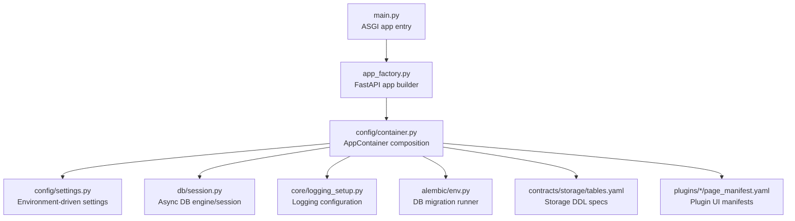
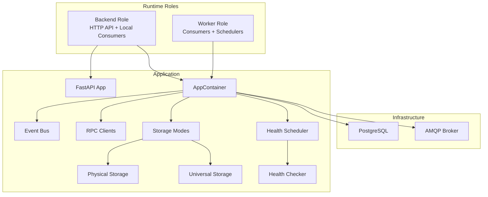
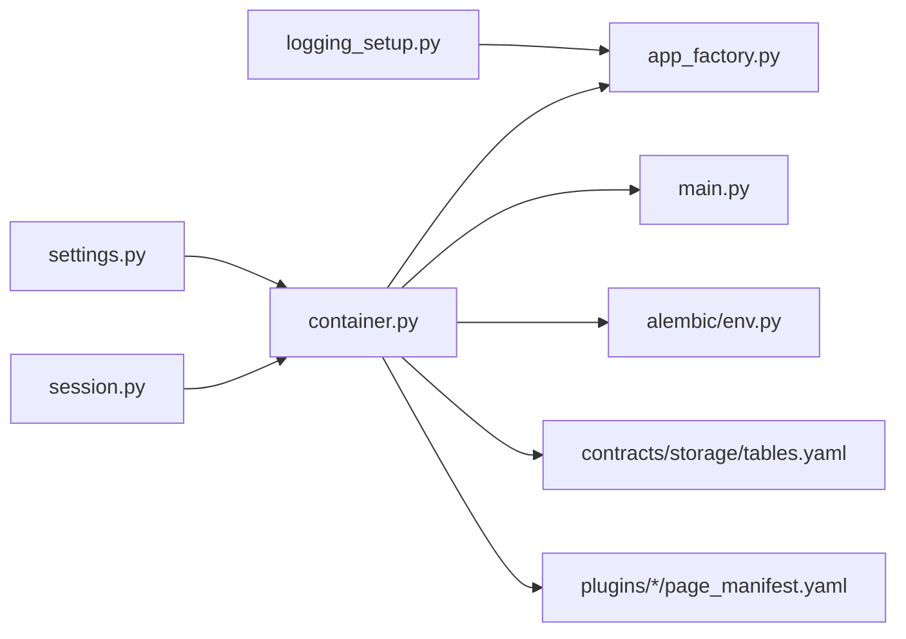

# Deployment and Operations

<cite>
**Referenced Files in This Document**
- [settings.py](file://config/settings.py)
- [container.py](file://config/container.py)
- [app_factory.py](file://app_factory.py)
- [bootstrap.py](file://bootstrap.py)
- [main.py](file://main.py)
- [logging_setup.py](file://core/logging_setup.py)
- [session.py](file://db/session.py)
- [env.py](file://alembic/env.py)
- [tables.yaml](file://contracts/storage/tables.yaml)
- [page_manifest.yaml](file://plugins/autodiscover/page_manifest.yaml)
</cite>

## Table of Contents
1. [Introduction](#introduction)
2. [Project Structure](#project-structure)
3. [Core Components](#core-components)
4. [Architecture Overview](#architecture-overview)
5. [Detailed Component Analysis](#detailed-component-analysis)
6. [Dependency Analysis](#dependency-analysis)
7. [Performance Considerations](#performance-considerations)
8. [Troubleshooting Guide](#troubleshooting-guide)
9. [Conclusion](#conclusion)
10. [Appendices](#appendices)

## Introduction
This document provides comprehensive deployment and operations guidance for the Oko Dashboard backend. It covers containerization strategies, environment configuration, production deployment patterns, monitoring and logging, operational metrics, scaling, backups, disaster recovery, maintenance, updates, troubleshooting, security hardening, performance tuning, and capacity planning. The guidance is grounded in the repository’s configuration, container composition, and runtime initialization patterns.

## Project Structure
The backend is a FastAPI application with a modular architecture:
- Application factory builds the ASGI app and registers routers, middleware, and lifecycle hooks.
- A dependency injection container composes services, databases, brokers, and workers.
- Settings define environment-driven configuration for databases, brokers, health checks, and plugin behavior.
- Alembic manages asynchronous database migrations.
- Logging is centrally configured with environment overrides.

**Diagram sources**
- [main.py:1-24](file://main.py#L1-L24)
- [app_factory.py:87-124](file://app_factory.py#L87-L124)
- [container.py:252-423](file://config/container.py#L252-L423)
- [settings.py:14-124](file://config/settings.py#L14-L124)
- [session.py:6-21](file://db/session.py#L6-L21)
- [logging_setup.py:141-186](file://core/logging_setup.py#L141-L186)
- [env.py:19-79](file://alembic/env.py#L19-L79)
- [tables.yaml:1-85](file://contracts/storage/tables.yaml#L1-L85)
- [page_manifest.yaml:1-93](file://plugins/autodiscover/page_manifest.yaml#L1-L93)

**Section sources**
- [main.py:1-24](file://main.py#L1-L24)
- [app_factory.py:87-124](file://app_factory.py#L87-L124)
- [container.py:252-423](file://config/container.py#L252-L423)
- [settings.py:14-124](file://config/settings.py#L14-L124)
- [session.py:6-21](file://db/session.py#L6-L21)
- [logging_setup.py:141-186](file://core/logging_setup.py#L141-L186)
- [env.py:19-79](file://alembic/env.py#L19-L79)
- [tables.yaml:1-85](file://contracts/storage/tables.yaml#L1-L85)
- [page_manifest.yaml:1-93](file://plugins/autodiscover/page_manifest.yaml#L1-L93)

## Core Components
- Application lifecycle and routing:
  - The ASGI app is created with a lifespan manager that initializes logging, constructs the container, registers plugin routes, starts consumers/workers, and shuts them down gracefully.
- Container composition:
  - The container wires database engines, repositories, event bus, RPC clients, storage modes, health scheduler, and plugin services. It supports role-based startup for backend and worker processes.
- Settings and environment:
  - Environment variables drive database URLs, broker URLs, runtime roles, prefetch counts, event streaming, health checks, timeouts, and plugin watch intervals.
- Logging:
  - Centralized logging configuration with level overrides and console formatting, controlled via environment variables.
- Database and migrations:
  - Async engine creation with pre-ping, and Alembic migrations supporting offline/online modes and async drivers.

**Section sources**
- [app_factory.py:30-46](file://app_factory.py#L30-L46)
- [container.py:105-174](file://config/container.py#L105-L174)
- [settings.py:32-93](file://config/settings.py#L32-L93)
- [logging_setup.py:141-186](file://core/logging_setup.py#L141-L186)
- [session.py:6-21](file://db/session.py#L6-L21)
- [env.py:50-79](file://alembic/env.py#L50-L79)

## Architecture Overview
The backend runs as either a backend process (HTTP API plus local consumers) or a worker process (consumers and schedulers only). The container orchestrates connections to PostgreSQL and AMQP, and exposes plugin APIs and health monitoring.

**Diagram sources**
- [container.py:105-174](file://config/container.py#L105-L174)
- [container.py:276-365](file://config/container.py#L276-L365)
- [app_factory.py:87-124](file://app_factory.py#L87-L124)

## Detailed Component Analysis

### Containerization Strategies
- Build and run the application as a single container image exposing the HTTP API. The container supports two runtime roles:
  - Backend: serves HTTP, mounts static/media directories, starts local consumers and health scheduler.
  - Worker: runs consumers and schedulers without the HTTP server.
- Environment-driven configuration:
  - Database and broker URLs are configured via environment variables.
  - Runtime role and consumer behavior are controlled via environment variables.
- Static assets:
  - Static and media directories are mounted under /static and /media respectively.

Operational guidance:
- Use a non-root user in the container and limit capabilities.
- Mount persistent volumes for media and plugins directories.
- Set resource limits and liveness/readiness probes.

**Section sources**
- [container.py:105-174](file://config/container.py#L105-L174)
- [app_factory.py:111-121](file://app_factory.py#L111-L121)
- [settings.py:21-31](file://config/settings.py#L21-L31)

### Environment Configuration
Key environment variables and their effects:
- Database and broker:
  - DATABASE_URL: Postgres connection string for asyncpg.
  - BROKER_URL: AMQP connection string for RabbitMQ or compatible broker.
- Runtime role:
  - OKO_RUNTIME_ROLE: "backend" or "worker".
- Consumer behavior:
  - OKO_ENABLE_LOCAL_CONSUMERS: Enable local consumers when broker is memory or when explicitly enabled.
  - OKO_BROKER_PREFETCH_COUNT: Adjust concurrency per consumer.
- Streaming and timeouts:
  - OKO_EVENTS_KEEPALIVE_SEC, OKO_EVENTS_RETRY_MS: SSE keepalive and retry timing.
  - OKO_STORAGE_RPC_TIMEOUT_SEC, OKO_ACTION_RPC_TIMEOUT_SEC: RPC timeouts.
- Health monitoring:
  - OKO_HEALTH_WINDOW_SIZE, OKO_HEALTH_RETENTION_DAYS, OKO_HEALTH_ICMP_ENABLED, OKO_HEALTH_SCHEDULER_TICK_SEC, OKO_HEALTH_SCHEDULER_HEARTBEAT_SEC, OKO_HEALTH_INTERVAL_SEC, OKO_HEALTH_TIMEOUT_MS, OKO_HEALTH_LATENCY_THRESHOLD_MS.
- Favicon fetcher:
  - OKO_FAVICON_TIMEOUT_SEC, OKO_FAVICON_MAX_BYTES, OKO_FAVICON_TLS_VERIFY, OKO_FAVICON_TLS_INSECURE_FALLBACK, OKO_FAVICON_CACHE_TTL_DAYS.
- Plugin store and watch:
  - OKO_STORE_URL: Plugin store service URL.
  - OKO_PLUGIN_WATCH_POLL_SEC: Poll interval for plugin filesystem watching.
- Logging:
  - OKO_LOG_LEVEL: Root logging level.
  - OKO_LOG_COLOR: Enable ANSI color in logs.

**Section sources**
- [settings.py:32-93](file://config/settings.py#L32-L93)
- [logging_setup.py:141-186](file://core/logging_setup.py#L141-L186)

### Production Deployment Patterns
- Docker deployment:
  - Multi-stage build to minimize image size.
  - Entrypoint invokes the ASGI app; ensure environment variables are set.
  - Persist media and plugins directories via volumes.
- Kubernetes deployment:
  - Deployments for backend and workers.
  - Separate services for backend (HTTP) and internal queues.
  - Secrets for DATABASE_URL and BROKER_URL; ConfigMaps for static/media paths and plugin bootstrap.
  - Probes: readiness/liveness based on health endpoints and container health.
- Cloud platforms:
  - Use managed PostgreSQL and RabbitMQ services.
  - Configure environment variables via platform secrets.
  - Enable autoscaling based on CPU/memory and queue depth.

[No sources needed since this section provides general guidance]

### Monitoring Setup and Operational Metrics
- Logging:
  - Centralized logging with level overrides and structured formatting.
  - Use OKO_LOG_LEVEL and OKO_LOG_COLOR to tune verbosity and output.
- Health endpoints:
  - Health scheduler and checker emit periodic results; expose a simple health endpoint for probes.
- Metrics:
  - Integrate Prometheus/OpenTelemetry to export process and queue metrics.
  - Track RPC latencies, DB query durations, and consumer lag.

**Section sources**
- [logging_setup.py:141-186](file://core/logging_setup.py#L141-L186)
- [container.py:354-365](file://config/container.py#L354-L365)

### Scaling Considerations
- Horizontal scaling:
  - Run multiple backend pods behind a load balancer.
  - Scale workers independently to handle queue load.
- Backpressure:
  - Tune OKO_BROKER_PREFETCH_COUNT and worker replicas to avoid overload.
- Database:
  - Use read replicas for read-heavy workloads; ensure connection pooling and pre-ping are effective.
- Storage:
  - Monitor plugin storage limits and adjust max QPS/query limits accordingly.

**Section sources**
- [settings.py:48-53](file://config/settings.py#L48-L53)
- [container.py:203-210](file://config/container.py#L203-L210)

### Backup and Disaster Recovery
- Database:
  - Schedule regular logical backups of PostgreSQL; retain recent snapshots for point-in-time recovery.
  - Test restore procedures periodically.
- Configuration and artifacts:
  - Back up plugins directory and media directory volumes.
- DR:
  - Replicate PostgreSQL and AMQP clusters across availability zones.
  - Automate failover and rehydrate containers from backups.

[No sources needed since this section provides general guidance]

### Maintenance Procedures and Update Processes
- Rolling updates:
  - Use rolling restarts with readiness probes to prevent downtime.
- Schema migrations:
  - Apply Alembic migrations during deployments; prefer offline mode for predictable downtime windows.
- Plugin updates:
  - Use the plugin store client to update plugins; validate manifests and restart affected pods.
- Logs and cleanup:
  - Rotate logs and prune old health samples per retention settings.

**Section sources**
- [env.py:26-79](file://alembic/env.py#L26-L79)
- [container.py:383-392](file://config/container.py#L383-L392)

### Troubleshooting Operational Issues
Common symptoms and checks:
- Database connectivity:
  - Verify DATABASE_URL and network access; confirm asyncpg driver compatibility.
- Broker connectivity:
  - Confirm BROKER_URL and credentials; check prefetch count and consumer lag.
- Health checks failing:
  - Review health scheduler settings and ICMP enablement; inspect latency thresholds.
- Logging volume:
  - Adjust OKO_LOG_LEVEL and OKO_LOG_COLOR; ensure handlers are attached.

**Section sources**
- [session.py:6-10](file://db/session.py#L6-L10)
- [settings.py:32-93](file://config/settings.py#L32-L93)
- [logging_setup.py:141-186](file://core/logging_setup.py#L141-L186)

### Security Hardening
- Secrets management:
  - Store DATABASE_URL and BROKER_URL in platform secrets; avoid committing to images.
- Network policies:
  - Restrict ingress/egress; allow only necessary ports.
- Image hygiene:
  - Use minimal base images; pin Python and dependency versions.
- TLS and verification:
  - Enable TLS verification for external requests and disable insecure fallback in production.

**Section sources**
- [settings.py:77-81](file://config/settings.py#L77-L81)

### Performance Tuning and Capacity Planning
- Database:
  - Use connection pooling, pre-ping, and read replicas; monitor slow queries.
- Queue throughput:
  - Adjust prefetch count and worker replicas; monitor queue depth and consumer lag.
- RPC and timeouts:
  - Tune storage/action RPC timeouts to match expected SLAs.
- Health sampling:
  - Size the window and retention appropriately for alerting cadence.

**Section sources**
- [session.py:6-10](file://db/session.py#L6-L10)
- [settings.py:48-53](file://config/settings.py#L48-L53)
- [settings.py:57-68](file://config/settings.py#L57-L68)
- [container.py:203-210](file://config/container.py#L203-L210)

## Dependency Analysis
The application composes services around a central container that depends on settings, database sessions, and broker clients. The app factory registers routes and lifecycle hooks, while logging and migrations are configured centrally.

**Diagram sources**
- [settings.py:14-124](file://config/settings.py#L14-L124)
- [container.py:252-423](file://config/container.py#L252-L423)
- [session.py:6-21](file://db/session.py#L6-L21)
- [logging_setup.py:141-186](file://core/logging_setup.py#L141-L186)
- [app_factory.py:87-124](file://app_factory.py#L87-L124)
- [main.py:17-21](file://main.py#L17-L21)
- [env.py:19-79](file://alembic/env.py#L19-L79)
- [tables.yaml:1-85](file://contracts/storage/tables.yaml#L1-L85)
- [page_manifest.yaml:1-93](file://plugins/autodiscover/page_manifest.yaml#L1-L93)

**Section sources**
- [settings.py:14-124](file://config/settings.py#L14-L124)
- [container.py:252-423](file://config/container.py#L252-L423)
- [session.py:6-21](file://db/session.py#L6-L21)
- [logging_setup.py:141-186](file://core/logging_setup.py#L141-L186)
- [app_factory.py:87-124](file://app_factory.py#L87-L124)
- [main.py:17-21](file://main.py#L17-L21)
- [env.py:19-79](file://alembic/env.py#L19-L79)
- [tables.yaml:1-85](file://contracts/storage/tables.yaml#L1-L85)
- [page_manifest.yaml:1-93](file://plugins/autodiscover/page_manifest.yaml#L1-L93)

## Performance Considerations
- Database:
  - Use asyncpg with pre-ping; scale read replicas; monitor pool utilization.
- Broker:
  - Right-size prefetch count and worker replicas; monitor queue depth and consumer lag.
- RPC:
  - Tune timeouts to balance responsiveness and reliability.
- Health:
  - Adjust scheduler tick and heartbeat to align with alerting cadence.

[No sources needed since this section provides general guidance]

## Troubleshooting Guide
- Startup failures:
  - Verify DATABASE_URL and broker connectivity; check role-specific startup paths.
- Health anomalies:
  - Inspect health window size, retention, and thresholds; confirm ICMP enablement.
- Logging issues:
  - Confirm OKO_LOG_LEVEL and OKO_LOG_COLOR; ensure handlers are attached and filters applied.

**Section sources**
- [container.py:105-174](file://config/container.py#L105-L174)
- [settings.py:62-74](file://config/settings.py#L62-L74)
- [logging_setup.py:141-186](file://core/logging_setup.py#L141-L186)

## Conclusion
This guide outlines a production-ready deployment and operations strategy for the Oko Dashboard backend. By leveraging environment-driven configuration, a robust container composition, centralized logging, and careful scaling and security practices, teams can operate the backend reliably at scale. Regular maintenance, backups, and disaster recovery testing ensure continuity and resilience.

[No sources needed since this section summarizes without analyzing specific files]

## Appendices

### Appendix A: Environment Variables Reference
- DATABASE_URL: Postgres connection string for asyncpg.
- BROKER_URL: AMQP connection string.
- OKO_RUNTIME_ROLE: "backend" or "worker".
- OKO_ENABLE_LOCAL_CONSUMERS: Boolean to enable local consumers.
- OKO_BROKER_PREFETCH_COUNT: Integer for consumer prefetch.
- OKO_EVENTS_KEEPALIVE_SEC: Float for SSE keepalive.
- OKO_EVENTS_RETRY_MS: Integer for SSE retry delay.
- OKO_ACTIONS_EXECUTE_ENABLED: Boolean to enable action execution.
- OKO_STORAGE_RPC_TIMEOUT_SEC: Float timeout for storage RPC.
- OKO_ACTION_RPC_TIMEOUT_SEC: Float timeout for action RPC.
- OKO_HEALTH_WINDOW_SIZE: Integer for health window.
- OKO_HEALTH_RETENTION_DAYS: Integer for health retention.
- OKO_HEALTH_ICMP_ENABLED: Boolean to enable ICMP checks.
- OKO_HEALTH_SCHEDULER_TICK_SEC: Float scheduler tick.
- OKO_HEALTH_SCHEDULER_HEARTBEAT_SEC: Float heartbeat interval.
- OKO_HEALTH_INTERVAL_SEC: Integer default check interval.
- OKO_HEALTH_TIMEOUT_MS: Integer default check timeout.
- OKO_HEALTH_LATENCY_THRESHOLD_MS: Integer threshold for latency alerts.
- OKO_FAVICON_TIMEOUT_SEC: Float favicon fetch timeout.
- OKO_FAVICON_MAX_BYTES: Integer max favicon bytes.
- OKO_FAVICON_TLS_VERIFY: Boolean TLS verification.
- OKO_FAVICON_TLS_INSECURE_FALLBACK: Boolean insecure fallback.
- OKO_FAVICON_CACHE_TTL_DAYS: Integer cache TTL.
- OKO_STORE_URL: Plugin store URL.
- OKO_PLUGIN_WATCH_POLL_SEC: Float poll interval for plugin watch.
- OKO_LOG_LEVEL: Root logging level.
- OKO_LOG_COLOR: Boolean to enable colored logs.

**Section sources**
- [settings.py:32-93](file://config/settings.py#L32-L93)
- [logging_setup.py:141-186](file://core/logging_setup.py#L141-L186)