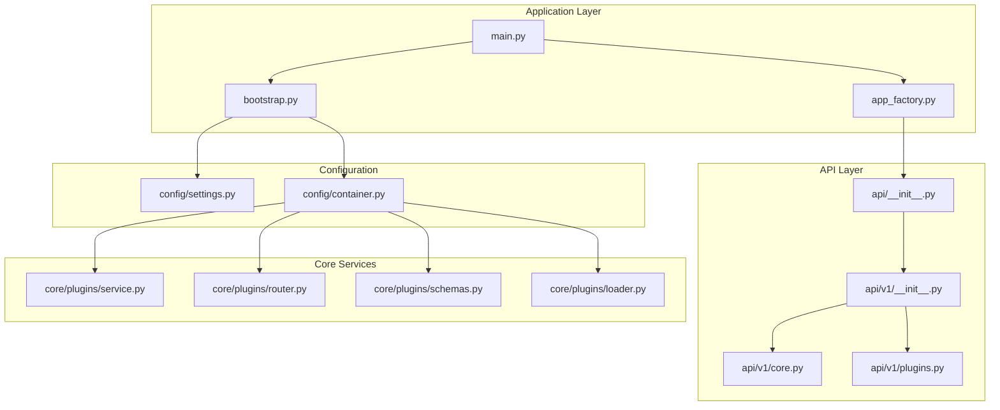
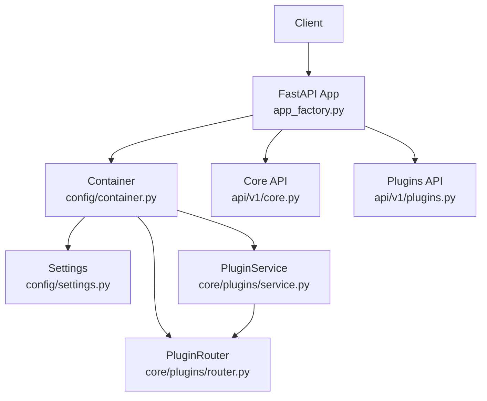
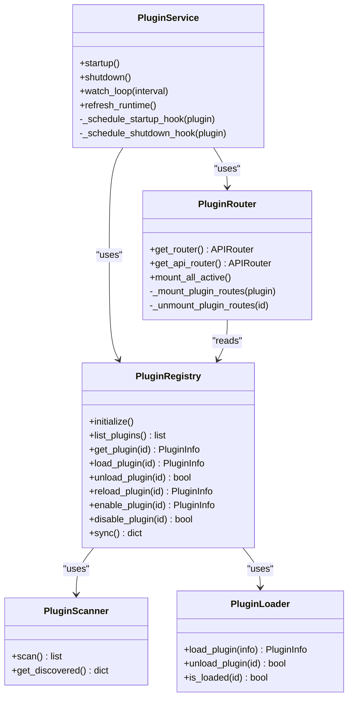
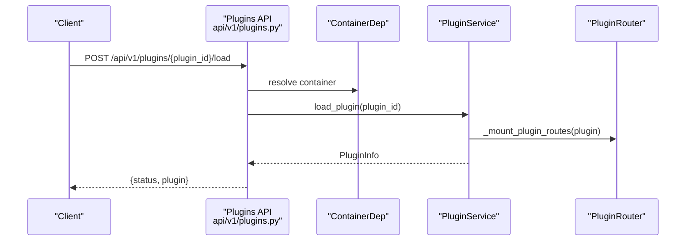
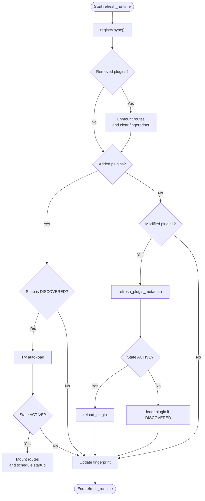
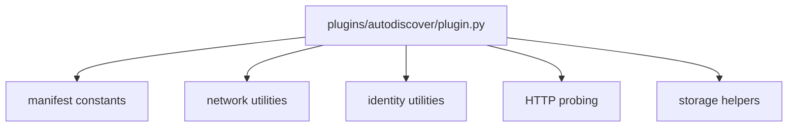
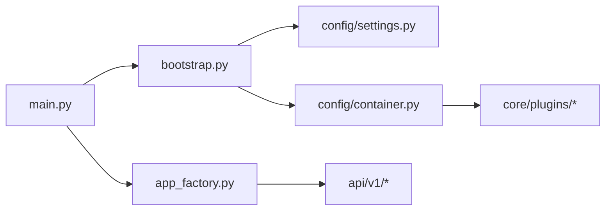

# Development Guidelines

<cite>
**Referenced Files in This Document**
- [main.py](file://main.py)
- [app_factory.py](file://app_factory.py)
- [bootstrap.py](file://bootstrap.py)
- [config/settings.py](file://config/settings.py)
- [config/container.py](file://config/container.py)
- [api/__init__.py](file://api/__init__.py)
- [api/v1/__init__.py](file://api/v1/__init__.py)
- [api/v1/core.py](file://api/v1/core.py)
- [api/v1/plugins.py](file://api/v1/plugins.py)
- [core/plugins/__init__.py](file://core/plugins/__init__.py)
- [core/plugins/service.py](file://core/plugins/service.py)
- [core/plugins/router.py](file://core/plugins/router.py)
- [core/plugins/schemas.py](file://core/plugins/schemas.py)
- [core/plugins/loader.py](file://core/plugins/loader.py)
- [plugins/autodiscover/plugin.py](file://plugins/autodiscover/plugin.py)
</cite>

## Table of Contents
1. [Introduction](#introduction)
2. [Project Structure](#project-structure)
3. [Core Components](#core-components)
4. [Architecture Overview](#architecture-overview)
5. [Detailed Component Analysis](#detailed-component-analysis)
6. [Dependency Analysis](#dependency-analysis)
7. [Performance Considerations](#performance-considerations)
8. [Testing Strategies](#testing-strategies)
9. [Quality Assurance Processes](#quality-assurance-processes)
10. [Development Workflow and Branch Management](#development-workflow-and-branch-management)
11. [Contribution Guidelines](#contribution-guidelines)
12. [Extending the Plugin System](#extending-the-plugin-system)
13. [Adding New Features](#adding-new-features)
14. [Maintaining Backward Compatibility](#maintaining-backward-compatibility)
15. [Debugging Techniques](#debugging-techniques)
16. [Performance Profiling](#performance-profiling)
17. [Development Tools](#development-tools)
18. [Code Review Processes](#code-review-processes)
19. [Documentation Requirements](#documentation-requirements)
20. [Release Procedures](#release-procedures)
21. [Conclusion](#conclusion)

## Introduction
This document provides comprehensive development guidelines for contributing to the Oko Dashboard backend. It covers code style conventions, architectural patterns, development best practices, testing strategies, quality assurance processes, development workflow, branch management, contribution guidelines, plugin extension practices, feature addition guidelines, backward compatibility requirements, debugging techniques, performance profiling, development tools, code review processes, documentation requirements, and release procedures.

## Project Structure
The backend follows a layered architecture with clear separation of concerns:
- Application entrypoint initializes settings, logging, and DI container, then creates a FastAPI app with routers and middleware.
- API layer exposes versioned endpoints under /api/v1, including core, actions, plugins, and store.
- Core domain services manage configuration, events, storage, health checks, and plugin orchestration.
- Plugins subsystem enables dynamic discovery, loading, routing, and lifecycle management of user-installed plugins.
- Configuration and dependency injection define runtime behavior via settings and a container factory.

**Diagram sources**
- [main.py:1-24](file://main.py#L1-L24)
- [app_factory.py:1-133](file://app_factory.py#L1-L133)
- [bootstrap.py:1-32](file://bootstrap.py#L1-L32)
- [config/settings.py:1-128](file://config/settings.py#L1-L128)
- [config/container.py:1-427](file://config/container.py#L1-L427)
- [api/__init__.py:1-4](file://api/__init__.py#L1-L4)
- [api/v1/__init__.py:1-16](file://api/v1/__init__.py#L1-L16)
- [api/v1/core.py:1-377](file://api/v1/core.py#L1-L377)
- [api/v1/plugins.py:1-362](file://api/v1/plugins.py#L1-L362)
- [core/plugins/service.py:1-299](file://core/plugins/service.py#L1-L299)
- [core/plugins/router.py:1-448](file://core/plugins/router.py#L1-L448)
- [core/plugins/schemas.py:1-131](file://core/plugins/schemas.py#L1-L131)
- [core/plugins/loader.py:1-329](file://core/plugins/loader.py#L1-L329)

**Section sources**
- [main.py:1-24](file://main.py#L1-L24)
- [app_factory.py:1-133](file://app_factory.py#L1-L133)
- [bootstrap.py:1-32](file://bootstrap.py#L1-L32)
- [config/settings.py:1-128](file://config/settings.py#L1-L128)
- [config/container.py:1-427](file://config/container.py#L1-L427)
- [api/__init__.py:1-4](file://api/__init__.py#L1-L4)
- [api/v1/__init__.py:1-16](file://api/v1/__init__.py#L1-L16)
- [api/v1/core.py:1-377](file://api/v1/core.py#L1-L377)
- [api/v1/plugins.py:1-362](file://api/v1/plugins.py#L1-L362)
- [core/plugins/__init__.py:1-39](file://core/plugins/__init__.py#L1-L39)
- [core/plugins/service.py:1-299](file://core/plugins/service.py#L1-L299)
- [core/plugins/router.py:1-448](file://core/plugins/router.py#L1-L448)
- [core/plugins/schemas.py:1-131](file://core/plugins/schemas.py#L1-L131)
- [core/plugins/loader.py:1-329](file://core/plugins/loader.py#L1-L329)

## Core Components
- Application factory builds a FastAPI app with lifespan management, middleware, exception handlers, static mounts, and plugin route registration.
- Bootstrap loads runtime settings, logging configuration, and constructs the DI container.
- Settings encapsulate environment-driven configuration with Pydantic validation and sane defaults.
- Container composes services, repositories, RPC clients, consumers, and plugin subsystems, wiring them into a cohesive runtime.
- API v1 routers expose core endpoints (health, state, config, events, favicon), plugin management, and store integration.
- Plugin system provides scanning, loading, routing, lifecycle hooks, and runtime refresh with polling.

Key implementation references:
- Application creation and lifespan: [app_factory.py:87-124](file://app_factory.py#L87-L124)
- Settings definition and validation: [config/settings.py:14-128](file://config/settings.py#L14-L128)
- Container composition and startup/shutdown: [config/container.py:105-174](file://config/container.py#L105-L174)
- Plugin service lifecycle and hooks: [core/plugins/service.py:188-202](file://core/plugins/service.py#L188-L202)

**Section sources**
- [app_factory.py:87-124](file://app_factory.py#L87-L124)
- [bootstrap.py:16-23](file://bootstrap.py#L16-L23)
- [config/settings.py:14-128](file://config/settings.py#L14-L128)
- [config/container.py:105-174](file://config/container.py#L105-L174)
- [core/plugins/service.py:188-202](file://core/plugins/service.py#L188-L202)

## Architecture Overview
The system uses a modular FastAPI application with:
- DI container for dependency injection and lifecycle management.
- Event-driven architecture with RabbitMQ/AMQP via broker clients and consumers.
- Plugin subsystem enabling dynamic UI/API routing and runtime lifecycle management.
- Storage abstraction supporting both universal and physical storage modes.

**Diagram sources**
- [app_factory.py:87-124](file://app_factory.py#L87-L124)
- [config/settings.py:14-128](file://config/settings.py#L14-L128)
- [config/container.py:252-423](file://config/container.py#L252-L423)
- [core/plugins/service.py:18-74](file://core/plugins/service.py#L18-L74)
- [core/plugins/router.py:16-52](file://core/plugins/router.py#L16-L52)
- [api/v1/core.py:43-377](file://api/v1/core.py#L43-L377)
- [api/v1/plugins.py:23-362](file://api/v1/plugins.py#L23-L362)

## Detailed Component Analysis

### Plugin System Architecture
The plugin system is composed of:
- Scanner: discovers plugin packages by scanning directories for valid plugin layouts.
- Loader: dynamically imports plugin modules and manages load/unload lifecycle.
- Registry: tracks plugin state, metadata, and runtime info.
- Router: mounts/unmounts plugin pages and APIs at runtime.
- Service: orchestrates lifecycle, hooks, and runtime refresh.

**Diagram sources**
- [core/plugins/service.py:18-299](file://core/plugins/service.py#L18-L299)
- [core/plugins/router.py:16-448](file://core/plugins/router.py#L16-L448)
- [core/plugins/loader.py:23-329](file://core/plugins/loader.py#L23-L329)
- [core/plugins/schemas.py:9-131](file://core/plugins/schemas.py#L9-L131)

**Section sources**
- [core/plugins/service.py:18-299](file://core/plugins/service.py#L18-L299)
- [core/plugins/router.py:16-448](file://core/plugins/router.py#L16-L448)
- [core/plugins/loader.py:23-329](file://core/plugins/loader.py#L23-L329)
- [core/plugins/schemas.py:9-131](file://core/plugins/schemas.py#L9-L131)

### API Workflow: Plugin Lifecycle Endpoints
This sequence illustrates how plugin lifecycle operations are handled via API endpoints.

**Diagram sources**
- [api/v1/plugins.py:232-252](file://api/v1/plugins.py#L232-L252)
- [core/plugins/service.py:83-89](file://core/plugins/service.py#L83-L89)
- [core/plugins/router.py:118-155](file://core/plugins/router.py#L118-L155)

**Section sources**
- [api/v1/plugins.py:232-252](file://api/v1/plugins.py#L232-L252)
- [core/plugins/service.py:83-89](file://core/plugins/service.py#L83-L89)
- [core/plugins/router.py:118-155](file://core/plugins/router.py#L118-L155)

### Plugin Runtime Refresh Flow
The plugin service periodically refreshes runtime state by fingerprinting plugin directories and applying changes.

**Diagram sources**
- [core/plugins/service.py:224-283](file://core/plugins/service.py#L224-L283)

**Section sources**
- [core/plugins/service.py:224-283](file://core/plugins/service.py#L224-L283)

### Example Plugin Implementation
The autodiscover plugin demonstrates a typical plugin structure with actions, events, capabilities, and helpers.

**Diagram sources**
- [plugins/autodiscover/plugin.py:1-567](file://plugins/autodiscover/plugin.py#L1-L567)

**Section sources**
- [plugins/autodiscover/plugin.py:1-567](file://plugins/autodiscover/plugin.py#L1-L567)

## Dependency Analysis
The application exhibits low coupling between modules:
- Entry point depends on bootstrap and app factory.
- App factory depends on FastAPI, DI container, and API routers.
- Container composes services and consumers, decoupled from FastAPI internals.
- Plugin system is isolated behind interfaces and abstractions.

**Diagram sources**
- [main.py:1-24](file://main.py#L1-L24)
- [app_factory.py:1-133](file://app_factory.py#L1-L133)
- [bootstrap.py:1-32](file://bootstrap.py#L1-L32)
- [config/settings.py:1-128](file://config/settings.py#L1-L128)
- [config/container.py:1-427](file://config/container.py#L1-427)
- [api/v1/core.py:1-377](file://api/v1/core.py#L1-L377)
- [api/v1/plugins.py:1-362](file://api/v1/plugins.py#L1-L362)
- [core/plugins/service.py:1-299](file://core/plugins/service.py#L1-L299)

**Section sources**
- [main.py:1-24](file://main.py#L1-L24)
- [app_factory.py:1-133](file://app_factory.py#L1-L133)
- [bootstrap.py:1-32](file://bootstrap.py#L1-L32)
- [config/settings.py:1-128](file://config/settings.py#L1-L128)
- [config/container.py:1-427](file://config/container.py#L1-427)
- [api/v1/core.py:1-377](file://api/v1/core.py#L1-L377)
- [api/v1/plugins.py:1-362](file://api/v1/plugins.py#L1-L362)
- [core/plugins/service.py:1-299](file://core/plugins/service.py#L1-L299)

## Performance Considerations
- Asynchronous design: Prefer async I/O for network calls, storage operations, and event streaming.
- Concurrency controls: Configure broker prefetch count and RPC timeouts via settings to balance throughput and resource usage.
- Event streaming: Keepalive and retry intervals should be tuned for client connectivity and server load.
- Plugin polling: Adjust plugin watch poll interval to trade off responsiveness against CPU usage.
- Health checks: Tune scheduler tick, heartbeat, retention, and thresholds to match monitoring needs.

[No sources needed since this section provides general guidance]

## Testing Strategies
- Unit tests: Focus on pure functions, parsers, and small units of logic (e.g., manifest parsing, UI config parsing, network utilities).
- Integration tests: Validate API endpoints, plugin lifecycle transitions, and event streaming behavior.
- Contract tests: Ensure plugin manifests and UI configs adhere to schemas.
- End-to-end tests: Simulate plugin installation, loading, routing, and runtime refresh scenarios.
- Mocking: Use mocks for external systems (HTTP, broker, storage) to isolate test subjects.

[No sources needed since this section provides general guidance]

## Quality Assurance Processes
- Code style: Enforce consistent formatting and linting rules across the codebase.
- Type hints: Maintain comprehensive type annotations for improved readability and safety.
- Validation: Leverage Pydantic models for configuration and request/response validation.
- Logging: Use structured logging with appropriate levels and correlation IDs.
- Security: Apply capability-based access control for sensitive endpoints and actions.

[No sources needed since this section provides general guidance]

## Development Workflow and Branch Management
- Feature branches: Create topic branches for features and fixes; prefix with feature/, fix/, chore/.
- Commit hygiene: Keep commits focused and descriptive; reference issues in commit messages.
- Pull requests: Open PRs early for visibility; ensure CI passes and reviews approved.
- Main branch: Protected; releases are cut from tagged versions.
- Hotfixes: Short-lived branches targeting immediate production fixes.

[No sources needed since this section provides general guidance]

## Contribution Guidelines
- Fork and branch: Follow the branching strategy above.
- Coding standards: Adhere to existing style; add type hints; write docstrings for public APIs.
- Tests: Include unit/integration tests for new functionality.
- Documentation: Update API docs and internal docs for significant changes.
- Reviews: Expect feedback; iterate until consensus is reached.

[No sources needed since this section provides general guidance]

## Extending the Plugin System
- Manifest and UI config: Define plugin metadata and UI integration via manifest constants or YAML.
- API routes: Expose plugin-specific endpoints by attaching an APIRouter to the plugin module.
- Lifecycle hooks: Implement on_startup/on_shutdown in the plugin module to integrate with the runtime.
- Capabilities and events: Declare capabilities and events in the manifest for discovery and routing.
- Settings endpoints: Provide get_settings/update_settings handlers for runtime configuration.

References:
- Plugin manifest and UI config schemas: [core/plugins/schemas.py:25-131](file://core/plugins/schemas.py#L25-L131)
- Plugin router mounting: [core/plugins/router.py:118-155](file://core/plugins/router.py#L118-L155)
- Plugin service lifecycle: [core/plugins/service.py:188-202](file://core/plugins/service.py#L188-L202)

**Section sources**
- [core/plugins/schemas.py:25-131](file://core/plugins/schemas.py#L25-L131)
- [core/plugins/router.py:118-155](file://core/plugins/router.py#L118-L155)
- [core/plugins/service.py:188-202](file://core/plugins/service.py#L188-L202)

## Adding New Features
- API endpoints: Add routes under api/v1 with proper tags, security decorators, and response models.
- Domain services: Introduce new services in core with clear interfaces and dependency injection.
- Storage: Use universal or physical storage modes depending on persistence needs; define DDL specs when applicable.
- Events: Emit and subscribe to events via the event bus; ensure SSE streaming for real-time updates.
- Actions: Register actions in the action gateway; gate execution via settings.

References:
- Core API endpoints: [api/v1/core.py:43-377](file://api/v1/core.py#L43-L377)
- Plugins API endpoints: [api/v1/plugins.py:23-362](file://api/v1/plugins.py#L23-L362)
- Container composition: [config/container.py:252-423](file://config/container.py#L252-L423)

**Section sources**
- [api/v1/core.py:43-377](file://api/v1/core.py#L43-L377)
- [api/v1/plugins.py:23-362](file://api/v1/plugins.py#L23-L362)
- [config/container.py:252-423](file://config/container.py#L252-L423)

## Maintaining Backward Compatibility
- Versioned APIs: Keep /api/v1 intact; introduce new versions for breaking changes.
- Settings migration: Add model validators and defaults to handle evolving configuration safely.
- Plugin manifests: Respect minimum dashboard versions and deprecation notices.
- Event schemas: Maintain stable event envelopes and increment versions when necessary.

References:
- Settings validation and defaults: [config/settings.py:95-118](file://config/settings.py#L95-L118)
- Plugin manifest fields: [core/plugins/schemas.py:25-43](file://core/plugins/schemas.py#L25-L43)

**Section sources**
- [config/settings.py:95-118](file://config/settings.py#L95-L118)
- [core/plugins/schemas.py:25-43](file://core/plugins/schemas.py#L25-L43)

## Debugging Techniques
- Logging: Enable structured logs and correlate traces across services.
- Middleware: Use cancellation handling and validation error mapping for clearer diagnostics.
- Plugin inspection: Query plugin lists, manifests, and runtime states via API endpoints.
- Event streaming: Inspect live events and snapshots to diagnose state changes.

References:
- Cancellation handling: [app_factory.py:48-61](file://app_factory.py#L48-L61)
- Validation error mapping: [app_factory.py:69-84](file://app_factory.py#L69-L84)
- Plugin listing and manifests: [api/v1/plugins.py:23-113](file://api/v1/plugins.py#L23-L113)

**Section sources**
- [app_factory.py:48-61](file://app_factory.py#L48-L61)
- [app_factory.py:69-84](file://app_factory.py#L69-L84)
- [api/v1/plugins.py:23-113](file://api/v1/plugins.py#L23-L113)

## Performance Profiling
- Benchmark critical paths: plugin scanning, port scanning, HTTP probing, and event emission.
- Monitor broker and RPC latencies: tune prefetch counts and timeouts per workload.
- Observe plugin watch loop overhead: adjust polling intervals for large plugin sets.
- Profile storage operations: analyze query patterns and optimize DDL specs.

[No sources needed since this section provides general guidance]

## Development Tools
- Linters and formatters: Enforce style consistency across the team.
- IDE support: Use type-aware editors with Python extensions.
- Testing frameworks: pytest for unit and integration tests.
- Observability: Structured logging, metrics, and tracing for production visibility.

[No sources needed since this section provides general guidance]

## Code Review Processes
- Checklist: Correctness, style, tests, documentation, security, performance.
- DCO/sign-offs: Ensure contributor agreements are satisfied.
- CI gates: Automated checks must pass before merging.

[No sources needed since this section provides general guidance]

## Documentation Requirements
- API docs: Keep OpenAPI docs up to date with endpoint changes.
- Internal docs: Document plugin contracts, storage DDL, and core workflows.
- Changelog: Record breaking changes, features, and fixes per release.

[No sources needed since this section provides general guidance]

## Release Procedures
- Tagging: Create semantic version tags for releases.
- Packaging: Build distributable artifacts for backend and plugins.
- Rollout: Deploy to staging first; promote to production after validation.
- Post-release: Monitor logs, metrics, and user feedback.

[No sources needed since this section provides general guidance]

## Conclusion
These guidelines establish a consistent foundation for developing, extending, and maintaining the Oko Dashboard backend. By adhering to the architectural patterns, coding standards, testing strategies, and operational procedures outlined here, contributors can deliver reliable, maintainable, and extensible features while preserving backward compatibility and system stability.