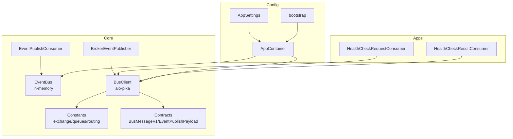
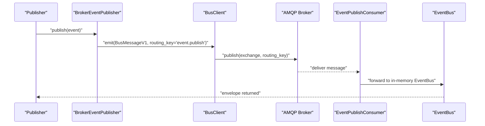
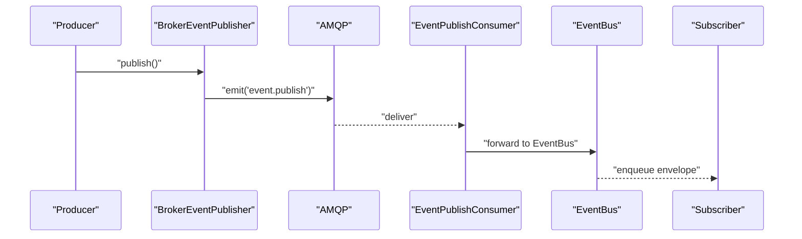
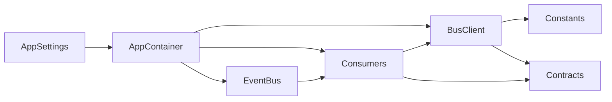

# Event Broker

<cite>
**Referenced Files in This Document**
- [broker.py](file://core/events/broker.py)
- [bus.py](file://core/events/bus.py)
- [client.py](file://core/bus/client.py)
- [constants.py](file://core/bus/constants.py)
- [bus.py](file://core/contracts/bus.py)
- [actions.py](file://core/bus/actions.py)
- [check_request_consumer.py](file://apps/health/bus_handlers/check_request_consumer.py)
- [check_result_consumer.py](file://apps/health/bus_handlers/check_result_consumer.py)
- [settings.py](file://config/settings.py)
- [container.py](file://config/container.py)
- [bootstrap.py](file://bootstrap.py)
</cite>

## Table of Contents
1. [Introduction](#introduction)
2. [Project Structure](#project-structure)
3. [Core Components](#core-components)
4. [Architecture Overview](#architecture-overview)
5. [Detailed Component Analysis](#detailed-component-analysis)
6. [Dependency Analysis](#dependency-analysis)
7. [Performance Considerations](#performance-considerations)
8. [Troubleshooting Guide](#troubleshooting-guide)
9. [Conclusion](#conclusion)
10. [Appendices](#appendices)

## Introduction
This document explains the event broker integration and message bus communication across the system. It covers broker connection management, channel establishment, message serialization, AMQP protocol implementation, exchange declarations, and routing configurations. It also documents event forwarding between the in-memory event bus and the message bus to ensure consistency across distributed components. Practical examples of broker configuration, connection handling, and error recovery strategies are included, along with guidance on performance optimization, connection pooling, and message durability considerations.

## Project Structure
The event and messaging infrastructure spans several modules:
- Event bus: in-memory event publishing and subscription
- Broker bus: AMQP-based message transport via aio-pika
- Contracts: typed message and payload models
- Consumers: handlers for queues and RPC replies
- Health app: demonstrates cross-service event forwarding and event bus integration
- Configuration: broker URL, prefetch count, and runtime role

**Diagram sources**
- [broker.py](file://core/events/broker.py)
- [bus.py](file://core/events/bus.py)
- [client.py](file://core/bus/client.py)
- [constants.py](file://core/bus/constants.py)
- [bus.py](file://core/contracts/bus.py)
- [check_request_consumer.py](file://apps/health/bus_handlers/check_request_consumer.py)
- [check_result_consumer.py](file://apps/health/bus_handlers/check_result_consumer.py)
- [settings.py](file://config/settings.py)
- [container.py](file://config/container.py)
- [bootstrap.py](file://bootstrap.py)

**Section sources**
- [container.py](file://config/container.py)
- [settings.py](file://config/settings.py)

## Core Components
- BrokerEventPublisher: builds and emits event envelopes onto the message bus using a standardized message type and routing key.
- EventPublishConsumer: consumes published events from the message bus and forwards them to the in-memory EventBus.
- EventBus: in-memory event bus with revision-aware publishing and subscriber queues.
- BusClient: AMQP client wrapper around aio-pika with connection lifecycle, topology declaration, RPC call/reply, and memory-mode emulation.
- Constants: AMQP exchange name/type, queue names, and routing keys.
- Contracts: strongly-typed message and payload models for serialization and validation.
- Health consumers: demonstrate cross-service event forwarding and event bus integration.

**Section sources**
- [broker.py](file://core/events/broker.py)
- [bus.py](file://core/events/bus.py)
- [client.py](file://core/bus/client.py)
- [constants.py](file://core/bus/constants.py)
- [bus.py](file://core/contracts/bus.py)
- [check_request_consumer.py](file://apps/health/bus_handlers/check_request_consumer.py)
- [check_result_consumer.py](file://apps/health/bus_handlers/check_result_consumer.py)

## Architecture Overview
The system integrates an in-memory event bus with a persistent AMQP message bus. Publishers emit events to the message bus, which are consumed and forwarded to the in-memory bus for local subscribers. Consumers handle RPC-style requests and produce results back to the in-memory bus or the message bus.

**Diagram sources**
- [broker.py](file://core/events/broker.py)
- [client.py](file://core/bus/client.py)
- [constants.py](file://core/bus/constants.py)
- [bus.py](file://core/contracts/bus.py)

## Detailed Component Analysis

### BrokerEventPublisher
Responsibilities:
- Builds an event envelope with type, source, payload, correlation ID, and revision.
- Serializes the payload into a BusMessageV1 with type "event.publish".
- Emits the message to the exchange with routing key "event.publish".

Key behaviors:
- Revision increment ensures monotonic ordering.
- Uses BusClient.emit with JSON serialization and persistent delivery mode.

**Section sources**
- [broker.py](file://core/events/broker.py)
- [client.py](file://core/bus/client.py)
- [constants.py](file://core/bus/constants.py)
- [bus.py](file://core/contracts/bus.py)

### EventPublishConsumer
Responsibilities:
- Declares and binds the events queue to the exchange with routing key "event.publish".
- Consumes messages, validates type, deserializes payload, and forwards to EventBus.

Operational details:
- Starts/stops consumption and manages consumer tag.
- Processes messages atomically and ignores duplicates.

**Section sources**
- [broker.py](file://core/events/broker.py)
- [client.py](file://core/bus/client.py)
- [constants.py](file://core/bus/constants.py)
- [bus.py](file://core/contracts/bus.py)

### EventBus
Responsibilities:
- Publishes events to all subscribed queues with revision tracking.
- Maintains a lock for thread-safe updates.
- Subscribes/unsubscribes queues with configurable capacity.

Behavior:
- Drops oldest items when a subscriber queue is full to prevent backpressure.
- Returns the published envelope for caller-side tracking.

**Section sources**
- [bus.py](file://core/events/bus.py)

### BusClient
Responsibilities:
- Manages AMQP connection/channel/exchange lifecycle.
- Declares and binds queues and exchanges on connect.
- Emits messages with JSON serialization and persistent delivery.
- Supports RPC call/reply with correlation IDs and reply-to queues.
- Provides memory-mode emulation for local testing.

Connection and topology:
- Connects robustly, sets QoS prefetch, declares durable topic exchange.
- Declares and binds queues for storage, actions, events, health check request/result.
- Memory mode bypasses AMQP and dispatches messages locally.

RPC semantics:
- Exclusive, auto-delete reply queues per call.
- Correlation-based reply matching with timeouts.

**Section sources**
- [client.py](file://core/bus/client.py)
- [constants.py](file://core/bus/constants.py)

### Contracts and Serialization
- BusMessageV1: carries message metadata (id, ts, type, plugin_id, payload, reply_to, correlation_id, trace).
- EventPublishPayload: carries event-specific fields for event.publish.
- Pydantic models ensure strict validation and JSON serialization.

**Section sources**
- [bus.py](file://core/contracts/bus.py)

### Health Consumers
- HealthCheckRequestConsumer: consumes health check requests, executes checks, and emits results to the message bus.
- HealthCheckResultConsumer: consumes results, persists samples, evaluates health, and publishes health status events to the in-memory bus via the event publisher.

**Section sources**
- [check_request_consumer.py](file://apps/health/bus_handlers/check_request_consumer.py)
- [check_result_consumer.py](file://apps/health/bus_handlers/check_result_consumer.py)

### AMQP Implementation Details
- Exchange: durable topic exchange named according to constants.
- Queues: durable queues per subsystem (storage, actions, events, health).
- Routing: topic-based routing with explicit routing keys and wildcard support in memory dispatcher.
- Durability: messages and queues are durable; exchange is durable.

**Section sources**
- [client.py](file://core/bus/client.py)
- [constants.py](file://core/bus/constants.py)

### Event Forwarding Between In-Memory and Message Bus
End-to-end flow:
- Publisher constructs envelope and emits to message bus.
- EventPublishConsumer receives, validates, and forwards to EventBus.
- Local subscribers receive events from EventBus.

**Diagram sources**
- [broker.py](file://core/events/broker.py)
- [client.py](file://core/bus/client.py)
- [bus.py](file://core/events/bus.py)

## Dependency Analysis
High-level dependencies:
- BrokerEventPublisher depends on BusClient and constants for routing.
- EventPublishConsumer depends on BusClient and EventBus.
- BusClient depends on constants, aio-pika, and contracts for serialization.
- Health consumers depend on BusClient and contracts.
- AppContainer wires BusClient, EventBus, and consumers; loads settings and orchestrates startup/shutdown.

**Diagram sources**
- [container.py](file://config/container.py)
- [settings.py](file://config/settings.py)
- [client.py](file://core/bus/client.py)
- [constants.py](file://core/bus/constants.py)
- [bus.py](file://core/contracts/bus.py)

**Section sources**
- [container.py](file://config/container.py)
- [settings.py](file://config/settings.py)

## Performance Considerations
- Prefetch control: BusClient sets QoS prefetch via configuration to balance throughput and fairness.
- Memory mode: Using memory:// avoids network overhead for local development and testing.
- Queue durability: Durable queues and messages improve reliability at the cost of latency; tune based on SLAs.
- RPC timeouts: Configurable timeouts prevent resource leaks; adjust per workload characteristics.
- Backpressure handling: EventBus drops oldest items when queues are full to protect producers.

[No sources needed since this section provides general guidance]

## Troubleshooting Guide
Common issues and remedies:
- Connection failures: BusClient.connect uses a robust connection; ensure broker URL is reachable and credentials are correct.
- Exchange/queue not declared: BusClient.connect declares exchange and queues; verify broker permissions and that the exchange type matches constants.
- RPC timeouts: Increase timeouts in configuration; inspect consumer responsiveness and broker load.
- Consumer not receiving messages: Verify queue bindings and routing keys; confirm durable settings and consumer start order.
- Memory mode mismatches: When broker_url starts with memory://, consumers run locally; ensure consumers are started accordingly.

Operational hooks:
- Startup/shutdown orchestration in AppContainer ensures proper lifecycle management.
- Health consumers demonstrate end-to-end request/result flows and event publication.

**Section sources**
- [client.py](file://core/bus/client.py)
- [container.py](file://config/container.py)
- [check_request_consumer.py](file://apps/health/bus_handlers/check_request_consumer.py)
- [check_result_consumer.py](file://apps/health/bus_handlers/check_result_consumer.py)

## Conclusion
The event broker and message bus integration provides a robust, typed, and durable foundation for event-driven communication. By combining an in-memory EventBus with a persistent AMQP transport, the system achieves both local responsiveness and distributed scalability. Proper configuration of broker URLs, prefetch counts, and routing ensures reliable operation across backend and worker roles.

[No sources needed since this section summarizes without analyzing specific files]

## Appendices

### Broker Configuration Examples
- Broker URL: Configure via environment variable for production or development.
- Prefetch count: Tune for throughput and latency trade-offs.
- Runtime role: Controls which consumers start in backend vs worker processes.

**Section sources**
- [settings.py](file://config/settings.py)
- [container.py](file://config/container.py)

### Connection Handling and Lifecycle
- BusClient.connect establishes a robust connection, declares exchange and queues, and applies QoS.
- BusClient.close ensures clean closure of channel and connection; resets memory-mode state.

**Section sources**
- [client.py](file://core/bus/client.py)

### Error Recovery Strategies
- Robust connection: Reconnect on failure; idempotent re-declaration of topology.
- RPC timeouts: Raise typed exceptions with actionable context.
- Consumer processing: Atomic processing with ignore-processed semantics to avoid duplicate handling.

**Section sources**
- [client.py](file://core/bus/client.py)
- [broker.py](file://core/events/broker.py)

### Message Durability and Serialization
- Messages are serialized as JSON with persistent delivery mode.
- Envelope and payload models enforce schema compliance and aid debugging.

**Section sources**
- [client.py](file://core/bus/client.py)
- [bus.py](file://core/contracts/bus.py)