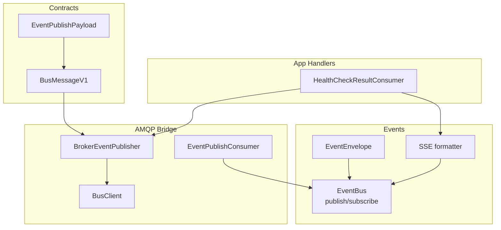
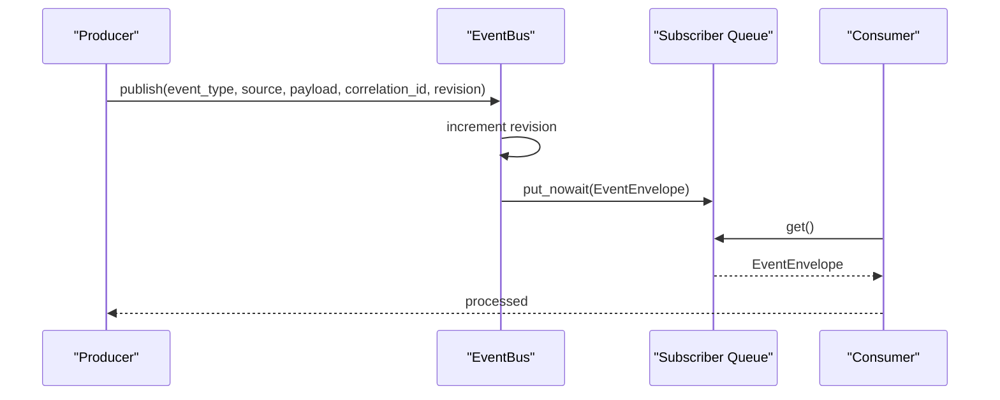
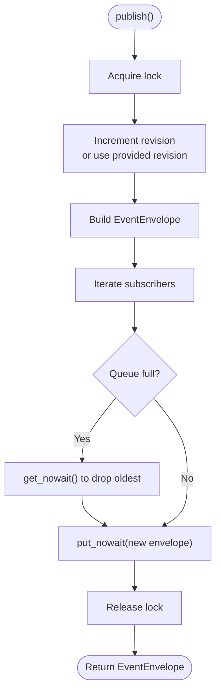
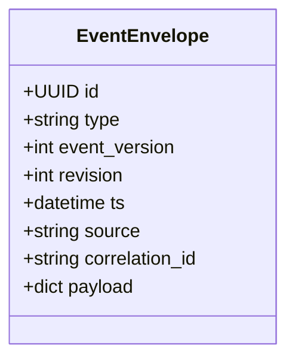
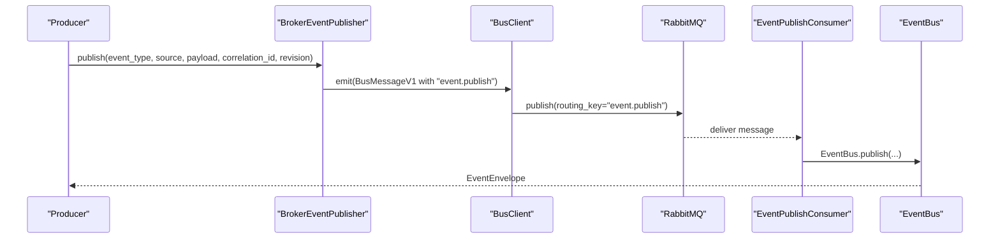
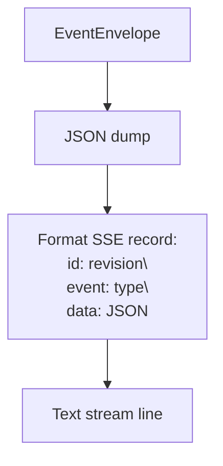
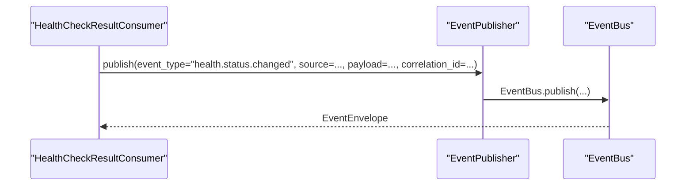
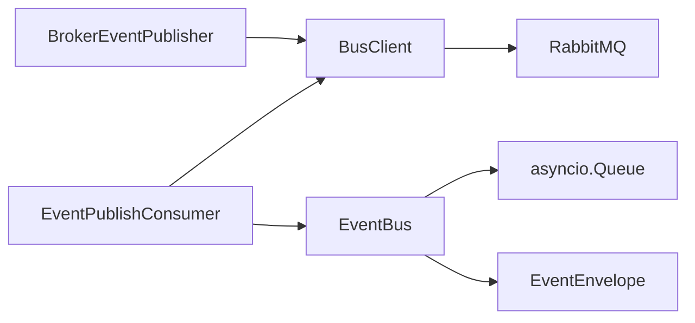

# Event Bus

<cite>
**Referenced Files in This Document**
- [bus.py](file://core/events/bus.py)
- [broker.py](file://core/events/broker.py)
- [models.py](file://core/contracts/models.py)
- [bus.py](file://core/contracts/bus.py)
- [client.py](file://core/bus/client.py)
- [constants.py](file://core/bus/constants.py)
- [sse.py](file://core/events/sse.py)
- [check_result_consumer.py](file://apps/health/bus_handlers/check_result_consumer.py)
</cite>

## Table of Contents
1. [Introduction](#introduction)
2. [Project Structure](#project-structure)
3. [Core Components](#core-components)
4. [Architecture Overview](#architecture-overview)
5. [Detailed Component Analysis](#detailed-component-analysis)
6. [Dependency Analysis](#dependency-analysis)
7. [Performance Considerations](#performance-considerations)
8. [Troubleshooting Guide](#troubleshooting-guide)
9. [Conclusion](#conclusion)

## Introduction
This document explains the in-memory event bus implementation used to distribute typed events across an application. It covers the EventBus class architecture, event publishing and subscription management, queue-based distribution, the EventEnvelope structure, revision tracking, and thread-safe operations. It also documents subscription lifecycle management, queue sizing strategies, backpressure handling, practical producer/consumer examples, correlation ID usage, performance considerations, memory management, overflow handling, and subscriber cleanup patterns.

## Project Structure
The event bus spans several modules:
- core/events/bus.py: In-memory EventBus with publish/subscribe and revision tracking
- core/events/broker.py: Bridge between AMQP/RabbitMQ and the in-memory EventBus
- core/contracts/models.py: EventEnvelope definition and other shared models
- core/contracts/bus.py: BusMessageV1 and EventPublishPayload for cross-service messaging
- core/bus/client.py: AMQP client with memory-mode dispatch for local testing
- core/bus/constants.py: Queue and routing constants
- core/events/sse.py: SSE formatter for EventEnvelope
- apps/health/bus_handlers/check_result_consumer.py: Example consumer using correlation IDs and event publishing

**Diagram sources**
- [bus.py:11-57](file://core/events/bus.py#L11-L57)
- [broker.py:16-94](file://core/events/broker.py#L16-L94)
- [models.py:112-121](file://core/contracts/models.py#L112-L121)
- [bus.py:30-46](file://core/contracts/bus.py#L30-L46)
- [bus.py:89-95](file://core/contracts/bus.py#L89-L95)
- [client.py:34-289](file://core/bus/client.py#L34-L289)
- [constants.py:1-47](file://core/bus/constants.py#L1-L47)
- [sse.py:8-11](file://core/events/sse.py#L8-L11)
- [check_result_consumer.py:14-105](file://apps/health/bus_handlers/check_result_consumer.py#L14-L105)

**Section sources**
- [bus.py:11-57](file://core/events/bus.py#L11-L57)
- [broker.py:16-94](file://core/events/broker.py#L16-L94)
- [models.py:112-121](file://core/contracts/models.py#L112-L121)
- [bus.py:30-46](file://core/contracts/bus.py#L30-L46)
- [bus.py:89-95](file://core/contracts/bus.py#L89-L95)
- [client.py:34-289](file://core/bus/client.py#L34-L289)
- [constants.py:1-47](file://core/bus/constants.py#L1-L47)
- [sse.py:8-11](file://core/events/sse.py#L8-L11)
- [check_result_consumer.py:14-105](file://apps/health/bus_handlers/check_result_consumer.py#L14-L105)

## Core Components
- EventBus: Thread-safe in-memory event publisher/subscriber with revision tracking and queue-based distribution.
- EventEnvelope: Typed event envelope with id, type, version, revision, timestamp, source, optional correlation_id, and payload.
- BrokerEventPublisher/BrokerEventConsumer: Bridge between AMQP and EventBus, enabling distributed event publishing and consumption.
- BusClient: AMQP client with memory-mode support for local development/testing.
- SSE formatter: Converts EventEnvelope to Server-Sent Events text.

Key responsibilities:
- Publish: Creates EventEnvelope, increments revision, and distributes to subscribers’ queues.
- Subscribe/Unsubscribe: Manage subscriber queues with configurable capacity.
- Backpressure: On full queues, oldest item is dropped to make room for new items.
- Revision: Monotonically increasing per publish, honoring provided revision if supplied.
- Correlation: Optional correlation_id carried through envelopes and used by consumers.

**Section sources**
- [bus.py:11-57](file://core/events/bus.py#L11-L57)
- [models.py:112-121](file://core/contracts/models.py#L112-L121)
- [broker.py:16-94](file://core/events/broker.py#L16-L94)
- [client.py:34-289](file://core/bus/client.py#L34-L289)
- [sse.py:8-11](file://core/events/sse.py#L8-L11)

## Architecture Overview
The EventBus is designed for in-process event distribution. Producers call EventBus.publish; subscribers obtain an asyncio.Queue via EventBus.subscribe and consume events asynchronously. A bridge exists to integrate with AMQP via BrokerEventPublisher and EventPublishConsumer.

**Diagram sources**
- [bus.py:17-46](file://core/events/bus.py#L17-L46)

**Section sources**
- [bus.py:11-57](file://core/events/bus.py#L11-L57)

## Detailed Component Analysis

### EventBus
- Thread-safety: Uses asyncio.Lock during publish to ensure atomic revision updates and queue writes.
- Publishing:
  - Increments internal revision counter, ensuring monotonicity and honoring provided revision.
  - Constructs EventEnvelope with id, type, version, revision, timestamp, source, correlation_id, payload.
  - Iterates existing subscribers and attempts to enqueue the envelope; if a queue is full, drops the oldest item first, then enqueues the new envelope.
- Subscription management:
  - subscribe(queue_size): Creates an asyncio.Queue with bounded capacity and registers it as a subscriber.
  - unsubscribe(queue): Removes a queue from subscribers.
- Backpressure handling:
  - On full queue, attempts to remove the oldest item before enqueueing the new envelope.
  - If the queue is still full after eviction, the new envelope is silently dropped to prevent blocking.

**Diagram sources**
- [bus.py:17-46](file://core/events/bus.py#L17-L46)

**Section sources**
- [bus.py:11-57](file://core/events/bus.py#L11-L57)

### EventEnvelope
- Fields: id, type, event_version, revision, ts, source, correlation_id, payload.
- Validation: Pydantic model enforces non-empty type, positive revisions, and UTC timestamps.
- Usage: Used as the unit of distribution in both in-memory and AMQP bridges.

**Diagram sources**
- [models.py:112-121](file://core/contracts/models.py#L112-L121)

**Section sources**
- [models.py:112-121](file://core/contracts/models.py#L112-L121)

### BrokerEventPublisher and EventPublishConsumer
- BrokerEventPublisher: Builds EventEnvelope locally, then emits a BusMessageV1 with type "event.publish" to the AMQP exchange/routing key.
- EventPublishConsumer: Consumes "event.publish" messages, validates payload, and forwards to EventBus.publish with the same fields.

**Diagram sources**
- [broker.py:21-56](file://core/events/broker.py#L21-L56)
- [client.py:77-99](file://core/bus/client.py#L77-L99)
- [constants.py](file://core/bus/constants.py#L16)

**Section sources**
- [broker.py:16-94](file://core/events/broker.py#L16-L94)
- [client.py:34-289](file://core/bus/client.py#L34-L289)
- [constants.py:1-47](file://core/bus/constants.py#L1-L47)

### SSE Formatter
- Converts EventEnvelope to a Server-Sent Events text stream record with id, event, and data fields derived from the envelope.

**Diagram sources**
- [sse.py:8-11](file://core/events/sse.py#L8-L11)

**Section sources**
- [sse.py:8-11](file://core/events/sse.py#L8-L11)

### Practical Examples

#### Producer: HealthCheckResultConsumer
- Produces two event types depending on whether the service status changed:
  - health.status.changed
  - health.status.updated
- Uses correlation_id from the original message to correlate producer and consumer flows.

**Diagram sources**
- [check_result_consumer.py:88-95](file://apps/health/bus_handlers/check_result_consumer.py#L88-L95)

**Section sources**
- [check_result_consumer.py:14-105](file://apps/health/bus_handlers/check_result_consumer.py#L14-L105)

## Dependency Analysis
- EventBus depends on:
  - asyncio.Queue for per-subscriber buffering
  - asyncio.Lock for thread-safety
  - EventEnvelope for event representation
- BrokerEventPublisher depends on:
  - BusClient for emitting messages
  - EventPublishPayload and BusMessageV1 for transport
- EventPublishConsumer depends on:
  - BusClient for consuming messages
  - EventBus for local forwarding

**Diagram sources**
- [bus.py:11-57](file://core/events/bus.py#L11-L57)
- [broker.py:16-94](file://core/events/broker.py#L16-L94)
- [client.py:34-289](file://core/bus/client.py#L34-L289)

**Section sources**
- [bus.py:11-57](file://core/events/bus.py#L11-L57)
- [broker.py:16-94](file://core/events/broker.py#L16-L94)
- [client.py:34-289](file://core/bus/client.py#L34-L289)

## Performance Considerations
- Queue sizing:
  - Use subscribe(queue_size=N) to tune subscriber throughput vs. memory usage.
  - Larger queues reduce dropped events under bursty loads but increase memory footprint.
- Backpressure:
  - Full queues trigger dropping of the oldest item before enqueueing the newest item.
  - If the new item still cannot be enqueued, it is dropped; ensure consumers keep up or increase queue size.
- Revision tracking:
  - Monotonic revision ensures ordering; however, dropped events can lead to gaps. Use correlation_id for end-to-end tracing.
- Correlation ID:
  - Consumers can propagate correlation_id to downstream systems for traceability across services.
- Memory mode:
  - BusClient supports memory:// mode for local development, avoiding external broker overhead.

[No sources needed since this section provides general guidance]

## Troubleshooting Guide
- Events not received by subscribers:
  - Verify subscribe(queue_size) was called and the returned queue is being consumed.
  - Confirm queue is not oversized relative to consumer speed; adjust queue_size accordingly.
- Dropped events:
  - Monitor for bursts exceeding queue capacity; increase queue_size or optimize consumer throughput.
- Revision gaps:
  - Expect gaps when events are dropped; rely on correlation_id for tracing.
- AMQP integration:
  - Ensure routing keys match ROUTING_EVENT_PUBLISH and queues are bound correctly.
  - Validate that EventPublishConsumer is started and connected to the exchange.

**Section sources**
- [bus.py:48-56](file://core/events/bus.py#L48-L56)
- [constants.py](file://core/bus/constants.py#L16)
- [client.py:242-246](file://core/bus/client.py#L242-L246)

## Conclusion
The in-memory EventBus provides a lightweight, thread-safe mechanism for distributing typed events within the application. It offers revision tracking, correlation support, and bounded queues with controlled backpressure. The bridge to AMQP enables seamless integration with distributed systems. Proper queue sizing, consumer throughput tuning, and correlation ID usage are essential for reliable event-driven architectures.