# Event System

<cite>
**Referenced Files in This Document**
- [core/events/__init__.py](file://core/events/__init__.py)
- [core/events/broker.py](file://core/events/broker.py)
- [core/events/bus.py](file://core/events/bus.py)
- [core/events/protocols.py](file://core/events/protocols.py)
- [core/events/sse.py](file://core/events/sse.py)
- [core/contracts/models.py](file://core/contracts/models.py)
- [core/contracts/bus.py](file://core/contracts/bus.py)
- [core/bus/client.py](file://core/bus/client.py)
- [core/bus/constants.py](file://core/bus/constants.py)
- [apps/health/bus_handlers/check_request_consumer.py](file://apps/health/bus_handlers/check_request_consumer.py)
- [apps/health/bus_handlers/check_result_consumer.py](file://apps/health/bus_handlers/check_result_consumer.py)
- [apps/health/service/checkers.py](file://apps/health/service/checkers.py)
- [config/container.py](file://config/container.py)
- [main.py](file://main.py)
- [app_factory.py](file://app_factory.py)
</cite>

## Table of Contents
1. [Introduction](#introduction)
2. [Project Structure](#project-structure)
3. [Core Components](#core-components)
4. [Architecture Overview](#architecture-overview)
5. [Detailed Component Analysis](#detailed-component-analysis)
6. [Dependency Analysis](#dependency-analysis)
7. [Performance Considerations](#performance-considerations)
8. [Troubleshooting Guide](#troubleshooting-guide)
9. [Conclusion](#conclusion)

## Introduction
This document explains the event system architecture and implementation. It covers the in-memory event bus, broker integration via AMQP/RabbitMQ, and server-sent events (SSE) formatting. It documents event publishing and subscription patterns, the event envelope format, and consumer registration. It also describes the event protocols, message formats, and real-time communication patterns, and provides practical examples of producers and consumers, event filtering, and performance optimization. Finally, it clarifies how memory-based events integrate with the message bus for distributed event handling.

## Project Structure
The event system spans several modules:
- In-memory event bus and SSE formatting live under core/events
- Broker integration is implemented in core/bus and consumed by core/events
- Contracts define envelopes and bus messages under core/contracts
- Example producers and consumers live under apps/health
- Application wiring is handled in config/container.py and lifecycle hooks in app_factory.py/main.py

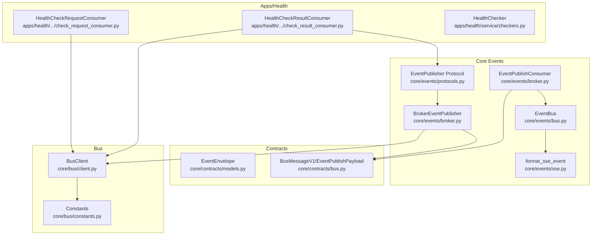

**Diagram sources**
- [core/events/bus.py:11-58](file://core/events/bus.py#L11-L58)
- [core/events/broker.py:16-95](file://core/events/broker.py#L16-L95)
- [core/events/sse.py:8-14](file://core/events/sse.py#L8-L14)
- [core/events/protocols.py:8-21](file://core/events/protocols.py#L8-L21)
- [core/contracts/models.py:112-121](file://core/contracts/models.py#L112-L121)
- [core/contracts/bus.py:30-95](file://core/contracts/bus.py#L30-L95)
- [core/bus/client.py:34-290](file://core/bus/client.py#L34-L290)
- [core/bus/constants.py:1-47](file://core/bus/constants.py#L1-L47)
- [apps/health/bus_handlers/check_request_consumer.py:10-48](file://apps/health/bus_handlers/check_request_consumer.py#L10-L48)
- [apps/health/bus_handlers/check_result_consumer.py:14-106](file://apps/health/bus_handlers/check_result_consumer.py#L14-L106)
- [apps/health/service/checkers.py:15-199](file://apps/health/service/checkers.py#L15-L199)

**Section sources**
- [core/events/__init__.py:1-8](file://core/events/__init__.py#L1-L8)
- [core/events/broker.py:16-95](file://core/events/broker.py#L16-L95)
- [core/events/bus.py:11-58](file://core/events/bus.py#L11-L58)
- [core/events/protocols.py:8-21](file://core/events/protocols.py#L8-L21)
- [core/events/sse.py:8-14](file://core/events/sse.py#L8-L14)
- [core/contracts/models.py:112-121](file://core/contracts/models.py#L112-L121)
- [core/contracts/bus.py:30-95](file://core/contracts/bus.py#L30-L95)
- [core/bus/client.py:34-290](file://core/bus/client.py#L34-L290)
- [core/bus/constants.py:1-47](file://core/bus/constants.py#L1-L47)
- [apps/health/bus_handlers/check_request_consumer.py:10-48](file://apps/health/bus_handlers/check_request_consumer.py#L10-L48)
- [apps/health/bus_handlers/check_result_consumer.py:14-106](file://apps/health/bus_handlers/check_result_consumer.py#L14-L106)
- [apps/health/service/checkers.py:15-199](file://apps/health/service/checkers.py#L15-L199)
- [config/container.py:50-174](file://config/container.py#L50-L174)
- [main.py:17-24](file://main.py#L17-L24)
- [app_factory.py:30-133](file://app_factory.py#L30-L133)

## Core Components
- In-memory EventBus: Publishes events to local subscribers with revision sequencing and backpressure handling.
- BrokerEventPublisher: Wraps an event envelope and emits a bus message to the broker for distribution.
- EventPublishConsumer: Consumes published events from the broker and forwards them to the in-memory EventBus.
- EventPublisher Protocol: Defines a uniform interface for event publishers.
- SSE formatter: Converts an event envelope into a server-sent event line-delimited string.
- Contracts: Define EventEnvelope and bus message/payload structures.

Key responsibilities:
- EventBus manages subscriptions via asyncio queues and ensures FIFO ordering per subscriber.
- BrokerEventPublisher builds envelopes and publishes via BusClient to ROUTING_EVENT_PUBLISH.
- EventPublishConsumer validates incoming messages and dispatches to EventBus.
- SSE formatter encodes envelopes for streaming clients.

**Section sources**
- [core/events/bus.py:11-58](file://core/events/bus.py#L11-L58)
- [core/events/broker.py:16-95](file://core/events/broker.py#L16-L95)
- [core/events/protocols.py:8-21](file://core/events/protocols.py#L8-L21)
- [core/events/sse.py:8-14](file://core/events/sse.py#L8-L14)
- [core/contracts/models.py:112-121](file://core/contracts/models.py#L112-L121)
- [core/contracts/bus.py:30-95](file://core/contracts/bus.py#L30-L95)

## Architecture Overview
The event system combines an in-memory EventBus with a distributed broker. Producers publish events either directly to the in-memory bus or via BrokerEventPublisher to the broker. Consumers subscribe locally to the in-memory bus or register broker consumers that forward messages to the in-memory bus. SSE formatting enables real-time streaming to browsers.

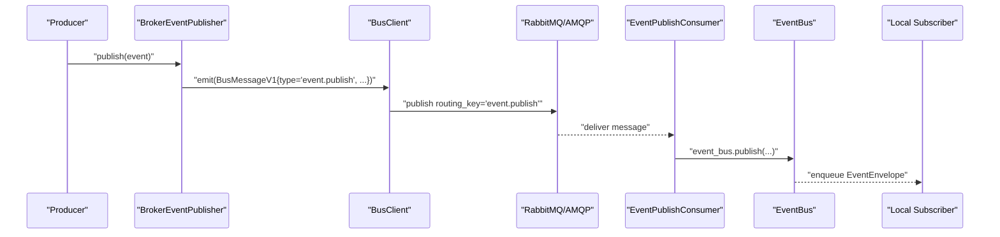

**Diagram sources**
- [core/events/broker.py:21-56](file://core/events/broker.py#L21-L56)
- [core/bus/client.py:77-100](file://core/bus/client.py#L77-L100)
- [core/bus/constants.py:16](file://core/bus/constants.py#L16)
- [core/events/broker.py:66-91](file://core/events/broker.py#L66-L91)
- [core/events/bus.py:17-46](file://core/events/bus.py#L17-L46)

## Detailed Component Analysis

### In-Memory EventBus
- Maintains a set of asyncio.Queue subscribers with configurable capacity.
- Publish increments a monotonic revision and stamps envelopes with timestamps and correlation IDs.
- On publish, drains full queues and enqueues to all subscribers.
- Provides subscribe/unsubscribe helpers.

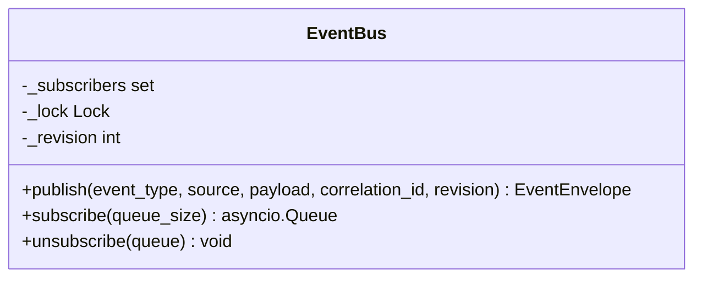

**Diagram sources**
- [core/events/bus.py:11-58](file://core/events/bus.py#L11-L58)

**Section sources**
- [core/events/bus.py:11-58](file://core/events/bus.py#L11-L58)

### BrokerEventPublisher
- Builds an EventEnvelope with monotonic revision and optional correlation ID.
- Wraps payload into EventPublishPayload and emits a BusMessageV1 with type "event.publish".
- Uses ROUTING_EVENT_PUBLISH to deliver to the broker.

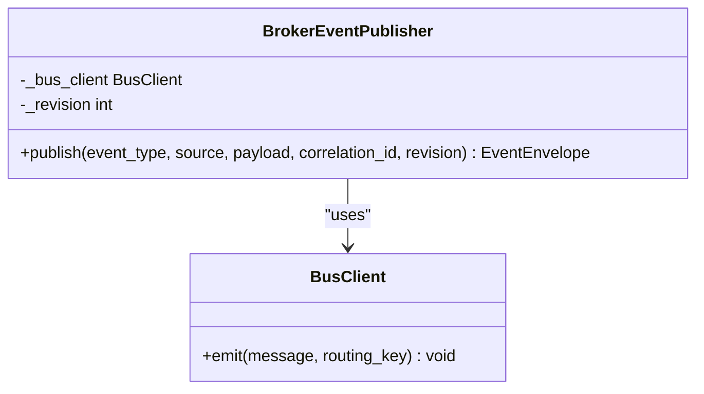

**Diagram sources**
- [core/events/broker.py:16-56](file://core/events/broker.py#L16-L56)
- [core/bus/client.py:77-100](file://core/bus/client.py#L77-L100)

**Section sources**
- [core/events/broker.py:16-56](file://core/events/broker.py#L16-L56)
- [core/contracts/bus.py:89-95](file://core/contracts/bus.py#L89-L95)
- [core/contracts/models.py:112-121](file://core/contracts/models.py#L112-L121)
- [core/bus/constants.py:16](file://core/bus/constants.py#L16)

### EventPublishConsumer
- Registers a durable consumer on QUEUE_EVENTS bound to ROUTING_EVENT_PUBLISH.
- Validates incoming BusMessageV1 type and payload, then forwards to EventBus.

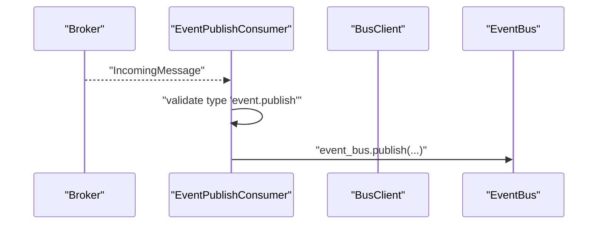

**Diagram sources**
- [core/events/broker.py:59-91](file://core/events/broker.py#L59-L91)
- [core/bus/constants.py:8](file://core/bus/constants.py#L8)
- [core/bus/constants.py:16](file://core/bus/constants.py#L16)

**Section sources**
- [core/events/broker.py:59-91](file://core/events/broker.py#L59-L91)

### EventPublisher Protocol
- Defines a uniform publish signature for event publishers, enabling polymorphism between in-memory and broker-backed publishers.

**Section sources**
- [core/events/protocols.py:8-21](file://core/events/protocols.py#L8-L21)

### SSE Formatting
- Converts an EventEnvelope to a line-delimited SSE string with id, event, and data fields.

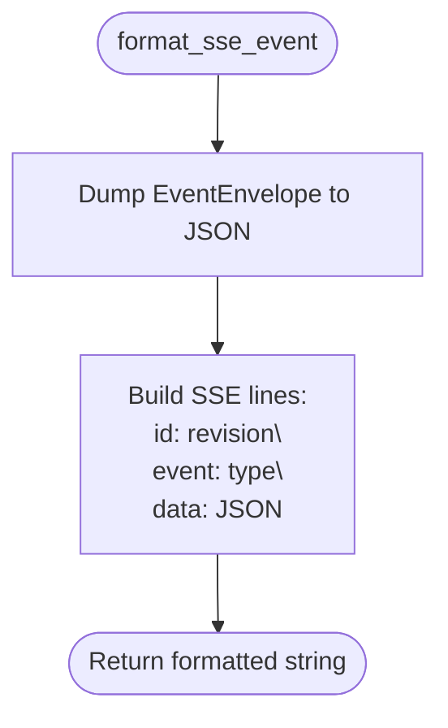

**Diagram sources**
- [core/events/sse.py:8-14](file://core/events/sse.py#L8-L14)
- [core/contracts/models.py:112-121](file://core/contracts/models.py#L112-L121)

**Section sources**
- [core/events/sse.py:8-14](file://core/events/sse.py#L8-L14)

### Contracts and Envelope Formats
- EventEnvelope: Core event shape with id, type, event_version, revision, ts, source, correlation_id, payload.
- BusMessageV1: Transport wrapper for RPC and pub/sub with id, ts, type, plugin_id, payload, reply_to, correlation_id, trace.
- EventPublishPayload: Payload for "event.publish" messages.

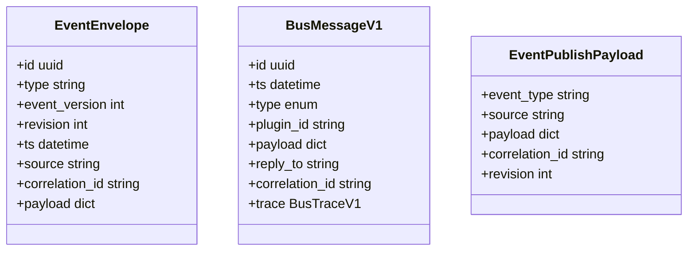

**Diagram sources**
- [core/contracts/models.py:112-121](file://core/contracts/models.py#L112-L121)
- [core/contracts/bus.py:30-46](file://core/contracts/bus.py#L30-L46)
- [core/contracts/bus.py:89-95](file://core/contracts/bus.py#L89-L95)

**Section sources**
- [core/contracts/models.py:112-121](file://core/contracts/models.py#L112-L121)
- [core/contracts/bus.py:30-46](file://core/contracts/bus.py#L30-L46)
- [core/contracts/bus.py:89-95](file://core/contracts/bus.py#L89-L95)

### Broker Integration Details
- BusClient supports memory mode and AMQP mode, declares topology, and handles RPC replies.
- Memory mode simulates routing and delivery for testing.
- Routing keys and queue names are centralized in constants.

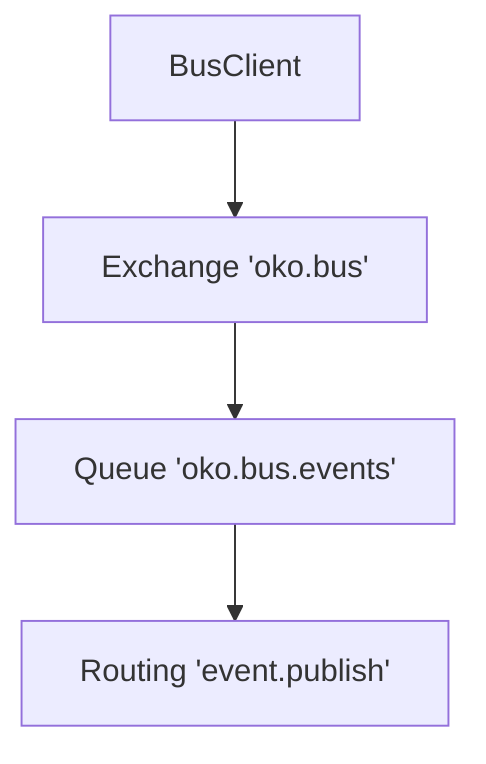

**Diagram sources**
- [core/bus/client.py:224-241](file://core/bus/client.py#L224-L241)
- [core/bus/constants.py:3-18](file://core/bus/constants.py#L3-L18)

**Section sources**
- [core/bus/client.py:34-290](file://core/bus/client.py#L34-L290)
- [core/bus/constants.py:1-47](file://core/bus/constants.py#L1-L47)

### Practical Examples: Health Application
- HealthCheckRequestConsumer: Listens for "health.check.request", executes checks, and emits "health.check.result".
- HealthCheckResultConsumer: Receives results, evaluates health, persists state, and publishes "health.status.changed" or "health.status.updated" via EventPublisher.
- HealthChecker: Implements the actual check logic for http/tcp/icmp targets.

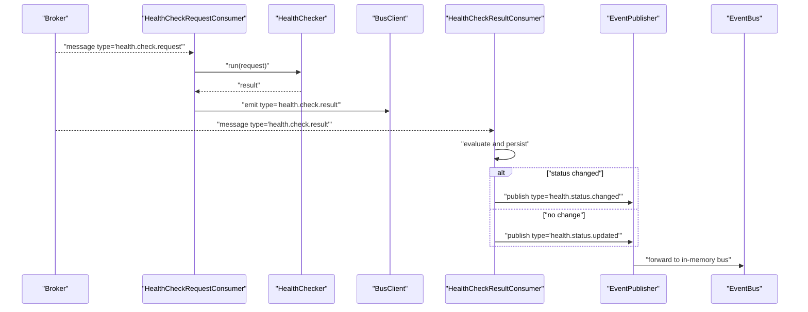

**Diagram sources**
- [apps/health/bus_handlers/check_request_consumer.py:26-44](file://apps/health/bus_handlers/check_request_consumer.py#L26-L44)
- [apps/health/service/checkers.py:20-199](file://apps/health/service/checkers.py#L20-L199)
- [apps/health/bus_handlers/check_result_consumer.py:39-102](file://apps/health/bus_handlers/check_result_consumer.py#L39-L102)
- [core/events/protocols.py:8-21](file://core/events/protocols.py#L8-L21)

**Section sources**
- [apps/health/bus_handlers/check_request_consumer.py:10-48](file://apps/health/bus_handlers/check_request_consumer.py#L10-L48)
- [apps/health/bus_handlers/check_result_consumer.py:14-106](file://apps/health/bus_handlers/check_result_consumer.py#L14-L106)
- [apps/health/service/checkers.py:15-199](file://apps/health/service/checkers.py#L15-L199)

### Consumer Registration and Lifecycle
- AppContainer wires BusClient, EventBus, BrokerEventPublisher, EventPublishConsumer, and health consumers.
- Startup/Shutdown manage consumer lifecycle and database initialization.

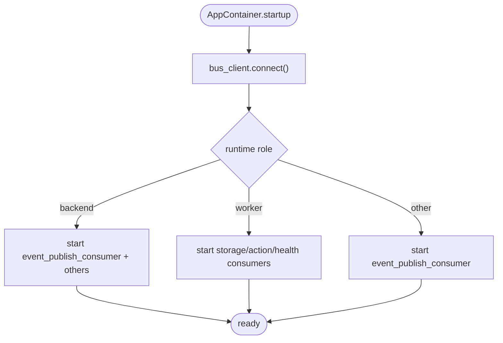

**Diagram sources**
- [config/container.py:105-174](file://config/container.py#L105-L174)

**Section sources**
- [config/container.py:105-174](file://config/container.py#L105-L174)

## Dependency Analysis
- EventBus depends on EventEnvelope and asyncio primitives.
- BrokerEventPublisher depends on BusClient, BusMessageV1, EventPublishPayload, and EventEnvelope.
- EventPublishConsumer depends on BusClient, BusMessageV1, EventPublishPayload, and EventBus.
- SSE formatter depends on EventEnvelope.
- Health consumers depend on BusClient and EventPublisher protocol.

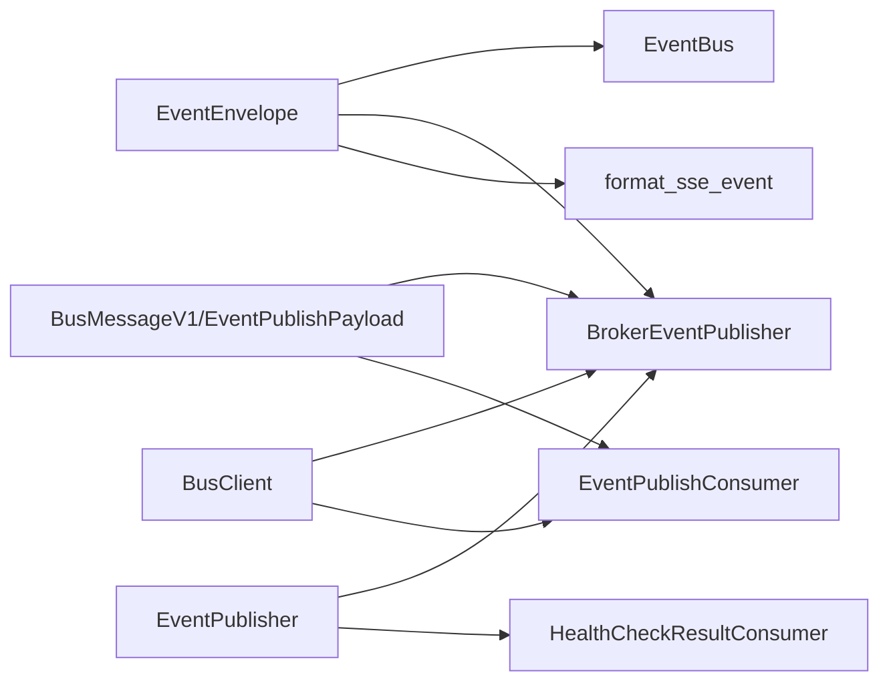

**Diagram sources**
- [core/events/bus.py:11-58](file://core/events/bus.py#L11-L58)
- [core/events/broker.py:16-95](file://core/events/broker.py#L16-L95)
- [core/events/sse.py:8-14](file://core/events/sse.py#L8-L14)
- [core/contracts/models.py:112-121](file://core/contracts/models.py#L112-L121)
- [core/contracts/bus.py:30-95](file://core/contracts/bus.py#L30-L95)
- [apps/health/bus_handlers/check_result_consumer.py:14-106](file://apps/health/bus_handlers/check_result_consumer.py#L14-L106)

**Section sources**
- [core/events/bus.py:11-58](file://core/events/bus.py#L11-L58)
- [core/events/broker.py:16-95](file://core/events/broker.py#L16-L95)
- [core/events/sse.py:8-14](file://core/events/sse.py#L8-L14)
- [core/contracts/models.py:112-121](file://core/contracts/models.py#L112-L121)
- [core/contracts/bus.py:30-95](file://core/contracts/bus.py#L30-L95)
- [apps/health/bus_handlers/check_result_consumer.py:14-106](file://apps/health/bus_handlers/check_result_consumer.py#L14-L106)

## Performance Considerations
- Backpressure handling: EventBus drops oldest items on full queues to prevent stalls.
- Queue sizing: Use subscribe(queue_size=...) to tune throughput vs. memory.
- Broker memory mode: Useful for tests but bypasses durability; production should use AMQP with durable queues and exchanges.
- Prefetch tuning: BusClient constructor accepts prefetch_count to balance throughput and fairness.
- Revision sequencing: Monotonic revision helps consumers track ordering and detect gaps.
- SSE streaming: Keep payloads minimal; SSE framing overhead is small but network bandwidth still matters.

[No sources needed since this section provides general guidance]

## Troubleshooting Guide
Common issues and remedies:
- No events received by consumers:
  - Verify broker connectivity and exchange/queue bindings.
  - Confirm routing key matches ROUTING_EVENT_PUBLISH.
- Duplicate or out-of-order events:
  - Check revision sequencing and consumer processing order.
- Slow consumers causing backlog:
  - Increase queue_size in subscribe or reduce payload size.
  - Consider offloading heavy work to background tasks.
- SSE not updating:
  - Ensure the SSE formatter is applied and client reconnects on errors.
- RPC timeouts:
  - Adjust timeout_sec for BusClient.call and related RPC clients.

**Section sources**
- [core/bus/client.py:101-166](file://core/bus/client.py#L101-L166)
- [core/bus/constants.py:16](file://core/bus/constants.py#L16)
- [core/events/bus.py:38-46](file://core/events/bus.py#L38-L46)

## Conclusion
The event system provides a clean separation between in-memory and distributed eventing. Producers use a unified EventPublisher interface, while BrokerEventPublisher integrates with the message bus for cross-service communication. Consumers can subscribe locally or rely on broker consumers that forward events to the in-memory bus. SSE formatting enables real-time browser updates. With proper queue sizing, revision sequencing, and broker configuration, the system scales from single-node development to distributed deployments.