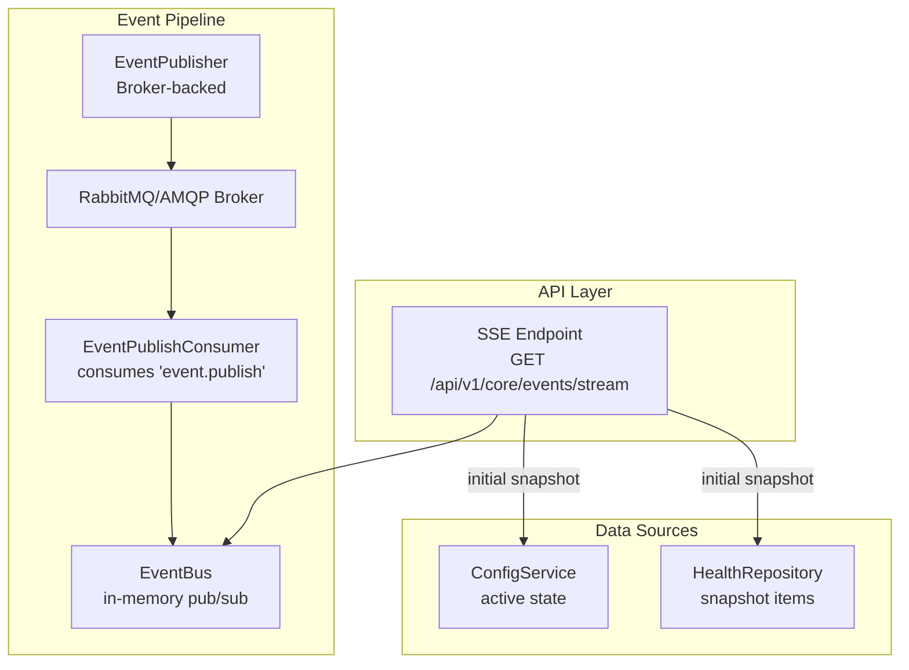
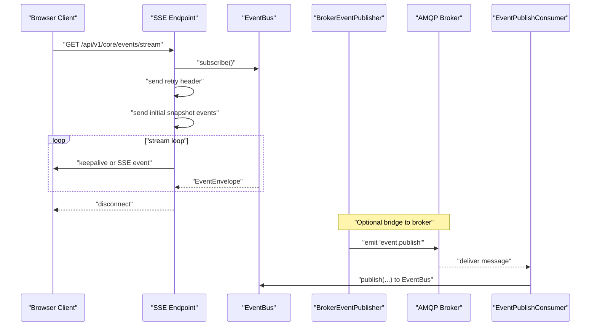
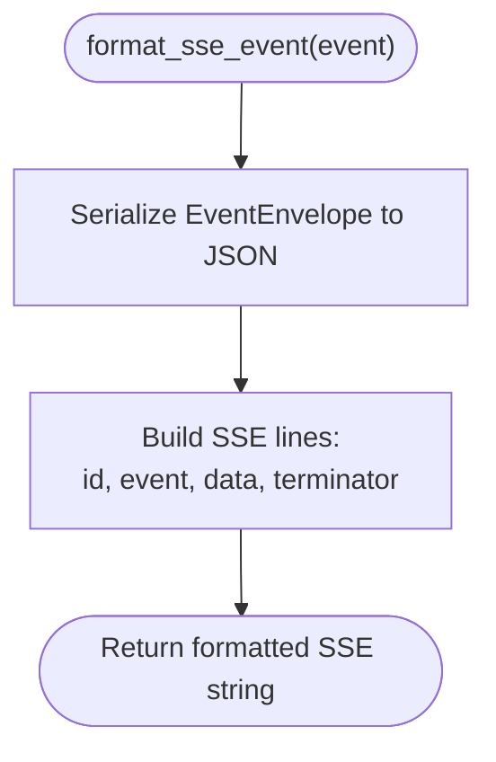
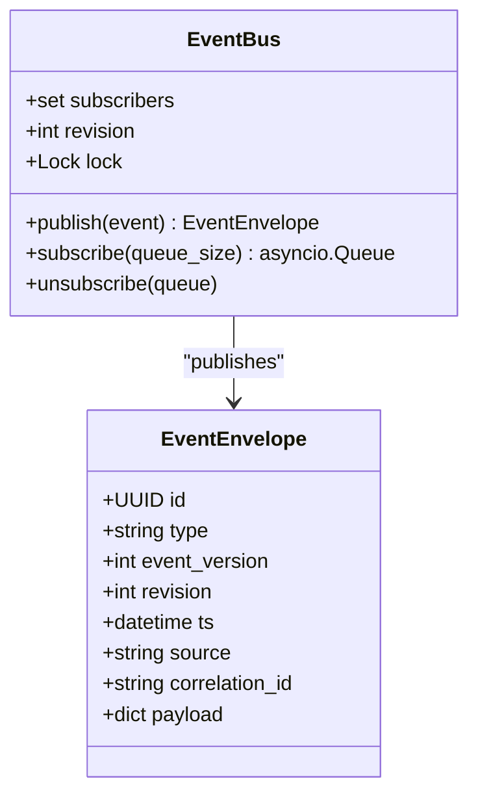
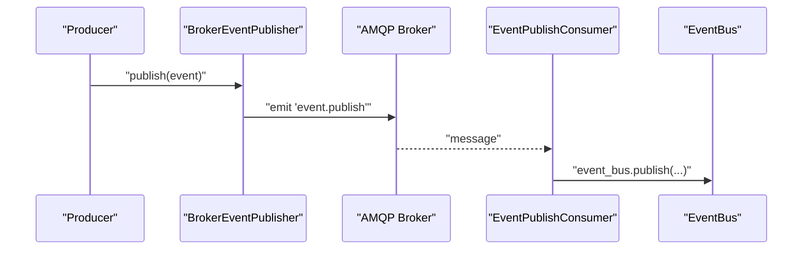
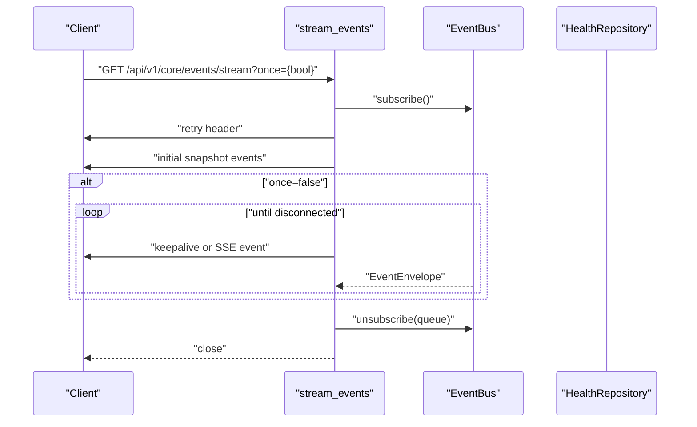
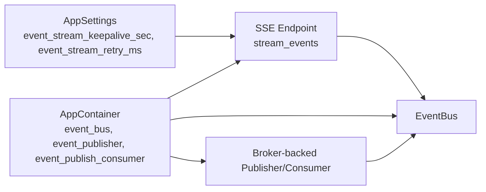

# Server-Sent Events (SSE)

<cite>
**Referenced Files in This Document**
- [sse.py](file://core/events/sse.py)
- [broker.py](file://core/events/broker.py)
- [bus.py](file://core/events/bus.py)
- [protocols.py](file://core/events/protocols.py)
- [models.py](file://core/contracts/models.py)
- [core.py](file://api/v1/core.py)
- [settings.py](file://config/settings.py)
- [container.py](file://config/container.py)
- [repository.py](file://apps/health/service/repository.py)
</cite>

## Table of Contents
1. [Introduction](#introduction)
2. [Project Structure](#project-structure)
3. [Core Components](#core-components)
4. [Architecture Overview](#architecture-overview)
5. [Detailed Component Analysis](#detailed-component-analysis)
6. [Dependency Analysis](#dependency-analysis)
7. [Performance Considerations](#performance-considerations)
8. [Troubleshooting Guide](#troubleshooting-guide)
9. [Conclusion](#conclusion)
10. [Appendices](#appendices)

## Introduction
This document explains the Server-Sent Events (SSE) implementation and real-time event streaming in the backend. It covers the SSE protocol framing, connection lifecycle, event publishing pipeline, and streaming endpoint behavior. It also documents configuration knobs for keepalive and retry, client-side consumption patterns, and operational considerations such as filtering, scaling, and graceful degradation.

## Project Structure
The SSE feature spans several modules:
- Event model and formatter: EventEnvelope and SSE formatter
- Event bus and publisher: in-memory event distribution and broker-backed publisher
- Streaming endpoint: FastAPI route that streams events to clients
- Configuration: SSE-specific settings for keepalive and retry
- Container wiring: event bus, publisher, and consumers initialization
- Health snapshot data: used to seed initial snapshots for clients

**Diagram sources**
- [core.py:311-373](file://api/v1/core.py#L311-L373)
- [bus.py:11-57](file://core/events/bus.py#L11-L57)
- [broker.py:16-94](file://core/events/broker.py#L16-L94)
- [container.py:280-342](file://config/container.py#L280-L342)
- [repository.py:181-211](file://apps/health/service/repository.py#L181-L211)

**Section sources**
- [core.py:311-373](file://api/v1/core.py#L311-L373)
- [container.py:280-342](file://config/container.py#L280-L342)

## Core Components
- SSE formatter: Converts an EventEnvelope into a Server-Sent Events message with id, event, and data fields.
- EventBus: In-memory publish-subscribe for events, backed by asyncio queues per subscriber.
- Broker-backed publisher/consumer: Bridges in-process events to the AMQP broker and back to the in-memory bus.
- SSE endpoint: Subscribes to the EventBus, sends initial snapshot(s), and streams subsequent events.
- Settings: Controls keepalive interval and reconnect retry delay.

Key responsibilities and interactions are detailed in the following sections.

**Section sources**
- [sse.py:8-10](file://core/events/sse.py#L8-L10)
- [bus.py:11-57](file://core/events/bus.py#L11-L57)
- [broker.py:16-94](file://core/events/broker.py#L16-L94)
- [core.py:311-373](file://api/v1/core.py#L311-L373)
- [settings.py:54-55](file://config/settings.py#L54-L55)

## Architecture Overview
The SSE streaming pipeline is built around an in-memory EventBus and optional broker-backed propagation. Clients connect to the SSE endpoint and receive:
- A retry header to control client reconnection timing
- An initial snapshot (core state and health snapshot)
- Subsequent live events as they arrive on the EventBus

**Diagram sources**
- [core.py:311-373](file://api/v1/core.py#L311-L373)
- [bus.py:17-46](file://core/events/bus.py#L17-L46)
- [broker.py:16-94](file://core/events/broker.py#L16-L94)

## Detailed Component Analysis

### SSE Formatter
The formatter transforms an EventEnvelope into a text/event-stream message. It serializes the event payload and sets the id, event type, and data fields. This ensures clients can rely on the revision as an event identifier.

**Diagram sources**
- [sse.py:8-10](file://core/events/sse.py#L8-L10)
- [models.py:112-121](file://core/contracts/models.py#L112-L121)

**Section sources**
- [sse.py:8-10](file://core/events/sse.py#L8-L10)
- [models.py:112-121](file://core/contracts/models.py#L112-L121)

### EventBus and Subscription Lifecycle
The EventBus maintains a set of asyncio queues for subscribers. Publishing increments a revision counter and enqueues the event to all queues, dropping oldest items if a queue becomes full. Subscriptions are created with a configurable queue size.

**Diagram sources**
- [bus.py:11-57](file://core/events/bus.py#L11-L57)
- [models.py:112-121](file://core/contracts/models.py#L112-L121)

**Section sources**
- [bus.py:11-57](file://core/events/bus.py#L11-L57)
- [models.py:112-121](file://core/contracts/models.py#L112-L121)

### Broker-backed Publisher and Consumer
Events can be published via a broker-backed publisher that emits a standardized message to the broker. A consumer listens for these messages and republishes them into the in-memory EventBus, enabling multi-instance distribution.

**Diagram sources**
- [broker.py:16-94](file://core/events/broker.py#L16-L94)

**Section sources**
- [broker.py:16-94](file://core/events/broker.py#L16-L94)

### SSE Streaming Endpoint
The SSE endpoint performs the following:
- Subscribes to the EventBus
- Sends a retry header derived from settings
- Emits initial snapshot events (core state and health snapshot)
- Streams keepalive messages when no events arrive within the keepalive interval
- Closes the stream gracefully when the client disconnects or when once mode is used

**Diagram sources**
- [core.py:311-373](file://api/v1/core.py#L311-L373)

**Section sources**
- [core.py:311-373](file://api/v1/core.py#L311-L373)

### Initial Snapshot Data
The endpoint constructs two initial snapshot events:
- Core state snapshot: includes active revision and state sequence
- Health snapshot: includes enabled services and their computed status

These snapshots are derived from the ConfigService and HealthRepository respectively.

**Section sources**
- [core.py:324-349](file://api/v1/core.py#L324-L349)
- [repository.py:181-211](file://apps/health/service/repository.py#L181-L211)

## Dependency Analysis
The SSE stack integrates tightly with the container and settings:
- The container wires an EventBus and a Broker-backed EventPublisher
- The SSE endpoint reads settings for keepalive and retry
- The EventPublishConsumer subscribes to the broker and forwards events to the EventBus

**Diagram sources**
- [settings.py:54-55](file://config/settings.py#L54-L55)
- [container.py:280-342](file://config/container.py#L280-L342)
- [core.py:311-373](file://api/v1/core.py#L311-L373)

**Section sources**
- [settings.py:54-55](file://config/settings.py#L54-L55)
- [container.py:280-342](file://config/container.py#L280-L342)
- [core.py:311-373](file://api/v1/core.py#L311-L373)

## Performance Considerations
- Queue sizing: EventBus subscriptions use asyncio.Queue with a configurable maxsize. Larger queues reduce dropped events under bursty loads but increase memory usage.
- Backpressure: When a queue is full, the oldest item is dropped before adding the new event. Tune queue_size per deployment needs.
- Keepalive interval: Controlled by event_stream_keepalive_sec. Short intervals reduce perceived staleness but increase server CPU and network overhead.
- Retry header: event_stream_retry_ms controls client-side reconnection timing. Lower values speed up recovery after transient disconnections.
- Throughput: Broker-backed propagation adds latency and requires reliable broker connectivity. For high-throughput scenarios, consider tuning broker prefetch and connection pooling.

[No sources needed since this section provides general guidance]

## Troubleshooting Guide
Common issues and remedies:
- Client disconnects immediately
  - Verify the SSE endpoint is reachable and CORS/cache headers are configured appropriately.
  - Confirm the client respects the retry header and reconnection policy.
- No events received after initial snapshot
  - Ensure the EventBus has subscribers and that events are being published.
  - If using broker-backed propagation, confirm the EventPublishConsumer is running and connected to the broker.
- Frequent keepalive pings
  - Increase event_stream_keepalive_sec to reduce ping frequency.
- Client fails to reconnect
  - Adjust event_stream_retry_ms to a value suitable for your network conditions.
- Memory pressure or dropped events
  - Increase queue_size for the EventBus subscription or reduce event volume.

Operational checks:
- Confirm container startup initializes the event bus and consumers as appropriate for the runtime role.
- Validate that the broker URL and credentials are correct if using broker-backed propagation.

**Section sources**
- [settings.py:54-55](file://config/settings.py#L54-L55)
- [container.py:105-173](file://config/container.py#L105-L173)

## Conclusion
The SSE implementation provides a robust, scalable mechanism for real-time event streaming. It combines an in-memory EventBus for local distribution with optional broker-backed propagation for multi-instance setups. The streaming endpoint offers initial snapshots, periodic keepalive, and clean connection lifecycle management, with tunable performance characteristics through configuration.

[No sources needed since this section summarizes without analyzing specific files]

## Appendices

### SSE Protocol Fields and Behavior
- id: Set to the event revision to support client-side idempotent handling and reconnection.
- event: Set to the event type for client-side routing.
- data: Set to the serialized EventEnvelope payload.
- keepalive: Sent periodically when no events arrive within the keepalive interval.
- retry: Sent once at the start to instruct clients on reconnection timing.

**Section sources**
- [sse.py:8-10](file://core/events/sse.py#L8-L10)
- [core.py:320-361](file://api/v1/core.py#L320-L361)

### Client Connection Lifecycle
- Subscribe to the SSE endpoint
- Apply the retry header for automatic reconnection
- Handle initial snapshot events
- Stream live events and keepalive messages
- Gracefully handle disconnects and reconnections

**Section sources**
- [core.py:311-373](file://api/v1/core.py#L311-L373)

### Event Filtering and Selective Subscription
- Current implementation streams all events from the EventBus to subscribers.
- To implement client-side filtering, clients can filter by event type or payload fields.
- For server-side filtering, extend the subscription mechanism to accept filters and route filtered events to separate queues.

[No sources needed since this section provides general guidance]

### Connection Scaling Considerations
- Use broker-backed propagation to scale out event producers and consumers across instances.
- Monitor broker throughput and adjust prefetch count and connection pool sizes.
- Consider partitioning events by type or source to reduce contention on a single EventBus.

[No sources needed since this section provides general guidance]

### Browser Compatibility and Degradation
- SSE is supported in modern browsers. For older environments, consider fallback strategies such as long-polling or WebSockets.
- Ensure the server sets cache-control: no-cache, no-transform and x-accel-buffering: no headers for NGINX/Apache to prevent buffering.
- Provide a health check endpoint to signal readiness and degrade gracefully when the event pipeline is unavailable.

[No sources needed since this section provides general guidance]