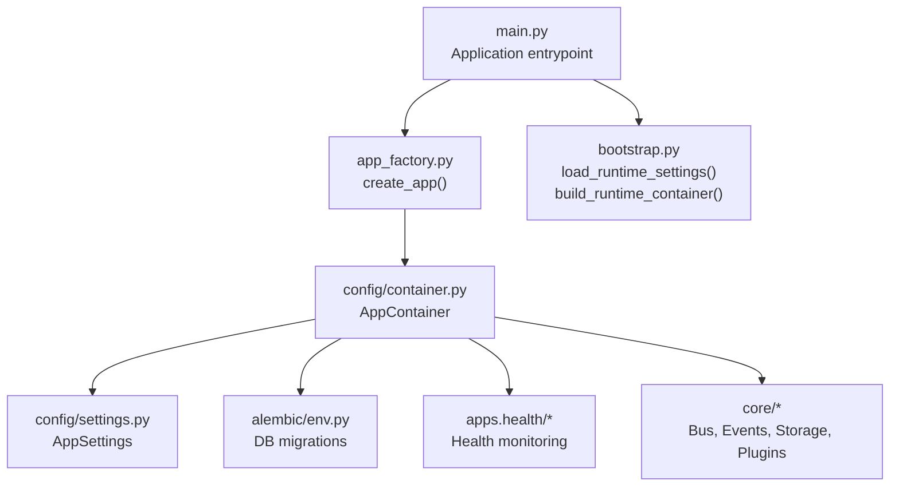
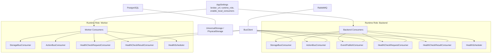
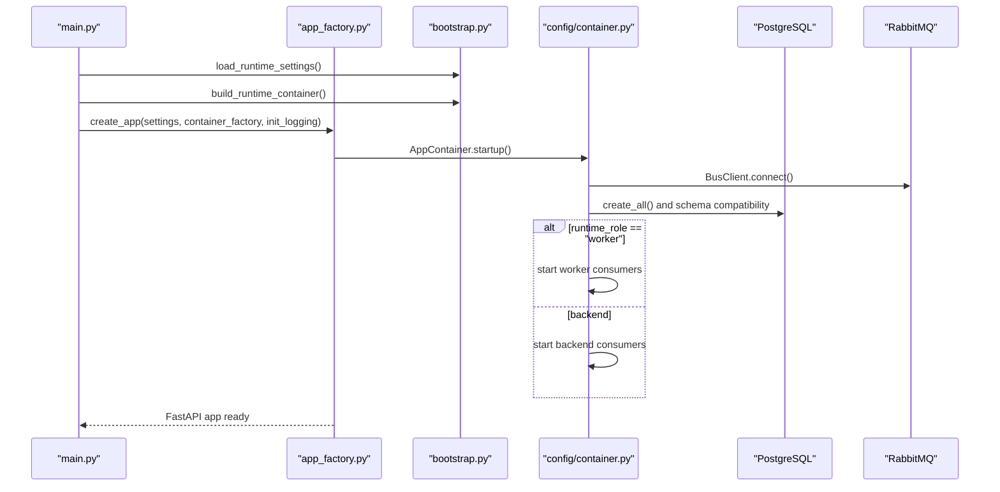
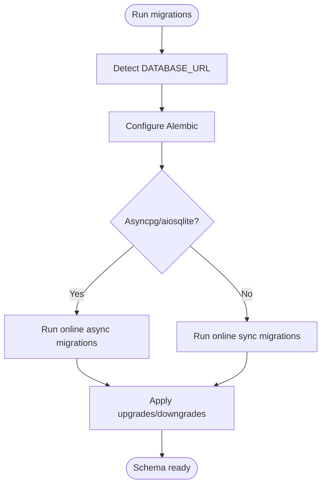
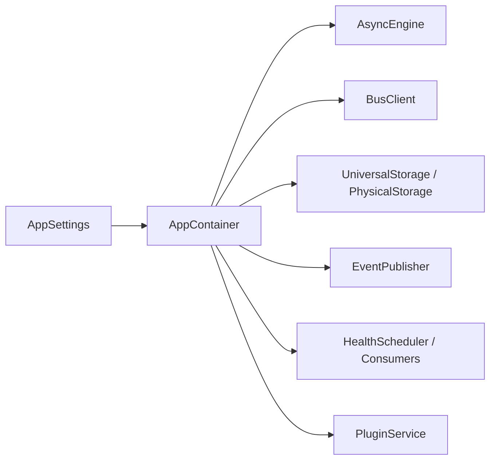

# Getting Started

<cite>
**Referenced Files in This Document**
- [main.py](file://main.py)
- [bootstrap.py](file://bootstrap.py)
- [app_factory.py](file://app_factory.py)
- [config/settings.py](file://config/settings.py)
- [config/container.py](file://config/container.py)
- [alembic/env.py](file://alembic/env.py)
- [alembic/versions/20260223_0001_init_postgres_core.py](file://alembic/versions/20260223_0001_init_postgres_core.py)
- [contracts/storage/tables.yaml](file://contracts/storage/tables.yaml)
- [plugins/autodiscover/page_manifest.yaml](file://plugins/autodiscover/page_manifest.yaml)
</cite>

## Table of Contents
1. [Introduction](#introduction)
2. [Project Structure](#project-structure)
3. [Core Components](#core-components)
4. [Architecture Overview](#architecture-overview)
5. [Detailed Component Analysis](#detailed-component-analysis)
6. [Dependency Analysis](#dependency-analysis)
7. [Performance Considerations](#performance-considerations)
8. [Troubleshooting Guide](#troubleshooting-guide)
9. [Conclusion](#conclusion)
10. [Appendices](#appendices)

## Introduction
This guide helps you install, configure, and run the Oko Dashboard backend locally. It covers prerequisites, environment setup, database and broker initialization, application startup, essential environment variables, and how to verify that the system is working. You will also find quick start examples, common setup issues, and development tips.

## Project Structure
The backend is a FastAPI application that boots via a factory and container pattern. It loads runtime settings, initializes logging, builds a dependency injection container, and starts consumers and services according to the configured runtime role.

**Diagram sources**
- [main.py:17-21](file://main.py#L17-L21)
- [app_factory.py:87-123](file://app_factory.py#L87-L123)
- [bootstrap.py:16-23](file://bootstrap.py#L16-L23)
- [config/container.py:252-423](file://config/container.py#L252-L423)
- [config/settings.py:14-124](file://config/settings.py#L14-L124)
- [alembic/env.py:19-79](file://alembic/env.py#L19-L79)

**Section sources**
- [main.py:1-24](file://main.py#L1-L24)
- [bootstrap.py:1-32](file://bootstrap.py#L1-L32)
- [app_factory.py:1-133](file://app_factory.py#L1-L133)
- [config/container.py:1-427](file://config/container.py#L1-L427)
- [config/settings.py:1-128](file://config/settings.py#L1-L128)
- [alembic/env.py:1-80](file://alembic/env.py#L1-L80)

## Core Components
- Application entrypoint: creates the FastAPI app and wires lifecycle hooks.
- Bootstrap: resolves base directory, loads settings, and builds the container.
- Container: orchestrates DB, broker, storage, events, health checks, and plugin subsystems.
- Settings: validates and normalizes environment-driven configuration.
- Migrations: initialize the Postgres schema for core and plugin storage.

**Section sources**
- [main.py:7-21](file://main.py#L7-L21)
- [bootstrap.py:16-23](file://bootstrap.py#L16-L23)
- [config/container.py:50-174](file://config/container.py#L50-L174)
- [config/settings.py:14-124](file://config/settings.py#L14-L124)
- [alembic/versions/20260223_0001_init_postgres_core.py:15-143](file://alembic/versions/20260223_0001_init_postgres_core.py#L15-L143)

## Architecture Overview
The backend runs as either a backend or worker process. Depending on the runtime role and broker configuration, it starts local consumers for storage, actions, events, health requests/results, and the health scheduler. It also manages plugin services and watchers.

**Diagram sources**
- [config/container.py:105-173](file://config/container.py#L105-L173)
- [config/settings.py:32-47](file://config/settings.py#L32-L47)

**Section sources**
- [config/container.py:105-173](file://config/container.py#L105-L173)
- [config/settings.py:32-47](file://config/settings.py#L32-L47)

## Detailed Component Analysis

### Prerequisites
- Python 3.x (development tested on recent 3.10+)
- PostgreSQL (tested with recent versions)
- RabbitMQ (AMQP broker)

These are required because:
- The application connects to PostgreSQL using an async driver and runs migrations.
- The application connects to RabbitMQ for internal messaging and bus operations.

**Section sources**
- [config/settings.py:32-39](file://config/settings.py#L32-L39)
- [alembic/env.py:19-79](file://alembic/env.py#L19-L79)

### Step-by-Step Installation
1. Prepare Python environment
   - Create and activate a virtual environment.
   - Install dependencies using pip (no explicit requirements.txt in the provided context; ensure dependencies match the imports in the codebase).

2. Set up PostgreSQL
   - Create a database and user for the application.
   - Confirm connectivity using the default connection string format shown in settings.

3. Set up RabbitMQ
   - Ensure the broker is reachable at the default AMQP URL shown in settings.

4. Initialize the database schema
   - Run migrations to create core tables and plugin storage schemas.

5. Configure environment variables
   - Set variables documented below to customize behavior.

6. Start the application
   - Run the FastAPI application using your preferred ASGI server.

**Section sources**
- [config/settings.py:32-39](file://config/settings.py#L32-L39)
- [alembic/env.py:19-79](file://alembic/env.py#L19-L79)

### Environment Setup and Essential Variables
Key environment variables and defaults:
- DATABASE_URL: Postgres connection string for asyncpg.
- BROKER_URL: RabbitMQ connection string for AMQP.
- OKO_RUNTIME_ROLE: "backend" or "worker".
- OKO_ENABLE_LOCAL_CONSUMERS: Enable local consumers when running in memory bus or when explicitly enabled.
- OKO_BROKER_PREFETCH_COUNT: Concurrency control for broker prefetch.
- OKO_HEALTH_*: Health monitoring configuration (window size, retention days, intervals, timeouts, latency thresholds).
- OKO_EVENTS_KEEPALIVE_SEC and OKO_EVENTS_RETRY_MS: SSE event stream tuning.
- OKO_ACTIONS_EXECUTE_ENABLED: Whether actions can be executed.
- OKO_STORAGE_RPC_TIMEOUT_SEC and OKO_ACTION_RPC_TIMEOUT_SEC: RPC timeouts.
- OKO_BOOTSTRAP_CONFIG_FILE: Path to the bootstrap dashboard config file.
- OKO_STORE_URL: Optional plugin store service URL.
- OKO_PLUGIN_WATCH_POLL_SEC: Poll interval for plugin watching.

Notes:
- Some variables are aliases for fields in AppSettings.
- Defaults are embedded in the settings class and validated at runtime.

**Section sources**
- [config/settings.py:21-93](file://config/settings.py#L21-L93)

### Initial Configuration
- Static and media directories:
  - static_dir and media_dir are configurable; media_dir is ensured to exist.
- Index file:
  - index_file points to a frontend template; missing file yields a 503 on root.
- Bootstrap config:
  - config_file points to a dashboard YAML; if present, it is imported during startup bootstrap.

**Section sources**
- [config/settings.py:21-31](file://config/settings.py#L21-L31)
- [app_factory.py:111-120](file://app_factory.py#L111-L120)
- [config/container.py:308-312](file://config/container.py#L308-L312)

### Application Startup Process
- Load runtime settings and logging.
- Build the container with DB engine, repositories, bus clients, storage, event publisher, health components, and plugin service.
- Start consumers based on runtime role and broker configuration.
- Mount static/media routes and include the API v1 router.
- Serve the root index file if present; otherwise return a 503.

**Diagram sources**
- [main.py:7-21](file://main.py#L7-L21)
- [bootstrap.py:16-23](file://bootstrap.py#L16-L23)
- [app_factory.py:87-123](file://app_factory.py#L87-L123)
- [config/container.py:105-173](file://config/container.py#L105-L173)

**Section sources**
- [main.py:7-21](file://main.py#L7-L21)
- [bootstrap.py:16-23](file://bootstrap.py#L16-L23)
- [app_factory.py:30-46](file://app_factory.py#L30-L46)
- [config/container.py:105-173](file://config/container.py#L105-L173)

### Quick Start Examples
- Local run (ASGI server example)
  - Use uvicorn or daphne to serve the exported app.
  - Example command: uvicorn main:app --host 0.0.0.0 --port 8000
- Verify installation
  - Root endpoint: expect a 503 if frontend template is missing; otherwise serve the index file.
  - OpenAPI docs: /docs and /redoc.
  - API v1: base router mounted under /api/v1.
- Access basic endpoints
  - Use /docs or /redoc to explore API.
  - Plugin pages and APIs are registered dynamically by the plugin service.

**Section sources**
- [app_factory.py:93-123](file://app_factory.py#L93-L123)
- [plugins/autodiscover/page_manifest.yaml:17-58](file://plugins/autodiscover/page_manifest.yaml#L17-L58)

### Database Initialization
- Alembic is used to manage schema changes.
- The initial migration creates core tables and plugin storage indexes.
- The container ensures tables are created and schema compatibility is checked at startup.

**Diagram sources**
- [alembic/env.py:19-79](file://alembic/env.py#L19-L79)
- [alembic/versions/20260223_0001_init_postgres_core.py:15-143](file://alembic/versions/20260223_0001_init_postgres_core.py#L15-L143)

**Section sources**
- [alembic/env.py:19-79](file://alembic/env.py#L19-L79)
- [alembic/versions/20260223_0001_init_postgres_core.py:15-143](file://alembic/versions/20260223_0001_init_postgres_core.py#L15-L143)
- [config/container.py:107-109](file://config/container.py#L107-L109)

### Plugin Storage Contracts
- Plugin storage schemas are defined in YAML and loaded at runtime to configure storage capabilities per plugin.
- These specs define tables, primary keys, columns, and indexes used by plugin storage.

**Section sources**
- [contracts/storage/tables.yaml:1-85](file://contracts/storage/tables.yaml#L1-L85)
- [config/container.py:180-221](file://config/container.py#L180-L221)

## Dependency Analysis
- The application depends on:
  - FastAPI for routing and ASGI lifecycle.
  - SQLAlchemy async engine for Postgres.
  - RabbitMQ via a bus client for internal messaging.
  - Pydantic settings for configuration validation.
- Runtime consumers are conditionally started based on settings and broker URL.

**Diagram sources**
- [config/settings.py:14-124](file://config/settings.py#L14-L124)
- [config/container.py:252-423](file://config/container.py#L252-L423)

**Section sources**
- [config/settings.py:14-124](file://config/settings.py#L14-L124)
- [config/container.py:252-423](file://config/container.py#L252-L423)

## Performance Considerations
- Adjust OKO_BROKER_PREFETCH_COUNT to balance throughput and fairness.
- Tune health scheduler tick and heartbeat intervals for desired responsiveness vs. overhead.
- Control RPC timeouts to prevent long waits under load.
- Monitor plugin watch poll interval to balance freshness and CPU usage.

[No sources needed since this section provides general guidance]

## Troubleshooting Guide
- Database connectivity failures
  - Verify DATABASE_URL and PostgreSQL availability.
  - Ensure migrations ran successfully.
- Broker connectivity failures
  - Verify BROKER_URL and RabbitMQ availability.
  - Check OKO_RUNTIME_ROLE and OKO_ENABLE_LOCAL_CONSUMERS for consumer startup.
- Missing root page
  - index_file must exist; otherwise root returns 503.
- Health monitoring not updating
  - Confirm health scheduler consumers are running and broker is reachable.
- Plugin pages not appearing
  - Ensure plugin service is initialized and plugin directories exist.

**Section sources**
- [config/settings.py:32-39](file://config/settings.py#L32-L39)
- [config/container.py:116-145](file://config/container.py#L116-L145)
- [app_factory.py:111-120](file://app_factory.py#L111-L120)

## Conclusion
You now have the essentials to install, configure, and run the Oko Dashboard backend locally. Start with prerequisites, initialize the database, set environment variables, and launch the application. Use the built-in docs endpoints to explore the API and confirm that consumers are active.

[No sources needed since this section summarizes without analyzing specific files]

## Appendices

### Appendix A: Environment Variables Reference
- DATABASE_URL: Postgres connection string for asyncpg.
- BROKER_URL: RabbitMQ AMQP URL.
- OKO_RUNTIME_ROLE: "backend" or "worker".
- OKO_ENABLE_LOCAL_CONSUMERS: Boolean to enable local consumers.
- OKO_BROKER_PREFETCH_COUNT: Integer for broker prefetch.
- OKO_HEALTH_*: Window size, retention days, intervals, timeouts, latency thresholds.
- OKO_EVENTS_KEEPALIVE_SEC and OKO_EVENTS_RETRY_MS: SSE tuning.
- OKO_ACTIONS_EXECUTE_ENABLED: Enable/disable action execution.
- OKO_STORAGE_RPC_TIMEOUT_SEC and OKO_ACTION_RPC_TIMEOUT_SEC: RPC timeouts.
- OKO_BOOTSTRAP_CONFIG_FILE: Path to bootstrap dashboard config.
- OKO_STORE_URL: Optional plugin store URL.
- OKO_PLUGIN_WATCH_POLL_SEC: Poll interval for plugin watcher.

**Section sources**
- [config/settings.py:21-93](file://config/settings.py#L21-L93)