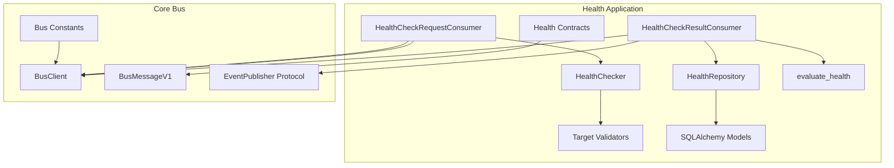
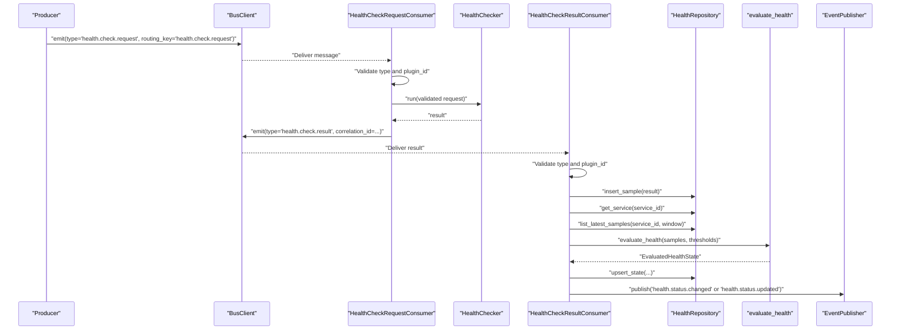
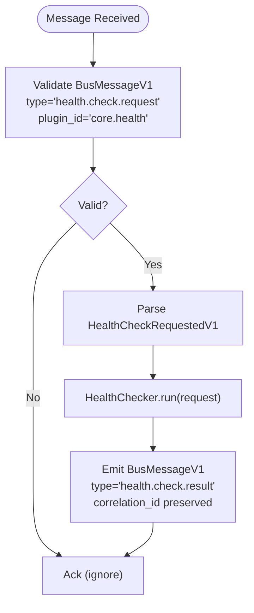
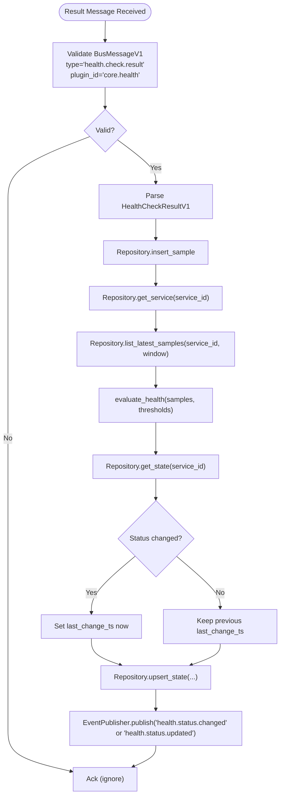
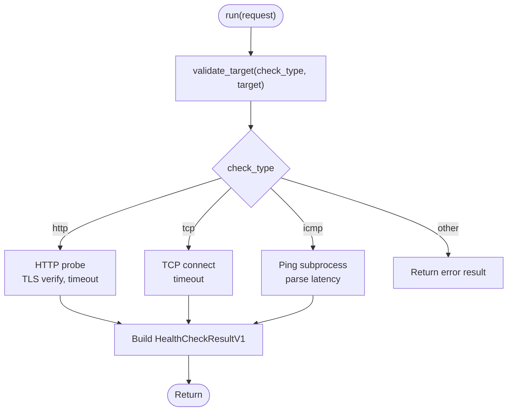
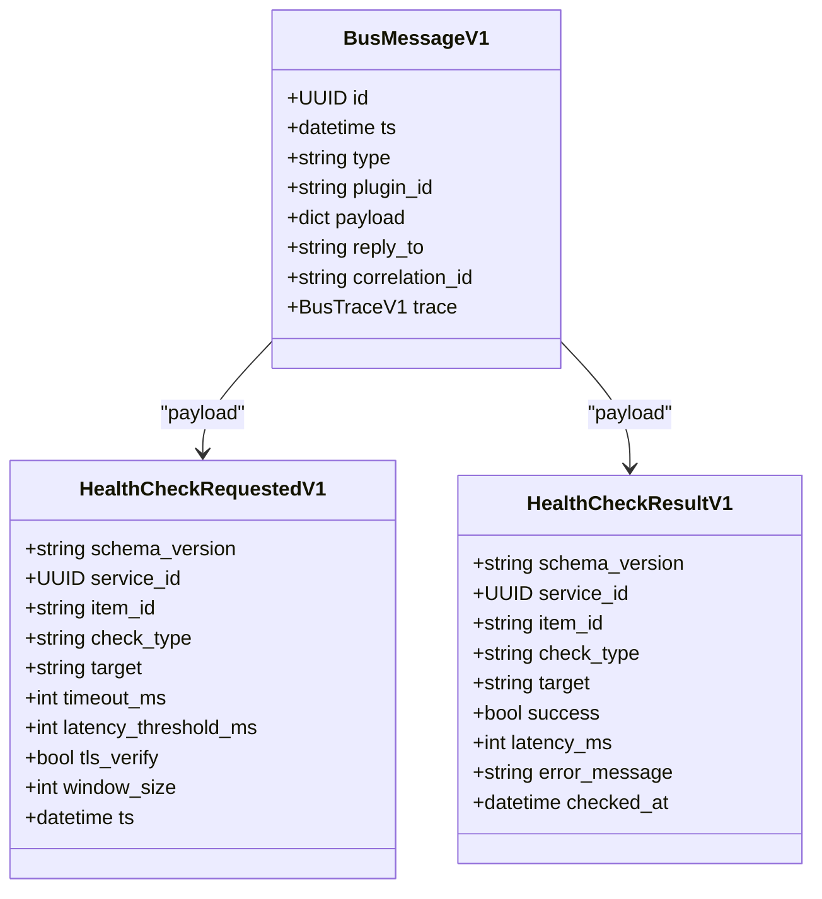
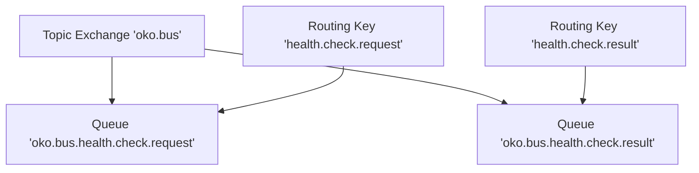
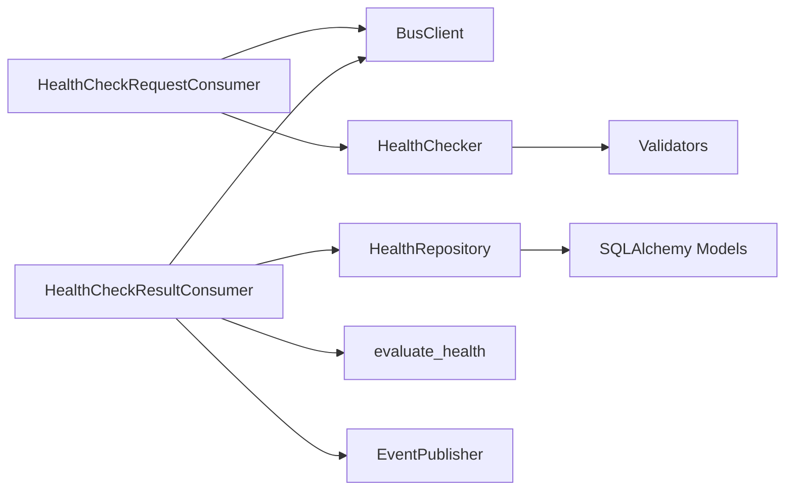

# Health Bus Handlers

<cite>
**Referenced Files in This Document**
- [apps/health/bus_handlers/__init__.py](file://apps/health/bus_handlers/__init__.py)
- [apps/health/bus_handlers/check_request_consumer.py](file://apps/health/bus_handlers/check_request_consumer.py)
- [apps/health/bus_handlers/check_result_consumer.py](file://apps/health/bus_handlers/check_result_consumer.py)
- [apps/health/model/contracts.py](file://apps/health/model/contracts.py)
- [apps/health/service/checkers.py](file://apps/health/service/checkers.py)
- [apps/health/service/repository.py](file://apps/health/service/repository.py)
- [apps/health/service/status.py](file://apps/health/service/status.py)
- [apps/health/service/validators.py](file://apps/health/service/validators.py)
- [apps/health/model/sqlalchemy.py](file://apps/health/model/sqlalchemy.py)
- [core/bus/client.py](file://core/bus/client.py)
- [core/bus/constants.py](file://core/bus/constants.py)
- [core/bus/protocols.py](file://core/events/protocols.py)
- [core/contracts/bus.py](file://core/contracts/bus.py)
- [config/container.py](file://config/container.py)
</cite>

## Table of Contents
1. [Introduction](#introduction)
2. [Project Structure](#project-structure)
3. [Core Components](#core-components)
4. [Architecture Overview](#architecture-overview)
5. [Detailed Component Analysis](#detailed-component-analysis)
6. [Dependency Analysis](#dependency-analysis)
7. [Performance Considerations](#performance-considerations)
8. [Troubleshooting Guide](#troubleshooting-guide)
9. [Conclusion](#conclusion)

## Introduction
This document describes the Health Bus Handlers subsystem responsible for processing health check requests and results via the message bus. It explains the consumer implementations, message handling workflows, event-driven patterns, serialization, routing, and error handling. It also covers configuration, practical processing patterns, and debugging techniques for message flow issues, and documents the integration with the broader event bus system and inter-service communication.

## Project Structure
The Health Bus Handlers live under the health application and integrate with shared bus and event infrastructure:
- Health bus handlers: request and result consumers
- Health service: checkers, repository, status evaluation, validators
- Health models: typed contracts for messages and domain entities
- Core bus: AMQP-based bus client, constants, and message contracts
- Container: wiring of consumers, bus client, and runtime lifecycle

**Diagram sources**
- [apps/health/bus_handlers/check_request_consumer.py:10-47](file://apps/health/bus_handlers/check_request_consumer.py#L10-L47)
- [apps/health/bus_handlers/check_result_consumer.py:14-105](file://apps/health/bus_handlers/check_result_consumer.py#L14-L105)
- [apps/health/service/checkers.py:15-199](file://apps/health/service/checkers.py#L15-L199)
- [apps/health/service/repository.py:29-304](file://apps/health/service/repository.py#L29-L304)
- [apps/health/service/status.py:10-75](file://apps/health/service/status.py#L10-L75)
- [apps/health/service/validators.py:25-112](file://apps/health/service/validators.py#L25-L112)
- [apps/health/model/contracts.py:60-120](file://apps/health/model/contracts.py#L60-L120)
- [apps/health/model/sqlalchemy.py:23-88](file://apps/health/model/sqlalchemy.py#L23-L88)
- [core/bus/client.py:34-290](file://core/bus/client.py#L34-L290)
- [core/bus/constants.py:3-47](file://core/bus/constants.py#L3-L47)
- [core/contracts/bus.py:30-138](file://core/contracts/bus.py#L30-L138)
- [core/events/protocols.py:8-21](file://core/events/protocols.py#L8-L21)

**Section sources**
- [apps/health/bus_handlers/__init__.py:1-7](file://apps/health/bus_handlers/__init__.py#L1-L7)
- [config/container.py:105-174](file://config/container.py#L105-L174)

## Core Components
- HealthCheckRequestConsumer: Consumes health.check.request messages, validates type and plugin_id, runs checks via HealthChecker, and emits health.check.result with correlation_id preserved.
- HealthCheckResultConsumer: Consumes health.check.result messages, persists samples, evaluates health state, updates repository state, and publishes health.status.changed or health.status.updated events.
- HealthChecker: Implements check execution for http, tcp, and icmp with timeouts, TLS verification, and ping binary support.
- HealthRepository: CRUD and analytics over monitored services, samples, and health state with SQLAlchemy ORM.
- evaluate_health: Computes status, latency, success rate, and failure streaks over a sliding window.
- BusClient: AMQP client with declare-and-bind topology, emit/call/consume APIs, and memory-mode testing support.
- Contracts and Models: Typed Pydantic models for health messages, domain entities, and database schema.

**Section sources**
- [apps/health/bus_handlers/check_request_consumer.py:10-47](file://apps/health/bus_handlers/check_request_consumer.py#L10-L47)
- [apps/health/bus_handlers/check_result_consumer.py:14-105](file://apps/health/bus_handlers/check_result_consumer.py#L14-L105)
- [apps/health/service/checkers.py:15-199](file://apps/health/service/checkers.py#L15-L199)
- [apps/health/service/repository.py:29-304](file://apps/health/service/repository.py#L29-L304)
- [apps/health/service/status.py:10-75](file://apps/health/service/status.py#L10-L75)
- [core/bus/client.py:34-290](file://core/bus/client.py#L34-L290)
- [apps/health/model/contracts.py:60-120](file://apps/health/model/contracts.py#L60-L120)
- [apps/health/model/sqlalchemy.py:23-88](file://apps/health/model/sqlalchemy.py#L23-L88)

## Architecture Overview
The health subsystem follows an event-driven, message-based architecture:
- Producers emit health.check.request messages onto the topic exchange with routing key health.check.request.
- HealthCheckRequestConsumer consumes these messages, executes checks, and emits health.check.result with the same correlation_id.
- HealthCheckResultConsumer consumes results, persists samples, computes health state, and publishes events to inform downstream subscribers.

**Diagram sources**
- [apps/health/bus_handlers/check_request_consumer.py:26-44](file://apps/health/bus_handlers/check_request_consumer.py#L26-L44)
- [apps/health/bus_handlers/check_result_consumer.py:39-102](file://apps/health/bus_handlers/check_result_consumer.py#L39-L102)
- [apps/health/service/checkers.py:20-37](file://apps/health/service/checkers.py#L20-L37)
- [apps/health/service/repository.py:157-254](file://apps/health/service/repository.py#L157-L254)
- [apps/health/service/status.py:10-75](file://apps/health/service/status.py#L10-L75)
- [core/bus/client.py:77-99](file://core/bus/client.py#L77-L99)
- [core/contracts/bus.py:19-21](file://core/contracts/bus.py#L19-L21)

## Detailed Component Analysis

### HealthCheckRequestConsumer
Responsibilities:
- Consume messages from queue oko.bus.health.check.request bound to routing key health.check.request.
- Validate BusMessageV1 type and plugin_id.
- Deserialize payload to HealthCheckRequestedV1 and run HealthChecker.
- Emit BusMessageV1 with type health.check.result and preserve correlation_id.

Processing logic highlights:
- Message validation ensures only intended plugin_id "core.health" is processed.
- Payload deserialization uses model_validate to enforce schema.
- Correlation_id is propagated to correlate request/result pairs.
- Emits to routing key health.check.result.

**Diagram sources**
- [apps/health/bus_handlers/check_request_consumer.py:26-44](file://apps/health/bus_handlers/check_request_consumer.py#L26-L44)
- [apps/health/service/checkers.py:20-37](file://apps/health/service/checkers.py#L20-L37)
- [core/contracts/bus.py:19-21](file://core/contracts/bus.py#L19-L21)

**Section sources**
- [apps/health/bus_handlers/check_request_consumer.py:10-47](file://apps/health/bus_handlers/check_request_consumer.py#L10-L47)

### HealthCheckResultConsumer
Responsibilities:
- Consume messages from queue oko.bus.health.check.result bound to routing key health.check.result.
- Validate BusMessageV1 type and plugin_id.
- Persist sample, fetch service, compute rolling window metrics, and upsert state.
- Publish health.status.changed when status transitions, otherwise health.status.updated.

Key steps:
- Insert sample into storage and fetch service definition.
- Retrieve latest N samples (window_size).
- Evaluate health using evaluate_health.
- Compare with previous state to detect changes.
- Upsert ServiceHealthState and publish appropriate event.

**Diagram sources**
- [apps/health/bus_handlers/check_result_consumer.py:39-102](file://apps/health/bus_handlers/check_result_consumer.py#L39-L102)
- [apps/health/service/repository.py:157-254](file://apps/health/service/repository.py#L157-L254)
- [apps/health/service/status.py:10-75](file://apps/health/service/status.py#L10-L75)
- [core/events/protocols.py:8-21](file://core/events/protocols.py#L8-L21)

**Section sources**
- [apps/health/bus_handlers/check_result_consumer.py:14-105](file://apps/health/bus_handlers/check_result_consumer.py#L14-L105)

### HealthChecker
Capabilities:
- HTTP: Async HTTP(S) probe with configurable TLS verification and timeout.
- TCP: Connect to host:port with timeout.
- ICMP: Execute ping binary if enabled; parse latency from output.

Error handling:
- Timeouts reported as error_message "timeout".
- Unsupported check_type returns explicit error.
- ICMP disabled/unavailable handled gracefully.

**Diagram sources**
- [apps/health/service/checkers.py:20-37](file://apps/health/service/checkers.py#L20-L37)
- [apps/health/service/validators.py:25-112](file://apps/health/service/validators.py#L25-L112)

**Section sources**
- [apps/health/service/checkers.py:15-199](file://apps/health/service/checkers.py#L15-L199)
- [apps/health/service/validators.py:25-112](file://apps/health/service/validators.py#L25-L112)

### Data Models and Serialization
Contracts define strict schemas for health messages and domain entities. BusMessageV1 carries type, plugin_id, payload, correlation_id, and timestamps. HealthCheckRequestedV1 and HealthCheckResultV1 are validated against these schemas during message handling.

**Diagram sources**
- [core/contracts/bus.py:30-46](file://core/contracts/bus.py#L30-L46)
- [apps/health/model/contracts.py:60-83](file://apps/health/model/contracts.py#L60-L83)

**Section sources**
- [apps/health/model/contracts.py:60-120](file://apps/health/model/contracts.py#L60-L120)
- [core/contracts/bus.py:30-138](file://core/contracts/bus.py#L30-L138)

### Routing and Topology
- Exchange: Topic exchange oko.bus
- Queues:
  - oko.bus.health.check.request (bound to routing key health.check.request)
  - oko.bus.health.check.result (bound to routing key health.check.result)
- Consumers bind queues to routing keys and process messages.

**Diagram sources**
- [core/bus/constants.py:3-18](file://core/bus/constants.py#L3-L18)
- [core/bus/client.py:225-241](file://core/bus/client.py#L225-L241)

**Section sources**
- [core/bus/constants.py:3-47](file://core/bus/constants.py#L3-L47)
- [core/bus/client.py:225-241](file://core/bus/client.py#L225-L241)

## Dependency Analysis
- HealthCheckRequestConsumer depends on BusClient for consume/emit and HealthChecker for execution.
- HealthCheckResultConsumer depends on BusClient, HealthRepository, evaluate_health, and EventPublisher.
- HealthChecker depends on validators and external libraries for HTTP/TCP/ICMP probing.
- HealthRepository encapsulates SQLAlchemy ORM operations for services, samples, and state.
- BusClient centralizes AMQP connectivity, topology declaration, and message transport.

**Diagram sources**
- [apps/health/bus_handlers/check_request_consumer.py:10-13](file://apps/health/bus_handlers/check_request_consumer.py#L10-L13)
- [apps/health/bus_handlers/check_result_consumer.py:14-26](file://apps/health/bus_handlers/check_result_consumer.py#L14-L26)
- [apps/health/service/checkers.py:15-18](file://apps/health/service/checkers.py#L15-L18)
- [apps/health/service/repository.py:29-32](file://apps/health/service/repository.py#L29-L32)
- [apps/health/service/status.py:10-15](file://apps/health/service/status.py#L10-L15)
- [apps/health/service/validators.py:25-36](file://apps/health/service/validators.py#L25-L36)
- [apps/health/model/sqlalchemy.py:23-88](file://apps/health/model/sqlalchemy.py#L23-L88)

**Section sources**
- [config/container.py:343-365](file://config/container.py#L343-L365)

## Performance Considerations
- Prefetch tuning: adjust BusClient prefetch_count to balance throughput and fairness.
- Window size: larger windows smooth metrics but increase memory and computation overhead; tune health_window_size per service SLAs.
- Timeouts: align health_default_timeout_ms with target latency expectations to avoid excessive retries.
- ICMP cost: ICMP probes are heavier; enable only when needed and ensure ping availability.
- Persistence: batch writes and minimize contention in repository operations; consider indexing on service_id and timestamps.

## Troubleshooting Guide
Common issues and diagnostics:
- Messages ignored by consumers:
  - Verify plugin_id and type filters in consumer handlers.
  - Confirm routing keys and queue bindings match constants.
- Serialization errors:
  - Ensure payloads conform to HealthCheckRequestedV1/HealthCheckResultV1 schemas.
  - Validate target normalization and supported check types.
- No results emitted:
  - Check correlation_id propagation and result routing key.
  - Inspect event publishing for health.status.changed vs health.status.updated.
- Health state not updating:
  - Review evaluate_health thresholds and window_size.
  - Confirm repository upsert operations and previous state retrieval.
- AMQP connectivity:
  - Validate broker_url and exchange/queue declarations.
  - For memory mode, confirm consumers registered for matching routing keys.

Operational tips:
- Enable structured logging around message processing and event publishing.
- Use correlation_id to trace end-to-end request/result flows.
- Monitor queue depths and consumer lag for backpressure.

**Section sources**
- [apps/health/bus_handlers/check_request_consumer.py:26-44](file://apps/health/bus_handlers/check_request_consumer.py#L26-L44)
- [apps/health/bus_handlers/check_result_consumer.py:39-102](file://apps/health/bus_handlers/check_result_consumer.py#L39-L102)
- [apps/health/service/status.py:10-75](file://apps/health/service/status.py#L10-L75)
- [core/bus/client.py:46-76](file://core/bus/client.py#L46-L76)
- [core/bus/constants.py:3-18](file://core/bus/constants.py#L3-L18)

## Conclusion
The Health Bus Handlers subsystem implements a robust, event-driven pipeline for health check orchestration and monitoring. Request and result consumers coordinate via typed messages and correlation identifiers, while the checker and evaluator provide reliable, configurable probing and state computation. The design leverages a shared bus and event system to decouple producers and consumers, enabling scalable inter-service communication and observability.