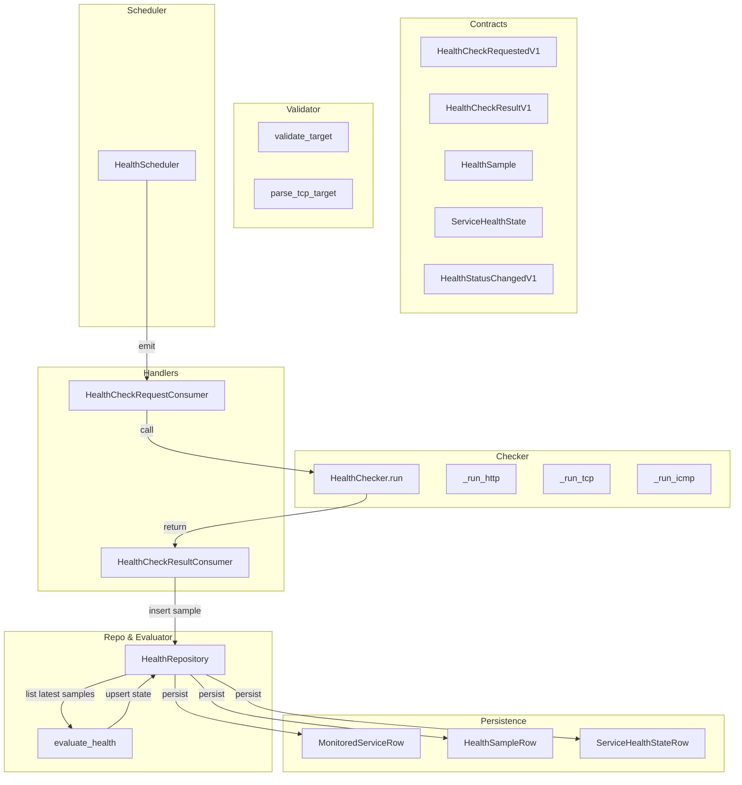
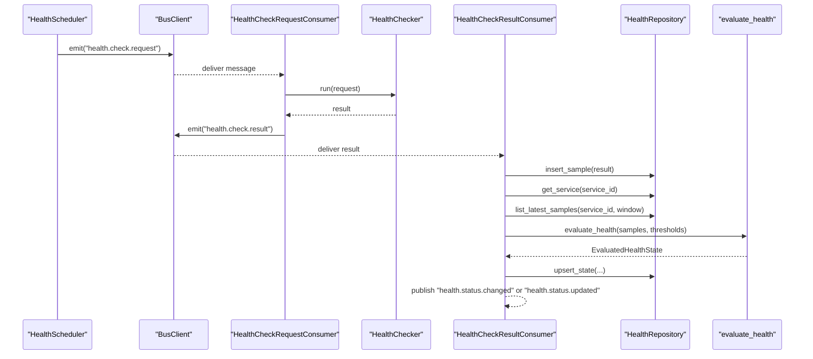
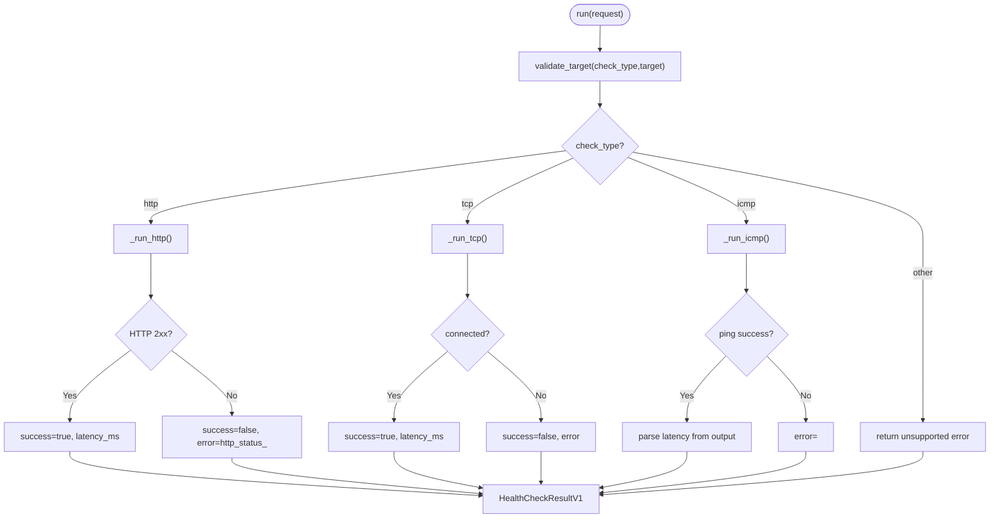
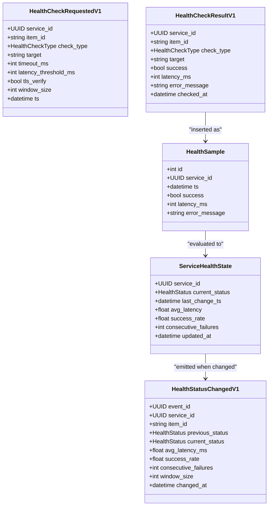
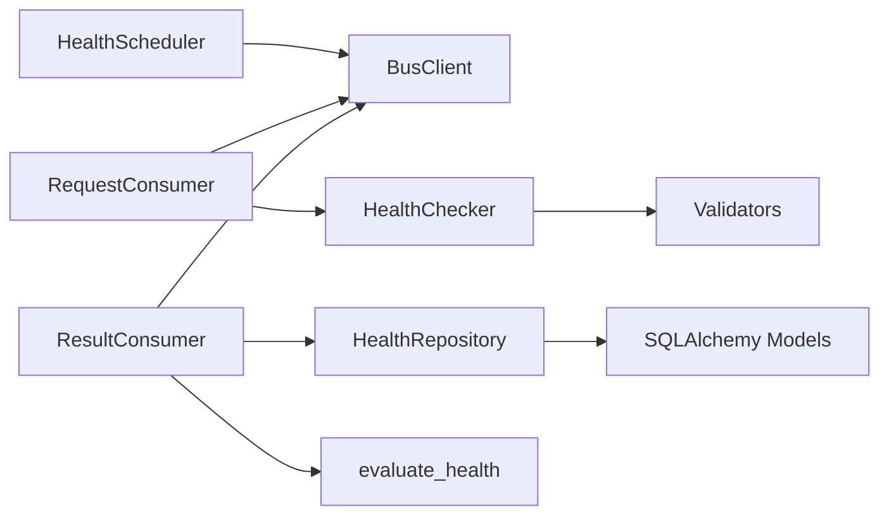

# Health Checkers

<cite>
**Referenced Files in This Document**
- [checkers.py](file://apps/health/service/checkers.py)
- [contracts.py](file://apps/health/model/contracts.py)
- [sqlalchemy.py](file://apps/health/model/sqlalchemy.py)
- [validators.py](file://apps/health/service/validators.py)
- [config_sync.py](file://apps/health/service/config_sync.py)
- [scheduler.py](file://apps/health/worker/scheduler.py)
- [check_request_consumer.py](file://apps/health/bus_handlers/check_request_consumer.py)
- [check_result_consumer.py](file://apps/health/bus_handlers/check_result_consumer.py)
- [status.py](file://apps/health/service/status.py)
- [repository.py](file://apps/health/service/repository.py)
- [client.py](file://core/bus/client.py)
- [protocols.py](file://core/events/protocols.py)
- [20260223_0002_health_mvp.py](file://alembic/versions/20260223_0002_health_mvp.py)
- [20260223_0003_health_tls_verify.py](file://alembic/versions/20260223_0003_health_tls_verify.py)
</cite>

## Table of Contents
1. [Introduction](#introduction)
2. [Project Structure](#project-structure)
3. [Core Components](#core-components)
4. [Architecture Overview](#architecture-overview)
5. [Detailed Component Analysis](#detailed-component-analysis)
6. [Dependency Analysis](#dependency-analysis)
7. [Performance Considerations](#performance-considerations)
8. [Troubleshooting Guide](#troubleshooting-guide)
9. [Conclusion](#conclusion)
10. [Appendices](#appendices)

## Introduction
This document describes the Health Checkers subsystem responsible for monitoring services via configurable checks (HTTP/TLS, TCP, ICMP). It explains the checker architecture, supported check types, execution mechanisms, timeouts, result processing, and the integration with the broader health monitoring pipeline. It also covers configuration options, validation rules, and practical guidance for implementing custom checkers.

## Project Structure
The Health Checkers subsystem spans several modules:
- Contracts define typed messages and models exchanged across the pipeline.
- Validators enforce target and parameter constraints.
- The checker executes checks and produces structured results.
- Handlers consume requests and publish results.
- Scheduler emits periodic check requests based on configuration.
- Repository persists samples and states.
- Status evaluator computes health status from recent samples.
- Database schema and migrations define persistence.

**Diagram sources**
- [contracts.py:60-83](file://apps/health/model/contracts.py#L60-L83)
- [validators.py:25-62](file://apps/health/service/validators.py#L25-L62)
- [checkers.py:20-184](file://apps/health/service/checkers.py#L20-L184)
- [check_request_consumer.py:26-44](file://apps/health/bus_handlers/check_request_consumer.py#L26-L44)
- [check_result_consumer.py:39-102](file://apps/health/bus_handlers/check_result_consumer.py#L39-L102)
- [scheduler.py:68-140](file://apps/health/worker/scheduler.py#L68-L140)
- [repository.py:157-254](file://apps/health/service/repository.py#L157-L254)
- [status.py:10-71](file://apps/health/service/status.py#L10-L71)
- [sqlalchemy.py:23-81](file://apps/health/model/sqlalchemy.py#L23-L81)

**Section sources**
- [contracts.py:60-83](file://apps/health/model/contracts.py#L60-L83)
- [validators.py:25-62](file://apps/health/service/validators.py#L25-L62)
- [checkers.py:20-184](file://apps/health/service/checkers.py#L20-L184)
- [check_request_consumer.py:26-44](file://apps/health/bus_handlers/check_request_consumer.py#L26-L44)
- [check_result_consumer.py:39-102](file://apps/health/bus_handlers/check_result_consumer.py#L39-L102)
- [scheduler.py:68-140](file://apps/health/worker/scheduler.py#L68-L140)
- [repository.py:157-254](file://apps/health/service/repository.py#L157-L254)
- [status.py:10-71](file://apps/health/service/status.py#L10-L71)
- [sqlalchemy.py:23-81](file://apps/health/model/sqlalchemy.py#L23-L81)

## Core Components
- HealthChecker: Orchestrates check execution per check type, applies timeouts, and normalizes results.
- Validators: Enforce target format and parameter bounds.
- Contracts: Define typed request/result messages and evaluation models.
- Handlers: Bridge AMQP bus to checker execution and result aggregation.
- Scheduler: Periodically emits check requests based on configured services.
- Repository: Persists samples and health state, supports queries and pruning.
- Status Evaluator: Computes health status from recent samples and thresholds.
- Persistence: SQLAlchemy models and Alembic migrations define the schema.

**Section sources**
- [checkers.py:15-199](file://apps/health/service/checkers.py#L15-L199)
- [validators.py:13-112](file://apps/health/service/validators.py#L13-L112)
- [contracts.py:60-119](file://apps/health/model/contracts.py#L60-L119)
- [check_request_consumer.py:10-48](file://apps/health/bus_handlers/check_request_consumer.py#L10-L48)
- [check_result_consumer.py:14-106](file://apps/health/bus_handlers/check_result_consumer.py#L14-L106)
- [scheduler.py:19-201](file://apps/health/worker/scheduler.py#L19-L201)
- [repository.py:29-304](file://apps/health/service/repository.py#L29-L304)
- [status.py:10-75](file://apps/health/service/status.py#L10-L75)
- [sqlalchemy.py:23-81](file://apps/health/model/sqlalchemy.py#L23-L81)

## Architecture Overview
The Health Checkers subsystem follows a message-driven pipeline:
- Scheduler reads active configuration, resolves service specs, and emits periodic check requests.
- Request consumer validates the message, delegates to HealthChecker, and publishes results.
- Result consumer persists samples, evaluates health, updates state, and emits status change events.

**Diagram sources**
- [scheduler.py:84-102](file://apps/health/worker/scheduler.py#L84-L102)
- [check_request_consumer.py:34-44](file://apps/health/bus_handlers/check_request_consumer.py#L34-L44)
- [checkers.py:20-184](file://apps/health/service/checkers.py#L20-L184)
- [check_result_consumer.py:47-102](file://apps/health/bus_handlers/check_result_consumer.py#L47-L102)
- [repository.py:157-254](file://apps/health/service/repository.py#L157-L254)
- [status.py:10-71](file://apps/health/service/status.py#L10-L71)

## Detailed Component Analysis

### HealthChecker
Responsibilities:
- Route to appropriate check implementation based on check_type.
- Apply timeouts uniformly across implementations.
- Normalize results to HealthCheckResultV1.
- Handle timeouts and generic exceptions consistently.

Supported check types:
- HTTP/TLS: Uses an async HTTP client with configurable TLS verification and redirect policy.
- TCP: Opens a connection to host:port with a timeout.
- ICMP: Executes the platform ping binary with a single packet and parses latency.

Timeout handling:
- HTTP/TLS and TCP use a single shared timeout derived from request.timeout_ms.
- ICMP uses a subprocess with a bounded timeout and kills the process if exceeded.

Error handling:
- Dedicated error messages for timeouts and unsupported types.
- Generic exceptions are captured and returned with truncated error messages.

Result processing:
- Latency is computed as elapsed wall-clock time for HTTP/TCP; ICMP latency is parsed from ping output.
- Success determined by HTTP status range and TCP connection establishment; ICMP success by exit code.

**Diagram sources**
- [checkers.py:20-184](file://apps/health/service/checkers.py#L20-L184)
- [validators.py:25-62](file://apps/health/service/validators.py#L25-L62)

**Section sources**
- [checkers.py:15-199](file://apps/health/service/checkers.py#L15-L199)
- [validators.py:25-62](file://apps/health/service/validators.py#L25-L62)

### Validators
Responsibilities:
- validate_target: Ensures non-empty target and enforces scheme/host/port/whitespace constraints per check type.
- parse_tcp_target: Validates host:port format and numeric port range.
- Clamp helpers: Bound interval_sec, timeout_ms, and latency_threshold_ms to safe ranges.

Key behaviors:
- HTTP targets must use http/https scheme and non-empty host.
- TCP targets must be host:port with port in 1..65535.
- ICMP targets must be non-whitespace, either an IP address or a valid hostname.

**Section sources**
- [validators.py:13-112](file://apps/health/service/validators.py#L13-L112)

### Contracts and Data Models
Defines the typed messages and evaluation models:
- HealthCheckRequestedV1: Input message carrying service metadata and check parameters.
- HealthCheckResultV1: Output message with success, latency, and optional error.
- HealthSample: Persisted sample record.
- ServiceHealthState: Aggregated health state per service.
- HealthStatusChangedV1: Event payload emitted on status transitions.
- EvaluatedHealthState: Aggregation result used for status computation.

**Diagram sources**
- [contracts.py:60-119](file://apps/health/model/contracts.py#L60-L119)

**Section sources**
- [contracts.py:60-119](file://apps/health/model/contracts.py#L60-L119)

### Handlers: Request and Result Consumers
- HealthCheckRequestConsumer: Consumes "health.check.request" messages, validates payload, invokes HealthChecker, and emits "health.check.result".
- HealthCheckResultConsumer: Consumes "health.check.result", inserts sample, evaluates health, upserts state, and publishes status change or update events.

Operational details:
- Both handlers filter by plugin_id "core.health" and routing keys.
- Results are persisted and used to compute rolling-window health metrics.

**Section sources**
- [check_request_consumer.py:10-48](file://apps/health/bus_handlers/check_request_consumer.py#L10-L48)
- [check_result_consumer.py:14-106](file://apps/health/bus_handlers/check_result_consumer.py#L14-L106)

### Scheduler
Responsibilities:
- Periodically emits "health.check.request" messages for enabled services.
- Syncs service specs from active configuration snapshot.
- Prunes old samples based on retention policy.
- Emits heartbeats with scheduling preview and schedule table.

Key parameters:
- tick_sec, window_size, retention_days, default_* settings influence scheduling cadence, evaluation window, and data retention.

**Section sources**
- [scheduler.py:19-201](file://apps/health/worker/scheduler.py#L19-L201)

### Repository and Persistence
Responsibilities:
- Insert samples, list latest samples, upsert health state, prune old samples.
- Convert between ORM rows and Pydantic models.
- Provide snapshots for UI.

Schema highlights:
- MonitoredServiceRow: service definition and parameters.
- HealthSampleRow: per-check sample with timestamps and outcomes.
- ServiceHealthStateRow: aggregated state per service.

**Section sources**
- [repository.py:29-304](file://apps/health/service/repository.py#L29-L304)
- [sqlalchemy.py:23-81](file://apps/health/model/sqlalchemy.py#L23-L81)

### Status Evaluation
Rules:
- Unknown if all samples fail due to ICMP being disabled/unavailable.
- Down if window is full and all samples failed.
- Degraded if success rate below threshold or average latency exceeds threshold.
- Online otherwise.

Consecutive failures count from the start of the window until first success.

**Section sources**
- [status.py:10-75](file://apps/health/service/status.py#L10-L75)

### Configuration and Target Resolution
Behavior:
- Extract service specs from active configuration payload.
- Resolve target based on item fields and healthcheck config.
- Determine TLS verification heuristics (skip for private network HTTP targets by default).
- Clamp parameters to safe ranges.

**Section sources**
- [config_sync.py:17-194](file://apps/health/service/config_sync.py#L17-L194)

## Dependency Analysis
High-level dependencies:
- Handlers depend on BusClient and Pydantic models.
- Checker depends on validators and async HTTP/TLS stack.
- Result consumer depends on repository and status evaluator.
- Scheduler depends on configuration repository and emits bus messages.
- Repository depends on SQLAlchemy ORM and models.

**Diagram sources**
- [scheduler.py:84-102](file://apps/health/worker/scheduler.py#L84-L102)
- [check_request_consumer.py:34-44](file://apps/health/bus_handlers/check_request_consumer.py#L34-L44)
- [check_result_consumer.py:47-102](file://apps/health/bus_handlers/check_result_consumer.py#L47-L102)
- [checkers.py:20-184](file://apps/health/service/checkers.py#L20-L184)
- [validators.py:25-62](file://apps/health/service/validators.py#L25-L62)
- [repository.py:157-254](file://apps/health/service/repository.py#L157-L254)
- [status.py:10-71](file://apps/health/service/status.py#L10-L71)
- [client.py:34-290](file://core/bus/client.py#L34-L290)

**Section sources**
- [client.py:34-290](file://core/bus/client.py#L34-L290)
- [protocols.py:8-21](file://core/events/protocols.py#L8-L21)

## Performance Considerations
- Concurrency: Checker uses async I/O for HTTP/TLS and TCP; ICMP uses a subprocess. Ensure adequate system resources for concurrent checks.
- Timeouts: Set conservative timeout_ms to avoid long-blocking operations; HTTP/TLS and TCP share the same timeout budget.
- Window size: Larger window_size increases evaluation stability but delays detection; tune based on SLAs.
- Retention: Configure retention_days to balance historical insights and storage costs.
- Logging: Scheduler heartbeats help monitor throughput and detect stalls.

[No sources needed since this section provides general guidance]

## Troubleshooting Guide
Common issues and resolutions:
- Unsupported check_type: Verify check_type is one of http, tcp, icmp.
- Target validation errors: Ensure HTTP targets use http/https scheme and host; TCP targets are host:port; ICMP targets are non-whitespace IPs/hostnames.
- Timeout errors: Increase timeout_ms or reduce network latency; for ICMP, ensure ping binary availability and permissions.
- ICMP disabled/unavailable: Enable ICMP capability on the system or switch to TCP/HTTP checks.
- TLS verification failures: Adjust tls_verify per service or rely on automatic heuristic for private network URLs.
- No status changes: Confirm scheduler is running, handlers are consuming queues, and repository is reachable.

Operational diagnostics:
- Inspect handler logs for message routing and plugin_id mismatches.
- Review repository heartbeats for sample insertion and pruning activity.
- Validate evaluation window and thresholds to align expectations.

**Section sources**
- [checkers.py:29-37](file://apps/health/service/checkers.py#L29-L37)
- [validators.py:25-102](file://apps/health/service/validators.py#L25-L102)
- [check_result_consumer.py:39-102](file://apps/health/bus_handlers/check_result_consumer.py#L39-L102)
- [scheduler.py:114-132](file://apps/health/worker/scheduler.py#L114-L132)

## Conclusion
The Health Checkers subsystem provides a robust, extensible pipeline for service monitoring. It supports HTTP/TLS, TCP, and ICMP checks with strict validation, consistent timeouts, and resilient result processing. The scheduler, handlers, repository, and evaluator work together to maintain accurate health state and timely alerts.

[No sources needed since this section summarizes without analyzing specific files]

## Appendices

### Supported Check Types and Execution Mechanisms
- HTTP/TLS: Asynchronous GET request with configurable TLS verification and redirect policy; success defined by 2xx status.
- TCP: TCP connect to host:port with timeout; success defined by successful connection.
- ICMP: Execute platform ping binary with a single packet; latency parsed from output; success by zero exit code.

**Section sources**
- [checkers.py:39-184](file://apps/health/service/checkers.py#L39-L184)
- [validators.py:65-102](file://apps/health/service/validators.py#L65-L102)

### Timeout Handling
- HTTP/TLS and TCP: Single timeout derived from request.timeout_ms.
- ICMP: Subprocess timeout enforced; process killed on expiry.

**Section sources**
- [checkers.py:40-47](file://apps/health/service/checkers.py#L40-L47)
- [checkers.py:86-89](file://apps/health/service/checkers.py#L86-L89)
- [checkers.py:156-169](file://apps/health/service/checkers.py#L156-L169)

### Result Processing Workflows
- Samples inserted per result; latest samples retrieved for evaluation.
- Rolling window evaluation determines status, average latency, and failure counts.
- State upserted and status change events published when applicable.

**Section sources**
- [check_result_consumer.py:47-102](file://apps/health/bus_handlers/check_result_consumer.py#L47-L102)
- [repository.py:157-254](file://apps/health/service/repository.py#L157-L254)
- [status.py:10-71](file://apps/health/service/status.py#L10-L71)

### Configuration Options
- Service-level parameters: interval_sec, timeout_ms, latency_threshold_ms, tls_verify, enabled.
- Scheduler defaults: default_interval_sec, default_timeout_ms, default_latency_threshold_ms.
- Target resolution: Supports http/tcp/icmp targets from item and healthcheck config.

**Section sources**
- [contracts.py:13-39](file://apps/health/model/contracts.py#L13-L39)
- [scheduler.py:19-48](file://apps/health/worker/scheduler.py#L19-L48)
- [config_sync.py:65-131](file://apps/health/service/config_sync.py#L65-L131)

### Retry Mechanisms
- Built-in retries: Not implemented in the current design. Failures are reported as-is; implement application-level retries if needed.

**Section sources**
- [checkers.py:20-184](file://apps/health/service/checkers.py#L20-L184)

### Error Handling Strategies
- Dedicated error messages for timeouts and unsupported types.
- Generic exceptions captured with truncated messages.
- ICMP-specific errors for disabled/unavailable states.

**Section sources**
- [checkers.py:60-79](file://apps/health/service/checkers.py#L60-L79)
- [checkers.py:103-122](file://apps/health/service/checkers.py#L103-L122)
- [checkers.py:135-144](file://apps/health/service/checkers.py#L135-L144)

### Practical Examples

- Implementing a custom checker:
  - Add a new check_type branch in HealthChecker.run and implement a dedicated method similar to _run_http/_run_tcp/_run_icmp.
  - Ensure timeout handling and result normalization to HealthCheckResultV1.
  - Register the new type in HealthCheckType literal and update validators if needed.

- Configuring check parameters:
  - Use MonitoredServiceSpec fields: interval_sec, timeout_ms, latency_threshold_ms, tls_verify, enabled.
  - Resolve targets via config_sync logic; ensure targets satisfy validator constraints.

- Interpreting check results:
  - success indicates outcome; latency_ms may be None for failures or unsupported checks.
  - error_message provides diagnostic context; inspect for timeouts or protocol-specific errors.

**Section sources**
- [checkers.py:20-184](file://apps/health/service/checkers.py#L20-L184)
- [config_sync.py:65-131](file://apps/health/service/config_sync.py#L65-L131)
- [contracts.py:73-83](file://apps/health/model/contracts.py#L73-L83)

### Relationship to Broader Health Monitoring Pipeline
- Scheduler orchestrates periodic checks and feeds the bus.
- Request consumer translates bus messages into checker invocations.
- Result consumer aggregates samples, evaluates health, and emits status events.
- Repository persists state and supports UI snapshots.

**Section sources**
- [scheduler.py:68-140](file://apps/health/worker/scheduler.py#L68-L140)
- [check_request_consumer.py:26-44](file://apps/health/bus_handlers/check_request_consumer.py#L26-L44)
- [check_result_consumer.py:39-102](file://apps/health/bus_handlers/check_result_consumer.py#L39-L102)
- [repository.py:157-254](file://apps/health/service/repository.py#L157-L254)

### Database Schema and Migrations
- MonitoredService: service definitions and parameters.
- HealthSample: per-check outcomes and timestamps.
- ServiceHealthState: aggregated health metrics.

**Section sources**
- [sqlalchemy.py:23-81](file://apps/health/model/sqlalchemy.py#L23-L81)
- [20260223_0002_health_mvp.py:15-82](file://alembic/versions/20260223_0002_health_mvp.py#L15-L82)
- [20260223_0003_health_tls_verify.py:15-26](file://alembic/versions/20260223_0003_health_tls_verify.py#L15-L26)