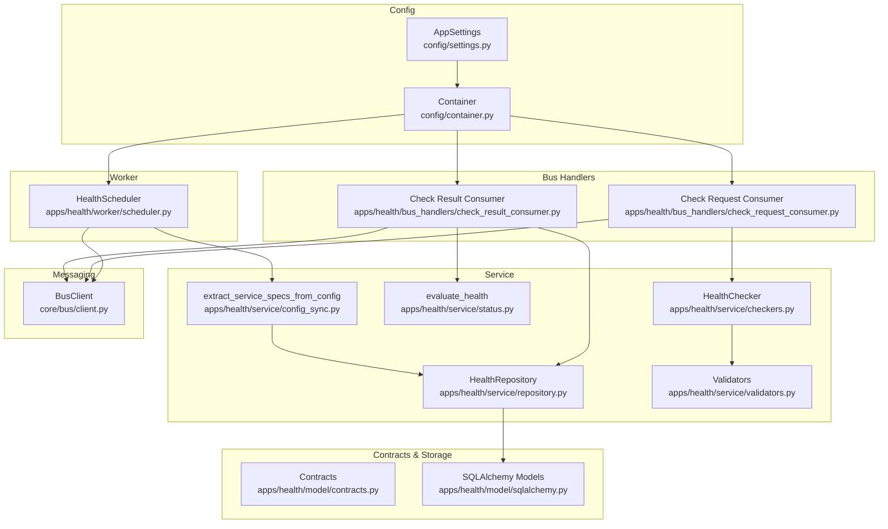
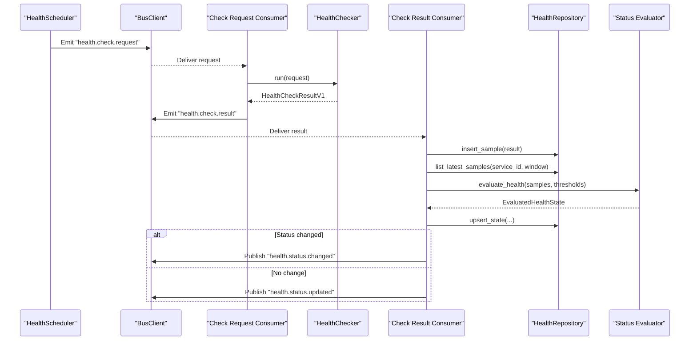
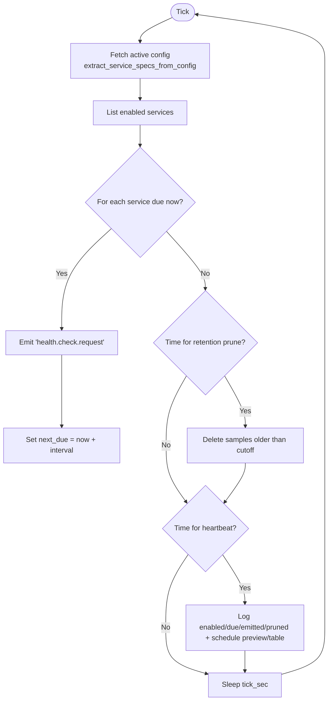
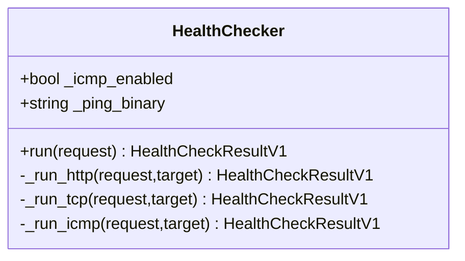
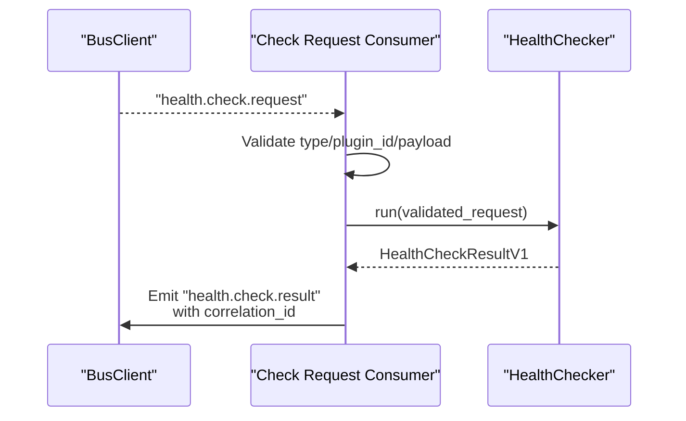
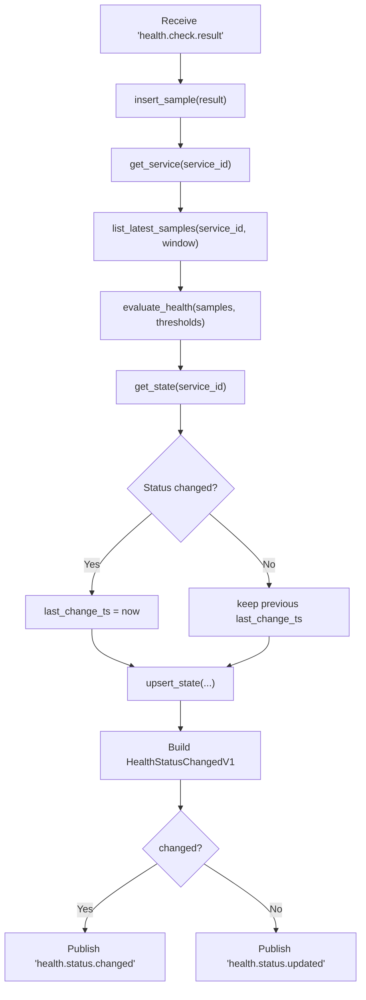
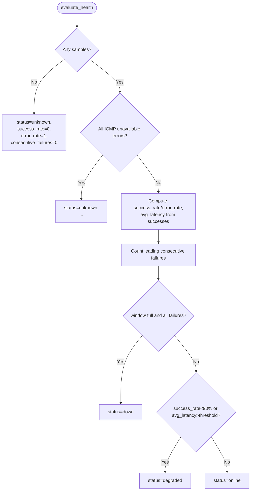
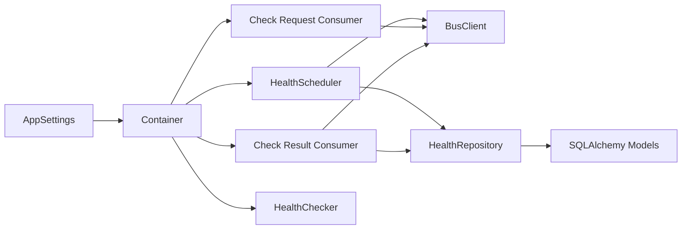

# Health Monitoring System

<cite>
**Referenced Files in This Document**
- [scheduler.py](file://apps/health/worker/scheduler.py)
- [checkers.py](file://apps/health/service/checkers.py)
- [check_request_consumer.py](file://apps/health/bus_handlers/check_request_consumer.py)
- [check_result_consumer.py](file://apps/health/bus_handlers/check_result_consumer.py)
- [contracts.py](file://apps/health/model/contracts.py)
- [repository.py](file://apps/health/service/repository.py)
- [status.py](file://apps/health/service/status.py)
- [config_sync.py](file://apps/health/service/config_sync.py)
- [validators.py](file://apps/health/service/validators.py)
- [client.py](file://core/bus/client.py)
- [sqlalchemy.py](file://apps/health/model/sqlalchemy.py)
- [settings.py](file://config/settings.py)
- [container.py](file://config/container.py)
- [main.py](file://main.py)
- [bootstrap.py](file://bootstrap.py)
</cite>

## Table of Contents
1. [Introduction](#introduction)
2. [Project Structure](#project-structure)
3. [Core Components](#core-components)
4. [Architecture Overview](#architecture-overview)
5. [Detailed Component Analysis](#detailed-component-analysis)
6. [Dependency Analysis](#dependency-analysis)
7. [Performance Considerations](#performance-considerations)
8. [Troubleshooting Guide](#troubleshooting-guide)
9. [Conclusion](#conclusion)
10. [Appendices](#appendices)

## Introduction
This document describes the health monitoring system that performs distributed health checks across HTTP, TCP, and ICMP targets. It explains the scheduler that emits periodic check requests, the checker that executes checks, and the consumers that process results and maintain state. It also documents supported check types, configuration options, message bus integration, result storage, data retention, and operational guidance.

## Project Structure
The health monitoring system is organized into:
- Worker: Schedules periodic checks and prunes old samples
- Service: Implements checkers, status evaluation, repository, and configuration synchronization
- Bus Handlers: Consume check requests and publish results
- Contracts: Typed messages and models for health data
- Storage: SQLAlchemy models and repository for persistence
- Configuration: Settings and dependency injection container

**Diagram sources**
- [scheduler.py:19-201](file://apps/health/worker/scheduler.py#L19-L201)
- [checkers.py:15-199](file://apps/health/service/checkers.py#L15-L199)
- [check_request_consumer.py:10-48](file://apps/health/bus_handlers/check_request_consumer.py#L10-L48)
- [check_result_consumer.py:14-106](file://apps/health/bus_handlers/check_result_consumer.py#L14-L106)
- [repository.py:29-304](file://apps/health/service/repository.py#L29-L304)
- [status.py:10-75](file://apps/health/service/status.py#L10-L75)
- [config_sync.py:17-194](file://apps/health/service/config_sync.py#L17-L194)
- [validators.py:13-112](file://apps/health/service/validators.py#L13-L112)
- [client.py:34-290](file://core/bus/client.py#L34-L290)
- [contracts.py:13-120](file://apps/health/model/contracts.py#L13-L120)
- [sqlalchemy.py:23-88](file://apps/health/model/sqlalchemy.py#L23-L88)
- [settings.py:14-128](file://config/settings.py#L14-L128)
- [container.py:329-365](file://config/container.py#L329-L365)

**Section sources**
- [scheduler.py:19-201](file://apps/health/worker/scheduler.py#L19-L201)
- [checkers.py:15-199](file://apps/health/service/checkers.py#L15-L199)
- [check_request_consumer.py:10-48](file://apps/health/bus_handlers/check_request_consumer.py#L10-L48)
- [check_result_consumer.py:14-106](file://apps/health/bus_handlers/check_result_consumer.py#L14-L106)
- [repository.py:29-304](file://apps/health/service/repository.py#L29-L304)
- [status.py:10-75](file://apps/health/service/status.py#L10-L75)
- [config_sync.py:17-194](file://apps/health/service/config_sync.py#L17-L194)
- [validators.py:13-112](file://apps/health/service/validators.py#L13-L112)
- [client.py:34-290](file://core/bus/client.py#L34-L290)
- [contracts.py:13-120](file://apps/health/model/contracts.py#L13-L120)
- [sqlalchemy.py:23-88](file://apps/health/model/sqlalchemy.py#L23-L88)
- [settings.py:14-128](file://config/settings.py#L14-L128)
- [container.py:329-365](file://config/container.py#L329-L365)

## Core Components
- HealthScheduler: Periodically emits check requests via the message bus, prunes old samples, and logs a heartbeat with schedule preview.
- HealthChecker: Executes HTTP, TCP, and ICMP checks with timeouts and error handling, returning structured results.
- Check Request Consumer: Listens for check requests, runs the checker, and publishes results.
- Check Result Consumer: Persists samples, evaluates health over a sliding window, updates state, and publishes status change events.
- HealthRepository: CRUD and aggregation operations for monitored services, samples, and health state.
- Status Evaluator: Computes online/degraded/down/unknown based on success rate, latency threshold, and recent failures.
- Config Sync: Extracts service specs from configuration snapshots and synchronizes services.
- Validators: Enforce target format and clamp numeric parameters.
- Contracts: Typed Pydantic models for requests, results, state, and samples.
- BusClient: AMQP/RabbitMQ client with memory mode, RPC support, and queue topology declaration.

**Section sources**
- [scheduler.py:19-201](file://apps/health/worker/scheduler.py#L19-L201)
- [checkers.py:15-199](file://apps/health/service/checkers.py#L15-L199)
- [check_request_consumer.py:10-48](file://apps/health/bus_handlers/check_request_consumer.py#L10-L48)
- [check_result_consumer.py:14-106](file://apps/health/bus_handlers/check_result_consumer.py#L14-L106)
- [repository.py:29-304](file://apps/health/service/repository.py#L29-L304)
- [status.py:10-75](file://apps/health/service/status.py#L10-L75)
- [config_sync.py:17-194](file://apps/health/service/config_sync.py#L17-L194)
- [validators.py:13-112](file://apps/health/service/validators.py#L13-L112)
- [contracts.py:13-120](file://apps/health/model/contracts.py#L13-L120)
- [client.py:34-290](file://core/bus/client.py#L34-L290)

## Architecture Overview
The system uses a message bus for decoupled, distributed processing:
- Scheduler emits "health.check.request" messages for enabled services.
- Check Request Consumer validates and executes checks via HealthChecker.
- Results are published as "health.check.result" messages.
- Check Result Consumer persists samples, evaluates health, updates state, and emits "health.status.changed" or "health.status.updated".

**Diagram sources**
- [scheduler.py:68-139](file://apps/health/worker/scheduler.py#L68-L139)
- [check_request_consumer.py:26-44](file://apps/health/bus_handlers/check_request_consumer.py#L26-L44)
- [checkers.py:20-37](file://apps/health/service/checkers.py#L20-L37)
- [check_result_consumer.py:39-102](file://apps/health/bus_handlers/check_result_consumer.py#L39-L102)
- [repository.py:157-260](file://apps/health/service/repository.py#L157-L260)
- [status.py:10-71](file://apps/health/service/status.py#L10-L71)
- [client.py:77-99](file://core/bus/client.py#L77-L99)

## Detailed Component Analysis

### HealthScheduler
Responsibilities:
- Load active configuration snapshot and synchronize services.
- Iterate enabled services and emit check requests when due.
- Track per-service next due time and prune old samples periodically.
- Log heartbeat with schedule preview and table.

Key behaviors:
- Uses tick_sec, window_size, retention_days, and defaults for scheduling and pruning.
- Emits BusMessageV1 with type "health.check.request" and payload HealthCheckRequestedV1.
- Prunes samples older than retention_days and logs pruned count.

**Diagram sources**
- [scheduler.py:68-139](file://apps/health/worker/scheduler.py#L68-L139)
- [config_sync.py:17-62](file://apps/health/service/config_sync.py#L17-L62)
- [repository.py:256-260](file://apps/health/service/repository.py#L256-L260)

**Section sources**
- [scheduler.py:19-201](file://apps/health/worker/scheduler.py#L19-L201)
- [config_sync.py:17-194](file://apps/health/service/config_sync.py#L17-L194)
- [repository.py:256-260](file://apps/health/service/repository.py#L256-L260)

### HealthChecker
Supported check types:
- HTTP: Async HTTP(S) GET with configurable timeout and TLS verification.
- TCP: TCP connection open with host:port target.
- ICMP: Ping subprocess with latency parsing (optional).

Execution logic:
- Validates target based on check_type.
- Applies timeouts and captures latency for successful checks.
- Returns structured result with success, latency_ms, and error_message.

**Diagram sources**
- [checkers.py:15-199](file://apps/health/service/checkers.py#L15-L199)
- [validators.py:25-112](file://apps/health/service/validators.py#L25-L112)

**Section sources**
- [checkers.py:15-199](file://apps/health/service/checkers.py#L15-L199)
- [validators.py:13-112](file://apps/health/service/validators.py#L13-L112)

### Check Request Consumer
Responsibilities:
- Consume "health.check.request" messages.
- Validate message and payload.
- Invoke HealthChecker and publish "health.check.result" with correlation_id.

**Diagram sources**
- [check_request_consumer.py:26-44](file://apps/health/bus_handlers/check_request_consumer.py#L26-L44)
- [checkers.py:20-37](file://apps/health/service/checkers.py#L20-L37)
- [client.py:77-99](file://core/bus/client.py#L77-L99)

**Section sources**
- [check_request_consumer.py:10-48](file://apps/health/bus_handlers/check_request_consumer.py#L10-L48)
- [client.py:168-187](file://core/bus/client.py#L168-L187)

### Check Result Consumer
Responsibilities:
- Persist sample, compute rolling window metrics, update state, and publish events.
- Evaluate health using evaluate_health with window_size and latency_threshold_ms.
- Publish "health.status.changed" on status transitions, otherwise "health.status.updated".

**Diagram sources**
- [check_result_consumer.py:39-102](file://apps/health/bus_handlers/check_result_consumer.py#L39-L102)
- [repository.py:49-260](file://apps/health/service/repository.py#L49-L260)
- [status.py:10-71](file://apps/health/service/status.py#L10-L71)
- [client.py:77-99](file://core/bus/client.py#L77-L99)

**Section sources**
- [check_result_consumer.py:14-106](file://apps/health/bus_handlers/check_result_consumer.py#L14-L106)
- [repository.py:157-260](file://apps/health/service/repository.py#L157-L260)
- [status.py:10-75](file://apps/health/service/status.py#L10-L75)

### HealthRepository
Responsibilities:
- CRUD for MonitoredService and ServiceHealthState.
- Insert HealthCheckResultV1 as HealthSample.
- List latest samples for a service.
- Upsert state and compute snapshot items.
- Delete samples older than cutoff.

Persistence:
- SQLAlchemy models define tables with appropriate indexes for performance.

**Section sources**
- [repository.py:29-304](file://apps/health/service/repository.py#L29-L304)
- [sqlalchemy.py:23-88](file://apps/health/model/sqlalchemy.py#L23-L88)

### Status Evaluation
Rules:
- Unknown if no samples or all ICMP unavailable failures.
- Down if window is full and all successes false.
- Degraded if success_rate < 90% or average latency exceeds threshold.
- Online otherwise.

**Diagram sources**
- [status.py:10-71](file://apps/health/service/status.py#L10-L71)

**Section sources**
- [status.py:10-75](file://apps/health/service/status.py#L10-L75)

### Configuration Synchronization
Behavior:
- Extracts service specs from a configuration payload with groups/subgroups/items.
- Resolves check type, target, intervals, timeouts, thresholds, and TLS verification.
- Generates stable UUIDs for service ids and syncs enabled/disabled state.

**Section sources**
- [config_sync.py:17-194](file://apps/health/service/config_sync.py#L17-L194)
- [validators.py:13-112](file://apps/health/service/validators.py#L13-L112)

### Contracts and Data Models
Contracts define typed request/result/state/sample models. SQLAlchemy models map these to relational tables with indexes optimized for reads and writes.

**Section sources**
- [contracts.py:13-120](file://apps/health/model/contracts.py#L13-L120)
- [sqlalchemy.py:23-88](file://apps/health/model/sqlalchemy.py#L23-L88)

## Dependency Analysis
- HealthScheduler depends on BusClient, HealthRepository, ConfigRepository, and settings.
- Check Request Consumer depends on BusClient and HealthChecker.
- Check Result Consumer depends on BusClient, HealthRepository, EventPublisher, and status evaluator.
- HealthChecker depends on validators and external libraries for HTTP/TCP/ICMP.
- HealthRepository depends on SQLAlchemy ORM and models.
- Container wires all components together using AppSettings.

**Diagram sources**
- [settings.py:14-128](file://config/settings.py#L14-L128)
- [container.py:329-365](file://config/container.py#L329-L365)
- [scheduler.py:19-49](file://apps/health/worker/scheduler.py#L19-L49)
- [check_request_consumer.py:10-21](file://apps/health/bus_handlers/check_request_consumer.py#L10-L21)
- [check_result_consumer.py:14-34](file://apps/health/bus_handlers/check_result_consumer.py#L14-L34)
- [repository.py:29-32](file://apps/health/service/repository.py#L29-L32)
- [client.py:34-62](file://core/bus/client.py#L34-L62)

**Section sources**
- [settings.py:14-128](file://config/settings.py#L14-L128)
- [container.py:329-365](file://config/container.py#L329-L365)

## Performance Considerations
- Scheduler tick and heartbeat intervals: tune health_scheduler_tick_sec and health_scheduler_heartbeat_sec to balance responsiveness and overhead.
- Window size: health_window_size controls the rolling window for status evaluation; larger windows smooth metrics but increase memory usage.
- Retention policy: health_retention_days determines pruning cadence and storage growth.
- Defaults: health_default_interval_sec, health_default_timeout_ms, health_default_latency_threshold_ms provide baseline behavior; adjust per environment.
- Prefetch and QoS: broker_prefetch_count affects throughput of consumers.
- ICMP: health_icmp_enabled toggles ICMP checks; enabling ping requires OS-level permissions and may impact latency.

[No sources needed since this section provides general guidance]

## Troubleshooting Guide
Common issues and diagnostics:
- No checks emitted: Verify scheduler heartbeat logs show enabled/due/emitted counts and schedule preview.
- Check timeouts: Inspect error_message in results; timeouts are reported distinctly.
- Unsupported check type: Results include an error indicating unsupported_check_type.
- ICMP disabled/unavailable: Results include icmp_disabled or icmp_unavailable; enable health_icmp_enabled and ensure ping binary exists.
- Status not updating: Confirm Check Result Consumer is running and publishing events; verify repository upsert_state succeeds.
- Data retention: Ensure retention pruning occurs periodically; check logs for pruned counts.

Operational tips:
- Use heartbeat logs to confirm scheduler activity and due items.
- Monitor "health.status.changed" events for state transitions.
- Validate targets with validators to avoid repeated invalid requests.

**Section sources**
- [scheduler.py:114-132](file://apps/health/worker/scheduler.py#L114-L132)
- [checkers.py:26-37](file://apps/health/service/checkers.py#L26-L37)
- [check_result_consumer.py:88-102](file://apps/health/bus_handlers/check_result_consumer.py#L88-L102)

## Conclusion
The health monitoring system provides a robust, distributed pipeline for scheduling, executing, and evaluating health checks. Its modular design leverages typed contracts, a message bus, and a repository-backed state machine to deliver reliable status reporting with configurable windows and retention policies.

[No sources needed since this section summarizes without analyzing specific files]

## Appendices

### Supported Check Types
- HTTP: Validates scheme and host; supports timeouts and TLS verification.
- TCP: Validates host:port format; opens connection to assess reachability.
- ICMP: Validates target as hostname or IP; executes ping and parses latency.

**Section sources**
- [checkers.py:22-27](file://apps/health/service/checkers.py#L22-L27)
- [validators.py:25-102](file://apps/health/service/validators.py#L25-L102)
- [contracts.py:9-10](file://apps/health/model/contracts.py#L9-L10)

### Configuration Options
Key settings (environment aliases):
- OKO_HEALTH_WINDOW_SIZE: Rolling window size for status evaluation
- OKO_HEALTH_RETENTION_DAYS: Days to retain samples
- OKO_HEALTH_ICMP_ENABLED: Enable ICMP checks
- OKO_HEALTH_SCHEDULER_TICK_SEC: Scheduler tick interval
- OKO_HEALTH_SCHEDULER_HEARTBEAT_SEC: Scheduler heartbeat interval
- OKO_HEALTH_INTERVAL_SEC: Default check interval
- OKO_HEALTH_TIMEOUT_MS: Default check timeout
- OKO_HEALTH_LATENCY_THRESHOLD_MS: Latency threshold for degraded status

**Section sources**
- [settings.py:59-74](file://config/settings.py#L59-L74)

### Practical Examples

- Configure a service via configuration payload:
  - Define groups/subgroups/items with healthcheck blocks specifying type, target, and optional overrides for timeout_ms and latency_threshold_ms.
  - Use extract_service_specs_from_config to derive MonitoredServiceSpec entries and sync via HealthRepository.

- Interpret results:
  - success indicates pass/fail.
  - latency_ms is present when applicable.
  - error_message provides failure details (e.g., timeout, http_status_XXX, icmp_*).

- Troubleshoot:
  - If no checks appear, inspect scheduler heartbeat logs and schedule preview.
  - If ICMP fails, verify health_icmp_enabled and presence of ping binary.

**Section sources**
- [config_sync.py:17-194](file://apps/health/service/config_sync.py#L17-L194)
- [contracts.py:73-82](file://apps/health/model/contracts.py#L73-L82)
- [scheduler.py:114-132](file://apps/health/worker/scheduler.py#L114-L132)

### Message Bus Integration
- Routing keys:
  - health.check.request
  - health.check.result
- Queues:
  - Health check request queue
  - Health check result queue
- Consumers:
  - Check Request Consumer binds to request queue.
  - Check Result Consumer binds to result queue.

**Section sources**
- [client.py:225-241](file://core/bus/client.py#L225-L241)
- [check_request_consumer.py:15-21](file://apps/health/bus_handlers/check_request_consumer.py#L15-L21)
- [check_result_consumer.py:28-34](file://apps/health/bus_handlers/check_result_consumer.py#L28-L34)

### Result Storage and Data Retention
- Tables:
  - monitored_service: service definitions
  - health_sample: per-check samples
  - service_health_state: aggregated state
- Retention:
  - delete_samples_older_than(cutoff) prunes old samples periodically.

**Section sources**
- [sqlalchemy.py:23-88](file://apps/health/model/sqlalchemy.py#L23-L88)
- [repository.py:256-260](file://apps/health/service/repository.py#L256-L260)