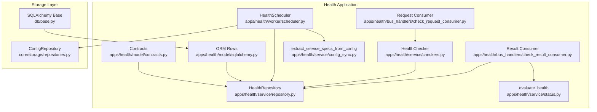
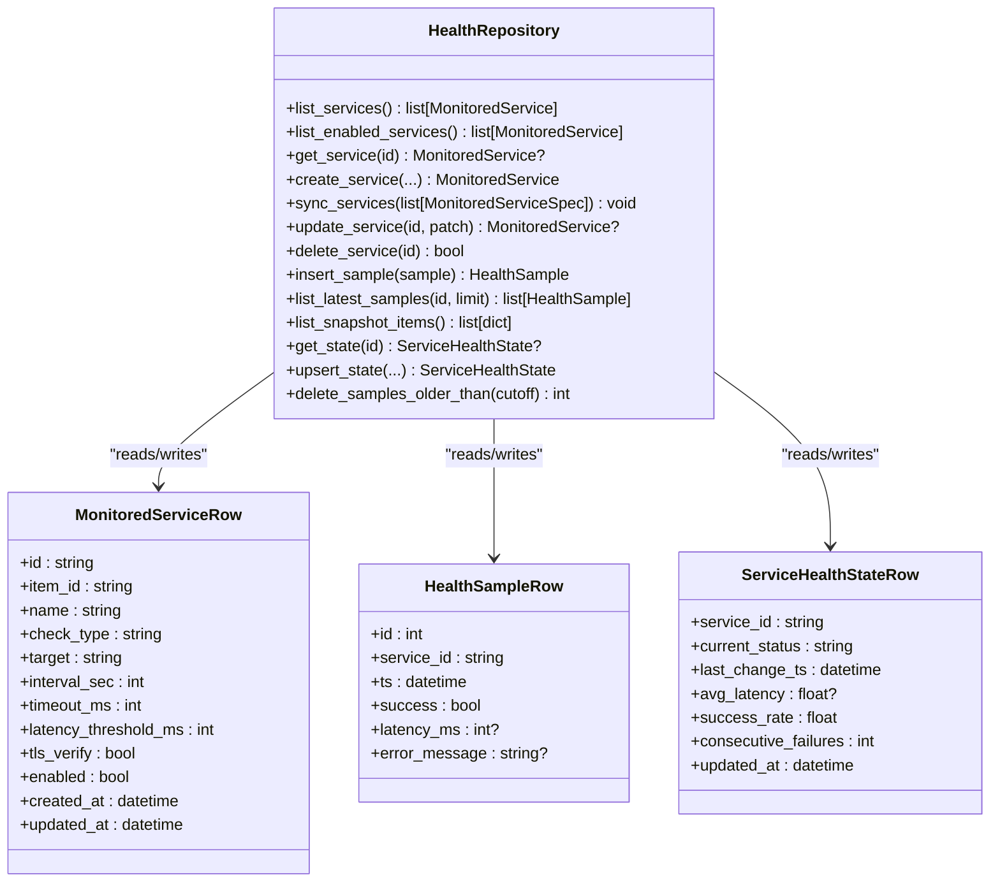
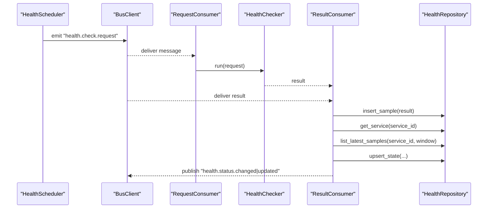
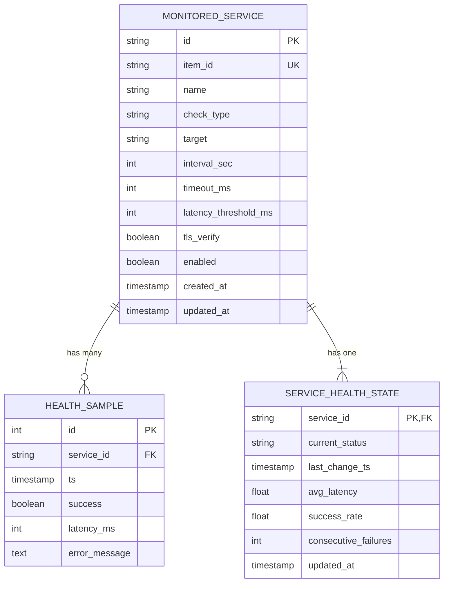
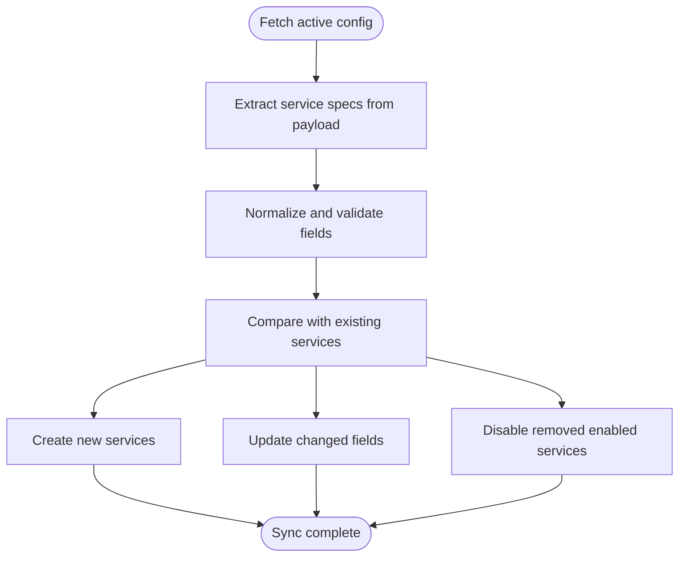
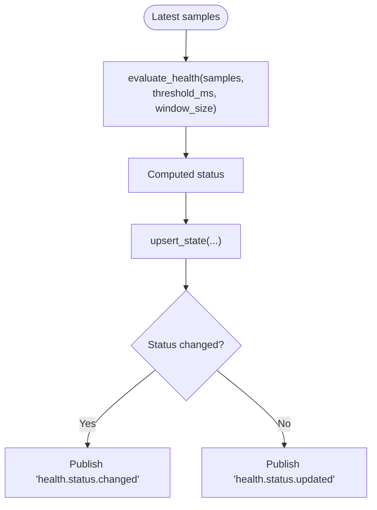
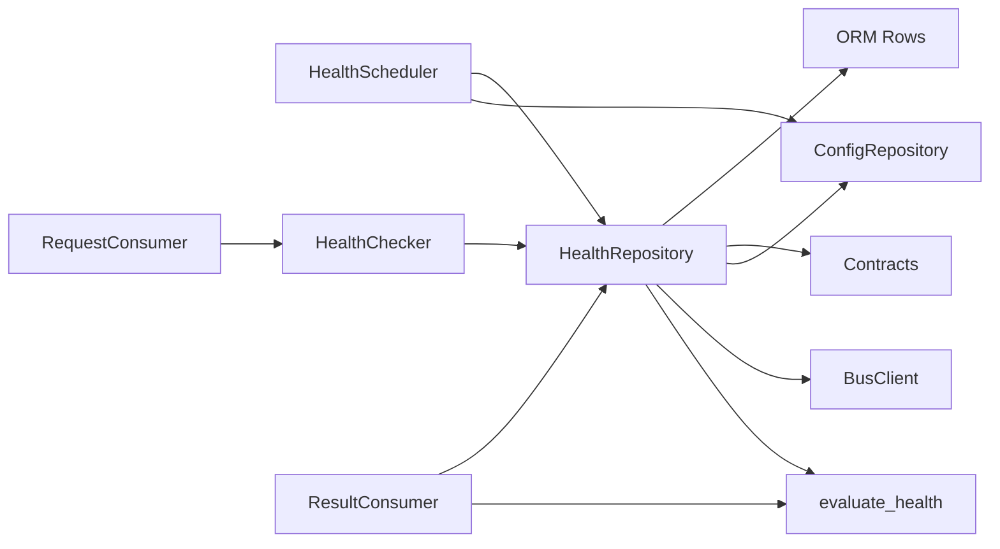

# Health Repository

<cite>
**Referenced Files in This Document**
- [apps/health/service/repository.py](file://apps/health/service/repository.py)
- [apps/health/model/sqlalchemy.py](file://apps/health/model/sqlalchemy.py)
- [apps/health/model/contracts.py](file://apps/health/model/contracts.py)
- [apps/health/service/checkers.py](file://apps/health/service/checkers.py)
- [apps/health/service/config_sync.py](file://apps/health/service/config_sync.py)
- [apps/health/service/status.py](file://apps/health/service/status.py)
- [apps/health/bus_handlers/check_request_consumer.py](file://apps/health/bus_handlers/check_request_consumer.py)
- [apps/health/bus_handlers/check_result_consumer.py](file://apps/health/bus_handlers/check_result_consumer.py)
- [apps/health/worker/scheduler.py](file://apps/health/worker/scheduler.py)
- [db/base.py](file://db/base.py)
- [core/storage/repositories.py](file://core/storage/repositories.py)
- [alembic/versions/20260223_0002_health_mvp.py](file://alembic/versions/20260223_0002_health_mvp.py)
</cite>

## Table of Contents
1. [Introduction](#introduction)
2. [Project Structure](#project-structure)
3. [Core Components](#core-components)
4. [Architecture Overview](#architecture-overview)
5. [Detailed Component Analysis](#detailed-component-analysis)
6. [Dependency Analysis](#dependency-analysis)
7. [Performance Considerations](#performance-considerations)
8. [Troubleshooting Guide](#troubleshooting-guide)
9. [Conclusion](#conclusion)
10. [Appendices](#appendices)

## Introduction
This document describes the Health Repository component responsible for managing health monitoring data in the system. It explains the repository pattern implementation for services, health samples, and state tracking, along with data access methods, query operations, and data manipulation workflows. It also covers service synchronization from configuration, sample storage, historical data management, data models and relationships, persistence strategies, and integration with the storage layer and data consistency mechanisms.

## Project Structure
The Health Repository lives under the health application and integrates with the broader platform via asynchronous SQLAlchemy sessions, a message bus, and configuration repositories. The key areas are:
- Data models and ORM rows for services, samples, and state
- Pydantic contracts for typed health data
- Repository for CRUD and analytics operations
- Workers and handlers for scheduling, checking, and aggregating health data
- Storage layer for configuration snapshots

**Diagram sources**
- [apps/health/service/repository.py:1-304](file://apps/health/service/repository.py#L1-L304)
- [apps/health/model/sqlalchemy.py:1-88](file://apps/health/model/sqlalchemy.py#L1-L88)
- [apps/health/model/contracts.py:1-120](file://apps/health/model/contracts.py#L1-L120)
- [apps/health/worker/scheduler.py:1-201](file://apps/health/worker/scheduler.py#L1-L201)
- [apps/health/service/checkers.py:1-199](file://apps/health/service/checkers.py#L1-L199)
- [apps/health/service/status.py:1-75](file://apps/health/service/status.py#L1-L75)
- [apps/health/service/config_sync.py:1-194](file://apps/health/service/config_sync.py#L1-L194)
- [apps/health/bus_handlers/check_request_consumer.py:1-48](file://apps/health/bus_handlers/check_request_consumer.py#L1-L48)
- [apps/health/bus_handlers/check_result_consumer.py:1-106](file://apps/health/bus_handlers/check_result_consumer.py#L1-L106)
- [db/base.py:1-11](file://db/base.py#L1-L11)
- [core/storage/repositories.py:1-304](file://core/storage/repositories.py#L1-L304)

**Section sources**
- [apps/health/service/repository.py:1-304](file://apps/health/service/repository.py#L1-L304)
- [apps/health/model/sqlalchemy.py:1-88](file://apps/health/model/sqlalchemy.py#L1-L88)
- [apps/health/model/contracts.py:1-120](file://apps/health/model/contracts.py#L1-L120)
- [apps/health/worker/scheduler.py:1-201](file://apps/health/worker/scheduler.py#L1-L201)
- [apps/health/service/checkers.py:1-199](file://apps/health/service/checkers.py#L1-L199)
- [apps/health/service/status.py:1-75](file://apps/health/service/status.py#L1-L75)
- [apps/health/service/config_sync.py:1-194](file://apps/health/service/config_sync.py#L1-L194)
- [apps/health/bus_handlers/check_request_consumer.py:1-48](file://apps/health/bus_handlers/check_request_consumer.py#L1-L48)
- [apps/health/bus_handlers/check_result_consumer.py:1-106](file://apps/health/bus_handlers/check_result_consumer.py#L1-L106)
- [db/base.py:1-11](file://db/base.py#L1-L11)
- [core/storage/repositories.py:1-304](file://core/storage/repositories.py#L1-L304)

## Core Components
- HealthRepository: Central repository implementing CRUD and analytics operations for monitored services, health samples, and service health state. It uses asynchronous SQLAlchemy sessions and ensures UTC timestamps.
- ORM Rows: Typed SQLAlchemy declarative models for services, samples, and state with appropriate indexes and foreign keys.
- Contracts: Pydantic models defining the canonical shapes for services, samples, state, and bus messages.
- HealthScheduler: Schedules periodic checks, syncs services from configuration, prunes old samples, and logs heartbeats.
- HealthChecker: Executes checks for HTTP, TCP, and ICMP targets with timeouts and TLS verification.
- Status evaluator: Computes aggregated health status from recent samples.
- Config sync: Extracts service specs from configuration payloads and normalizes them.
- Bus consumers: Handle check requests and results, persist samples, compute state, and publish events.

**Section sources**
- [apps/health/service/repository.py:29-304](file://apps/health/service/repository.py#L29-L304)
- [apps/health/model/sqlalchemy.py:23-87](file://apps/health/model/sqlalchemy.py#L23-L87)
- [apps/health/model/contracts.py:13-119](file://apps/health/model/contracts.py#L13-L119)
- [apps/health/worker/scheduler.py:19-201](file://apps/health/worker/scheduler.py#L19-L201)
- [apps/health/service/checkers.py:15-199](file://apps/health/service/checkers.py#L15-L199)
- [apps/health/service/status.py:10-75](file://apps/health/service/status.py#L10-L75)
- [apps/health/service/config_sync.py:17-194](file://apps/health/service/config_sync.py#L17-L194)
- [apps/health/bus_handlers/check_request_consumer.py:10-48](file://apps/health/bus_handlers/check_request_consumer.py#L10-L48)
- [apps/health/bus_handlers/check_result_consumer.py:14-106](file://apps/health/bus_handlers/check_result_consumer.py#L14-L106)

## Architecture Overview
The Health Repository sits at the intersection of configuration ingestion, scheduled checks, result aggregation, and state persistence. It maintains three core entities:
- MonitoredService: definition and configuration of a monitored endpoint
- HealthSample: individual check outcomes with timestamps
- ServiceHealthState: rolling aggregates and status per service

**Diagram sources**
- [apps/health/service/repository.py:29-304](file://apps/health/service/repository.py#L29-L304)
- [apps/health/model/sqlalchemy.py:23-87](file://apps/health/model/sqlalchemy.py#L23-L87)

## Detailed Component Analysis

### HealthRepository: Data Access and Manipulation
Responsibilities:
- Service lifecycle: list, get, create, update, delete, and sync from specs
- Sample lifecycle: insert, list latest, and prune old samples
- State lifecycle: get and upsert computed state
- Snapshot generation for dashboards

Key operations and behaviors:
- Asynchronous transactions: All write operations are wrapped in transaction scopes.
- UTC normalization: Timestamps are normalized to UTC to avoid timezone inconsistencies.
- Spec-driven sync: Service definitions are synchronized from configuration-derived specs, enabling idempotent updates and safe pruning of disabled services.
- Aggregation-aware state: Upsert preserves last change timestamp when status does not change.

**Diagram sources**
- [apps/health/worker/scheduler.py:68-139](file://apps/health/worker/scheduler.py#L68-L139)
- [apps/health/bus_handlers/check_request_consumer.py:26-44](file://apps/health/bus_handlers/check_request_consumer.py#L26-L44)
- [apps/health/service/checkers.py:20-37](file://apps/health/service/checkers.py#L20-L37)
- [apps/health/bus_handlers/check_result_consumer.py:39-102](file://apps/health/bus_handlers/check_result_consumer.py#L39-L102)
- [apps/health/service/repository.py:157-260](file://apps/health/service/repository.py#L157-L260)

**Section sources**
- [apps/health/service/repository.py:29-304](file://apps/health/service/repository.py#L29-L304)

### Data Models, Relationships, and Persistence
- MonitoredServiceRow: primary entity storing service configuration and metadata
- HealthSampleRow: time-series outcomes linked to a service with cascading deletes
- ServiceHealthStateRow: per-service rolling state with foreign key to service
- Indexes: optimized queries for enabled services, service+timestamp, and status filtering
- Cascade deletes: removing a service removes dependent samples and state

**Diagram sources**
- [apps/health/model/sqlalchemy.py:23-87](file://apps/health/model/sqlalchemy.py#L23-L87)
- [alembic/versions/20260223_0002_health_mvp.py:15-82](file://alembic/versions/20260223_0002_health_mvp.py#L15-L82)

**Section sources**
- [apps/health/model/sqlalchemy.py:23-87](file://apps/health/model/sqlalchemy.py#L23-L87)
- [alembic/versions/20260223_0002_health_mvp.py:15-82](file://alembic/versions/20260223_0002_health_mvp.py#L15-L82)

### Service Synchronization from Configuration
- Extract specs from configuration payload, normalize fields, and derive stable IDs
- Sync against existing services: create missing, update changed, disable removed enabled services
- Respect defaults for intervals, timeouts, and thresholds
- Emit idempotent changes and maintain UTC timestamps

**Diagram sources**
- [apps/health/worker/scheduler.py:141-150](file://apps/health/worker/scheduler.py#L141-L150)
- [apps/health/service/config_sync.py:17-130](file://apps/health/service/config_sync.py#L17-L130)
- [apps/health/service/repository.py:88-134](file://apps/health/service/repository.py#L88-L134)

**Section sources**
- [apps/health/worker/scheduler.py:141-150](file://apps/health/worker/scheduler.py#L141-L150)
- [apps/health/service/config_sync.py:17-130](file://apps/health/service/config_sync.py#L17-L130)
- [apps/health/service/repository.py:88-134](file://apps/health/service/repository.py#L88-L134)

### Sample Storage and Historical Data Management
- Insert samples atomically and flush to obtain persisted IDs
- List latest samples per service with configurable window size
- Prune old samples by cutoff timestamp to control history size
- Indexes support efficient time-range queries and global time scans

Practical usage patterns:
- After each check result, persist the sample and compute a rolling status
- Periodically prune samples older than a retention threshold

**Section sources**
- [apps/health/service/repository.py:157-180](file://apps/health/service/repository.py#L157-L180)
- [apps/health/service/repository.py:256-260](file://apps/health/service/repository.py#L256-L260)
- [apps/health/worker/scheduler.py:109-113](file://apps/health/worker/scheduler.py#L109-L113)

### State Tracking and Evaluation
- Retrieve current state or upsert computed state with last-change timestamp preservation
- Evaluate health from recent samples considering thresholds and window size
- Publish status-changed or status-updated events when state transitions occur

**Diagram sources**
- [apps/health/service/status.py:10-75](file://apps/health/service/status.py#L10-L75)
- [apps/health/bus_handlers/check_result_consumer.py:59-102](file://apps/health/bus_handlers/check_result_consumer.py#L59-L102)
- [apps/health/service/repository.py:220-254](file://apps/health/service/repository.py#L220-L254)

**Section sources**
- [apps/health/service/status.py:10-75](file://apps/health/service/status.py#L10-L75)
- [apps/health/bus_handlers/check_result_consumer.py:59-102](file://apps/health/bus_handlers/check_result_consumer.py#L59-L102)
- [apps/health/service/repository.py:220-254](file://apps/health/service/repository.py#L220-L254)

### Integration with Storage Layer and Consistency
- HealthRepository uses async SQLAlchemy sessions to ensure ACID-like semantics per operation
- UTC normalization prevents timezone drift across services and samples
- Foreign keys and cascade deletes maintain referential integrity
- ConfigRepository provides canonical active configuration snapshots for service sync
- Indexes on frequently queried columns optimize reads for enabled services, snapshots, and time-series

**Section sources**
- [apps/health/service/repository.py:23-26](file://apps/health/service/repository.py#L23-L26)
- [apps/health/model/sqlalchemy.py:39-80](file://apps/health/model/sqlalchemy.py#L39-L80)
- [core/storage/repositories.py:59-72](file://core/storage/repositories.py#L59-L72)

## Dependency Analysis
- HealthRepository depends on:
  - ORM rows for persistence
  - Contracts for typed inputs/outputs
  - ConfigRepository for active configuration snapshots
  - Bus client for emitting check requests and publishing events
  - Status evaluator for computing health state
  - HealthChecker for executing checks
- Coupling and cohesion:
  - High cohesion around health domain entities
  - Low coupling via typed contracts and async sessions
  - Clear separation between scheduling, checking, and aggregation

**Diagram sources**
- [apps/health/service/repository.py:29-304](file://apps/health/service/repository.py#L29-L304)
- [apps/health/model/sqlalchemy.py:23-87](file://apps/health/model/sqlalchemy.py#L23-L87)
- [apps/health/model/contracts.py:13-119](file://apps/health/model/contracts.py#L13-L119)
- [apps/health/worker/scheduler.py:19-201](file://apps/health/worker/scheduler.py#L19-L201)
- [apps/health/service/checkers.py:15-199](file://apps/health/service/checkers.py#L15-L199)
- [apps/health/service/status.py:10-75](file://apps/health/service/status.py#L10-L75)
- [apps/health/bus_handlers/check_request_consumer.py:10-48](file://apps/health/bus_handlers/check_request_consumer.py#L10-L48)
- [apps/health/bus_handlers/check_result_consumer.py:14-106](file://apps/health/bus_handlers/check_result_consumer.py#L14-L106)
- [core/storage/repositories.py:55-141](file://core/storage/repositories.py#L55-L141)

**Section sources**
- [apps/health/service/repository.py:29-304](file://apps/health/service/repository.py#L29-L304)
- [apps/health/worker/scheduler.py:19-201](file://apps/health/worker/scheduler.py#L19-L201)
- [apps/health/bus_handlers/check_request_consumer.py:10-48](file://apps/health/bus_handlers/check_request_consumer.py#L10-L48)
- [apps/health/bus_handlers/check_result_consumer.py:14-106](file://apps/health/bus_handlers/check_result_consumer.py#L14-L106)
- [core/storage/repositories.py:55-141](file://core/storage/repositories.py#L55-L141)

## Performance Considerations
- Indexes:
  - Service listing and filtering benefit from composite index on enabled and updated_at
  - Sample queries benefit from service+timestamp and timestamp-only indexes
- Time-series growth:
  - Use retention pruning to cap sample count and reduce I/O
- Window size:
  - Keep window_size aligned with desired SLIs; larger windows increase computation cost
- Concurrency:
  - Async sessions enable concurrent operations; batch work where possible
- Event volume:
  - Status-changed events are emitted only on transitions; consider downstream load

[No sources needed since this section provides general guidance]

## Troubleshooting Guide
Common issues and resolutions:
- Timezone drift in timestamps:
  - Ensure all timestamps are normalized to UTC before persistence
- Missing or stale state:
  - Verify upsert operations and that evaluation occurs after inserting samples
- Disabled services still appearing enabled:
  - Confirm sync_services disables removed services and that scheduler refreshes enabled services
- High memory usage from samples:
  - Increase retention days or prune more aggressively
- ICMP checks failing:
  - Validate ICMP availability and permissions; the checker returns specific error messages

**Section sources**
- [apps/health/service/repository.py:23-26](file://apps/health/service/repository.py#L23-L26)
- [apps/health/service/checkers.py:124-184](file://apps/health/service/checkers.py#L124-L184)
- [apps/health/worker/scheduler.py:109-113](file://apps/health/worker/scheduler.py#L109-L113)
- [apps/health/service/repository.py:88-134](file://apps/health/service/repository.py#L88-L134)

## Conclusion
The Health Repository provides a robust, typed, and asynchronous foundation for health monitoring. It cleanly separates concerns between service definitions, time-series samples, and rolling state, while integrating tightly with configuration, scheduling, and eventing. Its design supports scalability, maintainability, and predictable data consistency through UTC normalization, foreign keys, and transactional writes.

[No sources needed since this section summarizes without analyzing specific files]

## Appendices

### Practical Usage Examples
- Querying health data:
  - List enabled services and their current status snapshot
  - Retrieve latest samples for a service with a given window size
- Managing service configurations:
  - Sync services from active configuration payload
  - Update a service’s fields via patch updates
  - Delete a service and its associated samples/state
- Historical data management:
  - Prune samples older than a retention threshold
  - Inspect retention pruning counts during scheduler heartbeats

**Section sources**
- [apps/health/service/repository.py:33-47](file://apps/health/service/repository.py#L33-L47)
- [apps/health/service/repository.py:170-180](file://apps/health/service/repository.py#L170-L180)
- [apps/health/service/repository.py:88-147](file://apps/health/service/repository.py#L88-L147)
- [apps/health/service/repository.py:149-156](file://apps/health/service/repository.py#L149-L156)
- [apps/health/worker/scheduler.py:109-113](file://apps/health/worker/scheduler.py#L109-L113)