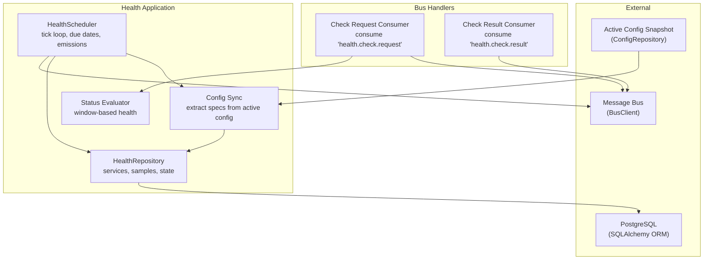
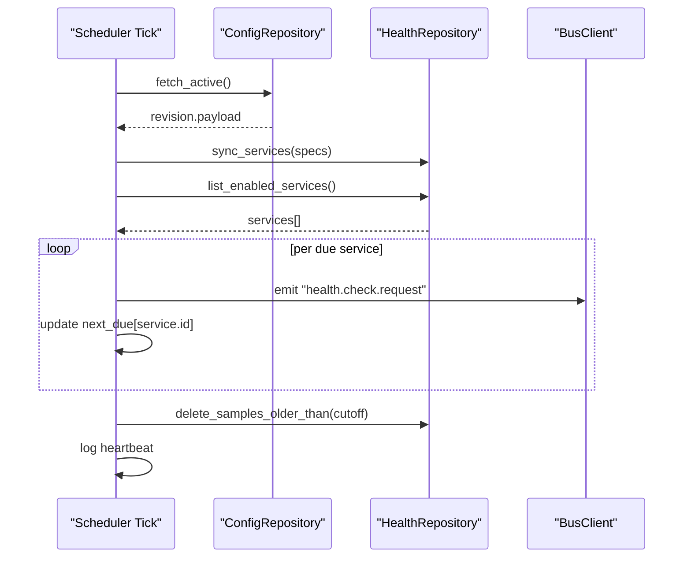
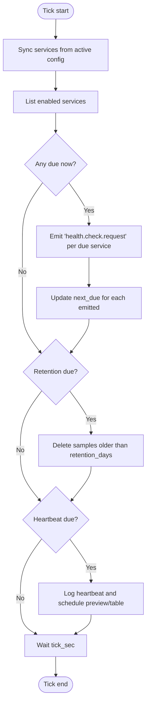
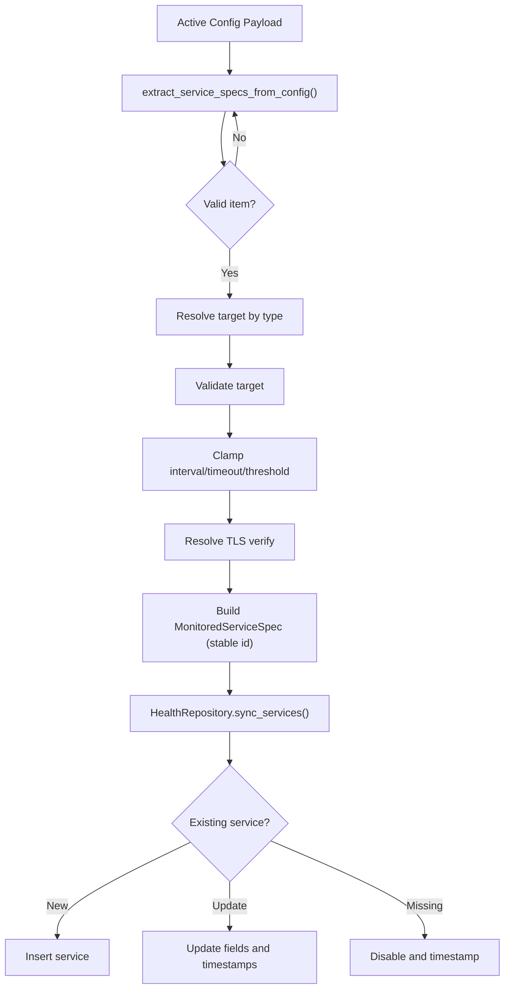
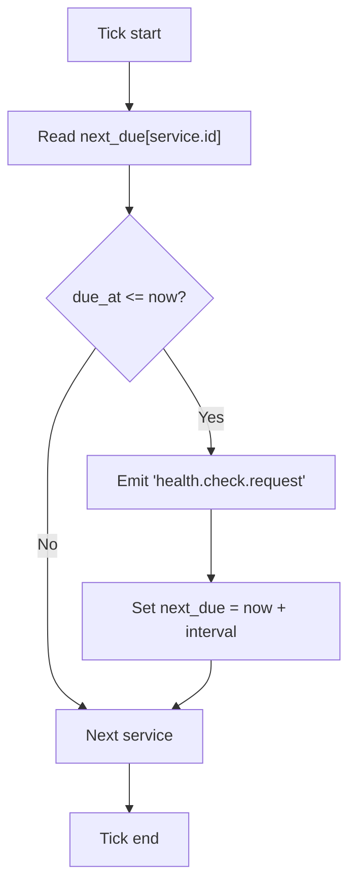
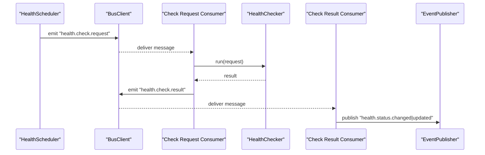
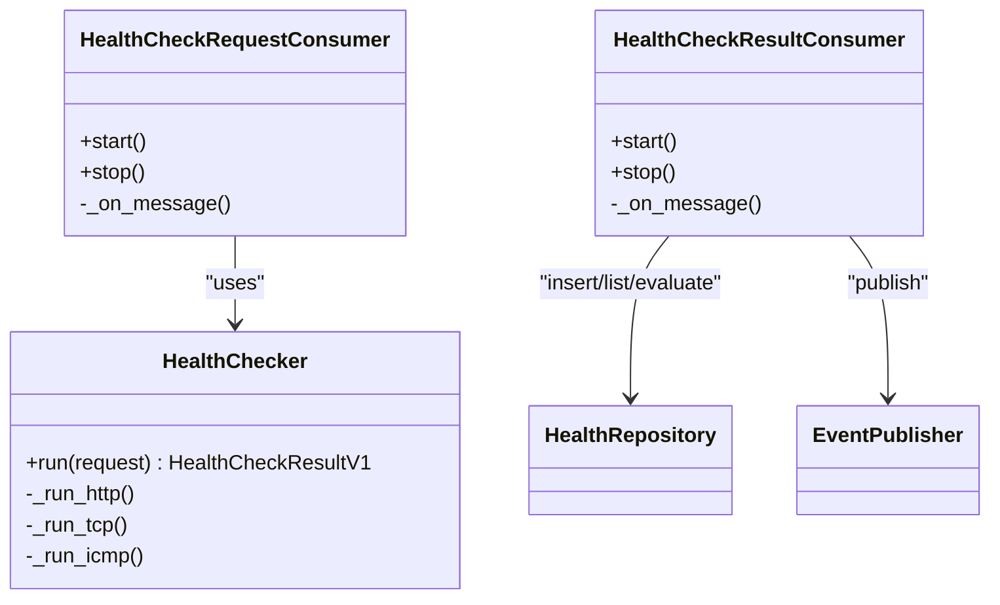
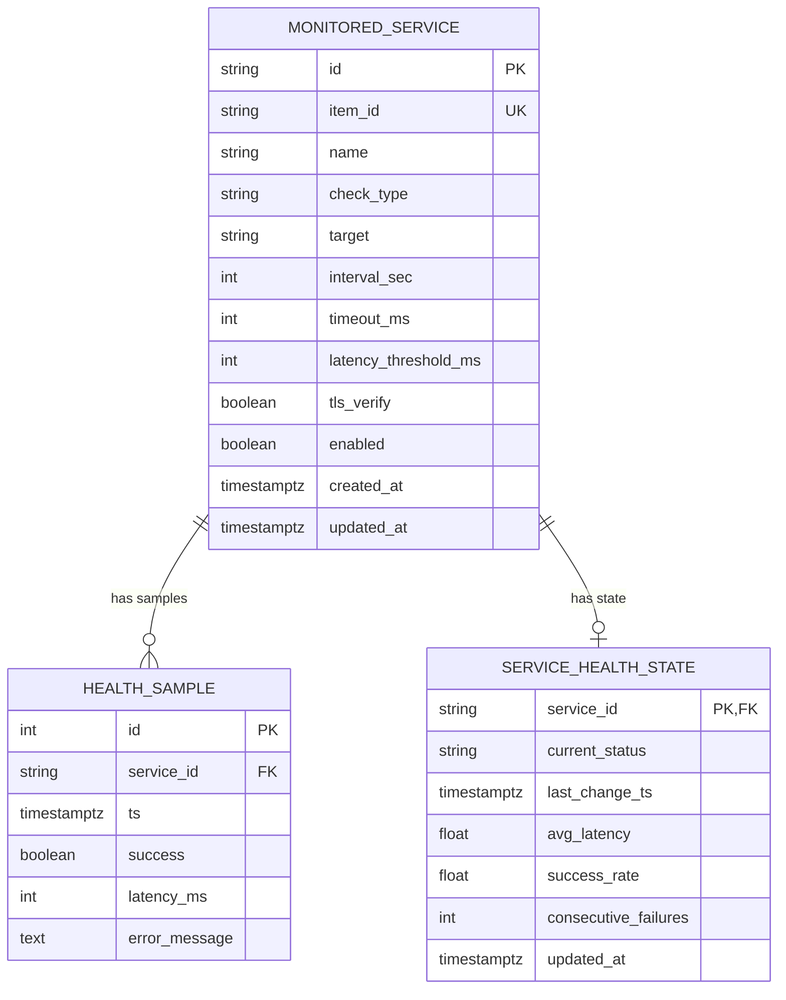
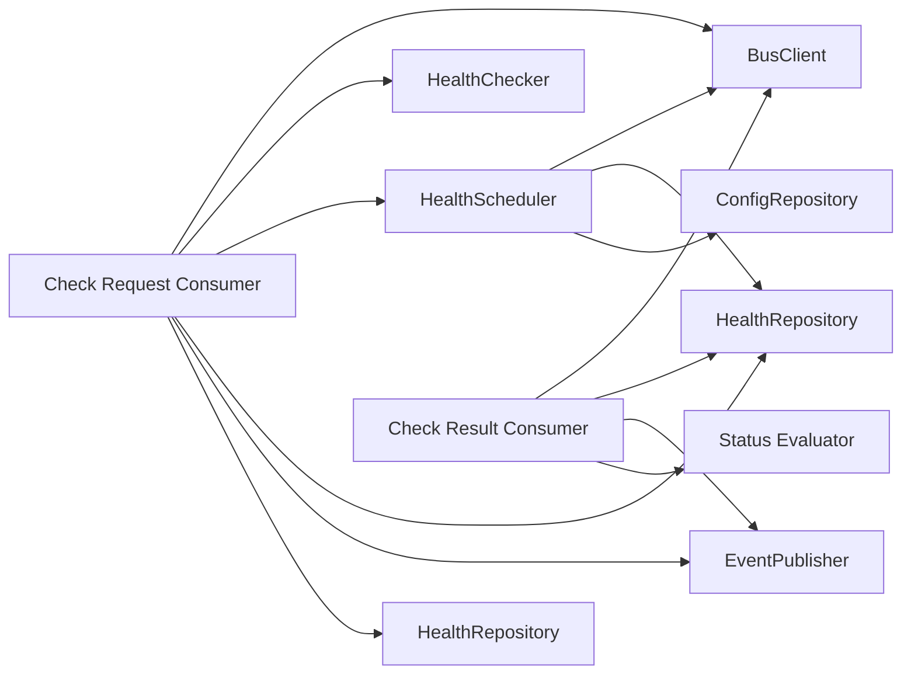

# Health Scheduler

<cite>
**Referenced Files in This Document**
- [scheduler.py](file://apps/health/worker/scheduler.py)
- [config_sync.py](file://apps/health/service/config_sync.py)
- [contracts.py](file://apps/health/model/contracts.py)
- [repository.py](file://apps/health/service/repository.py)
- [status.py](file://apps/health/service/status.py)
- [validators.py](file://apps/health/service/validators.py)
- [sqlalchemy.py](file://apps/health/model/sqlalchemy.py)
- [check_request_consumer.py](file://apps/health/bus_handlers/check_request_consumer.py)
- [check_result_consumer.py](file://apps/health/bus_handlers/check_result_consumer.py)
- [checkers.py](file://apps/health/service/checkers.py)
- [settings.py](file://config/settings.py)
- [container.py](file://config/container.py)
</cite>

## Table of Contents
1. [Introduction](#introduction)
2. [Project Structure](#project-structure)
3. [Core Components](#core-components)
4. [Architecture Overview](#architecture-overview)
5. [Detailed Component Analysis](#detailed-component-analysis)
6. [Dependency Analysis](#dependency-analysis)
7. [Performance Considerations](#performance-considerations)
8. [Troubleshooting Guide](#troubleshooting-guide)
9. [Conclusion](#conclusion)
10. [Appendices](#appendices)

## Introduction
This document explains the Health Scheduler component responsible for distributed, tick-based health monitoring. It covers the scheduler’s distributed architecture, tick-driven execution model, service synchronization from active configuration snapshots, scheduling algorithm, due date computation, and the message emission workflow. It also documents configuration parameters, monitoring and troubleshooting practices, and the relationship between scheduler ticks, service lists, and health check request generation.

## Project Structure
The Health Scheduler lives in the health application and integrates with the broader system via a message bus, configuration repository, and persistence layer. The scheduler coordinates with consumers that execute checks and persist results, and it periodically emits health check requests based on service definitions derived from active configuration.

**Diagram sources**
- [scheduler.py:68-139](file://apps/health/worker/scheduler.py#L68-L139)
- [config_sync.py:17-62](file://apps/health/service/config_sync.py#L17-L62)
- [repository.py:88-134](file://apps/health/service/repository.py#L88-L134)
- [check_request_consumer.py:15-44](file://apps/health/bus_handlers/check_request_consumer.py#L15-L44)
- [check_result_consumer.py:28-102](file://apps/health/bus_handlers/check_result_consumer.py#L28-L102)

**Section sources**
- [scheduler.py:19-48](file://apps/health/worker/scheduler.py#L19-L48)
- [container.py:354-365](file://config/container.py#L354-L365)

## Core Components
- HealthScheduler: Drives the tick loop, synchronizes services from active configuration, computes due dates per service, emits check requests, prunes old samples, and logs heartbeats.
- Config synchronization: Extracts service specifications from the active configuration payload and syncs them into the HealthRepository.
- HealthRepository: Persists monitored services, samples, and health state; supports listing enabled services, inserting samples, and pruning old data.
- Status evaluator: Computes health status from recent samples using a configurable window size and thresholds.
- Bus handlers: Consumers for check requests and results; producers of check results after executing checks.
- Validators: Normalize and validate targets and clamp configuration parameters.
- Contracts: Typed Pydantic models for messages, samples, and service definitions.

**Section sources**
- [scheduler.py:19-48](file://apps/health/worker/scheduler.py#L19-L48)
- [config_sync.py:17-62](file://apps/health/service/config_sync.py#L17-L62)
- [repository.py:29-134](file://apps/health/service/repository.py#L29-L134)
- [status.py:10-71](file://apps/health/service/status.py#L10-L71)
- [check_request_consumer.py:10-44](file://apps/health/bus_handlers/check_request_consumer.py#L10-L44)
- [check_result_consumer.py:14-102](file://apps/health/bus_handlers/check_result_consumer.py#L14-L102)
- [validators.py:13-112](file://apps/health/service/validators.py#L13-L112)
- [contracts.py:13-119](file://apps/health/model/contracts.py#L13-L119)

## Architecture Overview
The Health Scheduler runs a periodic tick loop. Each tick:
- Synchronizes services from the active configuration snapshot.
- Lists enabled services and determines which are due for a check.
- Emits a “health.check.request” message per due service.
- Updates per-service due timestamps.
- Periodically prunes old samples and logs a heartbeat with schedule preview and table.

**Diagram sources**
- [scheduler.py:68-139](file://apps/health/worker/scheduler.py#L68-L139)
- [config_sync.py:17-62](file://apps/health/service/config_sync.py#L17-L62)
- [repository.py:88-134](file://apps/health/service/repository.py#L88-L134)

## Detailed Component Analysis

### HealthScheduler
- Initialization parameters include tick interval, window size, retention days, defaults for interval/timeout/threshold, and heartbeat interval. All parameters are clamped to safe minimums.
- Tick loop:
  - Fetches active configuration and syncs services.
  - Lists enabled services and iterates to emit requests for due services.
  - Updates per-service due timestamps to now + interval.
  - Prunes samples older than retention_days and logs a heartbeat with schedule preview and table.
- Heartbeat logging includes counts of enabled services, due items, emitted requests, and pruned samples, plus a formatted schedule table and due item list.

**Diagram sources**
- [scheduler.py:68-139](file://apps/health/worker/scheduler.py#L68-L139)

**Section sources**
- [scheduler.py:19-48](file://apps/health/worker/scheduler.py#L19-L48)
- [scheduler.py:68-139](file://apps/health/worker/scheduler.py#L68-L139)

### Service Discovery and Synchronization from Active Configuration
- The scheduler fetches the active configuration snapshot and extracts service specifications using a dedicated extractor.
- The extractor:
  - Walks nested groups/subgroups/items.
  - Validates item type and healthcheck presence/flags.
  - Resolves target URLs/targets depending on check type.
  - Validates and normalizes targets.
  - Clamps intervals/timeouts/thresholds.
  - Determines TLS verification policy based on target and configuration.
  - Produces stable UUIDs from a namespace-qualified stable key.
- The repository performs a merge-like sync:
  - Upserts services present in the spec list.
  - Disables services not present in the new spec list but previously enabled.

**Diagram sources**
- [config_sync.py:17-131](file://apps/health/service/config_sync.py#L17-L131)
- [repository.py:88-134](file://apps/health/service/repository.py#L88-L134)

**Section sources**
- [scheduler.py:141-150](file://apps/health/worker/scheduler.py#L141-L150)
- [config_sync.py:17-131](file://apps/health/service/config_sync.py#L17-L131)
- [repository.py:88-134](file://apps/health/service/repository.py#L88-L134)

### Scheduling Algorithm and Due Date Calculation
- Per service, the scheduler maintains a next_due timestamp.
- On each tick:
  - If next_due ≤ now, the service is considered due.
  - For each due service, a check request is emitted.
  - next_due is updated to now + service.interval_sec.
- This creates a deterministic, per-service tick cadence aligned to the service’s configured interval.

**Diagram sources**
- [scheduler.py:75-103](file://apps/health/worker/scheduler.py#L75-L103)

**Section sources**
- [scheduler.py:75-103](file://apps/health/worker/scheduler.py#L75-L103)

### Message Emission Workflow
- Emission occurs when a service is due. The scheduler constructs a “health.check.request” message carrying:
  - Service identity and item_id
  - Check type and target
  - Timeout and latency threshold
  - TLS verification flag
  - Window size
  - Timestamp
- The message is published to the “health.check.request” routing key.

**Diagram sources**
- [scheduler.py:84-102](file://apps/health/worker/scheduler.py#L84-L102)
- [check_request_consumer.py:26-44](file://apps/health/bus_handlers/check_request_consumer.py#L26-L44)
- [check_result_consumer.py:39-102](file://apps/health/bus_handlers/check_result_consumer.py#L39-L102)

**Section sources**
- [scheduler.py:84-102](file://apps/health/worker/scheduler.py#L84-L102)
- [contracts.py:60-71](file://apps/health/model/contracts.py#L60-L71)

### Health Check Execution and Result Handling
- Request consumer validates message type/plugin_id, decodes payload, executes the appropriate check (HTTP/TCP/ICMP), and emits a “health.check.result” message with correlation_id.
- Result consumer:
  - Inserts sample into HealthRepository.
  - Loads latest samples up to window_size.
  - Evaluates health using the status evaluator.
  - Upserts service health state.
  - Publishes either “health.status.changed” (when status changed) or “health.status.updated”.

**Diagram sources**
- [checkers.py:15-199](file://apps/health/service/checkers.py#L15-L199)
- [check_request_consumer.py:10-44](file://apps/health/bus_handlers/check_request_consumer.py#L10-L44)
- [check_result_consumer.py:14-102](file://apps/health/bus_handlers/check_result_consumer.py#L14-L102)

**Section sources**
- [checkers.py:20-184](file://apps/health/service/checkers.py#L20-L184)
- [check_request_consumer.py:26-44](file://apps/health/bus_handlers/check_request_consumer.py#L26-L44)
- [check_result_consumer.py:39-102](file://apps/health/bus_handlers/check_result_consumer.py#L39-L102)

### Data Model and Persistence
- MonitoredService: persisted service definition with interval, timeout, latency threshold, TLS verification, and enabled flag.
- HealthSample: individual check outcome with success, latency, and optional error message.
- ServiceHealthState: rolling health state with current status, average latency, success rate, and consecutive failures.
- SQLAlchemy models define indexes for efficient queries and cascading deletes.

**Diagram sources**
- [sqlalchemy.py:23-81](file://apps/health/model/sqlalchemy.py#L23-L81)

**Section sources**
- [repository.py:29-304](file://apps/health/service/repository.py#L29-L304)
- [sqlalchemy.py:23-81](file://apps/health/model/sqlalchemy.py#L23-L81)

## Dependency Analysis
- HealthScheduler depends on:
  - BusClient for emitting and consuming messages.
  - HealthRepository for listing/enabled services, syncing specs, inserting samples, pruning, and state operations.
  - ConfigRepository for fetching active configuration snapshots.
- Consumers depend on:
  - BusClient for message transport.
  - HealthChecker for executing checks.
  - EventPublisher for publishing health status events.
- Validators and contracts ensure type safety and normalization across the pipeline.

**Diagram sources**
- [scheduler.py:19-48](file://apps/health/worker/scheduler.py#L19-L48)
- [check_request_consumer.py:10-44](file://apps/health/bus_handlers/check_request_consumer.py#L10-L44)
- [check_result_consumer.py:14-102](file://apps/health/bus_handlers/check_result_consumer.py#L14-L102)

**Section sources**
- [container.py:354-365](file://config/container.py#L354-L365)

## Performance Considerations
- Tick interval: Controls scheduler frequency; lower values increase bus traffic and CPU usage. Minimum enforced to avoid excessive load.
- Window size: Limits the number of samples used for health evaluation; larger windows smooth metrics but increase memory and compute overhead.
- Retention days: Balances historical insight against storage growth; pruning runs periodically to cap data age.
- Prefetch count: Global bus setting affects throughput of consumers; tune according to worker capacity.
- Target validation and clamping: Prevent invalid or extreme configurations that could cause timeouts or resource exhaustion.

[No sources needed since this section provides general guidance]

## Troubleshooting Guide
Common symptoms and diagnostics:
- No checks emitted:
  - Verify scheduler heartbeat logs show enabled services and due items.
  - Confirm active configuration snapshot contains expected groups/subgroups/items and that services are enabled.
  - Check that tick_sec is not excessively large and heartbeat_sec is not masking frequent ticks.
- Checks not completing:
  - Inspect “health.check.request” consumer logs for decoding/validation errors.
  - Review “health.check.result” consumer logs for insert/evaluation errors.
  - Validate target URLs/hosts and TLS verification settings.
- Incorrect health status:
  - Adjust window_size and latency thresholds.
  - Confirm ICMP availability if ICMP checks are used.
- Excessive logs or slow ticks:
  - Increase tick_sec and heartbeat_sec.
  - Reduce window_size or retention_days.
- Database growth:
  - Ensure retention pruning runs as scheduled; verify retention_days is set appropriately.

Operational tips:
- Monitor scheduler heartbeat logs for counts and schedule preview.
- Use the schedule table output to inspect near-future due items.
- Correlate “health.check.request” and “health.check.result” messages using correlation_id for end-to-end tracing.

**Section sources**
- [scheduler.py:114-132](file://apps/health/worker/scheduler.py#L114-L132)
- [check_request_consumer.py:26-44](file://apps/health/bus_handlers/check_request_consumer.py#L26-L44)
- [check_result_consumer.py:39-102](file://apps/health/bus_handlers/check_result_consumer.py#L39-L102)

## Conclusion
The Health Scheduler implements a robust, distributed, tick-based health monitoring system. It derives service definitions from active configuration, schedules periodic checks per service, emits typed bus messages, and evaluates outcomes using a sliding-window approach. With tunable parameters for tick frequency, window size, retention, and defaults, it balances responsiveness, accuracy, and resource usage. Proper monitoring and configuration ensure reliable operation across HTTP, TCP, and ICMP checks.

[No sources needed since this section summarizes without analyzing specific files]

## Appendices

### Configuration Parameters
- health_scheduler_tick_sec: Scheduler tick interval (minimum enforced).
- health_scheduler_heartbeat_sec: Heartbeat logging interval (minimum enforced).
- health_window_size: Number of samples used for health evaluation (clamped).
- health_retention_days: Days of sample history to retain (clamped).
- health_default_interval_sec: Default interval for services without explicit interval (clamped).
- health_default_timeout_ms: Default timeout for checks (clamped).
- health_default_latency_threshold_ms: Default latency threshold for degraded status (clamped).
- health_icmp_enabled: Whether ICMP checks are permitted.

**Section sources**
- [settings.py:59-74](file://config/settings.py#L59-L74)
- [container.py:354-365](file://config/container.py#L354-L365)

### Practical Examples
- Scheduler configuration:
  - Set health_scheduler_tick_sec to balance responsiveness vs. load.
  - Set health_scheduler_heartbeat_sec to a comfortable monitoring cadence.
  - Tune health_window_size for desired smoothing of metrics.
  - Configure health_retention_days to control storage footprint.
  - Adjust health_default_interval_sec/timeout/threshold to match target SLAs.
- Monitoring scheduler logs:
  - Observe heartbeat lines for enabled services, due items, emitted requests, and pruned samples.
  - Review the schedule table for upcoming due items and remaining times.
- Troubleshooting scheduling issues:
  - If no due items appear, confirm active configuration snapshot and service enabled flags.
  - If checks fail frequently, adjust timeouts, thresholds, or TLS verification.
  - If latency spikes skew status, increase window_size or threshold.

**Section sources**
- [scheduler.py:114-132](file://apps/health/worker/scheduler.py#L114-L132)
- [container.py:116-145](file://config/container.py#L116-L145)