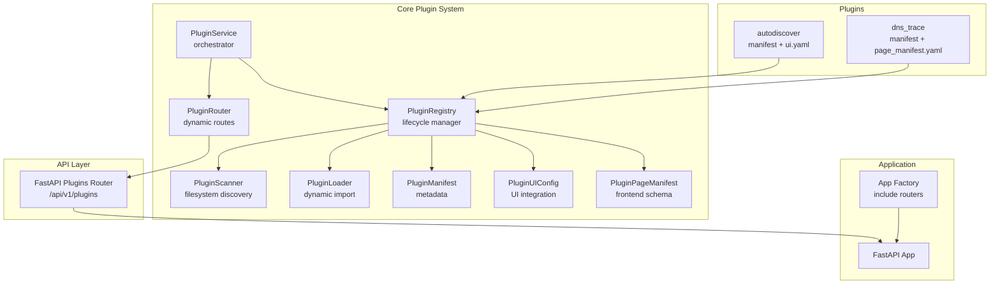
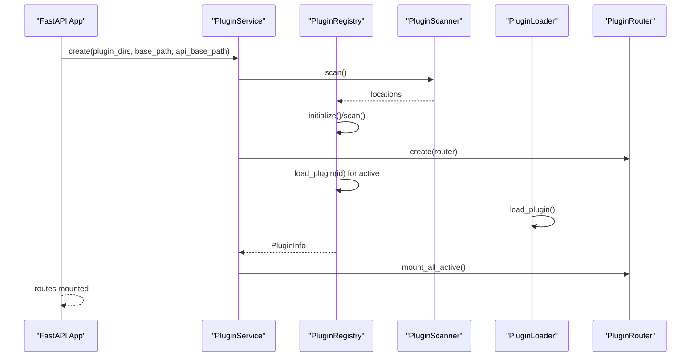
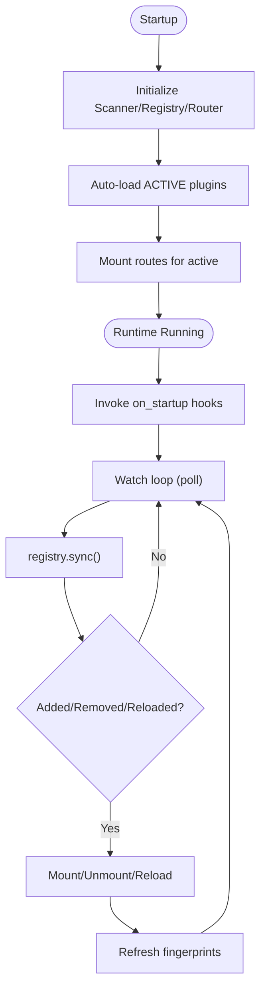
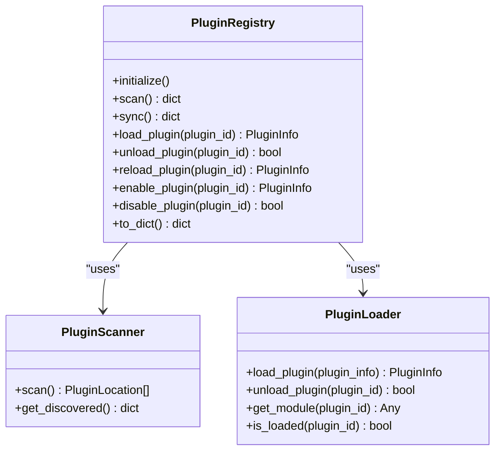
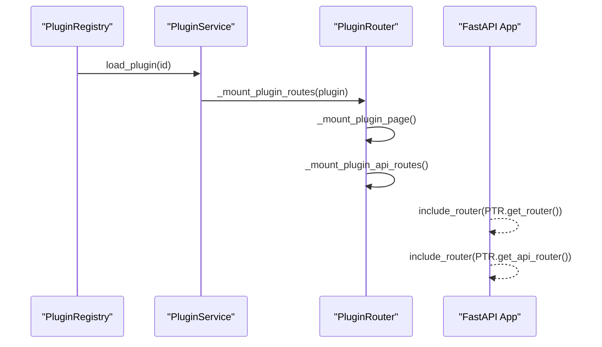
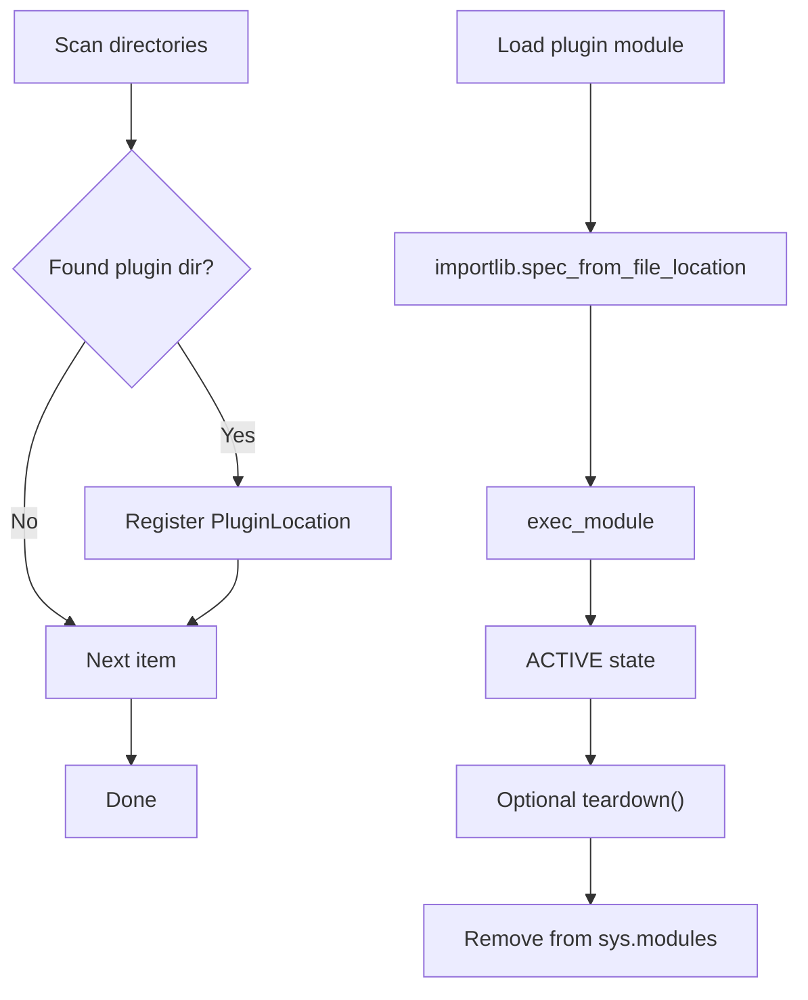
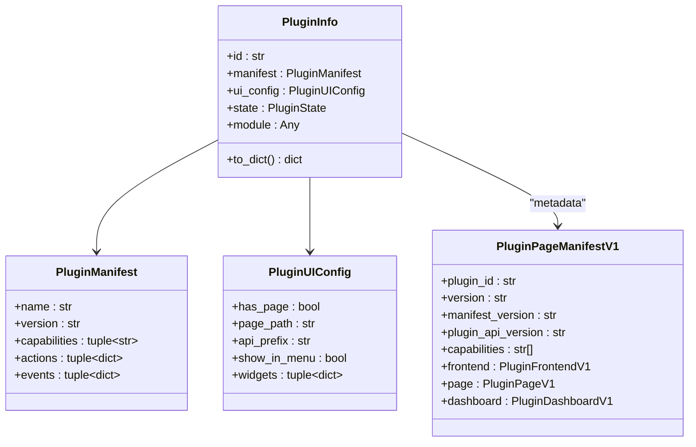
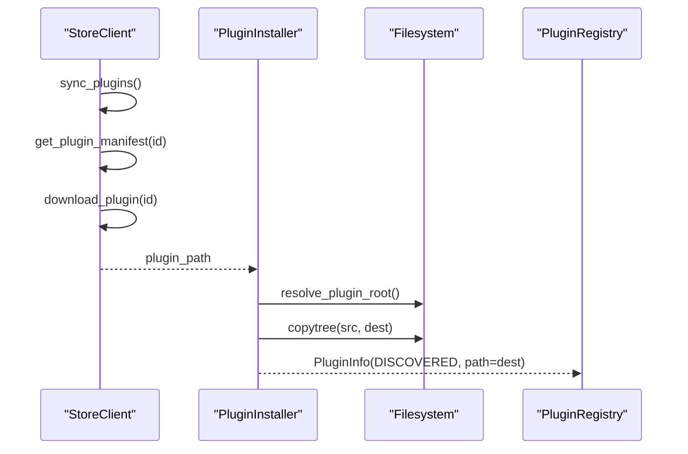
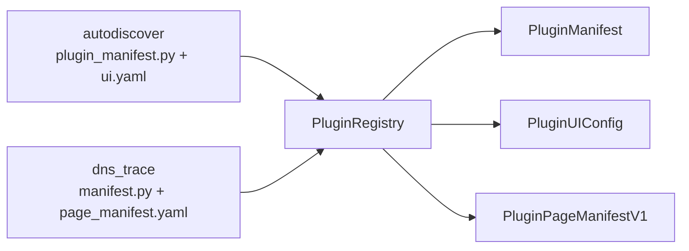
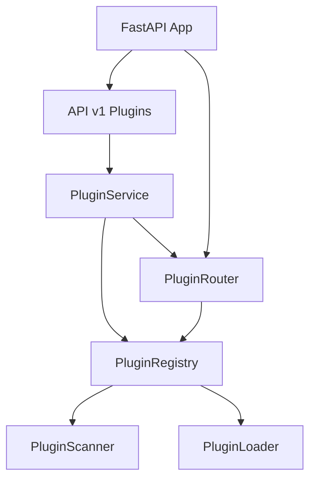

# Plugin Architecture Overview

<cite>
**Referenced Files in This Document**
- [service.py](file://core/plugins/service.py)
- [registry.py](file://core/plugins/registry.py)
- [router.py](file://core/plugins/router.py)
- [loader.py](file://core/plugins/loader.py)
- [schemas.py](file://core/plugins/schemas.py)
- [page_manifest.py](file://core/plugins/page_manifest.py)
- [store.py](file://core/plugins/store.py)
- [plugins.py](file://api/v1/plugins.py)
- [app_factory.py](file://app_factory.py)
- [main.py](file://main.py)
- [plugin_manifest.py](file://plugins/autodiscover/plugin_manifest.py)
- [ui.yaml](file://plugins/autodiscover/ui.yaml)
- [manifest.py](file://plugins/dns_trace/manifest.py)
- [page_manifest.yaml](file://plugins/dns_trace/page_manifest.yaml)
</cite>

## Table of Contents
1. [Introduction](#introduction)
2. [Project Structure](#project-structure)
3. [Core Components](#core-components)
4. [Architecture Overview](#architecture-overview)
5. [Detailed Component Analysis](#detailed-component-analysis)
6. [Dependency Analysis](#dependency-analysis)
7. [Performance Considerations](#performance-considerations)
8. [Troubleshooting Guide](#troubleshooting-guide)
9. [Conclusion](#conclusion)

## Introduction
This document explains the plugin system architecture and design patterns used in the backend. It focuses on how plugins are discovered, loaded, enabled/disabled, routed, and executed at runtime. The system centers around four key components:
- PluginService: The orchestrator that coordinates discovery, loading, enabling, routing, and lifecycle hooks.
- PluginRegistry: Manages plugin lifecycle states and loads/unloads modules.
- PluginRouter: Dynamically mounts plugin pages and APIs into the FastAPI application.
- PluginScanner and PluginLoader: Handle filesystem discovery and dynamic import of plugin packages.

The plugin system supports event-driven lifecycle hooks (startup/shutdown), dependency injection via setup kwargs, and a clear separation of concerns across discovery, loading, routing, and execution phases.

## Project Structure
The plugin system spans several modules under core/plugins and integrates with API endpoints and the application factory.

**Diagram sources**
- [service.py:18-74](file://core/plugins/service.py#L18-L74)
- [registry.py:26-50](file://core/plugins/registry.py#L26-L50)
- [router.py:16-52](file://core/plugins/router.py#L16-L52)
- [loader.py:23-47](file://core/plugins/loader.py#L23-L47)
- [schemas.py:25-92](file://core/plugins/schemas.py#L25-L92)
- [page_manifest.py:152-171](file://core/plugins/page_manifest.py#L152-L171)
- [plugins.py:19-362](file://api/v1/plugins.py#L19-L362)
- [app_factory.py:20-28](file://app_factory.py#L20-L28)

**Section sources**
- [service.py:18-74](file://core/plugins/service.py#L18-L74)
- [registry.py:26-50](file://core/plugins/registry.py#L26-L50)
- [router.py:16-52](file://core/plugins/router.py#L16-L52)
- [loader.py:23-47](file://core/plugins/loader.py#L23-L47)
- [schemas.py:25-92](file://core/plugins/schemas.py#L25-L92)
- [page_manifest.py:152-171](file://core/plugins/page_manifest.py#L152-L171)
- [plugins.py:19-362](file://api/v1/plugins.py#L19-L362)
- [app_factory.py:20-28](file://app_factory.py#L20-L28)

## Core Components
- PluginService: Central orchestrator that initializes scanner, registry, and router; manages runtime lifecycle hooks; and exposes CRUD operations for plugins.
- PluginRegistry: Maintains plugin state machine, loads/unloads modules, parses manifests/UI configs, and resolves page manifests.
- PluginRouter: Mounts plugin pages and APIs into FastAPI routers; handles route unmounting and static asset hints.
- PluginScanner: Discovers plugin packages by scanning directories for valid plugin layouts.
- PluginLoader: Dynamically imports plugin modules and manages teardown.
- Schemas: Defines PluginInfo, PluginManifest, PluginUIConfig, PluginState, and PluginScope.
- Page Manifest: Validates and serializes plugin page/dashboard/frontend manifests.
- Store Integration: Provides StoreClient and PluginInstaller for remote plugin installation.

**Section sources**
- [service.py:18-299](file://core/plugins/service.py#L18-L299)
- [registry.py:26-407](file://core/plugins/registry.py#L26-L407)
- [router.py:16-448](file://core/plugins/router.py#L16-L448)
- [loader.py:23-329](file://core/plugins/loader.py#L23-L329)
- [schemas.py:9-131](file://core/plugins/schemas.py#L9-L131)
- [page_manifest.py:152-347](file://core/plugins/page_manifest.py#L152-L347)
- [store.py:17-239](file://core/plugins/store.py#L17-L239)

## Architecture Overview
The plugin system follows a layered architecture:
- Discovery: PluginScanner scans configured directories and registers plugin locations.
- Registration: PluginRegistry creates PluginInfo entries, parses manifests and UI configs, and resolves page manifests.
- Loading: PluginLoader dynamically imports plugin modules and invokes optional setup hooks.
- Routing: PluginRouter mounts plugin pages and APIs into FastAPI routers.
- Runtime: PluginService schedules startup/shutdown hooks and monitors filesystem changes.

**Diagram sources**
- [service.py:30-73](file://core/plugins/service.py#L30-L73)
- [registry.py:71-98](file://core/plugins/registry.py#L71-L98)
- [router.py:433-436](file://core/plugins/router.py#L433-L436)
- [loader.py:119-171](file://core/plugins/loader.py#L119-L171)

## Detailed Component Analysis

### PluginService: Orchestration and Lifecycle Hooks
Responsibilities:
- Initialize scanner, registry, and router.
- Auto-load active plugins during initialization.
- Expose operations: list, get, load, unload, reload, enable, disable.
- Manage runtime lifecycle: schedule and invoke on_startup/on_shutdown hooks.
- Watch filesystem for changes and refresh runtime state.

Key behaviors:
- Startup/shutdown hooks are scheduled asynchronously and tracked per plugin.
- Runtime refresh compares fingerprints of plugin directories and triggers reloads or mounts as needed.

**Diagram sources**
- [service.py:30-73](file://core/plugins/service.py#L30-L73)
- [service.py:188-201](file://core/plugins/service.py#L188-L201)
- [service.py:224-283](file://core/plugins/service.py#L224-L283)

**Section sources**
- [service.py:18-299](file://core/plugins/service.py#L18-L299)

### PluginRegistry: Lifecycle Management and Module Loading
Responsibilities:
- Discover plugins via PluginScanner.
- Parse manifests and UI configs from either Python modules or YAML files.
- Load/unload plugin modules via PluginLoader.
- Invoke setup(teardown) hooks if present.
- Maintain state transitions: DISCOVERED → LOADING → ACTIVE → ERROR/DISABLED.

Patterns:
- Factory-like creation of PluginInfo from discovered locations.
- Signature-aware invocation of setup to inject supported kwargs.

**Diagram sources**
- [registry.py:26-407](file://core/plugins/registry.py#L26-L407)
- [loader.py:110-218](file://core/plugins/loader.py#L110-L218)
- [loader.py:23-108](file://core/plugins/loader.py#L23-L108)

**Section sources**
- [registry.py:26-407](file://core/plugins/registry.py#L26-L407)
- [loader.py:110-218](file://core/plugins/loader.py#L110-L218)

### PluginRouter: Dynamic Route Mounting
Responsibilities:
- Mount plugin pages and APIs into FastAPI routers.
- Support route unmounting on disable/unload.
- Render default plugin pages if no custom handler exists.
- Include plugin-provided API routers when present.

Integration:
- Mounted by app factory into the main application.
- Exposes management endpoints via API router.

**Diagram sources**
- [router.py:118-156](file://core/plugins/router.py#L118-L156)
- [router.py:195-236](file://core/plugins/router.py#L195-L236)
- [router.py:404-420](file://core/plugins/router.py#L404-L420)
- [app_factory.py:20-28](file://app_factory.py#L20-L28)

**Section sources**
- [router.py:16-448](file://core/plugins/router.py#L16-L448)
- [app_factory.py:20-28](file://app_factory.py#L20-L28)

### PluginScanner and PluginLoader: Discovery and Dynamic Import
Discovery:
- Scans directories for plugin packages that contain __init__.py and a manifest file.
- Supports nested subdirectories and marks discovered packages with scope.

Dynamic Import:
- Uses importlib to load plugin modules at runtime.
- Calls teardown on unload and cleans sys.modules.

**Diagram sources**
- [loader.py:48-108](file://core/plugins/loader.py#L48-L108)
- [loader.py:119-171](file://core/plugins/loader.py#L119-L171)
- [loader.py:173-206](file://core/plugins/loader.py#L173-L206)

**Section sources**
- [loader.py:23-329](file://core/plugins/loader.py#L23-L329)

### Plugin Data Models and Page Manifests
- PluginInfo: Aggregates manifest, UI config, state, module, and metadata.
- PluginManifest: Metadata like name, version, capabilities, actions, events.
- PluginUIConfig: UI integration settings (page path, menu, widgets, API prefix).
- PluginPageManifestV1: Frontend page/dashboard schema validated and serialized.

**Diagram sources**
- [schemas.py:25-131](file://core/plugins/schemas.py#L25-L131)
- [page_manifest.py:152-347](file://core/plugins/page_manifest.py#L152-L347)

**Section sources**
- [schemas.py:25-131](file://core/plugins/schemas.py#L25-L131)
- [page_manifest.py:152-347](file://core/plugins/page_manifest.py#L152-L347)

### Plugin Store Integration
- StoreClient: Syncs plugin catalog, fetches manifests, downloads plugins.
- PluginInstaller: Installs plugins from store to local directory, resolves package roots, copies files, and returns PluginInfo for registry.

**Diagram sources**
- [store.py:30-239](file://core/plugins/store.py#L30-L239)

**Section sources**
- [store.py:17-239](file://core/plugins/store.py#L17-L239)

### Example Plugins: autodiscover and dns_trace
- autodiscover: Demonstrates manifest constants, UI config via YAML, page handler, and API router.
- dns_trace: Minimal manifest and page manifest for dashboard integration.

**Diagram sources**
- [plugin_manifest.py:44-77](file://plugins/autodiscover/plugin_manifest.py#L44-L77)
- [ui.yaml:4-58](file://plugins/autodiscover/ui.yaml#L4-L58)
- [manifest.py:3-9](file://plugins/dns_trace/manifest.py#L3-L9)
- [page_manifest.yaml:1-76](file://plugins/dns_trace/page_manifest.yaml#L1-L76)

**Section sources**
- [plugin_manifest.py:44-77](file://plugins/autodiscover/plugin_manifest.py#L44-L77)
- [ui.yaml:4-58](file://plugins/autodiscover/ui.yaml#L4-L58)
- [manifest.py:3-9](file://plugins/dns_trace/manifest.py#L3-L9)
- [page_manifest.yaml:1-76](file://plugins/dns_trace/page_manifest.yaml#L1-L76)

## Dependency Analysis
The plugin system exhibits clear separation of concerns:
- PluginService depends on PluginRegistry and PluginRouter.
- PluginRegistry depends on PluginScanner and PluginLoader.
- PluginRouter depends on PluginRegistry and FastAPI routers.
- API endpoints depend on PluginService via the application container.
- Application factory includes PluginRouter into the main app.

**Diagram sources**
- [service.py:18-74](file://core/plugins/service.py#L18-L74)
- [registry.py:26-50](file://core/plugins/registry.py#L26-L50)
- [router.py:16-52](file://core/plugins/router.py#L16-L52)
- [plugins.py:19-362](file://api/v1/plugins.py#L19-L362)
- [app_factory.py:20-28](file://app_factory.py#L20-L28)

**Section sources**
- [service.py:18-74](file://core/plugins/service.py#L18-L74)
- [registry.py:26-50](file://core/plugins/registry.py#L26-L50)
- [router.py:16-52](file://core/plugins/router.py#L16-L52)
- [plugins.py:19-362](file://api/v1/plugins.py#L19-L362)
- [app_factory.py:20-28](file://app_factory.py#L20-L28)

## Performance Considerations
- Asynchronous lifecycle hooks prevent blocking the event loop.
- Fingerprint-based change detection minimizes unnecessary reloads.
- Route mounting/unmounting avoids stale route conflicts.
- Dynamic imports occur only when needed; teardown clears sys.modules to reduce memory footprint.

[No sources needed since this section provides general guidance]

## Troubleshooting Guide
Common issues and resolutions:
- Plugin fails to load: Check error state and error message in PluginInfo; verify manifest presence and import path.
- Routes not appearing: Confirm plugin is ACTIVE and UI config has_page/api_prefix set; ensure router mounted by app factory.
- Startup/Shutdown hooks failing: Inspect logs for exceptions raised during hook invocation; ensure hooks are callable and awaitable if needed.
- Runtime refresh not triggering: Verify fingerprint calculation and polling interval; ensure plugin directory permissions allow scanning.

**Section sources**
- [registry.py:307-315](file://core/plugins/registry.py#L307-L315)
- [router.py:118-156](file://core/plugins/router.py#L118-L156)
- [service.py:156-187](file://core/plugins/service.py#L156-L187)
- [service.py:285-296](file://core/plugins/service.py#L285-L296)

## Conclusion
The plugin system is designed around a robust orchestration pattern with clear boundaries between discovery, loading, routing, and runtime execution. It leverages dependency injection for setup, factory-style creation of plugin metadata, and event-driven lifecycle hooks. The integration with FastAPI ensures dynamic route mounting, while the store client enables remote plugin installation. Together, these patterns deliver a scalable, maintainable, and extensible plugin framework.