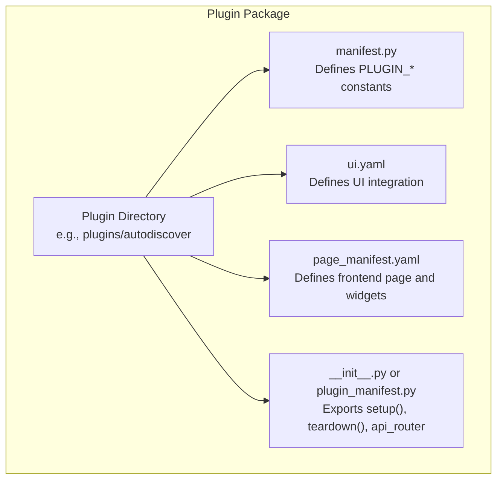
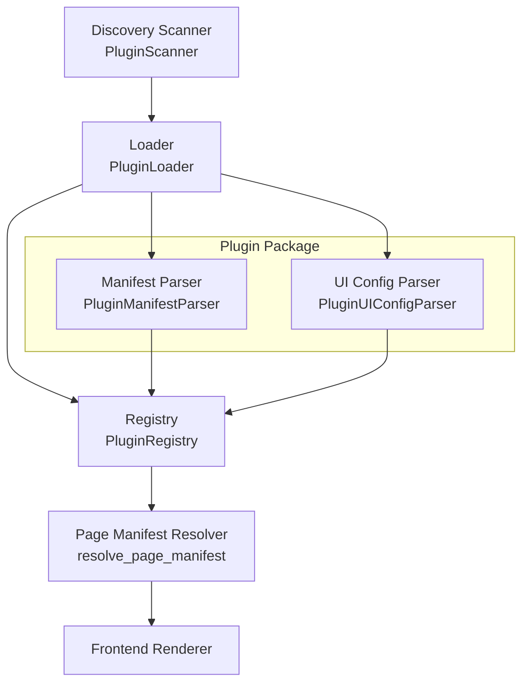
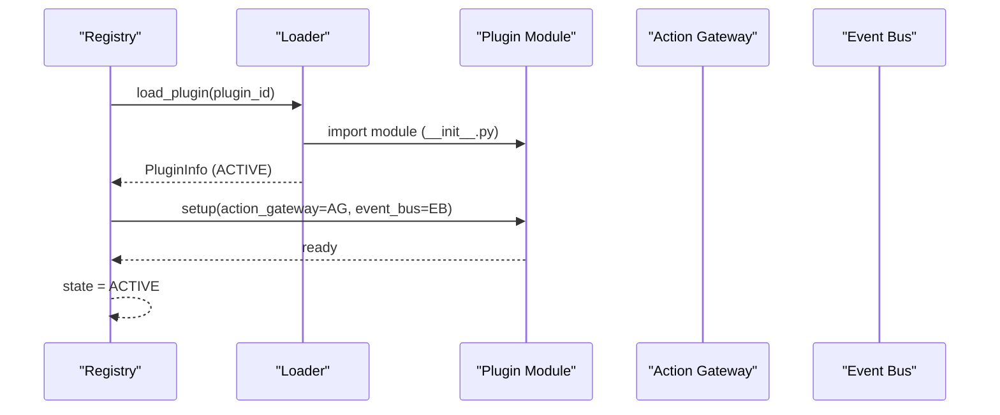
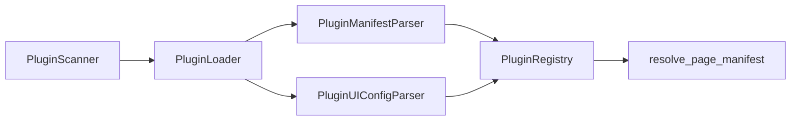

# Plugin Development Guide

<cite>
**Referenced Files in This Document**
- [registry.py](file://core/plugins/registry.py)
- [loader.py](file://core/plugins/loader.py)
- [schemas.py](file://core/plugins/schemas.py)
- [page_manifest.py](file://core/plugins/page_manifest.py)
- [plugin_manifest.py](file://plugins/autodiscover/plugin_manifest.py)
- [manifest.py](file://plugins/autodiscover/manifest.py)
- [schemas.py](file://plugins/autodiscover/schemas.py)
- [ui.yaml](file://plugins/autodiscover/ui.yaml)
- [page_manifest.yaml](file://plugins/autodiscover/page_manifest.yaml)
- [manifest.py](file://plugins/dns_trace/manifest.py)
- [page_manifest.yaml](file://plugins/dns_trace/page_manifest.yaml)
- [manifest.py](file://plugins/external_ip/manifest.py)
- [page_manifest.yaml](file://plugins/external_ip/page_manifest.yaml)
- [page_manifest.yaml](file://plugins/internet_speed/page_manifest.yaml)
</cite>

## Table of Contents
1. [Introduction](#introduction)
2. [Project Structure](#project-structure)
3. [Core Components](#core-components)
4. [Architecture Overview](#architecture-overview)
5. [Detailed Component Analysis](#detailed-component-analysis)
6. [Dependency Analysis](#dependency-analysis)
7. [Performance Considerations](#performance-considerations)
8. [Troubleshooting Guide](#troubleshooting-guide)
9. [Conclusion](#conclusion)
10. [Appendices](#appendices)

## Introduction
This guide explains how to build plugins for the dashboard platform. It covers plugin structure, manifest formats, UI integration, capability declarations, API endpoint creation, testing, debugging, performance, packaging, distribution, and installation. It also includes step-by-step examples for common plugin types and templates to accelerate development.

## Project Structure
Plugins are organized under a dedicated plugins directory. Each plugin is a Python package with a conventional structure:
- A Python package directory named after the plugin
- A manifest definition (manifest.py or constants in __init__.py)
- Optional UI configuration (ui.yaml or ui_config.py)
- Optional page manifest (page_manifest.yaml) for frontend integration
- An entry point module that exports a plugin interface and optionally an API router

**Diagram sources**
- [plugin_manifest.py:44-77](file://plugins/autodiscover/plugin_manifest.py#L44-L77)
- [ui.yaml:1-82](file://plugins/autodiscover/ui.yaml#L1-L82)
- [page_manifest.yaml:1-93](file://plugins/autodiscover/page_manifest.yaml#L1-L93)

**Section sources**
- [loader.py:23-108](file://core/plugins/loader.py#L23-L108)
- [registry.py:155-186](file://core/plugins/registry.py#L155-L186)

## Core Components
- Plugin discovery and loading: The system scans plugin directories, recognizes valid plugin packages, loads their manifests, and dynamically imports the module.
- Plugin registry: Maintains plugin lifecycle (discovered → loading → active → error/disabled), supports enabling/disabling/reloading, and exposes plugin metadata.
- Manifest and UI configuration parsers: Parse either Python attributes or YAML files into typed models.
- Page manifest: Defines frontend page layout, data sources, dashboard widgets, and capability requirements.

Key responsibilities:
- Discovery: Detect plugin directories and validate presence of manifest files.
- Loading: Dynamically import plugin modules and call setup/teardown hooks.
- Registry: Track state, metadata, and UI page manifest resolution.
- Parsing: Convert manifest/UI/page manifest into strongly-typed schemas.

**Section sources**
- [loader.py:23-108](file://core/plugins/loader.py#L23-L108)
- [loader.py:110-218](file://core/plugins/loader.py#L110-L218)
- [registry.py:26-186](file://core/plugins/registry.py#L26-L186)
- [schemas.py:25-131](file://core/plugins/schemas.py#L25-L131)
- [page_manifest.py:152-347](file://core/plugins/page_manifest.py#L152-L347)

## Architecture Overview
The plugin system follows a layered architecture:
- Discovery layer: Scans plugin directories and identifies valid packages.
- Loader layer: Imports plugin modules and extracts manifests and UI configs.
- Registry layer: Manages plugin lifecycle and exposes metadata.
- Frontend integration: Uses page manifest to render UI components and bind data sources.

**Diagram sources**
- [loader.py:23-108](file://core/plugins/loader.py#L23-L108)
- [loader.py:110-218](file://core/plugins/loader.py#L110-L218)
- [registry.py:155-272](file://core/plugins/registry.py#L155-L272)
- [page_manifest.py:219-323](file://core/plugins/page_manifest.py#L219-L323)

## Detailed Component Analysis

### Plugin Manifest Specification
A plugin manifest defines metadata and capabilities. It can be provided via:
- A Python module attribute PLUGIN_MANIFEST (dictionary)
- Individual constants (e.g., PLUGIN_NAME, PLUGIN_VERSION, PLUGIN_DESCRIPTION, PLUGIN_AUTHOR, PLUGIN_HOMEPAGE, PLUGIN_LICENSE, PLUGIN_TAGS, PLUGIN_MIN_DASHBOARD_VERSION, PLUGIN_DEPENDENCIES, PLUGIN_CAPABILITIES)

Required fields (when using individual constants):
- PLUGIN_NAME
- PLUGIN_VERSION
- PLUGIN_DESCRIPTION

Optional fields:
- PLUGIN_AUTHOR
- PLUGIN_HOMEPAGE
- PLUGIN_LICENSE
- PLUGIN_TAGS
- PLUGIN_MIN_DASHBOARD_VERSION
- PLUGIN_DEPENDENCIES
- PLUGIN_CAPABILITIES

Validation and parsing:
- The parser accepts either a PLUGIN_MANIFEST dictionary or individual constants.
- It constructs a typed PluginManifest model.

Versioning considerations:
- Use semantic versioning for PLUGIN_VERSION.
- Optionally declare min_dashboard_version to gate compatibility.

**Section sources**
- [loader.py:220-264](file://core/plugins/loader.py#L220-L264)
- [schemas.py:25-43](file://core/plugins/schemas.py#L25-L43)

### UI Configuration and Page Manifest
UI integration is defined via:
- UI configuration (ui.yaml or ui_config.py): Declares page routing, menu placement, widgets, static assets, API routes, and permissions.
- Page manifest (page_manifest.yaml): Describes frontend page layout, data sources, dashboard indicators, and capability requirements.

Key UI configuration fields:
- has_page, page_path, page_title, page_icon
- show_in_menu, menu_group, menu_order
- provides_widgets, widgets
- static_dir, css_files, js_files
- api_prefix, api_routes
- required_permissions

Page manifest fields:
- plugin_id, version, manifest_version, plugin_api_version
- capabilities
- frontend.renderer, frontend.sandbox, frontend.customBundle
- page.enabled, page.layout, page.sidebarActions, page.components
- dashboard.indicators
- schema for data validation

Validation rules:
- Page manifest must match supported major versions.
- Data sources and actions must declare capabilities that are included in the manifest’s capabilities list.
- Capability mismatches cause fallback to a safe default manifest.

**Section sources**
- [loader.py:267-320](file://core/plugins/loader.py#L267-L320)
- [page_manifest.py:152-347](file://core/plugins/page_manifest.py#L152-L347)
- [ui.yaml:1-82](file://plugins/autodiscover/ui.yaml#L1-L82)
- [page_manifest.yaml:1-93](file://plugins/autodiscover/page_manifest.yaml#L1-L93)

### Plugin Lifecycle and Entry Point
Each plugin must define:
- setup(action_gateway, event_bus): Called during activation to register actions and event handlers.
- teardown(): Called during deactivation to clean up resources.
- api_router (optional): Exposes plugin-specific API endpoints.

The registry manages lifecycle:
- load_plugin: Imports module, sets state to active, and calls setup.
- unload_plugin: Calls teardown and unloads module.
- enable_plugin/disable_plugin: Controls activation state.

**Diagram sources**
- [registry.py:286-318](file://core/plugins/registry.py#L286-L318)
- [plugin_manifest.py:85-131](file://plugins/autodiscover/plugin_manifest.py#L85-L131)

**Section sources**
- [registry.py:286-355](file://core/plugins/registry.py#L286-L355)
- [plugin_manifest.py:85-131](file://plugins/autodiscover/plugin_manifest.py#L85-L131)

### API Endpoint Creation
Plugins can expose API endpoints via a FastAPI router exported by the plugin module. The registry can mount plugin routers under a configurable prefix.

Best practices:
- Use descriptive path prefixes (e.g., api_prefix).
- Define api_routes in UI configuration for discoverability.
- Keep endpoints idempotent where appropriate; support dry-run for actions.

Example patterns:
- GET /status: Report plugin state and metrics.
- GET /hosts: List discovered items.
- POST /scan: Trigger asynchronous actions via the action gateway.

**Section sources**
- [plugin_manifest.py:487-524](file://plugins/autodiscover/plugin_manifest.py#L487-L524)
- [ui.yaml:40-57](file://plugins/autodiscover/ui.yaml#L40-L57)

### UI Integration Patterns
Two complementary approaches exist:
- UI configuration (ui.yaml): Defines page routing, menu, widgets, static assets, and required permissions.
- Page manifest (page_manifest.yaml): Defines frontend page layout, data sources, dashboard indicators, and capability requirements.

Patterns:
- Data-driven pages: Use data-table components bound to HTTP endpoints.
- Dashboard indicators: Provide persistent widgets with refresh intervals.
- Sidebar actions: Link to plugin pages or trigger actions.

**Section sources**
- [ui.yaml:1-82](file://plugins/autodiscover/ui.yaml#L1-L82)
- [page_manifest.yaml:1-93](file://plugins/autodiscover/page_manifest.yaml#L1-L93)

### Step-by-Step Examples

#### Example 1: HTTP Probe Plugin
Goal: Build a plugin that queries remote services and displays results in a data table.

Steps:
1. Create plugin directory and manifest:
   - Define PLUGIN_NAME, PLUGIN_VERSION, PLUGIN_DESCRIPTION, PLUGIN_CAPABILITIES.
   - Export PLUGIN_MANIFEST or individual constants.
2. Define UI configuration:
   - has_page=true, page_path="/plugins/<your-plugin>", page_title, page_icon.
   - api_prefix="<your-plugin>".
   - api_routes for GET /status and GET /services.
3. Implement entry point:
   - setup(action_gateway, event_bus)
   - teardown()
   - api_router with endpoints for status and services.
4. Define page manifest:
   - page.enabled=true, layout with data-table component.
   - dataSource pointing to /api/v1/plugins/<your-plugin>/services.
   - rowActions to add items to the dashboard.
5. Test and iterate:
   - Verify manifest parsing and UI rendering.
   - Validate capability declarations and permissions.

**Section sources**
- [manifest.py:1-10](file://plugins/dns_trace/manifest.py#L1-L10)
- [page_manifest.yaml:1-76](file://plugins/dns_trace/page_manifest.yaml#L1-L76)
- [ui.yaml:40-57](file://plugins/autodiscover/ui.yaml#L40-L57)

#### Example 2: System Utility Plugin
Goal: Provide a simple utility with a status endpoint and optional page.

Steps:
1. Create manifest with minimal metadata and capabilities.
2. Implement setup(teardown) and api_router with GET /status.
3. Optionally add a page via ui.yaml and a page_manifest.yaml.
4. Validate with registry and UI.

**Section sources**
- [manifest.py:1-10](file://plugins/external_ip/manifest.py#L1-L10)
- [page_manifest.yaml:1-209](file://plugins/external_ip/page_manifest.yaml#L1-L209)

#### Example 3: Network Tool Plugin
Goal: Similar to the autodiscover plugin, but simpler.

Steps:
1. Define manifest constants and PLUGIN_MANIFEST.
2. Implement setup registering actions and event handlers.
3. Expose api_router endpoints for status and data retrieval.
4. Configure ui.yaml for menu placement and permissions.
5. Define page_manifest.yaml with a data-table component and data source.

**Section sources**
- [plugin_manifest.py:44-77](file://plugins/autodiscover/plugin_manifest.py#L44-L77)
- [page_manifest.yaml:1-93](file://plugins/autodiscover/page_manifest.yaml#L1-L93)

### Templates and Boilerplate
Use these patterns as starting points:
- Minimal manifest template: Define PLUGIN_NAME, PLUGIN_VERSION, PLUGIN_DESCRIPTION, and capabilities.
- UI configuration template: has_page, page_path, api_prefix, api_routes, required_permissions.
- Entry point template: setup, teardown, api_router.
- Page manifest template: page.enabled, components with data-table, dataSource, rowActions.

Reference implementations:
- Manifest constants and PLUGIN_MANIFEST: [plugin_manifest.py:44-55](file://plugins/autodiscover/plugin_manifest.py#L44-L55)
- UI configuration: [ui.yaml:1-82](file://plugins/autodiscover/ui.yaml#L1-L82)
- Page manifest: [page_manifest.yaml:1-93](file://plugins/autodiscover/page_manifest.yaml#L1-L93)

**Section sources**
- [plugin_manifest.py:44-77](file://plugins/autodiscover/plugin_manifest.py#L44-L77)
- [ui.yaml:1-82](file://plugins/autodiscover/ui.yaml#L1-L82)
- [page_manifest.yaml:1-93](file://plugins/autodiscover/page_manifest.yaml#L1-L93)

## Dependency Analysis
The plugin system is composed of loosely coupled components:
- Discovery and loading depend on filesystem conventions and importlib.
- Registry depends on parsers for manifests and UI configurations.
- Page manifest resolution validates against supported versions and capability declarations.

**Diagram sources**
- [loader.py:23-108](file://core/plugins/loader.py#L23-L108)
- [loader.py:110-218](file://core/plugins/loader.py#L110-L218)
- [registry.py:155-272](file://core/plugins/registry.py#L155-L272)
- [page_manifest.py:219-323](file://core/plugins/page_manifest.py#L219-L323)

**Section sources**
- [loader.py:23-108](file://core/plugins/loader.py#L23-L108)
- [registry.py:155-272](file://core/plugins/registry.py#L155-L272)

## Performance Considerations
- Prefer asynchronous operations for long-running tasks; expose status endpoints for progress reporting.
- Limit data returned by default endpoints; support pagination and filtering.
- Cache results where safe and beneficial; invalidate on configuration changes.
- Use dry-run support for actions to reduce risk and overhead.
- Minimize UI payload sizes; leverage frontend data-table grouping and lazy loading.

## Troubleshooting Guide
Common issues and resolutions:
- Manifest not found: Ensure manifest.py exists or constants are present in __init__.py.
- UI config parsing errors: Validate YAML syntax and field names; confirm capability declarations match page manifest.
- Capability mismatch: Ensure all data-source and action capabilities are declared in the page manifest.
- Setup failures: Wrap setup in try/catch and log exceptions; verify action_gateway and event_bus availability.
- Teardown failures: Ensure teardown cleans up resources and handles exceptions gracefully.

**Section sources**
- [registry.py:188-272](file://core/plugins/registry.py#L188-L272)
- [page_manifest.py:219-323](file://core/plugins/page_manifest.py#L219-L323)

## Conclusion
This guide outlined the plugin development lifecycle, manifest and UI configuration formats, API endpoint patterns, and integration strategies. By following the structure and templates here, you can build robust, maintainable plugins that integrate seamlessly with the dashboard.

## Appendices

### Manifest Fields Reference
- Required (individual constants): name, version, description
- Optional: author, homepage, license, tags, min_dashboard_version, dependencies, capabilities

**Section sources**
- [loader.py:220-264](file://core/plugins/loader.py#L220-L264)
- [schemas.py:25-43](file://core/plugins/schemas.py#L25-L43)

### UI Configuration Fields Reference
- Page: has_page, page_path, page_title, page_icon
- Navigation: show_in_menu, menu_group, menu_order
- Widgets: provides_widgets, widgets
- Assets: static_dir, css_files, js_files
- API: api_prefix, api_routes
- Permissions: required_permissions

**Section sources**
- [loader.py:267-320](file://core/plugins/loader.py#L267-L320)
- [ui.yaml:1-82](file://plugins/autodiscover/ui.yaml#L1-L82)

### Page Manifest Fields Reference
- Identity: plugin_id, version, manifest_version, plugin_api_version
- Capabilities: capabilities[]
- Frontend: renderer, sandbox, customBundle
- Page: enabled, layout, sidebarActions[], components[]
- Dashboard: indicators[]
- Schema: arbitrary JSON schema for data validation

**Section sources**
- [page_manifest.py:152-347](file://core/plugins/page_manifest.py#L152-L347)
- [page_manifest.yaml:1-93](file://plugins/autodiscover/page_manifest.yaml#L1-L93)