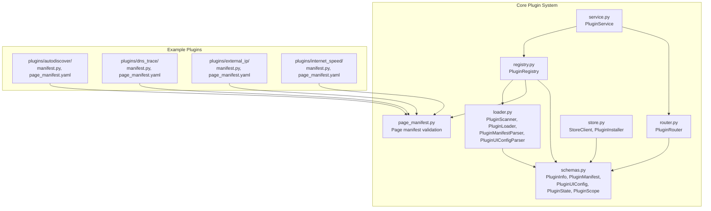
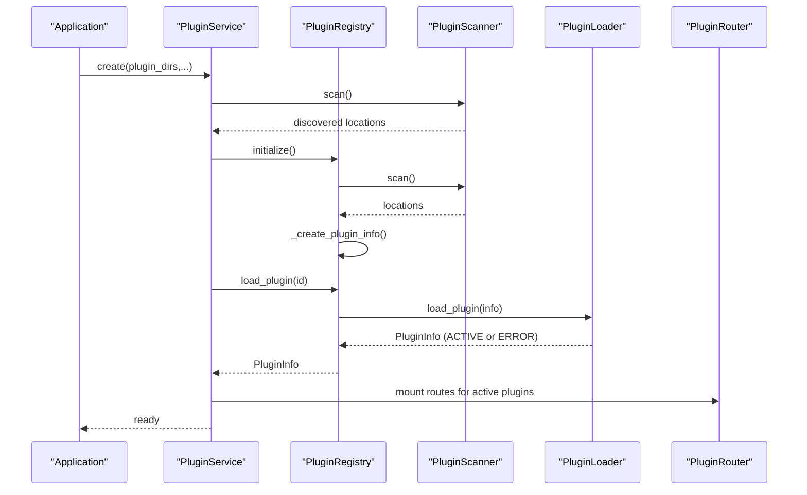
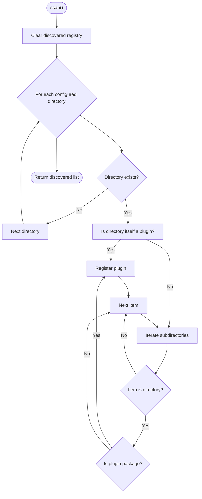
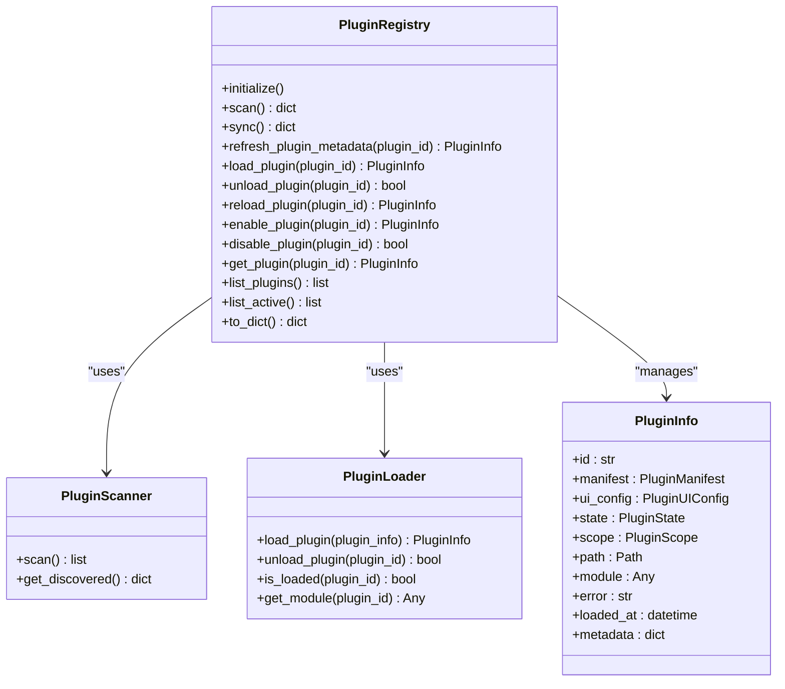
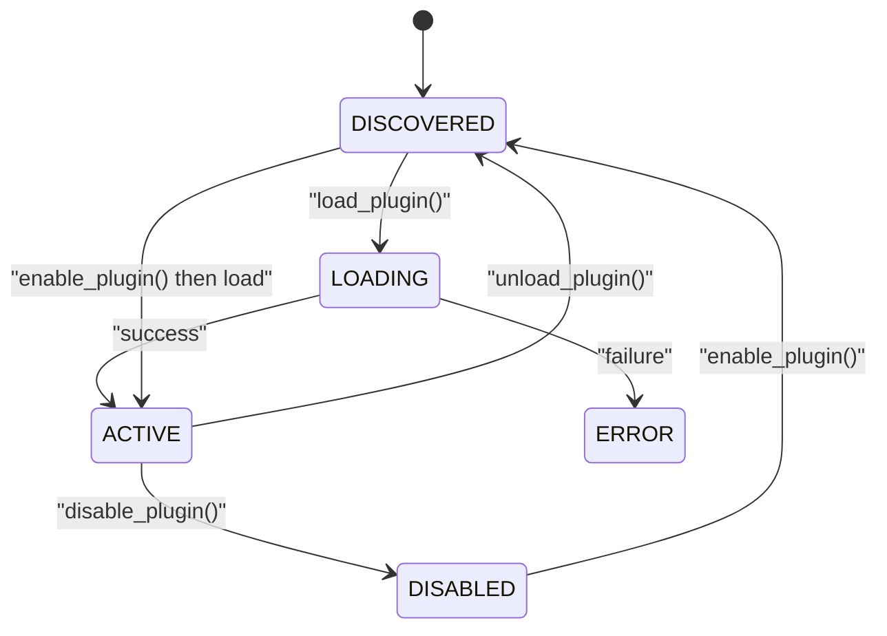
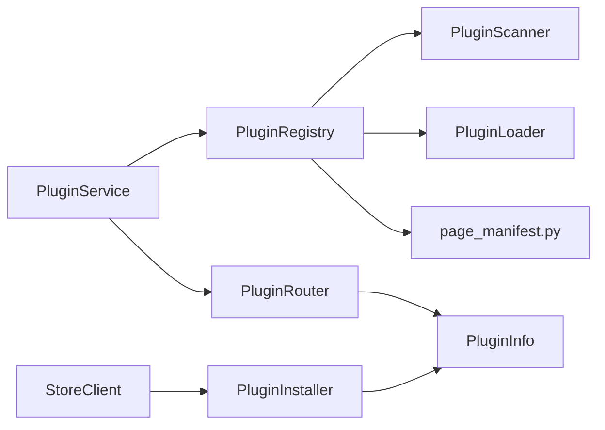

# Plugin Discovery and Loading

<cite>
**Referenced Files in This Document**
- [core/plugins/__init__.py](file://core/plugins/__init__.py)
- [core/plugins/loader.py](file://core/plugins/loader.py)
- [core/plugins/registry.py](file://core/plugins/registry.py)
- [core/plugins/schemas.py](file://core/plugins/schemas.py)
- [core/plugins/service.py](file://core/plugins/service.py)
- [core/plugins/router.py](file://core/plugins/router.py)
- [core/plugins/page_manifest.py](file://core/plugins/page_manifest.py)
- [core/plugins/store.py](file://core/plugins/store.py)
- [plugins/autodiscover/manifest.py](file://plugins/autodiscover/manifest.py)
- [plugins/autodiscover/page_manifest.yaml](file://plugins/autodiscover/page_manifest.yaml)
- [plugins/dns_trace/manifest.py](file://plugins/dns_trace/manifest.py)
- [plugins/dns_trace/page_manifest.yaml](file://plugins/dns_trace/page_manifest.yaml)
- [plugins/external_ip/manifest.py](file://plugins/external_ip/manifest.py)
- [plugins/external_ip/page_manifest.yaml](file://plugins/external_ip/page_manifest.yaml)
- [plugins/internet_speed/manifest.py](file://plugins/internet_speed/manifest.py)
- [plugins/internet_speed/page_manifest.yaml](file://plugins/internet_speed/page_manifest.yaml)
</cite>

## Table of Contents
1. [Introduction](#introduction)
2. [Project Structure](#project-structure)
3. [Core Components](#core-components)
4. [Architecture Overview](#architecture-overview)
5. [Detailed Component Analysis](#detailed-component-analysis)
6. [Dependency Analysis](#dependency-analysis)
7. [Performance Considerations](#performance-considerations)
8. [Troubleshooting Guide](#troubleshooting-guide)
9. [Conclusion](#conclusion)
10. [Appendices](#appendices)

## Introduction
This document explains the plugin discovery and loading mechanisms in the backend. It covers how plugins are discovered from directories, how manifests and UI configurations are parsed, how plugin modules are loaded at runtime, and how the registry maintains plugin state and lifecycle. It also documents the plugin state machine, state transitions, and the plugin page manifest validation and resolution process. Finally, it provides examples of plugin directory structures, manifest formats, and error handling during discovery.

## Project Structure
The plugin system is implemented under core/plugins and supported by example plugins under plugins/. The key modules are:
- Loader: discovery, scanning, manifest/UI parsing, and runtime module loading
- Registry: central state management and lifecycle orchestration
- Service: high-level orchestration and runtime hooks
- Router: dynamic mounting of plugin pages and APIs
- Page manifest: frontend page manifest validation and resolution
- Store: remote plugin installation and management

**Diagram sources**
- [core/plugins/__init__.py:1-39](file://core/plugins/__init__.py#L1-L39)
- [core/plugins/loader.py:1-329](file://core/plugins/loader.py#L1-L329)
- [core/plugins/registry.py:1-407](file://core/plugins/registry.py#L1-L407)
- [core/plugins/service.py:1-299](file://core/plugins/service.py#L1-L299)
- [core/plugins/router.py:1-448](file://core/plugins/router.py#L1-L448)
- [core/plugins/page_manifest.py:1-348](file://core/plugins/page_manifest.py#L1-L348)
- [core/plugins/store.py:1-239](file://core/plugins/store.py#L1-L239)
- [core/plugins/schemas.py:1-131](file://core/plugins/schemas.py#L1-L131)
- [plugins/autodiscover/manifest.py:1-55](file://plugins/autodiscover/manifest.py#L1-L55)
- [plugins/autodiscover/page_manifest.yaml:1-93](file://plugins/autodiscover/page_manifest.yaml#L1-L93)
- [plugins/dns_trace/manifest.py:1-10](file://plugins/dns_trace/manifest.py#L1-L10)
- [plugins/dns_trace/page_manifest.yaml:1-76](file://plugins/dns_trace/page_manifest.yaml#L1-L76)
- [plugins/external_ip/manifest.py:1-10](file://plugins/external_ip/manifest.py#L1-L10)
- [plugins/external_ip/page_manifest.yaml:1-209](file://plugins/external_ip/page_manifest.yaml#L1-L209)
- [plugins/internet_speed/manifest.py:1-10](file://plugins/internet_speed/manifest.py#L1-L10)
- [plugins/internet_speed/page_manifest.yaml:1-267](file://plugins/internet_speed/page_manifest.yaml#L1-L267)

**Section sources**
- [core/plugins/__init__.py:1-39](file://core/plugins/__init__.py#L1-L39)

## Core Components
- PluginScanner: discovers plugin packages by scanning configured directories and validating presence of required files (__init__.py and either manifest.py or manifest constants in __init__.py).
- PluginLoader: loads plugin modules at runtime via importlib, tracks loaded modules, and supports teardown.
- PluginRegistry: central state manager that scans, creates PluginInfo, loads/unloads modules, and invokes optional setup/teardown hooks.
- PluginService: high-level orchestrator that initializes registry, mounts routes, and manages runtime hooks (startup/shutdown).
- PluginRouter: dynamically mounts plugin pages and APIs based on UI configuration and module-provided routers.
- Page manifest: validates plugin page/frontend manifests, enforces capability declarations, and serializes resolution results.
- Store and Installer: syncs plugin catalog from a remote store, downloads, installs, and uninstalls plugins.

**Section sources**
- [core/plugins/loader.py:23-108](file://core/plugins/loader.py#L23-L108)
- [core/plugins/loader.py:110-218](file://core/plugins/loader.py#L110-L218)
- [core/plugins/registry.py:26-406](file://core/plugins/registry.py#L26-L406)
- [core/plugins/service.py:18-134](file://core/plugins/service.py#L18-L134)
- [core/plugins/router.py:16-448](file://core/plugins/router.py#L16-L448)
- [core/plugins/page_manifest.py:204-324](file://core/plugins/page_manifest.py#L204-L324)
- [core/plugins/store.py:17-239](file://core/plugins/store.py#L17-L239)

## Architecture Overview
The plugin system follows a layered architecture:
- Discovery and parsing live in loader.py
- Central state and lifecycle are managed in registry.py
- Orchestration and runtime hooks are handled in service.py
- Routing is handled in router.py
- Frontend page manifest validation is handled in page_manifest.py
- Remote plugin management is handled in store.py

**Diagram sources**
- [core/plugins/service.py:30-74](file://core/plugins/service.py#L30-L74)
- [core/plugins/registry.py:71-98](file://core/plugins/registry.py#L71-L98)
- [core/plugins/registry.py:286-318](file://core/plugins/registry.py#L286-L318)
- [core/plugins/loader.py:119-172](file://core/plugins/loader.py#L119-L172)
- [core/plugins/router.py:433-444](file://core/plugins/router.py#L433-L444)

## Detailed Component Analysis

### PluginScanner
Responsibilities:
- Scans configured directories for plugin packages
- Validates plugin presence by checking for __init__.py and a manifest file (manifest.py or manifest constants in __init__.py)
- Tracks discovered packages with scope and path

Discovery rules:
- A directory qualifies as a plugin if it contains __init__.py and a manifest file
- Subdirectories are scanned recursively, excluding hidden directories

Outputs:
- List of PluginLocation objects with path, package_name, and scope

**Diagram sources**
- [core/plugins/loader.py:48-108](file://core/plugins/loader.py#L48-L108)

**Section sources**
- [core/plugins/loader.py:48-108](file://core/plugins/loader.py#L48-L108)

### PluginManifestParser and PluginUIConfigParser
Manifest parsing:
- From module: reads PLUGIN_MANIFEST dict or individual constants (PLUGIN_NAME, PLUGIN_VERSION, etc.) to construct PluginManifest
- From dict: constructs PluginManifest from parsed YAML/JSON
- Capability and metadata fields are extracted for runtime use

UI config parsing:
- From module: reads PLUGIN_UI_CONFIG dict or individual constants to construct PluginUIConfig
- From dict: constructs PluginUIConfig from parsed YAML/JSON

Validation highlights:
- Missing required manifest fields lead to a minimal manifest creation
- UI config defaults are applied when keys are missing

**Section sources**
- [core/plugins/loader.py:220-265](file://core/plugins/loader.py#L220-L265)
- [core/plugins/loader.py:267-320](file://core/plugins/loader.py#L267-L320)

### PluginRegistry
Responsibilities:
- Initialize and scan for plugins
- Create PluginInfo instances with manifest, UI config, and page manifest resolution
- Load/unload modules, call setup/teardown hooks, and maintain state
- Provide listing and filtering helpers

Key behaviors:
- scan(): discovers and registers new plugins
- sync(): rescans and synchronizes registry with filesystem changes
- refresh_plugin_metadata(): reloads manifest/UI/page manifest and updates PluginInfo
- load_plugin()/unload_plugin()/reload_plugin(): manage lifecycle and call module hooks
- enable_plugin()/disable_plugin(): toggle plugin availability

**Diagram sources**
- [core/plugins/registry.py:26-406](file://core/plugins/registry.py#L26-L406)
- [core/plugins/loader.py:110-218](file://core/plugins/loader.py#L110-L218)
- [core/plugins/schemas.py:79-131](file://core/plugins/schemas.py#L79-L131)

**Section sources**
- [core/plugins/registry.py:71-154](file://core/plugins/registry.py#L71-L154)
- [core/plugins/registry.py:155-273](file://core/plugins/registry.py#L155-L273)
- [core/plugins/registry.py:286-384](file://core/plugins/registry.py#L286-L384)

### PluginLoader
Responsibilities:
- Dynamically import plugin modules via importlib
- Manage loaded modules and support teardown
- Update PluginInfo state and error messages

Runtime loading steps:
- Ensure plugin path exists and is added to sys.path
- Create module spec from __init__.py and execute
- On success, set state to ACTIVE and store module
- On failure, set state to ERROR and record error

Teardown:
- If module has teardown(), call it and log warnings
- Remove module from sys.modules and internal registry

**Section sources**
- [core/plugins/loader.py:119-172](file://core/plugins/loader.py#L119-L172)
- [core/plugins/loader.py:173-218](file://core/plugins/loader.py#L173-L218)

### PluginService
Responsibilities:
- Create and initialize PluginService with scanner, registry, and router
- Auto-load discovered plugins and mount routes
- Provide runtime hooks (startup/shutdown) via asyncio tasks
- Watch filesystem for changes and refresh runtime state

Runtime hooks:
- on_startup: invoked after load/reload if plugin exposes it
- on_shutdown: invoked before unload/disable if plugin exposes it

**Section sources**
- [core/plugins/service.py:30-134](file://core/plugins/service.py#L30-L134)
- [core/plugins/service.py:135-202](file://core/plugins/service.py#L135-L202)
- [core/plugins/service.py:224-296](file://core/plugins/service.py#L224-L296)

### PluginRouter
Responsibilities:
- Mount plugin pages and APIs dynamically based on PluginInfo.ui_config
- Support unmounting routes when plugins are unloaded or disabled
- Render default plugin page if module does not provide handle_page()

Routing rules:
- If ui_config.has_page and ui_config.page_path, mount a GET route under base_path
- If ui_config.api_prefix or ui_config.api_routes, include plugin’s api_router under api_base_path
- Optionally mount static files directory

**Section sources**
- [core/plugins/router.py:118-172](file://core/plugins/router.py#L118-L172)
- [core/plugins/router.py:195-444](file://core/plugins/router.py#L195-L444)

### Page Manifest Validation and Resolution
Responsibilities:
- Parse and validate plugin page manifests (YAML) against Pydantic models
- Enforce compatibility checks (manifest_version vs plugin_api_version)
- Validate capability declarations referenced by components and actions
- Provide fallback manifest when validation fails

Validation pipeline:
- Read candidate manifest files (page_manifest.yaml/yml, frontend_manifest.yaml/yml)
- Validate schema and versions
- Ensure plugin_id matches
- Verify capability references are declared
- Serialize resolution result with acceptance and reasons

**Section sources**
- [core/plugins/page_manifest.py:204-324](file://core/plugins/page_manifest.py#L204-L324)
- [core/plugins/page_manifest.py:326-337](file://core/plugins/page_manifest.py#L326-L337)

### Plugin State Machine and Transitions
States:
- DISCOVERED: registered but not loaded
- LOADING: in the process of being loaded
- ACTIVE: loaded and initialized
- ERROR: load/setup failed
- DISABLED: intentionally disabled

Transitions:
- DISCOVERED → LOADING → ACTIVE on successful load and setup
- DISCOVERED → ERROR on load failure
- ACTIVE → DISABLED on disable
- DISABLED → DISCOVERED on enable (then attempt load)
- ACTIVE → DISCOVERED on unload (teardown occurs before unload)

**Diagram sources**
- [core/plugins/schemas.py:9-16](file://core/plugins/schemas.py#L9-L16)
- [core/plugins/registry.py:286-384](file://core/plugins/registry.py#L286-L384)
- [core/plugins/loader.py:119-172](file://core/plugins/loader.py#L119-L172)

## Dependency Analysis
High-level dependencies:
- PluginService depends on PluginRegistry, PluginRouter, and orchestrates lifecycle
- PluginRegistry depends on PluginScanner and PluginLoader
- PluginRouter depends on PluginInfo and UI configuration
- Page manifest validation is used by registry to enrich PluginInfo.metadata
- Store and Installer depend on PluginInfo and PluginManifest for installation

**Diagram sources**
- [core/plugins/service.py:18-134](file://core/plugins/service.py#L18-L134)
- [core/plugins/registry.py:26-406](file://core/plugins/registry.py#L26-L406)
- [core/plugins/router.py:16-448](file://core/plugins/router.py#L16-L448)
- [core/plugins/page_manifest.py:204-324](file://core/plugins/page_manifest.py#L204-L324)
- [core/plugins/store.py:17-239](file://core/plugins/store.py#L17-L239)

**Section sources**
- [core/plugins/service.py:18-134](file://core/plugins/service.py#L18-L134)
- [core/plugins/registry.py:26-406](file://core/plugins/registry.py#L26-L406)

## Performance Considerations
- Import overhead: importlib.util.module_from_spec() and sys.modules manipulation occur per load; avoid frequent reloads in hot loops
- Manifest parsing: YAML parsing and Pydantic validation add CPU cost; cache results where appropriate
- Router mounting: include_router() and route removal operations should be minimized during runtime refresh cycles
- Filesystem polling: refresh_runtime() fingerprints plugin directories; tune interval to balance responsiveness and CPU usage

## Troubleshooting Guide
Common issues and resolutions:
- Plugin not discovered
  - Ensure directory contains __init__.py and a manifest file (manifest.py or manifest constants in __init__.py)
  - Verify plugin directory is within configured plugin_dirs
- Load failure (ERROR state)
  - Check logs for ImportError or exceptions raised during module execution
  - Confirm plugin path exists and is readable
- Setup hook failures
  - If plugin.setup() raises an exception, state becomes ERROR; fix plugin setup logic
- Teardown hook failures
  - If plugin.teardown() raises an exception, a warning is logged; fix teardown logic
- Route mounting issues
  - Ensure ui_config has_page and page_path set appropriately
  - Confirm api_prefix or api_routes are defined if plugin exposes API routes
- Page manifest validation errors
  - Validate YAML syntax and schema compliance
  - Ensure manifest_version and plugin_api_version major versions are compatible
  - Verify all capability references in components/actions are declared in capabilities

**Section sources**
- [core/plugins/loader.py:119-172](file://core/plugins/loader.py#L119-L172)
- [core/plugins/registry.py:307-315](file://core/plugins/registry.py#L307-L315)
- [core/plugins/router.py:118-172](file://core/plugins/router.py#L118-L172)
- [core/plugins/page_manifest.py:204-324](file://core/plugins/page_manifest.py#L204-L324)

## Conclusion
The plugin system provides a robust, extensible mechanism for discovering, validating, loading, and managing plugins. It supports dynamic routing, runtime hooks, and frontend page manifest validation. The state machine ensures predictable lifecycle management, while parsers and validators enforce manifest correctness. The included store and installer components enable remote plugin distribution and installation.

## Appendices

### Plugin Directory Structure Examples
- Minimal plugin structure:
  - <plugin_dir>/
    - __init__.py
    - manifest.py
    - ui.yaml or ui_config.py (optional)
- Example plugin directories:
  - plugins/autodiscover/
  - plugins/dns_trace/
  - plugins/external_ip/
  - plugins/internet_speed/

**Section sources**
- [plugins/autodiscover/manifest.py:1-55](file://plugins/autodiscover/manifest.py#L1-L55)
- [plugins/dns_trace/manifest.py:1-10](file://plugins/dns_trace/manifest.py#L1-L10)
- [plugins/external_ip/manifest.py:1-10](file://plugins/external_ip/manifest.py#L1-L10)
- [plugins/internet_speed/manifest.py:1-10](file://plugins/internet_speed/manifest.py#L1-L10)

### Manifest File Formats
- Python manifest (manifest.py): defines plugin metadata and capabilities using module-level constants or a PLUGIN_MANIFEST dict
- YAML UI config (ui.yaml): defines UI integration points such as page_path, menu settings, API routes, and permissions
- Page manifest (page_manifest.yaml): defines frontend page layout, components, capabilities, and dashboard indicators

**Section sources**
- [core/plugins/loader.py:220-265](file://core/plugins/loader.py#L220-L265)
- [core/plugins/loader.py:267-320](file://core/plugins/loader.py#L267-L320)
- [core/plugins/page_manifest.py:152-162](file://core/plugins/page_manifest.py#L152-L162)

### Error Handling During Discovery
- Scanner logs debug messages for discovered plugins and ignores invalid directories
- Registry warns and continues when manifest/ui_config cannot be loaded from path
- Loader sets ERROR state and records exception messages on import failures
- Router gracefully handles missing page handlers and renders a default page

**Section sources**
- [core/plugins/loader.py:48-108](file://core/plugins/loader.py#L48-L108)
- [core/plugins/registry.py:188-231](file://core/plugins/registry.py#L188-L231)
- [core/plugins/registry.py:233-272](file://core/plugins/registry.py#L233-L272)
- [core/plugins/loader.py:119-172](file://core/plugins/loader.py#L119-L172)
- [core/plugins/router.py:206-236](file://core/plugins/router.py#L206-L236)