# Plugin Lifecycle and Hooks

<cite>
**Referenced Files in This Document**
- [core/plugins/__init__.py](file://core/plugins/__init__.py)
- [core/plugins/loader.py](file://core/plugins/loader.py)
- [core/plugins/registry.py](file://core/plugins/registry.py)
- [core/plugins/service.py](file://core/plugins/service.py)
- [core/plugins/router.py](file://core/plugins/router.py)
- [core/plugins/schemas.py](file://core/plugins/schemas.py)
- [core/plugins/page_manifest.py](file://core/plugins/page_manifest.py)
- [core/plugins/store.py](file://core/plugins/store.py)
- [plugins/autodiscover/__init__.py](file://plugins/autodiscover/__init__.py)
- [plugins/autodiscover/manifest.py](file://plugins/autodiscover/manifest.py)
- [plugins/dns_trace/manifest.py](file://plugins/dns_trace/manifest.py)
- [plugins/external_ip/manifest.py](file://plugins/external_ip/manifest.py)
- [plugins/internet_speed/manifest.py](file://plugins/internet_speed/manifest.py)
</cite>

## Table of Contents
1. [Introduction](#introduction)
2. [Project Structure](#project-structure)
3. [Core Components](#core-components)
4. [Architecture Overview](#architecture-overview)
5. [Detailed Component Analysis](#detailed-component-analysis)
6. [Dependency Analysis](#dependency-analysis)
7. [Performance Considerations](#performance-considerations)
8. [Troubleshooting Guide](#troubleshooting-guide)
9. [Conclusion](#conclusion)
10. [Appendices](#appendices)

## Introduction
This document explains the plugin lifecycle management and hook system in the backend. It covers how plugins are discovered, loaded, initialized, and torn down; how lifecycle hooks are invoked automatically and manually; how plugin state is tracked during runtime; and how the system supports runtime monitoring and automatic reloading. It also documents plugin isolation, resource management, and cleanup during unloading, along with practical examples and best practices.

## Project Structure
The plugin system is organized around several core modules:
- Discovery and loading: scanners, loaders, parsers
- Registry: central state management and lifecycle orchestration
- Service: runtime orchestration, startup/shutdown hooks, watch loop
- Router: dynamic mounting/unmounting of plugin pages and APIs
- Schemas: typed plugin metadata and state
- Page manifest: frontend page and dashboard integration metadata
- Store: installation and management of plugins from a remote store

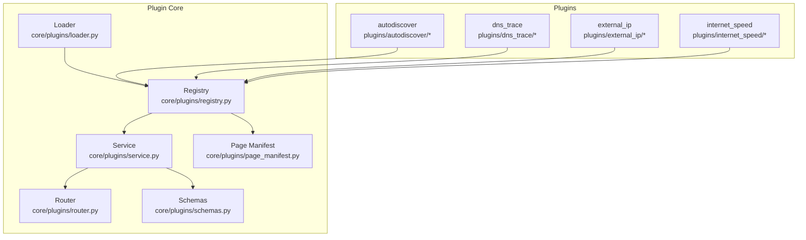

**Diagram sources**
- [core/plugins/loader.py:110-218](file://core/plugins/loader.py#L110-L218)
- [core/plugins/registry.py:26-406](file://core/plugins/registry.py#L26-L406)
- [core/plugins/service.py:18-299](file://core/plugins/service.py#L18-L299)
- [core/plugins/router.py:16-448](file://core/plugins/router.py#L16-L448)
- [core/plugins/schemas.py:9-131](file://core/plugins/schemas.py#L9-L131)
- [core/plugins/page_manifest.py:152-347](file://core/plugins/page_manifest.py#L152-L347)
- [plugins/autodiscover/__init__.py:830-895](file://plugins/autodiscover/__init__.py#L830-L895)
- [plugins/dns_trace/manifest.py:1-10](file://plugins/dns_trace/manifest.py#L1-L10)
- [plugins/external_ip/manifest.py:1-10](file://plugins/external_ip/manifest.py#L1-L10)
- [plugins/internet_speed/manifest.py:1-10](file://plugins/internet_speed/manifest.py#L1-L10)

**Section sources**
- [core/plugins/__init__.py:1-39](file://core/plugins/__init__.py#L1-L39)

## Core Components
- Loader: Dynamically imports plugin modules, tracks loaded modules, and invokes optional teardown hooks during unload.
- Registry: Discovers plugins, loads them, initializes via setup, and manages state transitions and teardown.
- Service: Orchestrates runtime lifecycle, schedules and invokes on_startup/on_shutdown hooks, and runs the watch loop for runtime monitoring and auto-reload.
- Router: Mounts and unmounts plugin pages and APIs based on UI configuration and active state.
- Schemas: Defines PluginState, PluginScope, PluginInfo, PluginManifest, and PluginUIConfig.
- Page Manifest: Parses and validates plugin page/dashboard manifests for frontend integration.
- Store: Syncs plugin catalog, downloads, installs, and uninstalls plugins from a remote store.

**Section sources**
- [core/plugins/loader.py:110-218](file://core/plugins/loader.py#L110-L218)
- [core/plugins/registry.py:26-406](file://core/plugins/registry.py#L26-L406)
- [core/plugins/service.py:18-299](file://core/plugins/service.py#L18-L299)
- [core/plugins/router.py:16-448](file://core/plugins/router.py#L16-L448)
- [core/plugins/schemas.py:9-131](file://core/plugins/schemas.py#L9-L131)
- [core/plugins/page_manifest.py:152-347](file://core/plugins/page_manifest.py#L152-L347)
- [core/plugins/store.py:17-239](file://core/plugins/store.py#L17-L239)

## Architecture Overview
The plugin system follows a layered architecture:
- Discovery: Scanner locates plugin directories and registers them.
- Loading: Loader imports plugin modules and stores references.
- Initialization: Registry calls setup with supported kwargs and transitions to ACTIVE.
- Runtime: Service schedules on_startup hooks for ACTIVE plugins and mounts routes.
- Shutdown: Service invokes on_shutdown hooks and unloads modules.
- Monitoring: Service’s watch loop periodically checks for changes and reloads plugins.

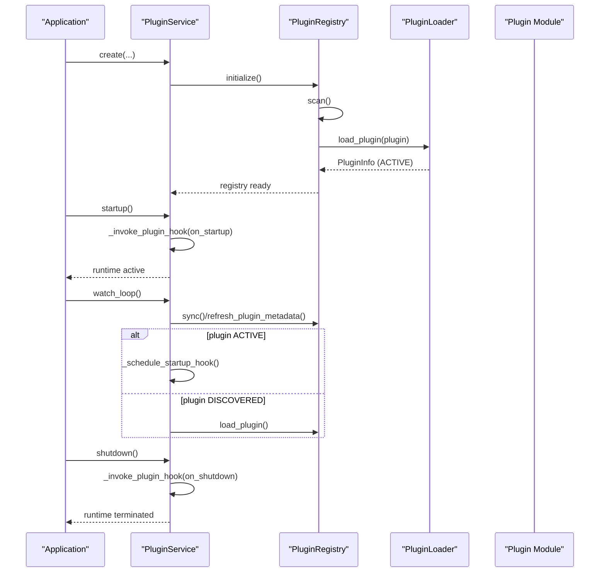

**Diagram sources**
- [core/plugins/service.py:30-134](file://core/plugins/service.py#L30-L134)
- [core/plugins/registry.py:71-154](file://core/plugins/registry.py#L71-L154)
- [core/plugins/loader.py:119-172](file://core/plugins/loader.py#L119-L172)
- [core/plugins/service.py:285-296](file://core/plugins/service.py#L285-L296)

## Detailed Component Analysis

### Lifecycle States and Transitions
- DISCOVERED: Registered by scanner; not yet loaded.
- LOADING: Loader is importing the module.
- ACTIVE: Module imported and setup completed.
- ERROR: An error occurred during discovery, loading, or setup.
- DISABLED: Explicitly disabled; remains on disk but not loaded.

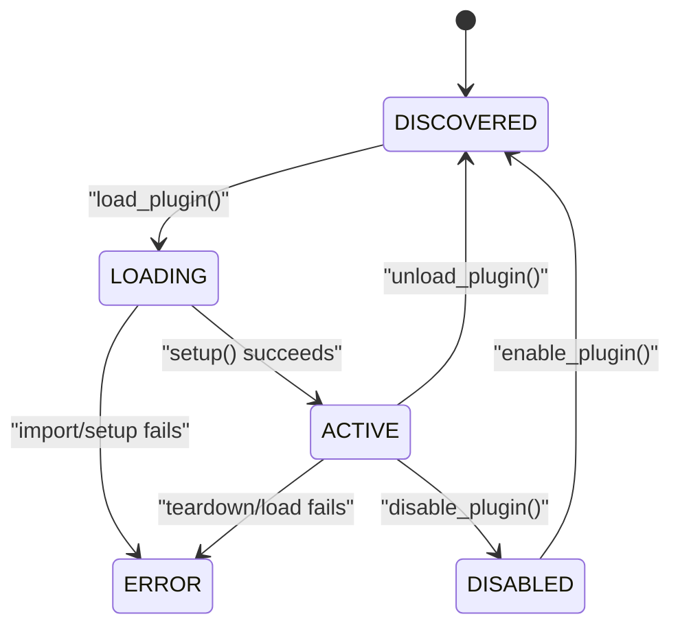

**Diagram sources**
- [core/plugins/schemas.py:9-16](file://core/plugins/schemas.py#L9-L16)
- [core/plugins/registry.py:286-384](file://core/plugins/registry.py#L286-L384)
- [core/plugins/loader.py:119-172](file://core/plugins/loader.py#L119-L172)

**Section sources**
- [core/plugins/schemas.py:9-16](file://core/plugins/schemas.py#L9-L16)
- [core/plugins/registry.py:286-384](file://core/plugins/registry.py#L286-L384)

### Discovery and Loading
- Scanner scans configured directories and identifies plugin packages by presence of manifest files or attributes.
- Loader dynamically imports plugin modules, updates sys.path, executes module, and records references.
- On unload, Loader calls teardown if present, then removes module from sys.modules.

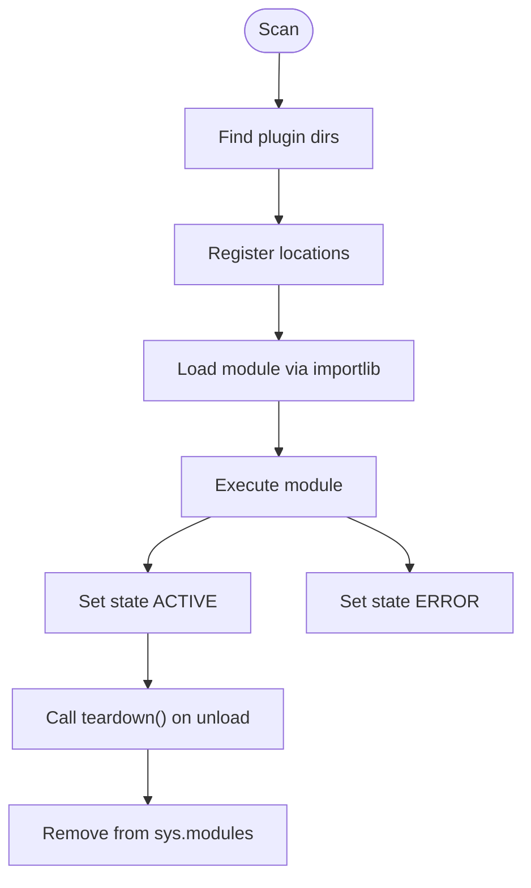

**Diagram sources**
- [core/plugins/loader.py:119-218](file://core/plugins/loader.py#L119-L218)
- [core/plugins/registry.py:286-356](file://core/plugins/registry.py#L286-L356)

**Section sources**
- [core/plugins/loader.py:23-118](file://core/plugins/loader.py#L23-L118)
- [core/plugins/loader.py:119-218](file://core/plugins/loader.py#L119-L218)
- [core/plugins/registry.py:188-273](file://core/plugins/registry.py#L188-L273)

### Registry: Initialization, Setup, and Teardown
- initialize/scan: Discover and register plugins.
- load_plugin: Invoke setup with kwargs filtered to supported parameters.
- unload_plugin/reload_plugin: Invoke teardown and unload module.
- enable/disable: Transition state and manage load/unload accordingly.

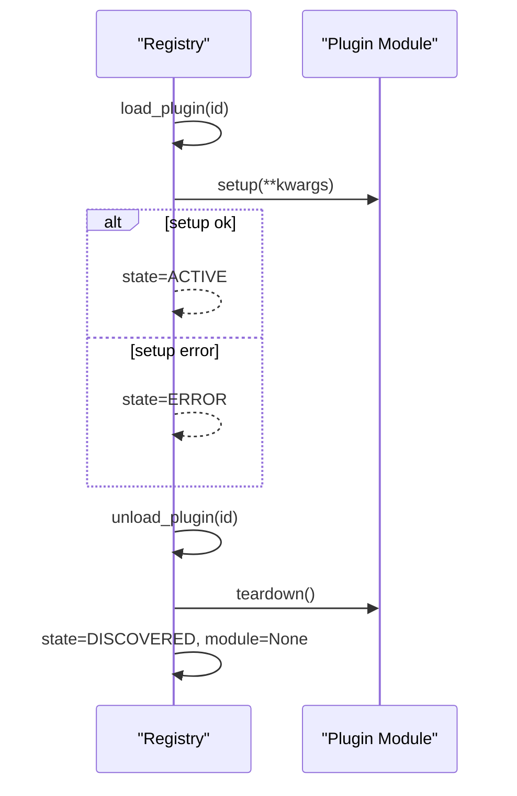

**Diagram sources**
- [core/plugins/registry.py:286-356](file://core/plugins/registry.py#L286-L356)
- [core/plugins/registry.py:54-70](file://core/plugins/registry.py#L54-L70)

**Section sources**
- [core/plugins/registry.py:71-154](file://core/plugins/registry.py#L71-L154)
- [core/plugins/registry.py:286-356](file://core/plugins/registry.py#L286-L356)
- [core/plugins/registry.py:54-70](file://core/plugins/registry.py#L54-L70)

### Service: Runtime Lifecycle and Hook Invocation
- create: Initializes scanner, registry, router, auto-loads discovered plugins, mounts routes.
- load/unload/reload/enable/disable: Orchestrate registry operations and route mounting/unmounting.
- startup/shutdown: Invoke on_startup/on_shutdown for active plugins.
- Hook scheduling: _schedule_startup_hook/_schedule_shutdown_hook schedule tasks; _invoke_plugin_hook handles sync/async hooks and deduplicates repeated invocations.
- Watch loop: Periodically syncs, refreshes metadata, reloads changed plugins, logs changes.

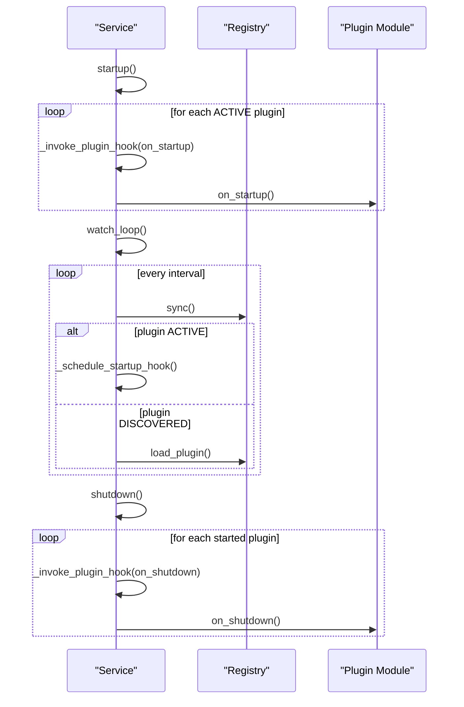

**Diagram sources**
- [core/plugins/service.py:30-134](file://core/plugins/service.py#L30-L134)
- [core/plugins/service.py:135-201](file://core/plugins/service.py#L135-L201)
- [core/plugins/service.py:285-296](file://core/plugins/service.py#L285-L296)

**Section sources**
- [core/plugins/service.py:30-134](file://core/plugins/service.py#L30-L134)
- [core/plugins/service.py:135-201](file://core/plugins/service.py#L135-L201)
- [core/plugins/service.py:224-283](file://core/plugins/service.py#L224-L283)
- [core/plugins/service.py:285-296](file://core/plugins/service.py#L285-L296)

### Router: Dynamic Route Mounting and Unmounting
- Mounts plugin pages and APIs based on UI configuration.
- Unmounts routes when plugins are unloaded or disabled.
- Supports plugin-provided API routers and static asset directories.

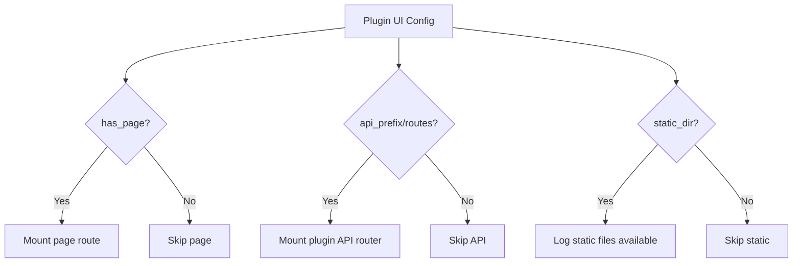

**Diagram sources**
- [core/plugins/router.py:118-172](file://core/plugins/router.py#L118-L172)
- [core/plugins/router.py:404-420](file://core/plugins/router.py#L404-L420)

**Section sources**
- [core/plugins/router.py:118-172](file://core/plugins/router.py#L118-L172)
- [core/plugins/router.py:195-236](file://core/plugins/router.py#L195-L236)
- [core/plugins/router.py:404-420](file://core/plugins/router.py#L404-L420)

### Page Manifest: Frontend Integration Metadata
- Parses and validates plugin page/dashboard manifests.
- Provides fallbacks and validation errors for incompatible or malformed manifests.
- Serializes resolution results for downstream consumption.

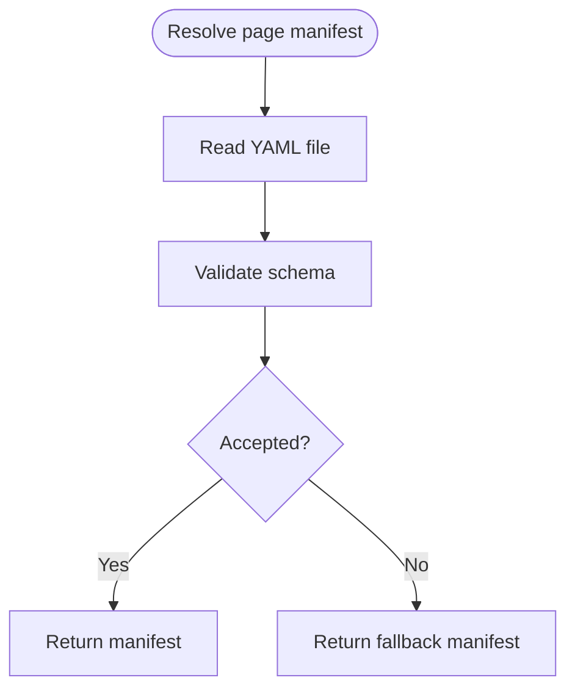

**Diagram sources**
- [core/plugins/page_manifest.py:219-323](file://core/plugins/page_manifest.py#L219-L323)

**Section sources**
- [core/plugins/page_manifest.py:152-347](file://core/plugins/page_manifest.py#L152-L347)

### Store: Plugin Installation and Management
- Syncs plugin catalog from a remote store.
- Downloads and installs plugins to a local directory.
- Uninstalls plugins by removing directories.

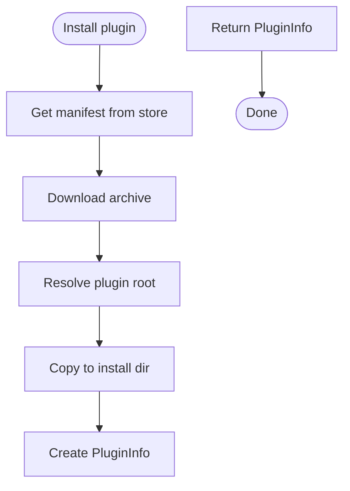

**Diagram sources**
- [core/plugins/store.py:148-211](file://core/plugins/store.py#L148-L211)

**Section sources**
- [core/plugins/store.py:17-239](file://core/plugins/store.py#L17-L239)

### Implementing Lifecycle Hooks in Custom Plugins
- Define setup and teardown functions to integrate with the registry’s initialization and teardown flows.
- Optionally define on_startup and on_shutdown hooks for runtime lifecycle management.
- Example implementations exist in the autodiscover plugin.

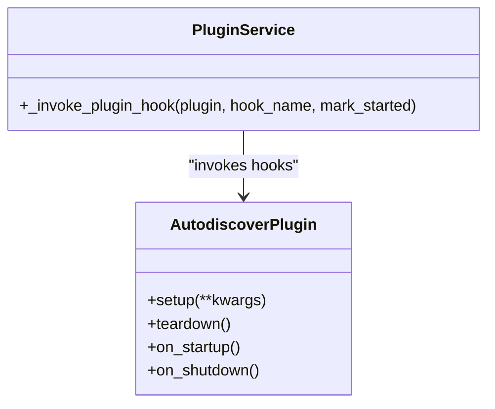

**Diagram sources**
- [plugins/autodiscover/__init__.py:830-895](file://plugins/autodiscover/__init__.py#L830-L895)
- [core/plugins/service.py:156-187](file://core/plugins/service.py#L156-L187)

**Section sources**
- [plugins/autodiscover/__init__.py:830-895](file://plugins/autodiscover/__init__.py#L830-L895)

## Dependency Analysis
- Loader depends on importlib and maintains an internal registry of loaded modules.
- Registry composes Scanner, Loader, and parsers to build PluginInfo and manage state.
- Service composes Registry and Router, orchestrating lifecycle and routing.
- Router depends on PluginRegistry and FastAPI routers.
- Schemas define shared types used across components.
- Page Manifest parsing is used by Registry to enrich plugin metadata.
- Store depends on HTTP client and filesystem operations.

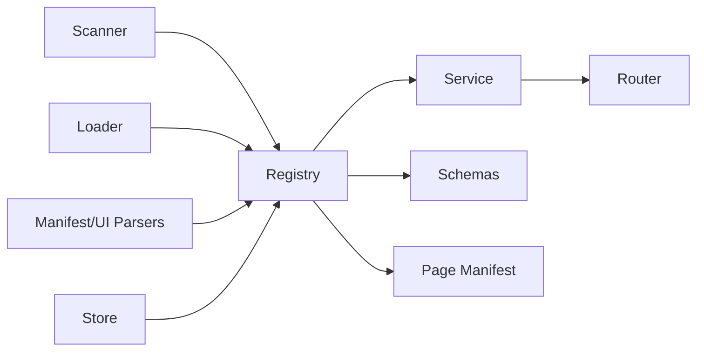

**Diagram sources**
- [core/plugins/registry.py:13-21](file://core/plugins/registry.py#L13-L21)
- [core/plugins/service.py:10-13](file://core/plugins/service.py#L10-L13)
- [core/plugins/router.py:10-11](file://core/plugins/router.py#L10-L11)
- [core/plugins/store.py:10-12](file://core/plugins/store.py#L10-L12)

**Section sources**
- [core/plugins/registry.py:13-21](file://core/plugins/registry.py#L13-L21)
- [core/plugins/service.py:10-13](file://core/plugins/service.py#L10-L13)
- [core/plugins/router.py:10-11](file://core/plugins/router.py#L10-L11)
- [core/plugins/store.py:10-12](file://core/plugins/store.py#L10-L12)

## Performance Considerations
- Async scheduling: Hook invocations are scheduled as tasks on the running event loop to avoid blocking.
- Deduplication: Service tracks started plugins to prevent re-invoking hooks for the same plugin.
- Minimal overhead: Router only mounts routes for ACTIVE plugins with UI configuration.
- Watch loop cadence: Polling interval is configurable and clamped to reasonable bounds.

[No sources needed since this section provides general guidance]

## Troubleshooting Guide
Common issues and remedies:
- Plugin fails to load: Check ERROR state and error messages; verify manifest presence and module imports.
- Setup failure: Review setup kwargs filtering and exceptions raised by plugin setup.
- Hook failures: Exceptions during on_startup/on_shutdown are logged; ensure hooks are idempotent and handle async properly.
- Graceful shutdown: on_shutdown hooks are invoked for all started plugins; ensure resources are released and tasks cancelled.
- Runtime reload: Use watch loop to detect file changes; verify fingerprint logic and reload behavior.

**Section sources**
- [core/plugins/registry.py:311-314](file://core/plugins/registry.py#L311-L314)
- [core/plugins/service.py:185-186](file://core/plugins/service.py#L185-L186)
- [core/plugins/service.py:193-201](file://core/plugins/service.py#L193-L201)
- [core/plugins/service.py:285-296](file://core/plugins/service.py#L285-L296)

## Conclusion
The plugin system provides a robust lifecycle management framework with automatic discovery, dynamic loading, and runtime hook invocation. It supports manual control over enabling/disabling and reloading, and offers a watch loop for runtime monitoring. The design emphasizes isolation, explicit teardown, and safe state transitions, ensuring reliable operation under normal and error conditions.

## Appendices

### Available Lifecycle Hooks and Execution Timing
- setup: Called after module load to initialize plugin internals; receives supported kwargs.
- teardown: Called during unload to release resources.
- on_startup: Invoked asynchronously after runtime start for ACTIVE plugins; idempotent.
- on_shutdown: Invoked asynchronously during shutdown for started plugins; idempotent.

**Section sources**
- [core/plugins/registry.py:307-314](file://core/plugins/registry.py#L307-L314)
- [core/plugins/service.py:135-201](file://core/plugins/service.py#L135-L201)
- [plugins/autodiscover/__init__.py:830-895](file://plugins/autodiscover/__init__.py#L830-L895)

### Plugin State Management During Runtime
- Active tracking: Service maintains a set of started plugin IDs to avoid duplicate hook invocations.
- Cleanup: Unload clears module references, resets timestamps, and unmounts routes.

**Section sources**
- [core/plugins/service.py:28-28](file://core/plugins/service.py#L28-L28)
- [core/plugins/service.py:146-154](file://core/plugins/service.py#L146-L154)
- [core/plugins/registry.py:338-353](file://core/plugins/registry.py#L338-L353)

### Plugin Watch Loop Functionality
- Periodically synchronizes plugin directories, refreshes metadata, and reloads changed plugins.
- Logs added, removed, reloaded, and failed plugins per cycle.

**Section sources**
- [core/plugins/service.py:224-283](file://core/plugins/service.py#L224-L283)
- [core/plugins/service.py:285-296](file://core/plugins/service.py#L285-L296)

### Plugin Isolation, Resource Management, and Cleanup
- Isolation: Loader adds plugin parent to sys.path and executes module in isolation.
- Resource management: teardown is called on unload; sys.modules entries are removed.
- Cleanup: Router unmounts routes; Registry resets module and timestamps.

**Section sources**
- [core/plugins/loader.py:142-205](file://core/plugins/loader.py#L142-L205)
- [core/plugins/router.py:157-172](file://core/plugins/router.py#L157-L172)
- [core/plugins/registry.py:338-353](file://core/plugins/registry.py#L338-L353)