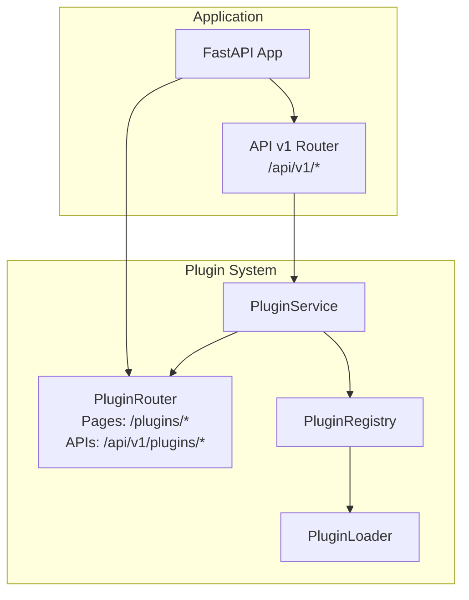
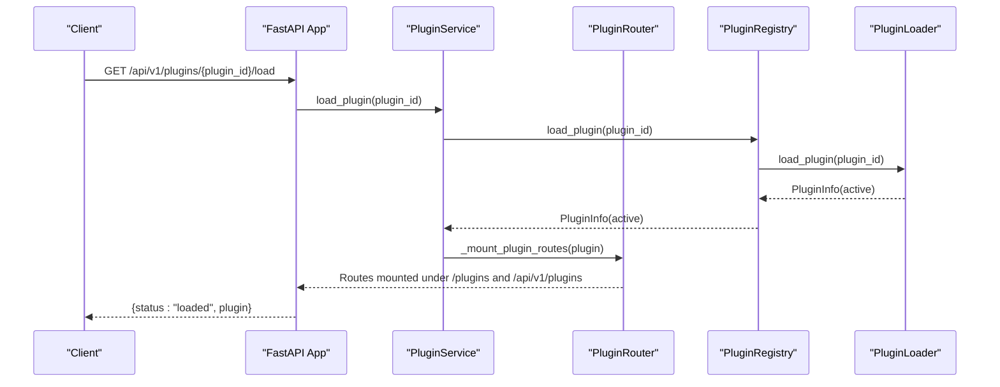
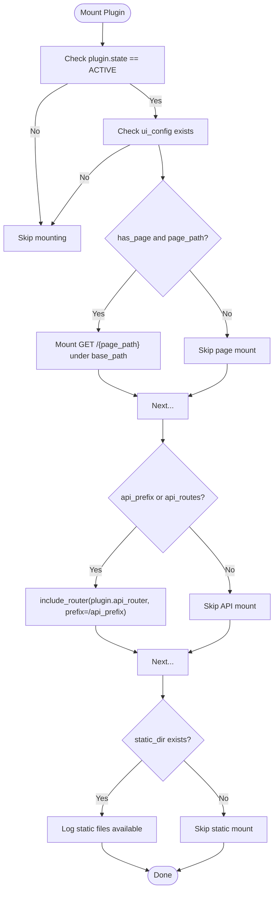
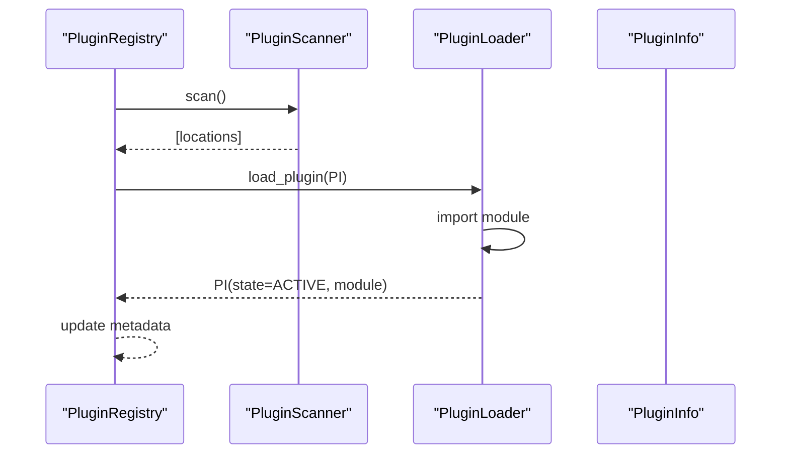
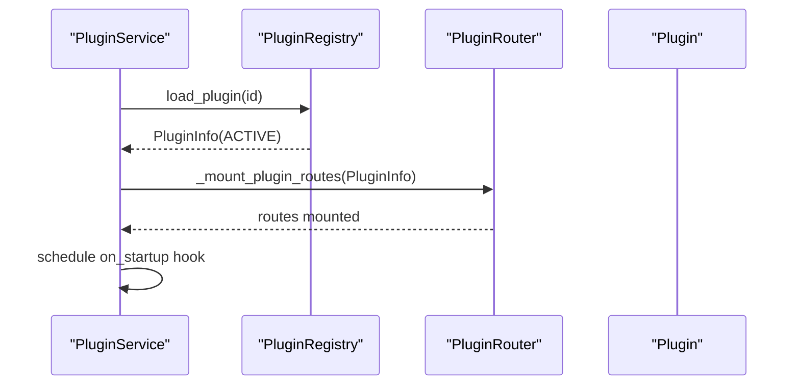
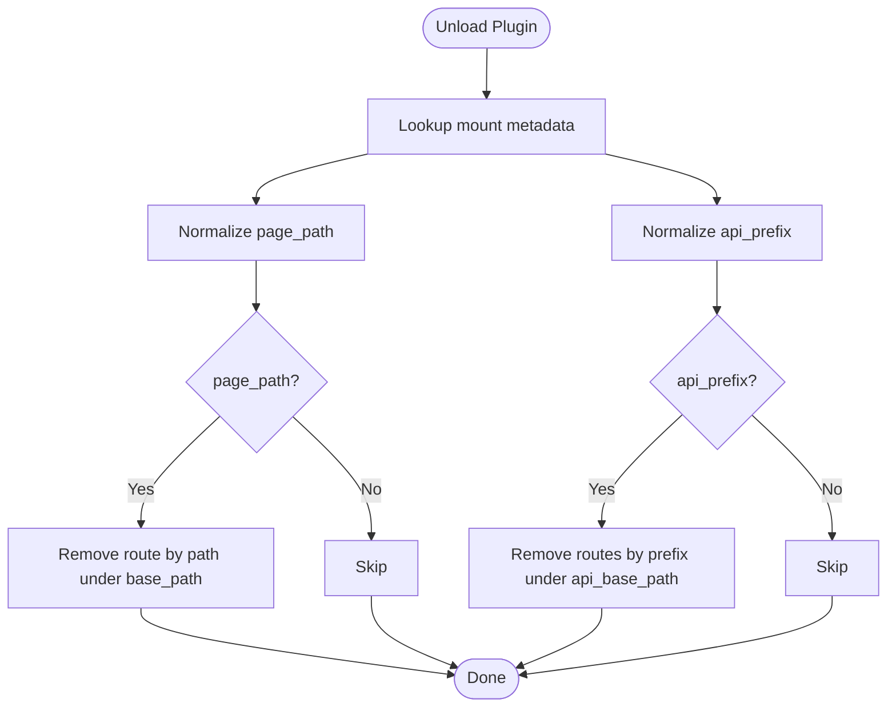
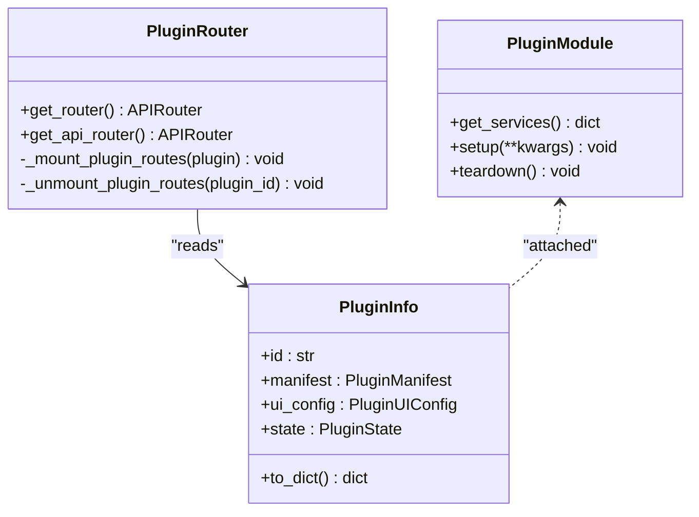
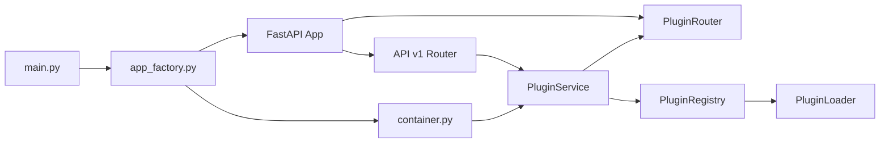

# Plugin Routing and Mounting

<cite>
**Referenced Files in This Document**
- [router.py](file://core/plugins/router.py)
- [registry.py](file://core/plugins/registry.py)
- [service.py](file://core/plugins/service.py)
- [loader.py](file://core/plugins/loader.py)
- [schemas.py](file://core/plugins/schemas.py)
- [plugins.py](file://api/v1/plugins.py)
- [app_factory.py](file://app_factory.py)
- [container.py](file://config/container.py)
- [main.py](file://main.py)
- [dns_trace/__init__.py](file://plugins/dns_trace/__init__.py)
- [dns_trace/manifest.py](file://plugins/dns_trace/manifest.py)
- [dns_trace/page_manifest.yaml](file://plugins/dns_trace/page_manifest.yaml)
</cite>

## Table of Contents
1. [Introduction](#introduction)
2. [Project Structure](#project-structure)
3. [Core Components](#core-components)
4. [Architecture Overview](#architecture-overview)
5. [Detailed Component Analysis](#detailed-component-analysis)
6. [Dependency Analysis](#dependency-analysis)
7. [Performance Considerations](#performance-considerations)
8. [Troubleshooting Guide](#troubleshooting-guide)
9. [Conclusion](#conclusion)

## Introduction
This document explains the plugin routing and mounting system that dynamically exposes plugin pages and APIs under dedicated URL namespaces. It covers how PluginRouter mounts plugin routes at runtime, how base paths are configured, how plugin endpoints integrate with the main API, and how routes are unmounted during plugin unload and cleanup. It also documents the plugin API structure, HTTP methods, URL patterns, request/response handling, parameter binding, and middleware integration. Finally, it clarifies the relationship between plugin pages (/plugins) and plugin APIs (/api/v1/plugins).

## Project Structure
The plugin routing system spans several modules:
- Core plugin orchestration: PluginService coordinates discovery, loading, enabling/disabling, and runtime watching.
- Registry and loader: PluginRegistry discovers plugins and loads/unloads modules; PluginLoader handles dynamic imports.
- Router: PluginRouter builds and tears down routes for plugin pages and APIs.
- API surface: api/v1/plugins.py exposes administrative endpoints for managing plugins via the main API.
- Application wiring: app_factory.py and container.py integrate PluginService into the FastAPI app and lifecycle.

**Diagram sources**
- [app_factory.py:20-27](file://app_factory.py#L20-L27)
- [container.py:370-381](file://config/container.py#L370-L381)
- [service.py:57-69](file://core/plugins/service.py#L57-L69)
- [router.py:40-44](file://core/plugins/router.py#L40-L44)

**Section sources**
- [app_factory.py:20-27](file://app_factory.py#L20-L27)
- [container.py:370-381](file://config/container.py#L370-L381)
- [service.py:57-69](file://core/plugins/service.py#L57-L69)
- [router.py:40-44](file://core/plugins/router.py#L40-L44)

## Core Components
- PluginService: Orchestrates plugin lifecycle and route mounting. It initializes the registry, auto-loads discovered plugins, mounts routes for active plugins, and supports runtime refresh/watch loops.
- PluginRouter: Dynamically mounts plugin pages and APIs under configurable base paths. It tracks mounted routes and provides unmounting by path or prefix.
- PluginRegistry: Discovers plugins, loads manifests/UI configs, and manages plugin state transitions (discovered → loading → active → error → disabled).
- PluginLoader: Performs runtime import of plugin modules and teardown.
- API v1 Plugins: Exposes administrative endpoints for listing, loading, unloading, enabling, disabling, and deleting plugins.

**Section sources**
- [service.py:18-74](file://core/plugins/service.py#L18-L74)
- [router.py:16-52](file://core/plugins/router.py#L16-L52)
- [registry.py:26-80](file://core/plugins/registry.py#L26-L80)
- [loader.py:110-172](file://core/plugins/loader.py#L110-L172)
- [plugins.py:19-362](file://api/v1/plugins.py#L19-L362)

## Architecture Overview
The plugin system integrates with the main application through a dedicated PluginService. On startup, the service creates a PluginRouter with two prefixes:
- Pages: base_path (default "/plugins")
- APIs: api_base_path (default "/api/v1/plugins")

PluginRouter delegates route mounting to three internal strategies:
- Plugin page route: mounts a GET handler under the plugin’s page_path (relative to base_path).
- Plugin API routes: includes a plugin module’s api_router (if present) under the plugin’s api_prefix or plugin id.
- Static assets: logs availability of static_dir if present.

**Diagram sources**
- [plugins.py:232-252](file://api/v1/plugins.py#L232-L252)
- [service.py:83-89](file://core/plugins/service.py#L83-L89)
- [registry.py:286-318](file://core/plugins/registry.py#L286-L318)
- [loader.py:119-171](file://core/plugins/loader.py#L119-L171)
- [router.py:118-156](file://core/plugins/router.py#L118-L156)

## Detailed Component Analysis

### PluginRouter: Dynamic Route Mounting and Unmounting
PluginRouter maintains:
- Two APIRouter instances: one for pages (prefix base_path) and one for plugin APIs (prefix api_base_path).
- Tracking sets and metadata for mounted plugins and their route allocations.

Key behaviors:
- Base management routes: list, get, load, unload, reload, enable, disable are registered on the API router.
- Mounting:
  - Validates plugin state and presence of UI config.
  - Conditionally mounts plugin page route if has_page and page_path are defined.
  - Includes plugin module’s api_router (if present) under api_prefix or plugin id.
  - Logs static asset availability.
- Unmounting:
  - Removes page route by exact path under base_path.
  - Removes API routes by prefix under api_base_path.
  - Updates internal tracking.

**Diagram sources**
- [router.py:118-156](file://core/plugins/router.py#L118-L156)
- [router.py:195-236](file://core/plugins/router.py#L195-L236)
- [router.py:404-420](file://core/plugins/router.py#L404-L420)
- [router.py:421-432](file://core/plugins/router.py#L421-L432)

**Section sources**
- [router.py:16-52](file://core/plugins/router.py#L16-L52)
- [router.py:118-156](file://core/plugins/router.py#L118-L156)
- [router.py:157-194](file://core/plugins/router.py#L157-L194)
- [router.py:195-236](file://core/plugins/router.py#L195-L236)
- [router.py:404-432](file://core/plugins/router.py#L404-L432)

### PluginRegistry and PluginLoader: Lifecycle and Module Management
- Discovery: PluginScanner scans configured directories for valid plugin packages and records PluginLocation entries.
- Loading: PluginLoader dynamically imports plugin modules, attaches them to PluginInfo, and updates state to ACTIVE.
- Teardown: PluginLoader invokes teardown on the module and removes it from sys.modules on unload.

**Diagram sources**
- [registry.py:81-97](file://core/plugins/registry.py#L81-L97)
- [registry.py:286-318](file://core/plugins/registry.py#L286-L318)
- [loader.py:119-171](file://core/plugins/loader.py#L119-L171)

**Section sources**
- [registry.py:81-136](file://core/plugins/registry.py#L81-L136)
- [loader.py:110-218](file://core/plugins/loader.py#L110-L218)

### PluginService: Orchestration and Runtime Hooks
- Initialization: Creates PluginScanner, PluginRegistry, and PluginRouter; auto-loads discovered plugins; mounts routes for active plugins.
- Operations: load_plugin, unload_plugin, reload_plugin, enable_plugin, disable_plugin; each triggers corresponding registry operations and router mount/unmount.
- Runtime watching: refresh_runtime periodically rescans, detects changes, reloads plugins, and invokes on_startup/on_shutdown hooks.

**Diagram sources**
- [service.py:30-74](file://core/plugins/service.py#L30-L74)
- [service.py:83-111](file://core/plugins/service.py#L83-L111)
- [service.py:135-154](file://core/plugins/service.py#L135-L154)

**Section sources**
- [service.py:18-74](file://core/plugins/service.py#L18-L74)
- [service.py:83-130](file://core/plugins/service.py#L83-L130)
- [service.py:188-202](file://core/plugins/service.py#L188-L202)
- [service.py:224-283](file://core/plugins/service.py#L224-L283)

### API Surface: Administrative Plugin Management Endpoints
The main API exposes endpoints under /api/v1/plugins for administrative operations:
- GET /api/v1/plugins: list all plugins with optional state filter.
- GET /api/v1/plugins/{plugin_id}: get plugin details.
- GET /api/v1/plugins/{plugin_id}/manifest: resolve and return page manifest.
- GET /api/v1/plugins/{plugin_id}/services: fetch plugin-provided services via module handler.
- GET /api/v1/plugins/{plugin_id}/settings and PUT /api/v1/plugins/{plugin_id}/settings: get/update plugin settings.
- POST /api/v1/plugins/{plugin_id}/load, /unload, /reload, /enable, /disable: manage plugin lifecycle.
- DELETE /api/v1/plugins/{plugin_id}: delete plugin from disk (requires installer).

These endpoints delegate to PluginService and enforce capability checks.

**Section sources**
- [plugins.py:23-54](file://api/v1/plugins.py#L23-L54)
- [plugins.py:57-80](file://api/v1/plugins.py#L57-L80)
- [plugins.py:83-112](file://api/v1/plugins.py#L83-L112)
- [plugins.py:115-143](file://api/v1/plugins.py#L115-L143)
- [plugins.py:146-175](file://api/v1/plugins.py#L146-L175)
- [plugins.py:178-212](file://api/v1/plugins.py#L178-L212)
- [plugins.py:215-229](file://api/v1/plugins.py#L215-L229)
- [plugins.py:232-252](file://api/v1/plugins.py#L232-L252)
- [plugins.py:254-267](file://api/v1/plugins.py#L254-L267)
- [plugins.py:270-287](file://api/v1/plugins.py#L270-L287)
- [plugins.py:290-310](file://api/v1/plugins.py#L290-L310)
- [plugins.py:312-325](file://api/v1/plugins.py#L312-L325)
- [plugins.py:328-358](file://api/v1/plugins.py#L328-L358)

### Relationship Between Plugin Pages and Plugin APIs
- Plugin pages: served under base_path (default "/plugins"); each plugin’s page_path is relative to this base.
- Plugin APIs: served under api_base_path (default "/api/v1/plugins"); plugin module’s own API router is included under a per-plugin prefix derived from ui_config.api_prefix or plugin id.
- Example: a plugin with ui_config.page_path "/dns_trace" and ui_config.api_prefix "dns" will expose:
  - Page: GET /plugins/dns_trace
  - API: routes from plugin.module.api_router included under /api/v1/plugins/dns

**Section sources**
- [router.py:136-144](file://core/plugins/router.py#L136-L144)
- [router.py:404-420](file://core/plugins/router.py#L404-L420)

### Route Unmounting During Plugin Unload and Cleanup
- Unload path: PluginService.unload_plugin calls registry.unload_plugin and then router._unmount_plugin_routes(plugin_id).
- Unmount logic:
  - Remove page route by exact path under base_path.
  - Remove API routes by prefix under api_base_path.
  - Update tracking sets and metadata.

**Diagram sources**
- [service.py:91-99](file://core/plugins/service.py#L91-L99)
- [router.py:157-171](file://core/plugins/router.py#L157-L171)
- [router.py:173-193](file://core/plugins/router.py#L173-L193)

**Section sources**
- [service.py:91-99](file://core/plugins/service.py#L91-L99)
- [router.py:157-194](file://core/plugins/router.py#L157-L194)

### Plugin Examples and Integration Patterns
- Plugin module pattern: Plugins define a manifest and optionally a module-level api_router. They may also export handlers for services/settings.
- Example: dns_trace plugin exports get_services and a manifest; its page_manifest.yaml describes frontend integration and dashboard widgets.

**Diagram sources**
- [dns_trace/__init__.py:364-640](file://plugins/dns_trace/__init__.py#L364-L640)
- [dns_trace/manifest.py:24-31](file://plugins/dns_trace/manifest.py#L24-L31)
- [router.py:118-156](file://core/plugins/router.py#L118-L156)
- [schemas.py:79-121](file://core/plugins/schemas.py#L79-L121)

**Section sources**
- [dns_trace/__init__.py:364-640](file://plugins/dns_trace/__init__.py#L364-L640)
- [dns_trace/manifest.py:24-31](file://plugins/dns_trace/manifest.py#L24-L31)
- [dns_trace/page_manifest.yaml:16-31](file://plugins/dns_trace/page_manifest.yaml#L16-L31)

## Dependency Analysis
- Application integration: app_factory registers PluginRouter’s routers into the main FastAPI app during startup.
- Container wiring: container.py constructs PluginService with base_path and api_base_path and injects it into the AppContainer.
- API v1 plugins: api/v1/plugins.py provides administrative endpoints that delegate to PluginService.

**Diagram sources**
- [main.py:17-21](file://main.py#L17-L21)
- [app_factory.py:20-27](file://app_factory.py#L20-L27)
- [container.py:370-381](file://config/container.py#L370-L381)
- [service.py:57-69](file://core/plugins/service.py#L57-L69)

**Section sources**
- [main.py:17-21](file://main.py#L17-L21)
- [app_factory.py:20-27](file://app_factory.py#L20-L27)
- [container.py:370-381](file://config/container.py#L370-L381)
- [service.py:57-69](file://core/plugins/service.py#L57-L69)

## Performance Considerations
- Route construction cost: Mounting routes occurs on demand (load/enable) and during initialization (auto-mount active plugins). Keep plugin api_router small and avoid heavy includes in hot paths.
- Unmounting cost: Removing routes by path or prefix iterates router.routes; ensure minimal churn by avoiding frequent toggles.
- Runtime watching: refresh_runtime polls filesystem fingerprints and reloads changed plugins; tune plugin_watch_poll_sec to balance responsiveness and CPU usage.
- Async hooks: on_startup/on_shutdown are scheduled as tasks; keep handlers lightweight to avoid blocking the event loop.

[No sources needed since this section provides general guidance]

## Troubleshooting Guide
Common issues and resolutions:
- Plugin not found: Administrative endpoints return 404 when plugin_id is invalid; verify plugin discovery and registry contents.
- Load/enable failures: Errors during module import or setup propagate as 500 responses; check plugin manifest and loader logs.
- Route conflicts: PluginRouter removes routes by exact path or prefix; ensure unique page_path and api_prefix values across plugins.
- Unload failures: If teardown fails, the module remains loaded; review plugin teardown logic and retry.
- API not exposed: Confirm PluginRouter is included in the app and base_path/api_base_path match expectations.

**Section sources**
- [plugins.py:248-251](file://api/v1/plugins.py#L248-L251)
- [registry.py:296-298](file://core/plugins/registry.py#L296-L298)
- [router.py:173-193](file://core/plugins/router.py#L173-L193)
- [router.py:320-355](file://core/plugins/router.py#L320-L355)

## Conclusion
The plugin routing and mounting system provides a robust, dynamic mechanism to expose plugin pages and APIs under controlled URL namespaces. PluginRouter centralizes route management, PluginService orchestrates lifecycle and runtime updates, and the main API offers administrative controls. Proper configuration of base_path and api_base_path, combined with careful plugin module design, ensures clean integration and maintainable extensibility.