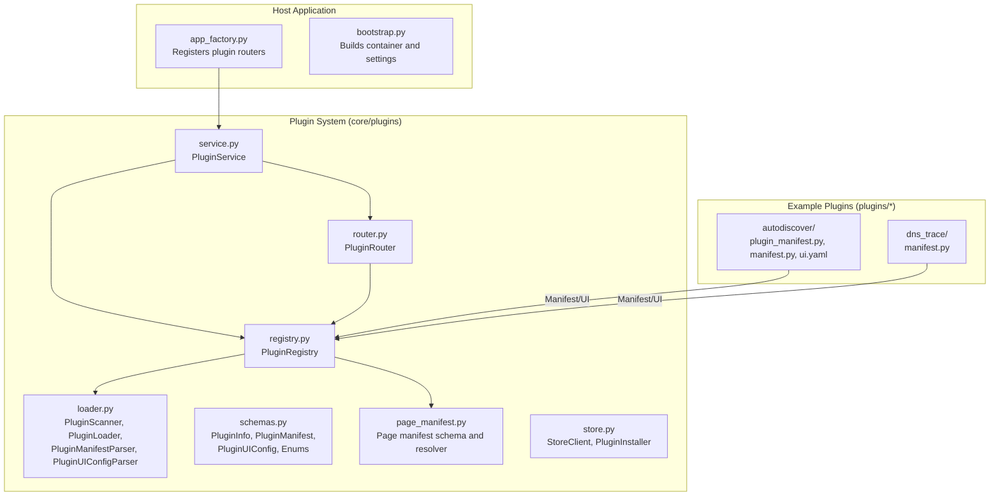
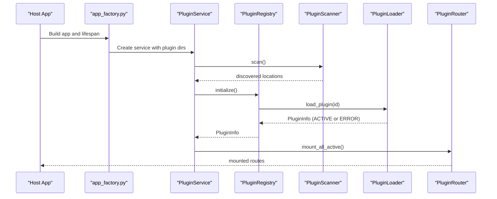
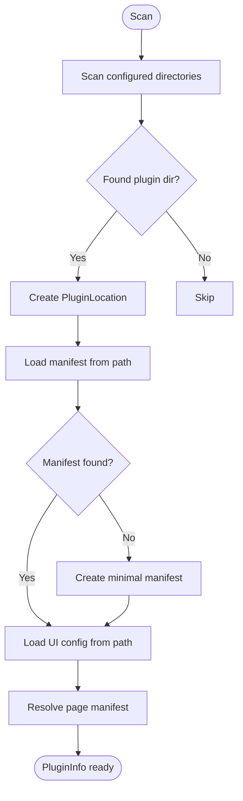
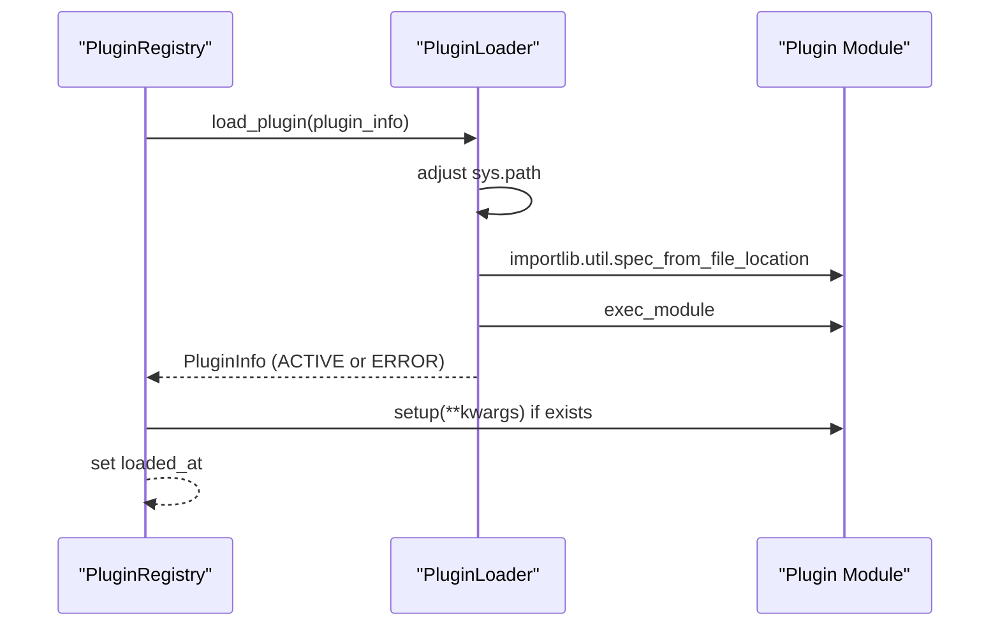
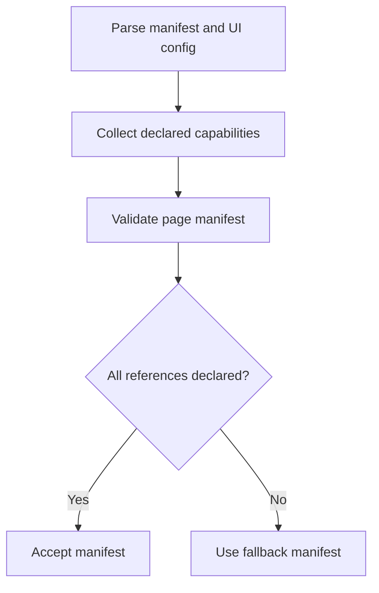
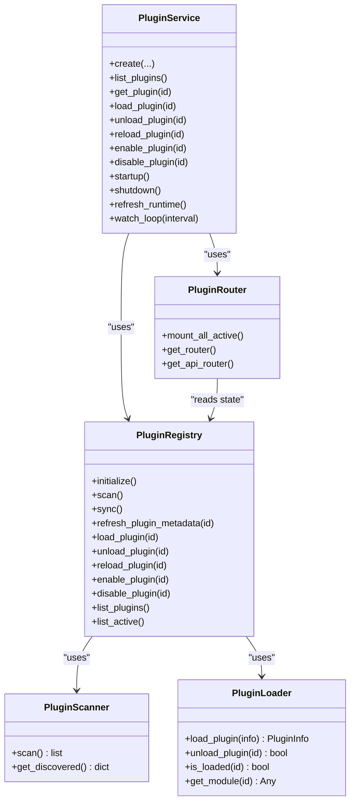
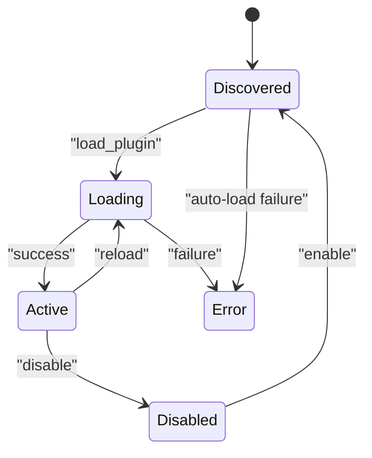
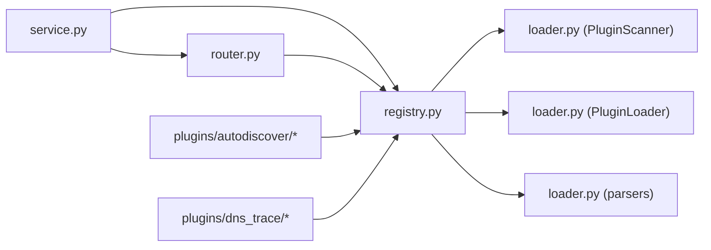

# Plugin System

<cite>
**Referenced Files in This Document**
- [core/plugins/__init__.py](file://core/plugins/__init__.py)
- [core/plugins/loader.py](file://core/plugins/loader.py)
- [core/plugins/registry.py](file://core/plugins/registry.py)
- [core/plugins/router.py](file://core/plugins/router.py)
- [core/plugins/service.py](file://core/plugins/service.py)
- [core/plugins/schemas.py](file://core/plugins/schemas.py)
- [core/plugins/page_manifest.py](file://core/plugins/page_manifest.py)
- [core/plugins/store.py](file://core/plugins/store.py)
- [plugins/autodiscover/plugin_manifest.py](file://plugins/autodiscover/plugin_manifest.py)
- [plugins/autodiscover/manifest.py](file://plugins/autodiscover/manifest.py)
- [plugins/autodiscover/ui.yaml](file://plugins/autodiscover/ui.yaml)
- [plugins/dns_trace/manifest.py](file://plugins/dns_trace/manifest.py)
- [app_factory.py](file://app_factory.py)
- [bootstrap.py](file://bootstrap.py)
</cite>

## Table of Contents
1. [Introduction](#introduction)
2. [Project Structure](#project-structure)
3. [Core Components](#core-components)
4. [Architecture Overview](#architecture-overview)
5. [Detailed Component Analysis](#detailed-component-analysis)
6. [Dependency Analysis](#dependency-analysis)
7. [Performance Considerations](#performance-considerations)
8. [Troubleshooting Guide](#troubleshooting-guide)
9. [Conclusion](#conclusion)
10. [Appendices](#appendices)

## Introduction
This document explains the plugin system architecture and implementation. It covers how plugins are discovered, loaded, and integrated into the host application, how capabilities are declared and enforced, and how the plugin service, registry, router, and loader coordinate. It also documents plugin manifest specifications, development guidelines, lifecycle management, error handling, performance considerations, and security and isolation practices.

## Project Structure
The plugin system is implemented under core/plugins and includes example plugins under plugins/. The host application integrates plugin routes via the application factory and container.

**Diagram sources**
- [app_factory.py:1-133](file://app_factory.py#L1-L133)
- [core/plugins/service.py:18-299](file://core/plugins/service.py#L18-L299)
- [core/plugins/registry.py:26-407](file://core/plugins/registry.py#L26-L407)
- [core/plugins/loader.py:23-329](file://core/plugins/loader.py#L23-L329)
- [core/plugins/router.py:16-448](file://core/plugins/router.py#L16-L448)
- [core/plugins/schemas.py:9-131](file://core/plugins/schemas.py#L9-L131)
- [core/plugins/page_manifest.py:152-347](file://core/plugins/page_manifest.py#L152-L347)
- [core/plugins/store.py:17-239](file://core/plugins/store.py#L17-L239)
- [plugins/autodiscover/plugin_manifest.py:1-537](file://plugins/autodiscover/plugin_manifest.py#L1-L537)
- [plugins/autodiscover/manifest.py:1-55](file://plugins/autodiscover/manifest.py#L1-L55)
- [plugins/autodiscover/ui.yaml:1-82](file://plugins/autodiscover/ui.yaml#L1-L82)
- [plugins/dns_trace/manifest.py:1-10](file://plugins/dns_trace/manifest.py#L1-L10)

**Section sources**
- [core/plugins/__init__.py:1-39](file://core/plugins/__init__.py#L1-L39)
- [app_factory.py:20-28](file://app_factory.py#L20-L28)
- [bootstrap.py:16-24](file://bootstrap.py#L16-L24)

## Core Components
- PluginService: Orchestrates discovery, loading, routing, and lifecycle hooks for plugins. Provides runtime refresh and watch loop.
- PluginRegistry: Central registry managing plugin discovery, metadata loading, activation, teardown, and synchronization.
- PluginScanner: Discovers plugin packages by scanning configured directories and validating plugin conventions.
- PluginLoader: Dynamically loads/unloads plugin modules at runtime using importlib.
- PluginRouter: Mounts plugin pages and APIs at runtime based on UI configuration and plugin module API routers.
- Schemas: Defines PluginInfo, PluginManifest, PluginUIConfig, PluginState, PluginScope, and related data structures.
- Page Manifest: Validates and resolves plugin page/dashboard manifests with capability checks.
- Store: Client and installer for remote plugin store integration.

**Section sources**
- [core/plugins/service.py:18-299](file://core/plugins/service.py#L18-L299)
- [core/plugins/registry.py:26-407](file://core/plugins/registry.py#L26-L407)
- [core/plugins/loader.py:23-329](file://core/plugins/loader.py#L23-L329)
- [core/plugins/router.py:16-448](file://core/plugins/router.py#L16-L448)
- [core/plugins/schemas.py:9-131](file://core/plugins/schemas.py#L9-L131)
- [core/plugins/page_manifest.py:152-347](file://core/plugins/page_manifest.py#L152-L347)
- [core/plugins/store.py:17-239](file://core/plugins/store.py#L17-L239)

## Architecture Overview
The plugin system follows a layered architecture:
- Discovery and metadata: PluginScanner locates plugin packages; PluginRegistry loads manifests and UI configs, and resolves page manifests.
- Runtime loading: PluginLoader dynamically imports plugin modules and invokes optional setup/teardown hooks.
- Routing: PluginRouter mounts plugin pages and API routes based on UI configuration and module-provided routers.
- Orchestration: PluginService coordinates initialization, runtime updates, and lifecycle hooks.

**Diagram sources**
- [app_factory.py:20-28](file://app_factory.py#L20-L28)
- [core/plugins/service.py:30-74](file://core/plugins/service.py#L30-L74)
- [core/plugins/registry.py:71-98](file://core/plugins/registry.py#L71-L98)
- [core/plugins/loader.py:119-172](file://core/plugins/loader.py#L119-L172)
- [core/plugins/router.py:433-444](file://core/plugins/router.py#L433-L444)

## Detailed Component Analysis

### Plugin Discovery and Metadata Loading
- PluginScanner identifies plugin packages by checking for required files (__init__.py and manifest presence) and records locations with scope.
- PluginRegistry scans, creates PluginInfo entries, loads manifests (from manifest.py or __init__.py constants), loads UI config (from ui.yaml or ui_config.py), and resolves page manifests.

**Diagram sources**
- [core/plugins/loader.py:48-108](file://core/plugins/loader.py#L48-L108)
- [core/plugins/registry.py:81-186](file://core/plugins/registry.py#L81-L186)
- [core/plugins/page_manifest.py:219-324](file://core/plugins/page_manifest.py#L219-L324)

**Section sources**
- [core/plugins/loader.py:48-108](file://core/plugins/loader.py#L48-L108)
- [core/plugins/registry.py:81-186](file://core/plugins/registry.py#L81-L186)
- [core/plugins/page_manifest.py:219-324](file://core/plugins/page_manifest.py#L219-L324)

### Plugin Loading Mechanism
- PluginLoader dynamically imports plugin modules using importlib, manages sys.path, and tracks loaded modules. It supports teardown hooks and safe removal from sys.modules.

**Diagram sources**
- [core/plugins/loader.py:119-172](file://core/plugins/loader.py#L119-L172)
- [core/plugins/registry.py:286-318](file://core/plugins/registry.py#L286-L318)

**Section sources**
- [core/plugins/loader.py:119-218](file://core/plugins/loader.py#L119-L218)
- [core/plugins/registry.py:286-318](file://core/plugins/registry.py#L286-L318)

### Capability-Based Access Control
- Plugins declare capabilities in manifests and UI configs. The page manifest resolver validates that referenced capabilities are declared, ensuring capability-based access control at integration time.
- Example plugins demonstrate capability declarations and required permissions.

**Diagram sources**
- [core/plugins/page_manifest.py:288-317](file://core/plugins/page_manifest.py#L288-L317)
- [plugins/autodiscover/plugin_manifest.py:44-77](file://plugins/autodiscover/plugin_manifest.py#L44-L77)
- [plugins/autodiscover/manifest.py:11-28](file://plugins/autodiscover/manifest.py#L11-L28)
- [plugins/dns_trace/manifest.py:9](file://plugins/dns_trace/manifest.py#L9)

**Section sources**
- [core/plugins/page_manifest.py:288-317](file://core/plugins/page_manifest.py#L288-L317)
- [plugins/autodiscover/plugin_manifest.py:44-77](file://plugins/autodiscover/plugin_manifest.py#L44-L77)
- [plugins/autodiscover/manifest.py:11-28](file://plugins/autodiscover/manifest.py#L11-L28)
- [plugins/dns_trace/manifest.py:9](file://plugins/dns_trace/manifest.py#L9)

### Plugin Service, Registry, Router, and Loader Integration
- PluginService composes Scanner, Registry, and Router, initializes plugins, mounts routes, and manages runtime lifecycle hooks.
- Registry delegates scanning, loading, and teardown to Scanner and Loader, and resolves page manifests.
- Router mounts plugin pages and APIs based on UI configuration and module-provided routers.

**Diagram sources**
- [core/plugins/service.py:18-299](file://core/plugins/service.py#L18-L299)
- [core/plugins/registry.py:26-407](file://core/plugins/registry.py#L26-L407)
- [core/plugins/router.py:16-448](file://core/plugins/router.py#L16-L448)
- [core/plugins/loader.py:23-329](file://core/plugins/loader.py#L23-L329)

**Section sources**
- [core/plugins/service.py:30-134](file://core/plugins/service.py#L30-L134)
- [core/plugins/registry.py:71-136](file://core/plugins/registry.py#L71-L136)
- [core/plugins/router.py:118-172](file://core/plugins/router.py#L118-L172)

### Plugin Manifest Specifications
- PluginManifest: Name, version, description, author, homepage, license, tags, minimum dashboard version, dependencies, capabilities, actions, events.
- PluginUIConfig: Page configuration (has_page, page_path, page_title, page_icon), navigation (show_in_menu, menu_group, menu_order), widgets, static assets (static_dir, css_files, js_files), API routes (api_prefix, api_routes), required permissions.
- Page manifest (PluginPageManifestV1): Frontend rendering mode, sandbox, custom bundle, page layout and components, dashboard indicators, and schema.

**Section sources**
- [core/plugins/schemas.py:25-131](file://core/plugins/schemas.py#L25-L131)
- [core/plugins/page_manifest.py:152-347](file://core/plugins/page_manifest.py#L152-L347)

### Development Guidelines and Best Practices
- Plugin discovery requires __init__.py and either manifest.py or appropriate constants in __init__.py.
- Manifests can be provided via manifest.py or ui.yaml/ui_config.py for UI configuration.
- Declare capabilities in manifest and ensure page manifest references match declared capabilities.
- Implement setup(teardown?) in plugin module to initialize and clean up resources.
- Use api_router in plugin module to expose API endpoints; PluginRouter will include it automatically.
- Keep permissions explicit in UI config for access control.

**Section sources**
- [core/plugins/loader.py:78-94](file://core/plugins/loader.py#L78-L94)
- [core/plugins/registry.py:188-272](file://core/plugins/registry.py#L188-L272)
- [core/plugins/page_manifest.py:288-317](file://core/plugins/page_manifest.py#L288-L317)
- [plugins/autodiscover/plugin_manifest.py:85-131](file://plugins/autodiscover/plugin_manifest.py#L85-L131)

### Examples: Creating Custom Plugins
- Define manifest constants or a manifest.py exporting PLUGIN_MANIFEST and/or PLUGIN_UI_CONFIG.
- Provide ui.yaml or ui_config.py for UI integration.
- Implement setup and teardown in the plugin module.
- Optionally define api_router in the plugin module for API endpoints.

**Section sources**
- [plugins/autodiscover/plugin_manifest.py:33-77](file://plugins/autodiscover/plugin_manifest.py#L33-L77)
- [plugins/autodiscover/ui.yaml:1-82](file://plugins/autodiscover/ui.yaml#L1-L82)
- [plugins/dns_trace/manifest.py:1-10](file://plugins/dns_trace/manifest.py#L1-L10)

### Integrating with the Core System
- The host app registers plugin routers during startup via app_factory.py.
- PluginService is constructed with plugin directories and base paths for pages and APIs.
- Router mounts plugin pages and APIs dynamically when plugins are loaded.

**Section sources**
- [app_factory.py:20-28](file://app_factory.py#L20-L28)
- [core/plugins/service.py:30-74](file://core/plugins/service.py#L30-L74)
- [core/plugins/router.py:433-444](file://core/plugins/router.py#L433-L444)

### Plugin Lifecycle Management
- States: DISCOVERED, LOADING, ACTIVE, ERROR, DISABLED.
- Operations: load, unload, reload, enable, disable.
- Hooks: on_startup/on_shutdown invoked asynchronously after load/unload when runtime has started.

**Diagram sources**
- [core/plugins/schemas.py:9-23](file://core/plugins/schemas.py#L9-L23)
- [core/plugins/service.py:135-201](file://core/plugins/service.py#L135-L201)
- [core/plugins/registry.py:320-384](file://core/plugins/registry.py#L320-L384)

**Section sources**
- [core/plugins/schemas.py:9-23](file://core/plugins/schemas.py#L9-L23)
- [core/plugins/service.py:135-201](file://core/plugins/service.py#L135-L201)
- [core/plugins/registry.py:320-384](file://core/plugins/registry.py#L320-L384)

### Error Handling
- Scanner logs warnings for invalid plugin directories.
- Registry logs and sets ERROR state when setup fails.
- Loader logs exceptions during import and teardown failures.
- Router gracefully handles missing plugin modules and renders default HTML on errors.

**Section sources**
- [core/plugins/loader.py:166-170](file://core/plugins/loader.py#L166-L170)
- [core/plugins/registry.py:311-315](file://core/plugins/registry.py#L311-L315)
- [core/plugins/router.py:230-236](file://core/plugins/router.py#L230-L236)

### Security, Isolation, and Resource Management
- Dynamic imports occur with controlled sys.path adjustments and module cleanup.
- Page manifest validation ensures capability declarations match references, reducing misuse.
- Optional sandboxing and custom bundles are supported in page manifest for frontend rendering.
- Teardown hooks allow plugins to release resources safely.

**Section sources**
- [core/plugins/loader.py:142-205](file://core/plugins/loader.py#L142-L205)
- [core/plugins/page_manifest.py:194-198](file://core/plugins/page_manifest.py#L194-L198)
- [plugins/autodiscover/plugin_manifest.py:120-131](file://plugins/autodiscover/plugin_manifest.py#L120-L131)

## Dependency Analysis
The plugin system components depend on each other as follows:
- PluginService depends on PluginRegistry and PluginRouter.
- PluginRegistry depends on PluginScanner and PluginLoader, and uses parsers for manifests and UI configs.
- PluginRouter depends on PluginRegistry and reads plugin UI configuration.
- Example plugins depend on core schemas and manifests.

**Diagram sources**
- [core/plugins/service.py:18-299](file://core/plugins/service.py#L18-L299)
- [core/plugins/registry.py:26-407](file://core/plugins/registry.py#L26-L407)
- [core/plugins/router.py:16-448](file://core/plugins/router.py#L16-L448)
- [core/plugins/loader.py:23-329](file://core/plugins/loader.py#L23-L329)
- [plugins/autodiscover/plugin_manifest.py:1-537](file://plugins/autodiscover/plugin_manifest.py#L1-L537)
- [plugins/dns_trace/manifest.py:1-10](file://plugins/dns_trace/manifest.py#L1-L10)

**Section sources**
- [core/plugins/service.py:18-299](file://core/plugins/service.py#L18-L299)
- [core/plugins/registry.py:26-407](file://core/plugins/registry.py#L26-L407)
- [core/plugins/router.py:16-448](file://core/plugins/router.py#L16-L448)
- [core/plugins/loader.py:23-329](file://core/plugins/loader.py#L23-L329)

## Performance Considerations
- Runtime refresh and watch loop periodically re-scan plugin directories, load changed plugins, and invoke lifecycle hooks. Tune interval to balance responsiveness and overhead.
- Route mounting/unmounting occurs per plugin; avoid excessive churn by batching operations.
- Page manifest resolution validates YAML and schema; keep manifests concise and valid to minimize overhead.

**Section sources**
- [core/plugins/service.py:285-296](file://core/plugins/service.py#L285-L296)
- [core/plugins/service.py:224-283](file://core/plugins/service.py#L224-L283)

## Troubleshooting Guide
- Plugin not found: Verify plugin directory structure and presence of __init__.py and manifest.
- Load errors: Check plugin path existence and review loader exceptions; ensure required dependencies are satisfied.
- Setup failures: Review plugin setup function and logs; ensure compatibility with provided kwargs.
- Route mounting issues: Confirm UI config presence and correctness; verify api_router inclusion in plugin module.
- Capability mismatches: Ensure page manifest references match declared capabilities.

**Section sources**
- [core/plugins/loader.py:129-138](file://core/plugins/loader.py#L129-L138)
- [core/plugins/registry.py:296-299](file://core/plugins/registry.py#L296-L299)
- [core/plugins/page_manifest.py:288-317](file://core/plugins/page_manifest.py#L288-L317)

## Conclusion
The plugin system provides a robust, extensible framework for dynamic discovery, loading, and integration of plugins. It enforces capability-based access control, offers flexible UI integration, and supports lifecycle hooks for safe initialization and teardown. Following the development guidelines and best practices ensures secure, maintainable, and performant plugin extensions.

## Appendices

### Plugin Store Integration
- StoreClient synchronizes plugin lists and retrieves manifests and downloads.
- PluginInstaller installs plugins from the store into the local plugin directory and constructs PluginInfo for subsequent loading.

**Section sources**
- [core/plugins/store.py:30-239](file://core/plugins/store.py#L30-L239)