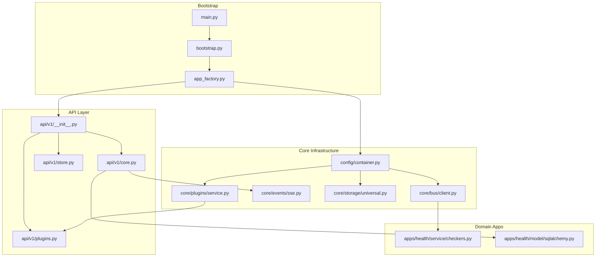
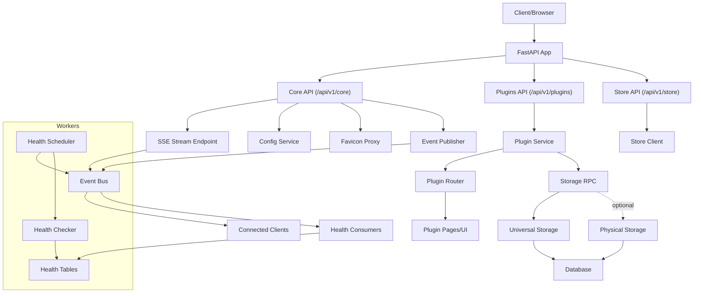
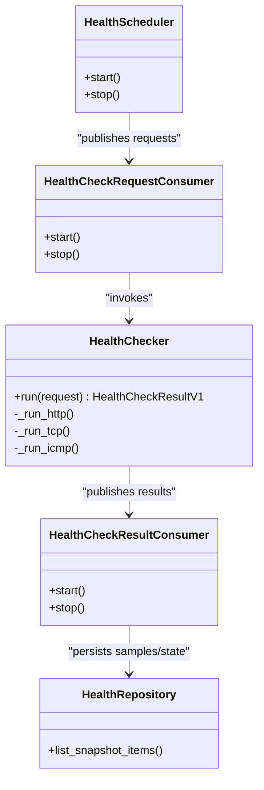
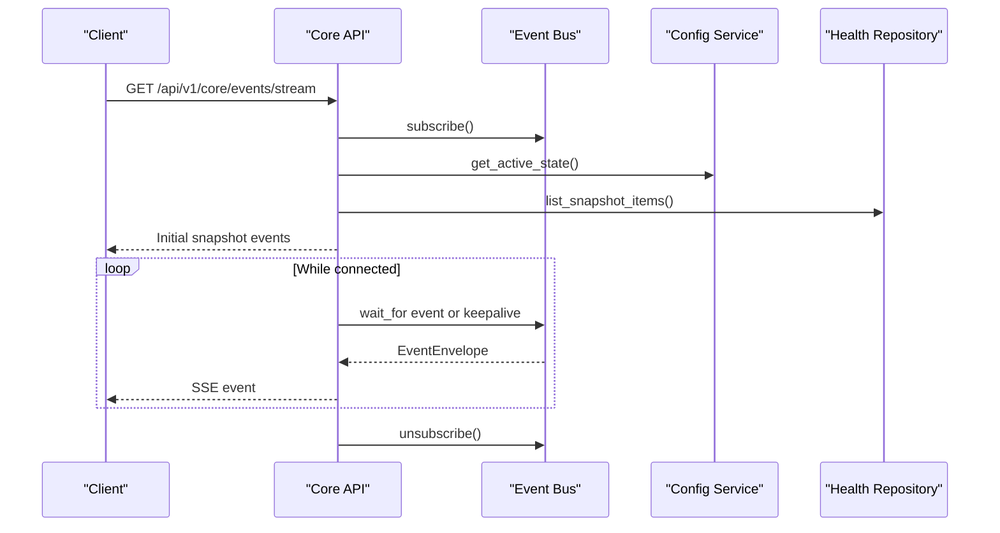
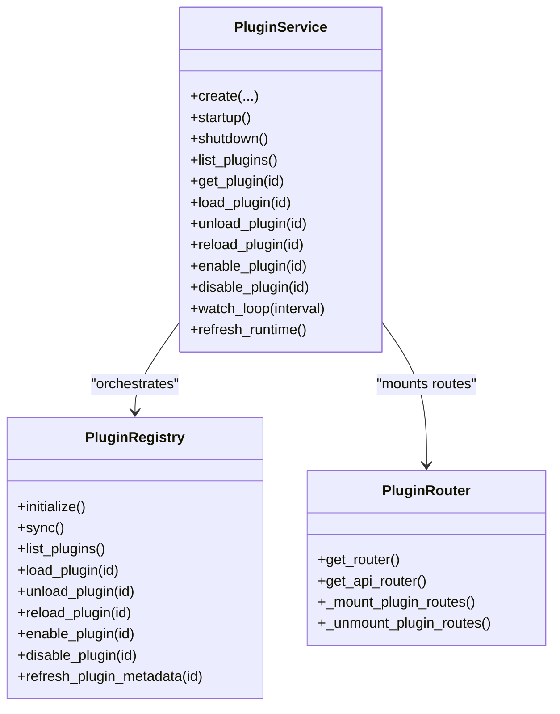
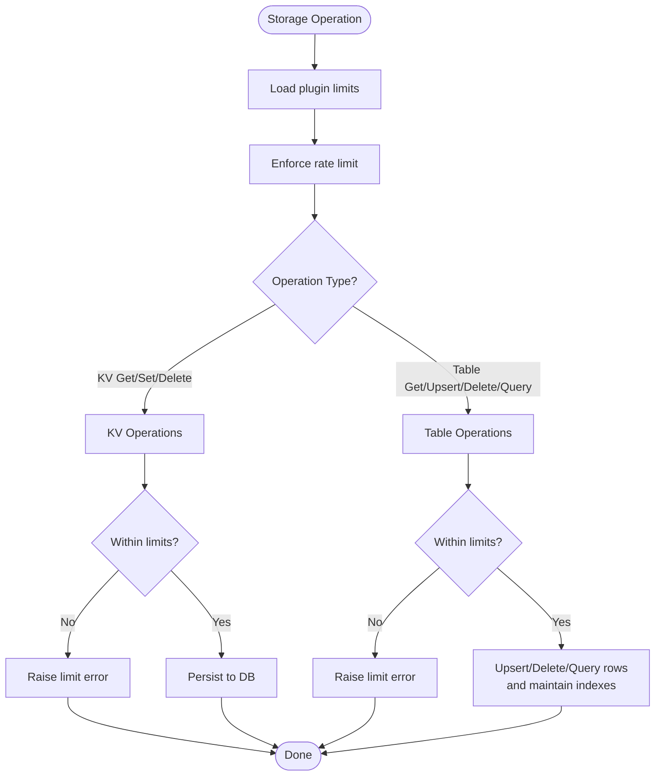
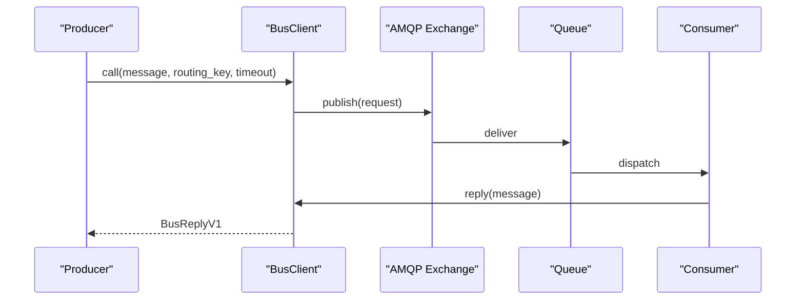
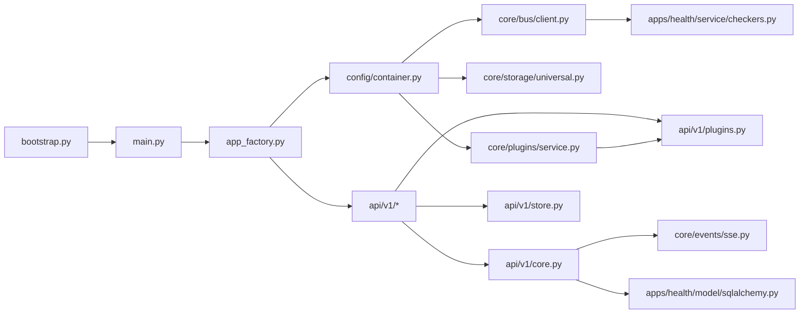

# Project Overview

<cite>
**Referenced Files in This Document**
- [main.py](file://main.py)
- [app_factory.py](file://app_factory.py)
- [bootstrap.py](file://bootstrap.py)
- [config/settings.py](file://config/settings.py)
- [config/container.py](file://config/container.py)
- [api/v1/__init__.py](file://api/v1/__init__.py)
- [api/v1/core.py](file://api/v1/core.py)
- [api/v1/plugins.py](file://api/v1/plugins.py)
- [api/v1/store.py](file://api/v1/store.py)
- [core/events/sse.py](file://core/events/sse.py)
- [apps/health/service/checkers.py](file://apps/health/service/checkers.py)
- [apps/health/model/sqlalchemy.py](file://apps/health/model/sqlalchemy.py)
- [core/storage/universal.py](file://core/storage/universal.py)
- [core/plugins/service.py](file://core/plugins/service.py)
- [core/bus/client.py](file://core/bus/client.py)
</cite>

## Table of Contents
1. [Introduction](#introduction)
2. [Project Structure](#project-structure)
3. [Core Components](#core-components)
4. [Architecture Overview](#architecture-overview)
5. [Detailed Component Analysis](#detailed-component-analysis)
6. [Dependency Analysis](#dependency-analysis)
7. [Performance Considerations](#performance-considerations)
8. [Troubleshooting Guide](#troubleshooting-guide)
9. [Conclusion](#conclusion)

## Introduction
Oko Dashboard is a distributed monitoring and automation platform centered on a FastAPI-based backend. It enables real-time health monitoring, event streaming, a flexible plugin system, and a storage abstraction layer that isolates plugins from infrastructure concerns. The platform targets scenarios where observability, extensibility, and operational autonomy are key: continuous monitoring of services, automated reactions to state changes, and pluggable integrations for diverse telemetry and actions.

Key design goals:
- Distributed and decoupled: Uses an AMQP-based message bus for inter-process communication.
- Extensible: A robust plugin system allows third-party extensions to contribute UI, actions, and services.
- Observable: Real-time event streaming via Server-Sent Events (SSE) keeps clients informed.
- Reliable: Built-in rate limiting, timeouts, and bounded resource usage in storage and health checks.
- Operational: Health monitoring, scheduling, and configuration management are first-class features.

## Project Structure
The backend is organized around a layered architecture:
- Application bootstrap and lifecycle management
- API surface (FastAPI routers)
- Domain applications (e.g., health monitoring)
- Core infrastructure (bus, events, storage, plugins)
- Configuration and dependency injection

**Diagram sources**
- [main.py:1-24](file://main.py#L1-L24)
- [bootstrap.py:1-32](file://bootstrap.py#L1-L32)
- [app_factory.py:1-133](file://app_factory.py#L1-L133)
- [api/v1/__init__.py:1-16](file://api/v1/__init__.py#L1-L16)
- [api/v1/core.py:1-377](file://api/v1/core.py#L1-L377)
- [api/v1/plugins.py:1-362](file://api/v1/plugins.py#L1-L362)
- [api/v1/store.py:1-114](file://api/v1/store.py#L1-L114)
- [config/container.py:1-427](file://config/container.py#L1-L427)
- [core/bus/client.py:1-290](file://core/bus/client.py#L1-L290)
- [core/events/sse.py:1-14](file://core/events/sse.py#L1-L14)
- [core/storage/universal.py:1-500](file://core/storage/universal.py#L1-L500)
- [core/plugins/service.py:1-299](file://core/plugins/service.py#L1-L299)
- [apps/health/service/checkers.py:1-199](file://apps/health/service/checkers.py#L1-L199)
- [apps/health/model/sqlalchemy.py:1-88](file://apps/health/model/sqlalchemy.py#L1-L88)

**Section sources**
- [main.py:1-24](file://main.py#L1-L24)
- [bootstrap.py:1-32](file://bootstrap.py#L1-L32)
- [app_factory.py:1-133](file://app_factory.py#L1-L133)
- [api/v1/__init__.py:1-16](file://api/v1/__init__.py#L1-L16)

## Core Components
- Application factory and lifecycle: Creates a FastAPI app, mounts routers, registers plugin routes, wires middleware and exception handlers, and manages startup/shutdown hooks.
- Dependency injection container: Builds and wires all services (database, bus, storage, plugin service, health subsystem, event publisher).
- API surface: Provides core endpoints for health, configuration, events streaming, favicon proxy, and plugin management; plugin store integration endpoints.
- Health monitoring: Checker engine, scheduler, consumers, and persistence models for monitored services and samples.
- Event streaming: SSE formatter and streaming endpoint emitting configuration and health snapshots plus live events.
- Storage abstraction: Universal storage with rate limiting, row/table limits, and JSON-encodable constraints; physical storage for plugin tables.
- Plugin system: Discovery, loading, routing, lifecycle hooks, and runtime refresh/watch loop.
- Messaging bus: AMQP client with RPC, durable queues, and memory-mode for local development.

**Section sources**
- [app_factory.py:87-133](file://app_factory.py#L87-L133)
- [config/container.py:252-427](file://config/container.py#L252-L427)
- [api/v1/core.py:43-377](file://api/v1/core.py#L43-L377)
- [api/v1/plugins.py:23-362](file://api/v1/plugins.py#L23-L362)
- [api/v1/store.py:11-114](file://api/v1/store.py#L11-L114)
- [apps/health/service/checkers.py:15-199](file://apps/health/service/checkers.py#L15-L199)
- [apps/health/model/sqlalchemy.py:23-88](file://apps/health/model/sqlalchemy.py#L23-L88)
- [core/events/sse.py:8-14](file://core/events/sse.py#L8-L14)
- [core/storage/universal.py:85-500](file://core/storage/universal.py#L85-L500)
- [core/plugins/service.py:18-299](file://core/plugins/service.py#L18-L299)
- [core/bus/client.py:34-290](file://core/bus/client.py#L34-L290)

## Architecture Overview
Oko follows a modular, event-driven architecture:
- FastAPI exposes REST and SSE endpoints.
- A container orchestrates services and wires them to the bus.
- Health monitoring runs on workers and publishes results to the bus and persistent storage.
- Plugins extend functionality via a controlled API surface and can expose UI pages and actions.
- Storage is abstracted behind a universal interface with strict limits and rate controls.

**Diagram sources**
- [app_factory.py:87-133](file://app_factory.py#L87-L133)
- [api/v1/core.py:311-377](file://api/v1/core.py#L311-L377)
- [api/v1/plugins.py:23-362](file://api/v1/plugins.py#L23-L362)
- [api/v1/store.py:11-114](file://api/v1/store.py#L11-L114)
- [config/container.py:105-174](file://config/container.py#L105-L174)
- [core/storage/universal.py:85-500](file://core/storage/universal.py#L85-L500)
- [apps/health/service/checkers.py:15-199](file://apps/health/service/checkers.py#L15-L199)
- [apps/health/model/sqlalchemy.py:23-88](file://apps/health/model/sqlalchemy.py#L23-L88)

## Detailed Component Analysis

### Health Monitoring Subsystem
The health subsystem continuously monitors services and aggregates results:
- HealthChecker executes HTTP/TCP/ICMP checks with timeouts and TLS verification.
- HealthScheduler drives periodic checks and heartbeats, enforcing retention and thresholds.
- Consumers process check requests and persist results; repository provides snapshot queries.
- SQLAlchemy models define persisted structures for services, samples, and state.

**Diagram sources**
- [apps/health/service/checkers.py:15-199](file://apps/health/service/checkers.py#L15-L199)
- [apps/health/model/sqlalchemy.py:23-88](file://apps/health/model/sqlalchemy.py#L23-L88)
- [config/container.py:354-365](file://config/container.py#L354-L365)

**Section sources**
- [apps/health/service/checkers.py:15-199](file://apps/health/service/checkers.py#L15-L199)
- [apps/health/model/sqlalchemy.py:23-88](file://apps/health/model/sqlalchemy.py#L23-L88)
- [config/container.py:343-365](file://config/container.py#L343-L365)

### Event Streaming (SSE)
The SSE endpoint streams configuration and health snapshots initially, followed by live events. It supports keepalive and retry configuration.

**Diagram sources**
- [api/v1/core.py:311-377](file://api/v1/core.py#L311-L377)
- [core/events/sse.py:8-14](file://core/events/sse.py#L8-L14)
- [config/container.py:339-342](file://config/container.py#L339-L342)

**Section sources**
- [api/v1/core.py:311-377](file://api/v1/core.py#L311-L377)
- [core/events/sse.py:8-14](file://core/events/sse.py#L8-L14)

### Plugin System
The plugin system discovers, loads, routes, and manages plugin lifecycles. It supports runtime watching and dynamic route mounting.

**Diagram sources**
- [core/plugins/service.py:18-299](file://core/plugins/service.py#L18-L299)

**Section sources**
- [core/plugins/service.py:18-299](file://core/plugins/service.py#L18-L299)
- [api/v1/plugins.py:23-362](file://api/v1/plugins.py#L23-L362)

### Storage Abstraction
Universal storage enforces strict limits and rate controls, while allowing plugins to store structured data with primary keys and indexed fields. It integrates with a physical storage mode for plugin tables.

**Diagram sources**
- [core/storage/universal.py:85-500](file://core/storage/universal.py#L85-L500)

**Section sources**
- [core/storage/universal.py:85-500](file://core/storage/universal.py#L85-L500)
- [config/container.py:283-297](file://config/container.py#L283-L297)

### Messaging Bus and RPC
The bus client provides RPC and pub/sub semantics over AMQP with durable exchanges/queues and memory-mode for local testing. Routing keys decouple producers and consumers.

**Diagram sources**
- [core/bus/client.py:101-167](file://core/bus/client.py#L101-L167)

**Section sources**
- [core/bus/client.py:34-290](file://core/bus/client.py#L34-L290)
- [config/container.py:276-365](file://config/container.py#L276-L365)

## Dependency Analysis
High-level dependencies:
- Bootstrap constructs settings, logging, and the container.
- App factory builds the FastAPI app, registers routers, and sets up middleware.
- Container composes all services and starts/stops them according to runtime role and broker mode.
- API routers depend on dependency providers to access services.
- Health and plugin subsystems communicate via the bus and storage.

**Diagram sources**
- [bootstrap.py:1-32](file://bootstrap.py#L1-L32)
- [main.py:1-24](file://main.py#L1-L24)
- [app_factory.py:87-133](file://app_factory.py#L87-L133)
- [config/container.py:252-427](file://config/container.py#L252-L427)
- [api/v1/core.py:43-377](file://api/v1/core.py#L43-L377)
- [api/v1/plugins.py:23-362](file://api/v1/plugins.py#L23-L362)
- [api/v1/store.py:11-114](file://api/v1/store.py#L11-L114)
- [core/events/sse.py:8-14](file://core/events/sse.py#L8-L14)
- [apps/health/service/checkers.py:15-199](file://apps/health/service/checkers.py#L15-L199)
- [apps/health/model/sqlalchemy.py:23-88](file://apps/health/model/sqlalchemy.py#L23-L88)
- [core/bus/client.py:34-290](file://core/bus/client.py#L34-L290)
- [core/storage/universal.py:85-500](file://core/storage/universal.py#L85-L500)
- [core/plugins/service.py:18-299](file://core/plugins/service.py#L18-L299)

**Section sources**
- [config/container.py:252-427](file://config/container.py#L252-L427)
- [api/v1/__init__.py:9-16](file://api/v1/__init__.py#L9-L16)

## Performance Considerations
- Health checks: Configurable intervals, timeouts, and ICMP toggles prevent excessive load. Latency thresholds and retention windows bound historical data growth.
- Storage limits: Per-plugin caps on tables, rows, bytes, and QPS protect shared resources and ensure fair sharing among plugins.
- Event streaming: Keepalive and retry settings balance responsiveness and bandwidth.
- Bus throughput: Prefetch count and durable queues improve reliability and throughput under load.
- Memory vs. external broker: Memory-mode simplifies local development but does not replace AMQP for distributed deployments.

[No sources needed since this section provides general guidance]

## Troubleshooting Guide
Common areas to investigate:
- Health monitoring
  - Verify scheduler tick and heartbeat intervals, retention days, and default check parameters.
  - Confirm ICMP availability and binary path if ICMP checks are enabled.
  - Check repository queries for snapshot items and recent samples.
- Plugin system
  - Inspect plugin discovery logs and watch loop summaries for added/removed/reloaded/failed states.
  - Ensure plugin routes are mounted and lifecycle hooks are invoked.
- Storage
  - Review rate-limiting and query constraints; confirm table specs and indexed fields.
  - Validate JSON-serializability and row sizes against configured limits.
- Events and SSE
  - Confirm event bus subscription and consumer startup.
  - Validate SSE formatting and client keepalive/retry behavior.
- Bus connectivity
  - Check broker URL, memory-mode behavior, and queue bindings.
  - Inspect RPC timeouts and reply-to handling.

**Section sources**
- [config/settings.py:32-93](file://config/settings.py#L32-L93)
- [apps/health/service/checkers.py:15-199](file://apps/health/service/checkers.py#L15-L199)
- [apps/health/model/sqlalchemy.py:23-88](file://apps/health/model/sqlalchemy.py#L23-L88)
- [core/plugins/service.py:285-299](file://core/plugins/service.py#L285-L299)
- [core/storage/universal.py:446-497](file://core/storage/universal.py#L446-L497)
- [api/v1/core.py:311-377](file://api/v1/core.py#L311-L377)
- [core/bus/client.py:46-167](file://core/bus/client.py#L46-L167)

## Conclusion
Oko Dashboard’s backend is a cohesive, modular platform designed for distributed observability and automation. Its FastAPI foundation, event-driven bus, plugin architecture, and storage abstraction combine to offer a scalable, extensible solution. Administrators gain real-time insights and control, while developers can extend the platform through plugins and actions. The configuration-driven defaults and strict resource controls help maintain stability in production environments.