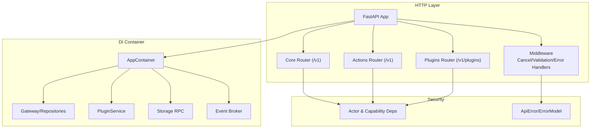
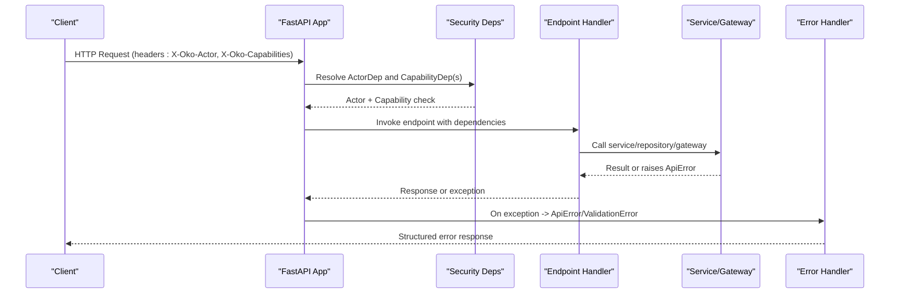
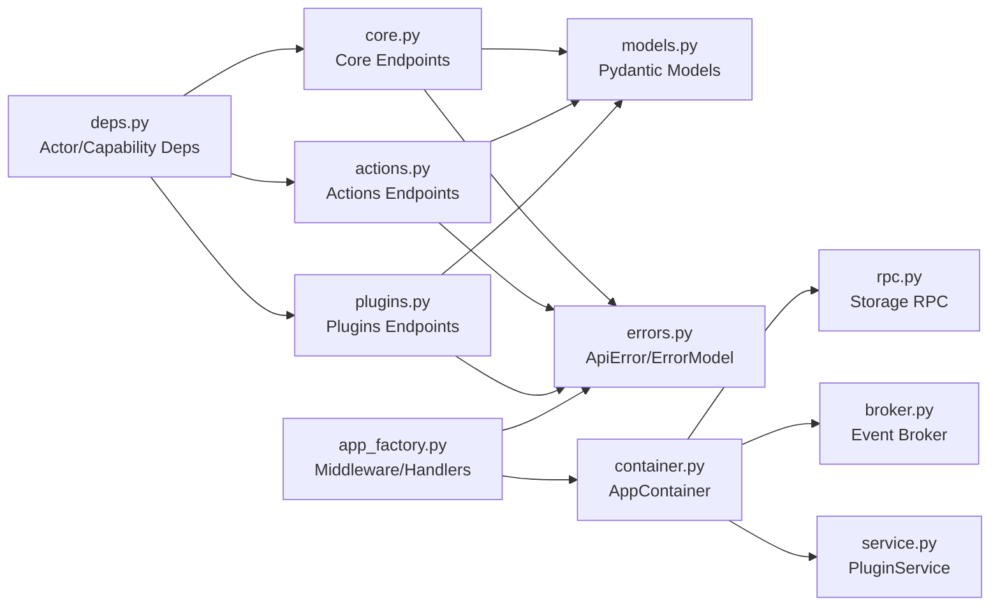

# Security and Authentication

<cite>
**Referenced Files in This Document**
- [deps.py](file://core/security/deps.py)
- [core.py](file://api/v1/core.py)
- [actions.py](file://api/v1/actions.py)
- [plugins.py](file://api/v1/plugins.py)
- [app_factory.py](file://app_factory.py)
- [container.py](file://config/container.py)
- [errors.py](file://core/contracts/errors.py)
- [models.py](file://core/contracts/models.py)
- [rpc.py](file://core/storage/rpc.py)
- [broker.py](file://core/events/broker.py)
- [service.py](file://core/plugins/service.py)
- [settings.py](file://config/settings.py)
</cite>

## Table of Contents
1. [Introduction](#introduction)
2. [Project Structure](#project-structure)
3. [Core Components](#core-components)
4. [Architecture Overview](#architecture-overview)
5. [Detailed Component Analysis](#detailed-component-analysis)
6. [Dependency Analysis](#dependency-analysis)
7. [Performance Considerations](#performance-considerations)
8. [Troubleshooting Guide](#troubleshooting-guide)
9. [Conclusion](#conclusion)

## Introduction
This document provides comprehensive security documentation for the Oko Dashboard backend. It explains authentication and authorization mechanisms, middleware and dependency injection patterns, request validation, and access control. It also covers security considerations for the plugin system, event system, and storage layer, along with best practices and examples for building secure endpoints.

## Project Structure
Security-related components are organized across several modules:
- Authentication and authorization via request headers and capability checks
- API routers that enforce access controls using dependency injectors
- Application factory and middleware for error handling and request lifecycle
- Dependency injection container for services and infrastructure
- Contracts and error models for consistent error handling
- Storage RPC and event broker with capability-based access control
- Plugin service orchestration and route mounting

**Diagram sources**
- [app_factory.py:87-133](file://app_factory.py#L87-L133)
- [deps.py:16-38](file://core/security/deps.py#L16-L38)
- [container.py:252-423](file://config/container.py#L252-L423)
- [core.py:43-377](file://api/v1/core.py#L43-L377)
- [actions.py:23-61](file://api/v1/actions.py#L23-L61)
- [plugins.py:23-362](file://api/v1/plugins.py#L23-L362)

**Section sources**
- [app_factory.py:87-133](file://app_factory.py#L87-L133)
- [container.py:252-423](file://config/container.py#L252-L423)

## Core Components
- Authentication via X-Oko-Actor header and authorization via X-Oko-Capabilities header
- Capability-based access control enforced per endpoint
- Centralized error handling with structured ApiError and ErrorModel
- Dependency injection via annotated dependencies and a container-managed AppContainer
- Validation via Pydantic models and FastAPI validation handlers
- Access control for storage RPC and event publishing based on capabilities

Key implementation references:
- Capability and actor dependency injectors
- Endpoint decorators requiring capabilities
- Global exception handlers for ApiError and validation errors
- Container construction wiring services and consumers

**Section sources**
- [deps.py:16-75](file://core/security/deps.py#L16-L75)
- [core.py:237-377](file://api/v1/core.py#L237-L377)
- [actions.py:23-61](file://api/v1/actions.py#L23-L61)
- [plugins.py:23-362](file://api/v1/plugins.py#L23-L362)
- [app_factory.py:63-85](file://app_factory.py#L63-L85)
- [errors.py:9-44](file://core/contracts/errors.py#L9-L44)
- [container.py:252-423](file://config/container.py#L252-L423)

## Architecture Overview
The backend enforces security at multiple layers:
- Transport and transport-level TLS are handled by upstream infrastructure and settings
- HTTP layer validates requests and raises structured errors
- Capability-based authorization is enforced per endpoint using FastAPI Depends
- Storage and event operations are gated by capability maps and RPC consumers
- Plugins are loaded and routed under strict runtime controls

**Diagram sources**
- [deps.py:16-38](file://core/security/deps.py#L16-L38)
- [core.py:237-377](file://api/v1/core.py#L237-L377)
- [actions.py:23-61](file://api/v1/actions.py#L23-L61)
- [plugins.py:23-362](file://api/v1/plugins.py#L23-L362)
- [app_factory.py:63-85](file://app_factory.py#L63-L85)

## Detailed Component Analysis

### Authentication and Authorization
- Actor identification: The X-Oko-Actor header is mandatory; missing or empty values trigger a 401 error.
- Capability enforcement: The X-Oko-Capabilities header is parsed into a set and checked against required capability per endpoint.
- Capability dependency helpers return the capability string when present, otherwise raise a 403 ApiError with structured details.

Best practices:
- Always require X-Oko-Actor for endpoints that modify state or execute actions.
- Require the minimal capability necessary for each endpoint.
- Use capability sets to avoid granting broad permissions.

**Section sources**
- [deps.py:10-38](file://core/security/deps.py#L10-L38)
- [errors.py:19-41](file://core/contracts/errors.py#L19-L41)

### Middleware and Error Handling
- Cancelled request handling logs and returns a 499 response to prevent client-side noise.
- ApiError exception handler converts ApiError into a structured JSON response with standardized fields.
- Request validation error handler converts FastAPI validation errors into a consistent error model.

Operational guidance:
- Ensure all endpoints catch and raise ApiError for controlled failures.
- Keep validation errors machine-readable with location and message details.

**Section sources**
- [app_factory.py:48-85](file://app_factory.py#L48-L85)
- [errors.py:9-44](file://core/contracts/errors.py#L9-L44)

### Dependency Injection and Container
- AppContainer builds and wires all services: database engine/session, repositories, event bus/publisher, storage modes, RPC clients, plugin service, and workers.
- Services are retrieved via annotated dependencies (e.g., ContainerDep, ConfigServiceDep) ensuring consistent lifecycle and testability.
- Plugin routes are registered during app lifespan initialization.

Security implications:
- Centralized container ensures services are constructed once and consistently.
- Plugin service is optional; routes are only included when available.

**Section sources**
- [container.py:252-423](file://config/container.py#L252-L423)
- [app_factory.py:30-46](file://app_factory.py#L30-L46)

### Request Validation
- Pydantic models define request/response schemas with constraints (min_length, max_length, pattern, Field constraints).
- FastAPI validation errors are normalized into a consistent error response.

Common validations:
- Query parameters validated with Query defaults and bounds.
- URL parsing and sanitization for upstream operations (e.g., favicon proxy).
- Payload constraints for config import/patch/rollback and action envelopes.

**Section sources**
- [models.py:10-207](file://core/contracts/models.py#L10-L207)
- [core.py:52-58](file://api/v1/core.py#L52-L58)
- [core.py:200-234](file://api/v1/core.py#L200-L234)

### Access Control Patterns
- Core endpoints:
  - /state, /config, /config/revisions require read capabilities
  - Import/patch/rollback require write capabilities
  - Events streaming requires read events capability
- Actions endpoints:
  - Registry, validate, execute, history require corresponding action capabilities
- Plugins endpoints:
  - Listing, manifests, services require read plugin capabilities
  - Settings update requires config patch capability
  - Load/unload/reload/enable/disable/delete require action execution capability

Implementation pattern:
- Each endpoint declares a capability dependency (e.g., require_config, require_actions_execute) alongside service dependencies.

**Section sources**
- [core.py:237-377](file://api/v1/core.py#L237-L377)
- [actions.py:23-61](file://api/v1/actions.py#L23-L61)
- [plugins.py:23-362](file://api/v1/plugins.py#L23-L362)
- [deps.py:40-55](file://core/security/deps.py#L40-L55)

### Secure Endpoint Examples
- Example: GET /v1/state
  - Requires read state capability
  - Uses ConfigServiceDep to fetch active state
  - Returns active state payload
- Example: POST /v1/actions/execute
  - Requires exec actions execute capability
  - Uses ActionRpcClientDep to dispatch action
  - Includes actor for auditability
- Example: PUT /v1/plugins/{id}/settings
  - Requires write config patch capability
  - Calls plugin module’s update_settings handler if present

Guidelines:
- Always include ActorDep for mutable operations.
- Enforce the minimal capability per endpoint.
- Return structured errors via ApiError for consistent client handling.

**Section sources**
- [core.py:237-244](file://api/v1/core.py#L237-L244)
- [actions.py:41-49](file://api/v1/actions.py#L41-L49)
- [plugins.py:146-176](file://api/v1/plugins.py#L146-L176)

### Plugin System Security
- PluginService orchestrates discovery, loading, enabling/disabling, and unloading of plugins.
- Routes are mounted only for active plugins; inactive/disabled plugins do not expose APIs.
- Runtime refresh detects filesystem changes and reloads active plugins safely.
- Plugin hooks (on_startup/on_shutdown) are scheduled asynchronously; failures are logged but do not block core.

Security considerations:
- Limit plugin privileges to declared capabilities.
- Validate plugin-provided handlers and return types.
- Avoid exposing internal plugin internals via routes.

**Section sources**
- [service.py:18-299](file://core/plugins/service.py#L18-L299)

### Event System Security
- BrokerEventPublisher constructs typed envelopes and publishes via broker with routing keys.
- EventPublishConsumer subscribes to the events queue and forwards to in-process EventBus.
- SSE streaming endpoints are protected by capability checks and return keepalive messages.

Security considerations:
- Validate event payloads and enforce minimal event surface.
- Ensure consumers process messages idempotently where applicable.

**Section sources**
- [broker.py:16-95](file://core/events/broker.py#L16-L95)
- [core.py:311-377](file://api/v1/core.py#L311-L377)

### Storage Layer Security
- Storage RPC supports KV and table operations with strict input validation.
- Operations are dispatched via InProcStorageRPC or BusStorageRPC depending on runtime.
- StorageRpcConsumer enforces capability-based access per plugin and operation.
- Limits and rate controls are enforced by underlying storage implementations.

Security considerations:
- Validate all RPC request fields and types.
- Enforce allowed operations per plugin using capability maps.
- Apply timeouts and limits to RPC calls.

**Section sources**
- [rpc.py:65-499](file://core/storage/rpc.py#L65-L499)
- [container.py:329-334](file://config/container.py#L329-L334)

## Dependency Analysis
The security model relies on:
- FastAPI Depends for capability and actor resolution
- Pydantic models for input validation
- AppContainer for DI and service wiring
- Broker-based eventing and RPC for distributed operations

**Diagram sources**
- [deps.py:16-75](file://core/security/deps.py#L16-L75)
- [core.py:237-377](file://api/v1/core.py#L237-L377)
- [actions.py:23-61](file://api/v1/actions.py#L23-L61)
- [plugins.py:23-362](file://api/v1/plugins.py#L23-L362)
- [models.py:10-207](file://core/contracts/models.py#L10-L207)
- [errors.py:9-44](file://core/contracts/errors.py#L9-L44)
- [app_factory.py:87-133](file://app_factory.py#L87-L133)
- [container.py:252-423](file://config/container.py#L252-L423)
- [rpc.py:65-499](file://core/storage/rpc.py#L65-L499)
- [broker.py:16-95](file://core/events/broker.py#L16-L95)
- [service.py:18-299](file://core/plugins/service.py#L18-L299)

**Section sources**
- [deps.py:16-75](file://core/security/deps.py#L16-L75)
- [app_factory.py:87-133](file://app_factory.py#L87-L133)
- [container.py:252-423](file://config/container.py#L252-L423)

## Performance Considerations
- Use capability checks early to fail fast and reduce unnecessary work.
- Prefer in-process RPC for local operations; use broker RPC for distributed tasks.
- Apply reasonable timeouts and limits for upstream operations (e.g., favicon fetch).
- Monitor event stream keepalive intervals and retry settings to balance responsiveness and overhead.

[No sources needed since this section provides general guidance]

## Troubleshooting Guide
Common issues and resolutions:
- 401 Unauthorized: Ensure X-Oko-Actor header is present and non-empty.
- 403 Forbidden: Verify X-Oko-Capabilities header includes the required capability for the endpoint.
- 422 Validation Error: Review request payload against Pydantic model constraints.
- 500 Internal Error: Inspect structured ApiError responses for details; check service logs.

Operational tips:
- Enable logging during development to capture cancellation and validation events.
- Validate settings (timeouts, limits) to prevent timeouts and resource exhaustion.

**Section sources**
- [app_factory.py:48-85](file://app_factory.py#L48-L85)
- [errors.py:19-41](file://core/contracts/errors.py#L19-L41)
- [settings.py:14-128](file://config/settings.py#L14-L128)

## Conclusion
The Oko Dashboard backend implements a layered security model centered on capability-based authorization, robust input validation, and centralized error handling. Authentication is header-driven with mandatory actor identification, while authorization is enforced per endpoint using annotated dependencies. The DI container ensures consistent service wiring, and the event and storage subsystems apply capability gating and timeouts. Following the documented patterns and best practices will help maintain a secure and resilient system.