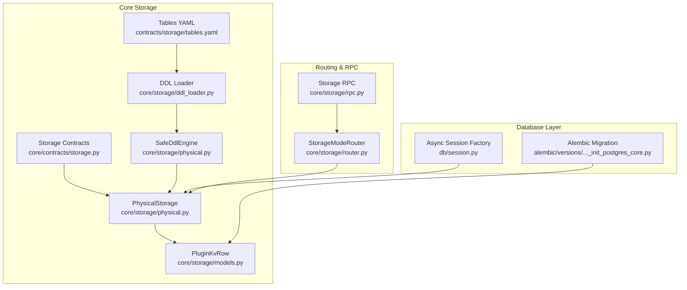
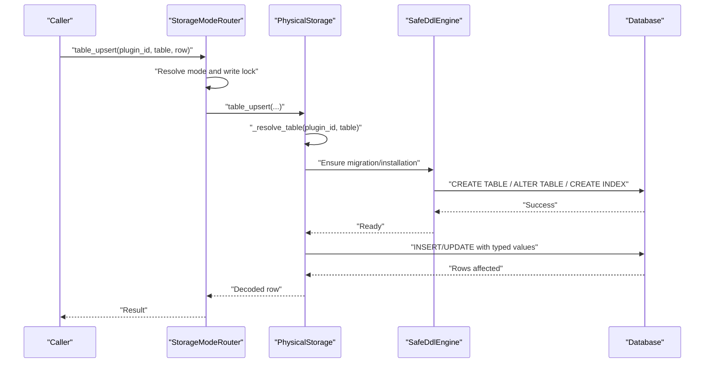
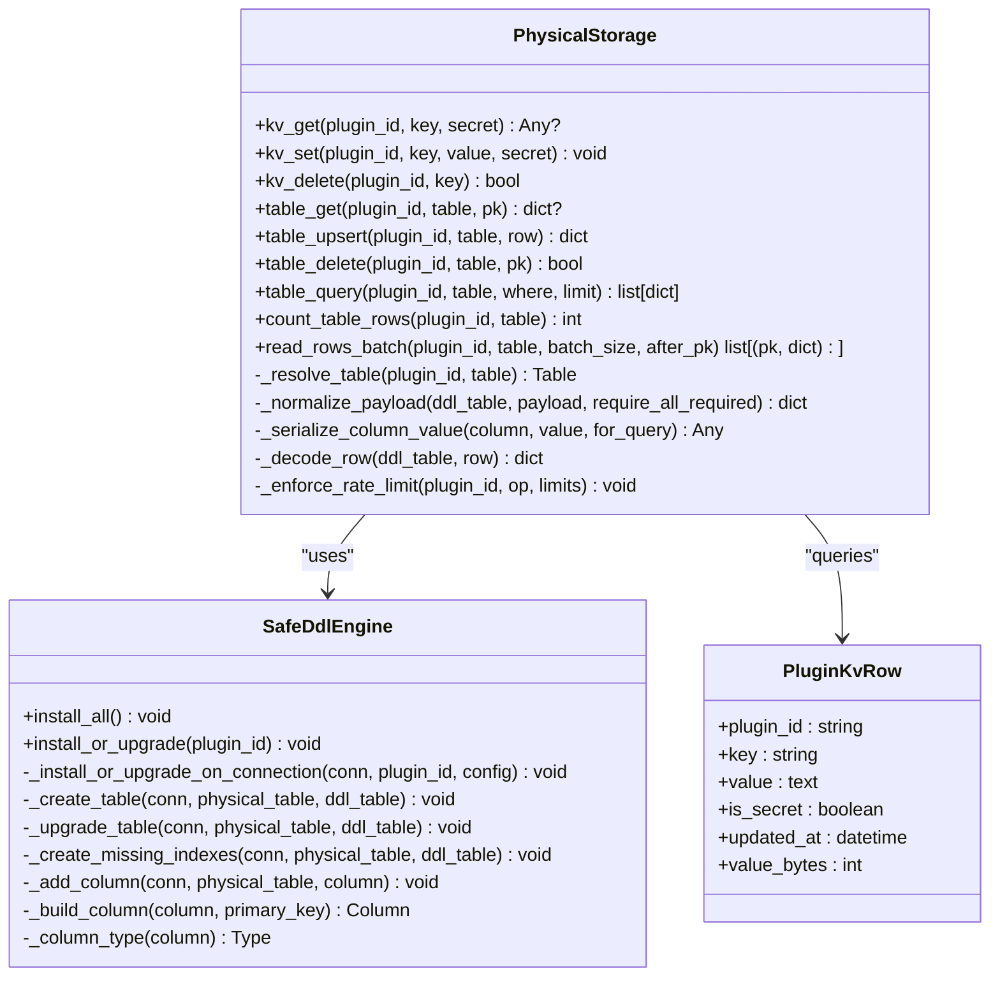
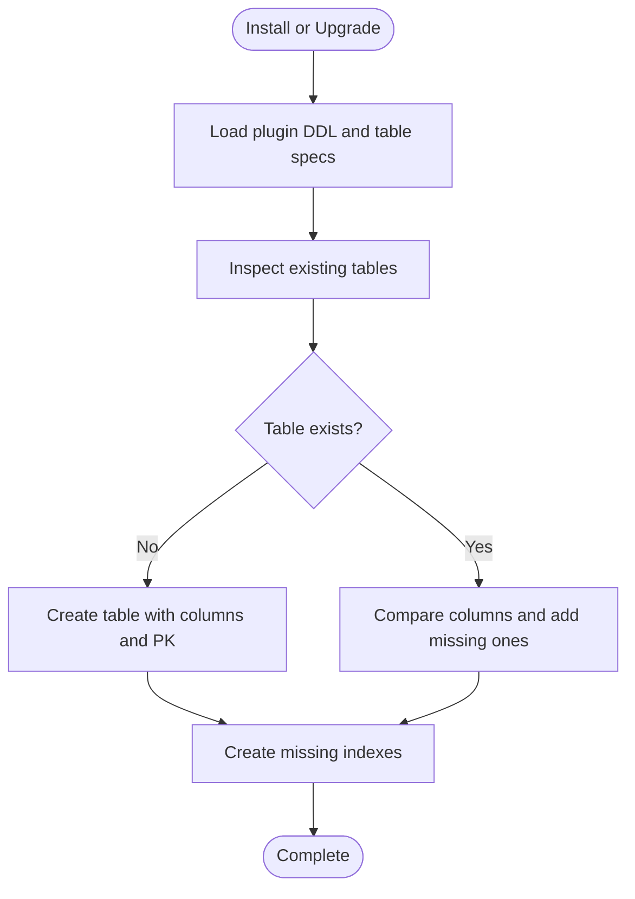
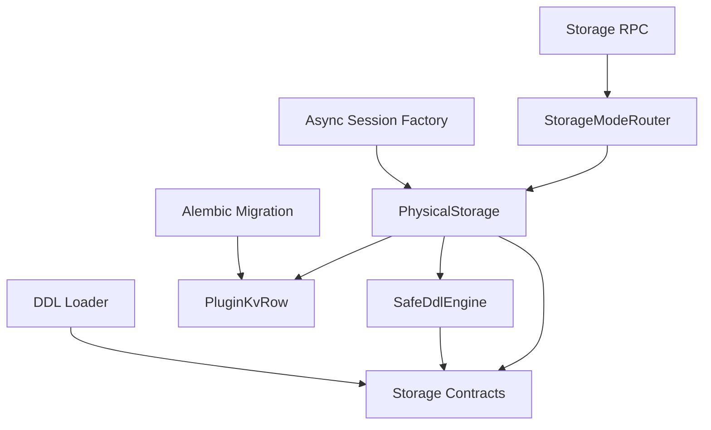

# Physical Storage Implementation

<cite>
**Referenced Files in This Document**
- [physical.py](file://core/storage/physical.py)
- [models.py](file://core/storage/models.py)
- [storage.py](file://core/contracts/storage.py)
- [tables.yaml](file://contracts/storage/tables.yaml)
- [ddl_loader.py](file://core/storage/ddl_loader.py)
- [session.py](file://db/session.py)
- [settings.py](file://config/settings.py)
- [init_postgres_core.py](file://alembic/versions/20260223_0001_init_postgres_core.py)
- [router.py](file://core/storage/router.py)
- [rpc.py](file://core/storage/rpc.py)
- [universal.py](file://core/storage/universal.py)
</cite>

## Table of Contents
1. [Introduction](#introduction)
2. [Project Structure](#project-structure)
3. [Core Components](#core-components)
4. [Architecture Overview](#architecture-overview)
5. [Detailed Component Analysis](#detailed-component-analysis)
6. [Dependency Analysis](#dependency-analysis)
7. [Performance Considerations](#performance-considerations)
8. [Troubleshooting Guide](#troubleshooting-guide)
9. [Conclusion](#conclusion)
10. [Appendices](#appendices)

## Introduction
This document explains the physical storage implementation that maps directly to underlying database tables and provides low-level storage operations. It documents the table schema requirements, SQL generation patterns, direct database interaction methods, the physical storage contract, index management, and query optimization techniques. It also covers configuration examples, table creation procedures, migration strategies, performance considerations, connection pooling, and database-specific optimizations.

## Project Structure
The physical storage implementation centers around a dedicated module that manages:
- Direct table creation and upgrades via DDL
- Strongly typed column and index enforcement
- Rate limiting and query limits
- JSON serialization for flexible data payloads
- Alembic-based migrations for core tables



**Diagram sources**
- [physical.py:288-782](file://core/storage/physical.py#L288-L782)
- [models.py:90-149](file://core/storage/models.py#L90-L149)
- [storage.py:108-146](file://core/contracts/storage.py#L108-L146)
- [ddl_loader.py:15-25](file://core/storage/ddl_loader.py#L15-L25)
- [tables.yaml:1-85](file://contracts/storage/tables.yaml#L1-L85)
- [session.py:13-20](file://db/session.py#L13-L20)
- [init_postgres_core.py:15-143](file://alembic/versions/20260223_0001_init_postgres_core.py#L15-L143)
- [router.py:13-120](file://core/storage/router.py#L13-L120)
- [rpc.py:65-500](file://core/storage/rpc.py#L65-L500)

**Section sources**
- [physical.py:1-782](file://core/storage/physical.py#L1-L782)
- [models.py:1-149](file://core/storage/models.py#L1-L149)
- [storage.py:1-192](file://core/contracts/storage.py#L1-L192)
- [tables.yaml:1-85](file://contracts/storage/tables.yaml#L1-L85)
- [ddl_loader.py:1-28](file://core/storage/ddl_loader.py#L1-L28)
- [session.py:1-24](file://db/session.py#L1-L24)
- [init_postgres_core.py:1-143](file://alembic/versions/20260223_0001_init_postgres_core.py#L1-L143)
- [router.py:1-120](file://core/storage/router.py#L1-L120)
- [rpc.py:1-500](file://core/storage/rpc.py#L1-L500)

## Core Components
- PhysicalStorage: Provides KV and table operations against physical tables, enforcing limits, rate limiting, and type safety. It materializes SQLAlchemy Table objects dynamically from DDL specs and caches them.
- SafeDdlEngine: Manages DDL installation and upgrades for plugin-defined tables, ensuring destructive changes are prevented and indexes are created consistently.
- PluginKvRow: ORM model for the plugin key-value store with composite primary key and indexes.
- Storage contracts: Define DDL specs, table specs, limits, and RPC contracts used by both universal and physical storage.
- DDL loader: Loads plugin DDL specs from YAML bundles.
- Alembic migration: Creates core tables and indexes for the platform.

Key responsibilities:
- Enforce storage limits (rows per table, bytes per row/value, QPS, query limit)
- Serialize/deserialize JSON payloads and normalize types
- Generate and quote SQL identifiers safely
- Provide batch reads and controlled queries

**Section sources**
- [physical.py:288-782](file://core/storage/physical.py#L288-L782)
- [models.py:90-103](file://core/storage/models.py#L90-L103)
- [storage.py:10-192](file://core/contracts/storage.py#L10-L192)
- [ddl_loader.py:15-25](file://core/storage/ddl_loader.py#L15-L25)
- [init_postgres_core.py:15-143](file://alembic/versions/20260223_0001_init_postgres_core.py#L15-L143)

## Architecture Overview
The physical storage architecture enforces a strict separation between logical plugin table definitions and physical database tables. It uses:
- DDL specs to define columns, primary keys, and indexes
- Dynamic SQLAlchemy Table construction for each plugin table
- Alembic for core schema initialization
- Strict validation to prevent destructive DDL changes



**Diagram sources**
- [router.py:45-48](file://core/storage/router.py#L45-L48)
- [physical.py:416-474](file://core/storage/physical.py#L416-L474)
- [physical.py:598-607](file://core/storage/physical.py#L598-L607)
- [physical.py:139-154](file://core/storage/physical.py#L139-L154)

## Detailed Component Analysis

### PhysicalStorage
PhysicalStorage is the central component for physical table operations. It:
- Materializes SQLAlchemy Table objects from DDL specs and caches them
- Enforces storage limits and rate limiting
- Normalizes and validates column values according to DDL types
- Serializes JSON payloads deterministically
- Provides CRUD and query operations with strict field validation



**Diagram sources**
- [physical.py:288-782](file://core/storage/physical.py#L288-L782)
- [models.py:90-103](file://core/storage/models.py#L90-L103)

**Section sources**
- [physical.py:288-782](file://core/storage/physical.py#L288-L782)
- [models.py:90-103](file://core/storage/models.py#L90-L103)

### SafeDdlEngine
SafeDdlEngine ensures safe DDL operations:
- Prevents destructive changes (e.g., dropping columns)
- Adds new columns only when allowed
- Creates indexes defined in DDL specs
- Builds columns with correct types and nullability



**Diagram sources**
- [physical.py:139-257](file://core/storage/physical.py#L139-L257)

**Section sources**
- [physical.py:126-286](file://core/storage/physical.py#L126-L286)

### Storage Contracts and DDL Specs
Storage contracts define:
- StorageLimits: enforce max tables, rows per table, bytes per row/value, QPS, and query limit
- StorageTableSpec: logical table definition with primary key and indexes
- StorageDDL*Spec: physical DDL with columns, indexes, and primary key
- PluginStorageConfig: binds logical tables to DDL specs and sets limits

DDL loader loads plugin DDL from YAML bundles into StorageDDLSpec instances.

**Section sources**
- [storage.py:10-192](file://core/contracts/storage.py#L10-L192)
- [ddl_loader.py:15-25](file://core/storage/ddl_loader.py#L15-L25)
- [tables.yaml:1-85](file://contracts/storage/tables.yaml#L1-L85)

### Table Schema Requirements and SQL Generation
Physical tables are created with:
- Deterministic names derived from plugin_id and logical table names
- Columns mapped from DDL specs with explicit types
- Indexes created from DDL index specs
- Identifier sanitization to ensure valid SQL identifiers

SQL generation patterns:
- Dynamic Table construction with Column definitions
- INSERT/UPDATE/DELETE statements generated by SQLAlchemy
- SELECT with equality filters and ordered pagination
- ALTER TABLE ADD COLUMN with quoted identifiers

**Section sources**
- [physical.py:82-91](file://core/storage/physical.py#L82-L91)
- [physical.py:252-285](file://core/storage/physical.py#L252-L285)
- [physical.py:405-408](file://core/storage/physical.py#L405-L408)
- [physical.py:460-472](file://core/storage/physical.py#L460-L472)

### Index Management and Query Optimization
Index management:
- Indexes are created automatically if missing
- Index names are sanitized and constrained to length limits
- Supported index types: single-column and multi-column unique/non-unique

Query optimization:
- table_query supports equality predicates on primary key and declared indexes
- Predicates are validated to ensure only scalar equality is used
- Query limit is clamped to configured maximum
- Reads are ordered by primary key for deterministic pagination

**Section sources**
- [physical.py:234-250](file://core/storage/physical.py#L234-L250)
- [physical.py:500-528](file://core/storage/physical.py#L500-L528)
- [physical.py:628-631](file://core/storage/physical.py#L628-L631)

### Direct Database Interaction Methods
Direct interactions:
- Async sessions from async_sessionmaker
- SQLAlchemy Core select/update/insert/delete constructs
- Alembic operations for core schema initialization
- JSON serialization/deserialization for text columns

Connection pooling and engine configuration:
- Async engine built with pool_pre_ping enabled
- Session factory configured with autoflush/autocommit/expire_on_commit policies

**Section sources**
- [session.py:6-20](file://db/session.py#L6-L20)
- [physical.py:332-338](file://core/storage/physical.py#L332-L338)
- [physical.py:405-408](file://core/storage/physical.py#L405-L408)
- [init_postgres_core.py:15-143](file://alembic/versions/20260223_0001_init_postgres_core.py#L15-L143)

### Migration Strategies
Migration strategies:
- Initial core schema via Alembic migration
- Plugin DDL installation/upgrades via SafeDdlEngine
- Prevents destructive changes; adds columns and indexes only
- Ensures plugin tables are migrated before first use

**Section sources**
- [init_postgres_core.py:15-143](file://alembic/versions/20260223_0001_init_postgres_core.py#L15-L143)
- [physical.py:139-257](file://core/storage/physical.py#L139-L257)

### Examples

#### Physical Storage Configuration
- Define logical tables and indexes in YAML
- Load DDL specs with the DDL loader
- Configure PluginStorageConfig with mode "core_physical_tables"
- Bind DDL specs and limits to the storage router

**Section sources**
- [tables.yaml:1-85](file://contracts/storage/tables.yaml#L1-L85)
- [ddl_loader.py:15-25](file://core/storage/ddl_loader.py#L15-L25)
- [storage.py:108-146](file://core/contracts/storage.py#L108-L146)
- [router.py:13-120](file://core/storage/router.py#L13-L120)

#### Table Creation Procedures
- Ensure plugin DDL is present and validated
- Call install_or_upgrade for the plugin
- SafeDdlEngine creates tables and indexes if missing

**Section sources**
- [physical.py:139-257](file://core/storage/physical.py#L139-L257)

#### Migration Strategies
- Run Alembic upgrade for initial core tables
- Use SafeDdlEngine to migrate plugin tables
- Avoid destructive changes; rely on adding columns/indexes

**Section sources**
- [init_postgres_core.py:15-143](file://alembic/versions/20260223_0001_init_postgres_core.py#L15-L143)
- [physical.py:217-232](file://core/storage/physical.py#L217-L232)

## Dependency Analysis


**Diagram sources**
- [physical.py:288-782](file://core/storage/physical.py#L288-L782)
- [models.py:90-103](file://core/storage/models.py#L90-L103)
- [storage.py:108-146](file://core/contracts/storage.py#L108-L146)
- [ddl_loader.py:15-25](file://core/storage/ddl_loader.py#L15-L25)
- [router.py:13-120](file://core/storage/router.py#L13-L120)
- [rpc.py:65-500](file://core/storage/rpc.py#L65-L500)
- [session.py:13-20](file://db/session.py#L13-L20)
- [init_postgres_core.py:15-143](file://alembic/versions/20260223_0001_init_postgres_core.py#L15-L143)

**Section sources**
- [physical.py:288-782](file://core/storage/physical.py#L288-L782)
- [models.py:90-103](file://core/storage/models.py#L90-L103)
- [storage.py:108-146](file://core/contracts/storage.py#L108-L146)
- [ddl_loader.py:15-25](file://core/storage/ddl_loader.py#L15-L25)
- [router.py:13-120](file://core/storage/router.py#L13-L120)
- [rpc.py:65-500](file://core/storage/rpc.py#L65-L500)
- [session.py:13-20](file://db/session.py#L13-L20)
- [init_postgres_core.py:15-143](file://alembic/versions/20260223_0001_init_postgres_core.py#L15-L143)

## Performance Considerations
- Connection pooling: Async engine uses pool_pre_ping for reliability; tune pool size and timeouts based on workload.
- Rate limiting: Token bucket limiter caps operations per plugin per second to prevent overload.
- Query limits: Max query limit and row sizes prevent excessive memory usage.
- Index usage: Queries leverage declared indexes; ensure appropriate indexes are defined in DDL.
- Batch reads: read_rows_batch enables efficient iteration over large datasets.
- JSON serialization: Canonical JSON ensures consistent storage and comparison.

[No sources needed since this section provides general guidance]

## Troubleshooting Guide
Common issues and resolutions:
- StorageDdlNotAllowed: Indicates invalid DDL changes or unsupported types; review DDL specs and column types.
- StorageLimitExceeded: Exceeds configured limits; adjust StorageLimits or reduce payload sizes.
- StorageQueryNotAllowed: Invalid fields, missing primary key, or unsupported query patterns; validate where clauses and indexes.
- StorageRateLimited: Operation rate exceeds max_qps; reduce client-side concurrency or increase limits.

Operational checks:
- Verify plugin DDL is loaded and matches logical table specs.
- Confirm indexes exist for query predicates.
- Ensure sessions are properly scoped and committed.

**Section sources**
- [physical.py:167-171](file://core/storage/physical.py#L167-L171)
- [physical.py:351-352](file://core/storage/physical.py#L351-L352)
- [physical.py:508-511](file://core/storage/physical.py#L508-L511)
- [physical.py:119-123](file://core/storage/physical.py#L119-L123)

## Conclusion
The physical storage implementation provides a robust, schema-driven approach to database-backed plugin storage. By enforcing strict DDL, indexes, and operational limits, it ensures predictable performance and maintainability. The combination of dynamic table materialization, Alembic migrations, and careful query constraints makes it suitable for production workloads requiring reliable, low-level storage operations.

[No sources needed since this section summarizes without analyzing specific files]

## Appendices

### Data Model Diagram
```mermaid
erDiagram
PLUGIN_KV {
string plugin_id
string key
text value
boolean is_secret
timestamp updated_at
int value_bytes
}
PLUGIN_ROWS {
string plugin_id
string table
string pk
text row_json
timestamp updated_at
int row_bytes
}
PLUGIN_INDEXES {
string plugin_id
string table
string index_name
string index_value
string pk
timestamp updated_at
}
```

**Diagram sources**
- [models.py:90-137](file://core/storage/models.py#L90-L137)

### Configuration Options
- DATABASE_URL: Database connection string for async PostgreSQL
- OKO_STORAGE_RPC_TIMEOUT_SEC: RPC timeout for storage operations

**Section sources**
- [settings.py:32-35](file://config/settings.py#L32-L35)
- [settings.py:57-58](file://config/settings.py#L57-L58)