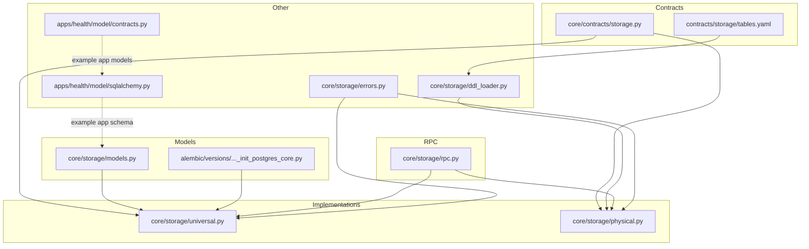
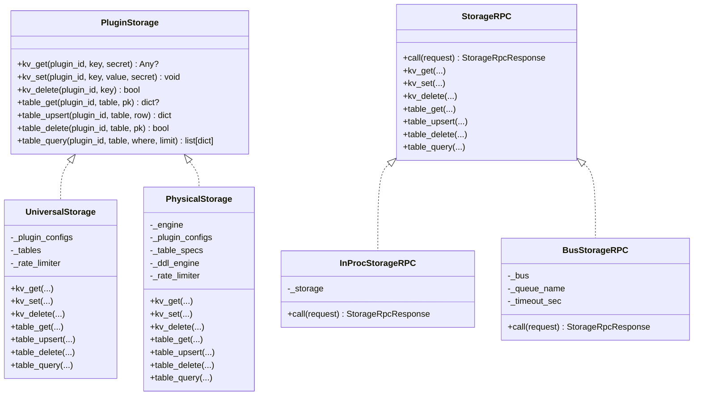
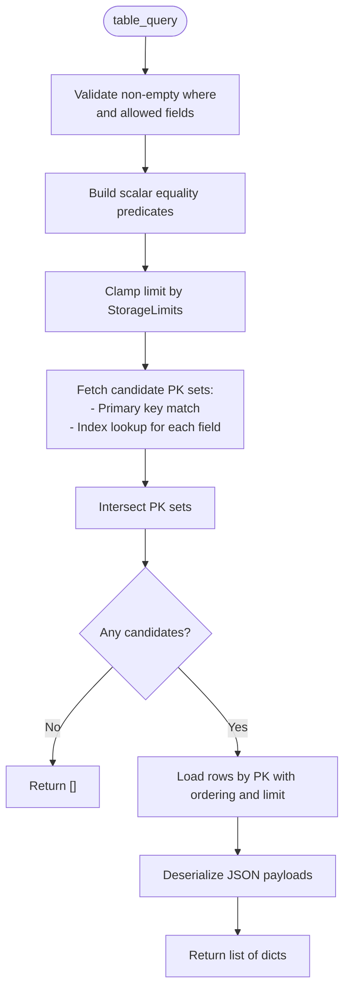
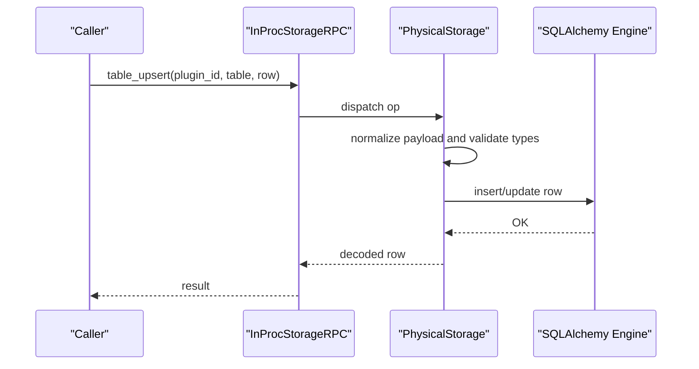
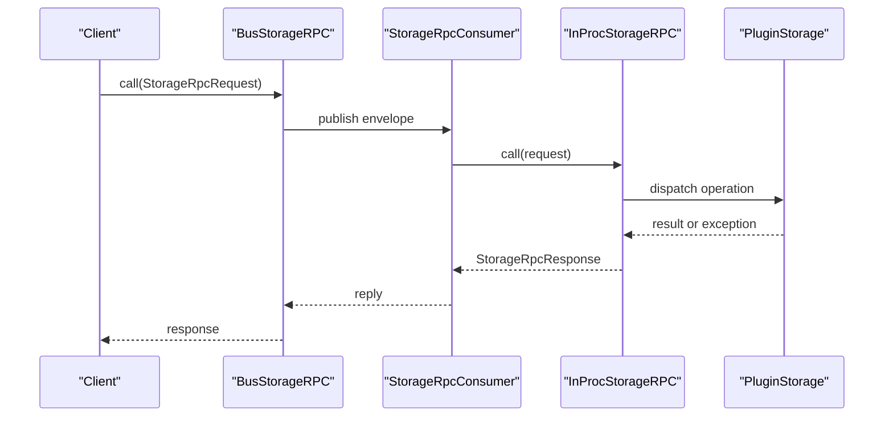
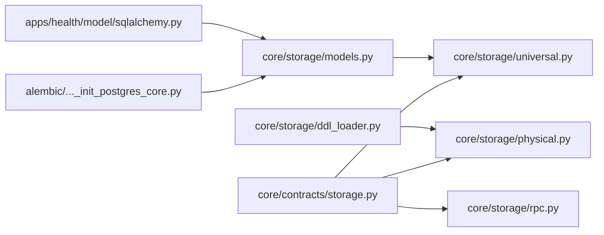

# Storage Contracts and Models

<cite>
**Referenced Files in This Document**
- [tables.yaml](file://contracts/storage/tables.yaml)
- [storage.py](file://core/contracts/storage.py)
- [models.py](file://core/storage/models.py)
- [protocols.py](file://core/storage/protocols.py)
- [repositories.py](file://core/storage/repositories.py)
- [universal.py](file://core/storage/universal.py)
- [physical.py](file://core/storage/physical.py)
- [rpc.py](file://core/storage/rpc.py)
- [errors.py](file://core/storage/errors.py)
- [ddl_loader.py](file://core/storage/ddl_loader.py)
- [20260223_0001_init_postgres_core.py](file://alembic/versions/20260223_0001_init_postgres_core.py)
- [sqlalchemy.py](file://apps/health/model/sqlalchemy.py)
- [contracts.py](file://apps/health/model/contracts.py)
</cite>

## Table of Contents
1. [Introduction](#introduction)
2. [Project Structure](#project-structure)
3. [Core Components](#core-components)
4. [Architecture Overview](#architecture-overview)
5. [Detailed Component Analysis](#detailed-component-analysis)
6. [Dependency Analysis](#dependency-analysis)
7. [Performance Considerations](#performance-considerations)
8. [Troubleshooting Guide](#troubleshooting-guide)
9. [Conclusion](#conclusion)
10. [Appendices](#appendices)

## Introduction
This document explains the storage contracts and data models that define how plugins and the core system persist structured data. It covers:
- Storage interface contracts and RPC protocol
- Data validation rules and type definitions
- Plugin storage configuration models and DDL specifications
- Table schema definitions and data transfer objects
- Contract compliance requirements, validation mechanisms, and error handling patterns
- Examples for defining custom storage contracts and implementing compliant backends
- Backward compatibility, versioning, and migration strategies

## Project Structure
The storage subsystem spans contracts, models, implementations, and migrations:
- Contracts define typed DTOs and validation rules for storage configuration, DDL, and RPC requests/responses
- Models define relational schemas for core storage and plugin universal/physical tables
- Implementations provide two storage backends: a universal in-memory-like schema and a physical DDL-backed engine
- RPC bridges enable in-process and bus-based invocation of storage operations
- Alembic migrations initialize core relational tables and support plugin storage

**Diagram sources**
- [storage.py:1-192](file://core/contracts/storage.py#L1-L192)
- [tables.yaml:1-85](file://contracts/storage/tables.yaml#L1-L85)
- [models.py:1-149](file://core/storage/models.py#L1-L149)
- [20260223_0001_init_postgres_core.py:1-143](file://alembic/versions/20260223_0001_init_postgres_core.py#L1-L143)
- [universal.py:1-500](file://core/storage/universal.py#L1-L500)
- [physical.py:1-782](file://core/storage/physical.py#L1-L782)
- [rpc.py:1-500](file://core/storage/rpc.py#L1-L500)
- [errors.py:1-40](file://core/storage/errors.py#L1-L40)
- [ddl_loader.py:1-28](file://core/storage/ddl_loader.py#L1-L28)
- [sqlalchemy.py:1-88](file://apps/health/model/sqlalchemy.py#L1-L88)
- [contracts.py:1-120](file://apps/health/model/contracts.py#L1-L120)

**Section sources**
- [storage.py:1-192](file://core/contracts/storage.py#L1-L192)
- [models.py:1-149](file://core/storage/models.py#L1-L149)
- [universal.py:1-500](file://core/storage/universal.py#L1-L500)
- [physical.py:1-782](file://core/storage/physical.py#L1-L782)
- [rpc.py:1-500](file://core/storage/rpc.py#L1-L500)
- [errors.py:1-40](file://core/storage/errors.py#L1-L40)
- [ddl_loader.py:1-28](file://core/storage/ddl_loader.py#L1-L28)
- [20260223_0001_init_postgres_core.py:1-143](file://alembic/versions/20260223_0001_init_postgres_core.py#L1-L143)
- [sqlalchemy.py:1-88](file://apps/health/model/sqlalchemy.py#L1-L88)
- [contracts.py:1-120](file://apps/health/model/contracts.py#L1-L120)

## Core Components
- Storage contracts and DTOs: Typed Pydantic models for limits, table specs, DDL specs, RPC requests/responses, and plugin storage config
- Protocols: PluginStorage and StorageRPC interfaces that define the backend contract
- Implementations:
  - UniversalStorage: A schema-less, plugin-isolated storage backed by shared relational tables with indexing and rate limiting
  - PhysicalStorage: A DDL-driven engine that materializes plugin tables and enforces strict schema evolution
- RPC layer: InProcStorageRPC and BusStorageRPC translate typed requests into backend operations with robust error mapping
- Models and migrations: Relational schemas for core tables and plugin storage tables

**Section sources**
- [storage.py:10-191](file://core/contracts/storage.py#L10-L191)
- [protocols.py:9-57](file://core/storage/protocols.py#L9-L57)
- [universal.py:85-499](file://core/storage/universal.py#L85-L499)
- [physical.py:288-781](file://core/storage/physical.py#L288-L781)
- [rpc.py:65-499](file://core/storage/rpc.py#L65-L499)
- [models.py:14-149](file://core/storage/models.py#L14-L149)
- [20260223_0001_init_postgres_core.py:15-118](file://alembic/versions/20260223_0001_init_postgres_core.py#L15-L118)

## Architecture Overview
The storage architecture separates concerns via typed contracts, validated configuration, and pluggable backends. The RPC layer provides a uniform invocation mechanism.

**Diagram sources**
- [protocols.py:9-57](file://core/storage/protocols.py#L9-L57)
- [universal.py:85-499](file://core/storage/universal.py#L85-L499)
- [physical.py:288-781](file://core/storage/physical.py#L288-L781)
- [rpc.py:65-499](file://core/storage/rpc.py#L65-L499)

## Detailed Component Analysis

### Storage Contracts and Data Validation
- Limits and table specs:
  - StorageLimits defines resource caps for tables, rows, bytes, QPS, and query limits
  - StorageTableSpec validates table names, primary keys, and normalized index lists
- DDL specifications:
  - StorageDDLColumnSpec, StorageDDLIndexSpec, StorageDDLTableSpec define schema structure
  - StorageDDLSpec validates uniqueness and cross-field consistency
- Plugin storage configuration:
  - PluginStorageConfig ties mode, DDL, limits, and table specs together with strict validation
  - Enforces mode-specific constraints (e.g., DDL presence for physical mode)
- RPC DTOs:
  - StorageRpcRequest and StorageRpcResponse define typed request/response envelopes
  - StorageRpcOperation enumerates supported operations

Validation highlights:
- Duplicate detection for tables/columns/indexes
- Primary key presence and index column references
- Mode-dependent constraints (physical vs universal)
- Canonical JSON serialization and byte-size checks

**Section sources**
- [storage.py:10-191](file://core/contracts/storage.py#L10-L191)

### Plugin Storage Configuration Model
- Mode selection:
  - core_universal: Uses shared relational tables with plugin isolation and indexing
  - core_physical_tables: Requires DDL specs and creates/evolves physical tables per plugin
- Table mapping:
  - Logical table names map to either shared plugin_rows/plugin_indexes or physical tables
- Limits enforcement:
  - Enforced at query time and upsert to prevent exceeding configured caps

**Section sources**
- [storage.py:108-145](file://core/contracts/storage.py#L108-L145)

### DDL Loader and Schema Evolution
- DDL loader reads YAML bundles and produces per-plugin StorageDDLSpec instances
- Physical engine enforces safe schema evolution:
  - Creates missing tables and indexes
  - Adds new non-primary-key columns safely
  - Prohibits destructive changes or adding primary keys to existing tables
  - Sanitizes identifiers and generates stable physical names

**Section sources**
- [ddl_loader.py:15-24](file://core/storage/ddl_loader.py#L15-L24)
- [physical.py:126-286](file://core/storage/physical.py#L126-L286)

### Universal Storage Implementation
- Shared relational schema:
  - plugin_kv, plugin_rows, plugin_indexes provide KV and table storage with indexing
- Operations:
  - KV: get/set/delete with secret flag and byte limits
  - Table: get/upsert/delete/query with primary key and index-based filtering
- Rate limiting and limits:
  - Token-bucket rate limiter per plugin/op
  - Enforced row/table counts and sizes
- Batch read and row counting helpers

**Diagram sources**
- [universal.py:326-398](file://core/storage/universal.py#L326-L398)

**Section sources**
- [models.py:90-137](file://core/storage/models.py#L90-L137)
- [universal.py:85-499](file://core/storage/universal.py#L85-L499)

### Physical Storage Implementation
- Materializes plugin tables dynamically from DDL specs
- Strict type normalization and validation for each column
- Upsert with row count and size enforcement
- Query with equality-only filters and scalar index usage
- Migration guard and caching for performance

**Diagram sources**
- [rpc.py:69-136](file://core/storage/rpc.py#L69-L136)
- [physical.py:416-474](file://core/storage/physical.py#L416-L474)

**Section sources**
- [physical.py:288-781](file://core/storage/physical.py#L288-L781)

### RPC Layer and Error Handling
- InProcStorageRPC: synchronous dispatch to a PluginStorage implementation
- BusStorageRPC: asynchronous bus-based invocation with timeouts and correlation IDs
- Error mapping:
  - StorageError subclasses carry machine-readable codes
  - RPC translates exceptions to standardized error payloads

**Diagram sources**
- [rpc.py:246-458](file://core/storage/rpc.py#L246-L458)

**Section sources**
- [rpc.py:65-499](file://core/storage/rpc.py#L65-L499)
- [errors.py:4-39](file://core/storage/errors.py#L4-L39)

### Example: Defining Custom Storage Contracts
To define a custom storage contract:
- Extend the typed models in the contracts module to represent your domain schema
- Provide a PluginStorage-compatible implementation that adheres to the same validation and error semantics
- If using physical mode, supply a DDL spec and ensure safe evolution rules are followed

Reference paths:
- [storage.py:10-191](file://core/contracts/storage.py#L10-L191)
- [physical.py:126-286](file://core/storage/physical.py#L126-L286)

**Section sources**
- [storage.py:10-191](file://core/contracts/storage.py#L10-L191)
- [physical.py:126-286](file://core/storage/physical.py#L126-L286)

### Example: Implementing a Contract-Compliant Backend
Steps to implement a backend:
- Implement PluginStorage methods with canonical JSON serialization and type normalization
- Enforce StorageLimits and rate limiting
- For physical mode, implement DDL creation/upgrade and identifier sanitization
- Wrap operations with StorageRpcResponse mapping

Reference paths:
- [protocols.py:9-57](file://core/storage/protocols.py#L9-L57)
- [universal.py:85-499](file://core/storage/universal.py#L85-L499)
- [physical.py:288-781](file://core/storage/physical.py#L288-L781)
- [rpc.py:65-499](file://core/storage/rpc.py#L65-L499)

**Section sources**
- [protocols.py:9-57](file://core/storage/protocols.py#L9-L57)
- [universal.py:85-499](file://core/storage/universal.py#L85-L499)
- [physical.py:288-781](file://core/storage/physical.py#L288-L781)
- [rpc.py:65-499](file://core/storage/rpc.py#L65-L499)

### Maintaining Backward Compatibility
- Version DDL bundles and per-plugin specs to track schema evolution
- Use SafeDdlEngine to avoid destructive changes and ensure additive-only upgrades
- Keep PluginStorageConfig mode and limits stable; introduce new modes carefully
- Preserve RPC request/response shapes and error codes

**Section sources**
- [ddl_loader.py:15-24](file://core/storage/ddl_loader.py#L15-L24)
- [physical.py:126-286](file://core/storage/physical.py#L126-L286)
- [storage.py:108-145](file://core/contracts/storage.py#L108-L145)

### Versioning and Migration Considerations
- DDL versioning:
  - Bundle DDL specs with a version field; increment on schema changes
  - Use Alembic for core schema migrations; plugin physical tables evolve via SafeDdlEngine
- Operational migrations:
  - Use migration_table_upsert to bypass rate limits during controlled schema transitions
  - Track migrated plugins and invalidate caches when schemas change

**Section sources**
- [ddl_loader.py:15-24](file://core/storage/ddl_loader.py#L15-L24)
- [20260223_0001_init_postgres_core.py:15-118](file://alembic/versions/20260223_0001_init_postgres_core.py#L15-L118)
- [universal.py:197-203](file://core/storage/universal.py#L197-L203)
- [physical.py:424-430](file://core/storage/physical.py#L424-L430)

## Dependency Analysis
- Contracts drive both implementations: UniversalStorage and PhysicalStorage depend on typed models for validation and limits
- RPC layer depends on PluginStorage protocol and contracts for request/response mapping
- Physical engine depends on DDL loader and sanitized identifiers
- Core relational models underpin universal storage and health app models

**Diagram sources**
- [storage.py:1-192](file://core/contracts/storage.py#L1-L192)
- [universal.py:1-500](file://core/storage/universal.py#L1-L500)
- [physical.py:1-782](file://core/storage/physical.py#L1-L782)
- [rpc.py:1-500](file://core/storage/rpc.py#L1-L500)
- [ddl_loader.py:1-28](file://core/storage/ddl_loader.py#L1-L28)
- [models.py:1-149](file://core/storage/models.py#L1-L149)
- [20260223_0001_init_postgres_core.py:1-143](file://alembic/versions/20260223_0001_init_postgres_core.py#L1-L143)
- [sqlalchemy.py:1-88](file://apps/health/model/sqlalchemy.py#L1-L88)

**Section sources**
- [storage.py:1-192](file://core/contracts/storage.py#L1-L192)
- [universal.py:1-500](file://core/storage/universal.py#L1-L500)
- [physical.py:1-782](file://core/storage/physical.py#L1-L782)
- [rpc.py:1-500](file://core/storage/rpc.py#L1-L500)
- [ddl_loader.py:1-28](file://core/storage/ddl_loader.py#L1-L28)
- [models.py:1-149](file://core/storage/models.py#L1-L149)
- [20260223_0001_init_postgres_core.py:1-143](file://alembic/versions/20260223_0001_init_postgres_core.py#L1-L143)
- [sqlalchemy.py:1-88](file://apps/health/model/sqlalchemy.py#L1-L88)

## Performance Considerations
- Rate limiting: Token-bucket per plugin/op prevents overload
- Query limits: Clamped by StorageLimits to bound result sets
- Indexing: Universal storage maintains plugin_indexes for fast equality lookups; physical storage mirrors DDL indexes
- Serialization: Canonical JSON ensures deterministic storage and comparison
- Batch operations: read_rows_batch enables efficient iteration over large datasets

[No sources needed since this section provides general guidance]

## Troubleshooting Guide
Common issues and resolutions:
- StorageQueryNotAllowed: Indicates invalid fields, unsupported types, or disallowed operations
- StorageLimitExceeded: Exceeded max_rows_per_table, max_row_bytes, max_kv_bytes, or max_tables
- StorageRateLimited: Operation QPS exceeded configured max_qps
- StorageDdlNotAllowed: Destructive DDL changes or unsupported types attempted
- StorageRpcTimeout: Bus-based RPC did not receive a timely response

Error mapping and handling:
- RPC translates exceptions into StorageRpcResponse with standardized error payloads
- Use error.code and error.message to programmatically handle failures

**Section sources**
- [errors.py:4-39](file://core/storage/errors.py#L4-L39)
- [rpc.py:40-63](file://core/storage/rpc.py#L40-L63)
- [rpc.py:258-285](file://core/storage/rpc.py#L258-L285)

## Conclusion
The storage subsystem provides a robust, contract-first foundation for plugin and core data persistence. Typed contracts, strict validation, and two complementary backends (universal and physical) enable scalable, maintainable storage with clear error semantics and operational safety. By following the documented patterns for configuration, DDL evolution, and RPC invocation, teams can implement custom storage backends while preserving backward compatibility and performance guarantees.

## Appendices

### Appendix A: Table Schema Definitions
- Core relational tables initialized by Alembic
- Plugin universal tables for KV and table storage with indexes
- Example health app tables for monitoring services and samples

**Section sources**
- [20260223_0001_init_postgres_core.py:15-118](file://alembic/versions/20260223_0001_init_postgres_core.py#L15-L118)
- [models.py:14-149](file://core/storage/models.py#L14-L149)
- [sqlalchemy.py:23-87](file://apps/health/model/sqlalchemy.py#L23-L87)

### Appendix B: Example DDL Spec (Autodiscover Plugin)
- Logical tables scan_runs and scan_services with primary keys, columns, and indexes
- Demonstrates DDL spec structure for physical mode

**Section sources**
- [tables.yaml:1-85](file://contracts/storage/tables.yaml#L1-L85)