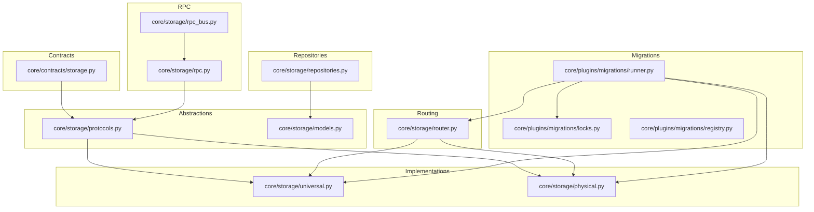
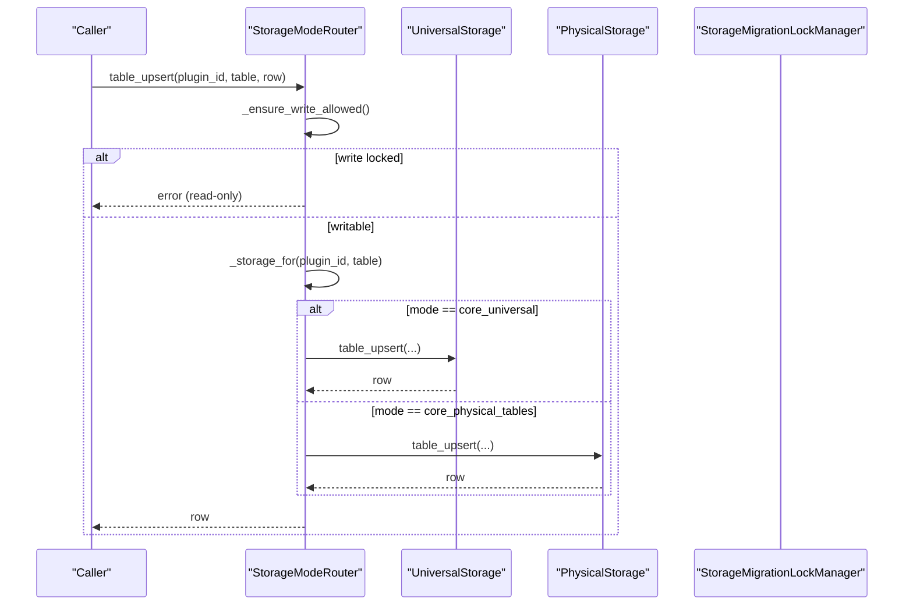
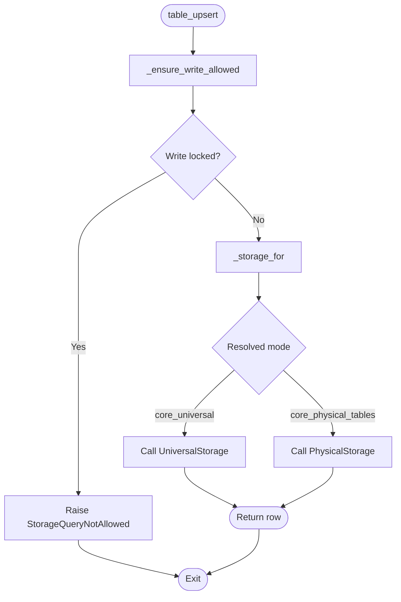
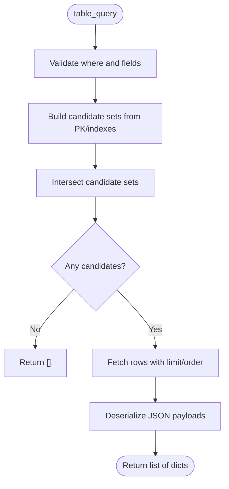
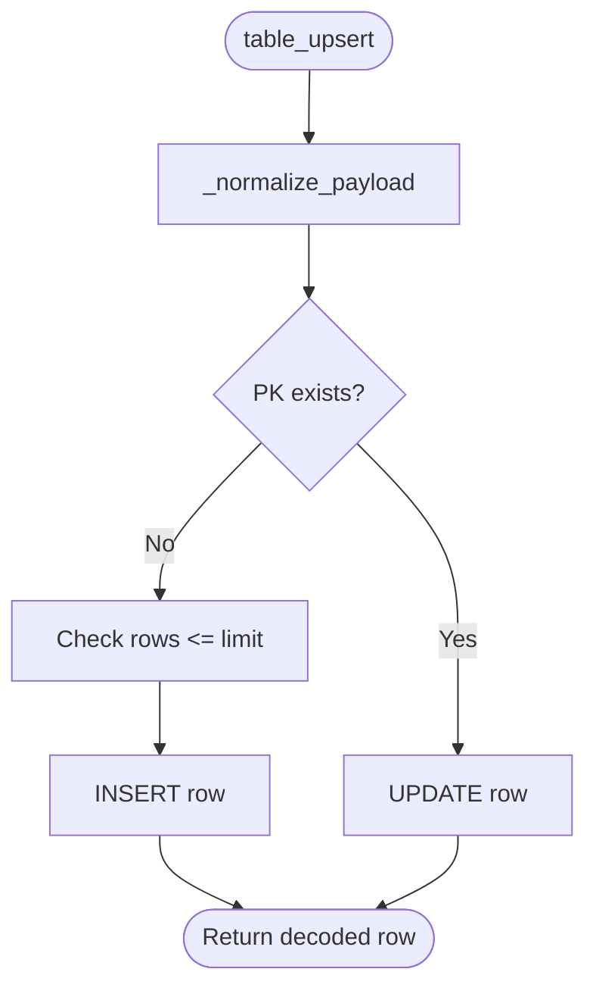
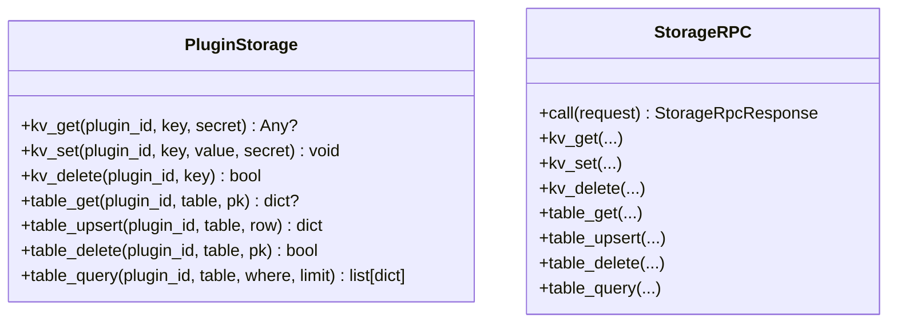
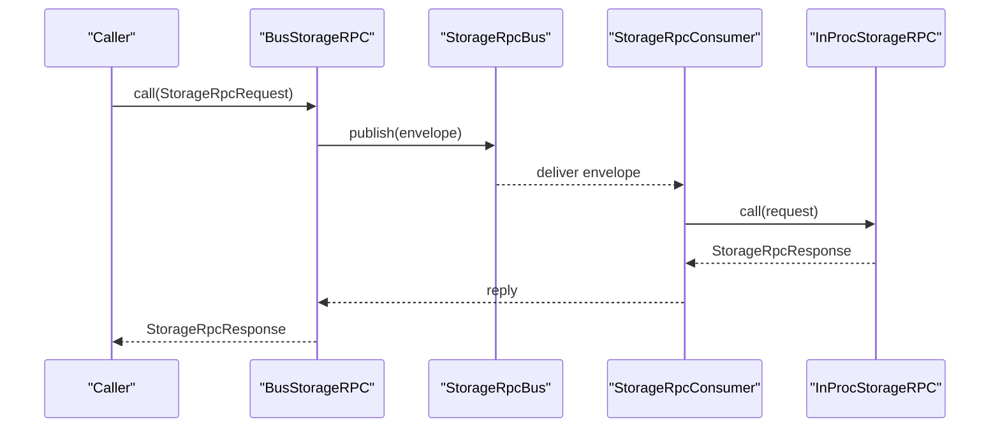
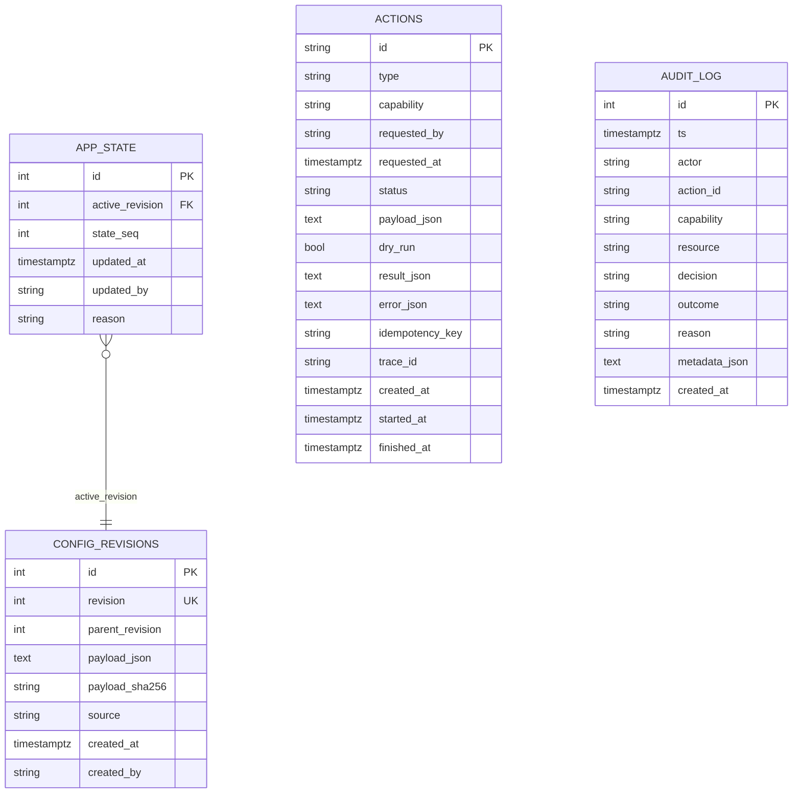
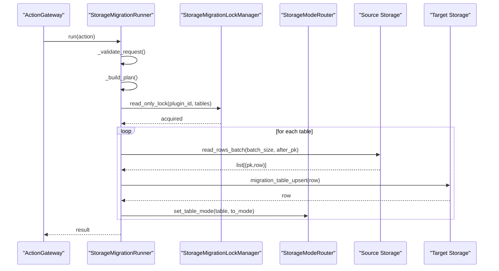
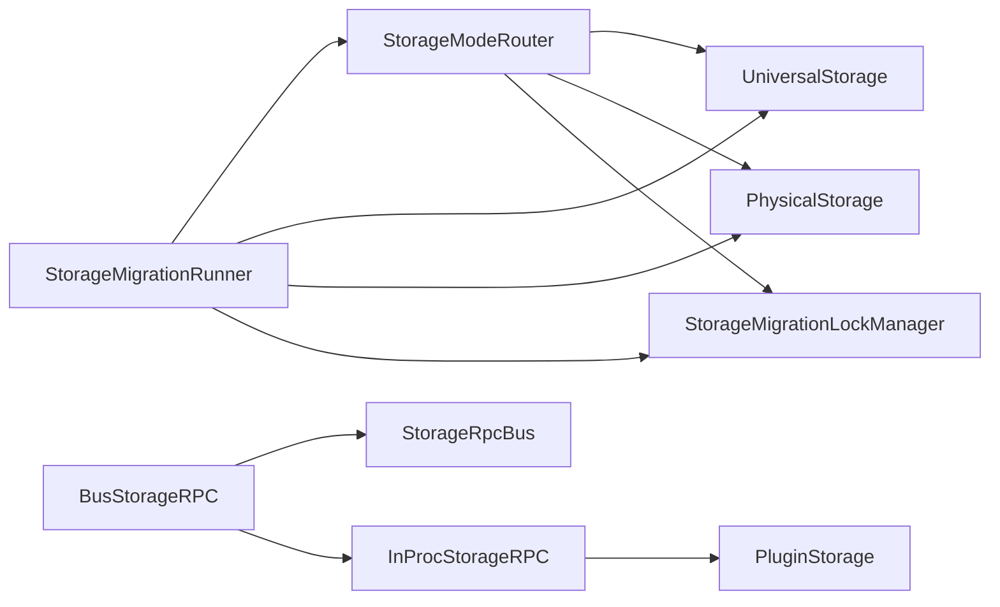

# Storage Layer

<cite>
**Referenced Files in This Document**
- [core/storage/__init__.py](file://core/storage/__init__.py)
- [core/storage/router.py](file://core/storage/router.py)
- [core/storage/universal.py](file://core/storage/universal.py)
- [core/storage/physical.py](file://core/storage/physical.py)
- [core/storage/repositories.py](file://core/storage/repositories.py)
- [core/storage/protocols.py](file://core/storage/protocols.py)
- [core/storage/rpc.py](file://core/storage/rpc.py)
- [core/storage/rpc_bus.py](file://core/storage/rpc_bus.py)
- [core/storage/models.py](file://core/storage/models.py)
- [core/storage/ddl_loader.py](file://core/storage/ddl_loader.py)
- [core/contracts/storage.py](file://core/contracts/storage.py)
- [core/plugins/migrations/locks.py](file://core/plugins/migrations/locks.py)
- [core/plugins/migrations/runner.py](file://core/plugins/migrations/runner.py)
- [core/plugins/migrations/registry.py](file://core/plugins/migrations/registry.py)
</cite>

## Table of Contents
1. [Introduction](#introduction)
2. [Project Structure](#project-structure)
3. [Core Components](#core-components)
4. [Architecture Overview](#architecture-overview)
5. [Detailed Component Analysis](#detailed-component-analysis)
6. [Dependency Analysis](#dependency-analysis)
7. [Performance Considerations](#performance-considerations)
8. [Troubleshooting Guide](#troubleshooting-guide)
9. [Conclusion](#conclusion)
10. [Appendices](#appendices)

## Introduction
This document explains the storage abstraction layer that supports a dual-storage mode architecture. It covers:
- Dual modes: universal (logical, schemaless) and physical (schema-backed relational tables)
- Mode routing and runtime overrides
- Abstraction contracts and repository implementations
- Migration strategies, lock management, and safe transition patterns
- Query optimization techniques and consistency guarantees
- Practical operation examples and performance guidance

## Project Structure
The storage layer is organized around contracts, implementations, routing, RPC, migrations, and repositories:
- Contracts define storage configuration, limits, DDL, and RPC schemas
- Implementations provide universal and physical storage engines
- Router selects the appropriate backend per plugin and table
- RPC enables in-process and inter-service storage calls
- Repositories encapsulate domain-specific persistence logic
- Migration subsystem ensures safe transitions with locking and batch copy

**Diagram sources**
- [core/contracts/storage.py:1-192](file://core/contracts/storage.py#L1-L192)
- [core/storage/protocols.py:1-58](file://core/storage/protocols.py#L1-L58)
- [core/storage/models.py:1-149](file://core/storage/models.py#L1-L149)
- [core/storage/universal.py:1-500](file://core/storage/universal.py#L1-L500)
- [core/storage/physical.py:1-782](file://core/storage/physical.py#L1-L782)
- [core/storage/router.py:1-120](file://core/storage/router.py#L1-L120)
- [core/storage/rpc.py:1-500](file://core/storage/rpc.py#L1-L500)
- [core/storage/rpc_bus.py:1-40](file://core/storage/rpc_bus.py#L1-L40)
- [core/storage/repositories.py:1-304](file://core/storage/repositories.py#L1-L304)
- [core/plugins/migrations/locks.py:1-41](file://core/plugins/migrations/locks.py#L1-L41)
- [core/plugins/migrations/runner.py:1-382](file://core/plugins/migrations/runner.py#L1-L382)
- [core/plugins/migrations/registry.py:1-50](file://core/plugins/migrations/registry.py#L1-L50)

**Section sources**
- [core/storage/__init__.py:1-71](file://core/storage/__init__.py#L1-L71)

## Core Components
- Storage contracts: define plugin storage configuration, limits, table specs, DDL specs, and RPC schemas
- Abstraction protocols: PluginStorage and StorageRPC define the interface for KV and table operations
- Implementations:
  - UniversalStorage: logical schemaless storage with JSON payloads and secondary indexing
  - PhysicalStorage: schema-backed relational tables with DDL enforcement and type safety
- Router: resolves storage backend per plugin/table and enforces write locks during migration
- RPC: in-process and bus-based invocation for storage operations
- Repositories: domain repositories for actions, audit logs, and configuration revisions
- Migrations: safe transition runner with read-only locks and batch copy

**Section sources**
- [core/contracts/storage.py:10-192](file://core/contracts/storage.py#L10-L192)
- [core/storage/protocols.py:9-58](file://core/storage/protocols.py#L9-L58)
- [core/storage/universal.py:85-500](file://core/storage/universal.py#L85-L500)
- [core/storage/physical.py:288-782](file://core/storage/physical.py#L288-L782)
- [core/storage/router.py:13-120](file://core/storage/router.py#L13-L120)
- [core/storage/rpc.py:65-500](file://core/storage/rpc.py#L65-L500)
- [core/storage/repositories.py:55-304](file://core/storage/repositories.py#L55-L304)
- [core/plugins/migrations/locks.py:8-41](file://core/plugins/migrations/locks.py#L8-L41)
- [core/plugins/migrations/runner.py:42-382](file://core/plugins/migrations/runner.py#L42-L382)

## Architecture Overview
The dual-storage architecture routes operations to either universal or physical storage based on plugin configuration and runtime overrides. During migrations, a read-only lock prevents writes to specific tables while data is copied to the target backend.

**Diagram sources**
- [core/storage/router.py:94-117](file://core/storage/router.py#L94-L117)
- [core/storage/universal.py:189-297](file://core/storage/universal.py#L189-L297)
- [core/storage/physical.py:416-474](file://core/storage/physical.py#L416-L474)
- [core/plugins/migrations/locks.py:35-38](file://core/plugins/migrations/locks.py#L35-L38)

## Detailed Component Analysis

### Storage Mode Router
Responsibilities:
- Resolve storage backend per plugin and table
- Enforce write restrictions during migration via lock manager
- Allow per-table mode overrides for gradual migration
- Validate plugin configuration and supported modes

Key behaviors:
- get_table_mode considers per-table overrides and plugin defaults
- set_table_mode validates and applies overrides
- _ensure_write_allowed blocks writes when a table is under migration lock

**Diagram sources**
- [core/storage/router.py:45-117](file://core/storage/router.py#L45-L117)

**Section sources**
- [core/storage/router.py:13-120](file://core/storage/router.py#L13-L120)

### Universal Storage Engine
Capabilities:
- KV operations with secret flag and byte limits
- Table upsert with canonical JSON serialization and row/index validation
- Query by primary key or indexed fields with intersection of candidate sets
- Batch read and row counting
- Rate limiting and per-plugin limits enforced

Optimization highlights:
- Candidate set intersection for multi-field queries
- Canonical JSON normalization and byte accounting
- Index rows maintained for fast lookup

**Diagram sources**
- [core/storage/universal.py:326-398](file://core/storage/universal.py#L326-L398)

**Section sources**
- [core/storage/universal.py:85-500](file://core/storage/universal.py#L85-L500)

### Physical Storage Engine
Capabilities:
- Schema-backed tables with strict DDL validation and type enforcement
- Upsert with payload normalization and batch read
- Query with equality filters on primary key and declared indexes
- Automatic DDL installation/upgrades guarded by a safe engine
- Per-plugin migration readiness and table caching

Safety and optimization:
- SafeDdlEngine enforces non-destructive changes and creates missing indexes
- Type normalization and timezone-aware datetime handling
- Table cache avoids repeated reflection overhead

**Diagram sources**
- [core/storage/physical.py:432-474](file://core/storage/physical.py#L432-L474)

**Section sources**
- [core/storage/physical.py:288-782](file://core/storage/physical.py#L288-L782)

### Storage Contracts and Protocols
Contracts define:
- Storage limits, table specs, and DDL specs
- Plugin storage configuration with mode selection
- RPC request/response envelopes and operations

Protocols define:
- PluginStorage interface for KV and table operations
- StorageRPC interface for invocation and dispatch

**Diagram sources**
- [core/storage/protocols.py:9-58](file://core/storage/protocols.py#L9-L58)
- [core/contracts/storage.py:108-192](file://core/contracts/storage.py#L108-L192)

**Section sources**
- [core/contracts/storage.py:10-192](file://core/contracts/storage.py#L10-L192)
- [core/storage/protocols.py:9-58](file://core/storage/protocols.py#L9-L58)

### RPC and Bus Integration
Two RPC implementations:
- InProcStorageRPC: synchronous dispatch to a PluginStorage instance
- BusStorageRPC: asynchronous messaging over StorageRpcBus with correlation and timeouts

**Diagram sources**
- [core/storage/rpc.py:246-393](file://core/storage/rpc.py#L246-L393)
- [core/storage/rpc_bus.py:8-40](file://core/storage/rpc_bus.py#L8-L40)
- [core/storage/rpc.py:395-458](file://core/storage/rpc.py#L395-L458)

**Section sources**
- [core/storage/rpc.py:65-500](file://core/storage/rpc.py#L65-L500)
- [core/storage/rpc_bus.py:8-40](file://core/storage/rpc_bus.py#L8-L40)

### Repositories and Domain Models
Domain repositories encapsulate:
- ConfigRepository: active state and revision lifecycle
- ActionRepository: queued actions, status updates, history
- AuditRepository: audit log entries

Models define relational schemas for persistence.

**Diagram sources**
- [core/storage/models.py:14-149](file://core/storage/models.py#L14-L149)
- [core/storage/repositories.py:55-304](file://core/storage/repositories.py#L55-L304)

**Section sources**
- [core/storage/models.py:14-149](file://core/storage/models.py#L14-L149)
- [core/storage/repositories.py:55-304](file://core/storage/repositories.py#L55-L304)

### Migration Runner and Lock Management
Migration runner coordinates:
- Plan building (row counts per table)
- Batch copy from source to target mode
- Runtime mode switch per table
- Event emission for progress and completion

Lock manager:
- Provides read-only lock for selected tables during migration
- Prevents writes while data is being copied

**Diagram sources**
- [core/plugins/migrations/runner.py:58-127](file://core/plugins/migrations/runner.py#L58-L127)
- [core/plugins/migrations/locks.py:13-38](file://core/plugins/migrations/locks.py#L13-L38)
- [core/storage/router.py:66-92](file://core/storage/router.py#L66-L92)

**Section sources**
- [core/plugins/migrations/runner.py:42-382](file://core/plugins/migrations/runner.py#L42-L382)
- [core/plugins/migrations/locks.py:8-41](file://core/plugins/migrations/locks.py#L8-L41)
- [core/plugins/migrations/registry.py:15-50](file://core/plugins/migrations/registry.py#L15-L50)

## Dependency Analysis
- Router depends on plugin configs and lock manager; delegates to implementations
- Implementations depend on SQLAlchemy async sessions and DDL specs for physical mode
- RPC consumers depend on bus and storage dispatcher
- Repositories depend on SQLAlchemy ORM models
- Migration runner orchestrates router, storages, and lock manager

**Diagram sources**
- [core/storage/router.py:13-120](file://core/storage/router.py#L13-L120)
- [core/plugins/migrations/runner.py:42-127](file://core/plugins/migrations/runner.py#L42-L127)
- [core/storage/rpc.py:246-393](file://core/storage/rpc.py#L246-L393)
- [core/storage/rpc_bus.py:8-40](file://core/storage/rpc_bus.py#L8-L40)
- [core/storage/protocols.py:9-58](file://core/storage/protocols.py#L9-L58)

**Section sources**
- [core/storage/router.py:13-120](file://core/storage/router.py#L13-L120)
- [core/plugins/migrations/runner.py:42-127](file://core/plugins/migrations/runner.py#L42-L127)
- [core/storage/rpc.py:246-393](file://core/storage/rpc.py#L246-L393)
- [core/storage/rpc_bus.py:8-40](file://core/storage/rpc_bus.py#L8-L40)
- [core/storage/protocols.py:9-58](file://core/storage/protocols.py#L9-L58)

## Performance Considerations
- Universal storage
  - Query optimization uses candidate set intersection for multi-field filters
  - Canonical JSON normalization and byte accounting prevent oversized rows
  - Index rows enable efficient lookups; avoid non-indexed filters
- Physical storage
  - Strict type normalization and timezone handling reduce conversion overhead
  - Table cache minimizes reflection cost; invalidated on DDL changes
  - DDL engine serializes schema changes to avoid contention
- RPC
  - Bus-based RPC adds latency; use in-process RPC for local calls
  - Timeouts and correlation ids ensure reliable request-response
- Limits and rate limiting
  - Enforced per-plugin QPS and row/KV size limits protect resources
  - Query limit clamping prevents unbounded scans

[No sources needed since this section provides general guidance]

## Troubleshooting Guide
Common issues and resolutions:
- Unsupported storage mode or table
  - Ensure plugin configuration mode matches requested operation
  - Verify table specs and indexes align with queries
- Write denied during migration
  - Migration lock prevents writes; wait until lock is released
  - Confirm read-only lock scope includes the affected tables
- DDL errors
  - Non-destructive changes only; add columns, not drop
  - Primary key additions to existing tables are disallowed
- Rate limit exceeded
  - Reduce QPS or batch operations
  - Respect per-operation limits for KV and rows
- RPC timeouts
  - Increase timeout or use in-process RPC for local calls
  - Check bus connectivity and consumer readiness

**Section sources**
- [core/storage/router.py:109-117](file://core/storage/router.py#L109-L117)
- [core/storage/physical.py:212-232](file://core/storage/physical.py#L212-L232)
- [core/storage/rpc.py:273-277](file://core/storage/rpc.py#L273-L277)

## Conclusion
The storage layer provides a robust, extensible dual-mode architecture with strong contracts, safe migration controls, and performance-conscious implementations. The router and lock manager coordinate transitions, while repositories and RPC offer clean integration points for higher-level services.

[No sources needed since this section summarizes without analyzing specific files]

## Appendices

### Practical Operation Examples
- Universal table query
  - Use table_query with primary key or indexed fields
  - Combine multiple indexed fields for filtered results
- Physical table upsert
  - Provide complete payload with required fields
  - Respect type constraints and nullability
- Migration plan and execution
  - Build plan via row counts per table
  - Copy in batches; switch mode per table upon completion

**Section sources**
- [core/storage/universal.py:326-398](file://core/storage/universal.py#L326-L398)
- [core/storage/physical.py:416-474](file://core/storage/physical.py#L416-L474)
- [core/plugins/migrations/runner.py:215-274](file://core/plugins/migrations/runner.py#L215-L274)

### Data Consistency Guarantees
- Transactions
  - Upserts and deletes occur within transaction boundaries
- Index integrity (universal)
  - Index rows are rebuilt on upsert to maintain consistency
- Migration consistency
  - Read-only lock prevents concurrent writes during copy
  - Mode switch occurs after successful copy per table

**Section sources**
- [core/storage/universal.py:232-297](file://core/storage/universal.py#L232-L297)
- [core/storage/physical.py:459-474](file://core/storage/physical.py#L459-L474)
- [core/plugins/migrations/runner.py:93-112](file://core/plugins/migrations/runner.py#L93-L112)