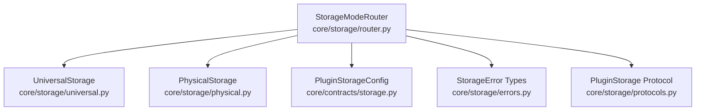
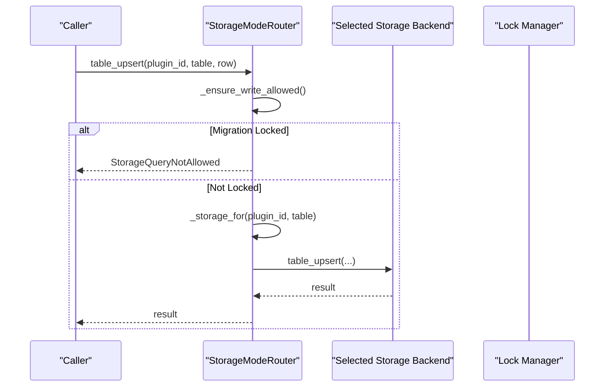
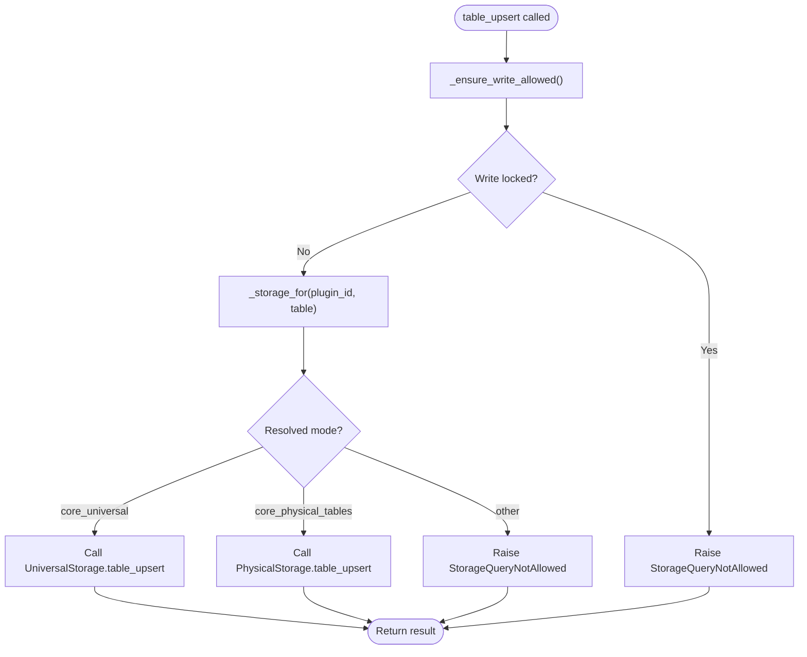
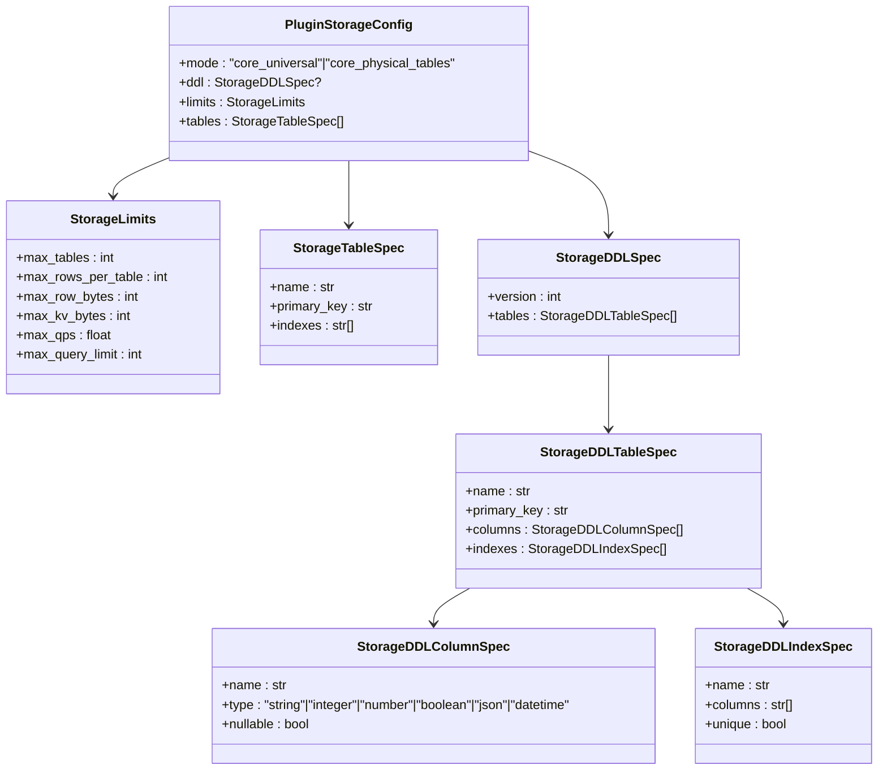
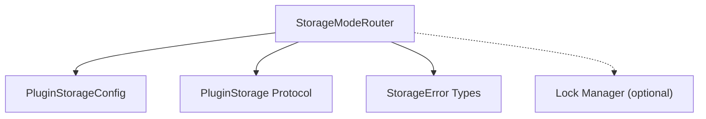

# Storage Mode Router

<cite>
**Referenced Files in This Document**
- [router.py](file://core/storage/router.py)
- [universal.py](file://core/storage/universal.py)
- [physical.py](file://core/storage/physical.py)
- [storage.py](file://core/contracts/storage.py)
- [errors.py](file://core/storage/errors.py)
- [protocols.py](file://core/storage/protocols.py)
- [models.py](file://core/storage/models.py)
- [ddl_loader.py](file://core/storage/ddl_loader.py)
- [tables.yaml](file://contracts/storage/tables.yaml)
</cite>

## Table of Contents
1. [Introduction](#introduction)
2. [Project Structure](#project-structure)
3. [Core Components](#core-components)
4. [Architecture Overview](#architecture-overview)
5. [Detailed Component Analysis](#detailed-component-analysis)
6. [Dependency Analysis](#dependency-analysis)
7. [Performance Considerations](#performance-considerations)
8. [Troubleshooting Guide](#troubleshooting-guide)
9. [Conclusion](#conclusion)

## Introduction
This document provides comprehensive technical documentation for the StorageModeRouter component, which implements dual-storage mode routing between a universal storage backend and a physical storage backend. It explains the mode resolution algorithm, table-level overrides, write lock enforcement mechanisms, plugin storage configuration system, thread-safe operations, and storage mode switching capabilities. Practical examples demonstrate configuring storage modes per plugin, handling write operations during migration, and managing table-specific storage preferences. Error handling for unsupported modes and missing plugin configurations is also covered.

## Project Structure
The StorageModeRouter resides in the core storage subsystem and orchestrates access to two distinct storage implementations:
- Universal storage: a normalized, schema-agnostic storage with dynamic table schemas and indexing.
- Physical storage: a database-backed storage with strict DDL-defined schemas and indexes.

**Diagram sources**
- [router.py:13-120](file://core/storage/router.py#L13-L120)
- [universal.py:85-500](file://core/storage/universal.py#L85-L500)
- [physical.py:288-782](file://core/storage/physical.py#L288-L782)
- [storage.py:108-146](file://core/contracts/storage.py#L108-L146)
- [errors.py:4-40](file://core/storage/errors.py#L4-L40)
- [protocols.py:9-58](file://core/storage/protocols.py#L9-L58)

**Section sources**
- [router.py:13-120](file://core/storage/router.py#L13-L120)
- [universal.py:85-500](file://core/storage/universal.py#L85-L500)
- [physical.py:288-782](file://core/storage/physical.py#L288-L782)
- [storage.py:108-146](file://core/contracts/storage.py#L108-L146)
- [errors.py:4-40](file://core/storage/errors.py#L4-L40)
- [protocols.py:9-58](file://core/storage/protocols.py#L9-L58)

## Core Components
- StorageModeRouter: Central orchestrator that selects the appropriate storage backend based on plugin configuration and table-level overrides, enforces write locks, and exposes unified storage operations.
- UniversalStorage: Schema-agnostic storage with JSON payloads, dynamic indexing, and rate limiting.
- PhysicalStorage: Database-backed storage with DDL-defined schemas, strict type validation, and migration support.
- PluginStorageConfig: Pydantic model defining storage mode, DDL specs, limits, and table specifications.
- PluginStorage protocol: Defines the interface for storage backends.
- StorageError types: Standardized exceptions for storage-related failures.

**Section sources**
- [router.py:13-120](file://core/storage/router.py#L13-L120)
- [universal.py:85-500](file://core/storage/universal.py#L85-L500)
- [physical.py:288-782](file://core/storage/physical.py#L288-L782)
- [storage.py:108-146](file://core/contracts/storage.py#L108-L146)
- [protocols.py:9-58](file://core/storage/protocols.py#L9-L58)
- [errors.py:4-40](file://core/storage/errors.py#L4-L40)

## Architecture Overview
The StorageModeRouter delegates operations to either UniversalStorage or PhysicalStorage based on resolved mode. Modes are derived from plugin configuration with optional table-level overrides. Write operations are gated by a lock manager to prevent writes during migration.

**Diagram sources**
- [router.py:45-53](file://core/storage/router.py#L45-L53)
- [router.py:109-117](file://core/storage/router.py#L109-L117)
- [router.py:94-107](file://core/storage/router.py#L94-L107)

**Section sources**
- [router.py:45-53](file://core/storage/router.py#L45-L53)
- [router.py:109-117](file://core/storage/router.py#L109-L117)
- [router.py:94-107](file://core/storage/router.py#L94-L107)

## Detailed Component Analysis

### StorageModeRouter
Implements dual-storage routing with:
- Mode resolution: Uses plugin configuration mode by default; falls back to table-level overrides if set.
- Thread-safety: Guards table-mode overrides with an internal lock.
- Write enforcement: Checks migration lock before write operations.
- Operation delegation: Routes KV and table operations to the selected backend.

Key behaviors:
- Mode resolution algorithm:
  - If table is None, resolves to plugin config mode.
  - Otherwise, checks table-level override; if present, uses override; otherwise, uses plugin config mode.
- Table-level overrides:
  - set_table_mode validates supported modes and stores override under (plugin_id, table) key.
  - clear_table_mode_override removes an override.
  - get_table_mode returns override if present, else plugin config mode.
- Write lock enforcement:
  - _ensure_write_allowed checks lock manager for write lock on plugin/table.
  - Denies write operations with StorageQueryNotAllowed if locked.
- Backend selection:
  - _storage_for selects UniversalStorage for "core_universal".
  - Selects PhysicalStorage for "core_physical_tables".
  - Raises StorageQueryNotAllowed for unsupported resolved modes.

**Diagram sources**
- [router.py:45-53](file://core/storage/router.py#L45-L53)
- [router.py:109-117](file://core/storage/router.py#L109-L117)
- [router.py:94-107](file://core/storage/router.py#L94-L107)

**Section sources**
- [router.py:13-120](file://core/storage/router.py#L13-L120)

### UniversalStorage
Provides schema-agnostic storage with:
- JSON serialization for values and rows.
- Dynamic indexing via auxiliary index table.
- Rate limiting and configurable limits.
- Table operations with primary key and index-based queries.

Highlights:
- KV operations enforce max_kv_bytes limit.
- Table upsert validates presence of primary key and enforces max_row_bytes and max_rows_per_table.
- Query validation ensures only allowed fields and scalar equality predicates.
- Index rebuild on upsert for declared indexes.

**Section sources**
- [universal.py:85-500](file://core/storage/universal.py#L85-L500)

### PhysicalStorage
Provides database-backed storage with:
- Strict DDL-defined schemas and indexes.
- Type validation and normalization for each column type.
- Migration support via SafeDdlEngine.
- Table caching and lazy materialization.

Highlights:
- DDL validation prevents destructive changes and enforces primary key constraints.
- Normalization handles type conversions and timezone-aware datetimes.
- Query validation mirrors allowed fields and scalar equality.
- Migration readiness ensures tables exist before operations.

**Section sources**
- [physical.py:288-782](file://core/storage/physical.py#L288-L782)

### PluginStorageConfig and Configuration System
Defines storage configuration per plugin:
- mode: Either "core_universal" or "core_physical_tables".
- ddl: Required for physical mode; defines tables, columns, primary keys, and indexes.
- limits: Enforces quotas for tables, rows, bytes, QPS, and query limits.
- tables: Declares logical tables with primary keys and indexes.

Validation rules:
- For physical mode, DDL must include all declared tables with matching primary keys and indexes.
- For universal mode, DDL is disallowed.
- Duplicate table declarations are rejected.

**Diagram sources**
- [storage.py:108-146](file://core/contracts/storage.py#L108-L146)
- [storage.py:10-17](file://core/contracts/storage.py#L10-L17)
- [storage.py:19-37](file://core/contracts/storage.py#L19-L37)
- [storage.py:94-106](file://core/contracts/storage.py#L94-L106)
- [storage.py:42-52](file://core/contracts/storage.py#L42-L52)
- [storage.py:68-92](file://core/contracts/storage.py#L68-L92)
- [storage.py:39](file://core/contracts/storage.py#L39)

**Section sources**
- [storage.py:108-146](file://core/contracts/storage.py#L108-L146)
- [storage.py:10-17](file://core/contracts/storage.py#L10-L17)
- [storage.py:19-37](file://core/contracts/storage.py#L19-L37)
- [storage.py:94-106](file://core/contracts/storage.py#L94-L106)
- [storage.py:42-52](file://core/contracts/storage.py#L42-L52)
- [storage.py:68-92](file://core/contracts/storage.py#L68-L92)
- [storage.py:39](file://core/contracts/storage.py#L39)

### DDL Loading and Table Specifications
- DDL bundles are loaded from YAML files and validated into StorageDDLSpec instances.
- Logical table names map to sanitized physical table names with plugin prefixes.
- Index names are generated consistently for safe database deployment.

**Section sources**
- [ddl_loader.py:15-27](file://core/storage/ddl_loader.py#L15-L27)
- [tables.yaml:1-85](file://contracts/storage/tables.yaml#L1-L85)
- [physical.py:82-91](file://core/storage/physical.py#L82-L91)

### Error Handling
Standardized exceptions:
- StorageQueryNotAllowed: Used for unsupported modes, missing configs, invalid predicates, and write lock violations.
- StorageLimitExceeded: Enforced by both backends for row/kv size and counts.
- StorageRateLimited: Enforced by rate limiters in both backends.
- StorageDdlNotAllowed: Prevents destructive DDL changes and invalid identifiers.

**Section sources**
- [errors.py:4-40](file://core/storage/errors.py#L4-L40)
- [router.py:68-69](file://core/storage/router.py#L68-L69)
- [router.py:85-86](file://core/storage/router.py#L85-L86)
- [router.py:113-116](file://core/storage/router.py#L113-L116)

## Dependency Analysis
StorageModeRouter depends on:
- PluginStorageConfig for mode and limits.
- PluginStorage protocol for backend abstraction.
- StorageError types for consistent error signaling.
- Optional lock manager for write enforcement.

**Diagram sources**
- [router.py:13-120](file://core/storage/router.py#L13-L120)
- [storage.py:108-146](file://core/contracts/storage.py#L108-L146)
- [protocols.py:9-58](file://core/storage/protocols.py#L9-L58)
- [errors.py:4-40](file://core/storage/errors.py#L4-L40)

**Section sources**
- [router.py:13-120](file://core/storage/router.py#L13-L120)
- [storage.py:108-146](file://core/contracts/storage.py#L108-L146)
- [protocols.py:9-58](file://core/storage/protocols.py#L9-L58)
- [errors.py:4-40](file://core/storage/errors.py#L4-L40)

## Performance Considerations
- UniversalStorage:
  - Rate limiter per plugin and operation.
  - JSON serialization overhead; consider payload sizes against max_kv_bytes and max_row_bytes.
  - Index rebuild on upsert; minimize unnecessary updates to reduce index maintenance.
- PhysicalStorage:
  - DDL validation prevents expensive or unsafe migrations.
  - Type normalization and timezone handling add CPU overhead; ensure payloads conform to declared types.
  - Table caching reduces repeated reflection; clearing cache triggers re-materialization.
- Router:
  - Thread-safe override map guarded by a lock; keep override operations minimal and infrequent.
  - Write lock enforcement avoids contention during migration but blocks all writes for the affected table.

[No sources needed since this section provides general guidance]

## Troubleshooting Guide
Common issues and resolutions:
- Unsupported storage mode:
  - Symptom: StorageQueryNotAllowed with unsupported mode.
  - Resolution: Ensure mode is one of the supported literal values.
  - Reference: [router.py:68-69](file://core/storage/router.py#L68-L69)
- Missing plugin configuration:
  - Symptom: StorageQueryNotAllowed indicating undefined storage config.
  - Resolution: Provide PluginStorageConfig for the plugin ID.
  - Reference: [router.py:85-86](file://core/storage/router.py#L85-L86), [storage.py:108-146](file://core/contracts/storage.py#L108-L146)
- Write operation denied during migration:
  - Symptom: StorageQueryNotAllowed stating table is read-only during migration.
  - Resolution: Wait until migration completes or avoid write operations; clear table override if applicable.
  - Reference: [router.py:113-116](file://core/storage/router.py#L113-L116)
- DDL constraint violations:
  - Symptom: StorageDdlNotAllowed for destructive changes or invalid identifiers.
  - Resolution: Align DDL with declared schema; avoid removing columns or adding primary keys to existing tables.
  - Reference: [physical.py:218-230](file://core/storage/physical.py#L218-L230), [physical.py:72-79](file://core/storage/physical.py#L72-L79)
- Payload type mismatches:
  - Symptom: StorageQueryNotAllowed for unsupported types or null constraints.
  - Resolution: Match declared column types and nullability; normalize datetime strings to ISO-8601 with timezone.
  - Reference: [physical.py:660-712](file://core/storage/physical.py#L660-L712)

**Section sources**
- [router.py:68-69](file://core/storage/router.py#L68-L69)
- [router.py:85-86](file://core/storage/router.py#L85-L86)
- [router.py:113-116](file://core/storage/router.py#L113-L116)
- [physical.py:218-230](file://core/storage/physical.py#L218-L230)
- [physical.py:72-79](file://core/storage/physical.py#L72-L79)
- [physical.py:660-712](file://core/storage/physical.py#L660-L712)

## Conclusion
The StorageModeRouter provides a robust, thread-safe mechanism for dual-storage routing with flexible mode resolution, table-level overrides, and write lock enforcement. Together with UniversalStorage and PhysicalStorage, it enables consistent storage operations while enforcing limits, validations, and safe migrations. Proper configuration of PluginStorageConfig and careful handling of write operations during migration ensure reliable operation across environments.