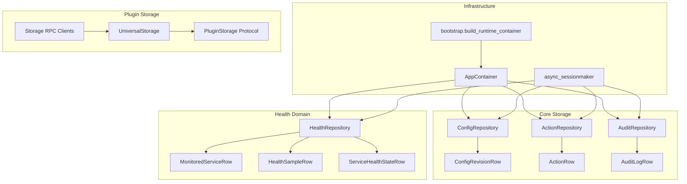
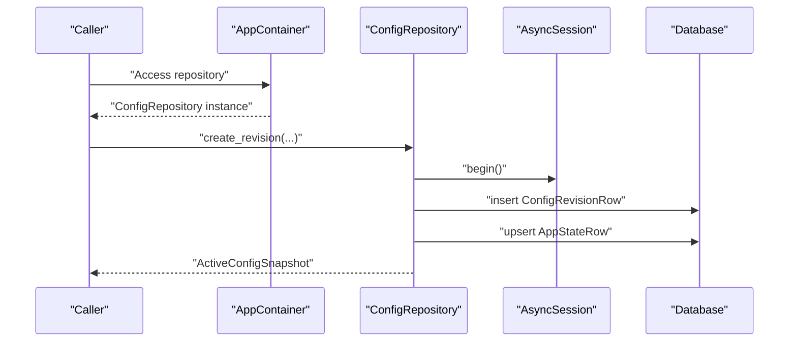
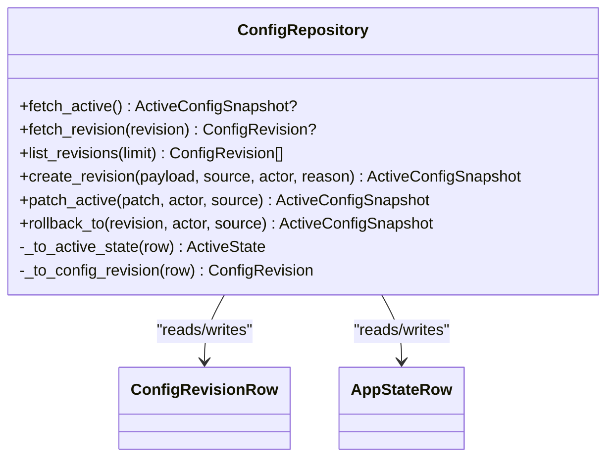
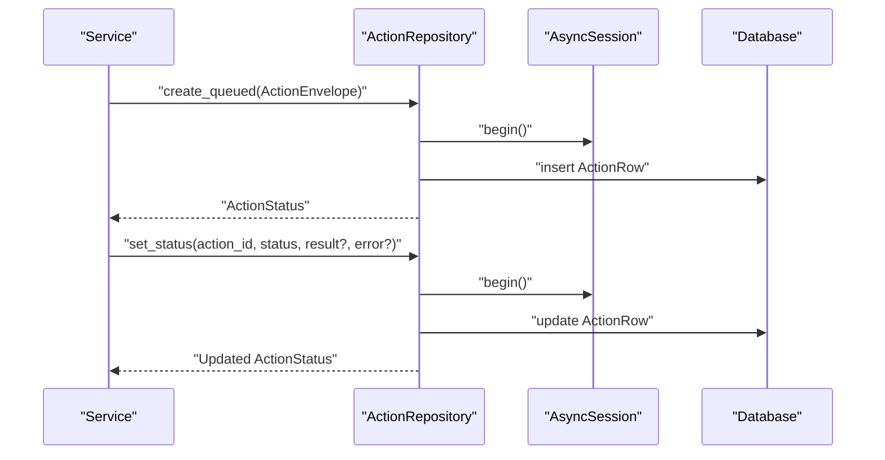
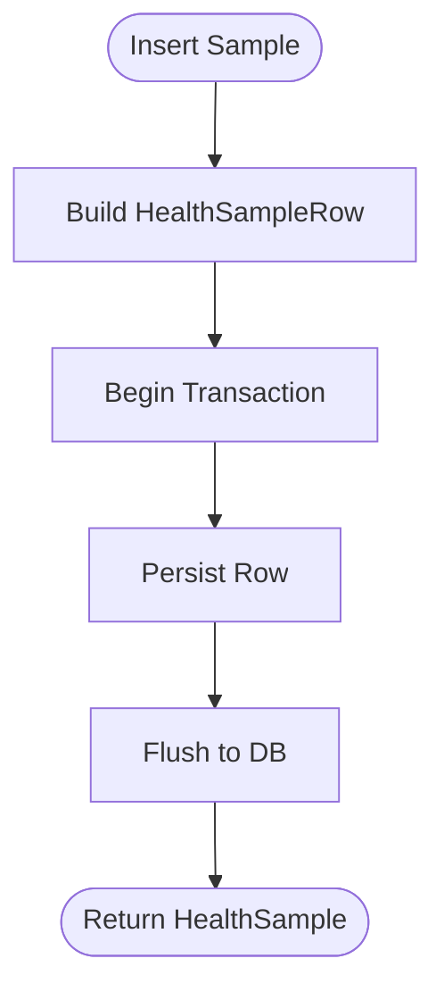
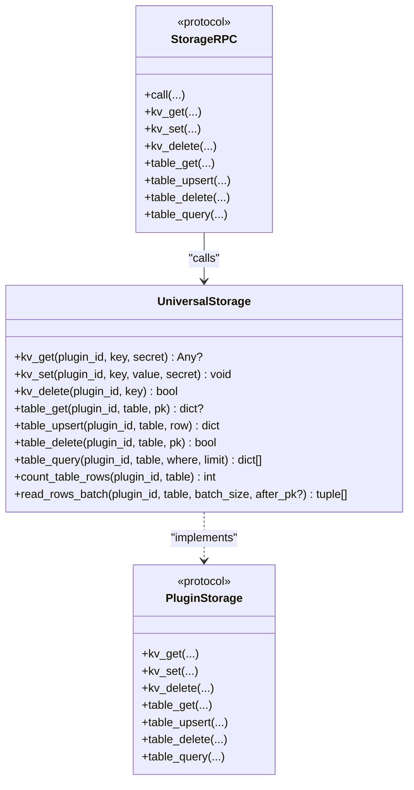
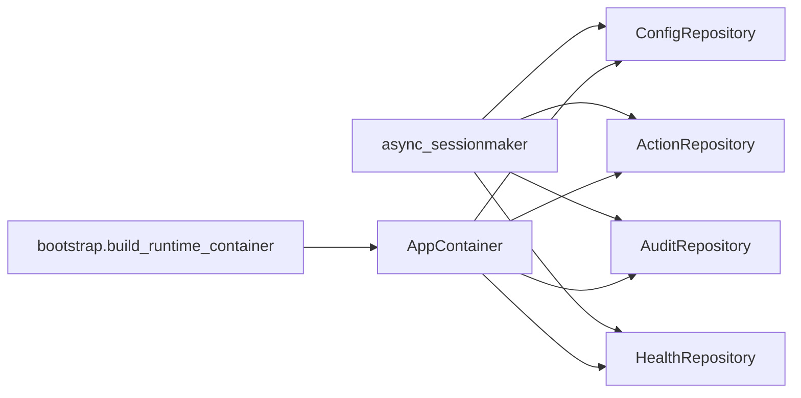

# Storage Repositories

<cite>
**Referenced Files in This Document**
- [repositories.py](file://core/storage/repositories.py)
- [models.py](file://core/storage/models.py)
- [session.py](file://db/session.py)
- [container.py](file://config/container.py)
- [bootstrap.py](file://bootstrap.py)
- [universal.py](file://core/storage/universal.py)
- [protocols.py](file://core/storage/protocols.py)
- [rpc.py](file://core/storage/rpc.py)
- [sqlalchemy.py](file://apps/health/model/sqlalchemy.py)
- [repository.py](file://apps/health/service/repository.py)
- [errors.py](file://core/storage/errors.py)
</cite>

## Table of Contents
1. [Introduction](#introduction)
2. [Project Structure](#project-structure)
3. [Core Components](#core-components)
4. [Architecture Overview](#architecture-overview)
5. [Detailed Component Analysis](#detailed-component-analysis)
6. [Dependency Analysis](#dependency-analysis)
7. [Performance Considerations](#performance-considerations)
8. [Troubleshooting Guide](#troubleshooting-guide)
9. [Conclusion](#conclusion)
10. [Appendices](#appendices)

## Introduction
This document explains the storage repository layer that provides higher-level data access patterns across the backend. It covers the repository pattern implementation, common CRUD operations, query building utilities, relationships between repositories and storage implementations, data transformation layers, and caching strategies. It also documents the repository factory pattern via dependency injection, transaction management, query optimization techniques, and testing strategies for repository components.

## Project Structure
The repository layer spans several modules:
- Core storage repositories: typed repositories for configuration, actions, and audit logs backed by SQLAlchemy ORM models.
- Health domain repositories: a dedicated repository for monitoring services and health samples.
- Storage models: SQLAlchemy declarative base and ORM models for core and plugin storage.
- Session and DI: async SQLAlchemy session factory construction and application-wide dependency injection container.
- Universal storage: a plugin-backed storage abstraction with rate limiting, limits, and query planning.
- RPC and protocols: typed interfaces for plugin storage and inter-service RPC.

**Diagram sources**
- [repositories.py:55-303](file://core/storage/repositories.py#L55-L303)
- [models.py:14-148](file://core/storage/models.py#L14-L148)
- [sqlalchemy.py:23-87](file://apps/health/model/sqlalchemy.py#L23-L87)
- [container.py:252-423](file://config/container.py#L252-L423)
- [bootstrap.py:21-23](file://bootstrap.py#L21-L23)
- [universal.py:85-499](file://core/storage/universal.py#L85-L499)
- [protocols.py:9-55](file://core/storage/protocols.py#L9-L55)
- [rpc.py:65-499](file://core/storage/rpc.py#L65-L499)

**Section sources**
- [repositories.py:55-303](file://core/storage/repositories.py#L55-L303)
- [models.py:14-148](file://core/storage/models.py#L14-L148)
- [sqlalchemy.py:23-87](file://apps/health/model/sqlalchemy.py#L23-L87)
- [container.py:252-423](file://config/container.py#L252-L423)
- [bootstrap.py:21-23](file://bootstrap.py#L21-L23)
- [universal.py:85-499](file://core/storage/universal.py#L85-L499)
- [protocols.py:9-55](file://core/storage/protocols.py#L9-L55)
- [rpc.py:65-499](file://core/storage/rpc.py#L65-L499)

## Core Components
- ConfigRepository: manages configuration revisions and active state, with canonical JSON serialization, SHA-256 hashing, and merge-patch semantics for safe updates.
- ActionRepository: persists queued actions, tracks status transitions, and normalizes payloads to typed statuses.
- AuditRepository: records audit events with canonical JSON metadata and UTC timestamps.
- HealthRepository: CRUD and analytics for monitored services, health samples, and service health state snapshots.
- UniversalStorage: plugin-backed storage abstraction with rate limiting, row/table limits, and efficient query planning using indexes.

Each repository encapsulates:
- Session lifecycle management via async_sessionmaker.
- Transaction boundaries around write operations.
- Data transformation between ORM rows and domain DTOs.
- Query building with SQLAlchemy select statements and joins.

**Section sources**
- [repositories.py:55-303](file://core/storage/repositories.py#L55-L303)
- [models.py:14-148](file://core/storage/models.py#L14-L148)
- [repository.py:29-301](file://apps/health/service/repository.py#L29-L301)
- [universal.py:85-499](file://core/storage/universal.py#L85-L499)

## Architecture Overview
The repository layer sits atop an async SQLAlchemy session factory and exposes typed repositories to application services. The AppContainer constructs repositories and binds them to the session factory. Plugin storage is mediated by UniversalStorage and accessed via typed RPC clients or in-process calls.

**Diagram sources**
- [container.py:271-274](file://config/container.py#L271-L274)
- [repositories.py:91-141](file://core/storage/repositories.py#L91-L141)
- [models.py:14-36](file://core/storage/models.py#L14-L36)

**Section sources**
- [container.py:252-423](file://config/container.py#L252-L423)
- [repositories.py:91-141](file://core/storage/repositories.py#L91-L141)
- [session.py:13-20](file://db/session.py#L13-L20)

## Detailed Component Analysis

### ConfigRepository
Responsibilities:
- Fetch active configuration snapshot and individual revisions.
- List revisions with pagination.
- Create new revisions with canonical JSON and SHA-256 hashing.
- Patch active configuration by applying a merge-patch to the current payload.
- Roll back to a previous revision by recreating it as the active one.

Key implementation patterns:
- Canonical JSON normalization and SHA-256 hashing for payload integrity.
- Merge-patch algorithm to safely apply partial updates.
- Transactions for atomic creation of revision and state updates.
- UTC timestamp normalization for consistency.

**Diagram sources**
- [repositories.py:55-193](file://core/storage/repositories.py#L55-L193)
- [models.py:14-36](file://core/storage/models.py#L14-L36)

**Section sources**
- [repositories.py:59-167](file://core/storage/repositories.py#L59-L167)
- [models.py:14-36](file://core/storage/models.py#L14-L36)

### ActionRepository
Responsibilities:
- Create queued actions with deduplication via idempotency keys.
- Set action status with state machine transitions (queued → running → succeeded/failed/cancelled/blocked).
- Retrieve action history and individual statuses.
- Normalize payloads to typed ActionStatus.

**Diagram sources**
- [repositories.py:195-280](file://core/storage/repositories.py#L195-L280)
- [models.py:38-56](file://core/storage/models.py#L38-L56)

**Section sources**
- [repositories.py:199-250](file://core/storage/repositories.py#L199-L250)
- [models.py:38-56](file://core/storage/models.py#L38-L56)

### AuditRepository
Responsibilities:
- Append audit events with canonical JSON metadata and UTC timestamps.
- Enforces transactional writes for audit trail integrity.

**Section sources**
- [repositories.py:282-300](file://core/storage/repositories.py#L282-L300)
- [models.py:64-83](file://core/storage/models.py#L64-L83)

### HealthRepository
Responsibilities:
- CRUD for MonitoredService with sync from specs.
- Upsert ServiceHealthState snapshots.
- Insert HealthSample entries and list latest samples.
- Compute snapshot items for dashboard views.
- Delete old samples by cutoff timestamp.

**Diagram sources**
- [repository.py:157-168](file://apps/health/service/repository.py#L157-L168)
- [sqlalchemy.py:45-58](file://apps/health/model/sqlalchemy.py#L45-L58)

**Section sources**
- [repository.py:157-260](file://apps/health/service/repository.py#L157-L260)
- [sqlalchemy.py:23-87](file://apps/health/model/sqlalchemy.py#L23-L87)

### UniversalStorage (Plugin Storage Abstraction)
Responsibilities:
- KV operations (get/set/delete) with optional secret flag.
- Table operations (get/upsert/delete/query) with primary key and index enforcement.
- Rate limiting via token bucket and per-operation QPS caps.
- Row/table size and count limits with explicit exceptions.
- Query planning using index intersections for equality predicates.

**Diagram sources**
- [universal.py:85-499](file://core/storage/universal.py#L85-L499)
- [protocols.py:9-55](file://core/storage/protocols.py#L9-L55)
- [rpc.py:65-499](file://core/storage/rpc.py#L65-L499)

**Section sources**
- [universal.py:100-398](file://core/storage/universal.py#L100-L398)
- [protocols.py:9-55](file://core/storage/protocols.py#L9-L55)
- [rpc.py:246-393](file://core/storage/rpc.py#L246-L393)

## Dependency Analysis
Repositories depend on:
- async_sessionmaker for session creation and transaction control.
- SQLAlchemy ORM models for persistence and query construction.
- Typed DTOs for data transformation and API compatibility.

The AppContainer composes repositories and binds them to a shared session factory, enabling centralized lifecycle management and dependency wiring.

**Diagram sources**
- [container.py:252-423](file://config/container.py#L252-L423)
- [bootstrap.py:21-23](file://bootstrap.py#L21-L23)
- [session.py:13-20](file://db/session.py#L13-L20)

**Section sources**
- [container.py:252-423](file://config/container.py#L252-L423)
- [bootstrap.py:21-23](file://bootstrap.py#L21-L23)
- [session.py:13-20](file://db/session.py#L13-L20)

## Performance Considerations
- Use transactions for write-heavy sequences to minimize partial writes and maintain consistency.
- Prefer indexed queries for plugin table operations; equality predicates on indexed fields yield efficient intersections.
- Clamp query limits to protect downstream systems; UniversalStorage enforces max_query_limit.
- Normalize timestamps to UTC to avoid timezone-related sorting anomalies.
- Batch reads for large datasets using read_rows_batch to reduce memory pressure.
- Apply canonical JSON serialization and SHA-256 hashing judiciously; cache computed hashes when appropriate to avoid recomputation.

[No sources needed since this section provides general guidance]

## Troubleshooting Guide
Common issues and resolutions:
- StorageLimitExceeded: Reduce row/kv sizes or enable migration upsert bypass for controlled scenarios.
- StorageQueryNotAllowed: Ensure predicates match allowed fields and are scalar equality; verify table specs.
- StorageRateLimited: Back off and retry; adjust QPS caps or distribute load across plugins.
- StorageRpcTimeout: Increase timeout or ensure RPC consumer is running; validate queue readiness.
- Merge-patch failures: Ensure patch results remain dict-like; validate payload integrity.

**Section sources**
- [errors.py:4-39](file://core/storage/errors.py#L4-L39)
- [universal.py:100-150](file://core/storage/universal.py#L100-L150)
- [rpc.py:258-286](file://core/storage/rpc.py#L258-L286)

## Conclusion
The repository layer provides a clean separation between domain logic and persistence, with strong typing, transactional guarantees, and robust query utilities. Repositories integrate seamlessly with dependency injection, while plugin storage offers scalable, rate-limited, and limit-enforced operations. Proper use of transactions, indexing, and canonical serialization ensures correctness and performance.

[No sources needed since this section summarizes without analyzing specific files]

## Appendices

### Repository Usage Examples
- Configuration: create a new revision, patch active config, or roll back to a prior revision.
- Actions: enqueue an action, track progress, and retrieve history.
- Audit: record audit events with metadata.
- Health: manage services, insert samples, compute snapshots, and prune old data.
- Plugin Storage: perform KV and table operations with enforced limits and rate control.

**Section sources**
- [repositories.py:91-167](file://core/storage/repositories.py#L91-L167)
- [repository.py:56-260](file://apps/health/service/repository.py#L56-L260)
- [universal.py:100-398](file://core/storage/universal.py#L100-L398)

### Transaction Management
- Write operations wrap a begin() block to ensure atomicity.
- Status transitions update timestamps and payloads atomically.
- Upserts and deletes coordinate secondary index cleanup.

**Section sources**
- [repositories.py:103-141](file://core/storage/repositories.py#L103-L141)
- [repository.py:139-155](file://apps/health/service/repository.py#L139-L155)

### Query Optimization Techniques
- Use indexed fields for equality predicates in table_query.
- Clamp limits to prevent excessive scans.
- Prefer batched reads for large datasets.
- Normalize timestamps to UTC for consistent ordering.

**Section sources**
- [universal.py:326-398](file://core/storage/universal.py#L326-L398)
- [models.py:57-87](file://core/storage/models.py#L57-L87)

### Testing Strategies
- Unit tests for repositories should mock async_sessionmaker and assert SQL statements and transformations.
- Use factories to generate test DTOs and ORM rows.
- Validate transaction boundaries with assertions on commit/rollback behavior.
- For plugin storage, simulate rate limiter and limit conditions to exercise error paths.

[No sources needed since this section provides general guidance]