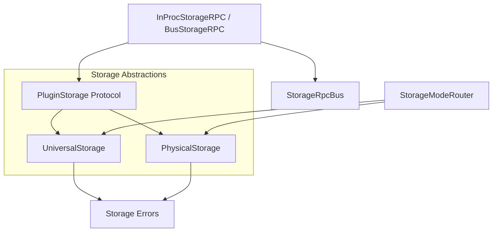
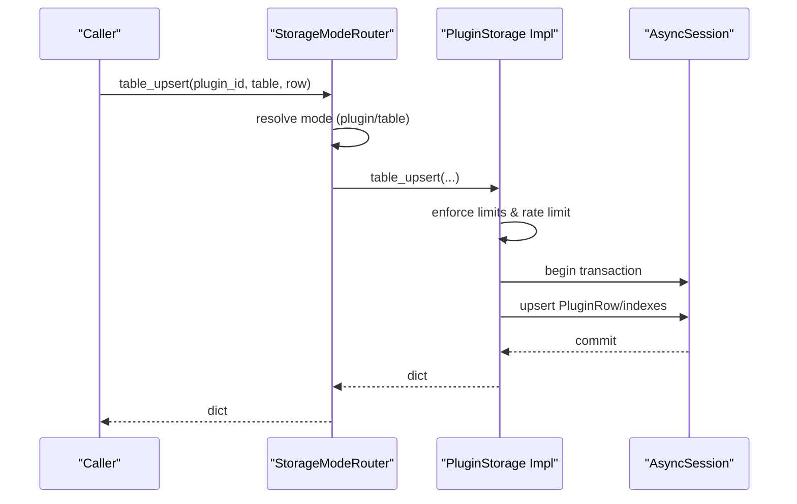
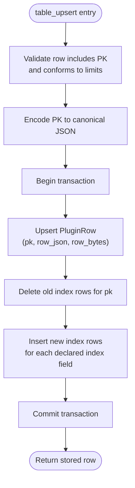
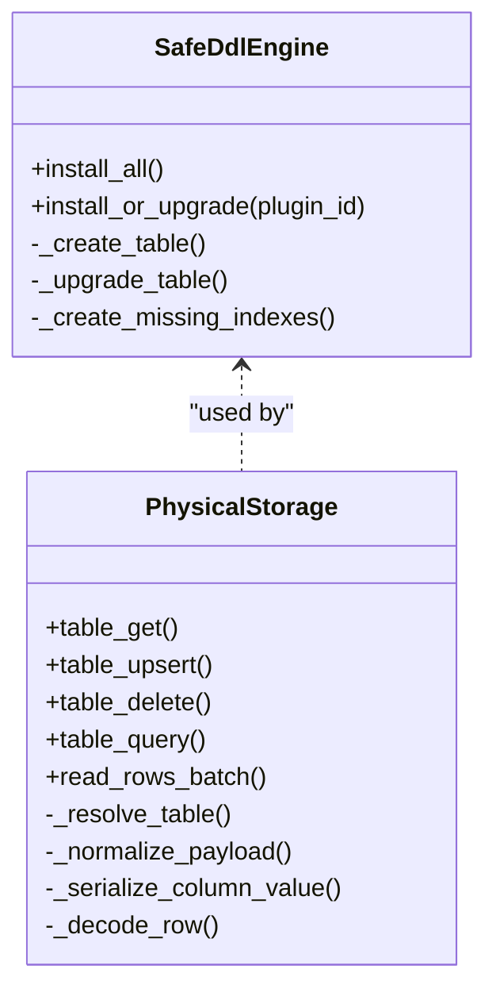
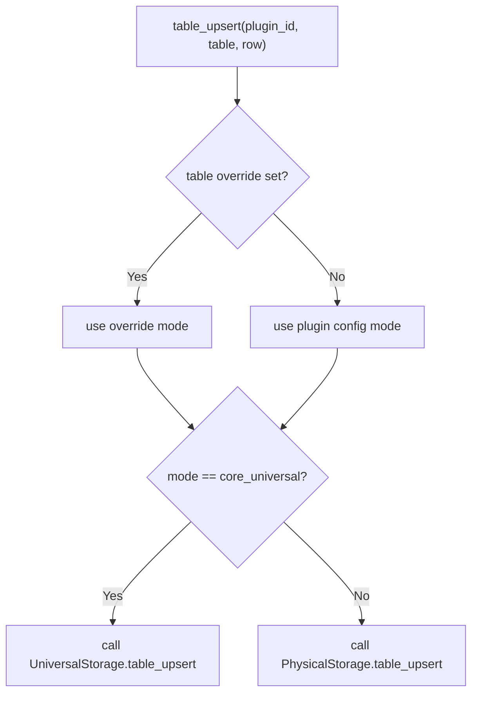
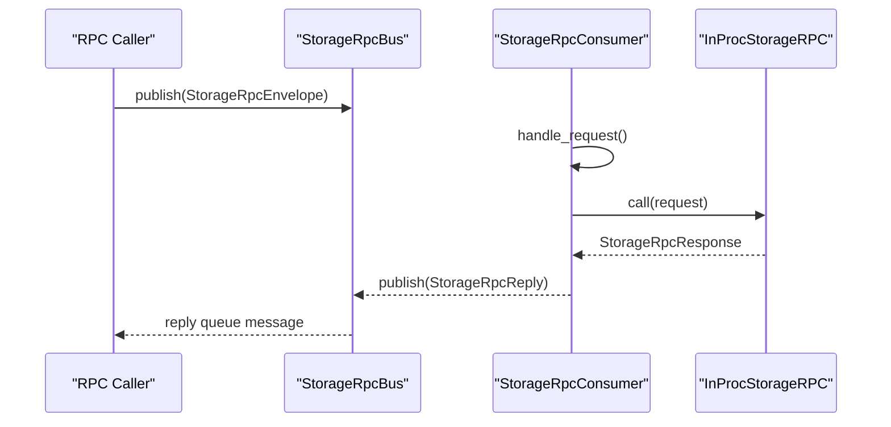
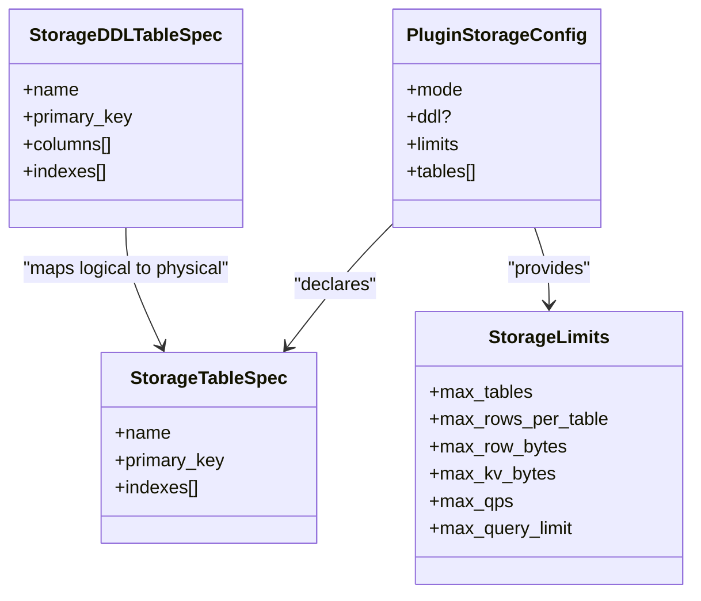
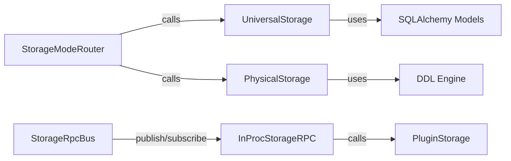

# Universal Storage Implementation

<cite>
**Referenced Files in This Document**
- [universal.py](file://core/storage/universal.py)
- [physical.py](file://core/storage/physical.py)
- [router.py](file://core/storage/router.py)
- [protocols.py](file://core/storage/protocols.py)
- [models.py](file://core/storage/models.py)
- [errors.py](file://core/storage/errors.py)
- [rpc.py](file://core/storage/rpc.py)
- [rpc_bus.py](file://core/storage/rpc_bus.py)
- [container.py](file://config/container.py)
- [settings.py](file://config/settings.py)
- [storage.py](file://core/bus/storage.py)
- [storage.py](file://api/v1/store.py)
- [storage.py](file://core/plugins/store.py)
- [storage.py](file://core/events/sse.py)
- [storage.py](file://core/gateway/service.py)
- [storage.py](file://core/bus/actions.py)
- [storage.py](file://core/bus/constants.py)
- [storage.py](file://core/bus/quota.py)
- [storage.py](file://core/bus/storage.py)
- [storage.py](file://core/bus/protocols.py)
- [storage.py](file://core/bus/broker.py)
- [storage.py](file://core/bus/bus.py)
- [storage.py](file://core/bus/sse.py)
- [storage.py](file://core/events/broker.py)
- [storage.py](file://core/events/bus.py)
- [storage.py](file://core/events/protocols.py)
- [storage.py](file://core/events/sse.py)
- [storage.py](file://core/security/deps.py)
- [storage.py](file://core/plugins/migrations/locks.py)
- [storage.py](file://core/plugins/migrations/registry.py)
- [storage.py](file://core/plugins/migrations/runner.py)
- [storage.py](file://core/plugins/router.py)
- [storage.py](file://core/plugins/schemas.py)
- [storage.py](file://core/plugins/service.py)
- [storage.py](file://core/plugins/store.py)
- [storage.py](file://core/plugins/page_manifest.py)
- [storage.py](file://core/plugins/loader.py)
- [storage.py](file://core/plugins/registry.py)
- [storage.py](file://core/plugins/migrations/locks.py)
- [storage.py](file://core/plugins/migrations/registry.py)
- [storage.py](file://core/plugins/migrations/runner.py)
- [storage.py](file://core/plugins/router.py)
- [storage.py](file://core/plugins/schemas.py)
- [storage.py](file://core/plugins/service.py)
- [storage.py](file://core/plugins/store.py)
- [storage.py](file://core/plugins/page_manifest.py)
- [storage.py](file://core/plugins/loader.py)
- [storage.py](file://core/plugins/registry.py)
- [storage.py](file://core/plugins/migrations/locks.py)
- [storage.py](file://core/plugins/migrations/registry.py)
- [storage.py](file://core/plugins/migrations/runner.py)
- [storage.py](file://core/plugins/router.py)
- [storage.py](file://core/plugins/schemas.py)
- [storage.py](file://core/plugins/service.py)
- [storage.py](file://core/plugins/store.py)
- [storage.py](file://core/plugins/page_manifest.py)
- [storage.py](file://core/plugins/loader.py)
- [storage.py](file://core/plugins/registry.py)
- [storage.py](file://core/plugins/migrations/locks.py)
- [storage.py](file://core/plugins/migrations/registry.py)
- [storage.py](file://core/plugins/migrations/runner.py)
- [storage.py](file://core/plugins/router.py)
- [storage.py](file://core/plugins/schemas.py)
- [storage.py](file://core/plugins/service.py)
- [storage.py](file://core/plugins/store.py)
- [storage.py](file://core/plugins/page_manifest.py)
- [storage.py](file://core/plugins/loader.py)
- [storage.py](file://core/plugins/registry.py)
- [storage.py](file://core/plugins/migrations/locks.py)
- [storage.py](file://core/plugins/migrations/registry.py)
- [storage.py](file://core/plugins/migrations/runner.py)
- [storage.py](file://core/plugins/router.py)
- [storage.py](file://core/plugins/schemas.py)
- [storage.py](file://core/plugins/service.py)
- [storage.py](file://core/plugins/store.py)
- [storage.py](file://core/plugins/page_manifest.py)
- [storage.py](file://core/plugins/loader.py)
- [storage.py](file://core/plugins/registry.py)
- [storage.py](file://core/plugins/migrations/locks.py)
- [storage.py](file://core/plugins/migrations/registry.py)
- [storage.py](file://core/plugins/migrations/runner.py)
- [storage.py](file://core/plugins/router.py)
- [storage.py](file://core/plugins/schemas.py)
- [storage.py](file://core/plugins/service.py)
- [storage.py](file://core/plugins/store.py)
- [storage.py](file://core/plugins/page_manifest.py)
- [storage.py](file://core/plugins/loader.py)
- [storage.py](file://core/plugins/registry.py)
- [storage.py](......)
</cite>

## Table of Contents
1. [Introduction](#introduction)
2. [Project Structure](#project-structure)
3. [Core Components](#core-components)
4. [Architecture Overview](#architecture-overview)
5. [Detailed Component Analysis](#detailed-component-analysis)
6. [Dependency Analysis](#dependency-analysis)
7. [Performance Considerations](#performance-considerations)
8. [Troubleshooting Guide](#troubleshooting-guide)
9. [Conclusion](#conclusion)
10. [Appendices](#appendices)

## Introduction
This document describes the universal storage implementation that provides a unified abstraction for accessing storage across different backend modes. It covers the key-value and table APIs, query interface, rate limiting and limits, serialization strategies, and integration with the storage mode router. It also documents storage contract compliance, consistency guarantees, transaction handling, and error propagation mechanisms.

## Project Structure
The universal storage subsystem is organized around a small set of cohesive modules:
- Protocols define the PluginStorage interface and RPC contracts.
- UniversalStorage provides a JSON-backed, relational schema for key-value and table storage.
- PhysicalStorage provides a strict schema-on-write backend using DDL specifications.
- StorageModeRouter selects between backends per plugin and per table.
- RPC clients and bus integration enable cross-process invocation.
- Container wiring initializes engines, configs, and wires components.

**Diagram sources**
- [protocols.py:9-34](file://core/storage/protocols.py#L9-L34)
- [universal.py:85-499](file://core/storage/universal.py#L85-L499)
- [physical.py:288-782](file://core/storage/physical.py#L288-L782)
- [router.py:13-120](file://core/storage/router.py#L13-L120)
- [rpc.py:65-499](file://core/storage/rpc.py#L65-L499)
- [rpc_bus.py:8-40](file://core/storage/rpc_bus.py#L8-L40)
- [errors.py:4-40](file://core/storage/errors.py#L4-L40)

**Section sources**
- [container.py:252-427](file://config/container.py#L252-L427)
- [settings.py:14-128](file://config/settings.py#L14-L128)

## Core Components
- PluginStorage protocol defines the uniform API surface for KV and table operations.
- UniversalStorage implements a single relational schema with plugin-scoped isolation, JSON serialization, and index rows for query support.
- PhysicalStorage materializes DDL-defined tables and enforces strict schema and types.
- StorageModeRouter routes operations to either backend depending on plugin/table configuration and migration state.
- RPC stack enables local and bus-based invocation of storage operations.
- Errors unify failure semantics across backends.

**Section sources**
- [protocols.py:9-34](file://core/storage/protocols.py#L9-L34)
- [universal.py:85-499](file://core/storage/universal.py#L85-L499)
- [physical.py:288-782](file://core/storage/physical.py#L288-L782)
- [router.py:13-120](file://core/storage/router.py#L13-L120)
- [rpc.py:65-499](file://core/storage/rpc.py#L65-L499)
- [errors.py:4-40](file://core/storage/errors.py#L4-L40)

## Architecture Overview
The system exposes a single PluginStorage interface. At runtime, StorageModeRouter decides whether to delegate to UniversalStorage or PhysicalStorage. Operations are executed inside transactions with rate limiting and per-plugin limits enforced. RPC clients can invoke storage operations locally or across the message bus.

**Diagram sources**
- [router.py:45-48](file://core/storage/router.py#L45-L48)
- [universal.py:189-297](file://core/storage/universal.py#L189-L297)
- [physical.py:416-474](file://core/storage/physical.py#L416-L474)

## Detailed Component Analysis

### UniversalStorage
- Purpose: Provides a unified, plugin-scoped storage backend using a shared relational schema.
- Key-value operations:
  - kv_get: reads JSON value, respects secret flag.
  - kv_set: serializes value to canonical JSON, enforces max_kv_bytes.
  - kv_delete: removes key.
- Table operations:
  - table_get: retrieves JSON payload by canonical primary key.
  - table_upsert/migration_table_upsert: inserts or updates row, enforces row bytes and per-table row counts, rebuilds indexes.
  - table_delete: removes row and associated index entries.
  - table_query: intersection of index candidates for allowed fields (primary key and declared indexes), returns ordered results clamped by max_query_limit.
  - read_rows_batch: streaming read with optional after_pk cursor.
- Serialization:
  - Canonical JSON normalization and stable sorting for determinism.
  - Values stored as TEXT; JSON payloads parsed on read.
- Limits and rate limiting:
  - Enforced via per-plugin StorageLimits.
  - Token-bucket rate limiter per plugin/op.
- Transactions:
  - All write operations run inside a transaction.
- Indexing:
  - Separate index table stores index_name/index_value/pk tuples for supported fields.

**Diagram sources**
- [universal.py:189-297](file://core/storage/universal.py#L189-L297)

**Section sources**
- [universal.py:100-166](file://core/storage/universal.py#L100-L166)
- [universal.py:167-187](file://core/storage/universal.py#L167-L187)
- [universal.py:189-297](file://core/storage/universal.py#L189-L297)
- [universal.py:299-324](file://core/storage/universal.py#L299-L324)
- [universal.py:326-398](file://core/storage/universal.py#L326-L398)
- [universal.py:413-444](file://core/storage/universal.py#L413-L444)
- [models.py:90-137](file://core/storage/models.py#L90-L137)

### PhysicalStorage
- Purpose: Enforces strict schema and types using DDL specifications.
- DDL engine:
  - Creates and upgrades tables safely, adding missing columns and indexes.
  - Prevents destructive changes and enforces primary key constraints.
- Table resolution:
  - Resolves logical table to physical table name and caches Table objects.
- Type serialization:
  - Validates and normalizes values according to DDL types (string, integer, number, boolean, json, datetime).
  - JSON fields support scalar equality queries only.
- Limits and rate limiting:
  - Same per-plugin limits and token-bucket enforcement as UniversalStorage.
- Transactions:
  - Write operations run inside transactions.

**Diagram sources**
- [physical.py:126-286](file://core/storage/physical.py#L126-L286)
- [physical.py:288-782](file://core/storage/physical.py#L288-L782)

**Section sources**
- [physical.py:328-394](file://core/storage/physical.py#L328-L394)
- [physical.py:395-414](file://core/storage/physical.py#L395-L414)
- [physical.py:416-474](file://core/storage/physical.py#L416-L474)
- [physical.py:476-487](file://core/storage/physical.py#L476-L487)
- [physical.py:489-528](file://core/storage/physical.py#L489-L528)
- [physical.py:535-561](file://core/storage/physical.py#L535-L561)
- [physical.py:563-578](file://core/storage/physical.py#L563-L578)
- [physical.py:636-750](file://core/storage/physical.py#L636-L750)

### StorageModeRouter
- Purpose: Routes operations to the appropriate backend based on plugin configuration and per-table overrides.
- Modes:
  - core_universal: routes to UniversalStorage.
  - core_physical_tables: routes to PhysicalStorage.
- Overrides:
  - Per-table mode override allows selective routing even when plugin defaults differ.
- Write protection:
  - During migrations, writes to locked tables are denied.

**Diagram sources**
- [router.py:66-107](file://core/storage/router.py#L66-L107)

**Section sources**
- [router.py:13-120](file://core/storage/router.py#L13-L120)

### RPC and Bus Integration
- InProcStorageRPC: Local dispatch to a PluginStorage implementation.
- BusStorageRPC: Publishes requests to a queue and waits for replies with timeout.
- StorageRpcConsumer: Consumes requests from the bus, validates capabilities, and delegates to InProcStorageRPC.
- StorageRpcBus: In-memory pub/sub transport for RPC envelopes.

**Diagram sources**
- [rpc.py:246-458](file://core/storage/rpc.py#L246-L458)
- [rpc_bus.py:8-40](file://core/storage/rpc_bus.py#L8-L40)

**Section sources**
- [rpc.py:65-499](file://core/storage/rpc.py#L65-L499)
- [rpc_bus.py:8-40](file://core/storage/rpc_bus.py#L8-L40)

### Contracts and Configuration
- StorageLimits: Enforces max_tables, max_rows_per_table, max_row_bytes, max_kv_bytes, max_qps, max_query_limit.
- StorageTableSpec: Declares logical table schema (primary key, indexes).
- StorageDDLSpec: Defines physical schema (columns, indexes) for PhysicalStorage.
- PluginStorageConfig: Binds mode, DDL, limits, and logical tables per plugin.
- Container wiring: Builds UniversalStorage, PhysicalStorage, StorageModeRouter, and RPC bus components.

**Diagram sources**
- [storage.py:10-146](file://core/contracts/storage.py#L10-L146)

**Section sources**
- [storage.py:10-192](file://core/contracts/storage.py#L10-L192)
- [container.py:180-222](file://config/container.py#L180-L222)
- [container.py:252-427](file://config/container.py#L252-L427)

## Dependency Analysis
- Coupling:
  - Router depends on PluginStorage protocol and lock manager.
  - UniversalStorage and PhysicalStorage depend on async sessions and SQLAlchemy models.
  - RPC stack depends on StorageRpcBus and StorageRpcRequest/Response.
- Cohesion:
  - Each module encapsulates a single responsibility: protocol, universal, physical, routing, RPC, models, errors.
- External dependencies:
  - SQLAlchemy async ORM and engine.
  - Pydantic for configuration validation.
  - Optional AMQP-based bus via BrokerStorageRPC.

**Diagram sources**
- [router.py:94-107](file://core/storage/router.py#L94-L107)
- [universal.py:85-99](file://core/storage/universal.py#L85-L99)
- [physical.py:288-317](file://core/storage/physical.py#L288-L317)
- [rpc.py:65-321](file://core/storage/rpc.py#L65-L321)
- [rpc_bus.py:8-40](file://core/storage/rpc_bus.py#L8-L40)

**Section sources**
- [router.py:13-120](file://core/storage/router.py#L13-L120)
- [universal.py:85-499](file://core/storage/universal.py#L85-L499)
- [physical.py:288-782](file://core/storage/physical.py#L288-L782)
- [rpc.py:65-499](file://core/storage/rpc.py#L65-L499)
- [rpc_bus.py:8-40](file://core/storage/rpc_bus.py#L8-L40)

## Performance Considerations
- Rate limiting:
  - Token-bucket limiter per plugin/op prevents overload.
- Query limits:
  - Max query limit clamps result sets.
- Serialization overhead:
  - Canonical JSON normalization adds CPU cost; keep payloads reasonable.
- Indexing:
  - UniversalStorage maintains separate index rows; ensure only frequently queried fields are indexed.
  - PhysicalStorage uses native indexes; ensure DDL indexes match query patterns.
- Transactions:
  - Writes are transactional; batch operations can reduce contention.
- Network latency:
  - RPC over bus introduces latency; prefer local InProcStorageRPC for intra-service calls.

[No sources needed since this section provides general guidance]

## Troubleshooting Guide
Common errors and their likely causes:
- StorageQueryNotAllowed:
  - Invalid fields, unsupported operations, missing required fields, or attempting to query non-indexed fields.
- StorageLimitExceeded:
  - Row or value size exceeds configured limits; too many rows per table; too many tables for plugin.
- StorageRateLimited:
  - Exceeded QPS limit for plugin/op.
- StorageRpcTimeout:
  - Bus RPC did not receive a timely response.

Operational checks:
- Verify plugin mode and table overrides in StorageModeRouter.
- Confirm DDL correctness for PhysicalStorage tables.
- Review logs for raised exceptions and their error codes.

**Section sources**
- [errors.py:4-40](file://core/storage/errors.py#L4-L40)
- [universal.py:446-467](file://core/storage/universal.py#L446-L467)
- [physical.py:633-634](file://core/storage/physical.py#L633-L634)
- [rpc.py:273-277](file://core/storage/rpc.py#L273-L277)

## Conclusion
The universal storage implementation provides a consistent, contract-compliant abstraction across two distinct backends. It enforces strong limits and rate controls, offers robust serialization, and integrates cleanly with routing and RPC layers. Correct configuration of plugin storage modes, DDL, and limits ensures predictable performance and reliability.

[No sources needed since this section summarizes without analyzing specific files]

## Appendices

### API Surface Summary
- Key-value:
  - kv_get(plugin_id, key, secret=False) -> Any | None
  - kv_set(plugin_id, key, value, secret=False) -> None
  - kv_delete(plugin_id, key) -> bool
- Table:
  - table_get(plugin_id, table, pk) -> dict[str, Any] | None
  - table_upsert(plugin_id, table, row) -> dict[str, Any]
  - table_delete(plugin_id, table, pk) -> bool
  - table_query(plugin_id, table, where, limit=None) -> list[dict[str, Any]]
  - read_rows_batch(plugin_id, table, batch_size, after_pk=None) -> list[tuple[str, dict[str, Any]]]
  - count_table_rows(plugin_id, table) -> int

**Section sources**
- [protocols.py:9-34](file://core/storage/protocols.py#L9-L34)
- [universal.py:100-444](file://core/storage/universal.py#L100-L444)
- [physical.py:328-561](file://core/storage/physical.py#L328-L561)

### Configuration Options
- PluginStorageConfig:
  - mode: core_universal | core_physical_tables
  - ddl: StorageDDLSpec (required for physical mode)
  - limits: StorageLimits
  - tables: list of StorageTableSpec
- StorageLimits:
  - max_tables, max_rows_per_table, max_row_bytes, max_kv_bytes, max_qps, max_query_limit
- Runtime settings:
  - storage_rpc_timeout_sec affects bus RPC timeouts.

**Section sources**
- [storage.py:108-146](file://core/contracts/storage.py#L108-L146)
- [storage.py:10-17](file://core/contracts/storage.py#L10-L17)
- [settings.py:57-58](file://config/settings.py#L57-L58)
- [container.py:180-222](file://config/container.py#L180-L222)

### Integration Patterns
- Local usage:
  - Inject StorageModeRouter and call operations directly.
- Remote usage:
  - Use BusStorageRPC to send StorageRpcRequest messages.
- Migration safety:
  - Use migration_table_upsert variants to bypass rate limiting during migrations.
  - Use table mode overrides to isolate problematic tables.

**Section sources**
- [router.py:45-53](file://core/storage/router.py#L45-L53)
- [router.py:109-117](file://core/storage/router.py#L109-L117)
- [universal.py:197-203](file://core/storage/universal.py#L197-L203)
- [physical.py:424-430](file://core/storage/physical.py#L424-L430)